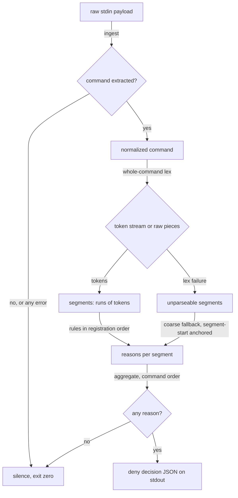
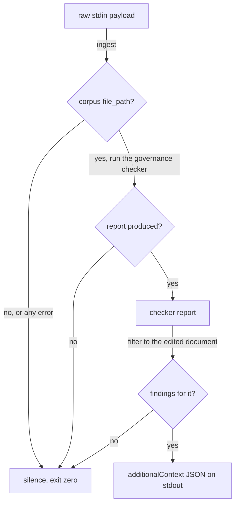
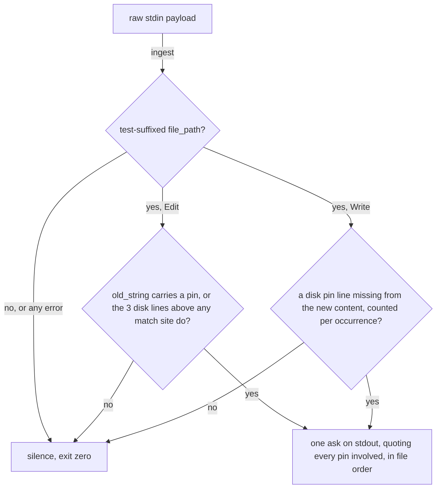

# Architecture — the hook layer

> Written Phase 0, before implementation. The Refactor step is held against this
> document — not what the code does, but what shape it takes. This sketch covers
> the governance-guard; later tool hooks add their own sketch amendments here,
> reviewed at their own gates, before implementation.

## Architectural Sketch

### Execution phases

1. **Ingest** (fail-open boundary) — the payload is read and its command
   extracted; anything unreadable or absent ends in silence. Input: raw stdin
   bytes. Output: a command string, or an early silent exit.

2. **Normalize** (pure) — backslash-newline continuations are joined, then every
   UNQUOTED newline becomes a `;` separator (a quote-state scan keeps newlines
   inside quoted strings intact), so the lexer sees one line and the quoted
   multi-line message stays one token. The continuation join is textual, quoted
   content included — an accepted lossiness. Input: command string. Output:
   normalized command.

3. **Lex** (pure) — the whole normalized command lexes into tokens, shell
   operators preserved as operator tokens; comment stripping is disabled (bash
   treats a mid-word `#` as literal, and so does this lex — no silent content
   loss). On lex failure the fallback is a raw-string split on the operator set,
   and **each raw piece is re-lexed individually** — one malformed segment never
   demotes its well-formed neighbours to the coarse fallback (segment-local
   judgment); only pieces that still fail to lex carry the unparseable marker.
   Input: normalized command. Output: a token stream, or re-lexed pieces plus
   marked unparseable pieces.

4. **Segment** (pure) — the token stream splits at operator tokens into segments
   (runs of tokens); unparseable raw pieces pass through as unparseable
   segments. A quoted multi-line string is one token and can never split — the
   false-deny class on commit messages that quote forbidden commands is
   structurally absent. Input: token stream or raw pieces. Output: ordered
   segments.

5. **Judge** (pure, per segment) — input: a segment — tokens, or an unparseable
   raw piece. Rules run in registration order over the tokens; an unparseable
   segment is judged only by the coarse fallback, anchored to the segment start.
   **Every rule that matches contributes its reason**; nothing short-circuits.
   Output: the segment's reasons (possibly none).

6. **Decide** (single output) — all reasons from all segments aggregate,
   segments in command order and rules in registration order, into one decision:
   a deny carrying every self-teaching reason and corrected command, or silence.
   Exit 0 on every path.

### Data flow

### Sketch amendment — the governance-advisory pipeline (PostToolUse)

A second, simpler pipeline shares the fail-open boundary but nothing else: on a
PostToolUse Edit/Write payload whose `file_path` is a governance-corpus
document, the hook runs the governance checker (`npm run check:governance`'s
entry) and relays ONLY the edited document's findings back to the agent as
`hookSpecificOutput.additionalContext` — a non-blocking advisory channel, never
a deny. Exit 0 on every path; a checker FAILURE, a non-corpus path, or a
malformed payload all end in silence — and **"failure" means the checker
produced no report** (spawn failure, timeout, empty or unparseable stdout); the
checker's exit code is never consulted, because exit 1 WITH a report is its
normal error-findings state and must be relayed. The corpus test is an in-script
mirror of the checker's own classifier (kept deliberately tiny; the checker
remains the authority; drift in either direction degrades to SILENCE for the
drifted documents, never a false advisory — the suite pins mirror-vs-authority
agreement over a fixed path list). Accepted limitation: findings an edit causes
in a SIBLING document are attributed to that sibling and are not relayed — the
full-corpus view belongs to running the checker itself. Accepted cost: one full
checker run per corpus edit, measured 0.6s (2026-07-29), bounded by a 30-second
ceiling — a hung checker stalls the edit round-trip at most that long, then
silence. The checker command is injected via `GOVERNANCE_ADVISORY_CMD` so the
tests never shell to the real corpus.

### Sketch amendment — the pinned-guard pipeline (PreToolUse)

A third pipeline, sharing only the fail-open boundary: on a PreToolUse
Edit/Write payload whose `file_path` carries a test suffix (`**/*.test.ts` or
`**/*.test.tsx` — suffix-only, the same scope as DEV.md § Pinned expectations'
inventory one-liner, so guard scope and inventory scope cannot drift), the hook
asks — never denies — before an edit erases a pinned expectation
(`// PINNED(<reason>)`, DEV.md § Pinned expectations). `ask` prevents the
erasure AND routes it to the human; a deny would recreate the bootstrap deadlock
that killed the earlier surface-guard design (a pin could never be legitimately
changed). What it mechanises is the ERASURE face of "never invert without human
sign-off" — two stated limits frame that honestly: a Write that keeps every
marker verbatim while rewriting the assertions beneath them is unguarded
(inversion-without-erasure stays with reviewers), and the Edit check
deliberately asks BROADER than erasure (any touch near a pin), failing toward
ask.

An Edit asks when its `old_string` contains a pin marker, or when the **3
on-disk lines directly above a match site** carry one — 3 is contract, sized to
span a multi-line settled assertion (an edit deeper inside a longer pinned
assertion is a stated residual miss); EVERY match site is checked (`replace_all`
or not), and any pinned site asks. If the on-disk read fails, the judgment
degrades to the `old_string`-only check — a verdict already in hand is never
discarded (a designed degradation, distinct from the exception→silence
boundary). A Write asks when the ON-DISK file carries a pin line the new content
drops — the comparison is a MULTISET of exact marker-line texts, per occurrence:
the new content must carry each pin line at least as many times as the disk
baseline, so erasing one of two duplicate pins still asks, and REWORDING a pin's
reason asks too (the old ruling's text is gone; judging a rewording faithful
would be intent judgment — out of scope by this layer's own rule). Marker-line
comparison strips leading/trailing whitespace — re-indentation alone never asks
— and disk reads decode UTF-8 with undecodable bytes REPLACED, never aborting
the judgment: a corrupted pin line simply cannot be matched by new content,
which fails toward ask. The on-disk baseline — not `git show HEAD:` — is
deliberate: a pin is settled when PLANTED, and the seeding discipline plants at
AR resolutions mid-increment, exactly the uncommitted window a `HEAD` baseline
is blind to; it also gives Edit and Write one shared disk read with no git
dependency, and a Write to a path absent on disk (the ordinary new-test-file
red-stub path) finds vacuously no pins and stays silent. One ask per invocation,
quoting EVERY erased or touched pin in file order (the layer's
aggregate-everything law). The matcher roster (`Edit|Write`) is
documented-not-enumerated: the live edit-tool enumeration probe was
classifier-blocked this campaign (Wave P ledger); current Claude Code
documentation names Edit, Write, and NotebookEdit as the file-modifying tools,
and NotebookEdit cannot produce a test-suffixed path.

### Structural constraints

- **Fail-open, always**: exit 0 on every path; a deny exists only as JSON on
  stdout. An exception anywhere yields silence, never a block. This is a
  deliberate, scoped inversion of the house fail-fast default — the human's
  workflow outranks guard coverage; `src/` code keeps failing loud.
- **Deterministic judgment**: rules run in a fixed registration order per
  segment; segments are judged in command order; the aggregated decision is
  reproducible. Rule attribution in tests asserts each rule's named reason, and
  all-matched reporting removes any coupling between rule order and which
  correction an agent is taught.
- **Rules are declarative rows where the shape allows** (name, invocation
  basenames, optional git-subcommand scope, forbidden flags with a per-row match
  mode — prefix for a flag FAMILY, exact-or-`=` where an unrelated real flag
  shares the prefix — and reason) sharing one judging implementation. Subcommand
  scoping is meaningful only for git rows; the suite statically asserts that
  constraint. Two rules are bespoke logic by necessity: `commit-pathspec`
  (multi-condition) and `markdownlint-globs` (conditional on flag ABSENCE — a
  shape rows cannot express). Adding a flag-shaped rule is a data edit, not a
  new predicate.
- **shlex before any matching**: no rule ever scans the raw command string — a
  commit message _about_ the pathspec rule legitimately contains `--`, and a
  naive scan would pass or deny on prose. The coarse fallback fires only on lex
  failure and only anchored to the segment start.
- **Known, accepted limitation — heredoc bodies**: a heredoc arrives inside the
  command and its body is judged as command content; a body line shaped like a
  denied command can false-deny. Accepted: reasons are self-teaching, and file
  content belongs in the Write/Edit tools, not Bash heredocs. The first rule's
  tests pin this behavior explicitly.
- **Known, accepted limitation — flag-vs-value**: the any-position flag scan
  cannot tell a forbidden flag from a preceding flag's VALUE that happens to
  start with the same characters. Accepted per the momentum threat model — real
  path/glob values essentially never begin with a literal `--fix` — and pinned
  by a documented test case.
- **No hook reads test results or lint results as a gate**: the workflow
  mandates a failing test, a lint-red stub, and `any` placeholders; a guard
  firing on those fires on correct work. Quality-tool output reaches agents only
  through non-blocking advisory hooks. (The pinned-guard reads test FILE CONTENT
  — source text — never test RESULTS; source text is not tool output, so it sits
  outside this constraint.)
- **Segment-local judgment**: no state across segments, no state across
  invocations, no stored baselines — nothing to rot.
- **Self-teaching reasons**: every reason prints the corrected command; the
  `commit-pathspec` reason also carries the working-tree-vs-staged caveat (a
  pathspec commit takes working-tree content — check `git status --short` on
  your paths first).
- **One hook, many rules — by design**: one process per Bash call, one
  segmentation implementation, and denies are order-independent across hooks
  anyway. Splitting per rule would multiply processes for no isolation gain.

### Out of scope

- **Intent judgment** — whether a red test is deliberate, whether an AR
  happened, whether an increment is "mechanical": reviewers and ceremony own
  those; no rule here infers intent.
- **Child processes** — hooks see the command line, never what it spawns; the
  sanctioned autofix script passes by construction because its own command line
  carries no eslint invocation.
- **Determined bypass** — shell wrappers (`bash -c`), aliasing, encoding,
  command substitution. The threat model is agent momentum, not malice (README §
  Threat model); closing bypass would be an unwinnable arms race inside a
  fail-open guard.
- **Bash-mediated file edits** — `sed -i` or shell redirection over a test file
  erases a pin with no Edit/Write payload ever fired: a different tool channel
  than the Bash guard's evasion item above. Accepted per the momentum threat
  model — this layer's own culture routes file content through Write/Edit, never
  Bash.
- **Post-lex shell semantics** — the guard judges the string the agent typed,
  never what the shell makes of it afterwards: an unquoted glob the shell would
  expand before the tool runs is judged as the glob that was typed.
  Pre-execution visibility is the hook contract; runtime expansion is the
  shell's.
- **Non-commit destructive git shapes** (`push`, `reset`, `rebase`, …) — owned
  by the user-global destructive-git sibling, which is machine-local; this hook
  covers the commit shapes (including `--amend`) so the repo's own guarantee is
  self-contained on a fresh checkout.
