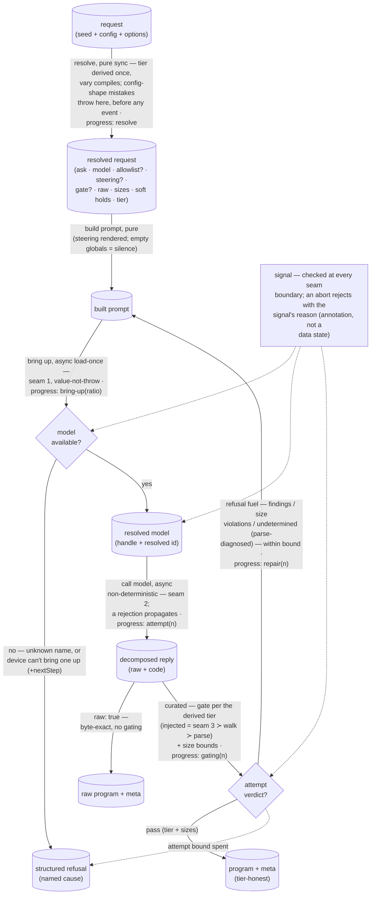

<!-- cspell:ignore aithor unparseable ungated unioned -->

# aithor — PROPOSED Architecture & Decisions (design dossier, pre-ratification)

> **Dossier artifact — not the live sketch.** The full proposed `DOCS.md` for
> the aithor module after the seven contract proposals land (wave map:
> `./SEQUENCING.md`). The committed `aithor/DOCS.md` is untouched until
> ratification.

---

# aithor — Architecture & Decisions

> Architectural sketch — the structural target the module's implementation is
> held against.

The pedagogy — the quad, the config→quadrant mappings — lives in the README;
this sketch covers only the module's own structure. One operation,
`aithor(program, config, runtime?, options?)`, shapes a program to a config
seeded by an input program. The point of the sketch is to keep the module's
impure points on the far side of named seams so everything else stays data-in,
data-out.

**Three impure seams, not two.** The committed sketch isolated two impure points
(the stateful loader, the non-deterministic model call). This design adds a
third, deliberately: the **injected gate** — async, consumer-owned, and free to
embody or even execute a candidate. The two-seam constraint is **amended, not
preserved**; the sketch says so rather than smuggling the third seam in as a
detail.

## Execution phases

Six phases, cut by structural seam — every impure point owns a phase boundary:

- **Request resolution** — input: a request (seed + config); output: the
  **resolved request** — the ask and model name carried through, the effective
  allowlist or its absence, the steering text, the gate or its absence, the raw
  flag, the size bounds, the held soft aspects, and the **derived tier** — or a
  thrown request error. **Pure, sync — the only place aithor itself throws.**
  The correctness tier is derived **once, here**, from the filled slots
  (injected ≻ walk ≻ parse) and carried on the resolved request — the single
  source the result's meta reports, and the by-construction guarantee of one
  tier per attempt. A `vary` declaring aspects compiles down here: a held
  `syntax` reads the seed's node-type inventory through the leaf's published
  parse settings and unions the leaf's structural floor; a held `size` reads the
  seed's measures; soft holds become the held-aspect list. Three config-shape
  mistakes throw before any model is reached — the raw-beside-gate contradiction
  (a gate cannot be steered, so there is no honest downgrade), a `vary`
  declaring an aspect beside a hand-set allowlist or size bound, and a hard hold
  with no seed to read off — and a throwing request emits **no progress event**
  (the `resolve` event fires on successful resolution only). Resolution runs
  **once**; the repair loop re-enters downstream, never here.
- **Prompt construction** — input: the resolved request (+ repair fuel on a
  repair turn); output: a built prompt. **Pure, sync.** Steering renders here:
  the consumer's steering text verbatim when supplied, else the mechanical
  rendering of the allowlist's node types; the admitted-globals clause (omitted
  entirely when the set is empty — silence, never a prohibition); the size
  clauses; the held-soft-aspect block; and, on a repair turn, the refused
  candidate with its repair fuel. Independent of the raw flag — the prompt is
  built the same way on either path.
- **Model bring-up** — input: a model name (+ the per-call progress relay);
  output: the resolved model (handle + resolved id) or a bring-up refusal.
  **Async, stateful (seam 1 — load-once).** The value-not-throw boundary: the
  catalog-membership pre-check turns a non-empty unknown name into the
  unknown-model refusal before the runtime is called; the runtime's load failure
  maps to no-model-available with its next-step category; any propagated
  infrastructure fault folds to no-model-available bare. The loader seam relays
  the runtime's one-time-fetch reporting, so the `bring-up` progress event
  carries the fetch ratio when the runtime reports one.
- **Candidate generation** — input: a built prompt + the model handle; output:
  the decomposed reply (byte-exact raw + extracted code). **Async,
  non-deterministic (seam 2 — the model call).** A rejected model call
  **propagates** — an infrastructure fault, the same layer as a throwing gate;
  the value-not-throw commitment is scoped to bring-up outcomes and gate
  verdicts, never to seam faults.
- **Candidate gating** — input: the decomposed reply + the resolved request;
  output: an **attempt verdict** — pass, or refusal fuel (gate findings,
  structured size violations, or the undetermined diagnosis). **Async when the
  tier is injected (seam 3 — consumer-owned, may embody and execute); pure and
  sync on the walk and parse tiers.** Skipped entirely under `raw`. The resolved
  request's tier says which correctness gate runs — the injected gate, the
  leaf's default-deny walk over the allowlist's node table, or the published
  parse settings alone — and the **size-bounds check runs beside every tier**. A
  gate's `undetermined` verdict is diagnosed here by aithor's own parse into
  located repair fuel. A throwing injected gate propagates.
- **Disposition** — input: the attempt verdict (+ resolved request); output: a
  program + meta, the next repair turn, or a refusal. **Pure.** Under `raw` the
  byte-exact reply is returned unmodified beside meta — no gating happened, one
  call, done. On the curated path a pass is shaped into a result whose meta
  names the resolved model, the attempt count, and (proposed) the tier that
  gated; refusal fuel routes to a repair turn within the fixed attempt bound;
  the spent bound shapes the curated-only exhaustion refusal.

## Data flow

The resolved model is named once at bring-up and flows to both success terminals
— every result's meta names that id, curated or raw. The repair edge returns to
prompt construction, seeded with the refused candidate and its located fuel;
`repair(n)` carries the number of the attempt that was refused. The three
refusal causes converge on one refusal node; the next-step category is an
attribute of the structured no-model-available refusal, not a separate state.
The `signal` box is deliberately an annotation, not a data state (stated here
because Mermaid renders every identifier as a node): its dashed edges mark the
abandonment points — an aborted request rejects with the signal's reason and
produces no data.

Progress order per path — curated:
`resolve → bring-up → (attempt → gating → repair?)…` where the final `gating` is
followed by a result or the exhaustion refusal, not a `repair`; raw:
`resolve → bring-up → attempt`. A config-shape throw precedes every event.

### Vary resolution (the request-shaping prelude)

Unchanged in shape from the committed sketch: a pure, synchronous prelude that
compiles a declared `vary` into the same primitives a hand-set request carries,
resolved once before bring-up, mutually exclusive with hand-set constraints by a
config-shape throw. What changed is the vocabulary it compiles into: a held
`syntax` (formerly `languageLevel`) produces a node-type allowlist — the seed's
inventory unioned with the leaf's structural floor — rather than a feature
subset, and the empty-inventory exclude-all idiom is gone (a parseable seed's
inventory is never empty; the floor supplies the scaffolding types the inventory
omits — not every type a variation might need, which the inventory cannot know).
The seed measurement parses with the leaf's published settings — the same
configuration the walk tier gates by, never a parallel one. The parse-failure
policy split survives: the walk tier tolerates an unparseable candidate (a
located finding), while the vary resolver throws on a hard hold with no
parseable seed — there is no AST to inventory.

## Structural constraints

- **Three seams are the only impure points** (amended from the committed two):
  the stateful loader (seam 1), the non-deterministic model call (seam 2), and
  the injected gate (seam 3 — async, consumer-owned, may embody and execute).
  Everything else — resolution and tier derivation, prompt construction, the
  walk and parse tiers, the size check, the loop, result shaping, refusal-cause
  selection — is pure given the three injected.
- **The tier is derived once, at resolution, and carried.** One tier per attempt
  holds by construction; the result's meta reports the same derived value, never
  a re-derivation.
- **An injected gate is complete and final.** The walk never pre-runs under it —
  a brokenness profile would be "repaired" into correctness by it. A consumer
  wanting walk-and-more composes the shared walk into its gate.
- **Sizes gate on every curated attempt, on any tier.** Lines are measured on
  any text; depth only when the candidate parses. Size violations keep their
  structured shape as repair fuel.
- **`undetermined` is never a pass.** A gate that cannot judge refuses the
  attempt; aithor diagnoses the candidate with its own parse to build located
  repair fuel; the bound spends normally.
- **The walk's soundness is parse-relative, and the pairing is owned upstream.**
  The screening leaf owns the walk and PUBLISHES the settings the walk's
  soundness is relative to; it never parses. aithor parses with those settings
  and supplies the goal itself, and introduces no second parser configuration.
  One named edge the parse tier admits: an **empty** candidate parses (an empty
  program is valid JavaScript), so a bare curated call with no size floor can
  return an empty program — accepted transition behavior; a consumer's gate or
  bounds excludes it.
- **The curated boundary holds, fail-loud.** A candidate becomes a result only
  when its tier and its sizes both pass; there is no degrade-to-non-conformant
  result. The raw path preserves the reply byte-exact — any cleanup is a defect.
- **Value-not-throw is scoped to bring-up outcomes and gate verdicts; seam
  faults propagate.** A bring-up failure is a refusal value (the loader seam
  absorbs local-llm's throw, failure, and fault shapes). A malformed request
  throws at resolution. A **rejected model call propagates** (seam 2 — an
  infrastructure fault); a **throwing injected gate propagates** (consumer code
  failing); folding either into a refusal would misdescribe the device or the
  model. A throwing progress callback is **swallowed** — observation never
  changes the outcome.
- **Cancellation rejects; it never invents an outcome.** The signal is checked
  at every seam boundary — before bring-up, before each model call, before and
  after the gate — and the request rejects with the signal's reason; no
  `cancelled` refusal cause exists, so the refusal vocabulary, the evals'
  bucketing, and the consumer's transcription are undisturbed. In-flight
  interruption below a seam is the runtime's future obligation, named in the
  sequencing memo, not assumed here. (The loader's progress relay, by contrast,
  is aithor-internal and lands with the options bag — local-llm's load already
  reports fetch progress.)
- **The attempt bound is fixed at 3.** Repair turns dominate learner-facing
  latency — more so now that a gate may execute candidates — and the bound is a
  ceiling, not a knob.
- **Refusal causes are bring-up-honest.** Exhaustion is curated-only; the two
  bring-up causes arise on either path; the structured no-model-available
  carries the product-neutral next-step category and aithor names no product.
- **The result follows the `ok`-boolean convention** — consumers check `ok`,
  never a discriminated tag; the only failure surface is the structured refusal,
  and findings never surface on the result — they are repair fuel, internal to
  the loop.
- **Meta is tier-honest (proposed).** A curated result may name which tier gated
  it, so a surface can never present "it parsed" as "validated to a level"
  during the transition where bare calls gate on parse alone.

## Out of scope

- **Levels, postures, lifecycle profiles, embodiment, the scope analysis** —
  consumer compositions, arriving (if at all) inside the injected gate. This
  module never names a level, a lifecycle phase, or a posture.
- **The allowlist machinery** — the `SyntaxAllowlist` shape, the default-deny
  walk, the published parse settings, the structural floor: the screening
  leaf's, read by the levels' validators and this module alike.
- **The model runtime** — fetch, cache, backends: local-llm's, injected; the
  host wires the backends it ships.
- **Embodiment, lenses, execution** of the returned program — once a program
  exists it is an ordinary source string; the study machinery owns it from
  there.
- **Authoring for its own sake** — this module produces programs _to study_, not
  finished programs to keep; a non-empty seed is read, never maintained. The raw
  path is squarely in scope — the Q1/Q2 generative surface, not an excluded
  mode.
- **Reproducibility and faithfulness** — generation is non-deterministic and a
  variation is related, not rule-bound; a caller needing a fixed program stores
  the program, and one needing an exact transform will not find it here.

## Related

- `./README.PROPOSED.md` — what this module is (the quad, the gate hierarchy,
  the ubiquitous language).
- `./types.PROPOSED.ts` — the proposed contract in TypeScript.
- `./SEQUENCING.md` — which deltas land in which wave, with per-wave
  evals-impact and socket-re-pin obligations.
