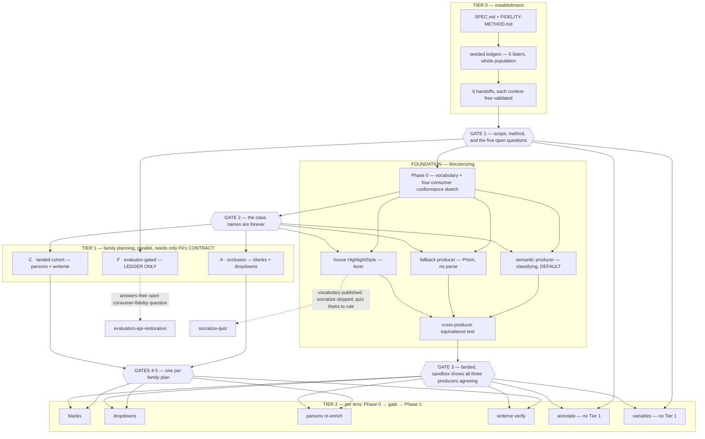

<!-- TRANSITIONAL — this campaign's canon. Retire it, together with
FIDELITY-METHOD.md and everything under ledgers/, families/ and handoffs/, when
the last lens lands and its ledger closes. What survives the retirement is each
lens's own README/DOCS and its `## What this lens does NOT do` section. -->
<!-- cspell:ignore blankenate parsonizer socratize socratizing reenrichment Wong okaidia lezer stepthroughs qasm dropdowns writeme parsons blankenated colorizing Infima deuteranopia Gateable jsdom -->
<!-- cspell:ignore colour colours distractor distractors ledgered Leitner WCAG clauding oldd throughs reloadable ordinally spellme -->

# Lens migration — campaign canon

The study-lenses package has passed through three generations of lenses, and
each transition lost pedagogy nobody wrote down. This campaign moves what
survives into the greenfield, restores what was dropped, builds the coloring
substrate none of the three ever had, and — the part that makes it a campaign
rather than a batch of ports — makes "faithful" into something a reviewer can
check rather than something an author can claim.

This document is the **scope**: what is in, what is out, who rules what, and
which sessions do which work. The **method** — how a migration proves it lost
nothing — is its own document, [FIDELITY-METHOD.md](./FIDELITY-METHOD.md),
because every session reads the method in full while the scope is read once.

**This file supersedes and retires
`src/lib/study-lenses/lenses/MIGRATION-PLAYBOOK.md`.** Two control panels is how
stale facts survive: the playbook still tells agents that `built-in-lenses.ts`
is empty when it has held three lenses since `47234d7c`. Its live content is
transported below; every omission is enumerated in
[ledgers/\_playbook.md](./ledgers/_playbook.md), the campaign applying its own
instrument to itself.

---

## Contents

- [The three generations](#the-three-generations)
- [Rulings of record](#rulings-of-record)
- [Standing exclusions](#standing-exclusions)
- [Scope — what is built, ledgered, and refused](#scope--what-is-built-ledgered-and-refused)
- [The families](#the-families)
- [The coloring foundation](#the-coloring-foundation)
- [The contract every lens must hit](#the-contract-every-lens-must-hit)
- [Golden rules](#golden-rules)
- [Contract deltas](#contract-deltas)
- [Sequencing and gates](#sequencing-and-gates)
- [The two handoff tiers](#the-two-handoff-tiers)
- [Boundary dispositions](#boundary-dispositions)
- [Open questions for Gate 1](#open-questions-for-gate-1)
- [Definition of Done](#definition-of-done)
- [Roll-up](#roll-up)
- [Paths](#paths)

---

## The three generations

| Gen                   | Where                                                                                                                                                  | What it is authoritative **for**                                                                                                                                                                                                                                                             |
| --------------------- | ------------------------------------------------------------------------------------------------------------------------------------------------------ | -------------------------------------------------------------------------------------------------------------------------------------------------------------------------------------------------------------------------------------------------------------------------------------------- |
| **Gen 1 — ORIGINALS** | `/Users/master/Documents/0-teach-code/0-spiralearn/0-study-lenses-committee/zz--oldd-clauding-and-context-dump/0--study-lenses--it-begins/src/lenses/` | **Visual and pedagogical intent.** Preact, flat `XxxLens.jsx` + `XxxLens.module.css` pairs. 12 render lenses + 6 action lenses, 14,377 lines. Rich CSS; much of its best design never shipped.                                                                                               |
| **Gen 2 — QUARRY**    | `src/lib/study-lenses--deprecated-architecture/lenses/`                                                                                                | **Structure and tests.** Eight lens directories, seven of them implemented (`socratize` is documentation and types only), on a two-layer `core.ts` + wrapper architecture with excellent documentation. The ninth directory is `lib/`, which is not a lens. READ-ONLY — it still ships live. |
| **Gen 3 — TARGET**    | `src/lib/study-lenses/lenses/`                                                                                                                         | **The contract.** Three lenses landed and wired.                                                                                                                                                                                                                                             |

Gen 1 and Gen 2 are both read-only quarries: **copy, never modify.** Verify a
copy against the current HEAD blob rather than against a remembered revision —
the quarry has been reformatted at least once by a sanctioned prettier sweep.

**Neither older generation is the judge of appeal** — see
[R-2](#rulings-of-record).

---

## Rulings of record

Human rulings, 2026-08-13. Every downstream session restates these in full; a
ruling behind a link in a long document is a ruling that does not get read.

### R-1 — one class vocabulary, three producers, semantic by default

There is **one** CSS class vocabulary for colored code. **Three producers** emit
into it, and they differ in how much of it they can reach:

| Producer           | Needs a parse? | identifier | keyword | operator | literal | delimiter | roles |
| ------------------ | -------------- | ---------- | ------- | -------- | ------- | --------- | ----- |
| `lib/classifying`  | **yes**        | ✅         | ✅      | ✅       | ✅      | ✅        | ✅    |
| lezer (CodeMirror) | no             | ✅         | ✅      | ✅       | ✅      | ✅        | ✗     |
| Prism              | no             | **✗**      | ✅      | partial  | ✅      | ✅        | ✗     |

**When the program parses, read-only surfaces color semantically** — by the five
house categories plus roles. That is the default, not an option: `typeof` is an
operator, `null` is a literal, and a `(` that opens call arguments is
distinguishable from one that groups an expression. **When it does not parse,
the surface falls back to Prism**, which needs no parse. Editable CodeMirror
surfaces get a house `HighlightStyle` over lezer tags.

**Each lens decides whether to expose a toggle between semantic and familiar
coloring. Most should.**

### R-2 — Gen-2 is not the judge of appeal; the union is a floor, not a ceiling

Gen 2 is itself a lossy migration. The fidelity target is the **union** of Gen-1
and Gen-2 behaviors, and Gen-1 code that is dead but carries good learner
intention is **ported and fixed**, not merely inventoried as lost.

Two qualifications, and both matter:

1. **A written judgment beats the union.** Where Gen-2 documents a _deliberate_
   replacement together with its reason, the replacement stands and the ledger
   records it as `supersede` **carrying the quoted sentence**. An agent may
   never invoke this on its own reading of "Gen-2 seems better" — it needs the
   words, in the Gen-2 document, in quotation marks, in the row.
2. **The union is a floor.** A lens session **may propose better than either
   generation** where the greenfield contract unlocks something neither could
   reach — role-level coloring being the obvious case. Proposals go through the
   human gate like anything else, and are ledgered as `ADDITION`.

**How the two interact.** Qualification 2 does **not** reopen ground
qualification 1 closed. Where Gen-2 records a human _reversal_ — not merely a
different choice — that ground is closed, and a session that wants to revisit it
says so to the human directly rather than routing around the ruling as an
`ADDITION`. The worked case is blanks' difficulty-derived hint scaling, reversed
on record with _"the learner, not the slider, should control scaffolding"_
[read: Gen-2 `blanks/DOCS.md` § Why hints are orthogonal to difficulty]; that
ground is closed (human ruling 2026-08-13).

**And "ported and fixed" is not unbounded.** R-2's base rule is imperative, but
it does not oblige rebuilding every switched-off artifact regardless of cost:
Gen-1 `ParsonsLens` alone carries 27 orphan CSS classes describing a board the
greenfield's LIS grader has already surpassed. A `revive` row may be
**`drop`**ped with human sign-off, like any other drop, and the ledger records
the sign-off. What R-2 forbids is the _silent_ version — deciding a dead
affordance was not worth reviving and leaving no row.

### R-3 — parsons is re-enriched here; debug-props is ledgered, not repaired

parsons' documentation regression is repaired inside this campaign. writeme gets
a confirming audit only. **debug-props' equivalent regression is ledgered with a
named deferral owner and no code is touched** — a human ruling taken after being
shown the measured numbers.

### R-4 — scope is all the lenses, through two handoff tiers

Tier 0 (this campaign's establishment) writes family-planning handoffs; each
family session does its cross-lens design and emits per-lens handoffs; each lens
session runs Phase 0 → human gate → Phase 1.

**Tier 1 is skipped where a family has one member.** `annotate` and `variables`
receive Tier-2 handoffs directly, and their requirements on the coloring
vocabulary travel to Gate 1 rather than waiting for a session that would convene
after those names are frozen. See
[The two handoff tiers](#the-two-handoff-tiers).

### R-5 — `## What this lens does NOT do` is mandatory for lenses this campaign migrates

Gen 2 established the convention; the greenfield dropped it wholesale. Every
lens this campaign migrates carries the section, listing each drop, deferral and
supersession with its reason. **parsons regains it through R-3; writeme and
debug-props are left as they are** (human ruling).

The measured state that produced this ruling:

| Tree  | READMEs carrying the section                                                                                                                                              |
| ----- | ------------------------------------------------------------------------------------------------------------------------------------------------------------------------- |
| Gen 2 | **6 of 8** — `annotate`, `blanks`, `parsons`, `quiz`, `socratize`, `writeme` (absent from `debug-props`, a dev harness, and `trace-debugging`, an acknowledged throwaway) |
| Gen 3 | **0 of 3**                                                                                                                                                                |

[measured 2026-08-13: `grep -c 'does NOT do'` across both trees' lens READMEs]

### R-6 — `print` is dropped

YAGNI. Build it if and when it is needed. Its Gen-1 source is inventoried in
[ledgers/\_boundary.md](./ledgers/_boundary.md) so the drop has a resume point.

---

## Standing exclusions

These predate this campaign and are **not this campaign's to change**. Each is
restated in every family handoff as an _action_ — what to do when its material
appears in your sources — not as a fact to be remembered.

- **`quiz` and `socratize`** belong to the socratize-quiz re-enrichment campaign
  (canon: `.planning-handoffs/socratize-quiz-reenrichment/SPEC.md`). Do not port
  them and do not rule for them. Two of their rulings reach into this campaign:
  **socratize stays un-colorized** (their R-4) so a colorize-all sweep skips it,
  and **quiz's coloring is deferred to their own lens-build time** (their R-4a)
  — this campaign publishes a consumable vocabulary and records the skip.
- **The editor is not a lens.** `lenses/README.md` states it belongs to the
  orchestrator, which owns the one edit intake the program's source changes
  through. Gen-1 `EditorLens` and `QASMEditorLens` are inputs to
  `orchestrate/editor/`, not to this campaign.
- **Evaluation-phase lenses are gated** on the evaluator public-API restoration
  campaign (`.planning-handoffs/evaluators-api-restoration/`), in flight. Their
  fidelity ledgers are still written here — see
  [Family F](#family-f--evaluator-gated--ledger-only).
- **`qasm`, `markdown` and `run-python` are refused by the snippet contract.**
  `SnippetType = 'script' | 'module'` — the embodiment models JavaScript only,
  and every derived fact (acorn tokens, ESTree tree, eslint-scope environment)
  is JavaScript-specific. There is no expressible `applicability` for a `.qasm`
  file or a markdown document. Each gets a ledger row carrying that measured
  reason, so a future widening of the snippet model has somewhere to resume
  from.

**One exclusion is this campaign's own doing and is therefore an obligation, not
a note.** Retiring `MIGRATION-PLAYBOOK.md` breaks a live citation: the
socratize-quiz campaign's SPEC cites
`[read: MIGRATION-PLAYBOOK.md locked decision (1)]` as sourced evidence, and
that decision is the one R-1 supersedes in its mechanism while restoring its
socratize exception verbatim. A boundary row carries the re-pointing, and by
this campaign's own rule an unacknowledged boundary row is an OPEN row at close.

---

## Scope — what is built, ledgered, and refused

**Six lenses are built. Everything else is named with its ground.** Nothing
vanishes silently; that is the whole point of the campaign.

| Lens                                                                                                                        | Disposition                                                                                                                                                                                                                                                                                                                                                                                                                                                                                                                                       | Family |
| --------------------------------------------------------------------------------------------------------------------------- | ------------------------------------------------------------------------------------------------------------------------------------------------------------------------------------------------------------------------------------------------------------------------------------------------------------------------------------------------------------------------------------------------------------------------------------------------------------------------------------------------------------------------------------------------- | ------ |
| `blanks`                                                                                                                    | **build** — port Gen-2 + Gen-1 union                                                                                                                                                                                                                                                                                                                                                                                                                                                                                                              | A      |
| `dropdowns`                                                                                                                 | **build** — Gen-1 only, re-sourced to `facts.tokens`                                                                                                                                                                                                                                                                                                                                                                                                                                                                                              | A      |
| `annotate`                                                                                                                  | **build** — port Gen-2 + Gen-1 `HighlightLens` union                                                                                                                                                                                                                                                                                                                                                                                                                                                                                              | B      |
| `parsons`                                                                                                                   | **build** — re-enrich docs (R-3) + Gen-1 backfill                                                                                                                                                                                                                                                                                                                                                                                                                                                                                                 | C      |
| `writeme`                                                                                                                   | **build** — confirming audit + re-theme                                                                                                                                                                                                                                                                                                                                                                                                                                                                                                           | C      |
| `variables`                                                                                                                 | **build** — Gen-1 only, re-sourced to `facts.environment`                                                                                                                                                                                                                                                                                                                                                                                                                                                                                         | D      |
| `debug-props`                                                                                                               | **ledger only** (R-3)                                                                                                                                                                                                                                                                                                                                                                                                                                                                                                                             | C      |
| `print`                                                                                                                     | **ledger only** — dropped as YAGNI (R-6); Gen-1 `PrintLens.jsx` 542 + css 515                                                                                                                                                                                                                                                                                                                                                                                                                                                                     | —      |
| `trace-debugging`, `tracing`, `step-throughs`, `run-javascript`, `trace-javascript`, `debug-javascript`, `tables-universal` | **ledger only** — evaluator-gated                                                                                                                                                                                                                                                                                                                                                                                                                                                                                                                 | F      |
| `quiz`, `socratize`, `ask-javascript`                                                                                       | **excluded** — the socratize-quiz campaign owns them; boundary rows only                                                                                                                                                                                                                                                                                                                                                                                                                                                                          | —      |
| `editor`                                                                                                                    | **excluded** — not a lens; it belongs to the orchestrator. Gen-1 `EditorLens.jsx` 389 + css 661                                                                                                                                                                                                                                                                                                                                                                                                                                                   | —      |
| `qasm`, `markdown`, `run-python`                                                                                            | **excluded** — refused by the snippet contract. Gen-1 `QASMEditorLens.jsx` 486 + css 712; `MarkdownLens.jsx` 808 + css 467; `run-python.jsx` 169                                                                                                                                                                                                                                                                                                                                                                                                  | —      |
| **`spellme`**                                                                                                               | **out of scope, and a live coordination boundary.** A concurrent session is building it — `lenses/spellme/` (README + `user-docs/`), untracked, created 2026-08-13, a `tokens`-phase "drive-the-scanner" exercise, not yet in `built-in-lenses.ts`. No Gen-1 and no Gen-2 source, so nothing to migrate. **But it renders classed code elements and declares its own Wong palette** — blue for an attested element, vermilion for a diverging claim — making it a third claimant on two hues this region already overloads. Carried as `bnd-009`. | —      |
| **`lib/scanning`**                                                                                                          | **not a lens** — an untracked sibling library of `lib/classifying`, created the same night, deriving an element sequence from the tokens fact for `spellme`. It matters here because it is a **third `facts.tokens` derivation on the tier `lib/colorizing` will land in**, and the foundation's Phase 0 owes that seam a look.                                                                                                                                                                                                                   | —      |
| **error-interpreting lens**                                                                                                 | **out of scope** — greenfield design with no Gen-1 or Gen-2 source, so there is nothing to migrate. Named in `lenses/README.md` § The roster as the lens that "speaks the parser's voice across both parse phases"; the `tokens` and `ast` phases hold no lens today. Its own campaign, not this one.                                                                                                                                                                                                                                             | —      |

Every name that appears anywhere in this campaign, in `lenses/README.md`, in
either quarry tree, **or in the Gen-3 target tree** has exactly one row above.
The target tree is in the domain deliberately: it is where new lenses arrive
while this campaign runs, and a register that excluded it would be complete by
construction — which is the failure this campaign is named after. That is the
register behind "nothing vanishes silently", and a name with two rows is as much
a defect as a name with none.

---

## The families

A family is a unit where **cross-lens design genuinely pays off** — shared
pedagogy, shared substrate, or a shared risk posture. A family of one is
legitimate when nothing rhymes with it; inventing a bond to fill a slot costs a
session and teaches a lens session to look for coupling that is not there.

### Family A — occlusion exercises · `blanks`, `dropdowns`

_Remove syntax elements from the program; the learner restores them._

|             | Gen 1                             | Gen 2                                                                                                                                                                  | Gen 3 |
| ----------- | --------------------------------- | ---------------------------------------------------------------------------------------------------------------------------------------------------------------------- | ----- |
| `blanks`    | `BlanksLens.jsx` 914 + css 650    | **8212** total (README 664, DOCS 521, index.tsx 1048, tests **4913**); `lib/` engines `blankenate.ts` 172 · `evaluate-correctness.ts` 236 · `no-paste-extension.ts` 57 | —     |
| `dropdowns` | `DropDownsLens.jsx` 734 + css 449 | —                                                                                                                                                                      | —     |

**Why one unit.** They share the _model_, not the surface. Both select what to
occlude from the house category taxonomy; both use
difficulty-as-a-single-probability, per-element grading, a reveal/complete view
toggle, distractors, and a hint ladder. Gen-1's own author saw it —
`DropDownsLens.jsx` opens its config with the comment _"Configuration state -
simplified like BlanksLens"_, and both slice difficulty 0–100 into one
probability.

**The category mapping differs per lens and per generation. Get it right before
sizing anything.**

| Content type          | Gen-1 blanks | Gen-1 dropdowns | Gen-2 blanks | House category     |
| --------------------- | ------------ | --------------- | ------------ | ------------------ |
| keywords              | ✅           | ✅              | ✅           | `keyword`          |
| identifiers           | ✅           | ✅              | ✅           | `identifier`       |
| operators             | ✅           | ✅              | ✅           | `operator`         |
| primitives / literals | ✅           | ✅              | ✅           | `literal`          |
| **delimiters**        | ✗            | ✗               | **✅**       | `delimiter`        |
| **comments**          | ✗            | **✅**          | ✗            | _outside the five_ |

[read: `BlanksLens.jsx` and `DropDownsLens.jsx` `contentTypes` state; Gen-2
`blanks/core.ts` defaults, `blanks/types.ts` `ContentType`,
`blanks/lib/blankenate.ts` flag→category pairs, `blanks/README.md` § Toolbar
contract — *"five checkboxes"*]

Two consequences a family session must not get backwards:

- **Delimiter occlusion is a `restore`, not new ground.** Gen-2 blanks ships it,
  on by default, with comprehensive Acorn punctuator coverage documented down to
  optional chaining and the generator `*`, and a `## Future direction` note that
  v1 buckets every delimiter blank under one type. It carries `G2-code` **and**
  `G2-doc` provenance. For **dropdowns**, which has no Gen 2 at all, delimiters
  genuinely are new ground and route through the human gate as an `ADDITION`.
- **`comments` is outside the house taxonomy entirely**, and only Gen-1
  dropdowns offered it — see the Gate-1 blocker below.

Delimiters matter beyond bookkeeping: `delimiter` is the category carrying the
role distinction the whole foundation is built on — a `(` that opens call
arguments versus one that groups an expression — so it is where occlusion and
semantic coloring first meet.

They are also where R-1's cross-producer claim meets its first real consumers:
blanks is an editable CodeMirror surface, dropdowns is a read-only span stream
with inline `<select>` widgets replacing spans mid-stream.

**The family's own open questions** — the reason this tier exists:

1. Is there **one** occlusion model (classified tokens + enabled categories +
   probability + seed → occlusion set) or two cores? If one, it is a **type
   edge** and serializes before both consumers.
2. **Distractors.** Same-category tokens drawn from elsewhere in the same
   program (Gen-1 dropdowns' approach, and the better one), a fixed pool, or
   both?
3. **Two surfaces, one grading contract.** Typed answers versus chosen answers
   grade differently; the pure core should not care which.
4. **How does delimiter occlusion select?** Gen-2 blanks buckets every delimiter
   blank under one type and files a richer taxonomy under Future direction. By
   category, by role, or by matched pair (`lib/classifying` supplies `partner`
   links)? _(Whether delimiters are offered at all is **not** open — Gen-2 ships
   them on by default; see the content-type table above.)_
5. **Three channels on one span.** Gen-2 blanks already paints per-blank parity
   tints and carries correctness on outline style, on the same editable spans
   the house `code-token-*` classes will land on. This is Gate-1 question 4's
   shape; if the answer constrains the vocabulary it belongs at Gate 1, not
   here.

_(Determinism is **not** on this list. Gen-2 ruled it — see below.)_

**Determinism is not an open question — Gen-2 already ruled it.** _"`blankenate`
rolls a bare `Math.random()` per token, so blanks re-roll on every settings
change … v1 keeps that behavior; a seeded RNG is deferred"_, with the one-line
injection path named (`Math.random()` → an injected `random()`) [read: Gen-2
`blanks/DOCS.md` § Why drop the seeded RNG]. Under R-2 qualification 1 the
disposition is determined: **`restore — DEFERRED`**, carrying Gen-2's quoted
deferral and its injection path. This paragraph exists because an earlier draft
listed it as open and attributed the re-roll to Gen-1 alone.

**The `comments` gap is a Gate-1 blocker, not this family's to settle.** Gen-1
dropdowns ships `comments: true` as a default content type, but
`lib/classifying` states _"Comments are not tokens and do not appear in the
output"_ and calls widening its taxonomy "an inter-module contract change, not a
local edit". Note this bites the **semantic producer only** — Prism tags
comments natively.

**This family is the method's calibration case**, because both of R-2's
qualifications are live in it at once. See
[FIDELITY-METHOD.md § The calibration cases](./FIDELITY-METHOD.md#the-calibration-cases).

### Family B — annotation · `annotate`

_The code is rendered read-only and a layer goes on top._

|            | Gen 1                             | Gen 2                                                                                                                               | Gen 3 |
| ---------- | --------------------------------- | ----------------------------------------------------------------------------------------------------------------------------------- | ----- |
| `annotate` | `HighlightLens.jsx` 853 + css 536 | 3424 total (README 289, DOCS 334, index.tsx 487, `render-code.ts` 67 + `render-flowchart.ts` 55, 6 annotation reducers, tests 1576) | —     |

A family of one, and deliberately so: `print` was its only plausible sibling and
R-6 dropped it. What the two would have shared — the read-only colorized surface
— belongs to the foundation, not to a family.

**Therefore annotate skips Tier 1 and gets a Tier-2 handoff directly.** A
singleton's "cross-lens design" is a per-lens Phase 0 wearing a tier's costume:
it would convene a session, answer its own questions, and hand them to itself.
What it genuinely owes the campaign is its **vocabulary-facing requirements**,
and those are inputs to the coloring foundation's Phase 0, not outputs of a
family session — so they are listed here and travel to Gate 1 rather than
waiting for a tier that would arrive after the class names are frozen.

**annotate's requirements on the foundation** (Gate-1 inputs): a
character-offset → DOM coordinate system that survives reflow, since every pen
stroke, eraser hit and note anchor is positioned against rendered code; a
rendering shape that tolerates an absolutely-positioned overlay above it; and a
stated answer for what happens to annotations when the producer switches from
semantic to fallback mid-session, because the spans re-render underneath the
overlay.

**There is no Gen-1 lens named `annotate`.** It is `HighlightLens`, registry id
`highlight`, titled "🔍 Highlight & Annotate", and described in Gen-1's own lens
modal as _"Annotate and highlight code"_. Treat `HighlightLens` as the Gen-1
source throughout.

It is the campaign's richest read-only consumer: three annotation tools (pen /
eraser / note) over an SVG overlay, a six-colour palette, **dual annotation
namespaces** (the code view and the flowchart view keep separate annotation and
stroke sets, and both survive a view toggle), and a `js2flowchart` flowchart
view carrying a documented injection constraint — its generated SVG is the
region's only `dangerouslySetInnerHTML` call site, and the renderer must never
be given a debug-mode print config, which interpolates a source-derived id into
an SVG `<text>` without escaping.

It also carries the lens's own eponym as a `revive` row: Gen-1's
**`🖍️ Highlight` line-tinting tool** is commented out of the toolbar _while
remaining the default `selectedTool`_, with working handlers — so a Gen-1
learner got a default tool with no visible button. Gen-2 recorded the drop
honestly (_"the line-level `highlight` tool was half-implemented and dropped at
migration. Restoration is its own increment per tool"_) and never restored it.

### Family C — the landed cohort · `parsons` (re-enrich), `writeme` (verify)

_The lenses already in Gen 3, already wired, already green._

|               | Gen 2 README/DOCS | Gen 3 README/DOCS | `## Why …` kept | generic `## Decisions` |
| ------------- | ----------------- | ----------------- | --------------- | ---------------------- |
| `writeme`     | 555 / 534         | 391 / 393         | **9 of 9**      | 0                      |
| `parsons`     | 705 / 505         | **242 / 199**     | **0 of 4**      | 1                      |
| `debug-props` | 162 / 267         | **91 / 117**      | **0 of 3**      | 1                      |

**Why one unit: writeme is the control and parsons is the patient.** writeme is
the only migration this repository agrees was faithful — its drops are
policy-correct (`## Migration` is status content, banned from end-state docs).
Re-enriching parsons alone means inventing the standard for "faithful enough";
doing it beside writeme means _measuring against_ one. Both are also live and
wired, so both changes are regression risk rather than greenfield — one shared
risk posture.

Per R-3, debug-props sits in this family as a **ledger-only** member.

Most of this family is **colorless and unblocked**: parsons' losses are prose
and decisions. Only the chip-coloring backfill and writeme's re-theme wait on
the foundation.

**Gen-1 orphan CSS is the detector no heading diff will ever find.** Classes
defined in a Gen-1 `.module.css` and never referenced from its `.jsx` [measured
2026-08-13, per class]:

| Gen-1 lens      | orphan / total |
| --------------- | -------------- |
| `ParsonsLens`   | **27 / 37**    |
| `DropDownsLens` | 8 / 25         |
| `VariablesLens` | 3 / 25         |
| `BlanksLens`    | 2 / 43         |
| `HighlightLens` | 1 / 47         |
| `WritemeLens`   | 0 / 43         |

parsons is the anomaly, and the reason is structural: Gen-1 shipped a 181-line
`<iframe>` shell over a vendored jQuery js-parsons port, while its 664-line
stylesheet describes a **complete native drag-and-drop board that never
rendered** — `blocksPanel`, `solutionPanel`, `insertZone`, `dropMessage`,
`checkButton`, `resetButton`, `hint`, `hintButton`, `feedback`, `guess-entry`,
`blockNumber`, `blockType`. That is dead pedagogy expressed in a _different
medium_ than commented-out code, and the greenfield parsons — which grades
natively with LIS — is in most respects already better than Gen-1. The family
must sort which orphans are `revive` and which are `drop` with sign-off.

**Careful: parsons' behavior partly survived even where its docs did not.**
`lib/extract-hints.ts` grew from 59 lines in Gen 2 to 69 in Gen 3, and the test
suite grew from 3222 to 3578 lines. Every parsons row therefore tracks `G2-doc`
and `G2-code` provenance **independently**, and `already survives` is used
aggressively. Over-claiming loss here produces make-work; under-claiming leaves
the original complaint unaddressed.

### Family D — environment and scope · `variables`

|             | Gen 1                             | Gen 2 | Gen 3 |
| ----------- | --------------------------------- | ----- | ----- |
| `variables` | `VariablesLens.jsx` 510 + css 285 | —     | —     |

A family of one, legitimately: it is the only `environment`-phase lens and its
fact dependency is shared with nothing. Gen-1 used `shift-parser`/`shift-scope`;
the greenfield re-sources to `facts.environment`, the one eslint-scope graph,
already computed with positions — **read it, do not re-analyze**.
`lib/scoping`'s README already anticipates it in the abstract.

**It is the foundation's hardest consumer, which is exactly why it is separate
rather than absent.** Its coloring is semantic in a _second, orthogonal_ sense:
span-per-binding-identity, not span-per-category. Hovering an identifier
highlights that binding's declaration and every reference to it — scattered,
non-adjacent tokens sharing an identity. Two colorings composing on one surface
is a real question the vocabulary must answer at the foundation's Phase 0.

**So variables also skips Tier 1 and gets a Tier-2 handoff directly** — and for
a sharper reason than annotate's. Scheduling a Family-D session after Gate 2
would have it raise its vocabulary question _after the class names are frozen_,
which is the one decision this campaign calls irreversible. Naming the question
here and carrying it into the foundation's Phase 0 is not a shortcut; it is the
only ordering that works.

**variables' requirements on the foundation** (Gate-1 inputs): can a span carry
a binding-identity class _in addition to_ its category class, or does one
displace the other? Is binding identity a class (`code-token-binding-7`,
unbounded cardinality) or a `data-*` attribute the stylesheet keys off (bounded
palette, recycled)? And does hover-highlighting a binding compose with role
underlining, or do the two channels collide on the same span?

### Family F — evaluator-gated · ledger only

`run-javascript` (160), `debug-javascript` (39), `trace-javascript` (347),
`tables-universal` (134), Gen-1 `StepThroughsLens` (296+239) and `TracingLens`
(313+125), and Gen-2 `trace-debugging` (3541).

**Building here is forbidden.** The deliverable is a completed fidelity ledger
and nothing else. Three reasons it runs now anyway:

1. Reading is unblocked, and passes 1–2 are pure reading.
2. **The action lenses carry the tree's densest switched-off code**, and
   `ask-javascript` is the worst of them — an ordinal claim every counting
   pattern agrees on, which is why it is stated ordinally
   ([FIDELITY-METHOD.md § 5](./FIDELITY-METHOD.md#the-five-listers) forbids
   publishing a channel-A number, because the counts are an artifact of
   whichever regex produced them). It is the material most likely to be
   reorganized out from under us.
3. The evaluators restoration campaign has an **open question about whether the
   trace-debugging lens is a fidelity target** for the rebuilt region. This
   ledger answers it. Handing it across is the cheapest high-value act in the
   campaign.

Two members deserve separating from the blockage:

- **step-throughs is not evaluator-gated.** It builds URLs to _external_
  visualizers (JS Tutor, Loupe, promisees, esprima) and drives no evaluator. Its
  Gen-1 `render` export is nevertheless commented out, so it is dead there too.
- **tracing is genuinely gated** — Aran instrumentation, evaluation phase — and
  its Gen-1 `render` is likewise commented out.

---

## The coloring foundation

**Home: `src/lib/study-lenses/lib/colorizing/`.**

**The tier is forced, not chosen.** ESLint zone 2c forbids `study-lenses/<X>/**`
from importing `study-lenses/<Y>/lib/**` for every ordered pair of subsystems,
and both `orchestrate` and `lenses` are subsystems. The orchestrator's own
editor is a **third colorization consumer** — `minimalSetup` ships
`syntaxHighlighting(defaultHighlightStyle, { fallback: true })` — so
`lenses/lib/` is disqualified by lint, and the package-leaf tier, which is never
a `from` in any zone, is the only legal home. **This supersedes the playbook's
`0a` placement**, which predates that consumer.

It owns five artifacts plus its tests: the class vocabulary as data, the
semantic span producer over `classify-tokens.ts`, the Prism-backed fallback
producer, the house `HighlightStyle`, and one stylesheet.

**Three constraints carried forward from the playbook's `0a`, and they are what
make the foundation reusable rather than a lens's private helper:** the
producers are **React-free** — they return data a caller renders, never markup
and never JSX; they **depend on no lens**, in either direction; and **no lens
re-tokenizes** — a lens consumes a producer's output rather than reaching for a
tokenizer of its own. (`0a`'s fourth constraint, "no Prism", is superseded by
R-1, which retains Prism deliberately as the no-parse fallback.)

### What the vocabulary is

Classes, not data attributes — and this is a deliberate, single exception to the
region's `data-*` convention, forced by CodeMirror: a `HighlightStyle`'s
`TagStyle` can emit **only** a class. A data-attribute vocabulary would make
cross-producer convergence impossible. Containers stay `data-*`.

`code-token` (base) + one of
`code-token-{identifier,keyword,operator,literal, delimiter,comment}` +
`code-token-role-<role>` where a role is known and worth distinguishing.
Comments are a **sixth kind**, outside the five, because `lib/classifying` has
none — they travel on the parse's comment channel.

### Three findings that shape it

- **The fallback replaces degradation.** `deriveTokens` uses acorn's standalone
  `tokenizer`, not `parse`, so _tokens present, AST absent_ is a common state —
  any grammar-only error reaches it. Rather than teaching `classifying` to work
  without an AST (a cross-consumer contract event on a module shared with blanks
  and quizzing), **a surface whose program does not parse simply uses the other
  producer.** `ClassifyInput` is never touched. The output carries a `detail`
  tag (`semantic` | `approximate`) so a surface can say honestly that its
  colours are a guess rather than silently showing less.
- **The region's dark mode fires on a signal this site ignores.** `data-theme`
  appears in exactly one file in all of `src/` — `src/css/custom.css` — and
  `docusaurus.config.ts` declares no `colorMode`, so the theme default
  `respectPrefersColorScheme: false` applies and the inline theme script never
  consults the OS. `parsons.css` and Gen-2 `blanks.css` key their dark blocks on
  `@media (prefers-color-scheme: dark)` alone, so a learner toggling the navbar
  moon gets a dark page with light-mode tints. **The new stylesheet must not
  inherit this bug**; the tone cascade puts an explicit surface declaration
  first, `[data-theme='dark']` second, and the OS query only where no
  `data-theme` is present at all (the embedded, non-Docusaurus host).
- **Infima owns the code surface; the house owns the token hues.** Infima ships
  `--ifm-code-background`, `--ifm-pre-color`, padding, radius and the monospace
  family — and **no syntax-token colour variable at all**. The division is
  forced rather than invented: the stylesheet sets no background and no layout,
  which is what lets one palette work under both writeme's dark `oneDarkTheme`
  chrome and the orchestrator's Infima frame.

### Colour-blind safety — two constraints the region already imposes

**Two Wong hues already carry three different meanings across three live
surfaces.** `parsons.css` uses blue `#0072B2` for _correct_ and vermilion
`#D55E00` for _wrong_. Gen-2 `blanks.css` uses **the same two hues for
alternating per-blank parity** — even-index versus odd-index blanks — and
carries correctness on _outline style_ instead, precisely so hue is not
overloaded [read: `blanks/blanks.css` § the palette comment]. The concurrent
`scanning` lens declares them for _attested element_ versus _diverging claim_.

So a vermilion keyword would read as "error" on one surface, "odd-numbered
blank" on another, and "diverging claim" on a third. **The syntax palette must
draw from the remaining Wong families**, and the foundation owes the region a
statement of which hues mean what — the constraint is stronger than "avoid two
colours". The syntax palette draws from the remaining Wong families.

And Wong's palette **fails WCAG AA as text** — it was designed for chart fills,
which is how parsons correctly uses it (alpha tints behind a border). The house
palette keeps the Wong hue angles and adjusts lightness until every hue clears
4.5:1 against its own tone's surface. That is a _test_, not a claim.

**Category colour is redundant; role colour is not.** A learner who cannot see
that `if` is blue can still read `if` — the token text is the primary channel.
But "this `(` opens call arguments and that one groups an expression" is
information the source text does not carry; encoding it in hue alone would make
it invisible under colour blindness. **Roles are therefore encoded with a
non-colour channel** — an underline grammar mirroring parsons'
solid/dashed/dotted borders — and never with hue alone.

### The measured divergences

Both non-semantic producers diverge from the house taxonomy in bounded, known
ways. These ship as **tests asserting the value each actually is**, so a grammar
update fails loudly instead of rotting.

| Construct                          | lezer                | Prism                           | House says |
| ---------------------------------- | -------------------- | ------------------------------- | ---------- |
| `typeof` / `instanceof` / `delete` | `operatorKeyword` ✅ | `keyword` ❌                    | operator   |
| `null`                             | `null` ✅            | `keyword` + alias `null,nil` ✅ | literal    |
| `true` / `false`                   | `bool` ✅            | `boolean` ✅                    | literal    |
| identifiers                        | `variableName` ✅    | **untagged** ❌                 | identifier |
| `of` (for-of)                      | `operatorKeyword` ❌ | `keyword` ✅                    | keyword    |
| ternary `?` `:`                    | `logicOperator` ❌   | `operator` ❌                   | delimiter  |
| generator `*`                      | `modifier` ❌        | `operator` ❌                   | delimiter  |
| `?.`                               | **no tag** ❌        | —                               | delimiter  |

**Prism cannot see identifiers at all.** They return as untagged raw strings
with the surrounding whitespace glued on (`" total "`), so they are not
recoverable by post-processing without re-splitting. That is precisely why Prism
is the fallback and not the default: it is excellent at readability on arbitrary
text and structurally unable to display the five house categories.

**Honouring the ruling on `typeof` costs `of`** — they share one lezer tag, and
nothing in a `HighlightStyle` can see the parent node. The mitigation is real
rather than rhetorical: `lib/classifying`'s own README calls contextual-keyword
categorization a deferred refinement, so the house's answer for `of` is
**provisional, not a settled ruling being violated**.

---

## The contract every lens must hit

Transported from the playbook, which remains correct here.

```ts
type Lens = Gateable & {
	// Gateable = { name, applicability(facts), phase? }
	main: ComponentType<LensProperties>; // React; a thin wrapper over a pure core
	config?: (overrides?) => LensConfig; // flat serializable primitives only
	recommend?: (embodiment) => ReadonlyArray<Recommendation>;
};
type LensProperties = { embodiment: Embodiment; config: LensConfig };
// Embodiment = { facts, study }
// Facts = { source, tokens, ast, entwined, environment, type }
```

`study` is the per-phase accessibility record — which lifecycle phases are
reachable for this program, and which lenses fit each. A lens reads it rarely
and never mutates it, but it is half the embodiment and a contract block that
omits it is incomplete.

Directory shape:
`README.md · DOCS.md · index.tsx (the Lens object) · core.ts · types.ts · tests/`,
plus an optional `lib/` for internal subsystems and an optional `<name>.css`
scoped to `[data-lens='<name>']`. There is no `index.ts` in a lens; the entry
point is `index.tsx`.

The authoritative references every porting session reads: `lenses/README.md`,
`lenses/DOCS.md`, `lenses/types.ts`, and — as the best worked example, and now
also as this campaign's fidelity control — `lenses/writeme/`.

**Phase assignment:** blanks, dropdowns, annotate → `source`; variables →
`environment`; parsons and writeme keep `source`.

---

## Golden rules

Transported from the playbook, with rules 1, 4 and 6 amended by this campaign's
rulings and measurements. Reject work that breaks these.

1. **Porting is not shipping.** A lens is not done until it is in
   `orchestrate/lib/composing/built-in-lenses.ts` and reachable in the sandbox.
   Wiring is in the Definition of Done, never "later." _(Amended: the roster is
   no longer empty — it holds parsons, writeme and debug-props. Joining it is an
   append; a duplicate `name` fails loudly at mount, and the sandbox harness
   must not also inject a lens the roster now provides.)_
2. **Port the pedagogy, not a shell.** The value is in the `lib/` engines —
   blanks' `blankenate`, parsons' LIS scorer. The quarry's own DOCS record prior
   "compliant shell" reverts. Do not repeat them.
3. **Two-layer module.** A pure `core.ts` (facts + config → view model, DOM-free
   tests) and a thin `main`. Heavy logic in the core, never in the JSX.
4. **Coloring is shared, semantic by default, and never re-tokenized per lens.**
   _(Amended by R-1 — the playbook's "facts-driven off `facts.tokens`, no Prism"
   is superseded: Prism is retained deliberately as the no-parse fallback, and
   the semantic producer reads `lib/classifying`, not raw tokens.)_
5. **embody is type-only and the embodiment is frozen.** No runtime import from
   `study-lenses/embody` — **the greenfield region; the `src/lib/embody` quarry
   tree is a separate question**, and Family F reads material that lives under
   it, so the distinction is load-bearing rather than pedantic. No mutation of
   props.
6. **No retired vocabulary in migrated content.** Do not reintroduce terms the
   greenfield killed — `realm`, the old phase names,
   `Snippet.status/raw/ evaluation`, `Recommendation.blockModelCell`. **Net-new
   code is exempt** — `lib/colorizing/` migrates nothing, so it has nothing to
   reintroduce. _(Amended: the playbook said "no committed banned-terms file
   exists — confirm with the maintainer". Still true [measured 2026-08-13].
   Until one exists, the grep list is the contract-delta table below, and a
   family session that finds another retired term adds it there.)_
7. **Follow the repo's governance.** Every session reads `CLAUDE.md` at the repo
   root — the governance router — then its own governance file per that router,
   then `DEV.md`, and runs the full AR cycle. The human holds the gate between
   DDD and TDD.

---

## Contract deltas

Transported from the playbook verbatim in substance; these are what a porting
session mechanically applies.

**Gen 2 → Gen 3 (mechanical):** `Component` → `main`; `applicableTo(Snippet)` →
`applicability(Facts)`; phases (`realm` gone, `parse` splits into
`tokens`/`ast`, `creation` splits into `environment`/`evaluation`); drop
`Recommendation.blockModelCell`; read `facts.*` rather than `Snippet.status` /
`.raw` / `.evaluation`.

**Gen 1 → Gen 3 (larger):** Preact → React; **context → props** — read
`embodiment.facts`, never `useApp().currentFile`; `render` / `execute` → `main`
plus the gate; drop the `enableColorize` global and the other SL1 globals.

**`URLManager` config sync is relocated, not deleted**, and the distinction
matters because a lens session told "drop it" will write "gone" into a README.
Gen-2 already ruled on it: _"URL coordination (shareable / reloadable exercise
settings) is **properly orchestrator-domain**; if it lands later it belongs to
the orchestrator's URL-state surface, with this lens still reading the resolved
values through its `config` prop"_ [read: Gen-2 `blanks/DOCS.md` § Why drop URL
config sync (vs. vendoring URLManager)]. So the delta is: a lens holds no URL or
`localStorage` channel and its state is local and disposable; the capability is
**`restore — DEFERRED (orchestrator, Gen-2 blanks DOCS § Why drop URL config sync)`**,
not dropped.

---

## Sequencing and gates



**Roughly half this campaign does not wait on the foundation:** every
family-planning session once F0's _contract_ passes Gate 2, every ledger pass
for every lens, parsons' non-color re-enrichment, every lens's pure `core.ts`,
and all of Family F. A naive reading makes the foundation gate everything; it
does not, and saying so is worth several sessions of wall-clock.

**Fan-out guard.** A type edge serializes that pair; everything else runs
parallel. Within a family the lenses have no type edges _unless_ the family
ruled a shared leaf — then the leaf builds first. Sweep for non-type couplings
before each wave. **Increments bearing a 🔍 sandbox checkpoint never fan out**;
they run in the orchestrating session, where checkpoint continuity lives.

---

## The two handoff tiers

**Only two families get a Tier-1 session: A and C.** They are the two where
cross-lens design genuinely pays off — A must decide whether one occlusion model
serves both lenses, and C must calibrate a repair against a control. `annotate`
and `variables` are singletons and go **straight to Tier 2**; a singleton's
"cross-lens design" is a per-lens Phase 0 in a tier's costume, and scheduling it
after Gate 2 would have both lenses raise their vocabulary questions _after the
class names are frozen_. Their requirements on the foundation are stated in
their family sections above and travel to Gate 1 instead. Family F produces a
ledger and no handoffs at all.

**Tier 1 — a family-planning handoff** must let its session emit good per-lens
handoffs _without opening this file_. It carries: the charter and any split
authorization; a measured source inventory as numbers rather than "go look"; all
rulings restated in full with provenance; the exclusion boundary as an action;
what the foundation gives and what it deliberately does not; **the family's
enumerated open design questions** — the reason the tier exists at all; ledger
state; the exact deliverable contract; and operating instructions, including
pathspec commits, the `index.lock` retry, measured foreign-debt baselines, and
the reminder that **`ceremony` is the human's and is never stated by an agent**
while **`twin-doc` is asked at each lens's own Phase 0 step 0.2**.

**Tier 2 — a per-lens handoff** must let a cold session reach its Phase-0 gate
from that file alone. It carries: the lens in the learner's voice; sources
ranked with what each is authoritative _for_; the completed ledger with P0-gated
row ids inline; **the family's ruled decisions restated, each tagged with the
row ids it settles** — the load-bearing section, because it is what stops a lens
session re-opening the family's design; the contract deltas; the gate schedule
written as steps where the work happens; **named sandbox checkpoints** with a
specific action and a specific expected observation; the Definition of Done; and
foreign-debt baselines measured at handoff time.

**Every handoff is context-free validated before it is final.** A fresh agent
holding only the handoff reports where it would stumble, guess or block;
must-fix findings are applied first. This fires at _every_ tier boundary.

**The ledger, not the handoff, is the durable artifact. Handoffs cite row ids; a
tier that restates a row has made a copy that will drift.**

---

## Boundary dispositions

Material that belongs to someone else. **A boundary row with no acknowledged
recipient is an OPEN row at campaign close.** Full rows live in
[ledgers/\_boundary.md](./ledgers/_boundary.md).

| Material                                                                                                                         | Recipient                                                                                                                      | Why it is a row rather than a shrug                                                                                                                                                                                                                                                                                                              |
| -------------------------------------------------------------------------------------------------------------------------------- | ------------------------------------------------------------------------------------------------------------------------------ | ------------------------------------------------------------------------------------------------------------------------------------------------------------------------------------------------------------------------------------------------------------------------------------------------------------------------------------------------ |
| Gen-1 `ask-javascript` (412 lines, **the tree's densest switched-off code**)                                                     | socratize-quiz campaign                                                                                                        | Its `openEnded` config — control-flow / data / functions / operators / variables / traces / generic, levels 1–5 — is the Gen-1 ancestor of the question register. That campaign sources its remaining stages from the **Gen-2 quarry only**, so under R-2 this Gen-1 layer is a fidelity input it does not currently hold.                       |
| Gen-1 `EditorLens` (389+661), `QASMEditorLens` (486+712)                                                                         | **unassigned** — destination `orchestrate/editor/`, but a directory cannot acknowledge a row; naming an owner is a Gate-1 item | The editor is not a lens. QASM's selection-scope model — the icon follows the selection, the scope narrows — is orchestrator design input.                                                                                                                                                                                                       |
| Gen-1 `LeitnerBoxManager.js` (311 lines, imported by nothing)                                                                    | unassigned — **open**                                                                                                          | A complete 7-box spaced-repetition engine with study history and session tracking. No lens owns retention scheduling; no campaign currently does either.                                                                                                                                                                                         |
| `print` (542 + css 515), `markdown` (808 + css 467), `qasm` (486 + css 712), `run-python` (169)                                  | unassigned — dropped/refused                                                                                                   | R-6 and the snippet contract. Rows carry the measured ground and the file sizes, so a future widening of the snippet model resumes rather than rediscovers.                                                                                                                                                                                      |
| Gen-1 `ask-javascript`'s **suppressed `renderConfig`**                                                                           | socratize-quiz campaign                                                                                                        | Beyond its switched-off body, its configuration surface is commented out at the module boundary [measured: lister 5 channel B]. A suppressed config surface is owed to the recipient, not left to rediscover.                                                                                                                                    |
| The **`[read: MIGRATION-PLAYBOOK.md locked decision (1)]` citation** in `.planning-handoffs/socratize-quiz-reenrichment/SPEC.md` | socratize-quiz campaign                                                                                                        | This campaign retires the cited file. The citation must re-point at [Standing exclusions](#standing-exclusions) above, and the recipient must know that decision (1)'s **mechanism** is superseded by R-1 while its **socratize exception is restored verbatim**. Created by this campaign's own act, so it is an obligation rather than a note. |
| Gen-1 `EditorLens` and `QASMEditorLens` selection-scope model                                                                    | **unassigned** — see the row above                                                                                             | See row 2 above; recorded twice deliberately, once by material and once by recipient.                                                                                                                                                                                                                                                            |

---

## Open questions for Gate 1

Five. Questions 1 to 3 are rulings only a human can make; questions 4 and 5 are
requirements the coloring foundation must discharge at its Phase 0, listed here
so Gate 1 knows they exist and that **Gate 2 freezes the class names before
either can otherwise be raised**. _(A sixth question — widening
`ClassifyInput.ast` to nullable — was **dissolved** by R-1's producer split:
when there is no AST the surface uses Prism, so `classifying` is never called
without one and its frozen public shape is never touched.)_

1. **The `comments` content type.** Gen-1 dropdowns offers it; `lib/classifying`
   excludes comments by contract. Either a comment channel — which its own
   README calls "an inter-module contract change, not a local edit" — or a ruled
   drop of a Gen-1 affordance. Bites the semantic producer only.
2. **Where the `## Discharges` row-id list lives.** The evaluators campaign puts
   it in the module README; `DEV.md` bans process narration from end-state docs
   and names the commit body as a loss ledger's home. Two live campaigns will
   disagree unless this is settled once.
3. **The `of` divergence in editable buffers.** Honouring the ruling on `typeof`
   costs `of` — they share one lezer tag, and nothing in a `HighlightStyle` can
   see a parent node. Accept and document (recommended), add a ViewPlugin
   decoration layer (a second colour source plus a per-scroll tree walk), or
   re-open the house's answer for contextual keywords. **Note what
   `lib/classifying`'s deferral actually covers**: it is `of`-used-as-an-
   identifier (`let of = 3`) being over-classified `keyword`; **for-of `of` as a
   keyword is settled**, and the deferred refinement would preserve it. The
   recommendation therefore stands on lezer's structural limit, not on the house
   answer being provisional.

4. **Can one span carry two orthogonal colorings?** `variables` needs
   binding-identity marking — scattered, non-adjacent tokens sharing an identity
   — composed with category coloring. Is identity a class of unbounded
   cardinality, or a `data-*` attribute the stylesheet keys off a recycled
   palette? Does it collide with role underlining on the same span?
5. **Can a colored surface carry an absolutely-positioned overlay?** `annotate`
   anchors pen strokes, eraser hits and notes against rendered code by character
   offset, so it needs an offset → DOM coordinate system that survives reflow —
   and a stated answer for what happens to those anchors when the producer
   switches from semantic to fallback and every span re-renders underneath them.

**Family A has question 4's shape too, and it is not answered either.** Gen-2
blanks already paints per-blank **parity tints** — Wong blue for even-index
blanks, vermilion for odd — with correctness carried on _outline style_ rather
than hue, all on the same editable spans the house `code-token-*` classes will
land on. Three channels, one span. Family A's Phase 0 must answer it, and if the
answer constrains the vocabulary it belongs at Gate 1 rather than after.

---

## Definition of Done

Apply before accepting any lens. Transported from the playbook and extended.

- Ported to the Gen-3 `Lens` contract; two-layer (pure `core.ts` + thin `main`).
- Core tests (no DOM) and component tests (jsdom) green, with the foreign
  baseline unchanged.
- **The load-bearing pedagogy is present** — the `lib/` engine actually ported —
  not a green shell.
- Coloring through the foundation, never ad hoc, never a per-lens re-tokenize.
- **Wired into `built-in-lenses.ts` and reachable in the sandbox** (`npm start`
  → `spiralearn/sandbox/orchestrate/index.mdx`; a wired lens appears in its
  phase's `<select>`).
- Retired vocabulary grep clean.
- **`## What this lens does NOT do` present and complete** (R-5).
- **Ledger open rows = 0**, or each remaining one carries a named deferral
  owner.
- Full AR cycle complete; the DDD → TDD human gate honored.

---

## Roll-up

Counts per lens, filled as ledgers complete. A suspiciously small ledger is
supposed to be _visible_ here — that is what this table is for.

| Lens               | rows | `restore` | `revive` | `ADDITION` | open | ledger                                             |
| ------------------ | ---- | --------- | -------- | ---------- | ---- | -------------------------------------------------- |
| blanks             | —    | —         | —        | —          | —    | [ledgers/blanks.md](./ledgers/blanks.md)           |
| dropdowns          | —    | —         | —        | —          | —    | [ledgers/dropdowns.md](./ledgers/dropdowns.md)     |
| annotate           | —    | —         | —        | —          | —    | [ledgers/annotate.md](./ledgers/annotate.md)       |
| parsons            | —    | —         | —        | —          | —    | [ledgers/parsons.md](./ledgers/parsons.md)         |
| writeme            | —    | —         | —        | —          | —    | [ledgers/writeme.md](./ledgers/writeme.md)         |
| variables          | —    | —         | —        | —          | —    | [ledgers/variables.md](./ledgers/variables.md)     |
| debug-props        | —    | —         | —        | —          | —    | [ledgers/debug-props.md](./ledgers/debug-props.md) |
| Family F (7)       | —    | —         | —        | —          | —    | [ledgers/\_family-f.md](./ledgers/_family-f.md)    |
| boundary           | —    | —         | —        | —          | —    | [ledgers/\_boundary.md](./ledgers/_boundary.md)    |
| playbook transport | —    | —         | —        | —          | —    | [ledgers/\_playbook.md](./ledgers/_playbook.md)    |

---

## Paths

Every path confirmed present 2026-08-13. Bare region references — `lenses/…`,
`orchestrate/…`, `lib/…` — resolve under `src/lib/study-lenses/`. References
prefixed `study-lenses--deprecated-architecture/` are relative to `src/lib/`.
Gen-1 paths are absolute because they live in a different tree. (The path
convention is cold-start-verified; it survives from the retired playbook.)

⚠️ **Every session launched for this campaign must have BOTH the `0-curricula`
tree and the `0-study-lenses-committee` tree in scope.** Every Gen-1 reading in
this campaign depends on it, and a worker without the committee tree available
reports BLOCKED on arrival rather than degrading gracefully. This is the single
most common way a lens session fails on its first tool call.

| Reference                                  | Location                                                                                                                                                                                                                    |
| ------------------------------------------ | --------------------------------------------------------------------------------------------------------------------------------------------------------------------------------------------------------------------------- |
| Governance (read before any work)          | `CLAUDE.md` at the **repo root** — the router — then `AGENTS.md` or `AGENTS.principal.md` per that router, then `DEV.md`                                                                                                    |
| Target package                             | `src/lib/study-lenses/`                                                                                                                                                                                                     |
| Lens contract docs                         | `lenses/README.md` · `lenses/DOCS.md` · `lenses/types.ts` · worked example `lenses/writeme/` — **its README carries a per-file porting map** (§ Two-layer module), which is the fastest orientation any porting session has |
| Roster seam                                | `orchestrate/lib/composing/built-in-lenses.ts` (+ `join-lens-roster.ts`)                                                                                                                                                    |
| Gen-2 quarry (READ-ONLY)                   | `src/lib/study-lenses--deprecated-architecture/lenses/`                                                                                                                                                                     |
| Gen-1 originals (READ-ONLY, separate tree) | `/Users/master/Documents/0-teach-code/0-spiralearn/0-study-lenses-committee/zz--oldd-clauding-and-context-dump/0--study-lenses--it-begins/src/lenses/`                                                                      |
| Semantic coloring input                    | `lib/classifying/` (`classifyTokens`, `ClassifiedToken`, `Category`, `Role`)                                                                                                                                                |
| Coloring foundation (to be built)          | `lib/colorizing/`                                                                                                                                                                                                           |
| Scope fact                                 | `embody/types.ts` (`Environment`, `Scope`, `ScopeVariable`, `ScopeReference`) + `lib/scoping/`                                                                                                                              |
| Sandbox                                    | `npm start` → `spiralearn/sandbox/orchestrate/index.mdx`                                                                                                                                                                    |
| Sibling campaigns                          | `.planning-handoffs/socratize-quiz-reenrichment/` · `.planning-handoffs/evaluators-api-restoration/`                                                                                                                        |
