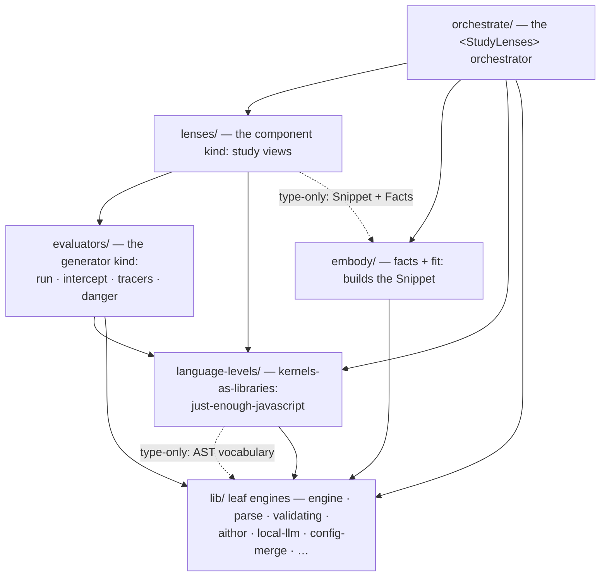

# study-lenses — Architecture

> **Background context — not source.** This document lives in
> `.planning-handoffs/self-gating-inversion/` as the migration campaign's design
> reference. It is NOT the new tree's live documentation: the new
> `src/lib/study-lenses/` grows its own README/DOCS/types through each
> workstream's Phase-0 ceremony, informed by this document. Relative links below
> describe the eventual tree layout and may not resolve from here.
>
> **Architectural sketch** (see repo `DEV.md` § Directory Documentation
> Convention): this document describes the package's intended end-state
> structure — module docs and implementation are conformed to it. Campaign
> status and doc precedence during the self-gating inversion: see
> [ROADMAP.md](./ROADMAP.md).
>
> Division of labor: this file is the newcomer orientation tour (layer map, core
> concepts, extension points). [DOCS.md](./DOCS.md) holds package-level
> decisions and rationale. [README.md](./README.md) is the pedagogical front
> door.

## What this package is

StudyLenses turns any JavaScript snippet into a study object:
`embody(code, { type, lenses })` produces a frozen, self-describing **Snippet**
(the _embodiment_) that carries, per lifecycle phase, exactly the **lenses**
that apply to the code; the `<StudyLenses>` **orchestrator** renders that
embodiment and wires the editor, the config cascade, and the level controls
around it. A **language level** is a kernel — a passive library of validator,
docs, and editor support — that powers a guardrail the learner or educator can
point at their code. Every study utility carries its own **applicability**;
nothing else decides what fits.

**Reading order for newcomers:** [README.md](./README.md) (why — the pedagogy) →
this file (how — the shape) → [DOCS.md](./DOCS.md) (decisions + rationale) → the
README/DOCS pair inside whichever module you are working on.

## The layer map

Dependency direction is the load-bearing invariant: arrows point strictly
downward. The boundaries lint (`eslint-plugin-boundaries`, repo
`eslint.config.mjs`) encodes these arrows as element types — the executable form
of this diagram (the element-type model is designed and enabled by
[ROADMAP.md](./ROADMAP.md) P2).

Legend: solid arrow = runtime import · dashed arrow = type-only import.

- **embody imports neither lenses nor evaluators nor kernels.** Lens modules
  arrive as ARGUMENTS (`embody(code, { type, lenses })`), typed against embody's
  own minimal structural `Gateable`; kernel logic executes only black-boxed
  inside lens gates. embody stays level-blind and React-free.
- **Lenses** import kernels (their own choice, privately) and evaluators (as
  libraries); they receive the embodiment via props and may type-import the
  Snippet/Facts contract — never runtime-import embody.
- **Evaluators** are headless: consumed by lenses, never rendered, never
  registered. They may consult kernels privately.
- **Kernels** are passive libraries; their `validate` is typed against the parse
  leaf's shared AST vocabulary.
- **The orchestrator** is the composition root and the only React host: it
  imports the default lens roster, appends injected lenses/kernels, calls
  embody, and renders the result.

## Core concepts

### Snippet (the embodiment): facts + fit

`embody(code, { type, lenses })` returns a frozen Snippet carrying:

- **Facts** — tagged stage results
  (`{ ok: true, value } | { ok: false, cause }`) for source, tokens, ast,
  entwined, and type. A stage's failure renders inside its owning lifecycle
  phase — the machine teaches at the phase that tripped.
- **The lifecycle** — six flat phases,
  `source → realm → tokens → ast → environment → evaluation`, each
  `{ accessible, cause?, lenses }`:
  - **accessibility**: source, realm, and tokens are always accessible; ast is
    barred when tokenizing failed; environment and evaluation are barred when
    tokens/ast (or entwining) failed — cause carried, rendered at the barred
    phase.
  - **lenses**: the refs of exactly the provided lenses whose
    `applicability(facts)` returned true and whose declared phase(s) include
    this phase. Within an accessible phase, non-fitting lenses are simply
    absent; a phase with zero fitting lenses may render greyed or hidden (a UI
    choice).

The six phases are ECMAScript-aligned peers: tokens vs ast is the spec's
lexical-vs-syntactic grammar split ("spelling" vs "grammar"); environment is
declaration instantiation (`GlobalDeclarationInstantiation`; modules: `Link()`);
realm is `InitializeHostDefinedRealm`. Phase DATA lives in `embody/types.ts`;
phase PRESENTATION (columns, dropdowns, display labels) is the orchestrator's.

Freezing is freeze-what-you-own: embody freezes everything it built — never the
attached lens refs, which remain owned by their defining modules.

### Study utilities: one envelope, kinds by `main`

Every study utility satisfies one envelope —
`{ name, applicability(input), main, config?, phase(s)?, recommend? }` — and a
**kind** is the shared type of `main`, refusal branch included:

- **Lenses** (the component kind): `main` is a React component receiving
  `embodiment` + resolved `config`. `applicability(facts)` is a pure, sync
  predicate over the Facts slice — O(facts), internals private (a lens may
  consult a kernel validator; no consumer knows). `phase(s)` names one or more
  of the six phases; a lens with no phase is panel-excluded and mounts only via
  the `lens` prop. `main` may assume its gate held (mounting it otherwise is a
  consumer bug). `recommend` is optional self-description for the recommender.
- **Evaluators** (the generator kind): run (errors/clean-termination), intercept
  (adds I/O events), tracers (the introspective-event subset), danger (a
  real-window iframe backend). Consuming lenses call an evaluator's
  applicability to build their options list, then drive its generator; a main
  invoked on unfit input returns a structured refusal — **refusal-as-data, never
  a throw**. The **run lens** consumes run/intercept/danger and owns all run
  UI/IO (cancel, iteration limits, output channels per the four-audiences
  pedagogy, pending interaction); the **trace-debugging lens** consumes tracers.

A new kind exists when ≥2 implementations share a main signature AND a consumer
dispatches over them uniformly; singleton kinds require a recorded maintainer
sign-off, a written shared-main signature, and a named anticipated consumer.
Kind contracts carry no level fields — level affinity lives inside
applicability/main, privately.

### Language levels: kernels-as-libraries

A language level is a **kernel**: `key` + `label` +
`validate(parse facts) → Violations` (sync, consuming embody's parse facts — one
parse truth) + `snippetTypes` + reference/notional-machine docs +
`editorSupport` data (consumed by generic editor engines; lint diagnostics are a
presentation adapter over the same validate result) + semantic-model data with
**exported builders** (one per model — per-use construction, single algorithmic
truth). Kernels are the single home for every level-specific fact.

Kernels are never plugins and never actors: nothing activates them, they gate
nothing by themselves. Our lenses import our kernels (an NM lens family shares
its kernel's validate — one predicate, N importers, with a fixture-corpus
contract test asserting the family appears and withdraws as a unit — this
carries the "models never lie about admitted programs" guarantee); injected
lenses import their own dependencies. Levels never ship lenses, and there is no
kernel→lens injection channel.

### The level controls: guardrail-up

- **The level selector is permanent** whenever kernels are registered. Entries
  show realtime fit marks — **fits / doesn't-fit / not-applicable-for-type /
  undetermined (unparsed)** — derived once per settle from each kernel's
  memoized validate + `snippetTypes` + the snippet type; hover shows the
  kernel's docs. The selector is the discovery and self-assessment channel.
  "Full JavaScript" is the none-state entry (the label for the reserved key
  `''`).
- **The gutter** shows only the selected level's violations.
- **`strict`** is a plain, visible toggle (default warn), cascading JSON config
  → prop → learner control, session-scoped.
- **Enforcement is a mask, never a filter** — fit computation never changes when
  a level is active. Three surface classes:
  1. editor-based (always alive): editor, gutter, hints, completion, format;
  2. meta-level controls (never masked): level selector, strict toggle,
     snippet-type toggle, embedded guide — any control whose change can itself
     restore conformance stays alive;
  3. everything else (blocked under strict + out-of-level): the lifecycle panel
     and all lenses. The mask is an inert overlay (lenses stay mounted, state
     preserved), derived from the settled validate. Blocked state names the
     level and the first violation (or the type-admission cause). Under an
     **undetermined** verdict (unparsed code) the mask's message is "can't check
     the level — the code doesn't parse yet" and the tokens/ast phases stay
     unmasked: a typo must never read as a level block.
- **Type admission** is a simple orchestrator check: the kernel declares
  `snippetTypes`; the orchestrator warns (editor-level) or blocks (strict) when
  the current type isn't admitted.
- The level control's pedagogical job is **guardrail-up**: keep code in-level so
  level-dependent lenses stay available, with warnings explaining the boundary.
  The fade is pull-not-push — nothing is imposed, so not opening a lens IS the
  learner-side fade.

### Program interaction: phase-gated

Learners interact with their program **only through the lifecycle phases** —
there is no top-level Run button. The run lens (evaluation phase) is the
execution surface; evaluation is barred until the code parses, so the parser's
native errors — rendered by the tokens/ast phases' lenses in learner-worded form
— are the path back to a runnable program. Acorn is this environment's run
ceiling, deliberately. Expertise reversal is structural: learners who have
mastered syntax simply stop opening the tokens/ast lenses.

## Per-surface behavior

| Surface                     | Reads                               | Behavior                                                                                                                                              |
| --------------------------- | ----------------------------------- | ----------------------------------------------------------------------------------------------------------------------------------------------------- |
| Phase columns               | The Snippet's lifecycle             | Rendered mechanically: barred ⇒ explicit barred state + cause; accessible + empty ⇒ greyed or hidden (UI choice); accessible ⇒ dropdown of fit lenses |
| Level selector              | Kernel registry + memoized validate | Permanent when kernels exist; realtime fit marks per level; hover docs; sets `activeLanguageLevel` (key `''` = "Full JavaScript")                     |
| Gutter                      | Selected kernel's validate          | Only the selected level's violations; absent when no level selected                                                                                   |
| Strict toggle               | `strictLanguageLevels`              | Plain visible toggle, default warn; learner override session-scoped                                                                                   |
| Enforcement mask            | Settled validate + surface classes  | Strict + out-of-level ⇒ class-3 blocked (inert overlay, state preserved); warn ⇒ editor warnings only; undetermined ⇒ tokens/ast stay unmasked        |
| Type toggle (script↔module) | `snippetTypes` admission check      | Class-2 (never masked); inadmissible type warns or blocks with its cause                                                                              |
| Run                         | The run lens (evaluation phase)     | Owns run UI/IO over evaluator events; danger + sandbox zoning are its options; edit ⇒ unmount ⇒ generator canceled                                    |
| Editor support              | Selected kernel's `editorSupport`   | Completion/hover/format data when a level is selected; generic JS editing otherwise (the baseline-editor pin)                                         |
| Embedded guide              | —                                   | Class-2; narrates accessibility + fit ("lenses appear when they apply")                                                                               |
| Recommender                 | Per-phase lens lists + `recommend`  | Ranks fit lenses; recommendation rendering passes through the enforcement mask                                                                        |

## Public surfaces

Documented and versioned for external use; everything else is internal:

1. **The `<StudyLenses>` prop API** — `snippet` · `type?` (initial; dock toggle
   overrides) · `lens?` (an initial-focus request, never a bypass: honored only
   when the named lens is attached to an accessible phase; panel-excluded lenses
   get their applicability run at mount) · `configs?` (the cascade's top layer,
   keyed by lens name) · `lenses?` (injected lens modules, append-only, loud
   name collisions) · `languageLevels?` (injected kernels, append-only, key `''`
   reserved) · `activeLanguageLevel?` · `strictLanguageLevels?`.
2. **The lens contract** — the envelope's component kind (`lenses/types.ts`)
   plus `Facts`/`Gateable` (`embody/types.ts`).
3. **The kernel interface + registry** (`language-levels/types.ts`; a static
   frozen record plus the `languageLevels` injection prop).

The evaluator contract is internal until a third party needs it.

## Extension points

Each extension is a self-contained recipe touching only its own unit — never the
core.

- **Add a lens.** Implement the component-kind envelope: `name`,
  `applicability(facts)` (pure, sync — consult anything you like inside),
  `phase(s)` (one or more of the six), `main` (embodiment + config props),
  optional `config`/`recommend`. Register it in the default roster or inject it
  via the `lenses` prop; the panel and recommender pick it up from the Snippet's
  fit lists. Canonical exemplar: named by [ROADMAP.md](./ROADMAP.md) P6.
- **Add an evaluator.** Implement the generator-kind contract in the evaluators'
  home; wire it into the lens that dispatches over your kind of evaluation (the
  run lens for backends, the trace-debugging lens for tracers). Extensible via
  consuming code only — no registry, by design.
- **Add a language level.** Create a kernel implementing the spine (`key`,
  `label`, `validate` over parse facts, `snippetTypes`, docs, `editorSupport`,
  model builders) and register it (one registry line, or the `languageLevels`
  prop). **Honest scope:** a kernel powers the selector, editor support, and
  enforcement. It does not light up NM lenses — lenses import their kernels
  directly, by author choice; a custom level wanting NM views ships its own
  lenses too. One hard bound: a level can only **constrain** parseable
  JavaScript — the parse leaf is standard JS; levels never extend syntax.

The contribution process (docs-first → test-first → review-before-merge) lives
in the repo-root [CONTRIBUTING.md](../../../CONTRIBUTING.md) and repo `DEV.md`
([ROADMAP.md](./ROADMAP.md) P6 distills the study-lenses recipes into it).
