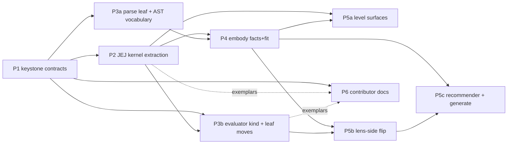

# study-lenses — Self-Gating Inversion ROADMAP

> **Background context — not source.** This document lives in
> `.planning-handoffs/self-gating-inversion/` as the migration campaign's design
> reference. It is NOT the new tree's live documentation: the new
> `src/lib/study-lenses/` grows its own README/DOCS/types through each
> workstream's Phase-0 ceremony, informed by this document. Relative links below
> describe the eventual tree layout and may not resolve from here.
>
> **Deletable campaign map.** This file plans one refactor campaign — the
> self-gating inversion — as delegable phases toward the end-state in
> [ARCHITECTURE.md](./ARCHITECTURE.md). It describes the **desired end-state and
> migration strategy only**: no current-state inventories, no gap lists — each
> phase's tasked agent reconciles current-vs-desired just-in-time at phase
> start. When the campaign completes, this file is deleted (see § Deletion
> checklist). Orientation docs: [README.md](./README.md) · [DOCS.md](./DOCS.md)
> · [ARCHITECTURE.md](./ARCHITECTURE.md).
>
> This campaign supersedes the language-levels-inversion campaign that
> previously occupied this file; its ratified decisions are revised per §
> Revised decisions below.

## Vision

Every study utility carries its own applicability; the embodiment carries its
lenses; language levels are consultable libraries.
`embody(code, { type, lenses })` builds the generic **facts** (tagged stages:
source, tokens, ast, entwined, type), derives **phase accessibility** over the
flat six-phase lifecycle
(`source → realm → tokens → ast → environment → evaluation`), naively runs every
provided lens's **applicability** over the facts, and freezes the result — a
Snippet that lists, per phase, exactly the lenses that fit. The `<StudyLenses>`
orchestrator **renders the embodiment** mechanically and owns only environment
concerns: the editor, the config cascade, the level selector + enforcement, and
chrome. A **language level** is a kernel — a passive library of validator,
admissible snippet types, docs, editor-support data, and semantic-model builders
— consulted privately by whoever needs it and never consulted by embody.

**Why:** the level stops being the organizing frame and becomes an instrument: a
**guardrail** the learner or educator points at code (keep code in-level so
level-dependent lenses stay available, with warnings explaining the boundary),
while tool availability is one invariant mechanism — fit. Phase-gating makes the
program lifecycle the interaction model itself: learners meet their program only
through the machine's phases, and failures teach at the phase that owns them.

**Every phase is checked against both North-Star tests:**

- **Pedagogy test:** does it keep the low floor (source-phase study serves any
  text; fit-based appearance, never level-blocked by default), teach the machine
  (phase accessibility renders failures at their owning phase, in the parser's
  own voice), and keep the guardrail honest (enforcement masks, never edits
  fit)?
- **Collaboration test:** could a new contributor own this unit from its
  README + boundary contract alone — and does adding a lens, an evaluator, or a
  level touch only its own unit, never the core?

## Desired end-state model

The durable model (layer map, core concepts, per-surface table, extension
points) lives in [ARCHITECTURE.md](./ARCHITECTURE.md). Target decisions the
phases build toward:

1. **One envelope, kinds by `main`.** Every study utility satisfies
   `{ name, applicability(input), main, config?, phase(s)?, recommend? }`; a
   **kind** is the shared type of `main` (refusal branch included), realized as
   per-kind interfaces. Initial kinds: **lenses** (main = React component) and
   **evaluators** (main = generator). A kind exists when ≥2 implementations
   share the main signature and a consumer dispatches over them uniformly;
   singleton kinds require a recorded maintainer sign-off, a written shared-main
   signature, and a named anticipated consumer.
2. **applicability is THE predicate.** Pure, sync, O(facts), over the utility's
   input domain (lenses: the Facts slice). Internals are private — a gate may
   consult a kernel validator; no consumer knows. There are no applicability
   tiers. Main operations refuse unfit input as data, never by throwing.
3. **embody = facts + fit + accessibility, level-blind.**
   `embody(code, { type, lenses })` (lenses default `[]`; the composition root
   passes the roster). Facts stages are tagged results
   (`{ ok, value } | { ok: false, cause }`); a stage's failure renders inside
   its owning phase. Gates are wrapped (a throwing gate = not-applicable plus a
   loud dev report). Freeze is freeze-what-you-own: per-phase arrays and
   embody-built values, never the lens refs.
4. **The flat six-phase lifecycle**
   `source → realm → tokens → ast → environment → evaluation` — spec-peers
   (lexical grammar / syntactic grammar / declaration instantiation /
   evaluation), no umbrella, and the word "creation" retired (environment is its
   more-specific successor). Each phase carries
   `{ accessible, cause?, lenses }`; barred phases render their cause; within
   accessible phases, non-fitting lenses are silently absent.
5. **All programs are phase-gated.** No top-level Run button — learners interact
   with the program only through the phases. The **run lens** (evaluation phase)
   owns run UI/IO — cancel, limits, output channels, pending-interaction — over
   evaluator events; danger is a run-lens option. Acorn is this environment's
   run ceiling, deliberately; the tokens/ast phases render the parser's native
   errors as the compensating surface.
6. **Evaluators are the headless kind**: run, intercept, tracers (the
   introspective-event subset), danger — one generator signature, one home,
   consumed by lenses (run lens; trace-debugging lens), never rendered and never
   registered.
7. **Kernels are libraries.** Spine: `key`, `label`,
   `validate(parse facts) → Violations` (sync, no internal parse — one parse
   truth), `snippetTypes`, docs, `editorSupport` data, and semantic-model data
   with **exported builders** (one per model — single algorithmic truth). Levels
   never ship lenses; there is no kernel→lens channel — our lenses import our
   kernels, injected lenses import their own. "Never lie about admitted
   programs" is carried by each NM-lens-family's shared kernel-validate gate
   plus a fixture-corpus contract test.
8. **The level control is a guardrail, not a fade.** A permanent selector
   (whenever kernels are registered) with realtime fit marks (fits / doesn't-fit
   / not-applicable-for-type / undetermined) is the discovery and
   self-assessment channel; the gutter shows only the selected level's
   violations; `strict` is a plain visible toggle (default warn). Enforcement is
   a **mask, never a filter**: strict + out-of-level blocks class-3 surfaces
   (panel + lenses) until the code conforms; editor surfaces and meta-level
   controls (selector, strict, type toggle, guide) stay alive; under an
   undetermined verdict the tokens/ast phases stay unmasked. Type admission is a
   simple orchestrator check against `snippetTypes`.
9. **The orchestrator renders the embodiment.** Zero fit/accessibility
   derivation; it owns the editor, the config cascade (props → `lenses.json` →
   per-fence → learner tweaks), selector fit marks (one memoized validate per
   settle+kernel, shared with gutter + mask), surface classification, and
   composition (default roster + append-only `lenses`/`languageLevels`
   injection, loud name collisions).
10. **Public surfaces:** the `<StudyLenses>` prop API (`snippet`, `type?`,
    `lens?` — an initial-focus request, never a bypass —, `configs?`, `lenses?`,
    `languageLevels?`, `activeLanguageLevel?`, `strictLanguageLevels?`), the
    lens contract + `Facts`/`Gateable`, and the kernel interface + registry. The
    evaluator contract stays internal until a third party needs it.

## The keystone contracts (seed for P1)

This sketch seeds P1's DDD; the phase's types.ts files become canonical when P1
lands and this sketch is then superseded.

```ts
// embody/types.ts — the six-phase vocabulary + the minimal gateable shape
type Phase =
	| 'source'
	| 'realm'
	| 'tokens'
	| 'ast'
	| 'environment'
	| 'evaluation';

type Gateable = {
	name: string; //                     identity — the object IS the identity
	applicability: (facts: Facts) => boolean; // pure, sync, O(facts)
	phase?: Phase | readonly Phase[]; // absent = panel-excluded
};
// Facts = the sync slice (source, tokens, ast, entwined, type) as tagged
// stage results; Snippet.lifecycle.<phase> = { accessible, cause?, lenses }

// lenses/types.ts — the component kind extends Gateable
type LensModule = Gateable & {
	main: ComponentType<LensProps>; //   embodiment + resolved config
	config?: (overrides?: Partial<LensConfig>) => LensConfig;
	recommend?: (embodiment: Snippet) => readonly Recommendation[];
};

// language-levels/types.ts — the kernel spine
type LanguageLevel = {
	key: string; //                      registry identity; '' reserved
	label: string;
	description: string;
	docs: LevelDocs;
	snippetTypes: readonly SnippetType[];
	validate: (facts: ParseFacts) => Violations; // sync, no internal parse
	editorSupport?: EditorSupport; //    DATA, consumed by generic engines
	models: SemanticModelBuilders; //    exported builders, one per model
};

// evaluators/types.ts — the generator kind (internal surface)
// { name, applicability(spec), main: generator } — refusal-as-data is part
// of main's signature; consumed by lenses, never registered.
```

Named questions P1's DDD must answer (carried): (a) where selector/strict state
lives under the single-writer model and how it meets the event bus; (b) the
kernel-registry read API shape.

## Revised decisions

This campaign revises decisions the previous campaign ratified. Each revised doc
section carries a one-line pointer here; this list is authoritative until the
per-phase conforming edits land.

| Previously ratified                                                        | Revised to                                                                                          | Conformed by |
| -------------------------------------------------------------------------- | --------------------------------------------------------------------------------------------------- | ------------ |
| embody receives an ordered ARRAY of levels; capability precedence/union    | embody is level-blind; kernels are consulted privately inside lens gates                            | P4           |
| Snippet phases capability-gated by levels (realm/creation)                 | Semantic models leave the Snippet; lenses build them from kernel builders at use time               | P4           |
| Tracers are level `evaluationLenses`                                       | The evaluator kind (run/intercept/tracers/danger); tracers are its introspective subset             | P3b          |
| Per-level verdict record on the Snippet (`isJeJ` successor)                | No verdicts on the Snippet; the selector's fit marks carry detection (incl. undetermined)           | P4 + P5a     |
| Five stations, order locked; "do not split parse"                          | The flat six-phase lifecycle (tokens/ast split — spec-peer accuracy + lens affordances)             | P1 + P4      |
| "Creation" phase (env setup)                                               | `environment`; the word "creation" is retired (homonym rule: one meaning per word)                  | P1           |
| Desired/current/mode dial; detected default; indicator + badges + nudge    | Permanent selector with realtime fit marks; `strict` toggle (default warn); guardrail-up, not fade  | P5a          |
| "Run is never gated"; dock Run button; orchestrator owns the run lifecycle | Phase-gated programs; the run lens owns run UI/IO over evaluator events (atomic dock swap)          | P5b          |
| "Validation is NOT gated by the orchestrator" (DOCS lock)                  | Warn is the never-gating posture; strict is the documented, learner-liftable exception              | P5a          |
| "All public results deep-frozen, no exceptions" (DOCS lock)                | Freeze-what-you-own: embody freezes what it built, never the attached lens refs                     | P4           |
| Language levels are semantic plugins inside embody                         | Kernels-as-libraries at top-level `language-levels/`; never plugins, never actors                   | P2           |
| `arbitrary-js` identity kernel                                             | No identity kernel; "Full JavaScript" is the selector's label for key `''`                          | P5a          |
| Three locked public props; no runtime registration API                     | The end-state prop surface; append-only `lenses`/`languageLevels` injection                         | P5b          |
| Migration seam rule "no field removed, ONE named exception (`isJeJ`)"      | Superseded — P4's DDD enumerates every removed field; Class-B shims + no-big-bang remain the method | P4           |

## Migration strategy

Strategy, not steps — each phase derives its own steps at phase start.

- **Do NOT big-bang.** The inversion proceeds surface-at-a-time behind Class-B
  shims (deletable domain-named accessors re-pointed later, callers untouched —
  the module's established seam pattern). Every production call site stays
  behavior-preserving until its owning phase deliberately flips it.
- **Atomic run swap.** The dock Run button + output-panels survive until the run
  lens replaces them in the same increment — never a gap where learners cannot
  execute code. Likewise the editor gutter remains the syntax-error teacher
  until the tokens/ast error lens lands.
- **embody/types.ts is the seam.** The previous campaign's one-exception rule is
  superseded: P4's DDD enumerates every field that leaves the Snippet
  (validation, analysis, realm/creation phases, NM event taxonomy, trace tiers,
  `traceVariableLifecycle`) and each removal's relocation. Canned scenarios that
  name retired stages (`VALIDATION_FAIL`, `FAIL_AT_CREATE`) retire or re-express
  as facts-stage + kernel fixtures; their dependent tests re-anchor on the
  kernel validate.
- **The admitting seam re-points as promised.** `lib/admitting`'s documented
  re-point lands as: quiz's applicability imports the JEJ kernel's validate
  directly; the standalone seam dissolves.
- **N=1 YAGNI posture.** One kernel (JEJ) ships; no kernel→lens channel, no
  evaluator registry, no lens replacement/shadowing — each waits for a real
  consumer.

## Phases

Status: ⬜ not started · 🔄 in progress · ✅ complete. Marks are per
deliverable: **[GFI]** good first issue · **[core]** deep core. Every phase
entry names its boundary contract at module granularity; concrete file lists
belong to the phase's DDD stub, authored at phase start.



### ⬜ P1 — The keystone contracts [core]

- **Goal:** the contracts DDD — `Facts` + tagged stages, `Gateable`, the
  six-phase lifecycle vocabulary, the utility envelope + the lens-contract
  revision (`applicability(facts)`, `main`, phase names, `recommend` ref-typed
  with its permanent home in `lenses/types.ts`), the kernel spine — run through
  the full Phase-0 ceremony (glossary → README → AR-1 → types → DOCS sketch →
  AR-2 → human gate). Answer the two carried named questions (§ Keystone).
- **Boundary:** owns `embody/types.ts` (additive vocabulary), `lenses/types.ts`
  (contract revision), `language-levels/` (new: README, DOCS, types.ts — the DDD
  stub). Design only; no code moves.
- **Depends:** nothing.

### ⬜ P2 — JEJ kernel extraction [core spine; doc moves GFI]

- **Goal:** `language-levels/just-enough-javascript/` owns every level-specific
  fact: `validate` consuming parse facts and returning the existing `Violations`
  shape (internally the generic `lib/validating` engine parameterized by the
  kernel's allowlist), `snippetTypes`, notional-machine + reference docs
  **[GFI]**, `editorSupport` data (completion, hover docs, format; lint = a
  presentation adapter over the same validate result — never a second validation
  source), semantic-model data + exported builders. The admitting seam re-points
  (§ Migration strategy). Lint element types designed in full against
  ARCHITECTURE's layer map; new arrows error-enabled.
- **Boundary:** owns the kernel + the level-data extraction from embody's
  validating/scope modules + the lint design note. **Exemplar:** the JEJ kernel
  is the add-a-level recipe's tested example (with an injected test-fixture
  kernel exercising the `languageLevels` prop).
- **Depends:** P1.

### ⬜ P3a — parse leaf + shared AST vocabulary [mostly GFI]

- **Goal:** `lib/parse` builds the tokens/ast fact stages (tokenize is in scope
  — the parse machinery owns token data) and owns the **shared AST vocabulary**
  kernels type their `validate` against (the sanctioned kernels -.type-only.->
  lib/parse arrow).
- **Boundary:** owns `lib/parse` (new) + the fact-shape fills in
  `embody/types.ts` (additive). Parallel-safe with P2.
- **Depends:** P1.

### ⬜ P3b — the evaluator kind + leaf moves [core-adjacent]

- **Goal:** extract the **evaluator kind**: run / intercept / tracers / danger
  under one generator signature in one home, contract in the kind's `types.ts`,
  refusal-as-data in main's signature, applicability called by consuming lenses
  to build their options lists. `lib/validating` stays the generic engine
  kernels parameterize. **aithor relocates to `lib/aithor`** (pure leaf
  generator, no embody dependency, consuming the JEJ kernel's validate).
  Editor-adapter engines become one generic, kernel-data-parameterized engine;
  `*-jej` entry names retire.
- **Boundary:** owns the evaluators' home (exact directory placement decided at
  phase start), `lib/validating`, `lib/aithor`, the editor engine. **SERIALIZED
  after P2** (aithor + editor engines consume the kernel).
- **Depends:** P1 + P2.

### ⬜ P4 — embody: facts + fit + accessibility [core]

- **Goal:** the inversion. `embody(code, { type, lenses })` builds tagged fact
  stages (entwine failures = loud dev-report defects), derives six-phase
  accessibility (source/realm/tokens always; ast barred on tokens failure;
  environment/evaluation barred on tokens/ast/entwine failure), runs each
  phase-bearing lens's wrapped applicability, attaches refs per phase, freezes
  per the freeze-what-you-own boundary. Level knowledge leaves embody's types
  and pipeline entirely; the § Migration strategy field dispositions land here;
  the composition root (the orchestrator) passes the roster.
- **Boundary:** owns embody's factory + `embody/types.ts`.
- **Depends:** P1 + P2 + P3a.

### ⬜ P5a — Level surfaces [mix]

- **Goal:** the permanent level selector with realtime fit marks (fits /
  doesn't-fit / not-applicable-for-type / undetermined; one memoized validate
  per settle+kernel shared by selector, gutter, mask; hover = kernel docs)
  **[core]**; the `strict` toggle (default warn, learner-visible,
  config-cascaded) **[core]**; the gutter re-pointed to the selected kernel only
  **[GFI]**; the 3-class enforcement mask (inert overlay; settled derivation;
  undetermined mapping keeps tokens/ast unmasked; blocked state names the
  level + first violation or the type-admission cause) **[core]**; the
  type-admission check vs `snippetTypes` **[GFI]**;
  indicator/badges/nudge/mode-toggle retire.
- **Boundary:** owns orchestrate's level surfaces in pure `orchestrate/lib`
  derivations (components stay thin).
- **Depends:** P2 + P4.

### ⬜ P5b — the lens-side flip [core]

- **Goal:** the orchestrator **renders the embodiment**: six phase columns
  - dropdowns from the Snippet's lifecycle, `derive-station-*` retire (semantics
    relocated into embody), the `lens` prop lands as initial-focus-request
    semantics. The **run lens** ships — consuming run/intercept/danger
    evaluators, owning run UI/IO (cancel, limits, output channels,
    pending-interaction), danger + sandbox control as its options — in the
    **same increment** that removes the dock Run button + output-panels (atomic
    swap). **error-interpreting re-types** as the tokens/ast error lens
    (`['tokens', 'ast']`), rendering the parser's native errors + learner-worded
    explanation. Token-viewer / ast-viewer lenses **[GFI]**. The guide + dock
    copy rewrite to the accessibility + fit story.
- **Boundary:** owns orchestrate's panel/dock/guide, `lenses/run`,
  `lenses/error-interpreting`, the viewers.
- **Depends:** P3b + P4.

### ⬜ P5c — recommender + generate [mix]

- **Goal:** the recommender ranks over per-phase lens lists (fit already
  answered by embody); recommendation **rendering** passes through the
  enforcement mask; `Recommendation.lens` is a ref. Generate reads
  `activeLanguageLevel`. The NM-components axis of the 3D grid reads kernel-side
  semantic-model data.
- **Boundary:** owns `orchestrate/lib/recommender/` + the generate surface.
- **Depends:** P4 + P5b.

### ⬜ P6 — Contributor docs [GFI]

- **Goal:** the three extension recipes in
  [ARCHITECTURE.md § Extension points](./ARCHITECTURE.md#extension-points) — add
  a lens (envelope + Facts + roster/injection), add an evaluator (kind contract,
  consuming-code extensibility), add a language level (kernel spine; honestly
  scoped: selector/editor/enforcement, never NM lenses) — each naming its tested
  exemplar; the repo-root CONTRIBUTING path updated.
- **Acceptance:** cold validation — a context-free reader can execute each
  recipe from the docs alone.
- **Depends:** P1 (recipes); exemplars land with P2/P3b.

## Glossary (campaign vocabulary)

- **applicability** — the pure predicate every study utility carries: "does this
  utility apply to this input?" No tiers; internals private.
- **Facts stages** — embody's tagged stage results
  (`{ ok, value } | { ok: false, cause }`); a stage's failure renders inside its
  owning phase.
- **phase accessibility** — a lifecycle phase is barred when an upstream stage
  failed, cause carried; distinct from a lens not applying.
- **refusal-as-data** — main operations return structured refusals on unfit
  input, never throw; the refusal shape is part of the kind's main signature.
- **kind / envelope** — a kind = the shared type of `main` under the universal
  envelope `{ name, applicability, main, config?, phase(s)?, recommend? }`;
  initial kinds: lenses, evaluators.
- **evaluator** — the generator kind (run, intercept, tracers, danger); consumed
  by lenses, never rendered, never registered.
- **kernel** — a language level's passive library (validate, snippetTypes, docs,
  editorSupport, model builders); never a plugin, never an actor.
- **enforcement mask / surface classes** — strict-mode blocking over class-3
  surfaces (panel + lenses); class 1 = editor-based (always alive), class 2 =
  meta-level controls (always alive — they ARE the escape). A mask over fit's
  output, never a filter of fit.
- **guardrail-up** — the level control's job: keep code in-level so
  level-dependent lenses stay available; the fade is pull-not-push.
- **settle** — the debounced re-embodiment moment; the memo unit for kernel
  validate shared by selector/gutter/mask.
- **Class-B shim** — a deletable domain-named accessor re-pointed later, callers
  untouched (the module's established seam pattern).

## Coordination

- **Quiescent-tree precondition.** Authoring this roadmap is docs-only and safe
  on the shared tree; **executing P1+ waits until the maintainers pause the
  parallel in-flight campaigns.** Check with the repo owner before starting a
  phase.
- **Engine campaign.** `lib/engine`'s `evaluate(spec)` contract, the adapter,
  and the danger backends (its WP0–WP4) are inbound dependencies the evaluator
  kind consumes unchanged. Its WP5 (orchestrator + dock run-button) is
  superseded by P5b's run lens — that handoff needs a re-point note before its
  wave starts.
- **Quiz-gate seam.** The `lib/admitting` re-point commitment is fulfilled by P2
  (§ Migration strategy).

## Deletion checklist

When the campaign completes, delete this file and clean every seeded pointer
(verify with a **full-output** repo grep for `ROADMAP.md` — never truncate):

- [README.md § Navigation](./README.md#navigation) — the ROADMAP entry.
- [ARCHITECTURE.md](./ARCHITECTURE.md) — the banner's campaign-status pointer
  plus the lands-in-Pn parentheticals.
- The ratified-revision pointer lines seeded in README.md, DOCS.md,
  embody/DOCS.md, orchestrate/README.md, and lenses/types.ts (grep finds them).
