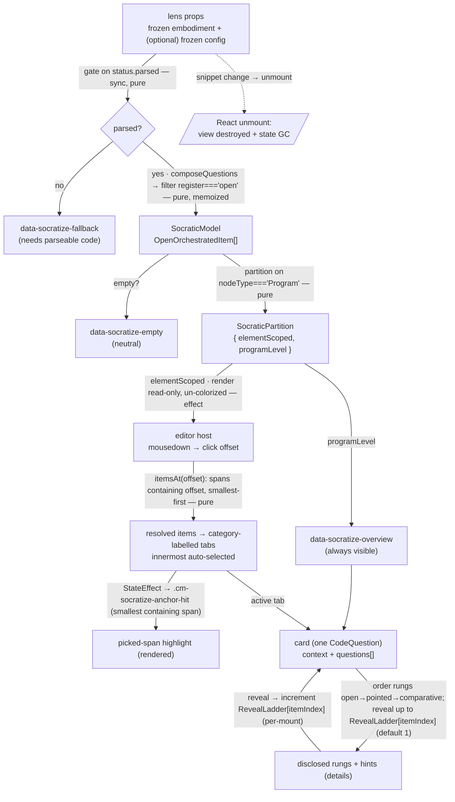

<!-- cspell:disable -->
<!-- markdownlint-disable -->
<!-- ANNOTATED QUARRY COPY (ruling R-5). The body after the marker line and
one blank line is byte-identical to git blob 79eb832a3c7708576d58db0b167fee04bd5499cc
(src/lib/study-lenses--deprecated-architecture/lenses/socratize/DOCS.md
at HEAD 1f0fb2d9, copied 2026-08-10). Designated source for the future
Stage-4 socratize lens session; NEVER edit the body — annotate only in this header.
Applicable rulings (see SPEC.md): R-4 un-colorized WINS —
KEEP the dependency omission; offset-native locations (locked decision 2);
rewrite guide = SPEC.md § Socratize DDD rewrite (KEEP/DELETE/CHANGE/RE-TYPE).
Verify: strip everything through the marker line plus one blank line, then
diff against: git show 79eb832a3c7708576d58db0b167fee04bd5499cc -->
<!-- ⇩ byte-identical quarry body below this line ⇩ -->

# socratize — Architecture & Decisions

## Why this module exists

The `socratize` lens is the learner's **open-question workbench**: read a
snippet rendered read-only and un-colorized, click any syntax element, and read
the Socratic question(s) that open in a panel — a `context` framing plus 1–3
prompts disclosed through the Feedback Ladder. Whole-program questions sit in an
always-visible overview shelf. Nothing is graded; the learner reflects. It is
the **open / Socratic** complement to the closed / gradable register
(`quizzing`, via the [`quiz`](../quiz/README.md) lens). See
[`./README.md`](./README.md) for the pedagogy, the public API, and the glossary.

It is a **consumer** of one pure lib and re-implements nothing:

- [`lib/question-orchestrator`](../../lib/question-orchestrator/README.md) —
  `composeQuestions` runs both question registers over the snippet and returns
  one `OrchestratedItem` stream. The lens takes only the **open** arm
  (`register: 'open'`) and renders each item's native `CodeQuestion`.

The lens consumes `composeQuestions`, **not** `socratizing` directly
("clean-once" — unified through the orchestrator from day one, no later rewire).
Anchor normalization, difficulty-laddering, and coverage all live upstream; the
lens owns rendering, the element/program partition, and the Feedback-Ladder
disclosure.

## Modules

| File        | Layer   | Purpose                                                                                                                                                                                                                                                                                                                            |
| ----------- | ------- | ---------------------------------------------------------------------------------------------------------------------------------------------------------------------------------------------------------------------------------------------------------------------------------------------------------------------------------- |
| `index.tsx` | wrapper | React `Component`; mounts the read-only un-colorized editor, captures clicks, renders the panel + overview shelf + card, owns per-mount UI state (picked span / active tab / `RevealLadder`); freezes + default-exports the `LensModule`                                                                                           |
| `core.ts`   | core    | `LensModule` defaults (`config`, `applicableTo`, `recommend`) + the pure derivations: `selectOpen` (the single seam to `composeQuestions` — filters `register: 'open'`), `partitionByScope` (on `nodeType === 'Program'`), `itemsAt` (containment resolution, smallest-span-first), and the rung ordering. No React, no CodeMirror |
| `types.ts`  | shared  | `SocratizeLensConfig`, `SocraticModel`, `SocraticPartition`, `RevealLadder`                                                                                                                                                                                                                                                        |

Default export of `index.tsx` is the frozen `LensModule` record. `core.ts`
imports no React and no `@codemirror/*`; `index.tsx` is the only file with
either. Tests target the core in isolation (vitest, no jsdom) plus the wrapper
end-to-end (jsdom + `@testing-library/react`); tests live under `tests/` (NOT
`lib/tests/`).

## Architectural sketch

> Written Phase 0, before implementation. The Refactor step of each increment is
> held against this sketch. Domain terms only — no function names beyond the
> contract, no pseudocode (React hook names like `useState` / `useEffect` /
> `useMemo` are acceptable as structural-mechanism references).

### Execution phases

1. **Mount + gate** (sync, pure) — the orchestrator passes a frozen embodiment
   and an optional frozen lens config via props (`config?` per the peer
   `LensProps`). The wrapper computes the parse gate from
   `embodiment.status.parsed`. On `false` it renders the
   `data-socratize-fallback` notice and stops. On `true` it proceeds.
   `composeQuestions` is total (empty on unparsed), so this gate is the
   UX-message boundary, not a throw guard (§ Why the gate is UX, not
   throw-avoidance).

2. **Select + partition** (sync, pure, memoized) — a `useMemo` keyed on
   `embodiment.source.code` runs `selectOpen` — `composeQuestions(embodiment)`,
   then a boolean filter to the OUTER `register === 'open'` arm — yielding
   `SocraticModel` (`readonly OpenOrchestratedItem[]`). `partitionByScope` then
   splits it on `question.nodeType === 'Program'` into
   `SocraticPartition { elementScoped, programLevel }`. `selectOpen` is the
   **single** site importing `composeQuestions` (§ H1 containment).

3. **Wire the read-only un-colorized editor** (per-mount, effect) — a mount
   effect instantiates a CodeMirror `EditorView` over `embodiment.source.code`
   with `EditorView.editable.of(false)` **and** `EditorState.readOnly.of(true)`,
   deliberately **omitting** `javascript()`, `oneDark`, and
   `syntaxHighlighting(...)` so the source renders plain black-on-white. The
   effect wires `EditorView.domEventHandlers({ mousedown })` which reads
   `view.posAtCoords({ x, y })` → a document offset, and reports the offset
   through a `useRef`-held callback (the ref lets the handler read the latest
   without remounting the view). A single `StateField<DecorationSet>` fed by a
   `StateEffect<[start, end] | null>` (dispatched from React when the resolved
   span changes — the phase-4 → phase-3 back-edge) renders one
   `.cm-socratize-anchor-hit` mark over the picked span, no remount. Cleanup
   destroys the view.

4. **Resolve the panel** (sync, pure) — on a non-null pick offset,
   `itemsAt(elementScoped, offset)` resolves **all** `elementScoped` items whose
   half-open `anchorOffsets` **contains** the offset (`start <= offset < end`).
   Analyzer spans nest, so this can return several items; they order
   **smallest-containing-span first** (most specific to the click), ties by
   source order. The panel renders one tab per resolved item (labelled by
   `CodeQuestion.category`), the innermost auto-selected; the highlight span
   (dispatched to step 3) is the smallest containing item's `anchorOffsets` —
   the lens has no independent token stream, so the highlight is derived purely
   from the resolved items. A click that resolves **no** item produces neither a
   panel nor a highlight (the "click outside any anchor clears the selection"
   edge). `programLevel` items never enter `itemsAt` — they render in the shelf.

5. **Render the card + Feedback Ladder** (sync) — each card (a panel tab body or
   a shelf entry, identical) renders `context` (plain text) then the
   `CodeQuestion`'s inner `questions[]` ordered by rung
   (`open → pointed → comparative`, present only), disclosed up to the revealed
   count in `RevealLadder[itemIndex]` (the item's stable index in the memoized
   `SocraticModel`; default 1 = the `open` rung — see § Why reveal state keys on
   the item index). A `data-socratize-reveal` control advances the count; each
   prompt's `hints` sit behind a `
`. Under the gated
   `disclosure: 'all'` all rungs render at once with no reveal control (§ Open
   questions).

6. **Render** (sync) — the wrapper emits the root `
`
   with either the editor host + the picked-span panel + the overview shelf, or
   (on `!status.parsed`) the `data-socratize-fallback` notice, or (parsed, zero
   open items) the neutral `data-socratize-empty` state.

7. **Unmount** (React-driven) — the orchestrator unmounts on snippet change or
   lens exit. React GCs the per-mount state and the CodeMirror view destroys via
   its effect cleanup. The lens MUST NOT leak past unmount.

### Data flow

Nodes are **data states** (the shape the lens holds at each step); edges are the
**operations** that transform one shape into the next. Dotted edges are
lifecycle.

The diagram is per-mount. The orchestrator (upstream) supplies the props; the
recommender (sibling) calls `applicableTo` / `recommend`. There is **no grading
edge** — no verdict, no mastery, no answer. The only dotted edge is lifecycle
(unmount). **There is no cross-mount persistence** — config is read from the
prop on mount; the picked span, active tab, and `RevealLadder` die with the
component instance.

### Structural constraints

- **Two-layer module shape** — `core.ts` does NOT `import React` or
  `@codemirror/*`. `index.tsx` is the only file with either. Per the lenses
  peer's [§ Structural constraints](../DOCS.md#structural-constraints).
- **`selectOpen` is the single seam to `composeQuestions`.** All coupling to the
  orchestrator lives in one pure function; a change to the entry signature (or
  the async evolution the orchestrator flags) touches only `selectOpen` and its
  `useMemo` — the render tree and types are untouched (§ H1 containment).
- **Partition on `nodeType === 'Program'`, never a span heuristic.** The
  discriminant is a crisp generation-time flag the socratizing engine sets on
  all 8 program-level analyzers (§ Why partition on nodeType). `elementScoped`
  and `programLevel` are disjoint by construction.
- **`itemsAt` is containment, not exact-match.** A click resolves every
  `elementScoped` item whose half-open `anchorOffsets` contains the offset
  (`start <= offset < end` — a click exactly on `end` belongs to the enclosing
  span, not this one). Nesting is expected; order smallest-containing-span first
  (ties by source order); the highlight is the smallest span. This differs from
  `quiz`'s exact-range match — `socratize`'s node anchors nest where quiz's
  token anchors do not, so the boundary rule is more consequential here.
- **`embodiment` parameter name** in core signatures that take a `Snippet`.
- **`data-lens="socratize"` on the wrapper's root element** — load-bearing for
  sandbox-harness selectors. The `data-socratize-*` attributes (`-editor`,
  `-panel`, `-tablist`, `-tab`, `-overview`, `-card`, `-category`, `-context`,
  `-questions`, `-question`, `-register`, `-register-badge`, `-question-text`,
  `-hints`, `-reveal`, `-fallback`, `-empty`) and the `.cm-socratize-anchor-hit`
  decoration class are sandbox selectors + CSS hooks; renaming any is a contract
  change.
- **Read-only, un-colorized editor.** Non-editable (`editable.of(false)` +
  `readOnly.of(true)`), no language / highlight extension. The lens never writes
  to the orchestrator's snippet setter (single-writer invariant). `writeme` is
  the read-only precedent; the un-colorized choice mirrors `quiz`.
- **Memo outputs and the pick callback are read through refs in the mount
  effect, never as effect deps** — so a re-derive or callback identity change
  does NOT re-run the mount effect (which would destroy and recreate the view,
  losing scroll). The effect's dep array is keyed on the source only. This
  mirrors the `blanks` / `writeme` / `quiz` remount-avoidance pattern; getting
  it wrong is the classic CM-lens scar.
- **No grading — the charter.** No verdict, no mastery, no answer key, no option
  buttons. The open register is non-gradable. Stated here where an implementer
  copying from `quiz` might reach for a `grade` call.
- **Reveal state is per-mount and disposable.** `RevealLadder` lives in
  component state, keyed by each item's stable index in the memoized
  `SocraticModel` (§ Why reveal state keys on the item index) — **not**
  `CodeQuestion.id`. It **persists across re-picks** for the life of the mount
  (so the always-visible shelf's escalation is not collapsed by an editor click)
  and resets only on snippet change / unmount. No `localStorage`, no module
  cache, no cross-mount refs.
- **LensModule surface stays synchronous.** `config()`, `applicableTo()`,
  `recommend()` are sync; `selectOpen` + `partitionByScope` + `itemsAt` are
  sync. Only the editor wiring is an effect. If `composeQuestions` becomes async
  (a flagged orchestrator evolution), `selectOpen` returns a promise and the
  wrapper brackets it with a `generating` state / `<Suspense>` — the
  `LensModule` surface stays sync per [`../types.ts`](../types.ts) (async setup
  is internal to the Component).
- **LensModule defaults return deep-frozen values.** `config()` returns a
  `cloneAndFreeze`-frozen `LensConfig`; `recommend()` returns a module-level
  frozen-empty-array constant; `applicableTo()` returns a boolean. Per the
  `freezeInPlace` / `cloneAndFreeze` convention.
- **Display content is rendered safely.** The editor renders source via
  CodeMirror's own document model; the panel + shelf render `context`, prompt
  `text`, and `hints` as plain text inside React elements (framework-escaped —
  never `dangerouslySetInnerHTML`).
- **No consumer-side branching on `embodiment.source.code`.** The lens _renders_
  `source.code` (legitimate) but discriminates only on
  `embodiment.status.parsed` and on item shape.

### Out of scope (this lens)

- **Grading / verdict / mastery.** Closed-register concerns; the open register
  is non-gradable by charter.
- **Item generation or filtering.** The lens consumes `composeQuestions` as-is;
  it never calls `socratizing` directly, and it does not re-implement the
  engine's build-time register/category filter (a future config-forwarding
  direction — § Future direction).
- **Co-anchoring with `quiz`.** Rendering closed + open items for one clicked
  span is a future increment; the retained `anchorOffsets` keeps it reachable.
- **`context` markdown.** Rendered as plain text v1.
- **Durable adaptive fading.** Per-mount only; cross-edit fading is an LMS
  concern.
- **Multi-language.** JavaScript-only (the package is `study-lenses`).

## Why consume `composeQuestions` (not `socratizing` directly)

The lens's item source is the orchestrator, not `analyzeMicroDecisions`. This is
the "clean-once" reconciliation: `socratize` (open) and `quiz` (closed) both
read one unified stream, so the two registers sit on one normalized grid from
day one — the orchestrator's `anchorOffsets` is what a future increment
co-anchors on to show both registers for one clicked span. Consuming
`socratizing` directly would strand that investment and force a later rewire.
The cost is that the lens's items do not flow until the orchestrator's
`composeQuestions` is implemented (§ H1 containment); the design is against the
committed types until then.

## Why partition on `nodeType === 'Program'` (not a span heuristic)

8 of socratizing's 56 analyzers are **program-level** — the 4 consistency
analyzers, `voice-profile`, and the 3 program-level comprehension analyzers —
each anchored at the acorn `Program` node, so their normalized `anchorOffsets`
spans (approximately) the whole source. No single clicked element can reach
them.

The tempting predicate — "`anchorOffsets` spans ~the whole source" — is
**wrong**: a point-analyzer question on a statement that happens to BE the whole
program (e.g. a one-line `if`) also spans the whole source, so span does not
separate the two populations. The correct discriminant is already in the
payload: `CodeQuestion.nodeType`. The socratizing `ProgramAnalyzer` contract
sets `nodeType: 'Program'` on exactly the program-level questions (verified
across all 8 analyzers), so `question.nodeType === 'Program'` is an exact,
generation-time split — element-scoped → the click-driven panel, program-level →
the shelf. Disjoint by construction, no heuristic.

## Why the editor + overview shelf (a small hybrid)

The anchored editor (mirroring `quiz`) gives spatial grounding — "these
questions are about _this_ element" — and shares a substrate with `quiz` for the
future co-anchor view. But whole-program questions have no element to anchor.
Rather than force them into a token click (unreachable) or flood every click
with them (a containment `itemsAt` over whole-source spans would attach them to
every element), the lens partitions them out (§ Why partition on nodeType) into
an always-visible `data-socratize-overview` shelf. The two surfaces share one
**card** renderer, so the hybrid adds an outer shell, not a second content path.

## Why progressive disclosure is safe here (questions, not answers)

The Feedback Ladder reveals `pointed` then `comparative` rungs on demand, which
looks like the "students click through hints without thinking" failure the
`socratizing` DOCS flags. It is not: there is **no answer at the bottom of the
ladder to click through to**. Every rung is another answer-free question, and
`hints` are tool references ("try reading line {n} aloud"), not solutions.
Because the open register carries no answer key, ungated reveal (no forced
attempt, no timer) is acceptable — the hint-abuse failure mode is structurally
absent. This is `socratizing`'s own hint-abuse-resistance thesis, inherited by
the lens.

## Why `SocraticModel` is `OpenOrchestratedItem[]` (not `CodeQuestion[]`)

`selectOpen` returns the whole open **item**, not just its `.question`. The item
retains the orchestrator's computed `anchorOffsets` (which drives picking,
highlighting, and the scope partition), the namespaced `id`, and `cells`. The
render reads `item.question` for the `CodeQuestion` content, so "render the
`CodeQuestion` as-is" is honored — but keeping the whole item is what makes the
future co-anchor-with-`quiz` view and a real `recommend()` (over `cells`)
reachable without re-plumbing. Projecting to `CodeQuestion[]` up front would
throw away the coordinate the orchestrator layer exists to provide.

## Why reveal state keys on the item index (not `CodeQuestion.id`)

Per-card reveal state needs a **per-instance** identity, and neither the native
`CodeQuestion.id` nor the orchestrator's namespaced `id` provides one.
socratizing ids are **constant per analyzer** — `what-is-declared` fires on
every declaration, so a two-declaration snippet yields two open items both
carrying `id: 'what-is-declared'` — and the orchestrator contract states it
plainly: _"There is no per-item unique-identity field — do not dedup on `id`"_
(`question-orchestrator/types.ts`). Keying `RevealLadder` on `id` would collide:
revealing the `pointed` rung on one `let` would pre-escalate the other, and a
program analyzer emitting several questions under one id would escalate them all
together.

The only collision-free per-card identity is the item's **index in the memoized
`SocraticModel`** — stable for the life of the mount (the model is `useMemo`'d
on the source), unique per item, and it moots the id-uniqueness question
entirely. So `RevealLadder`, the card's React `key`, and `data-socratize-card`
all key on the index. (The `CodeQuestion.id` is still meaningful for the
_coarse_ per-analyzer adaptive fading socratizing designed it for — suppress
every `let-vs-const` question at once — which is a deliberately different
granularity from per-card reveal; that is Future direction, not v1.)

## The register homonym (three axes, one token)

The token `open` appears at three levels; the lens reads each at its own level:

- **Outer — `OrchestratedItem.register`** (`open | closed`): the which-lens
  axis. The lens **filters** to `open`.
- **Inner — `Question.register`** (`open | pointed | comparative`): the
  rhetorical rung. The lens **renders** and **escalates** through these.
- **`CompositionConfig.ladder`** (a boolean, Block-Model difficulty ordering
  `atom → … → macro`): an upstream ordering knob — **not** the Feedback Ladder,
  and not read by the lens for disclosure.

`selectOpen` operates on the outer axis; the card operates on the inner axis;
the two never cross.

## H1 containment (designed against committed types)

`composeQuestions` is specified in
[`../../lib/question-orchestrator/`](../../lib/question-orchestrator/README.md)
but its entry function is not yet built. The lens is designed against the
**committed types** (`OpenOrchestratedItem`,
`OrchestratedItemBase.anchorOffsets`, `QuestionSet`), and its coupling is
confined to `selectOpen`. Two consequences for Phase 1:

- **Testability before the orchestrator ships.** `core.test.ts` mocks the
  `compose-questions.js` module boundary (`vi.mock`) with a hand-built
  `QuestionSet` of mixed open/closed + program/element items, so `selectOpen`,
  `partitionByScope`, and `itemsAt` are verified without waiting on H1. The mock
  is repointed at the real entry (or a fixture) when H1 lands.
- **Drift is one function.** If H1's entry signature changes (including the
  documented sync→async evolution), only `selectOpen` and its `useMemo` change.

## Module ownership

The lens owns its own `README.md`, `DOCS.md`, `types.ts`, source (`core.ts`,
`index.tsx`), CSS, and tests. Cross-cutting lens conventions (two-layer split,
`data-lens` invariant, `LensConfig` shape, no-source-code-branching, disposable
practice) live in [`../README.md`](../README.md) + [`../DOCS.md`](../DOCS.md);
this lens inherits them. It consumes — and never modifies —
`lib/question-orchestrator` and `orchestrate/lib/socratizing`.

## Open questions (for the human review gate)

- **`disclosure: 'all'` in v1** — the ratified v1 behavior is progressive
  disclosure (`'ladder'`). Does v1 also **build** the `'all'` escape-hatch
  render mode (a second full render path + branch), or merely **define** the
  field (mirroring `quiz`'s capture-the-contract posture) and defer the mode to
  a later increment?
- **Mid-size spans** — a question anchored to a whole function (not the file,
  not a token) is `elementScoped` by the `nodeType` split (it is not
  `'Program'`), so it is reachable by clicking anywhere inside the function via
  containment `itemsAt`. Confirm this is the intended routing (the alternative —
  a size threshold that promotes large-but-not-program spans to the shelf — is
  rejected as reintroducing the span heuristic).
- **`context` markdown** — render the PBSI emphasis (`**implementation**`) as
  formatted text, or plain text in v1? (Sketch assumes plain text.)
- **Reveal-state model** — the sketch uses one `RevealLadder` (keyed by item
  index) shared by both the panel and the always-visible shelf, persisting
  across re-picks for the mount. Confirm this over the alternative of splitting
  a transient panel ladder from a durable shelf ladder (rejected as unneeded
  complexity — one per-mount map is coherent for both surfaces).

## Future direction

See [`./README.md` § Future direction](./README.md#future-direction): co-anchor
with `quiz` on shared `anchorOffsets`; durable adaptive fading keyed on the
(coarse, per-analyzer) `CodeQuestion.id`; educator config-forwarding of a
`MicroDecisionConfig` slice; real `recommend()` over the open items' `cells`;
`context` markdown; and the span-render display fallback if read-only-CodeMirror
click capture proves fragile.
