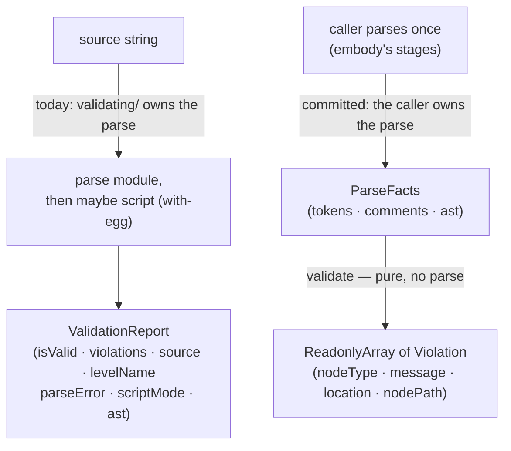

<!-- cspell:ignore Parenthesized preserveParens curric quiescent relitigate frontmatter unreviewable destructures -->

# Handoff — study-lenses greenfield: build the JEJ language level

> Written 2026-07-15 by the session running the parallel **embody** stream,
> after reading the committed language-levels contracts and the JEJ quarry.
> Baseline HEAD at writing: `0fca239`, tree clean, `origin/main == HEAD`.
> **Record your OWN baseline SHA at plan approval — never reuse a SHA from this
> brief.** Nothing here outranks governance.

## Read first, in this order (before ANY planning)

1. `CLAUDE.md` (repo root — the governance router), then your governance file
   per that router (`AGENTS.md`, or `AGENTS.fable.md` **only** if your model id
   contains "fable") — **END-TO-END**. Then `DEV.md` — **END-TO-END** (~2030
   lines; paginate, do not sample). **Governance outranks this brief.** You will
   be held to invariants 2 (Phase 0 before Phase 1), 6 (plans are execution
   checklists), 9 (read whole files), 10 (Plan-agent pass in plan mode), and 11
   (validate your own handoff).
2. The **committed contracts** — what you implement against:
   - `src/lib/study-lenses/README.md` — the package glossary. **The naming
     contract**: every type, function, and doc you write uses its words.
   - `src/lib/study-lenses/language-levels/README.md` — the level contract's
     mechanics, incl. § "Adding a level" (your required directory shape).
   - `src/lib/study-lenses/language-levels/types.ts` (147) — the spine you
     satisfy.
   - `src/lib/study-lenses/language-levels/DOCS.md` — the region's sketch + its
     Decisions (they explain _why_ the spine is shaped this way; several of your
     open questions are answered by them).
3. The **ratified decision record** — background rationale, **§§ 0–5 ONLY**:
   `/Users/master/.claude/plans/read-through-0-curricula-dev-md-0-curric-cosmic-mountain.md`
   (`## 6` onward is spent drafting scaffolding — never execute from it).
   Relevant: § 2.6 (levels), § 2.9 (day-one roster), § 4.1 (decisions that die),
   § 4.3/P2 (this deliverable's phase).

   > ⚠️ **The record is OLDER than the committed contracts and loses to them on
   > every conflict.** It is rationale, not authority. Two concrete traps: it
   > says **"kernel"** natively (a **banned term** — see § Vocabulary), and it
   > says validate returns "the existing `Violations` shape", which still
   > carried `severity` when it was written. **`severity` is now ratified as
   > absent.** When the record and a committed `types.ts` disagree, the
   > `types.ts` wins. Do not quote the record into new writing.

4. This file.

You do **not** need to read the embody region to do this work. There is **no
type edge** between language-levels and embody, by design.

## Mission

Build `src/lib/study-lenses/language-levels/jej/` — the JEJ (Just Enough
JavaScript) language level — satisfying the committed `LanguageLevel` spine, by
migrating the level-specific facts out of the old `src/lib/embody/` tree.

## Scope — ruled by the maintainer, not open

**IN:** `validate` · **`docs.reference` only** · `snippetTypes` · `models` ·
`key` / `label`, plus the level's own `README.md`, `DOCS.md`, `types.ts`.

**OUT — named so you do not discover them mid-flight:**

- **`editorSupport` — DEFERRED (maintainer ruling, 2026-07-15).** Not your
  deliverable. _Why, so you don't relitigate it:_ the spine types all three
  channels `unknown` because their shapes "belong to the adapter's contract" —
  **and no adapter exists.** Building them now means the level inventing its
  consumer's contract, which `language-levels/DOCS.md` § Decisions explicitly
  forbids ("the consumer of the data owns what the data must look like").
- **`docs.notionalMachine` — DEFERRED (maintainer ruling, 2026-07-15).** Ship
  **`docs.reference` only**. _Why:_ `notional-machine.md` (797 lines) **is not a
  string migration — it contradicts the ratified model.** Verified 2026-07-15:
  - line 57: **"## Lifecycle: four phases"** — the ratified lifecycle is **six**
    flat phases (`source → realm → tokens → ast → environment → evaluation`).
  - line 59: **"Realm is static data, not a runtime phase."** — ratified,
    `realm` **is** a phase.
  - **`creation` ×9** (line 175: _"during creation phase"_) — retired; its
    successor is `environment`, and **creation-as-phase is a banned term**.
  - **`isJeJ`** (line 572) — a dead API and a **banned term**.

  Rewriting it is real pedagogy work on a learner-facing model, not migration,
  and it would resize this deliverable past a single cold-start. It costs
  nothing to wait: **nothing reads level docs yet** — no selector, no hover, no
  registry, no consumer of any kind. **The NM rewrite is its own later
  deliverable**; the defects above are listed so its author starts informed
  instead of rediscovering them. `reference.md` **passes the banned-term grep (0
  hits) — but that is ALL that was verified about it.** It was never audited
  against the ratified model, and it fails: `reference.md:216` says _"Your
  programs run as **strict mode scripts** … automatically adds `"use strict"`"_
  — a posture the ratified model has no stage for, and the direct opposite of
  the in-progress `jej/README.md:35` (_"JEJ programs are **modules** … no
  prologue is injected"_). **That contradiction IS OQ-1; do not resolve OQ-1
  from `reference.md`, because `reference.md` is one of the things in
  conflict.**

- **aithor** — `src/lib/embody/language-levels/just-enough-javascript/aithor/`
  (~1,914 src + ~2,538 test lines). It sits _inside_ the old JEJ level
  directory, but record § 2.1 relocates it to **`lib/aithor`** — a pure leaf
  generator. The spine has **no slot for it**. It also drags `lib/local-llm/`
  (~1,884 lines). **A separate, later deliverable. Do not migrate it. Do not let
  it into your plan.**
- **lint** — `src/lib/study-lenses--deprecated-architecture/lib/linting/` (169).
  The contract is explicit: "Lint diagnostics are **not** here: they are a
  presentation adapter over the same validate result, never a second validation
  source." Re-homes outside the level. Not yours.
- **The old validator's execution-gate consumers** —
  `embody/lib/evaluating/{run,intercept,trace}` call
  `validate`/`validateProgram` to gate execution. All dead under the new model
  (acorn is the run ceiling; enforcement is orchestrator-side). Do not drag them
  in; do not "fix" them.
- **The quiz seam** — FORWARD NOTE, NO WORK. `lib/admitting` dissolves (record §
  4.1); quiz's applicability will import your `validate` directly. The quiz lens
  does not exist in the greenfield. Nothing to do today.

### The terminal artifact, stated plainly

`LanguageLevel` requires **all seven fields**, so with `editorSupport` deferred
**no `index.ts` lands in this deliverable.** `jej/` ships its parts — the
validator, the docs, the models, the snippet types — plus its own README/DOCS/
types. **The spine object lands last, in a later deliverable, when the final
field is real.** This costs nothing today: _nothing registers levels yet_ —
there is no orchestrator, no registry, no selector, no consumer of any kind. Do
not invent a placeholder `editorSupport` to make `index.ts` compile.

Your `jej/README.md` and `jej/DOCS.md` still describe a **complete** level in
present tense — end-state docs, always (DEV.md § What goes in docs vs. plans vs.
handoffs). The implemented-vs-pending gap lives in **your plan's RESUMPTION
POINT**, never in the docs.

## This is a NEW module — you owe a FULL Phase 0

> ⚠️ **CORRECTION (2026-07-15, after this brief was committed): `jej/` EXISTS
> and is NOT empty.** An agent is already executing this brief. At `6ef5458` the
> directory holds committed `reference.md`, `notional-machine.md`, and
> `notional-machine.svg`, plus an **untracked, in-progress `README.md`** that is
> **in no commit and no stash — irrecoverable if overwritten.** **Step 0.2 below
> therefore reads "review and revise the existing `jej/README.md`", NEVER
> "write" it.** Check `git status`/`git log` per file before touching anything
> here. See `src/lib/study-lenses/language-levels/jej/REVIEW-NOTES.md` for the
> live state and three further corrections to this brief.

The committed `language-levels/{README,DOCS,types}` is the **region's** Phase 0
(the spine) — it is not `jej/`'s. Invariant 2 applies at full strength, and
DEV.md § Phase 0 warns that agents skip it exactly when work feels like "just a
migration". **This is not just a migration:** the `validate` contract inverts (§
The big reshape).

**Do not write a line of implementation until step 0.7's human gate clears.**

- [ ] **0.1 — Ubiquitous language.** A glossary for `jej/`, drawn from the
      package glossary. Do **not** coin synonyms for words it already owns
      (embodiment, Facts, fit, applicability, level, NM, violation). Resolve:
      what is an "allowlist"? a "node rule"? a "scope analysis"?
- [ ] **0.2 — Review and revise the EXISTING `jej/README.md`** — it is untracked
      and irrecoverable; **never `Write` over it** (see the correction above) —
      what this level curates, for whom, on what notional machine; its boundary
      (what it owns, what it does not).
- [ ] **0.3 — Run `ar-1`** (Design Challenge), by registered name. Give it the
      README, the committed spine, and the open questions below.
- [ ] **0.4 — Write `jej/types.ts`** — the level's own model types, folding in
      ar-1's findings.
- [ ] **0.5 — Write `jej/DOCS.md`** — the architectural sketch: execution
      phases, a `## Data flow` **Mermaid** diagram, structural constraints,
      out-of-scope, Decisions. No function names, no variable names, no
      pseudocode. **This is what your Refactor step is held against.**
- [ ] **0.6 — Run `ar-2`** (Architectural Sketch Challenge), by registered name.
- [ ] **0.7 — Review, resolve, commit, HARD STOP.** Can README + DOCS + types be
      read together to predict the implementation's shape? Commit
      (`docs: establish jej language level domain model and architectural sketch`),
      announce SHA + message, **then STOP and present to the maintainer. Phase 1
      does not start until they approve.** This gate is not yours to waive.

> **You are not blocked by the open questions — but be precise about where the
> line falls.** A cold reader validated this brief and _did_ stall here, so:
>
> - **0.1 (glossary) — fully writable now.** Zero OQs needed.
> - **0.2's PROSE — writable now.** What JEJ curates (the admitted node types,
>   the 17 globals, the blocked members, the operator sets — all readable from
>   `just-enough-js.ts`), for whom, and its boundary. None of it depends on
>   where a walker lives or how docs load.
> - **0.2's `## What lives here` file tree — NOT writable yet.** All five
>   sibling region READMEs open with one, and **OQ-5 shapes `jej/`'s file
>   layout.** Do not invent it. **The escape: write 0.2's prose now, leave the
>   tree for last, and fill it in at the 0.7 commit once OQ-5 is ruled.** The
>   README is not committed until 0.7 anyway, so nothing is lost.
> - **"On what notional machine" — write it from `reference.md` and the package
>   glossary, NOT from `notional-machine.md`** (which is deferred and carries a
>   superseded four-phase model — see § Scope).
>
> Then take the questions to `ar-1` (0.3) and to the maintainer at 0.7. That is
> what those forums are for. **Do not stall waiting for answers, and do not
> unblock yourself by silently deciding one.**

**AR dispatch rule:** invoke `ar-1`…`ar-5` **by registered name, and NEVER pass
a `model` parameter** — the pins live in the agents' frontmatter, and a `model`
argument silently overrides the configured roster (DEV.md § Sub-model dispatch).
The wave-era ar-2 opus override was a Fable-tied exception and it is over.

## Phase 1 — the per-increment cycle (after the human gate)

For EACH increment, in order. **This list is your plan's steps** — invariant 6:
"if a step is not written in the plan, it will be skipped."

- [ ] JSDoc/TSDoc the behavioral contract (`@remarks` for consumer-facing why)
- [ ] Stub the function
- [ ] `npx eslint <new-file>` — fix
- [ ] **ONE** failing test, ZOMBIES order (degenerate case first)
- [ ] **Run `ar-3`** (Test Strategy), by registered name
- [ ] `npx eslint <test-file>` — fix
- [ ] Implement minimally (Fake It is legitimate on the first test; it expires
      at the second)
- [ ] `npx eslint <impl-file>` — fix
- [ ] Refactor against `jej/DOCS.md` — phases distinct? concerns separated? Fake
      It residue triangulated away? ubiquitous language used?
- [ ] **Inter-file contract check** — if a file enters/leaves the data flow, or
      an I/O shape or phase annotation changes: **STOP and flag the
      maintainer.** `DOCS.md` is an architectural contract; changes need
      approval.
- [ ] `npx eslint` + `npx markdownlint-cli2` on modified files
- [ ] Finalize types
- [ ] Self-review (the anti-pattern + pre-proposal checklists)
- [ ] **Run `ar-4`** (Implementation Audit), by registered name
- [ ] Quality checks — **see § Gates: repo-wide gates are RED for foreign
      reasons**
- [ ] Sandbox checkpoint: declare **"no sandbox checkpoint: pure utility"**
      (there is no mounted surface — no orchestrator exists)
- [ ] Verify README/DOCS still match
- [ ] **Atomic commit** — ONE behavior, path-scoped, announced (SHA + message)

Before any merge prompt: **run `ar-5`** with your **baseline SHA + the modified
paths** (it runs `git diff` itself — pass paths, never pasted contents). Resolve
PAUSE/CONSIDER per DEV.md § Resolution Rules.

## THE BIG RESHAPE — the parse-facts inversion

This is the deliverable's dominant risk. Read it twice.

**Today** (`src/lib/embody/lib/validating/validate-program.ts:40`):
`validateProgram(source: string, allowlist: SyntaxAllowlist): ValidationReport`
— it **parses internally**, module-first, and on failure re-parses in script
mode, keeping the script AST **only if it contains a `WithStatement`** (the
`with` easter egg). It returns an envelope
`{isValid, violations, source, levelName, parseError, scriptMode, ast}`.

**The committed contract:**
`validate: (facts: ParseFacts) => ReadonlyArray<Violation>` — pure, sync,
**never parses** ("one parse truth"), never consulted about a program that does
not parse, returning a **bare array**.



**Consequences to plan for:**

- **All 286 validator test cases feed a source string in.** Every arrange step
  is rewritten to construct `ParseFacts`. That — not line volume — is the
  dominant cost. **Build a `parseFactsOf(source)` test helper FIRST, as its own
  increment.** It makes every arrange `validate(parseFactsOf('…'))` and
  collapses the cost.
- **How to shard the rewrite** (do NOT do it as one mega-commit — that violates
  one-behavior-per-commit and is unreviewable): the tests come along **with the
  behavior they cover**, one increment at a time, following the code's own
  dependency order — `create-violation` (**9**) → `collect-violations` (**22**)
  → `check-undeclared-globals` (**33**) → the JEJ allowlist's node rules
  (`just-enough-js`, **109** — shard further by rule family; this is the big
  one) → `validate-program` (**19**) → `integration` (**65**) last. **286 total,
  but the migrating budget is 257** — subtract `is-jej` (6) **and
  `validate.test.ts` (23)**, because the quarry table below marks **both
  `is-jej.ts` and `validate.ts` DO-NOT-MIGRATE**. Porting tests for a module you
  are not migrating would violate the very next sentence: **never port a test
  whose behavior this increment does not implement.** If any of
  `validate.test.ts`'s 23 cases assert behavior worth keeping, name them and say
  which increment adopts them; otherwise they die with `validate.ts`.

> ⚠️ **Count tests by RUNNING them, never by grepping `it(`.** An earlier draft
> of this brief said 245, from a static grep. The real number is **286**:
> `just-enough-js.test.ts` reports **109**, not the 68 `it(` call sites, because
> four of them sit inside `for` loops and generate tests at runtime. Verify with
> `npx vitest run --project unit src/lib/embody/lib/validating/`. **This applies
> to every count in this brief** — the line counts are greps and are reliable;
> the test counts came from a run and are stated above.

- **`severity` is a pure deletion.** The old `Violation` carries
  `severity: 'rejection'` — a single-member literal, always defaulted. The
  committed `Violation` has no such field, and `language-levels/DOCS.md` records
  why: a violation never blocks execution and posture is global, so a
  per-violation severity would carry zero information and a false implication.

  > **Provenance — read this before you trust either source.** The neighboring
  > `study-lenses-phase1-entry.md` **TRAP 5** says
  > `Violation`-without-`severity` is _"awaiting the maintainer's confirmation…
  > treat as amendment-risk"_. **That is now out of date: the maintainer
  > RATIFIED it on 2026-07-15**, in the session that wrote this brief. The
  > ruling exists nowhere else in the repo — this line is its record. **This
  > brief supersedes TRAP 5 on this point.** Do not relitigate it, and do not
  > spend your 0.7 gate on it. (TRAP 5's other three surfaces were ruled the
  > same day: `error-interpreting` keeps `['tokens','ast']`; the `snippet` prop
  > keeps its name; the root refusal-as-data clause is approved for amendment.
  > None of the four is your work.)

  One live reader breaks —
  `src/lib/study-lenses--deprecated-architecture/lib/linting/violation-to-diagnostic.ts`
  destructures it. That file is lint-adapter code, **outside your scope, inside
  a deprecated tree**. Do not fix it. Note it.

## Named OPEN QUESTIONS — surface, do not resolve

Take these to `ar-1` (0.3) and to the maintainer at the 0.7 gate. **The
maintainer has said they will have these discussions with you directly.**
Several are inter-region and may be PAUSE-worthy.

### OQ-0 — the maintainer's proposed spec change (decide WITH them, first)

The maintainer has proposed: _"update the spec to accept either raw source or
facts, with a conditional parsing stage if source."_ **It is not ruled yet, and
it is not a `jej/`-local change.** The conflicts, so your discussion is
informed:

- It contradicts **"One parse truth"** in **three committed docs**, including
  the **package-root** `DOCS.md` ("nothing in the package parses the same
  settled source twice") — a package-level structural constraint — plus
  `language-levels/DOCS.md` ("validate consumes parsed values and **never
  parses**") and its README.
- It contradicts **"passive, never an actor"**: a level that parses is
  machinery.
- **It has an undefined-behavior hole.** `validate` returns
  `ReadonlyArray<Violation>` — **no error arm**. What does
  `validate(unparseable)` return? `[]` reads as "fits" — a lie, and exactly the
  "a typo never reads as a level violation" rule. The `undetermined` verdict is
  explicitly **the caller's**, "produced without consulting any level". So the
  union input also forces a **return-type** amendment, reintroducing the
  `ValidationReport{parseError, scriptMode}` envelope the new contract deleted.
- It re-opens OQ-1 rather than settling it.

**Cheaper routes to the same benefit:** (A) the `parseFactsOf(source)` **test
helper** — kills the 245-rewrite cost, contract untouched (recommended); (B) a
convenience wrapper **inside `jej/` but off the spine** that takes source,
parses, and delegates — ergonomics without widening the contract; (C) amend the
spine, plus the return type, plus the root DOCS, with the full docs AR cycle.

**Until the maintainer rules: build against the committed contract as it
stands** and treat this as amendment-risk.

### The rest

- **OQ-1 — the `with` easter egg / scriptMode.** JEJ's allowlist has
  `WithStatement: true`, reachable today only via a script-mode re-parse. Under
  the committed contract `validate` receives already-parsed facts and **cannot
  re-parse**, so the fallback has no home. Does `with` survive? **`snippetTypes`
  is genuinely unknown — I did not verify it; do not assume `['module']`.**
- **OQ-2 — where the generic walker lives.** The engine is already parameterized
  (`validateProgram(source, allowlist)`;
  `SyntaxAllowlist {name, allowedGlobals?, blockedMemberNames?, nodes}`;
  `NodeRule = true|false|NodeValidator`; default-deny), so the generic/JEJ split
  is largely done by construction. But `language-levels/types.ts` is a contract,
  not a home for machinery, and `language-levels/DOCS.md` § Out of scope says
  "the generic validating machinery — a shared leaf a level's validate may
  parameterize internally". Record § 2.6 marks this **[PROPOSED], not
  [DECIDED]**. Does `jej/` vendor its own walker, or is a shared leaf introduced
  (a new module ⇒ its own Phase 0)? **Inter-region.**
- **OQ-2b — the walker's traversal primitives.** `collect-violations.ts` and
  `check-undeclared-globals.ts` both import
  `../parse-old/build-node-path-map.js` and `../parse-old/get-child-nodes.js` —
  fully JS-generic, level-agnostic AST traversal (`build-node-path-map` stamps
  the `$.body.0.declarations.0` paths `Violation.nodePath` needs). **Measured:
  23 consumer files (12 non-test) — but most sit in the deprecated tree or in
  aithor, so only ~6 are live non-quarry. The two named primitives carry 15
  tests** (`build-node-path-map` 9 + `get-child-nodes` 6; the oft-quoted "55" is
  all of `parse-old/`). Shared-leaf material, though weaker than the raw
  consumer count suggests. `lib/parse` is **P3a and does not exist**. Vendor,
  duplicate, or block? **⚠️ Cross-stream: the parallel embody stream needs the
  same primitives and is currently planning to use them as reference for its own
  bespoke walk, not to build the leaf. Coordinate through the maintainer — do
  not assume `lib/parse` is coming.**
- **OQ-3 — `notional-machine.svg` has no slot.**
  `LevelDocs {reference, notionalMachine}` is two markdown strings; the quarry
  also has an SVG. Drop, inline, or extend `LevelDocs` (a committed-contract
  amendment → maintainer)?
- **OQ-4 — `KNOWN_JS_GLOBALS`.** `check-undeclared-globals.ts` holds a
  module-level set of known JS globals — **JS-generic knowledge, not JEJ
  policy** (JEJ policy is the 17-name `allowedGlobals`). Generic leaf or
  level-owned? Rides with OQ-2.
- **OQ-5 — how does `reference.md` become a `string`?** `LevelDocs.reference`
  wants a string; `reference.md` is a **3,178-line file**, heavy with code
  fences and backticks. **There is no `?raw` import precedent anywhere in
  `src/`.** Every option has a real cost: a TS template literal means escaping
  backticks and duplicating the prose (violating DOCS.md's "Single home for
  level facts — no copies elsewhere to drift"); `?raw` needs vite + vitest + tsc
  to agree plus a `.d.ts` shim; `readFileSync` is not browser-safe and this is a
  browser package. **Decide in Phase 0 — it shapes `jej/`'s file layout, and it
  is the ONE open question that blocks 0.2's file tree.** (Half the problem it
  was: `notional-machine.md` is deferred, so only `reference.md` needs loading.)
- **OQ-6 — parser-option preconditions `ParseFacts` cannot express.** The
  sharpest one. `validate` no longer controls the parse, but JEJ's code has
  hard, unexpressed preconditions on _how the caller parsed_:
  - `just-enough-js.ts:456` does `const loc = node.loc!` — a **non-null
    assertion**. `Violation.location` is **unsatisfiable** unless the caller
    passed `locations: true`, and acorn's `Program` type makes `loc` optional,
    so **the committed `ParseFacts` cannot enforce it.**
  - The allowlist admits `ParenthesizedExpression`, which **only exists under
    `preserveParens: true`** (old `parse-old/parse-program.ts:42` set it).
    Without it, that rule is dead code.

  Does `ParseFacts` need a documented precondition, a contract amendment, or a
  runtime guard? **Inter-region — expect to escalate.** ⚠️ **The parallel embody
  stream is currently planning to DROP `locations: true`** (its `StageCause`
  uses acorn's `.pos`/`.loc` from the error object, which needs no parse
  option). If that lands and you need `node.loc`, the two streams collide.
  **Raise this early.**

## The quarry map — EXACT paths, with classification

⚠️ **The canonical quarry is `src/lib/embody/`, NOT the deprecated tree.** The
maintainer's `0fca239` split the old tree: the bulk moved to `src/lib/embody/`
as **pure renames**, while ~16 files landed in
`src/lib/study-lenses--deprecated-architecture/embody/` as a **stale, broken
orphan that cannot compile** — its relative imports dangle (they resolve to
paths _inside_ the deprecated tree that do not exist), which is precisely why it
will not build. The deprecated tree has **no `lib/validating/` at all**. **⇒
`.planning-handoffs/study-lenses-phase1-entry.md` TRAP 2 is STALE and now FALSE.
Do not act on it.**

> ⚠️ **`embody` names three different things. Never `grep -r embody` and trust
> it.**
>
> 1. `src/lib/embody/` — **the quarry** (the old implementation). Yours to read.
> 2. `src/lib/study-lenses/embody/` — **the greenfield region** (docs + types
>    only). Not yours; no type edge reaches it from language-levels.
> 3. "the embody **stream**" — the parallel agent building #2 from #1.
>
> All paths below are written in full from the repo root for this reason.

**Maintainer's posture (verbatim):** _"when TDDing you can first look there for
the comparable codebase and either copy→modify it to match the new specs, or (if
it already works as-is like will many of the utilities), then copy it and
**carefully verify** that it does in fact meet the new requirements."_ The
verification instrument is **your ZOMBIES suite, written from the committed
contract** — never from the quarry. That is how a copied utility is proven.

**Validator** — `src/lib/embody/lib/validating/` (8 src, ~1,741 lines; 8 test
files, 245 cases):

| Path                          | Lines | Do                                                                                                                                                                                                            |
| ----------------------------- | ----- | ------------------------------------------------------------------------------------------------------------------------------------------------------------------------------------------------------------- |
| `just-enough-js.ts`           | 599   | **MODIFY** — THE JEJ allowlist: operator sets, blocked-member set, 17 `allowedGlobals` (incl. `eval`, an easter egg), 13 node validators. The level's policy core. Keep the policy; drop `severity`.          |
| `collect-violations.ts`       | 128   | **MODIFY** — generic default-deny walker. Home = OQ-2.                                                                                                                                                        |
| `check-undeclared-globals.ts` | 475   | **MODIFY** — scope-aware global check. **Imports `buildScope`** (see coupling). `KNOWN_JS_GLOBALS` = OQ-4.                                                                                                    |
| `create-violation.ts`         | 48    | **COPY, minus `severity`** — the freezing factory.                                                                                                                                                            |
| `types.ts`                    | 259   | **MODIFY/SPLIT** — level-owned vs generic; `ValidationReport`/`BaseResult` die.                                                                                                                               |
| `validate-program.ts`         | 123   | **REWRITE** → the level's `validate(facts)`. Loses the parse, the double-parse, the envelope.                                                                                                                 |
| `validate.ts`                 | 69    | **DO NOT MIGRATE** — `BaseResult` envelope, JEJ-bound. Dead.                                                                                                                                                  |
| `is-jej.ts`                   | 40    | **DO NOT MIGRATE** — JEJ-bound + an **async** Prettier format gate. Async is incompatible with a sync `validate`; formatting is not a level concern. ⚠️ **`isJeJ` is a BANNED term — do not carry the name.** |
| `tests/*.test.ts`             | 2,427 | **REWRITE every arrange step** (245 cases). Assertions largely salvage; inputs do not.                                                                                                                        |

**Models:**

| Path                                                 | Lines | Do                                                                                                                                 |
| ---------------------------------------------------- | ----- | ---------------------------------------------------------------------------------------------------------------------------------- |
| `src/lib/embody/lib/scope/build-scope.ts`            | 401   | **MODIFY** → a `models` builder. "Pure function: AST in, frozen ScopeAnalysis out", explicitly JEJ-scoped. Nearly the right shape. |
| `src/lib/embody/lib/scope/types.ts`                  | 87    | **MODIFY** — `ScopeAnalysis`, `ScopeInfo`, `DeclarationInfo`.                                                                      |
| `src/lib/embody/lib/scope/tests/build-scope.test.ts` | 425   | **MIGRATE — 38 real tests** (verified green).                                                                                      |

- ⚠️ **Coupling: `check-undeclared-globals.ts:5` imports `buildScope` from
  `../scope/build-scope.js`.** So **`validate` depends on the scope model** —
  the models are _not_ an independent slice you can defer past validate.
  Sequence accordingly.
- **The realm model does not exist** — net-new ("a realm model needs no program
  at all"). Design it in Phase 0 or defer it explicitly; do not discover it
  mid-Phase-1.
- **The evaluation model is not a builder today** — it is tracing
  instrumentation. Do not migrate it as a model.

**Docs** (`src/lib/embody/language-levels/just-enough-javascript/`):
**`reference.md` (3,178) → `docs.reference`** per **OQ-5**. Verified clean: 0
banned terms. **`notional-machine.md` (797) is DEFERRED — do not migrate it**
(see § Scope for its verified defects), which also parks `notional-machine.svg`
(**OQ-3**). The old `README.md`/`DOCS.md` — read for content, do not copy their
shape; the old `DOCS.md` states an invariant worth carrying: _"the allowlist is
derived, never edited free-standing"_ — the gate refuses exactly what the
semantic models cannot model.

**Directory shape** — per `language-levels/README.md` § Adding a level. **Use
`jej/`** (the committed README says `<key>/ — jej/ is the first`); the record's
`just-enough-javascript/` is superseded. The `key` _string value_ is yours to
confirm in Phase 0. **New governance rule (2026-07-15):** a `lib/` folder needs
only a **light README** — no DOCS, no Phase-0 — though directories _nested
inside_ `lib/` owe the full treatment. So a `jej/lib/` for internal machinery is
cheap.

**Perishable vs load-bearing:** the counts above (245, 38, ~18 consumers, line
numbers) were measured on 2026-07-15 and **the tree churns** — re-verify any you
lean on. The **load-bearing** claims, which you should challenge if they look
wrong: the canonical quarry is `src/lib/embody/`; `severity` is a deletion;
validate depends on `buildScope`; the contract inverts to parse-facts.

## Gates — repo-wide gates are RED for foreign reasons

Measured at `0fca239`: `npm run typecheck` → **77 errors, 100% inside the two
quarry trees** (76 deprecated-architecture + 1 `src/lib/embody/index.ts`; **0 in
live code, 0 in the greenfield**). `npm run lint` → red (~750 quarry + ~90
live). `npm test` → 41 tests / 7 files fail. **The greenfield itself is clean.**

So DEV.md step 13's literal `npm test && npm run lint && npm run typecheck`
**cannot go green.** Use a **disclosed baseline-delta gate**:

1. At plan approval, run all three and freeze the exact baseline counts **in
   your plan file** (status lives in plans, never in docs).
2. At each step 13, re-run, **paste real output**, and assert the **set
   difference**: zero new errors, zero newly failing tests, zero of any in your
   paths.
3. Positive coverage on your paths:
   `npx vitest run --project unit src/lib/study-lenses/language-levels/` green;
   per-file `npx eslint` / `npx markdownlint-cli2` / `npx cspell` /
   `npx prettier --check` clean.
4. **Disclose every time** that the literal command did not go green, and that
   the delta is zero. **Never write "quality checks pass."**

## Environment gotchas (each has cost a session an hour)

- **Node.** Default is 20.11; the repo needs 22.11. Prepend
  `export PATH="$HOME/.nvm/versions/node/v22.11.0/bin:$PATH"` **per Bash call**,
  and **`cd` into the repo inside EVERY compound command** — cwd resets between
  calls. `timeout` does not exist on this box.
- **`eslint --fix` is FORBIDDEN repo-wide** (it is severity-blind).
- **Lint bars:** `interface` (use `type`) · `*Props` identifiers (use
  `*Properties`) · **`switch` statements** (`no-restricted-syntax` — use if-else
  or lookup objects; measured: only **1** occurrence in the validator quarry, so
  this is a small cost, not a budget item) · `.ts` extensions in imports (use
  `.js`).
- **`lint:js` never lints `.md`** — it globs `{js,mjs,jsx,ts,tsx}`. Use
  `markdownlint-cli2` for markdown. Running `npx eslint .` will show phantom
  parser errors on README code fences; that is not a real gate.
- **cspell:** add inline `<!-- cspell:ignore … -->` (md) / `// cspell:ignore …`
  (ts) **in your own files** — **never edit `cspell.json` in a ceremony
  commit.**
- **Prettier:** run `npx prettier --write` on your files BEFORE final review
  (the pre-commit hook is prettier-only) and **re-read any rewrapped line**.
- **Alias:** `@utils/*` → `src/lib/utils/*`.
- `eslint.config.mjs` carries ~10 **dead globs** pointing at pre-`0fca239`
  paths, and `DEV.md:599` cites a now-dangling path. **Maintainer items — not
  side quests.**

## Vocabulary and docs discipline (binds ALL new writing)

- **Migrated content counts as new writing (maintainer ruling, 2026-07-15).**
  Anything landing in the greenfield must pass the banned-term grep **regardless
  of where it came from**. There is no migration exemption. This is exactly why
  `notional-machine.md` cannot ship as-is and is deferred — the two rulings
  interlock. Practical consequence: **before you migrate any file, grep it
  first.** If it carries retired vocabulary, that is a scope discovery — surface
  it, do not quietly launder it into the greenfield.
- **Banned-term grep before any commit** (full output, **never truncated**):
  `kernel` · `station` · `applicableTo` · `isJeJ` · `admission gate` · `plugin`
  · `picker` · `dial` · `run button` · `creation-as-phase`. **Sanctioned
  negations exist** — the committed docs legitimately say "never a plugin".
  **Review each match; do not auto-reject.** Use **word boundaries**: a naive
  `dial` matches _dialog_ (6 sanctioned hits in the committed docs). ⚠️ **Grep
  case-insensitively for `isJeJ`** — the quarry's actual identifier is
  **`isJej`** (lowercase j), so a case-sensitive grep misses `is-jej.ts`
  entirely.
- **Mermaid:** `<br/>` in **NODE labels only, never edge labels.**
- **Docs describe the END STATE.** No status snapshots, no migration narration.
  Your `jej/README.md` and `jej/DOCS.md` are present-tense contracts.
- Plans are execution checklists: every AR trigger, every commit, every quality
  check written out. **"Follow AGENTS.md" is not a plan step.**

## Git policy

- Commits go **directly to `main`**, **path-scoped**. **Never push. Never amend.
  Never rebase. Never reset. Never `git add <dir>`. Never a bare `git commit`.**
- The tree is **shared and churning** — dirty paths may belong to other sessions
  (including the parallel embody stream). Distinguish foreign churn **by path**.
- Recipe: `git commit -m "…" -- <your exact file paths>`, then verify with
  `git show --stat HEAD` that ONLY your paths landed. Check purity with
  `git status --porcelain -- <exact FILE paths>` — **never directory queries**.
- **New files** (your whole Phase-0 commit is new files in a directory that does
  not exist yet). Paths are **from the repo root**, in full — never shorthand:

  ```bash
  git add -- src/lib/study-lenses/language-levels/jej/README.md \
             src/lib/study-lenses/language-levels/jej/DOCS.md \
             src/lib/study-lenses/language-levels/jej/types.ts
  git commit -m "docs: establish jej language level domain model and architectural sketch" -- \
             src/lib/study-lenses/language-levels/jej/README.md \
             src/lib/study-lenses/language-levels/jej/DOCS.md \
             src/lib/study-lenses/language-levels/jej/types.ts
  git show --stat HEAD   # verify ONLY your paths landed
  ```

  **Never `git add src/lib/study-lenses/language-levels/jej/`** — a directory
  argument is the forbidden move even when the directory is entirely yours.

- Announce every commit (full SHA + message). On anything unexpected: **STOP**
  and present to the maintainer.
- `--no-verify` is permitted for pre-existing hook debt.

## Coordination — you are one of two live streams

The **embody** stream is running in parallel. The two are independent by design:
**no type edge** exists between language-levels and embody
(`language-levels/ types.ts` deliberately _mirrors_ `SnippetType` rather than
importing it — "no type edge runs from levels into embody"). Both import only
acorn.

**Two known collision points — route through the maintainer, do not resolve
unilaterally:** OQ-2b (the shared traversal primitives) and OQ-6
(`locations: true` — the embody stream plans to drop it).

## Before you hand off to the next agent

Invariant 11: spawn a **context-free** agent, give it your RESUMPTION POINT +
launch prompt, and have it report where it would stumble. Apply must-fix
findings. **This step is routinely skipped — writing the handoff feels like
finishing. Do not skip it.** Only the human waives it.
