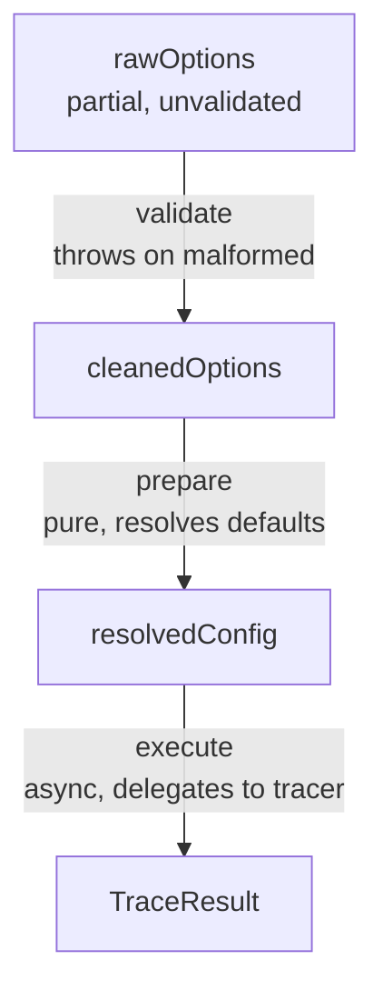
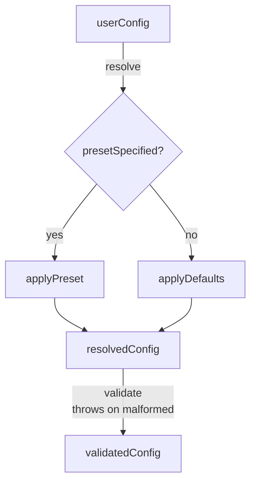

# Developer Guide

Internal architecture, conventions, and implementation details for contributors.
This file has one companion reference file,
[DEV-READABILITY-PATTERNS.md](./DEV-READABILITY-PATTERNS.md) — it is part of
DEV.md's canon ("DEV.md conventions," as referenced elsewhere in this governance
chain, includes it). A section earns its own `DEV-*.md` companion only when it
is ≥150 lines, dominated by worked before/after code examples (not a rules
list), and already headline-summarized in every governance file that cites it
(so no citation loses its target) — this is the only current example; don't
split further without meeting that bar.

## Table of Contents

Each entry is tagged for when it's needed. **(core)** — read whenever you touch
this area; every phase. **(reference)** — consult only for the task named; skip
otherwise.

- [Architecture Overview](#architecture-overview) — (core)
- [Codebase Conventions](#codebase-conventions) — (core)
  - [12. Readability Patterns](#12-readability-patterns) — (reference: full
    guide with worked examples is
    [DEV-READABILITY-PATTERNS.md](./DEV-READABILITY-PATTERNS.md); consult when
    writing or reviewing code style, not required reading up front)
- [Directory Structure](#directory-structure) — (core)
- [Development Workflow](#development-workflow) — (core)
- [Testing Strategy](#testing-strategy) — (core)
- [Incremental Development Workflow](#incremental-development-workflow) — (core
  — the Phase 0-2 workflow skeleton)
- [Adversarial Review Protocol](#adversarial-review-protocol) — (core mechanics:
  how to run a review, verdicts, resolution rules, sub-model dispatch. The
  **AR-1 through AR-5 focus-area checklists** below the mechanics are **`ar-N`
  subagent-only** — the registered `ar-1`…`ar-5` subagents fetch those
  themselves when they run. You do not need to read them.)
- [Linting Conventions](#linting-conventions) — (core for the command reference;
  Enforced/Manual Review Conventions are pointers back to § Codebase Conventions
  and Teaching Moments for rules that have a home there, plus a short list of
  rules that don't)
- [Module Boundaries](#module-boundaries) — (reference: consult when adding an
  architectural layer or import-boundary rule)
- [Code Quality Anti-Patterns](#code-quality-anti-patterns) — (pointer only —
  canonical copy lives in AGENTS.md/AGENTS.principal.md)
- [VS Code Setup](#vs-code-setup) — (reference — one-time editor setup)

## Architecture Overview

See [README.md § Architecture](./README.md#architecture) for an overview.
Detailed conventions and module boundaries are documented in sections below.

## Codebase Conventions

> This codebase is designed to be accessible for first-time contributors and
> less experienced developers. Conventions prioritize learnability,
> debuggability, and consistency over brevity or "idiomatic JS."

### Conventions Summary

| Situation                       | Convention                                                                                                                           |
| ------------------------------- | ------------------------------------------------------------------------------------------------------------------------------------ |
| Non-trivial function            | Named `function` declaration                                                                                                         |
| Inline callback (trivial)       | Arrow OK: `user => user.id`, `n => n > 0`                                                                                            |
| Arrow assigned to variable      | **Not allowed** — use named `function` declaration                                                                                   |
| Arrow with body block `{}`      | **Not allowed** — use named `function` declaration                                                                                   |
| Callback (non-trivial)          | Extract as named `function`, pass by name                                                                                            |
| Hoisting below call site        | Encouraged for readability                                                                                                           |
| `this` keyword                  | **Banned** (functional codebase)                                                                                                     |
| Classes                         | **Banned** (exception: error classes in `/errors`)                                                                                   |
| Error handling                  | Use base error class for catch-all                                                                                                   |
| Mutable closures                | **Banned**                                                                                                                           |
| Immutable closures              | OK (e.g. currying over cached config)                                                                                                |
| Method shorthand in objects     | Allowed (`{ process() {} }`)                                                                                                         |
| Variable bindings               | Prefer `const`; `let` only when reassignment needed                                                                                  |
| Export                          | Function files: inline `export default function` at top. Constant files: define first, `export default` at bottom (file-kind signal) |
| Import paths                    | Always include `.js` extension                                                                                                       |
| Multiple things from one file   | Split into separate files                                                                                                            |
| Destructured object params      | Default empty object: `{ ... } = {}`                                                                                                 |
| Boolean functions               | Prefix with `is`/`has`/`can`/`should`                                                                                                |
| Return values (objects/arrays)  | Deep freeze (clone+freeze for external, freeze-in-place for own)                                                                     |
| Shape of frozen/serialized data | Plain object (`Record`, string keys) + arrays — never `Map`/`Set`/`Date` (§ 13)                                                      |

### 1. Export Conventions

**CRITICAL**: All internal files use default-only exports. The export form is a
**file-kind signal**: function files export inline at the top; constant files
keep the named-then-export form at the bottom. A top inline export marks a
behavior file; a bottom name-export marks a value file.

```javascript
// ✅ CORRECT - Function file: inline default export opens the file
export default function myFunction() { ... }

// ✅ CORRECT - Constant file: named, then export at bottom
// (`export default const` is invalid syntax, and an anonymous value would
// have no binding for internal reference — the asymmetry is the signal)
const MY_CONSTANT = Symbol('description');

export default MY_CONSTANT;

// ❌ WRONG - Anonymous default export (no binding; nothing can reference it)
export default function () { ... }

// ❌ WRONG - Named exports in internal files
export function myFunction() { ... }
```

**NO BARREL FILES**: Import directly from the source file. No internal
`index.ts` re-exports.

```javascript
// ✅ CORRECT - Direct imports
import createConfig from './configuring/create.js';
import applyPreset from './configuring/apply-preset.js';

// ❌ WRONG - Barrel imports
import { createConfig, applyPreset } from './configuring/index.js';

// ✅ EXCEPTION - Public API only
import { doThing } from '@study-lenses/this-package';
```

**Import naming**: import under the export's canonical name by default; rename
at the import site only when it genuinely clarifies the consumption context.
(The import path always carries the canonical filename, so provenance greps stay
safe either way.)

**Rationale**:

- Explicit dependency graph (no indirection)
- Better tree-shaking
- No circular dependency traps
- IDE "go to definition" works directly
- Tooling gets function names from declarations
- Simpler mental model for contributors

### 2. Type Location Convention

Types live **with their module**, not in a centralized location.

| Location                | Purpose                               |
| ----------------------- | ------------------------------------- |
| `src/<module>/types.ts` | Types for that module                 |
| `src/index.ts`          | Re-exports consumer-facing types flat |

<strong>Rules:</strong>

1. Each module has its own `types.ts` (if needed)
2. Types stay with the code they document (transparency, portability)
3. Internal code imports directly from module's `types.ts`
4. `/src/index.ts` re-exports consumer-facing types (flat, no namespace)

<strong>Rationale:</strong>

- Transparency: Types are discoverable where they're used
- Portability: Renaming/moving folders doesn't break unrelated code
- Consistency: Parallels `/src/index.ts` as entry point for code

### 2.5. When `any` is OK

The `@typescript-eslint/no-explicit-any` rule is set to **warn** (not error)
because `any` has legitimate uses. All `any` usage MUST be justified during code
review.

<strong>Acceptable uses:</strong>

1. **Dynamic runtime values** — data parsed from JSON, user input, or eval
   results
2. **Untyped library boundaries** — wrapping third-party libraries without type
   definitions
3. **Generic utilities** — functions operating on arbitrary structures
4. **Test fixtures** — intentionally breaking types to test error handling
5. **Stub implementations** — temporary mock data during TDD cycles

<strong>Unacceptable uses:</strong>

- Business logic with known types (use proper interfaces)
- Public API parameters (force callers to use correct types)
- Return values from internal functions (be explicit)
- Lazy typing ("I don't know the type so I'll use `any`")

**Code review requirement:** Every `any` type must have a comment explaining WHY
it's necessary.

### 2.6. Using `eslint-disable` Comments

`eslint-disable` comments are a code review tool, NOT a development shortcut.

<strong>Rules:</strong>

1. **Never add `eslint-disable` in initial implementation** — fix the violation
   instead
2. **Only add during code review** — after discussing with reviewer
3. **Require justification comment** — explain WHY the rule doesn't apply

<strong>Format:</strong>

```typescript
// eslint-disable-next-line rule-name -- Justification for disabling
const problematicCode = ...;
```

### 3. Object-Threading Pattern

Functions accept and return objects with predetermined keys:

```javascript
// Input object with known keys
const input = { code: 'let x = 5', config: expandedConfig };

// Function adds new keys while preserving input
const output = process(input);
// Returns: { code, config, result }
```

**Benefits**:

- Explicit data flow
- Easy debugging (inspect objects between stages)
- Composable pipeline stages
- No hidden state

### 4. Pure Functional Approach

- No mutations — always return new objects
- No side effects in core functions
- State passed explicitly through parameters
- Deterministic behavior for testing
- Prefer `const`; use `let` only when reassignment is genuinely needed (loop
  counters, accumulators)

### 5. Error Handling Strategy

**Error Classes**: Library errors extend a base error class. This enables
catch-all handling while preserving specific error discrimination via
`instanceof`.

```javascript
// Catch-all for any library error
try {
	const result = await doThing(input);
} catch (error) {
	if (error instanceof BaseError) {
		showUserError(error.message); // Library error - handle gracefully
	} else {
		throw error; // Not ours - propagate
	}
}
```

**General Patterns**:

```javascript
// Graceful degradation for config errors
if (invalidConfig) {
	console.warn('Invalid config value, using default');
	return defaultValue;
}

// Fail fast for critical errors (use specific error classes)
if (!input) {
	throw new ArgumentInvalidError('input', 'Input is required');
}
```

### 6. Function Conventions

Use **named `function` declarations** by default. Arrow functions (`=>`) are
allowed only as short, single-expression forms with implicit return.

#### Arrow Functions: When They're Fine

Arrow functions are allowed **only** as anonymous inline callbacks when **all**
of these hold:

1. **Single expression** with implicit return (no `{` body block)
2. **At a glance** — you can read it without slowing down
3. **Inline as a callback** — not assigned to a variable

```javascript
// ✅ — trivial transforms and predicates, inline
users.map((user) => user.id);
items.filter((item) => item.enabled);
values.some((v) => v === null);
amounts.reduce((sum, n) => sum + n, 0);
```

```javascript
// ❌ — assigned to a variable: use a named function declaration
const extractId = (user) => user.id;

// ❌ — has a body block: use a named function declaration
const process = (config) => {
	const expanded = expandShorthand(config);
	return applyPreset(expanded);
};
```

#### Named `function` Declarations: Everything Else

```javascript
// ✅ — named function declaration
function processConfig(config) {
	const expanded = expandShorthand(config);
	return applyPreset(expanded);
}
```

#### Callbacks Longer Than a Quick Expression

When a callback grows beyond a simple expression, **extract it** as a named
`function` declaration and pass the name into the chain.

```javascript
// ✅ — extracted named functions, passed by name
const results = users.filter(isActiveAdmin).map(formatUserSummary);

function isActiveAdmin(user) {
	return user.status === 'active' && user.role === 'admin' && !user.suspended;
}

function formatUserSummary(user) {
	return {
		id: user.id,
		display: `${user.firstName} ${user.lastName}`,
		since: user.createdAt.toISOString(),
	};
}
```

<strong>Why?</strong>

- `users.filter(isActiveAdmin)` reads like English
- Named functions show in stack traces
- Extracted functions are independently testable
- Forces naming, which clarifies intent

#### File Anatomy: Newspaper Order

Files read top-down like a newspaper: **imports → main → consts → hoisted
helpers**. The main function is the first thing after imports — for function
files it carries the inline `export default`, so the export marker and the main
marker are the same line. Helpers are supporting details, defined below. This is
safe because `function` declarations hoist (and arrows assigned to variables are
banned, so there is nothing in the file that doesn't).

Module-level constants live directly below `main`, above the helpers (imports →
main → consts → helpers). This is safe because a `const` is read only inside a
function body, which runs at call time, after the module has fully evaluated;
`function` declarations hoist, so main and the helpers can read any const
regardless of source position. Consts that reference each other must still be
ordered among themselves.

```javascript
// ✅ — main flow reads top-down, then consts, then helpers below
export default function processCode(config, code) {
	const pipeline = buildPipeline(config);
	const result = executePipeline(pipeline, code);
	return formatOutput(result);
}

const DEFAULT_STAGES = ['parse', 'lint', 'emit'];

function buildPipeline(config) { ... }
function executePipeline(pipeline, code) { ... }
function formatOutput(result) { ... }
```

### 7. No `this` Keyword

This is a functional codebase. The `this` keyword is banned.

**Exception**: Low-level code may use `this` when interfacing with libraries
that require it. These modules should be clearly marked.

### 8. No Mutable Closures

Closures over **mutable** variables (`let`, reassigned bindings) are banned in
core code.

```javascript
// ✅ OK - closure over immutable values
function embodyWithClosedConfig({ code }) {
	// cachedConfig was set once and never changes
	return trace({ code, config: cachedConfig });
}

// ❌ BANNED - closure over mutable state
function createCounter(initialCount = 0) {
	let count = initialCount;
	return {
		increment() {
			count++;
			return count;
		},
	};
}
```

**Exception**: Low-level code may use mutable closures when interfacing with
libraries that require stateful patterns. Same boundary as the `this` exception.

### 9. Method Shorthand, Default Empty Object, const

**Method shorthand**: Use method shorthand syntax in object literals.

```javascript
// ✅ CORRECT
const pipeline = {
  process() { ... },
  validate() { ... },
};

// ❌ AVOID
const pipeline = {
  process: function process() { ... },
};
```

**Default empty object**: All functions that destructure object parameters
should provide a default empty object.

```javascript
// ✅ CORRECT
function processConfig({ preset = 'detailed', variables = true } = {}) {}

// ❌ AVOID - no default
function processConfig({ preset = 'detailed', variables = true }) {}
```

**Prefer `const`**: Use `let` only when reassignment is genuinely needed.

### 10. Naming

<strong>Functions: verb first</strong>

```javascript
// ✅ CORRECT
function extractId(user) {}
function isActive(item) {}
function hasPermission(user, action) {}
function createConfig(options) {}
```

**Predicates**: Boolean-returning functions start with `is`, `has`, `can`,
`should`.

**Callbacks: describe the transform** (`extractId` not `mapUser`, `isEnabled`
not `filterItem`).

### 11. Imports, Types, Comments

**Imports**: Always include `.js` extension. Group and order:

```javascript
// 1. External dependencies (node_modules)
import { describe, it } from 'vitest';

// 2. Internal modules (relative paths)
import processConfig from './process-config.js';
import validateInput from '../helpers/validate-input.js';

// 3. Type imports (last)
import type { Config } from './types.js';
```

**Types**: Prefer `type` over `interface`. Each module can have a `types.ts`
file.

```typescript
// ✅ PREFERRED
type Config = {
	preset: string;
	variables: boolean;
};
```

**Comments**: JSDoc/TSDoc for public functions. Use `@remarks` for
consumer-facing "why" context that should appear in generated API documentation.
Inline comments explain **why**, not what.

```javascript
// ❌ WRONG - says what (obvious from code)
// Loop through users
for (const user of users) {
}

// ✅ CORRECT - says why (not obvious)
// Skip inactive users to avoid rate limiting on the API
for (const user of users.filter(isActive)) {
}
```

### 12. Readability Patterns

These patterns shape how code reads, not just what it does. The goal: a reader
should be able to follow a function without holding the whole thing in their
head. Full guide with worked before/after examples:
[DEV-READABILITY-PATTERNS.md](./DEV-READABILITY-PATTERNS.md).

### 13. Deep Freeze Return Values

Objects and arrays returned from functions must be deep frozen before leaving
the function boundary. These libraries are consumed by LLMs — freezing catches
accidental mutation at the return boundary rather than producing silent bugs
downstream.

Use the freeze utilities from this package's shared utilities:

```typescript
// One default export per file, no barrel (see § module conventions):
import freezeInPlace from '@utils/freeze-in-place.js';
import cloneAndFreeze from '@utils/clone-and-freeze.js';
```

<strong>Two operations, one ownership rule:</strong>

| Operation        | When to use                                         | Behavior                      |
| ---------------- | --------------------------------------------------- | ----------------------------- |
| `freezeInPlace`  | Objects we just built (fresh results, new wrappers) | Freezes in place, same ref    |
| `cloneAndFreeze` | Objects we don't own (caller-provided, external)    | Clones first, returns new ref |

The distinction is about **ownership**: if you just constructed the object
(e.g., a spread result, a new config wrapper), freeze it in place — there's no
reason to clone something nobody else has a reference to. If the object came
from outside (a parameter, imported data), clone-then-freeze to avoid mutating
the caller's data.

<strong>What to freeze:</strong>

- All function return values that are objects or arrays
- Config objects and resolved options
- Constants and shared defaults
- Module-level data structures

<strong>Shape frozen data as plain objects and arrays — not
`Map`/`Set`.</strong>

`Object.freeze` **cannot** make a `Map` or `Set` immutable: their entries live
in internal slots, not ordinary properties, so `Object.freeze(map)` freezes the
container object while `map.set(…)` / `set.add(…)` / `.delete()` / `.clear()`
still succeed (`Date` setters have the same trap). A "frozen" `Map`/`Set` is
therefore a **false immutability guarantee**. Two more strikes at the
serialization boundary: `Map`/`Set` are **silently lossy under
`JSON.stringify`** (`JSON.stringify(new Map([['a', 1]]))` → `'{}'`), and
although they _do_ survive `structuredClone`/`postMessage`, they clone back **as
a `Map`/`Set`** — not the plain-`Record`/array shape this package standardizes
on. Plain objects and arrays freeze hard, `JSON` round-trip, and clone to a
stable shape.

**The rule:** any value that will be **deep-frozen or serialized** (a return
value, a fact, anything that crosses a `postMessage` boundary) uses a
`Record`/plain object (string keys) and arrays — never a `Map`/`Set`. Index by a
stable string key (a path, an id) instead of by object identity. Store
timestamps as epoch numbers or ISO strings, not `Date` (same frozen-slot
mutability, and it does not `JSON` round-trip back to a `Date`). When you hold a
foreign object whose own shape uses `Map`/`Set` (a parser's or analyzer's
internal node), **project the fields you expose into your own plain objects**
rather than holding the foreign object by reference — the projection is what
your freeze can actually guarantee, and it keeps the library's private
bookkeeping off your contract. (Canonical example: `embody`'s
`Entwined`/`Environment` facts expose `byPath` / `byOffset` as frozen
`Record`/array projections keyed by a node path — never the analyzer's `Map`s.)

`Map`/`Set` remain the right tool for **transient, internal computation** that
is never frozen and never serialized — e.g. a build-time `Map<Node, string>`
keyed by object identity, used and discarded within one pass. There,
object-identity keys are a genuine need a `Record` cannot serve, and
immutability is not claimed. (`WeakMap`/`WeakSet` are transient-only by
construction — not enumerable, not serializable — so they never reach a frozen
surface anyway, and they are the natural choice when this case needs
object-identity keys without iteration.) If a `Map`/`Set` ever does end up
inside owned-then-frozen data, document the limitation at that site (the freeze
does not reach its entries). A compile-time `ReadonlyMap` type is **not** a
substitute for projection: it binds only well-typed callers, whereas this freeze
is a runtime guarantee against the untyped LLM consumer § 13 exists to protect —
a type annotation cannot enforce it, and it does nothing for `JSON`
serialization.

**Exception:** Performance-critical hot paths where profiling shows freeze
overhead is unacceptable. Document with a `// perf: skip freeze — [reason]`
comment.

```typescript
// ✅ — freshly built result, freeze in place
function createResult(steps, meta) {
	const result = { ok: true, steps, meta };
	return freezeInPlace(result);
}

// ✅ — caller-provided config, clone + freeze
function resolveConfig(userConfig) {
	const resolved = merge(defaults, userConfig);
	return cloneAndFreeze(resolved);
}

// ❌ — returned object is mutable; LLM consumer can accidentally mutate
function createResult(steps, meta) {
	return { ok: true, steps, meta };
}
```

## Directory Structure

**Convention**: One concept per file, named after its default export.
`kebab-case` for all files and directories. Match filename to export:
`createConfig` → `create.ts`.

### Directory Documentation Convention

Every source directory under `src/` has both a `README.md` and a `DOCS.md`:

| Content                                             | Where                      | Audience     |
| --------------------------------------------------- | -------------------------- | ------------ |
| API reference (signatures, params, returns, throws) | JSDoc/TSDoc in source      | Consumers    |
| Consumer-facing "why" context                       | TSDoc `@remarks` in source | Consumers    |
| What this module does, how to navigate it           | `README.md` per directory  | Contributors |
| Architecture, design decisions, why this approach   | `DOCS.md` per directory    | Developers   |
| Non-obvious implementation detail                   | Inline `//` comment        | Code readers |

<strong>Rules:</strong>

- Every directory has a `README.md` AND a `DOCS.md`
- `DOCS.md` captures the "why" — tradeoffs, alternatives considered,
  constraints, and the **data flow diagram** for this directory's abstraction
  level. Keep it short. It is NOT an API reference — JSDoc handles that.
  Hand-maintained: fix it or delete it if it goes stale.
- For **new modules**, DOCS.md is written in Phase 0 step 0.5 as an
  **architectural sketch**, before any implementation exists. This is the
  structural target the Refactor step is held against. See format below.
- Tests directories (`tests/`) are exempt from needing `README.md`
- `README.md` is cross-referenced: parent links down, child links up, siblings
  link to each other
- Public functions have JSDoc/TSDoc in source; no generated-docs pipeline is
  currently wired

**Architectural sketch format** (for DOCS.md, written prospectively in Phase 0):

The sketch describes _structure_, not _implementation_. It constrains the space
of acceptable implementations without fixing one.

Format constraints:

- Named execution phases with input/output state described in **domain terms**
- A **`## Data flow`** section with a Mermaid flowchart diagram at the
  directory's abstraction level (see "Data flow diagram" below)
- Structural constraints (what must fail loudly vs. degrade gracefully)
- Out-of-scope concerns (explicit boundary)
- **No function names, no variable names, no pseudocode** — if it looks like
  code, it has crossed the line into implementation. Rewrite in prose.
- Short enough to read in 60 seconds

**Data flow diagram** — in every `DOCS.md`, a `## Data flow` section contains a
Mermaid flowchart depicting the **data's journey** through the module:

- **Nodes are data states**, not files or types. Each node names a shape the
  data takes at some phase of processing — `raw source string`, `validated AST`,
  `frozen RunResult`, `event stream`, `formatted source`. Domain vocabulary from
  the ubiquitous language in step 0.1; never code identifiers, symbol names, or
  filenames.
- **Edges are transformations** that produce the next state. The label names the
  operation and its structural constraint — `parse, throws on SyntaxError`,
  `validate, pure`, `execute in Worker, async`, `inject loop guards, pure`.
- **Files / directories that don't transform data are invisible.** A re-export,
  a wrapper, a delegating shim — none are nodes. If multiple files cooperate on
  a single transformation, one edge labels it; the files are inside the
  implementation, not on the diagram. Domain-agnostic utilities (freeze, merge,
  clone) are also invisible.
- **Branching / joining**: when the data takes a different shape based on
  validation or config (e.g. parse-success vs. parse-error), use Mermaid's
  branch syntax (`{decision} -->|yes| ...`). When two pipelines merge into the
  same downstream state, draw both edges to the same node.
- **Abstraction level**: the depth of detail matches the directory's place in
  the tree. Top-level `DOCS.md` shows the user-source → final-result arc with
  maybe 4–6 nodes. A leaf module's `DOCS.md` zooms in on the intermediate shapes
  that module produces and consumes.
- The diagram answers "what shape is the data in at each phase, and what changes
  between phases" — not "what imports what." If you can answer the diagram by
  reading the import statements, you've drawn the wrong thing.
- **Exception — presentation-component module DOCS.** A module whose job is to
  _render_ — a React component that receives props and routes intent back up,
  owning no derivation of its own (e.g. `orchestrate/phases-panel/`,
  `orchestrate/dock/`) — MAY instead draw its `## Data flow` as a
  **component/prop-flow** diagram. In this mode the rules above are **suspended
  for this diagram**: the "nodes are data states / never filenames or
  identifiers / wrappers invisible" rules AND the architectural-sketch ban on
  function and variable names do not apply here. Nodes are the **owning
  orchestrator**, **this component**, its **rendered sub-regions**, and any
  **external surface it routes intent toward** (an engine, a library) drawn as a
  boundary node via a dotted edge; edges are props-down and callbacks-up, and
  their labels MAY name the actual props and callbacks — for a wiring diagram
  those names are the content. (The relaxation covers only this diagram's nodes
  and edge labels; prose phases and every other diagram keep the rules above.) A
  data-state diagram for a pure render component would be near-contentless,
  which is why this mode exists.
- **The qualifying test is ownership of derivation, not absence of reshaping.**
  A module qualifies for the exception only if every non-trivial shape it
  renders was derived by an upstream owner and handed in as a prop, and the
  module itself does only **render-local formatting** (mapping a roster to
  columns, formatting a label, assembling an options bag it hands straight
  onward). If it _computes_ a shape that **downstream consumers depend on** — a
  derivation, a parse, an accumulation that outlives the render — it is
  **data-transforming** and the data-state rules apply, wherever it sits in the
  tree. (The `derive-*.ts` siblings of these components are the contrast class:
  they own derivation, so they get data-state diagrams.) When in doubt: "does
  this module own a shape something downstream reads?" — if yes, data-state.

The same Mermaid syntax handles linear, branching, and joining flows. Use
whatever topology the actual data flow requires; there is no separate choice of
format.

````markdown
## Architectural Sketch

> Written Phase 0, before implementation. The Refactor step is held against this
> document — not what the code does, but what shape it takes.

### Execution phases

1. **Validate** (sync, throws) — reject malformed input at the boundary; loud
   failure, no silent fallbacks. Input: raw user-provided options (may be
   partial or malformed). Output: structurally sound input, confirmed at the
   boundary.

2. **Prepare** (sync, pure) — resolve defaults, expand shorthands, apply
   presets; no I/O or side effects. Input: validated options. Output: fully
   resolved config, no optional fields remaining.

3. **Execute** (async, delegates) — hand off to the registered tracer strategy;
   this is the only async phase. Input: resolved config + code string. Output:
   trace result.

### Data flow



### Structural constraints

- Tracer lookup: loud failure — no silent fallback to a default tracer
- Config preparation: pure — no I/O, no observable side effects
- Execute: the only async phase; everything before it is synchronous

### Out of scope

- Caching results (caller responsibility)
- Selecting which tracer to use (caller provides the name)
````

**Branching example** — when flow has conditionals, joins, or parallel paths,
the same Mermaid syntax handles it without any change of format:

````markdown
### Data flow


````

<strong>Public function documentation:</strong>

```typescript
/**
 * Creates a config from user input, applying defaults and preset expansion.
 *
 * @param options - User-provided config options
 * @returns Fully resolved config with all defaults applied
 * @throws {ArgumentInvalidError} If options is not an object
 *
 * @remarks
 * The config goes through three stages: shorthand expansion (booleans to full
 * objects), default-filling (missing keys get defaults), and schema validation.
 * The `@remarks` tag is for consumer-facing "why" context that belongs in the
 * generated API docs alongside the signature.
 */
function createConfig(options: UserOptions = {}): ResolvedConfig { ... }
```

#### What goes in docs vs. plans vs. handoffs

**Scope.** This rule governs **package/module documentation** — `README.md`,
`DOCS.md`, `types.ts` files inside source directories. **Governance docs**
(`AGENTS.md`, `AGENTS.principal.md`, `CLAUDE.md`, `HUMANS.md`, this file,
`CONTRIBUTING.md`, `CODE-OF-CONDUCT.md`) describe process AS their end-state
contract — workflow rules, AR ceremony, plan discipline — and are out of scope.

Within scope, four kinds of documentation, with strict separation:

- **End-state docs** (`README.md`, `DOCS.md`, `types.ts` per source directory):
  describe the **intended end state** of the package/module. What it IS, not
  where the work CURRENTLY STANDS.
  - Forbidden: status snapshots, migration-phase notes,
    `(under active development)`, `(will be deprecated)`, `(will be split)`,
    `implementation begins in phase X`, `we tried Y, then migrated to X`
    narratives.
  - Allowed: present-tense rationale (`X is shaped this way because Y`),
    structural constraints
    (`this field is intentionally left unspecified — locking it would foreclose Z`),
    stability classifiers describing the current API tier (`(experimental)`,
    `(deprecated)`, `(internal)` — labels that classify what the API IS).
  - **Architectural sketches** (a Phase 0 prospective `DOCS.md`) ARE end-state
    docs — they describe the intended structural target, written before code
    exists. The "Written Phase 0" framing in the sketch template is a
    meta-comment to the reader, not part of the contract.
  - **Rationale framing matters**: "X is shaped this way because Y has property
    Z" is end-state. "We considered Y, then chose X" is past-tense process
    narrative — that goes in the commit message or git history. The contract is
    in present tense.
- **Plan files** (per-task scratchpad files; for the Claude Code workflow these
  live at `~/.claude/plans/*.md`, other tools use their own location): context,
  scope, AR cycles, open questions, verification. Ephemeral; deleted or archived
  when the task lands. May contain process narrative as long as it's pruned
  aggressively (`HUMANS.md § Plan-clutter discipline` covers the pruning).
- **Handoff files** (`*-HANDOFF.md` at repo or directory root,
  `.planning-handoffs/*.md` including per-stream `*-notes.md`): per-migration
  coordination scaffolding. Process info, ordered steps, phase splits, status
  snapshots, cross-stream coordination all live here. Handoffs are transitional
  scaffolding, deleted when their migration completes (git history retains
  them); they are never a durable source of truth — the end-state docs are.
- **Git history** (commit messages, `git log`, PR descriptions): what was
  changed and why, captured at commit time. AR-cycle history, rejected
  alternatives, prior attempts, "we tried Y before X" narratives — all go here.
  Not in `DOCS.md`.

**Quick test (when amending an end-state doc):** "does this describe what the
thing IS, or where the work currently STANDS?" The latter goes in a plan,
handoff, or commit message.

**Carve-outs.** CI/coverage badges in `README.md` are end-state representations
of current quality (they update over time but describe what the package's
quality IS); they're fine. Permanent dev/test infrastructure (sandbox programs,
fixtures, test harnesses) is end-state content describing what the package
contains. The forbidden thing is **lifecycle/migration/status narration** — not
"this thing exists" but "this thing is currently in state X of Y".

**Why this matters.** End-state docs are the canonical source of truth that
consumers code against. Process talk in those docs rots — every "(will be
deprecated)" / "(under active development)" note is a hostage to a future
cleanup pass. Process talk also expands the surface a careful reader has to
mentally subtract when reasoning about the current contract. Keep the process
out of the contract.

### Test Organization

Unit tests live in a `tests/` subdirectory co-located with the source they test:

```text
src/
  module/
    tests/
      feature.test.ts
    feature.ts
```

- Directory name: `tests/` (plural, always)
- File suffix: `.test.ts` (never `.spec.ts`). `.test.tsx` is acceptable for
  React component tests where JSX in `.ts` files is not supported by the
  project's tsconfig (e.g. when the parent tsconfig sets `jsx: 'preserve'` and
  only `.tsx` files allow JSX syntax).
- Root `/tests/` directory: integration test fixtures (not unit tests)

## Development Workflow

### 1. Setup

```bash
npm install
npm run test:watch  # Run tests in watch mode
```

### 2. Making Changes

All non-trivial changes follow the Incremental Development Workflow below. For
quick reference:

1. Work directly on main — atomic commits per increment (agents never create
   branches unless explicitly instructed; see AGENTS git policy)
2. Follow Phase 0 → Phase 1 (per increment) → Phase 2 (see below)
3. Update `README.md` in affected directories
4. Run quality checks before each commit:

```bash
npm run validate  # typecheck + format check + lint + test
```

### 3. Conventions Checklist

- [ ] Named function/const, then `export default` at bottom
- [ ] Direct imports from source files (no barrels), always with `.js` extension
- [ ] Named `function` declarations (arrows only for inline callbacks)
- [ ] No `this` keyword, no mutable closures
- [ ] Default empty object `= {}` on all destructured parameters
- [ ] Verb-first naming; predicates prefixed with `is`/`has`/`can`/`should`
- [ ] Types added to module's `types.ts`; prefer `type` over `interface`
- [ ] Tests in `tests/` subdirectory (not alongside source files), `.test.ts`
      suffix (or `.test.tsx` for React component tests)
- [ ] Tests written in ZOMBIES order; suite is triangulated (no single test
      passable by hardcoding after the first increment)
- [ ] No mutations of input data; pipeline functions thread an object
      (`return { ...input, newData }`)
- [ ] Returned objects/arrays are deep frozen (`freezeInPlace` for own,
      `cloneAndFreeze` for external)
- [ ] Throw on invalid input at boundaries; fail fast for critical errors
- [ ] Errors handled gracefully past the boundary check
- [ ] `README.md` exists and is current in every modified directory
- [ ] `DOCS.md` written (new module) or updated (structural change); reflects
      actual implementation phases and constraints
- [ ] JSDoc/TSDoc on public functions; `@remarks` for consumer-facing "why"

## Testing Strategy

### Test Organization Convention

Tests live in a `tests/` subdirectory co-located with the source they test —
full convention (directory tree, file-suffix rule, root `/tests/` distinction):
[Directory Structure → Test Organization](#test-organization).

### Unit Tests

Each exported function has a dedicated test file in the nearest `tests/`
subdirectory:

```typescript
import { expect, test } from 'vitest';

import parseJSON from '../parse-json.js';

test('parses valid JSON string', () => {
	const result = parseJSON('{"a":1}');
	expect(result).toEqual({ a: 1 });
});
```

### Testing Conventions

#### Test Naming

Use direct description. Implicit arrows (`→`) for compactness when input/output
is clear.

```typescript
// Standard — describes what happens
it('returns expanded config with all defaults', () => {...});

// Compact with arrow — input → output
it('string input → parsed object', () => {...});
```

#### Describe Block Structure

Top-level `describe` = function name. Nest freely for clarity.

```typescript
describe('createConfig', () => {
  describe('preset application', () => {
    describe('overview preset', () => {
      it('sets variables.read to false', () => {...});
    });
  });

  describe('boolean shorthand expansion', () => {
    describe('happy path', () => {...});
    describe('edge cases', () => {...});
    describe('errors', () => {...});
  });
});
```

#### Test Ordering

Within each describe block: **feature/behavior → happy path → edge cases →
errors → performance**

#### One Assertion Per Test

Use nested `describe` blocks instead of multiple assertions in one `it`.

```typescript
// ❌ WRONG — multiple assertions hide which failed
it('returns complete config', () => {
	expect(result.preset).toBe('detailed');
	expect(result.variables).toBe(true);
});

// ✅ CORRECT — one assertion, grouped by describe
describe('returns complete config', () => {
	it('preset = "detailed"', () => {
		expect(result.preset).toBe('detailed');
	});

	it('variables = true', () => {
		expect(result.variables).toBe(true);
	});
});
```

#### Error Testing

Always use `.toThrow()`. Never use try-catch in tests.

```typescript
// ✅ Basic
it('throws on invalid input', () => {
	expect(() => parseJSON('{bad}')).toThrow();
});

// ✅ With message substring
it('error mentions function name', () => {
	expect(() => processConfig()).toThrow('processConfig');
});
```

#### Test Data

Inline only. No shared fixtures. Each test is self-contained and independently
understandable.

#### Minimal Logic in Tests

Tests should contain only the function being tested and bare minimum data setup
(inline). No `if`, no loops, no try-catch. For multiple values, use `it.each`:

```typescript
// ✅ CORRECT
it.each([
	[false, false],
	[0, false],
	['', false],
	[null, false],
])('%p → Boolean coercion = %p', (value, expected) => {
	expect(Boolean(value)).toBe(expected);
});
```

#### No Comments in Tests

Test names and describe blocks are executable documentation.

#### Triangulation

A test suite is **triangulated** when no individual test can be passed by
returning a hardcoded value — each test constrains the implementation from a
different angle. Un-triangulated suites produce implementations with hardcoded
special cases that survive code review because all tests pass.

After writing the first test for any increment, ask: _could this be passed by
`return someFixedValue`?_ If yes, write the second test to make that impossible
before implementing.

#### Dependency-order coverage

Where a test sits in the dependency graph changes what kind of test it should
be. The rule for this codebase is **bottom-up**:

1. **Leaves first**: pure helpers and protocol primitives (`worker-protocol`,
   `create-worker-script`, `guard-loops`, etc.) get unit tests against real
   inputs. No siblings involved.
2. **Engines next**: modules that compose leaves into behavior
   (`evaluating/run`, `evaluating/trace`) get integration tests against the
   _real_ leaves already covered in step 1. Browser environment if the engine
   requires `Worker` + `SharedArrayBuffer`.
3. **API layer last**: wrappers that layer validation / format / config
   resolution over an engine (`api/run`, `api/trace`) get tests against the
   _real_ engine already covered in step 2. Again, browser environment when the
   engine requires it.

The practical consequence: `vi.mock('./sibling')` in a consumer's test is almost
never correct. If step N's test needs step N−1 to be trustworthy, finish step
N−1's coverage first. Mocks paper over missing coverage with duplicate behavior;
the duplicate eventually drifts from reality and the mocked test starts passing
on production-broken code.

This is also a **development order constraint**. When adding new behavior,
implement and test inside-out: leaf → engine → API. When an existing feature is
being refactored and one layer's tests are broken (mocks have drifted, or the
underlying contract changed), fix the innermost layer first — outer-layer fixes
become trivial once the inner layer is stable.

**Exceptions are narrow and explicit**. The environment boundary (node vs.
browser) is crossed by _moving the test file_, not by mocking the environment
away. Third-party boundaries (network, filesystem, random clocks) may be
stubbed, but `vi.mock` of an internal sibling in this package is a code smell —
treat it as a TODO to finish the sibling's coverage.

#### ZOMBIES Sequencing

**ZOMBIES** is a test-ordering heuristic that naturally produces triangulation.
Write tests in this order:

| Letter               | Scenario                                         | Why first                                               |
| -------------------- | ------------------------------------------------ | ------------------------------------------------------- |
| **Z**ero             | Null, empty, zero — degenerate inputs            | Simplest possible case; often reveals boundary handling |
| **O**ne              | Single item, simplest non-trivial input          | Forces a real (if minimal) implementation               |
| **M**any             | Multiple items                                   | Makes hardcoding structurally impossible                |
| **B**oundaries       | Edge values (min/max, empty vs. one, off-by-one) | Catches range errors                                    |
| **I**nterfaces       | Contract enforcement at module boundary          | Validates the public API                                |
| **E**xceptions       | Error paths, throws, invalid input               | Tests the failure modes in the sketch                   |
| **S**imple scenarios | Additional happy-path sanity checks              | Fills coverage after structure is proven                |

Zero → One → Many is the minimum triangulation sequence. Writing One before Many
means you can still hardcode; writing Many before One means you're testing the
general case before the degenerate case, missing the simpler failure modes.

#### Fake It (Till You Make It)

**Fake It** means returning a hardcoded value to pass the first test. It is a
legitimate and intentional TDD move — not a shortcut. It gives you a Red → Green
cycle with near-zero implementation risk, confirming the test harness works
before writing real logic.

**Fake It has an expiry date**: it expires when the second test is written. The
second test must be written to make the hardcoded value fail. If it doesn't — if
`return []` still passes the second test — the tests are not triangulated.

**Fake It without Make It** is the anti-pattern: staying in Fake It mode past
triangulation, either because the test suite didn't force generalization or
because the Refactor step was treated as formatting cleanup. This is the root
cause of hardcoded magic values in otherwise-passing implementations.

#### Complete Example

```typescript
import { describe, expect, it } from 'vitest';

import parseJSON from '../parse-json.js';

describe('parseJSON', () => {
	describe('valid JSON string', () => {
		describe('happy path', () => {
			it('object string → parsed object', () => {
				expect(parseJSON('{"a":1}')).toEqual({ a: 1 });
			});
		});

		describe('edge cases', () => {
			it('empty object string → empty object', () => {
				expect(parseJSON('{}')).toEqual({});
			});
		});
	});

	describe('invalid input', () => {
		describe('errors', () => {
			it('malformed JSON → throws', () => {
				expect(() => parseJSON('{bad}')).toThrow();
			});
		});
	});
});
```

## Incremental Development Workflow

All development uses TDD with atomic increments. One unit test = one increment
of work.

### Phase 0: Documentation Specification (before any code)

> **⛔ Agents routinely skip this phase under time pressure or when a task feels
> small. Do not skip it. The cost of a wrong domain model or ambiguous
> vocabulary compounds across every file written after. Phase 0 is not overhead
> — it is the work. Proceed to Phase 1 only after all seven steps below are
> complete.**

Documentation-driven development ensures clarity BEFORE code exists. It is also
where Domain-Driven Design (DDD) thinking lives: the domain model, the
ubiquitous language, and the bounded context should all be established in
writing before a single type is defined.

**0.1. Establish the ubiquitous language** — Before touching README or code,
identify the domain vocabulary for this module.

- What do the humans who use this codebase call the core concepts?
- List the key terms and their precise meanings in a short glossary. This
  becomes the naming contract: functions, types, variables, and docs must all
  use these terms consistently.
- Watch for synonyms (two words for the same thing) and homonyms (one word with
  two meanings). Resolve them here, not in code review.

```markdown
<!-- Example glossary in README or DOCS.md -->

**Tracer** — a registered strategy for recording code execution steps. **Step**
— a single recorded moment in a trace (line, expression, or call). **Trace** —
the ordered collection of steps produced by running a tracer. **Config** — the
resolved, validated options passed to a tracer. Not the same as user-provided
options (UserOptions), which may be partial.
```

**0.2. Update README.md** — Using the ubiquitous language established above:
what does this module do? Where does it fit in the bounded context of this
package? What does it own, and what lies outside its boundary?

- The README is the domain model in prose. If you cannot explain the module in
  plain language without ambiguity, the design is not ready.
- Identify inputs and outputs at the boundary. What crosses into this module?
  What does it return? What does it explicitly NOT handle?

**0.3. Adversarial Design Challenge (AR-1)** — Spawn a separate reviewer agent
to challenge the README spec before types lock the contract. See
[§ Adversarial Review Protocol](#adversarial-review-protocol) below for prompt
structure and verdict definitions.

Key DDD questions for AR-1:

- Does the ubiquitous language align with the rest of the codebase? Any
  collisions or redefinitions?
- Are the bounded context boundaries correct? Is this module doing too much or
  too little?
- Are any domain concepts missing from the language glossary?

**0.4. Update types.ts** — Types are the domain model expressed in TypeScript.

- Translate the ubiquitous language directly into type names. `Config` in the
  glossary becomes `type Config` here — not `Options`, not `Settings`, not
  `Params`.
- Update type definitions to reflect the new contract (incorporating AR-1
  feedback).
- Type errors after this step become the TODO list for implementation.

**0.5. Write the architectural sketch → DOCS.md** — Before any implementation,
record the structural target in DOCS.md.

This is what separates a plan that produces architecture from a plan that
produces test-passing code. The sketch describes execution phases, structural
constraints, and explicit boundaries in domain terms — no function names, no
variable names, no pseudocode. See § Directory Documentation Convention above
for the required format and example.

The sketch answers: _What shape must a correct implementation take?_ The
Refactor step in Phase 1 is held against this document. If the implementation
passes all tests but doesn't reflect the sketch — wrong phases, collapsed
concerns, missing boundaries — refactoring is not complete.

**0.6. Adversarial Sketch Challenge (AR-2)** — Spawn a separate reviewer agent
to challenge the architectural sketch before implementation begins. See
[§ AR-2: Architectural Sketch Challenge](#ar-2-architectural-sketch-challenge)
below for focus areas.

The sketch is the single most consequential document in the workflow — it is
what the entire Refactor step is held against. A first-pass agent writing it
without challenge will routinely produce a sketch that is either too abstract
(useless as a structural target) or too prescriptive (pseudocode in disguise).
AR-2 catches this before it locks in.

**0.7. Review & Resolve** — Confirm understanding before writing code.

- Can you read types.ts, README.md, and DOCS.md together and fully predict what
  the implementation will do and what shape it will take?
- If not, the ambiguity will surface as a bug or a structural mess. Resolve it
  now.
- Commit the Phase 0 artifacts (autonomous, announced) and present them to the
  human for review. **Phase 1 does not start until the human approves.**

### Phase 1: TDD Implementation

For each behavioral increment:

1. **JSDoc/TSDoc** — document the behavioral contract (with `@remarks` for
   consumer-facing "why")
2. **Stub function** — create function with stub body
3. **Placeholder types** — `any`/`unknown` to unblock; tighten later
4. **Lint checkpoint 1** — `npx eslint <new-file>`. Fix violations.
5. **Unit test** — write ONE failing test in ZOMBIES order. Start with the
   degenerate case (Zero) if this is the first test for this function. After
   writing it, ask: _could this be passed by returning a hardcoded value?_ If
   yes, note what the second test will be — the one that makes hardcoding
   impossible — before moving on.

   > **5b. Adversarial Test Challenge (AR-3)** — Spawn a separate reviewer agent
   > to challenge the test strategy before implementing. See
   > [§ AR-3: Test Strategy Challenge](#ar-3-test-strategy-challenge) below for
   > focus areas, including the triangulation check.

6. **Lint checkpoint 2** — `npx eslint <test-file>`. Fix violations.
7. **Implement** — minimal code to pass the test (Red → Green). **Fake It is
   acceptable here for the first test** — returning a hardcoded value to confirm
   the test harness and stub are wired correctly is a legitimate TDD move. It is
   not a shortcut; it is the move. It expires when the next test is written.

   > **7b. Patch-or-reroll check** — before lint/refactor, classify how step 7
   > went. If green came from expected roughness (a Fake It hardcode, an
   > unrefined but correctly-shaped implementation), proceed to step 8 as normal
   > — that's what Refactor is for. If it came from guessing, backtracking, or
   > touching more surface than the stub implied, discard the implementation —
   > the test is untouched and still valid — and re-implement fresh, naming the
   > specific confusion for the retry. Patching a wrongly-shaped attempt into
   > shape typically costs more than a clean second attempt, and nothing is
   > committed yet to lose. This is not Refactor's job: Refactor improves a
   > correctly-shaped implementation; this check catches a wrongly-shaped one
   > before Refactor has to work around it.

8. **Lint checkpoint 3** — `npx eslint <impl-file>`. Fix violations.
9. **Refactor** — address structural quality while behavioral correctness holds.

   Tests passing means _behavioral correctness_ is achieved — the function does
   what it's specified to do. That is necessary but not sufficient. The Refactor
   step addresses _structural quality_: does the implementation reflect the
   architectural sketch in DOCS.md?

   Check against the DOCS.md sketch:
   - Do the execution phases match? Is each phase distinct and named?
   - Are concerns separated — not collapsed into a monolith to pass tests?
   - Are there any Fake It values still present? They should have been
     triangulated away by the second test. If hardcoded values survive here,
     either the test suite didn't triangulate or generalization was skipped.
   - Does the code use the ubiquitous language from Phase 0?

   **Data flow check** (ephemeral) — sketch the actual intra-file data flow as
   Mermaid for your own reasoning; this is a thinking tool, not a committed
   artifact. At each phase boundary: what enters, what exits, what is
   transformed, added, or dropped? Is anything carried further than the phase
   that needs it? Is any transformation redundant?

   **Inter-file contract check** — verify the file's inputs and outputs match
   what the peer `DOCS.md`'s Mermaid data flow diagram shows.
   - Contract preserved → intra-file refactor is autonomous; commit.
   - Contract changed → **flag to user before proceeding**; discuss together;
     update DOCS.md only with approval.

   **Two-tier autonomy** — the refactor boundary is mechanical, not judgment:
   - **Intra-file data flow** (internal phases of a single function): refactor
     freely. Ephemeral Mermaid reasoning is fine, not committed.
   - **Inter-file data flow** (captured in peer `DOCS.md`): flag to user before
     proceeding if ANY trigger fires:
     - A file is added to or removed from the flow
     - A file's inputs or outputs change shape
     - A phase annotation changes (throws / pure / async)

   `DOCS.md` is an architectural contract; updates require user approval.
   Extracting an intra-file helper to a new domain-related file IS a trigger
   (changes the set of files in the flow). Extracting to a domain-agnostic
   utility file (freeze, merge, clone — utilities are invisible in every data
   flow diagram) is NOT a trigger.

10. **Lint checkpoint 4** — final `npx eslint` on modified files (plus
    `npx markdownlint-cli2` for any modified `.md`). Should be clean.
11. **Update types** — finalize based on actual implementation
12. **Self-review** — simplest solution? only what requested?
    junior-maintainable?

    > **12b. Adversarial Implementation Audit (AR-4)** — Spawn a separate
    > reviewer agent to audit the implementation. See
    > [§ AR-4: Implementation Audit](#ar-4-implementation-audit) below for focus
    > areas, including structural quality and Fake It residue checks.

13. **Quality checks** — `npm test && npm run lint && npm run typecheck`
14. **Verify docs match implementation** — update README.md and DOCS.md if
    behavior or structure changed during TDD
15. **Atomic commit** — one behavior per commit

#### Sandbox Checkpoints — user-observable features

Tests verify behavioral correctness; only a human eye at a running dev server
catches layout shift, flicker, focus behavior, keyboard feel, accessibility
regressions, and visual polish. **When a TDD increment adds a user-observable
change** (a new UI element, a new button, a new behavior visible in the
browser), a **🔍 Sandbox checkpoint** step is inserted into the cycle **between
step i (quality checks green) and step j (the commit)**.

The cycle becomes:

```text
a. JSDoc        f. Lint
b. Stub         g. Refactor
c. Failing test h. AR-4
d. AR-3         i. Quality checks
e. Implement    🔍 Sandbox checkpoint   (when user-observable)
                j. Commit (autonomous, announced)
```

At each checkpoint:

1. Steps a–i have produced green tests, clean lint, passing types.
2. Dev server is started if not already running (reuse hot reload — don't
   restart per increment).
3. User navigates to a smoke-test page and exercises the feature.
4. Agent reports observations **verbatim**; user confirms before step j fires.
5. **Redirect policy**:
   - **Cosmetic redirect** (spacing, wording, affordance, visual polish) lands
     in the _next_ increment. Current commit still lands.
   - **Behavioral defect** (wrong buffer reset, content corruption, misfire,
     missing a11y label, etc.) **blocks the commit** and triggers rework of the
     current increment. Committing broken behavior to patch in the next
     increment pollutes git history.

**When to skip the checkpoint**: pure utility functions, private types, data
shape narrowing, and other increments with no user-visible surface. These don't
benefit from a dev-server round-trip; step i's green tests are enough.

**Checkpoint content quality**: the checkpoint description names a specific user
action ("paste ugly JS, click Format") and a specific expected observation
("tabs / single quotes / semicolons / 80-col wrap"). Avoid vague phrasing like
"verify the feature works". If you can't name what to look at, the increment
probably isn't observable.

**Phase-level observation gates** (end-of-phase smoke tests in plan documents)
use the same 🔍 marker for visual consistency — the semantics are identical,
just fired at a coarser grain.

Checkpoints are **gate points, not optional**. Skipping one because tests are
green is the exact failure mode they exist to prevent.

### Phase 2: Pre-Merge Review

After all increments are complete, before prompting the human to commit:

1. **Run full quality checks** — `npm test && npm run lint && npm run typecheck`
2. **Adversarial Pre-Merge Review (AR-5)** — Spawn a separate reviewer agent to
   review the full changeset. See
   [§ AR-5: Pre-Merge Review](#ar-5-pre-merge-review) below for focus areas.
   Provide the full diff, modified files list, and the original task
   description.
3. **Address PAUSE/CONSIDER items** — resolve concerns per
   [§ Resolution Rules](#resolution-rules) below

### Session Handoff

Before ending a work session:

1. Update plan file with current state, what's done, what's left
2. Commit all completed increments
3. Note any blockers or open questions

### Atomic Commits

Each passing TDD cycle = one atomic commit:

- One behavior per commit
- Descriptive message: `add: createConfig expands boolean shorthand`
- Commits go directly to main; branches only when the human explicitly instructs

### What NOT to Do

- No implementing multiple behaviors before testing
- No skipping the refactor step
- No skipping doc updates ("I'll do it at the end")
- Each edit should do exactly one thing
- **No full implementations in plans** — plans describe BEHAVIOR and INTENT, not
  code. Pseudocode is allowed when describing a proposed strategy.

## Adversarial Review Protocol

Adversarial reviews use a separate agent instance acting as devil's advocate.
The reviewer agent has READ-ONLY access and produces a structured report with
concerns, counter-proposals, and a verdict (PROCEED / CONSIDER / PAUSE).

Only the **human** can skip an adversarial review. The implementing agent must
never skip its own review — that defeats the purpose.

> **Skip resistance rule**: If you find yourself reasoning about why _this
> particular case_ doesn't need an AR, that reasoning is the signal it does. The
> urge to skip is highest when the review would be most valuable. The only valid
> skip is an explicit opt-out from the human in the current conversation.

### How to Run an Adversarial Review

Spawn a separate agent instance with read-only access to the codebase. The
implementing agent or human initiates the review by providing:

1. The review type (AR-1 through AR-5) and its focus areas
2. The relevant files or diff to review
3. Context about what was built/proposed and why

The reviewer agent produces a structured report. The implementing agent or human
then responds to each concern before proceeding.

Tool-specific examples:

- **Claude Code**: invoke the registered reviewer agents `ar-1` through `ar-5`
  by name — they carry the role, constraints, and output format below. Fall back
  to a general-purpose subagent with the prompt structure pasted in only where
  the registered agents are unavailable.
- **Cursor/Copilot**: use chat with the adversarial prompt pasted in
- **CLI tools**: spawn a second agent session with the review prompt

### Agent Prompt Structure

Every adversarial review prompt follows this structure:

1. **Role**: "You are an adversarial reviewer — a senior engineer whose job is
   to find problems, challenge assumptions, and propose better alternatives."
2. **Context**: What was built/proposed and why
3. **Focus areas**: Specific to each review type (see below)
4. **Constraints**: Read-only, must produce structured output
5. **Output format**: Concerns list (numbered, with severity),
   counter-proposals, verdict

### Verdict Definitions

- **PROCEED**: No significant issues found. Note minor observations if any.
- **CONSIDER**: Issues found that are worth thinking about but don't block
  progress. List specific concerns with suggested alternatives.
- **PAUSE**: Significant issues found that should be resolved before continuing.
  List blocking concerns with rationale for why they block.

### Resolution Rules

- Human always has final authority
- PROCEED: continue immediately
- CONSIDER: document your response to each concern, then continue
- PAUSE: present concerns to human, wait for decision before continuing
- **PAUSE default for AR-4, pre-commit**: when an AR-4 Implementation Audit
  returns PAUSE and the increment is not yet committed, the default _proposal_
  to the human is discard-and-retry, not patch-in-place — name the specific
  confusion, and re-implement once the human confirms. Nothing is lost by
  discarding since nothing is committed, and patching a wrongly-shaped
  implementation into shape typically costs more than a clean second attempt.
  This sets the default proposal only — it changes nothing about "present
  concerns to human, wait for decision"; the human can still choose to patch
  instead.
- Never skip a PAUSE verdict — it exists to protect the codebase

### Sub-model dispatch

Model selection for AR reviewers follows one mechanism: an explicit `model`
parameter overrides the agent definition's frontmatter, which overrides
inheriting the spawning session's model. **The pins live in the registered
`ar-N` agent definitions' frontmatter — do not pass a `model` parameter when
spawning ARs**; it would silently override the configured roster.

Current roster (mirrors the frontmatter; if they ever diverge, the frontmatter
wins):

| AR                          | What it catches               | Model    |
| --------------------------- | ----------------------------- | -------- |
| AR-1 (Design Challenge)     | Drift / cross-cutting         | `opus`   |
| AR-2 (Architectural Sketch) | Drift / cross-cutting         | inherit  |
| AR-3 (Test Strategy)        | Implementation correctness    | `sonnet` |
| AR-4 (Impl Audit)           | Implementation correctness    | `sonnet` |
| AR-5 (Pre-Merge)            | Drift + cross-cutting + scope | inherit  |

Reasoning: judgment-heavy reviews (design, sketch, pre-merge) should track or
exceed the authoring model's tier — a reviewer below the author's tier is the
most likely to rubber-stamp the author's subtle drift. Mechanical reviews (test
strategy, implementation audit) ride a cheaper tier, because independence and
fresh context — not raw capability — do most of their work. Tier choices are a
directional cost/quality trade, not a measured optimization.

"inherit" means no `model:` line in that agent's frontmatter: the reviewer runs
on whatever model the spawning session runs, so the two most consequential
judgment reviews (AR-2, AR-5) track the authoring model automatically across
generations. AR-1 keeps an explicit `opus` pin as a deliberate cost trim — it
fires at the earliest, cheapest-to-redo gate, and the Phase-0→1 human gate
follows it. Caveat: under a deliberately cheaper main agent, inherited reviews
downgrade with the session — pin explicitly if that matters.

### AR-1: Design Challenge

**Trigger:** During Phase 0, after README spec (step 0.2), before types.ts locks
the contract (step 0.4). **Skip:** Only when the human explicitly opts out.

<strong>Focus areas:</strong>

- Does the ubiquitous language in the README align with the rest of the
  codebase? Any naming collisions, synonyms, or redefinitions?
- Are bounded context boundaries correct — is this module doing too much or too
  little?
- Does the README design suggest a clean separation of concerns, or will it
  produce tangled implementation phases? (This is what the architectural sketch
  will need to reflect — catch the problem here, before types lock it in.)
- Are there simpler alternatives that achieve the same goal?
- What edge cases are missing from the spec?
- What decisions will be hard to change later?
- Does this follow existing patterns in the codebase, or introduce new ones
  unnecessarily?
- Are the types over- or under-specified?

**Provide to agent:** README updates, any design notes, existing codebase
patterns

### AR-2: Architectural Sketch Challenge

**Trigger:** After the architectural sketch is written in DOCS.md (Phase 0 step
0.6), before the final review and implementation begin (step 0.7). **Skip:**
Only when the human explicitly opts out.

<strong>Focus areas:</strong>

- Is the sketch at the right level of abstraction — does it constrain structure
  without prescribing implementation? (No function names, variable names, or
  pseudocode should appear.)
- Are the named execution phases the right granularity? Are any phases too
  coarse (should be split) or too fine (should be merged)?
- Does each phase have a single, distinct responsibility? Are there hidden
  dependencies between phases that should be made explicit?
- Are the structural constraints complete? Are there failure modes, async
  boundaries, or edge cases not captured?
- Is the "out of scope" section correct and complete? Does it explicitly name
  things callers are responsible for?
- Does the sketch use the ubiquitous language from step 0.1, or has new
  terminology crept in?
- Is the sketch consistent with the types defined in step 0.4? Do domain terms
  in the sketch map cleanly to types?
- **Data flow**: Does the sketch's Mermaid flow diagram make sense? Is data
  passed through phases that don't use it? Are any transformations redundant —
  data restructured into an equivalent shape under a different name? Is the data
  state at each phase boundary as slim as it could be? Does the diagram use the
  ubiquitous language consistently? Are domain-agnostic utilities (freeze,
  merge, clone) correctly omitted as invisible, and domain-related functions
  correctly shown as nodes?
- **Presentation-component exception**: if the DOCS is a presentation-component
  module under the § Data flow diagram exception (a render component owning no
  downstream-consumed derivation), apply the component/prop-flow rules instead —
  confirm the diagram is genuinely wiring (props-down / callbacks-up) and that
  the module owns no derivation a downstream consumer reads (if it does, it
  belongs in a data-state diagram). Do NOT flag the orchestrator/component/
  library nodes or the prop/callback edge labels as violations: the
  node-and-identifier bans are suspended for that diagram mode.

**Provide to agent:** DOCS.md architectural sketch, README.md, types.ts

### AR-3: Test Strategy Challenge

**Trigger:** After first failing test is written for an increment. **Skip:**
Only when the human explicitly opts out.

<strong>Focus areas:</strong>

- **Triangulation check**: Can this first test be passed by returning a
  hardcoded value? If yes, name the second test that makes hardcoding
  impossible. A test suite that doesn't triangulate produces implementations
  with Fake It values that survive beyond the first increment.
- **ZOMBIES coverage**: Does the test sequence move from Zero/null/empty → One →
  Many → Boundaries? If the first test is a complex happy-path case, the
  ordering is wrong — start simpler.
- Are we testing behavior or implementation details?
- What edge cases are missing?
- Are we over-testing (brittle tests that break on refactor)?
- Is the test naming clear and descriptive?
- Does the test ordering follow convention (feature → happy → edge → error)?
- **Data flow coverage**: Do the tests exercise each data transition shown in
  the peer DOCS.md Mermaid flow diagram, or only end-to-end behavior? A suite
  that only covers start-to-finish can pass even when intermediate
  transformations are broken in compensating ways. Each arrow in the flow should
  have at least one test that would fail if that specific transformation were
  removed or wrong.

**Provide to agent:** The test file, the stub/types being tested, related
existing tests, the peer DOCS.md data flow diagram

### AR-4: Implementation Audit

**Trigger:** After self-review (step 12) for an increment. **Skip:** Only when
the human explicitly opts out.

<strong>Focus areas:</strong>

- **Structural quality**: Does the implementation reflect the DOCS.md
  architectural sketch? Are the named execution phases present and distinct? Are
  concerns properly separated, or have phases been collapsed into an
  undifferentiated block to pass tests?
- **Fake It residue**: Are there hardcoded or special-cased values that should
  have been triangulated away? If the implementation returns a fixed value for
  any non-trivial input, triangulation was incomplete.
- Is this the simplest solution? Could it be done in fewer lines?
- Are there existing utilities being ignored (check src/utils/)?
- Does it follow the codebase's functional conventions (no this, no mutable
  closures)?
- Are there subtle bugs (off-by-one, null handling, async footguns)?
- Is error handling appropriate (validate at boundaries only)?
- Dead code: are there commented-out blocks, unreachable branches, or leftover
  TODO stubs to remove?
- Would a junior developer understand this without explanation?
- **Sandbox Checkpoints**: for user-observable features, confirm a 🔍 sandbox
  checkpoint is present and reachable (see § Sandbox Checkpoints).
- **Security regressions**: where this increment touches untrusted input or a
  trust boundary (parsing untrusted input, shelling out, rendering user-supplied
  content), check for injection, XSS, and the OWASP Top 10. No-op for pure
  content/markdown increments.
- **Data flow**: Sketch the actual intra-file data flow as Mermaid (ephemeral,
  not committed). Compare the file's inputs and outputs against the peer DOCS.md
  Mermaid flow diagram for contract match. Is the intra-file flow simpler or
  more complex than the sketch implied? Is anything carried further than needed?
  Are there redundant transformations the sketch didn't catch? If divergence,
  describe it in prose — the user decides whether the implementation drifted or
  the sketch needs updating.

**Provide to agent:** The implementation file, its test file, types, the DOCS.md
architectural sketch (including the Mermaid data flow diagram), any utilities
used

### AR-5: Pre-Merge Review

**Trigger:** After all increments complete, before the final commit and the push
prompt. **Skip:** Only when the human explicitly opts out.

<strong>Focus areas:</strong>

- Cross-file consistency: do naming, patterns, and conventions align?
- Documentation sync: do README, DOCS.md, types, JSDoc, and tests all agree?
- Missing test scenarios: are there untested code paths?
- Convention compliance: does the full changeset follow DEV.md conventions?
- Architecture: does this fit cleanly into the existing layer stack? Does the
  final implementation match the DOCS.md architectural sketch, or did
  implementation drift from the Phase 0 design?
- Scope: did we add anything beyond what was requested?
- Cross-increment coherence: do decisions made in increment 1 hold through
  increment N? Watch for naming drift, abstraction leakage, and inconsistencies
  that accumulate past increment-level review.
- Type contract integrity: is types.ts still the single source of truth? Flag
  casts, `any`s, or parallel type definitions added during increments. No-op for
  pure content/markdown increments.
- Test coverage coherence: read together, do the tests form a coherent ZOMBIES
  story? Any integration-level gaps invisible in a single increment's test file?
  No-op for pure content/markdown increments.
- Security: an OWASP Top 10 pass across the changed files, scaled to the
  changeset — no-op for pure content, thorough where code touches untrusted
  input or a trust boundary.
- Non-Negotiable Invariants: confirm every invariant in
  [§ Non-Negotiable Invariants](AGENTS.md#non-negotiable-invariants) holds
  across the full changeset.

**Provide to agent:** the baseline SHA (recorded at plan approval via
`git rev-parse HEAD`) and the modified file paths — the reviewer runs
`git diff <baseline>..HEAD` itself — plus the original task description and
DOCS.md paths for modified modules. Pass paths, not pasted contents: the
reviewer has Read/Bash/Grep/Glob and pulls its own inputs.

## Linting Conventions

Code quality runs through six tools:

- **`npm run lint`** is a five-step compound over four linters: **ESLint** (two
  passes — logic and patterns on `.ts`/`.js`, and `.mdx`), **markdownlint-cli2**
  (`.md`), **ls-lint** (file names), **cspell** (spelling)
- **Prettier** — formatting (spaces, quotes, line length)
- **TypeScript** — types via `tsc`

### Running the Tools

```bash
# Check for violations
npm run lint           # eslint + markdownlint + mdx-eslint + ls-lint + cspell
npm run format:check   # Prettier
npm run typecheck      # TypeScript

# Auto-format
npm run format         # Prettier

# Run all checks at once
npm run validate       # typecheck + format check + lint + test
```

Per-file checkpoints — the compound script does not forward file arguments, so
use the underlying tools directly:

| File type          | Command                                     |
| ------------------ | ------------------------------------------- |
| `.ts` `.js` `.mdx` | `npx eslint <file>`                         |
| `.md`              | `npx markdownlint-cli2 --no-globs "<file>"` |
| spelling, any type | `npx cspell <file>`                         |

### Pre-commit Hooks

Husky + lint-staged run automatically before each commit:

- `prettier --write` on staged source, markdown, MDX, JSON, and YAML files

Formatting is the only thing fixed at commit time. **Linters do not run in the
hook** — `--fix` applies fixers regardless of severity (warn-level autofixes
land as readily as errors), so lint violations are caught by the per-file
checkpoints and `npm run validate`, never by the hook.

### Enforced Conventions

ESLint auto-enforces these; see [eslint.config.mjs](./eslint.config.mjs) for the
exact rule-to-convention mapping. One canonical copy per rule that has another
home — not duplicated here:

- No `this` keyword: [§7](#7-no-this-keyword)
- Named functions, implicit-return arrows: [§6](#6-function-conventions) (the
  `func-names`/`arrow-body-style` rule names and rationale are in
  [Teaching Moments](#teaching-moments-for-linting-errors))
- `for-of` for side effects, `.map()`/`.filter()` for transforms, and template
  literals over string concatenation: rule names and rationale in
  [Teaching Moments](#teaching-moments-for-linting-errors)
- `type` over `interface`: [§11](#11-imports-types-comments)
  (`@typescript-eslint/consistent-type-definitions`)
- No named exports except the package's public entry point (`src/index.ts`) and
  each module's `types.ts`: [§1](#1-export-conventions)
- `kebab-case` filenames (`unicorn/filename-case`):
  [Directory Structure](#directory-structure)
- `const` by default: [§9](#9-method-shorthand-default-empty-object-const)

Convention, not lint-enforced (`import/extensions` is off in
[eslint.config.mjs](./eslint.config.mjs), despite the rule name suggesting
otherwise) — kept here since it has no other home:

- Always include the `.js` extension in imports:
  [§11](#11-imports-types-comments)

Not documented elsewhere — kept here:

- No classes (use factory functions)
- No parameter reassignment (create new bindings) — also stated in
  `AGENTS.md`/`AGENTS.principal.md`'s Non-Negotiable Invariants
- Immutable data / no mutations (`functional/immutable-data`, warn —
  `**.current` exempted for React refs, `eslint.config.mjs:212-217`; see also
  [§4](#4-pure-functional-approach) for the design principle)
- Imports ordered `builtin → external → internal → parent → sibling → index`,
  alphabetized within groups (the real `import/order` config,
  `eslint.config.mjs:191-205`). **DOCS-FLAG**:
  [§11](#11-imports-types-comments)'s own example shows a different, older
  3-group scheme with no alphabetization — that example has drifted from the
  real config; needs its own future fix, out of scope here.

### TypeScript Strict Mode

All TypeScript strict checks are enabled. Run `npm run typecheck` to verify.

### Manual Review Conventions

The conventions ESLint cannot auto-check are the same ones already stated in
full above — one canonical copy per rule, not duplicated here:

- Default `{}` for destructured params:
  [§9](#9-method-shorthand-default-empty-object-const)
- Verb-first naming: [§10](#10-naming)
- One concept per file: [Directory Structure](#directory-structure)
- No mutable closures: [§8](#8-no-mutable-closures)
- Comments explain why not what: [§11](#11-imports-types-comments)
- `README.md` updated in every modified directory:
  [Conventions Checklist](#3-conventions-checklist)

This section exists only to flag that these particular rules require human code
review — ESLint cannot check them.

### Teaching Moments for Linting Errors

When linting errors occur, treat them as teaching opportunities — explain WHAT
and WHY, not just how to fix.

| Rule                             | Concept to Teach                                                                |
| -------------------------------- | ------------------------------------------------------------------------------- |
| `unicorn/no-array-for-each`      | Imperative vs functional: use `for-of` for side effects, methods for transforms |
| `prefer-template`                | Keep `+` for math only. Template literals prevent type coercion bugs.           |
| `arrow-body-style`               | Implicit returns signal "pure transform"; braces signal "does more."            |
| `func-names`                     | Named functions improve stack traces and enable hoisting.                       |
| `functional/no-this-expressions` | `this` binding changes based on call-site. Closures are explicit.               |
| `sonarjs/cognitive-complexity`   | Too many nested conditions/loops. Break into smaller named functions.           |
| `sonarjs/no-duplicate-string`    | Magic strings → named constants for searchability and refactoring.              |

## Module Boundaries

Import boundaries are enforced via `eslint-plugin-import`'s
`import/no-restricted-paths` rule, scoped to
`src/lib/study-lenses/**/*.{ts,tsx}` — the one architectural boundary this
codebase currently tracks by tooling. Narrow by design: this is the pattern
already in use, not a speculative full dependency graph.

Note: `eslint-plugin-boundaries` is imported and registered in
`eslint.config.mjs` but has no configured `boundaries/*` rules — it is not the
active enforcement mechanism. Adding a `boundaries/elements` config will not do
anything unless a matching rule is added too.

### The one tracked rule: study-lenses subsystem boundaries

A subsystem may depend on a sibling's public surface (`index.ts`/`types.ts`) but
never reach into its `lib/` internals. Configured as a generated
`import/no-restricted-paths` zone list — one entry per (from, target) pair
across the `STUDY_LENSES_SUBSYSTEMS` array in `eslint.config.mjs`.

### Updating boundaries

When the subsystem list changes:

1. Add/remove the subsystem in the `STUDY_LENSES_SUBSYSTEMS` array
   (`eslint.config.mjs`) — that array is the source of truth, not restated here
2. Run `npm run lint` to verify no new violations
3. Update this section only if the _rule mechanism itself_ changes

## Code Quality Anti-Patterns

The self-review anti-pattern table and pre-proposal checklist live in the agent
governance files, where they fire at step 12 of every increment — one canonical
copy per audience, not duplicated here:

- Agents on AGENTS.md:
  [AGENTS.md § LLM Anti-Patterns](./AGENTS.md#llm-anti-patterns-resist-these-tendencies)
- Agents on AGENTS.principal.md:
  [AGENTS.principal.md § Self-Review Checklists](./AGENTS.principal.md#self-review-checklists)

## VS Code Setup

The `.vscode/` directory provides workspace configuration for consistent
development:

- **settings.json** — Format-on-save, ESLint auto-fix, word wrap at 100 chars,
  `.js` import extensions
- **extensions.json** — Recommended extensions (ESLint, Prettier, EditorConfig,
  Vitest, spell checker, pretty TS errors)
- **launch.json** — Debug configurations for tests and scripts

Open VS Code → install recommended extensions when prompted → editor is
configured.

<strong>Debug configurations:</strong>

- **Debug Current Test File** — open a `.test.ts` file, press F5
- **Debug All Tests** — run full suite with breakpoints
- **Debug Current Script** — debug any `.ts`/`.js` file directly
