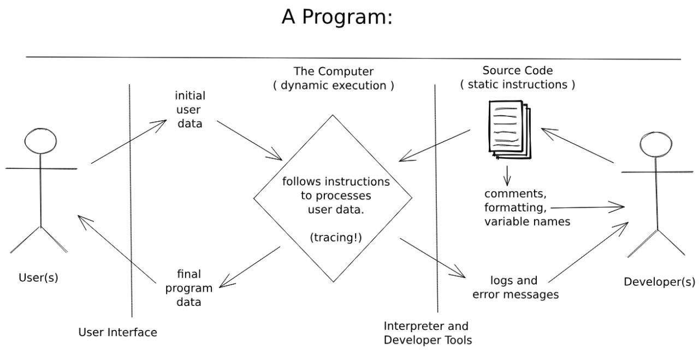

# 2.1: Running a Program

Printing a string to the console is the minimum viable program for illustrating the rhetorical relationship between developers, source code, and a computer. The developer writes instructions (source code), the computer executes them (dynamic execution), and the output appears in the console (for the developer to observe). See the diagram below which shows this exact relationship.

## Language Features

- `console.log` (JS) / `print` (Python)
- Strings (the first data type)

## Skills and Objectives

- 🥚 Understanding the difference between static source code and executed instructions
- 🥚 Logging/printing strings to the console
- 🥚 Describing the use case for comments vs. logs — comments are for developers reading the code, logs are for developers observing execution
- 🥚 **Predictive stepping with a debugger** — the core study method introduced here and used throughout the rest of the curriculum. Predict what happens next → step forward → check your prediction → investigate if wrong. See [`./predictive-stepping.md`](./predictive-stepping.md).
- 🐣 **Fixing errors** — understanding the difference between creation phase errors (parsing) and execution phase errors (runtime), and using a structured approach to identify, describe, and fix them. See [`../3-devs-computers-users/fixing-errors.md`](../3-devs-computers-users/fixing-errors.md).

## Exercise Types

- Marking syntax (primitives, identifiers, function calls)
- Tracing (console output prediction)
- Predictive stepping (first introduction, simple programs)
- Completing programs (fill in blanks)
- Fixing errors (structured error description template)
