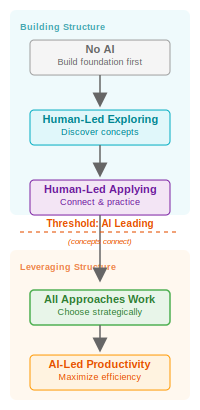

# Welcome to Programming

A spiral curriculum carrying learners from no programming experience to an introduction to algorithms, using the minimal possible set of language features. Content is designed for JavaScript (browser) and Python, authored for [Study Lenses](./-1-getting-started/exercise-types.md) which generate a range of exercises from each example program. The curriculum prioritizes program comprehension before production, and continuously frames programming as an act of collaborative communication and meaning-making between developers, users, and a computer.

## Foundational Frameworks

These are the pedagogical principles that drive every structural decision in this curriculum. Understanding them is essential for contributing to or extending the curriculum design.

### Rhetorics of Programming

Source code is a text that simultaneously addresses three audiences:

- **Other developers** — through comments, variable names, formatting, paradigms
- **A computer** — through precise instructions for processing data (state, instruction, state, ...)
- **End users** — through user interfaces and program behavior

This rhetorical model (adapted from the classical writer/audience/text triangle) is the curriculum's organizing principle. Each chapter progressively adds an audience to the learner's awareness, building from developer-to-developer communication (Chapter 1) through the full triangle including users (Chapter 3). Chapter 4 introduces agents as a named collaborator in the rhetorical model (not a fourth audience — agents mediate between the development team and the source code). Chapters 5–6 then extend into algorithmic thinking and complexity analysis with full agent collaboration available.

See the diagrams and rationale in `0-what-is-programming/assets/rhetorics-of-programming/`.

### Spiral Curriculum + "Connections are Concepts"

The curriculum revisits concepts at increasing depth across chapters. Each time a new language feature is introduced, it creates connections to every previously-learned feature — and **each of those connections is itself a learning objective** that must be explicitly practiced. A course with 4 concepts has not 4 but (at minimum) 10 learning objectives: 4 concepts + 6 connections.

This is why the spiral structure is essential: isolated concept instruction does not produce integrated understanding. Learners must repeatedly practice how concepts interact.

See [`-1-getting-started/connections-are-concepts.md`](./-1-getting-started/connections-are-concepts.md) and [`-1-getting-started/assets/spiral-curriculum.png`](./-1-getting-started/assets/spiral-curriculum.png).

### Comprehension Before Production

Learners understand code before they write it. The skill progression within each chapter follows this arc:

1. **Read** — mark syntax, read code aloud
2. **Trace** — step through execution, predict program state
3. **Describe** — explain what programs do at multiple zoom levels
4. **Modify** — make small, tracked changes to working programs
5. **Write** — develop programs from specs, reverse-engineer behavior

This means production-oriented skills (writing programs from scratch) appear late in the curriculum — after learners have built deep comprehension through structured reading and analysis.

### "Just Enough" Language Features

The language feature set is intentionally minimal. Everything a learner needs fits on a single reference page. Fewer features means less syntax to learn, which means more cognitive bandwidth for concepts, comprehension, and communication.

See the cheat sheets: [`just-enough/javascript.md`](./-1-getting-started/just-enough/javascript.md) | [`just-enough/python.md`](./-1-getting-started/just-enough/python.md)

### Study Lenses & Exercise Types

Content consists of JS/Python programs authored for Study Lenses, which generate a battery of exercises from each program. These exercise types are repeated for every subchapter as each new language feature and skill is introduced:

- **Marking syntax** — identify language parts visually
- **Tracing** — be the computer, step-by-step execution with trace tables
- **Predictive stepping** — predict, step, check, investigate (with debugger)
- **Completing programs** — fill in blanks (with distractors)
- **Translating pseudocode** — pseudocode to working JS/Python
- **Comparing programs** — same behavior, different implementation
- **Constructing programs** — Parsons problems (reassemble lines)

Later chapters add: logging, describing programs, naming variables, code review, fixing errors/bugs, modifying programs, refactoring, writing from spec, reverse engineering, and backtracing.

See the full guide: [`-1-getting-started/exercise-types.md`](./-1-getting-started/exercise-types.md)

### Learning Objective Priorities

Learning objectives use a hatching-progression emoji system to help learners prioritize:

- **🥚 Required** — base skills needed for this module and the next
- **🐣 Started** — should be completable with more time and effort
- **🐥 Studied** — big-picture understanding, may not be confident completing exercises
- **🐔 Bonus** — extension material for learners who've finished the rest

See [`-1-getting-started/learning-objectives/priority-emojis.md`](./-1-getting-started/learning-objectives/priority-emojis.md) for details.

### Generative AI in the Mix

Generative AI is a reality of software development. Learners will use it — the question is whether they use it as a crutch or as a tool. This curriculum takes a clear position: **AI can write code for you, but it can't understand a program _for_ you.**

**Where AI sits in the rhetorical model:** AI is not a fourth audience. It sits _outside_ the main rhetorical circle, mediating between the development team and the source code — reading, generating, and modifying the software context. The three core audiences (developers, computer, users) remain the same. Compare the rhetorical diagram [without AI](./0-what-is-programming/assets/rhetorics-of-programming/the-big-picture.png) and [with AI](./0-what-is-programming/assets/rhetorics-of-programming/the-big-picture-plus-ai.png) to see this positioning. See [`4-devs-computers-users-agents/gen-ai-in-the-mix.md`](./4-devs-computers-users-agents/gen-ai-in-the-mix.md) for discussion exercises exploring how AI changes each relationship in the diagram.

**Why comprehension-first matters more, not less:** As AI takes on more code production, the developer's role shifts toward reading, evaluating, describing, and reasoning about code — exactly the skills this curriculum builds. A developer who can trace execution, describe program behavior at multiple levels (PBSI), identify variable roles, and critically evaluate algorithmic strategies is well-prepared for a future where more code is AI-generated and less is written from scratch. The comprehension-first approach is not a concession to beginners. It is preparation for the emerging shape of software development.

**The AI Integration Progression:** The curriculum's chapter progression maps to a SOLO-based learning progression for AI integration. Each chapter sits at a specific position on the spectrum from no AI to full strategic collaboration:

- **Ch 0–1: No AI** — build foundation first (Prestructural/Unistructural). Learners focus on human comprehension skills without AI involvement.
- **Ch 2: Human-Led Exploring** — LLM as occasional study aid (Unistructural). LLM study strategies are introduced but limited to supporting individual concept discovery.
- **Ch 3: Human-Led Applying** — LLM as practice partner (Multistructural). LLM strategies expand with exercise types, but learners drive the process.
- **Ch 4: The AI Integration Threshold** — agents become named, concepts connect, all collaboration approaches become available (Relational). This chapter provides the mental model and collaboration framework that reframes all earlier LLM study strategies. Learners build theory of mind about LLMs as alien cognition and practice genuinely new collaboration skills: Perspective-Take, Calibrate, Articulate, Iterate, Delegate.
- **Ch 5–6: Leveraging Structure** — algorithms and complexity with full agent collaboration (Extended Abstract). All collaboration approaches are available; learners choose strategically based on learning goals.

This progression maps directly to the SOLO taxonomy — the same framework used to understand how learners build conceptual structure in programming applies to how they should integrate AI:

The principle: you must build conceptual structure before you can leverage it with AI. Crossing the threshold too early — using AI-led approaches before concepts connect — undermines the foundation that makes effective collaboration possible.

**How AI is integrated:** AI skills are woven into chapters where they become relevant, not isolated in a standalone topic. Three dimensions:

1. **LLM as study partner** — each exercise type has an associated LLM Study Strategy with starter prompts (see [`-1-getting-started/exercise-types.md`](./-1-getting-started/exercise-types.md)). General collaboration strategies, a template study prompt, and LLM context documents are provided in [`-1-getting-started/studying-with-llms/`](./-1-getting-started/studying-with-llms/). The principle: every learning objective should be masterable _without_ AI. AI helps you practice; it does not replace the practice.
2. **AI in the development process** — thought experiments exploring how AI changes the relationships between developers, source code, users, and the computer. These appear once the full rhetorical model is active (Chapter 3).
3. **Agent collaboration as explicit skillset** — Chapter 4 formally names agents in the rhetorical model and teaches collaboration as a skill with its own comprehension-before-production arc. Learners build a mental model of how LLMs work (4 Levels of AI Abstraction), then practice adapted comprehension skills (Read, Trace, Describe) and genuinely new collaboration skills (Perspective-Take, Calibrate, Articulate, Iterate, Delegate) across progressively complex code contexts.

**A deliberate scope:** This curriculum models agents as collaborators in a human-driven development process. Chapter 4 formally names agents and teaches theory of mind about LLMs as alien cognition, but the collaboration remains human-directed. Agents can do far more — full autonomy, agentic workflows, autonomous coding — but that's outside scope. This curriculum focuses on comprehension and learner agency.

## Curriculum Map

The curriculum is organized into 7 chapters. Each chapter adds an audience or dimension to the rhetorical model and introduces new skills:

| Chapter                                                                                                      | Audiences in Play                        | Language Features                                                             | Key Skills Introduced                                                                                                                                                                                                                                                                                                 |
| ------------------------------------------------------------------------------------------------------------ | ---------------------------------------- | ----------------------------------------------------------------------------- | --------------------------------------------------------------------------------------------------------------------------------------------------------------------------------------------------------------------------------------------------------------------------------------------------------------------- |
| [**0: What is Programming? How Will We Learn It?**](./0-what-is-programming/index.md)                                | (meta)                                   | (none)                                                                        | Rhetorical model, course orientation, IDE setup, AI in the rhetorical model, LLM study strategies introduced                                                                                                                                                                                                          |
| [**1: Developers**](./1-devs/index.md)| developers                               | comments                                                                      | Writing comments, code conventions, sharing code; first LLM study exercises (natural language only)                                                                                                                                                                                                                   |
| [**2: Developers and Computers**](./2-devs-computers/index.md)| developers, computer                     | `console.log`/`print`, strings, variables, `assert`, operators, types         | Predictive stepping, trace tables, static vs. dynamic analysis; LLM study strategies expand with exercise types                                                                                                                                                                                                       |
| [**3: Developers, Computers, and Users**](./3-devs-computers-users/index.md)| developers, computer, users              | `prompt`/`alert`/`confirm`/`input`, conditionals, `while`, `break`/`continue` | User stories, test cases, PBSI, variable roles, debugging, modifying, refactoring, code review, writing from spec; Gen AI in the rhetorical model (thought experiments), LLM as development partner                                                                                                                   |
| [**4: Developers, Computers, Users, and Agents**](./4-devs-computers-users-agents/index.md) | developers, computer, users + agents | (none new) | 4 Levels of AI Abstraction, LLM theory of mind (alien cognition), collaboration skills (Perspective-Take, Calibrate, Articulate, Iterate, Delegate), SOLO-based AI integration decision framework; reframes all previous LLM study strategies through agent collaboration lens |
| [**5: Developers, Computers, Users, Agents, and Algorithms**](./5-devs-computers-users-agents-algorithms/index.md) | developers, computer, users + agents + algorithms | `for...of`/`for...in`, `for`/`for...in range`                                 | Iteration (5.0), string algorithms (5.1–5.5), the analytical chain (smallest problem → growth → state → language features), the representation sequence (traces → prose → flowcharts → pseudocode → decision tables → loop invariants → state transitions → pattern schemas), exercise framework (ownership × abstraction), cross-decomposition comparison (5.6), regex as declarative paradigm (5.7); LLM for generating and critically evaluating algorithm representations |
| [**6: Developers, Computers, Users, Agents, Algorithms, and Complexity**](./6-devs-computers-users-agents-algorithms-complexity/index.md) | developers, computer, users + agents + algorithms + complexity | (none new)                                 | Step-counting, growth rate reasoning, Big O notation; revisits Chapter 5 algorithms through the complexity lens |

## Key Pedagogical Milestones

Several skill frameworks thread across chapters, each building on the last:

- **Predictive Stepping** (introduced 2.1) — the core study method used throughout: predict what happens next, step in the debugger, check, investigate. See [`2-devs-computers/predictive-stepping.md`](./2-devs-computers/predictive-stepping.md).

- **Purpose, Behavior, Strategy, Implementation (PBSI)** (introduced 3.4) — a 4-level lens for understanding programs. Purpose: why a program exists. Behavior: what users see. Strategy: the approach. Implementation: specific lines. This is the bridge to algorithmic thinking where Strategy becomes the primary focus. See [`3-devs-computers-users/describing-programs.md`](./3-devs-computers-users/describing-programs.md).

- **Variable Roles** (introduced 3.4) — fixed value, stepper, flag, gatherer, holder, temporary. This vocabulary becomes essential for analyzing algorithm state in Chapter 5. See [`3-devs-computers-users/naming-variables.md`](./3-devs-computers-users/naming-variables.md).

- **Agent Collaboration Framework** (Chapter 4) — theory of mind about LLMs as alien cognition, grounded in the 4 Levels of AI Abstraction. Collaboration skills extend the comprehension-before-production progression to agent interaction: transferred skills (Read, Trace, Describe applied to LLM output) and genuinely new skills (Perspective-Take, Calibrate, Articulate, Iterate, Delegate). The SOLO-based decision framework helps learners choose when to use AI-led vs. human-led approaches based on their current learning position. This chapter is the AI Integration Threshold — it reframes all earlier LLM study strategies by providing the _why_ behind them.

- **The Representation Sequence** (Chapter 5) — each algorithm is revisited through progressively abstract behavioral representations: trace tables → prose strategy descriptions → flowcharts → pseudocode → decision tables → loop invariants → state transitions → algorithmic pattern schemas. Exercise design is informed by the Abstraction Transition Taxonomy (Cutts et al.), which structures exercises as transitions between abstraction levels — adjacent, distant, and "why" — ensuring learners don't just produce representations but understand the relationships between them. Complexity analysis (step-counting, Big O) is separated into Chapter 6. See [`5-devs-computers-users-agents-algorithms/assets/abstraction-transition-taxonomy.pdf`](./5-devs-computers-users-agents-algorithms/assets/abstraction-transition-taxonomy.pdf).

- **Studying with LLMs** (introduced Chapter 0, practiced throughout, formalized Chapter 4) — LLMs as study partners, not substitutes for comprehension. General collaboration strategies and a template study prompt are introduced early; exercise-type-specific LLM strategies accumulate as new exercise types appear across chapters. Chapter 4 provides the theoretical framework that reframes all earlier strategies — earlier tips were scaffolding; Chapter 4 is the formal treatment. See [`-1-getting-started/studying-with-llms/`](./-1-getting-started/studying-with-llms/).

## Chapters

### [Chapter 0: What is Programming? How Will We Learn It?](./0-what-is-programming/index.md)

Orientation chapter. Introduces the rhetorical model (code audiences: developer, computer, user), sets expectations for the comprehension-first approach, introduces the spiral structure and Study Lenses environment.

### [Chapter 1: Developers](./1-devs/)

The simplest possible code: comments only. Learners practice writing comments that describe what a program should do and why, basic IDE skills, formatting conventions, and sharing code with others. Ends with a curated collection of real comments from real codebases — funny, desperate, and poetic examples of developer-to-developer communication in the wild (1.1).

### [Chapter 2: Developers and Computers](./2-devs-computers/)

Now the computer is an audience. Learners run programs, observe execution, store values in memory, make assertions about state, and work with just enough types and operators. Five subchapters: running programs (2.1), program state (2.2), asserting (2.3), types and operators (2.4), and "be the computer" — two browser games where you carry out code instructions step by step (2.5).

### [Chapter 3: Developers, Computers, and Users](./3-devs-computers-users/)

The full rhetorical triangle. Users enter the picture with I/O, programs gain variable behavior with conditionals, input validation with loops, and the PBSI framework provides vocabulary for understanding programs at multiple levels. The chapter culminates in full program development skills. Six subchapters: user I/O (3.1), conditionals (3.2), input validation (3.3), PBSI (3.4), developing programs (3.5), plaintext programs (3.6).

### [Chapter 4: Developers, Computers, Users, and Agents](./4-devs-computers-users-agents/)

The AI Integration Threshold. Agents become a named collaborator in the rhetorical model. Learners build a mental model of LLMs as alien cognition (4 Levels of AI Abstraction), then practice collaboration skills through a spiral that revisits all previous chapters with an LLM collaborator: prose-only interaction (4.1), developer-facing code (4.2, revisits Ch 1), computer-facing code (4.3, revisits Ch 2), and user-facing programs (4.4, revisits Ch 3). A brief reflection formalizes the collaboration vocabulary (4.5), and a vibecoding sendoff (4.6) proves the chapter's thesis through forensic analysis of unguided AI collaboration. Seven subchapters: what is an LLM (4.0), collaborating in prose (4.1), agents and developer communication (4.2), agents and computer communication (4.3), agents and user communication (4.4), looking back/forward (4.5), vibecoding (4.6).

### [Chapter 5: Developers, Computers, Users, Agents, and Algorithms](./5-devs-computers-users-agents-algorithms/) _(work in progress)_

Not a qualitative break — algorithms are still wrapped in the same user-facing program pattern (validate input → process → output). What's new is the focus on Strategy as the primary object of study, organized by an analytical chain (smallest problem → growth pattern → state → language features). The chapter contains its own internal spiral (the "spider web model"): concentric circles represent growth pattern complexity (each subchapter), radial lines represent abstraction levels (the 8 behavioral representation passes), and every subchapter traverses all radial lines. Eight subchapters: iteration setup (5.0), each element independently (5.1), adjacent relationships (5.2), composed scans (5.3), global relationships (5.4), two perspectives (5.5), "can we do better?" as qualitative bridge to Chapter 6 (5.6), and regex as a declarative paradigm (5.7).

### [Chapter 6: Developers, Computers, Users, Agents, Algorithms, and Complexity](./6-devs-computers-users-agents-algorithms-complexity/) _(to be designed)_

Complexity analysis separated from Chapter 5's behavioral representations. Where Chapter 5 asks "what does this algorithm do?", Chapter 6 asks "how much work does it do?" Revisits all Chapter 5 algorithms through the complexity lens: step-counting, growth rate reasoning, and Big O notation. Ends with a fun interlude exploring space vs. time through absurd algorithms — bogosort, sleep sort, Stalin sort, goalpost sort, and the 2025 proof that space is fundamentally cheaper than time (6.6). To be designed after Chapter 5 is implemented.

## Language and Platform Notes

**JavaScript (primary track):** Assumes a browser environment. The browser devtools provide an excellent debugger, and `prompt`/`alert`/`confirm` exist natively, making the user/developer distinction clear — `console.log` is for developers, `alert` is for users.

**Python (parallel track):** Uses `print` and `input`. The user/developer distinction is less clear in a standard terminal environment since both `print` and `input` share the same console. Options include: being extra intentional about when a `print` is for users vs. developers, or writing wrapper functions, or assuming the curriculum is studied in the browser-based Study Lenses environment rather than directly from VSCode.

**Study Lenses environment:** Programs are studied through Study Lenses which provide interactive exercises (trace tables, syntax highlighting, debugger integration, etc.). The curriculum is designed to be studied in this environment.

## Status and Open Questions

- **Chapter 4**: Chapter structure designed (4.0–4.6). Mental model foundation, collaboration skills framework, and spiral structure specified. Subchapter content drafted.
- **Chapter 5**: Subchapter progression designed (5.0–5.7). Algorithms selected, analytical chain and exercise framework specified. Implementation of individual algorithm exercises is ongoing.
- **Chapter 6**: To be designed after Chapter 5 is implemented. Placeholder folder created.
- **Representation pass count**: The 8-pass behavioral sequence is provisional. Some passes may be removed or consolidated after testing which ones add genuine insight at each difficulty level.
- **Python track completeness**: The Python cheat sheet needs further development (some sections still contain JS syntax).
- **IDE requirement in Chapter 1**: Should the curriculum require IDEs from the start, or allow other text editing approaches?
- **Code sharing mechanism**: GitHub Gists are proposed for Chapter 1 but introduce a dependency. This needs discussion.
