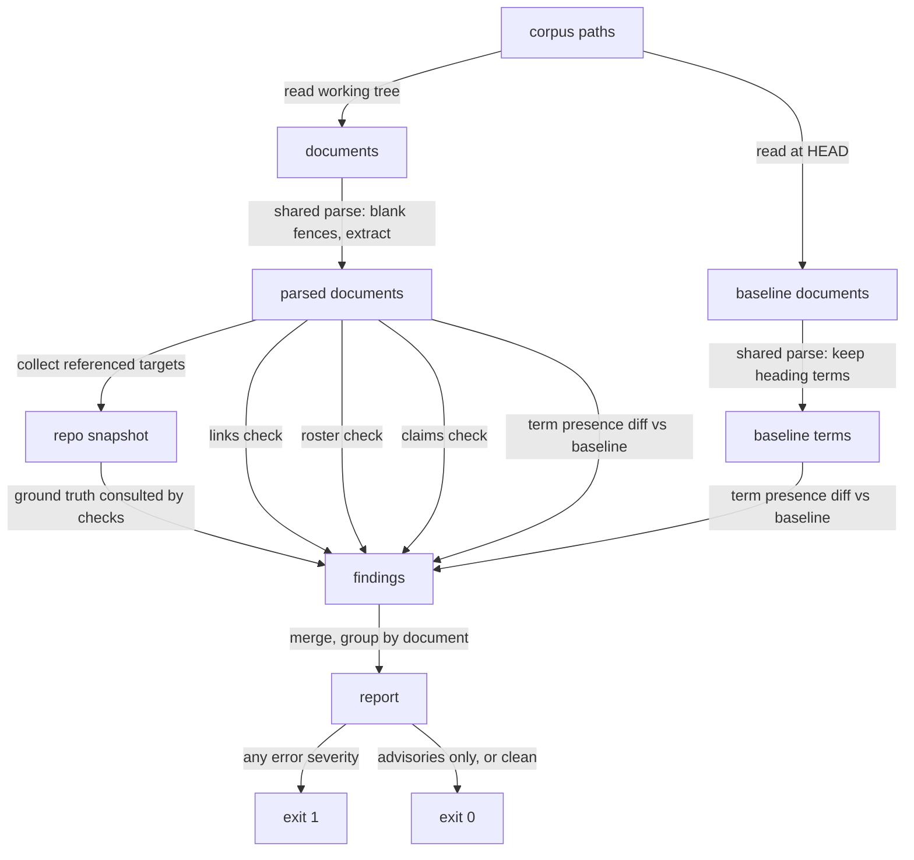
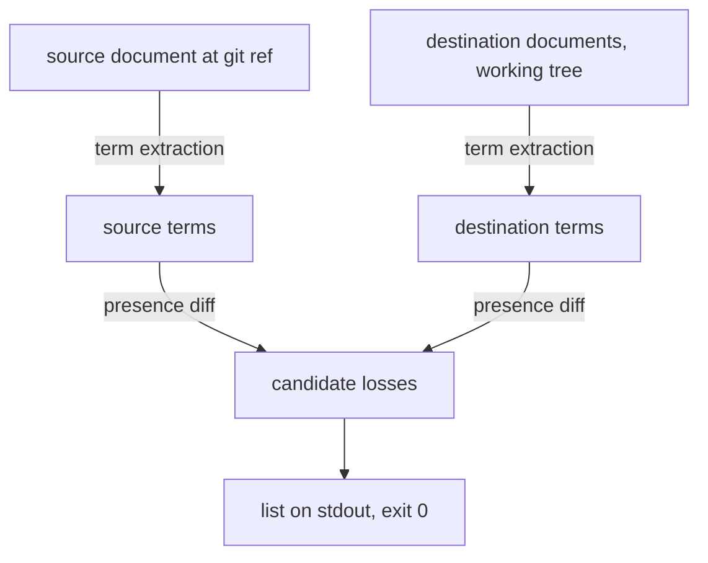
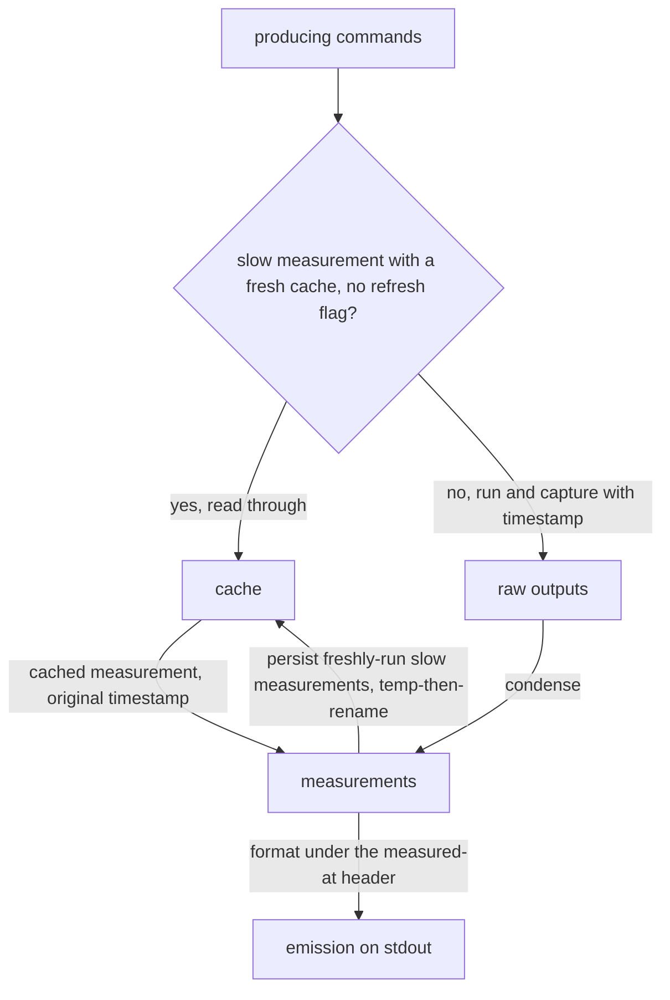

# Scripts — architecture

> Written Phase 0, before implementation: this sketch is the structural contract
> the Refactor step is held against.

## Governance checker

Bounded context: the governance corpus and its truthfulness. Ubiquitous language
and corpus definition live in [README.md](./README.md); typedefs live in
`lib/check-governance/types.mjs` (the single typedef home for this bounded
context — checks reference them via JSDoc imports, never redeclare them).

### Phases

1. **Load** — the thin entry reads the working-tree corpus and the corpus at
   `HEAD` (the baseline for the headings comparison). A corpus path that cannot
   be read, a corpus glob that matches nothing, or a failed `HEAD` read is an
   error (exit 1) — never a silent skip.
2. **Parse** — one shared implementation reduces each document to a parsed
   document: fenced code blocks are BLANKED IN PLACE (line numbering is
   preserved end-to-end — every reported line refers to the file as it exists on
   disk), inline code spans are matched within a single line only, then
   headings, links, backticked tokens, and the extracted terms are pulled out.
   This discipline is a constraint, not a preference: a naive multi-line
   backtick-pair scan swallows whole regions and reports zero findings on a
   corpus with a known defect — blind-but-green, the worst failure mode a
   checker can have.
3. **Resolve** — the entry collects every target the parsed documents reference
   (link targets, path-like claim tokens) and materializes the repo snapshot as
   PLAIN DATA: npm script names, `node_modules/.bin` tool names, the set of
   referenced paths that exist, and the headings of referenced markdown targets.
   A referenced `.js`/`.jsx` path exists when its `.ts`/`.tsx` sibling does —
   the repo's NodeNext import convention writes `.js` specifiers for `.ts`
   sources. Load and Resolve are the ONLY phases that touch the filesystem, git,
   or `package.json`.
4. **Check** — each check (links, roster, claims, headings) maps parsed
   documents plus the snapshot to findings (the headings check consumes the
   baseline corpus instead of the snapshot — its second input is documents, not
   facts). Checks are pure: same input, same findings; they never import
   fs/git/process — all ground truth arrives as the snapshot's data or the
   baseline corpus.
5. **Report** — findings merge and print grouped by document, in corpus order
   then line order; any error-severity finding sets exit 1, advisories never do.

### Data flow

The headings check IS a term presence diff — the same term-extraction core the
migration mode uses, aimed at `HEAD` as the source and the working corpus as the
destination set, FILTERED to heading-kind terms, reporting advisories.

### Migration loss-lister mode

`--migration` is a second entry mode over the same term-extraction core: the
source document is read at a git ref, destinations from the working tree, and
every extracted term present in the source and absent from every destination is
listed as a candidate loss. It judges nothing and exits 0 on every SUCCESSFUL
run — the list is input to a human-authored loss ledger, not a verdict.
Operational failures (unresolvable ref, unreadable source or destination) fail
loudly, nonzero.

### Constraints

- Checks are pure functions over parsed documents plus the snapshot — Load and
  Resolve (the entry) own all ground-truth access (fs, git, `package.json`,
  `node_modules/.bin`); the snapshot is plain data (no live resolvers), so
  fixtures are literals and checks judge without looking anything up.
- The claims recognition contract (which tokens are claims, how each class is
  classified, the named skip classes) lives in
  [README.md § Scope of each check](./README.md#scope-of-each-check) — the
  claims check implements it verbatim.
- One parse, one term-extraction implementation — shared by every check and by
  `--migration`; one place to fix false negatives.
- Fence blanking preserves line numbering end-to-end; inline code spans never
  span lines.
- **Slug contract** (links check): lowercase; drop every character outside
  letters, digits, spaces, and hyphens (`™`, backticks, and dots included); each
  space becomes one hyphen with runs preserved; the nth repeat of a heading
  gains `-{n-1}`. Anchor fixtures: `Vibetoading and Frogramming — house terms` →
  `vibetoading-and-frogramming--house-terms`; `Always Works™ Reality Check` →
  `always-works-reality-check`; ``7. No `this` Keyword`` → `7-no-this-keyword`;
  a second `Data flow` heading → `data-flow-1`.
- Only inline `[text](target)` links are checked; reference-style,
  angle-bracket, and titled links are out of reach (none exist in the corpus
  today) — a stated restriction, not a silent one.
- The roster check hard-fails on an unparseable roster: zero rows or a missing
  heading is a `ROSTER PARSE FAILURE` (exit 1), never an empty map — an empty
  map would silently pass everything. Its reviewer-only scope (`ar-*.md`) is a
  named skip class inside the check. Row-level breakage never hides: a row whose
  AR cell does not parse and a duplicate row are each their own error finding at
  that row's line (a duplicate must never silently overwrite), and a reviewer
  file with malformed frontmatter is a whole-document error. Attribution follows
  DEV.md's own "frontmatter wins" rule: parity and missing-row findings
  attribute to DEV.md at the row (or heading) line; name-vs-stem findings
  attribute to the agent file. The join key is the file stem. Trigger/Provide
  framing is checked per existing `### AR-N` section; section existence per row
  is deliberately not asserted.
- Zero silent suppressions: every skip class (http links, root-relative
  Docusaurus routes, non-path link targets, content-tree advisory paths, claims
  in `.claude/skills/**` documents, non-reviewer agent files in roster,
  placeholder/home-path/matching-glob tokens) is named in the check that skips
  it.
- `RepoSnapshot.existingPaths` is deliberately a `Set`: the snapshot is
  single-process, never serialized across a boundary, and never frozen by helper
  — "plain data" means no live resolvers, not JSON-primitives-only.
- The slugger handles plain-text headings only — emphasis markers, inline links,
  and HTML inside heading text are out of reach (no corpus heading contains them
  today); a stated restriction, not a silent one.
- Only backtick fences are tracked, with CommonMark run-length nesting (a
  shorter fence inside a longer one is content); indented (4-space) code blocks
  and tilde fences are out of reach (none exist in the corpus today) — a stated
  restriction, not a silent one.
- Glob handling covers `*`, `**`, and `?` only; brace-alternation tokens
  (`*.{ts,tsx}` forms) fall outside the path charset and are ignored by the
  claims check — a stated restriction, not a silent one (one such token exists
  in the corpus today, in DEV.md's module-boundary prose).
- Glob-token existence (`matchingGlobs`) is answered against `git ls-files` —
  tracked files only, unlike plain-path existence which is filesystem truth. A
  glob claim satisfied only by an untracked working-tree file reads as broken
  until staged — a stated restriction, not a silent one.
- Severity is two-valued: `error` gates, `advisory` never does.
- A finding's line is `null` only for whole-document findings (unreadable file,
  roster parse failure).
- All phases are synchronous, single-process.
- The checker reads no test results and no lint results — the workflow mandates
  red phases, so a gate on them would fire on correct work.
- No `tools:` assertions in the roster check — reviewer toolsets are harness
  territory, measured by the harness-probe agent, never asserted by a checker.
- `--migration` splits `<src>@<ref>` on the LAST `@`; a nonexistent destination
  path is a loud error, never an empty-diff pass.
- Code conventions: `scripts/` follows DEV.md's functional conventions (named
  function declarations, no `this`, no mutable closures, validate at boundaries)
  with two stated exemptions — no deep-freeze helper (`@utils` is not reachable
  from `scripts/`; outputs stay internal), and the shared pure modules (the
  parse, the slugger, the term-extraction core) are exported and tested directly
  rather than only through a consuming check (these are tooling scripts, not
  product modules, so the test-through-the-public-export rule is deliberately
  relaxed at module grain — a check's internal helpers still stay unexported and
  are tested through the check).

### Out of scope

- Intent judgment — whether governance prose is wise stays with reviewers and
  humans; the checker only verifies that what prose names exists.
- Style and formatting — the linters own them.
- Measuring repo state (node version, tsc counts, lint counts) — that is the
  measured-facts oracle's job, a separate bounded context (next section).
- When and whether the checker runs (advisory hook, CI, npm invocation) — the
  callers' business, registered at their own gates.
- Fixing — the checker reports; it never edits.

## Measured-facts oracle

Bounded context: the numbers governance keeps misquoting, measured live.
Typedefs live in `lib/repo-facts/types.mjs` (the oracle's own single typedef
home — `Measurement` lives here, not in the checker's). The oracle asserts
nothing: every value it prints was produced by a command it ran, at the
timestamp it prints beside that value.

### Phases

1. **Measure** — the thin entry runs each producing command (node version
   against `package.json` engines — printing both values and their inequality is
   measurement, concluding "therefore do Y" would be judging and stays out;
   `tsc --noEmit` count + locations; cspell version; markdownlint count; `HEAD`;
   foreign dirty files from `git status --porcelain`) and captures raw output
   with a timestamp. eslint is deliberately absent from the injected path
   (measured 16–19s). "Slow" is a fixed design-time classification — today
   exactly the markdownlint measurement has a cache path — never a live runtime
   threshold: nothing measures a command's duration to decide. A slow
   measurement whose cached value is fresh — and no `--refresh` — is read from
   the cache instead of run: the cached measurement joins the set with its
   ORIGINAL timestamp intact.
2. **Condense** — pure functions reduce raw command output to measurement
   values: tsc output to a count plus locations (a location-less global
   diagnostic still counts), porcelain output to a foreign-dirt line list
   (renames and quoted paths verbatim). Freshly-run slow measurements are
   persisted to the cache, temp-then-rename.
3. **Emit** — the formatter opens with the load-bearing header, verbatim:
   `MEASURED AT <ts>, not asserted — supersedes any memory or handoff claim about these numbers.`
   — `<ts>` is the EMISSION time; each measurement block below it carries its
   own label, value, producing command, and the measurement's own timestamp (for
   a cached value, the two differ — the per-measurement timestamp is the honest
   one). Condense owns the shape of a value; Emit owns the report's assembly
   around the values.

### Data flow

### Running

- `npm run repo:facts` (default) — measure everything, slow measurements through
  the cache, emit under the header.
- `--session-start` — the same measurement path, invoked by the SessionStart
  registration; identical emission.
- `--refresh` — re-measure eagerly, cache included, then emit.

### Constraints

- **A producing command that fails to run is still its measurement**: the value
  carries the failure evidence (exit status, stderr head) under the same label,
  command, and timestamp — never omitted, never a zero. "This tool cannot run
  here" is itself a measured fact, and precisely the fact this oracle exists to
  inject.
- Pure functions (formatting, tsc parsing, porcelain condensing, staleness) are
  exported and vitest-tested with injected strings — a deliberate, blessed
  narrowing of the plan's "injected runners": pure functions over strings need
  no runner seam at all. No test shells out; the thin entry (`repo-facts.mjs`)
  owns every process/fs/git touch.
- The header line is contract, verbatim, on its own line — downstream skills and
  briefs quote it; changing it breaks them.
- A false zero is the worst failure: a tsc diagnostic without a file(line,col)
  location still increments the count.
- "Slow" is an implementation constant measured at execution (the plan's
  threshold guidance: ~10s); the cache lives at `.claude/cache/repo-facts.json`,
  written temp-then-rename, gitignored; a torn or unparsable cache read counts
  as stale.
- The oracle exits nonzero only on its own operational failure — never because a
  measured number is bad (that would be judging).
- All measurements run sequentially, synchronously, single-process — the
  injected path's budget is the sum, which is why eslint is out and markdownlint
  reads through the cache.
- **SessionStart never fires for spawned subagents** — a known hole, baked into
  the fanout skill: orchestrators paste this script's OUTPUT into briefs, never
  a retyped number.
- Windows path shapes are out of reach (no Windows dev/CI platform exists here)
  — a stated restriction, not a silent one.

### Out of scope

- Judging the numbers — the oracle measures; gates and humans judge.
- Governance-corpus truthfulness — the checker's context, above.
- When and whether the oracle runs (the SessionStart registration, briefs, CI) —
  the callers' business, registered at their own gates.
- Remediation — the oracle never fixes what it measures.
