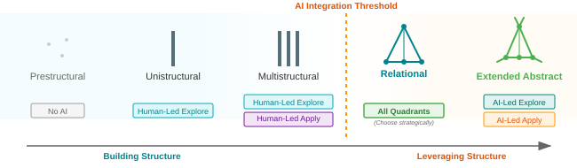

# Learning to Program ➔ Programming to Learn

Learning a programming language is a separate process from learning computational thinking. Courses often try teaching both at once. I prefer to teach programming language and composition skills first then build higher level thinking on this foundation. It has been cool to see how a single course designed this way can both help beginners build foundations and help experienced programmers deepen their skills.

To explain this progression I adapted a phrase from reading pedagogy: _Learning to read ➔ Reading to Learn_. This describes the transition students go through (usually around 3rd grade) when their reading skills are automated enough that they can learn the concepts they're reading _about_, using their literacy as a vehicle for learning instead of the object of learning. I find the same principle applies to programming and CS. Computational thinking and algorithms are ultimately the skills learners want to master but until their programming language comprehension and program composition skills are sufficiently automated, inadequate code fluency is actually one of the greatest barriers to mastering computational thinking.

I am currently building and testing a two-part introduction to programming and CS based on this philosophy using content and tooling I've built over the years as a starting point. Both course outlines are still under development as I finish building Study Lenses and testing the learning objectives with students. I have a backlog of content and exercises to migrate into the linked repositories as the courses progress.

## Course One - [_Frogramming & Vibetoading - Affordance-Discovery Cycle(s)_](https://github.com/codeschoolinabox/spiralearn/tree/main/spiralearn/frogramming-and-vibetoading)

The _learning to program_ phase. This course helps learners build and operationalize mental models of the JavaScript programming language through granular predictive exercises, and of users by introducing the basics of design thinking and UX design.

_Frogramming & Vibetoading_ also explores how programming education should evolve now that AI can write code faster (if not always better) than humans. My high-level answer is to emphasize code comprehension and modification instead of writing, then to gradually integrate AI deeper into a learner's development process. To make this explicit the course names [3 levels of involvement with AI](https://github.com/codeschoolinabox/spiralearn/blob/main/spiralearn/frogramming-and-vibetoading/ontology.md#11-the-llm-shift-workflow-side--how-ai-participates-in-your-work):

1.  A study partner reading your code and helping you understand it without edit access.
2.  A co-developer that helps you modify and write your code.
3.  An integrated part of your deployed software (#3 is named for clarity but intentionally out of scope).

To be sure the transition from role #1 to #2 doesn't come at the cost of skill development, the course spends the first chapters only using AI in role #1 and as an internal tool to generate tailored programs for learners to study. The transition from role #1 to role #2 follows the SOLO taxonomy, encouraging learners to co-develop with AI only after they have reached a multi-structural understanding of programming\*:

This course is well fleshed out and large parts of it are going live this fall with an online cohort.

> \* Diagram pulled from [Human+AI Collaboration Roles](https://evancole.be/quick-reads/human-ai-collaboration-roles/index.html).

## Course Two - [_Welcome to Algorithms_](https://github.com/codeschoolinabox/spiralearn/blob/main/spiralearn/welcome-to-algorithms/chapters-plan.md) {: .pagebreak}

The _programming to learn_ phase. Welcome to Algorithms introduces algorithms by starting with what's visible in the programming language itself: categorizing the different kinds of data stored in program memory, counting execution steps, and drawing correlations between these different aspects over time as the program executes. It then builds abstraction by scaffolding learners' [translation skills between different levels of abstraction](https://github.com/codeschoolinabox/spiralearn/blob/main/spiralearn/welcome-to-algorithms/5-devs-computers-users-agents-algorithms/index.md#the-representation-sequence-abstraction-levels), helping learners build not only their computational thinking but also their computational communication.

Welcome to Algorithms progresses by introducing programs that gradually [track more information in more complicated ways](https://github.com/codeschoolinabox/spiralearn/blob/main/spiralearn/welcome-to-algorithms/5-devs-computers-users-agents-algorithms/index.md#observable-dimensions) to solve problems, as opposed to progressing by algorithm class or problem type. Along the way there's an emphasis on naming and describing what's happening in algorithms (ex. [recursion](https://github.com/MIT-Emerging-Talent/ET6-Programming-With-Python/blob/main/6_recursion/README.md)), on using tooling to visualize and explore algorithm behavior (ex. [complexity is counting](https://github.com/MIT-Emerging-Talent/ET6-edXtras/tree/main/09_complexity_is_counting) + [video guide](https://mit-emerging-talent.github.io/ET6-edXtras/09_complexity_is_counting/guide.mp4)), and on describing their code both formally and informally (ex. [documenting and testing](https://github.com/MIT-Emerging-Talent/ET6-Programming-With-Python/tree/main/3_documenting_and_testing)).

All of these strategies for building abstract CS and computational thinking on top of code execution rely on the deep predictive language mastery introduced in the first course. By first automating programming language knowledge, learners are free to explore algorithms hands-on without losing time and motivation on syntax and language bugs.

This course is on the back burner as I prepare to teach the first one later this fall.

## Prior Art

Below are some of my modules that I'm pulling from to design and populate the two new courses. Each of these has been co-designed and iterated with learners and coaches in class:

- **JS**: [welcome-to-js](https://github.com/DeNepo/welcome-to-js) ➔ [inside-js](https://github.com/DeNepo/inside-js) ➔ [behavior-strategy-implementation](https://github.com/DeNepo/behavior-strategy-implementation)
- **PY**: [Programming with Python](https://github.com/MIT-Emerging-Talent/ET6-Programming-With-Python) (includes [recursion](https://github.com/MIT-Emerging-Talent/ET6-Programming-With-Python/tree/main/6_recursion)), [edXtras](https://github.com/MIT-Emerging-Talent/ET6-edXtras) (developed for MIT Emerging Talent's _Certificate in Computer and Data Science_)

## Content Publishing and Hosting

Both courses are hosted using Docusaurus with Study Lenses exercises embedded with a React component. The build system replaces all codeblocks with interactive exercises, and inlines any sibling JS files as tabbed exercises within a page. This system allows me to easily write, test and update course materials without custom syntax or environment setup.
