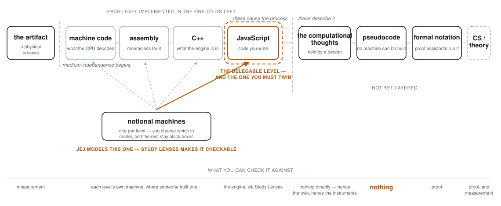
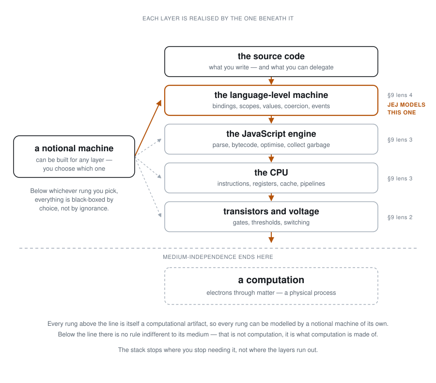

# Computational thinking — the thesis behind the course

> **What this directory is.** A self-standing argument about what computational
> thinking _is_, why it cannot be taught abstracted from a medium, and what that
> commits a curriculum to. It is written to hold on its own, before the
> _Frogramming & Vibetoading_ course is redrafted around it.
>
> **Audience.** Author-facing design memos, not learner-facing prose. Nothing
> here is written to be read by a student. Chapter 0 will eventually present a
> version of this argument; that drafting happens in the course, not here.
>
> **Direction of travel.** These documents cite F&V. F&V does not yet cite back.
> That is deliberate: the argument has to stand before the course is moved.

## The claim

> **Modelling, legibility, and notation are three separate additions to bare
> computation. Computational thinking requires all three — which is why it
> cannot be taught abstracted from a medium.**

And the reason to believe it rather than merely accept it: each addition already
names a commitment this course has made.

| Addition                                  | What supplies it                                     |
| ----------------------------------------- | ---------------------------------------------------- |
| a second system (modelling)               | the domain — user-facing, text-manipulating programs |
| an observer with instruments (legibility) | Study Lenses · `embody`                              |
| a machine to think through                | JEJ's notional machine, operated through JEJ         |

**Meaningful computation** is not one of the three. It is what the whole thing
is for: an artifact that participates in a situation and is taken some way by
someone. It sits at the far end of the chain, and it is what the course is named
after.

The thesis is not a preamble to the curriculum. It is an account of why the
curriculum has the shape it already has.

## The picture

At the far left a physical process. Then a **ladder of language levels**, each
implemented in the one to its left — machine code, assembly, C++, JavaScript —
with a dashed boundary marking where medium-independence begins: to its left is
the medium, to its right are rules indifferent to it.

**The notional machines sit below the ladder, not on it.** There is one per
level, and you choose which to model; the rest stay black boxes by choice rather
than ignorance. That is what "at a chosen level of abstraction" means, and it is
why you do not need to know how a CPU works to write JavaScript. `README.md` and
`thesis.md` both already said there is no such thing as _the_ notional machine —
only ones chosen for a purpose and an audience.

**JavaScript carries two marks at once**, and their coincidence is the course's
central tension: it is the level you learn to **delegate**, and the level whose
machine you must **twin**. `ontology.md:1257` is the consequence — "Frogramming
with delegation is only sustainable if you keep the direct NM view alive."

**The pivot divides causing from describing.** To its left, everything is part
of the chain that actually produces the physical process. To its right, the
computational thoughts a person holds, and the notations that describe without
driving.

Underneath: **what you can check it against.** A level is checkable exactly
where someone has built a machine for it — Study Lenses for JavaScript's, proof
assistants for formal notation's. Two positions have none. The thoughts have
nothing _directly_, which is why the twin and the instruments exist at all. And
pseudocode has nothing and **can** have nothing, because there is no fixed
semantics to build a machine against. That is the subject of
[on-pseudocode.md](./on-pseudocode.md).

The right-hand side is marked **not yet layered**. It wants the same treatment —
gradations of formalisation between a thought and a complexity class — and
`welcome-to-algorithms/` is where that should come from, since its target is the
formal end.

The second figure expands the chain's first position. Every layer between
notation and physics is itself a computational artifact, so every layer can
carry a notional machine of its own — which is what "at a chosen level of
abstraction" means, and why you do not need to know how a CPU works to write
JavaScript. It bottoms out where medium-independence fails: above the line,
rules indifferent to their medium; below it, the medium.

## Reading order

Written in dependency order. Each stands alone; each cites the others.

|     | Document                                                   | What it argues                                                                                                 |
| --- | ---------------------------------------------------------- | -------------------------------------------------------------------------------------------------------------- |
| 0   | [meaning.md](./meaning.md)                                 | Why "meaning" splits into two named nodes — modelling at L1, meaningful at L6 — instead of one word doing both |
| 1   | [thesis.md](./thesis.md)                                   | The definitional DAG, layer by layer, and the claim it establishes                                             |
| 2   | [observability.md](./observability.md)                     | Legibility as its own node, and the criterion that decides what a course can work at                           |
| 3   | [computational-languages.md](./computational-languages.md) | The genus, algorithms as its second species, and what survives notation-relativity                             |
| 4   | [domain.md](./domain.md)                                   | Text as the domain, and the reply owed to Weintrop                                                             |
| 5   | [epicycles.md](./epicycles.md)                             | Learning-to-program → programming-to-learn as repeated half-beats                                              |
| 6   | [half-beat.md](./half-beat.md)                             | One drafted, one deliberately bad, and the gate item                                                           |
| 7   | [tie-ins.md](./tie-ins.md)                                 | Findings about F&V — a map, not a work order                                                                   |
| 8   | [this-codebase.md](./this-codebase.md)                     | This repository read through the thesis — and where Naur's remedies invert for an LLM collaborator             |
| 9   | [on-pseudocode.md](./on-pseudocode.md)                     | Why pseudocode-first inverts the sequence — it is notes about a machine you have not met                       |

Start at 0 if you want the argument. Start at 7 if you are redrafting the course
— read its header first, since its rows are findings and not a change list.
Start at 6 if you want to know whether any of this survives contact with a
chapter.

## What connects them

- **0 → 1.** The thesis uses "modelling" and "meaningful" for two different
  nodes. `meaning.md` comes first so the split is established before either word
  is put to work.
- **1 → 2.** The thesis separates predictive usefulness (what makes a
  computation model something) from observability (what makes that modelling
  legible). `observability.md` develops the second, because it is the one the
  course runs on.
- **1 → 3.** The genus/species distinction is L3 of the DAG. Algorithms are the
  second species, which is what makes the genus visible at all.
- **3 → 4.** If the thoughts are notation-relative, the notation and the domain
  are both curriculum decisions rather than conveniences.
- **1, 2 → 5.** Computational thinking depends on legibility, and the curriculum
  has to supply it turn by turn. That is the epicycle.
- **5 → 6.** A general form nobody has drafted is untested. `half-beat.md` is
  the falsification instrument.
- **all → 7.** What follows for the existing course, recorded as findings.
- **all → 8.** What follows for this repository, which is itself an instance of
  the thing being argued about — including the failures of the session that
  wrote these documents.
- **1, 2, 3 → 9.** A worked application: pseudocode fails L2's legibility
  criterion, sits in L3's non-causal species, and has no semantics for L3's
  notation-relativity to bite on. Read it as a test of whether the chain decides
  cases.

## Provenance

- `plann.txt` — the original draft chain. Superseded by
  [thesis.md](./thesis.md); kept as the record of where the argument started.
- `from-a-job-application/` — the drafts that produced it, including the
  learning-to-read → reading-to-learn analogy and the four questions the thesis
  answers.
- `defining-computational-thinking-for-mathematics.weintrop-2015.pdf` — Weintrop
  et al., _J Sci Educ Technol_ (2016) 25:127–147, published online 8 Oct 2015.
  The paper the discipline-situatedness argument comes from, and the source of
  the sharpest objection to this course.

## Status of the sources

**Every non-repo citation in this directory is unfetched.** They are marked
`Owed:` at the point of use. Putnam, Searle, Chalmers, Woodward, Piccinini,
Grice, Hertz, Craik, Rosen, Wing, Papert, diSessa, du Boulay, Sorva, Stefik &
Siebert, Naur, METR, Lister, Salomon & Perkins, Denning — none has been read for
this campaign. Weintrop is the exception: it is in this directory and its
citations here were checked against the PDF.

Do not cite any of them in learner-facing material without fetching first. The
one place a claim of this kind was checked and found wrong — a page number that
did not reproduce — is why this note exists.

## Known gaps

- **`domain.md` owes an answer to _which community_.** Weintrop's argument is
  that computational thinking must be situated in a discipline whose real
  problems supply the assignments. Naming a technology surface and an audience
  posture is not yet naming a community.
- **The no-correlation finding is uncited**, and the whole learning-to-program →
  programming-to-learn architecture rests on it.
- **Type or token** — whether a computational language is the system or the
  utterance — is open, and Ch0 will need it settled.
- **Where CT sits in the spiderweb topology** is undecided.
- **Whether target systems are localizable** by partner communities, given the
  Reusability Paradox.
- **A C4 half-beat** is not drafted, which is what the teachability check below
  requires.

## How to check this directory

- **Cold-read `thesis.md` alone**, with no curriculum context. Does the argument
  carry?
- **Teachability check.** Hand `epicycles.md` and `half-beat.md` to a reader who
  has never seen F&V and ask them to draft the C4 half-beat. If they cannot, the
  set does not hold, however well the thesis reads.
- **External-citation check.** Every `Owed:` marker traced to a fetched source
  before it ships.
- **Definitional reachability.** From `frogramming-and-vibetoading/`, run
  `grep -rniE 'computational thinking|computational language|meaning|affordance|domain' --include='*.md' computational-thinking/`
  and read each hit against `thesis.md` and `meaning.md`. A hit **fails** if the
  term is used in a sense neither document defines and it is not marked as a
  quotation of F&V. Note `meaning` matches `meaningful`; `meaningful` alone does
  not match `meaning`.
- **Two-senses audit.** Every "meaning"/"meaningful" anchored to one named
  sense.
- **Tie-in re-verification.** Run each citation in `tie-ins.md`; do not read
  from notes.
- **Standing on its own.** A reader with no F&V exposure reads this file and
  everything in the reading order, and reports what the argument depends on that
  is not here.
