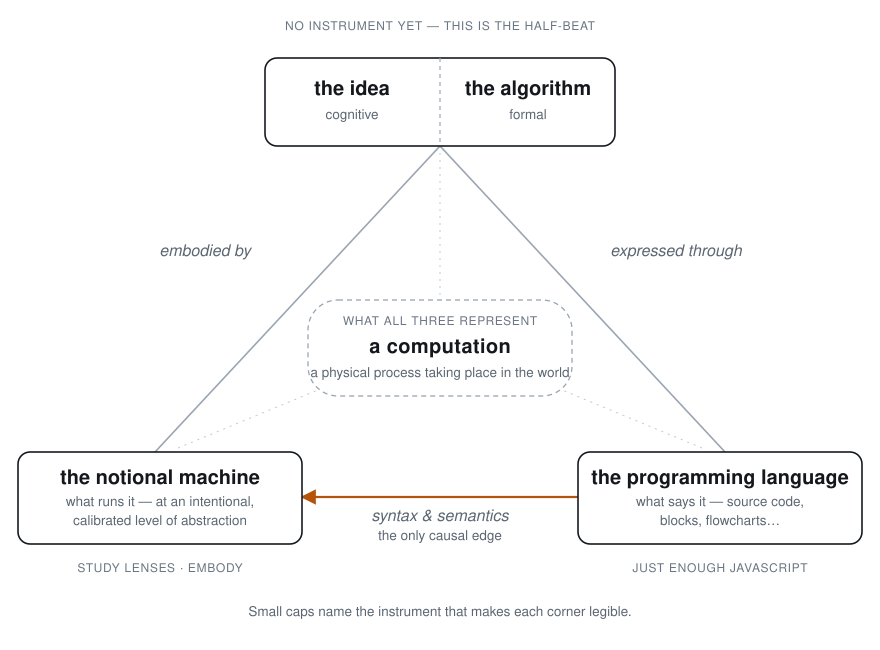

# Computational thinking — the thesis behind the course

> **What this directory is.** A self-standing argument about what computational
> thinking _is_, why it cannot be taught abstracted from a medium, and what that
> commits a curriculum to. It is written to hold on its own, before the
> _Frogramming & Vibetoading_ course is redrafted around it.
>
> **Audience.** Author-facing design memos, not learner-facing prose. Nothing
> here is written to be read by a student. Chapter 0 will eventually present a
> version of this argument; that drafting happens in the course, not here.
>
> **Direction of travel.** These documents cite F&V. F&V does not yet cite back.
> That is deliberate: the argument has to stand before the course is moved.

## The claim

> **Meaning, legibility, and notation are three separate additions to bare
> computation. Computational thinking requires all three — which is why it
> cannot be taught abstracted from a medium.**

And the reason to believe it rather than merely accept it: each addition already
names a commitment this course has made.

| Addition                                  | What supplies it                                     |
| ----------------------------------------- | ---------------------------------------------------- |
| a second system (meaning)                 | the domain — user-facing, text-manipulating programs |
| an observer with instruments (legibility) | Study Lenses · `embody`                              |
| a notation                                | Just Enough JavaScript                               |

The thesis is not a preamble to the curriculum. It is an account of why the
curriculum has the shape it already has.

## The picture

At the centre, a computation: a physical process taking place in the world.
Around it, three representations of that process — the **idea** a practitioner
holds (and its formal face, the **algorithm**), the **notional machine** at a
chosen level of abstraction, and the **programming language** that says it. Only
the last has causal influence, which is why one edge carries an arrow.

Two corners have instruments that make them legible. The third does not yet:
that gap is what the half-beat is for.

## Reading order

Written in dependency order. Each stands alone; each cites the others.

|     | Document                                                   | What it argues                                                                                          |
| --- | ---------------------------------------------------------- | ------------------------------------------------------------------------------------------------------- |
| 0   | [meaning.md](./meaning.md)                                 | "Meaningful" is two senses — semantic and rhetorical — deliberately homonymous, and never to be bridged |
| 1   | [thesis.md](./thesis.md)                                   | The definitional DAG, layer by layer, and the claim it establishes                                      |
| 2   | [observability.md](./observability.md)                     | Intervention and observability split apart, and the criterion that decides what a course can work at    |
| 3   | [computational-languages.md](./computational-languages.md) | The genus, algorithms as its second species, and what survives notation-relativity                      |
| 4   | [domain.md](./domain.md)                                   | Text as the domain, and the reply owed to Weintrop                                                      |
| 5   | [epicycles.md](./epicycles.md)                             | Learning-to-program → programming-to-learn as repeated half-beats                                       |
| 6   | [half-beat.md](./half-beat.md)                             | One drafted, one deliberately bad, and the gate item                                                    |
| 7   | [tie-ins.md](./tie-ins.md)                                 | Findings about F&V — a map, not a work order                                                            |

Start at 0 if you want the argument. Start at 7 if you are redrafting the
course. Start at 6 if you want to know whether any of this survives contact with
a chapter.

## What connects them

- **0 → 1.** The thesis defines "meaningful computation", and the title word is
  a deliberate pun. `meaning.md` comes first so the pun is declared before it is
  used.
- **1 → 2.** The thesis splits one condition into intervention (what makes
  computation meaningful) and observability (what makes it legible).
  `observability.md` develops the second, because it is the one the course runs
  on.
- **1 → 3.** The genus/species distinction is L3 of the DAG. Algorithms are the
  second species, which is what makes the genus visible at all.
- **3 → 4.** If the thoughts are notation-relative, the notation and the domain
  are both curriculum decisions rather than conveniences.
- **1, 2 → 5.** Computational thinking depends on legibility, and the curriculum
  has to supply it turn by turn. That is the epicycle.
- **5 → 6.** A general form nobody has drafted is untested. `half-beat.md` is
  the falsification instrument.
- **all → 7.** What follows for the existing course, recorded as findings.

## Provenance

- `plann.txt` — the original draft chain. Superseded by
  [thesis.md](./thesis.md); kept as the record of where the argument started.
- `from-a-job-application/` — the drafts that produced it, including the
  learning-to-read → reading-to-learn analogy and the four questions the thesis
  answers.
- `defining-computational-thinking-for-mathematics.weintrop-2015.pdf` — Weintrop
  et al., _J Sci Educ Technol_ (2016) 25:127–147, published online 8 Oct 2015.
  The paper the discipline-situatedness argument comes from, and the source of
  the sharpest objection to this course.

## Status of the sources

**Every non-repo citation in this directory is unfetched.** They are marked
`Owed:` at the point of use. Putnam, Searle, Chalmers, Woodward, Piccinini,
Grice, Hertz, Craik, Rosen, Wing, Papert, diSessa, du Boulay, Sorva, Stefik &
Siebert, Naur, METR, Lister, Salomon & Perkins, Denning — none has been read for
this campaign. Weintrop is the exception: it is in this directory and its
citations here were checked against the PDF.

Do not cite any of them in learner-facing material without fetching first. The
one place a claim of this kind was checked and found wrong — a page number that
did not reproduce — is why this note exists.

## Known gaps

- **`domain.md` owes an answer to _which community_.** Weintrop's argument is
  that computational thinking must be situated in a discipline whose real
  problems supply the assignments. Naming a technology surface and an audience
  posture is not yet naming a community.
- **The no-correlation finding is uncited**, and the whole learning-to-program →
  programming-to-learn architecture rests on it.
- **Type or token** — whether a computational language is the system or the
  utterance — is open, and Ch0 will need it settled.
- **Where CT sits in the spiderweb topology** is undecided.
- **Whether target systems are localizable** by partner communities, given the
  Reusability Paradox.
- **A C4 half-beat** is not drafted, which is what the teachability check below
  requires.

## How to check this directory

- **Cold-read `thesis.md` alone**, with no curriculum context. Does the argument
  carry?
- **Teachability check.** Hand `epicycles.md` and `half-beat.md` to a reader who
  has never seen F&V and ask them to draft the C4 half-beat. If they cannot, the
  set does not hold, however well the thesis reads.
- **External-citation check.** Every `Owed:` marker traced to a fetched source
  before it ships.
- **Definitional reachability.** From `frogramming-and-vibetoading/`, run
  `grep -rniE 'computational thinking|computational language|meaning|affordance|domain' --include='*.md' computational-thinking/`
  and read each hit against `thesis.md` and `meaning.md`. A hit **fails** if the
  term is used in a sense neither document defines and it is not marked as a
  quotation of F&V. Note `meaning` matches `meaningful`; `meaningful` alone does
  not match `meaning`.
- **Two-senses audit.** Every "meaning"/"meaningful" anchored to one named
  sense.
- **Tie-in re-verification.** Run each citation in `tie-ins.md`; do not read
  from notes.
- **Standing on its own.** A reader with no F&V exposure reads this file and the
  seven documents, and reports what the argument depends on that is not here.
