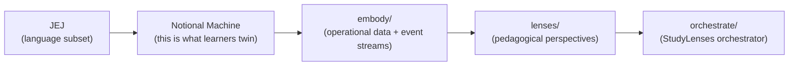
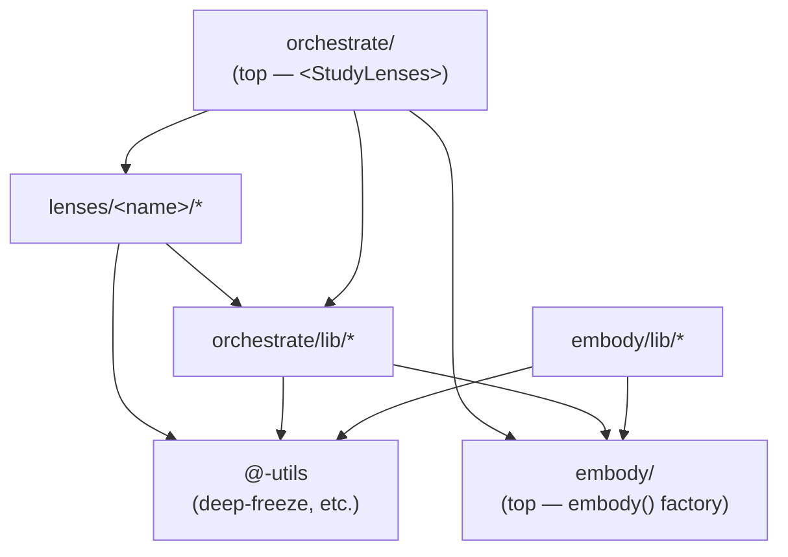
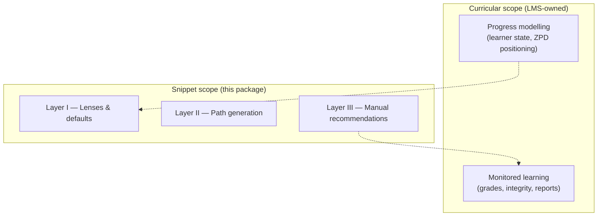
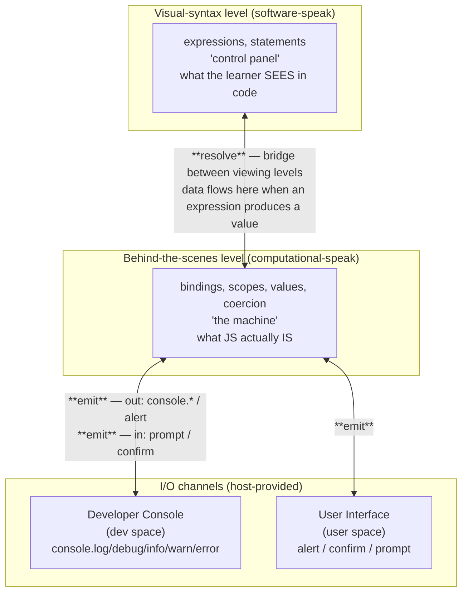
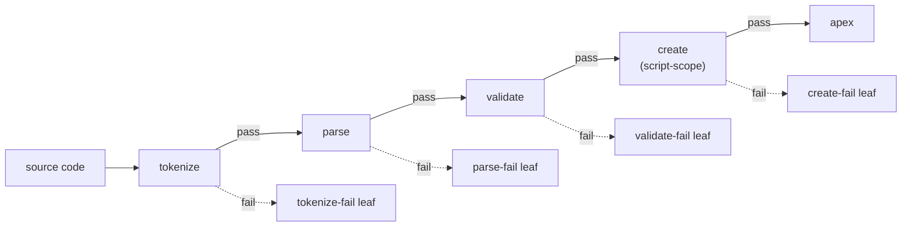

# Frogramming & Vibetoading: Affordance-Discovery Cycle(s) — Study Lenses Infrastructure

> **Purpose**: technical-reader companion to the curriculum. Explains the JEJ →
> NM → embody → lenses → orchestrator chain — the infrastructure beneath the
> pedagogy — and why each layer exists as it does.
>
> **Audience**: curriculum authors, contributors, researchers, study-lenses
> adopters in other host environments. _Not learners._ Learners encounter Study
> Lenses through doing, not through reading this file.
>
> **Companions** (siblings, by co-location):
>
> - `README.md` — top-of-document learner orientation
> - `ontology.md` — the concepts learners learn
> - `pedagogy.md` — design principles; carries the Explorotron framework (§7) +
>   lenses-as-F-pedagogy-infrastructure framing
> - `translational-framing.md` — V/F at the artifact layer (`lenses/embody` is F
>   at the artifact layer); coordinated Translational Sprints (the deeper
>   analysis lives there)
> - `metaphor.md` — the composer/virtuoso/mechanism metaphor; lenses are the
>   Frogrammer's "kit of magnifying glasses" 🔬
> - Source-code documentation: canonical technical contracts at
>   [`src/lib/study-lenses/README.md`](https://github.com/codeschoolinabox/spiralearn/blob/main/src/lib/study-lenses/README.md)
>   and the sibling `DOCS.md`, `notional-machine.md`, `embody/`, `lenses/`,
>   `orchestrate/` files
>
> **Status**: end-state document. Status / phase / hedging belongs in git
> history (commit log), not here.
>
> **Voice**: reference-neutral; un-prose-y. Tables, lists, mermaid only where
> relationships need it. Inherits the ontology's register, not narrative.md's
> discursive register.

---

## Contents

- [1. The pitch](#1-the-pitch)
- [2. The JEJ chain](#2-the-jej-chain)
- [3. JEJ — the language subset](#3-jej--the-language-subset)
- [4. The notional machine](#4-the-notional-machine)
- [5. `embody` — operational embodiment](#5-embody--operational-embodiment)
- [6. Study lenses — pedagogical perspectives](#6-study-lenses--pedagogical-perspectives)
- [7. The orchestrator — `<StudyLenses>`](#7-the-orchestrator--studylenses)
- [8. Pedagogical foundations (the Explorotron framework)](#8-pedagogical-foundations-the-explorotron-framework)
- [9. The 3D Block Model space](#9-the-3d-block-model-space)
- [10. V/F at the artifact layer](#10-vf-at-the-artifact-layer)
- [11. Lineage and inspiration](#11-lineage-and-inspiration)
- [12. References](#12-references)

---

## 1. The pitch

> _"Study code, not explanations."_ —
> [denepo.js.org/study-lenses](https://denepo.js.org/study-lenses)

Study Lenses is **an idea, not an implementation** — a design principle
adaptable across host environments (browser, IDE, static site, mobile). This
package is the browser embodiment for the F&V curriculum; other implementations
exist and more are possible.

The four-step reasoning framework (carries into §8 with the Explorotron
foundations):

1. Explicitly teach learners _how_ to study and understand code
2. Provide tools that support free code investigation
3. Write level-appropriate programs for learners to study
4. Let learners explore freely, with the author's study suggestions available as
   scaffolds

The design metaphor: **training wheels on a bike, not a tricycle.** Study Lenses
adds support layers _on top of_ a real development environment, not in place of
one. Lenses never change how the language or environment works — only what's
surfaced about them. Layers peel away as learners progress.

Implementations follow established CER practices: PRIMM
(Predict-Run-Investigate-Modify-Make), scaffolding, expertise reversal. The
architectural realization in this package implements Malaise & Signer (2023)'s
Explorotron framework at snippet scope (§8).

---

## 2. The JEJ chain

The infrastructure is one chain of five layers, each producing the next. Get the
NM right and embody / lenses / orchestrator follow. The package's directory
structure mirrors this chain.



| #   | Layer              | What it is                                                                                                                                                       | What it produces                                                                                                                                            | Where it lives                                                                                                                                                           |
| --- | ------------------ | ---------------------------------------------------------------------------------------------------------------------------------------------------------------- | ----------------------------------------------------------------------------------------------------------------------------------------------------------- | ------------------------------------------------------------------------------------------------------------------------------------------------------------------------ |
| 1   | **JEJ**            | The curated language subset learners write within                                                                                                                | Source code valid against the JEJ grammar                                                                                                                   | [`reference.md`](https://github.com/codeschoolinabox/spiralearn/blob/main/src/lib/study-lenses/embody/language-levels/just-enough-javascript/reference.md)               |
| 2   | **NM**             | The conceptual evaluation model JEJ programs run on — _what learners twin_                                                                                       | A bounded mental machine: scopes, bindings, values, coercion, control flow, two I/O channels (developer console + user dialogs)                             | [`notional-machine.md`](https://github.com/codeschoolinabox/spiralearn/blob/main/src/lib/study-lenses/embody/language-levels/just-enough-javascript/notional-machine.md) |
| 3   | **`embody/`**      | The operational embodiment of the NM — `embody(code)` turns a JEJ source string into a frozen-data + event-stream object whose every field maps to an NM concept | A `Snippet` value: source + parse + static analyses + validation + streams (callable generators per lifecycle phase)                                        | [`embody/`](https://github.com/codeschoolinabox/spiralearn/blob/main/src/lib/study-lenses/embody/)                                                                       |
| 4   | **`lenses/`**      | Pedagogical perspectives on the embodied NM — the Frogrammer's kit of magnifying glasses 🔬                                                                      | One self-contained "mini web app" per lens: takes `embodiment` + optional config; renders a learning exercise (annotate, blanks, parsons, trace-table, ...) | [`lenses/`](https://github.com/codeschoolinabox/spiralearn/blob/main/src/lib/study-lenses/lenses/)                                                                       |
| 5   | **`orchestrate/`** | The `<StudyLenses>` React component + recommender + analysis helpers; wires the chain together for the learner                                                   | The package's public surface — one component to mount; everything else internal                                                                             | [`orchestrate/`](https://github.com/codeschoolinabox/spiralearn/blob/main/src/lib/study-lenses/orchestrate/)                                                             |

Each layer's contract sits at the boundary between it and the next:

| Boundary                  | The contract                                                                                                                                                                                                            | Type-canonical at                             |
| ------------------------- | ----------------------------------------------------------------------------------------------------------------------------------------------------------------------------------------------------------------------- | --------------------------------------------- |
| **JEJ → NM**              | Every JEJ syntactic form has a defined NM step-category from the 10-element `StepCategory` enum (`expression`, `resolve`, `statement`, `scope`, `control-flow`, `initialization`, `for-init`, `write`, `emit`, `error`) | `notional-machine.md`                         |
| **NM → embody**           | Every NM concept maps to an `embody/types.ts` shape (e.g. `Scope`, `Binding`, `BindingStatus`, `Realm`, `RunInstance`, the `Event` flat union)                                                                          | `embody/types.ts`                             |
| **embody → lenses**       | Lenses receive a frozen `Snippet` (the canonical embodiment) via React props; never import from `embody/` directly                                                                                                      | `lenses/types.ts` (`LensProps`, `LensModule`) |
| **lenses → orchestrator** | Each lens module declares `name` + `Component` + `config()` + `applicableTo()` + `recommend()`; the orchestrator mounts and dispatches                                                                                  | `lenses/types.ts`                             |

**The chain's directionality is one-way** (per
[`DOCS.md` § Dependency rules](https://github.com/codeschoolinabox/spiralearn/blob/main/src/lib/study-lenses/DOCS.md)):



Lenses receive `embodiment` via React props from the orchestrator; they do not
reach into `embody/` themselves. The orchestrator is the only peer that touches
all three of `embody/`, `lenses/`, and analysis utilities.

**The LMS layer is OUT.** This package owns _snippet scope_ — one
`<StudyLenses>` instance, one snippet, the lenses applicable to it, the
recommender that ranks them. _Curricular scope_ — sequencing snippets, modeling
learner progress, cheating detection, grade reports — is the embedding LMS's
responsibility. The separation is per the Explorotron framework's pyramid (see
§8): the base (Progress modelling) and top (Monitored learning) belong to the
LMS; this package ships Layers I–III in between.



Sections §3–§7 walk the chain layer by layer. §8 names the academic framework
the architecture realizes (Explorotron). §9 names the recommender's organizing
space (3D Block Model). §10 names what V/F position the chain occupies relative
to the curriculum.

---

## 3. JEJ — the language subset

JEJ ("just-enough JavaScript") is _just enough_ JavaScript to write imperative
programs that interact with users through text and numbers. Every JEJ program
fits on a single printed page; the entire program is visible on screen at once,
traceable step-by-step.

The language level is designed around a deliberate balance: **meaningful
computational exploration** within a **manageable notional machine**. Adding
more operators and methods expands what learners can _compute_; adding more
language features expands what they have to _understand_. JEJ keeps the second
list short and the first list long.

**Few options, many possibilities.** The shape of every JEJ program: read input
→ perform computations → produce output.

| Tier                   | What's included                                                                                                                                                                                                                                                                              | What it costs the NM                                                       |
| ---------------------- | -------------------------------------------------------------------------------------------------------------------------------------------------------------------------------------------------------------------------------------------------------------------------------------------- | -------------------------------------------------------------------------- |
| Structural tools       | `let`, `const`; `if/else`, `switch`; `while`, `do-while`, `for`, `for-of`; `break`, `continue`; block scope                                                                                                                                                                                  | small, bounded                                                             |
| Computational toolkits | All String methods; all Math methods + constants; regex; number helpers; type conversion (`Number()`, `String()`, `Boolean()`); character encoding (`String.fromCharCode`, `String.fromCodePoint`); timestamps (`Date.now()`); date objects (`new Date()` — the sole `new` exception in JEJ) | nothing — all expressions resolve to values through the same NM mechanisms |

**What's excluded, and why.** Each excluded feature would add a new
notional-machine component that isn't needed for introductory programming:

| Excluded                     | NM component it would add                                                  |
| ---------------------------- | -------------------------------------------------------------------------- |
| User-defined functions       | Call stack depth, closures, function-declaration hoisting                  |
| Arrays / objects as literals | Heap allocation, reference vs value identity, mutation through references  |
| Classes                      | Prototype chains on user objects, constructor semantics, `this` binding    |
| `try`/`catch`                | Exception propagation model, branching control flow at error sites         |
| `async`/`await`              | Event loop, microtask queue, Promise state machine                         |
| `var`                        | Function-scoped hoisting (confusing alongside `let`/`const` block scoping) |
| Destructuring, spread/rest   | Pattern matching on data structures (needs arrays/objects)                 |

**JEJ is an upper bound.** It defines the _maximum_ syntax available to
learners; features beyond JEJ cannot be added. JEJ is the ceiling, not the floor
— each chapter exposes a curated subset.

Cross-link:
[`reference.md`](https://github.com/codeschoolinabox/spiralearn/blob/main/src/lib/study-lenses/embody/language-levels/just-enough-javascript/reference.md)
(learner-facing cheat sheet) and
[`README.md`](https://github.com/codeschoolinabox/spiralearn/blob/main/src/lib/study-lenses/README.md)
(package overview, including the rationale for each exclusion).

---

## 4. The notional machine

The **notional machine** (NM) is the conceptual evaluation model JEJ programs
run on. **Twinning the NM is the curriculum's L0 learning objective.** Every
concept in this section maps to a shape in `embody/types.ts` (§5) and ultimately
to data the lenses (§6) make visible.

**Code is the UI for the NM.** Source code is the _control panel_ through which
the programmer operates the NM. Authoring code is one way to operate that panel;
describing intent to an LLM is another. Either way, the NM is the thing the
panel controls — and it can also be observed directly through visual debuggers /
embody / lenses, bypassing the panel entirely. (Cross-reference `ontology.md`
§10 / §11 for the canonical curriculum treatment of this framing.)

**Two data boundaries** organize the NM. Data crosses them in defined
directions; both are V/F-shared territory.



- **Resolve** connects what the learner sees in code (V-friendly) to what the
  machine actually does (F-friendly). V reads the code; F traces the NM events;
  resolve is the bridge.
- **Emit** connects computation to interaction. V designs the user-facing
  dialog; F implements the call. Emit is where data crosses out of (or into) the
  program.

**Filtering only resolve events shows the complete data flow** through a program
— a load-bearing pedagogical view in lens authoring (the `trace.syntax` engine
in `embody/lib/evaluating/` produces these events directly).

**Two host-provided I/O channels:** Developer Console (`console.log`,
`console.debug`, `console.info`, `console.warn`, `console.error`,
`console.assert`) and User Interface (`alert`, `confirm`, `prompt`). JEJ
programs interact with users only through these — no DOM manipulation, no fetch,
no file I/O.

Cross-link to
[`notional-machine.md`](https://github.com/codeschoolinabox/spiralearn/blob/main/src/lib/study-lenses/embody/language-levels/just-enough-javascript/notional-machine.md)
for the full specification (every concept, every step category, every binding
state, every event kind).

---

## 5. `embody` — operational embodiment

`embody(code)` takes a JEJ source string and returns a frozen-data +
event-stream object — the snippet as the NM (§4) would treat it. Every field on
the returned `Snippet` corresponds to a concept named in `notional-machine.md`.
The mapping is dense: `Source` ↔ Phase 0 source code; `ParseGraph` /
`AugmentedToken` / `AugmentedASTNode` ↔ Phase 1 parse output; `Realm` /
`BuiltinBinding` ↔ realm setup; `InitialScope` / `Scope` / `Binding` /
`BindingStatus` ↔ scopes and binding lifecycle; `Event` (flat union) ↔ lifecycle
event categories; `RunInstance` ↔ one evaluation of a snippet.

**Substrate-is-not-inert.** This is where the framing lands: `embody`
crystallizes the dynamics of program evaluation into a static-but-4D structure
that makes all facets explorable. _"A static 4D rendering of a 3D flowing
river."_ Lenses don't show learners a model of how the NM works; they show
learners the actual data the NM produces.

**Load-bearing principles** at the embody surface:

- **Pure data, no methods.** Every embody surface is data — frozen objects,
  arrays, primitives. Generators are the only callable thing on a `Snippet`
  (event streams are inherently iterated). No `query()`, `dispose()`,
  `clone*()`, or accessor methods.
- **Strict immutability.** All public results deep-frozen.
- **Per-instance, no shared state.** No module-level cache. One `embody(code)`
  call knows nothing of others.
- **Spec-aligned, learner-named.** Field names follow the NM's learner-friendly
  vocabulary; spec correspondence is documented in `notional-machine.md` § Spec
  correspondence appendix.

**The construction staircase.** `embody()` runs four hard-gated phases. Each
phase either passes or fails; failure produces a distinct shape leaf with
downstream surfaces absent (no `streams.evaluate` for programs that won't run).



The shape catalog has five leaves total (four fail + apex). Lenses choose which
leaf they handle by gating on `embodiment.status.*` flags (see §6 Tier table).

**Three evaluation engines.** Lifecycle phase 4 — actually running the code —
has three different isolation models, each serving a different pedagogical
purpose.

| Engine          | Isolation                                                                                  | What it returns                                                                        | Use it for                                              |
| --------------- | ------------------------------------------------------------------------------------------ | -------------------------------------------------------------------------------------- | ------------------------------------------------------- |
| **`run`**       | Web Worker; no traps                                                                       | End report only (`{ok, error?, rejections?}`)                                          | "Did it work?" — cheap, no event stream                 |
| **`intercept`** | Web Worker + `console.*` / `alert` / `confirm` / `prompt` trapped; SAB for synchronous I/O | Event stream (I/O + errors) + end report                                               | Capturing observable behavior                           |
| **`trace`**     | Web Worker + Aran AST instrumentation; SAB pause between events                            | Event stream at NM-step granularity (two flavors: `syntax` / `semantics`) + end report | Step-by-step visualization, predict-then-compare lenses |

A separate `debug` mode uses an iframe + `debugger` statements for DevTools
step-through; it is a distinct isolation model from the three worker engines.

Cross-link to
[`embody/README.md`](https://github.com/codeschoolinabox/spiralearn/blob/main/src/lib/study-lenses/embody/README.md)
(orientation, named scenarios, NM-concept-to-type table) and
[`embody/DOCS.md`](https://github.com/codeschoolinabox/spiralearn/blob/main/src/lib/study-lenses/embody/DOCS.md)
(architecture decisions, data flow, the five-leaf shape catalog specification,
open contract holes).

---

## 6. Study lenses — pedagogical perspectives

A **lens** is a stateful "mini web app" plugin. It takes a frozen `embodiment`
(§5) plus an optional `LensConfig` as React props and renders a learning
exercise. Each lens absorbs its own pedagogical intervention end-to-end:
parsons-style line shuffling, blanks-style hiding, bug-injection — all live
inside the relevant lens, not in a separate transforms tier.

**Three-tier classification** based on what each lens needs from the embodiment.
Tier corresponds to which `status` flag a lens checks before reaching for
content; the monotonic chain (`created` implies `validated` implies `parsed`
implies `tokenized`) means lens-author logic only checks the field it cares
about.

| Tier | What it needs                          | `applicableTo` returns      | Example lenses                                      |
| ---- | -------------------------------------- | --------------------------- | --------------------------------------------------- |
| 1    | Text only — no parse needed            | always `true`               | `parsons` (line shuffling), `copy-type`, `annotate` |
| 2    | Valid AST (no execution required)      | `embodiment.status.parsed`  | `blanks`, variables/scope, ask                      |
| 3    | Valid parse AND evaluable script-scope | `embodiment.status.created` | `trace-table`, `run`                                |

A Tier-2 lens that _also_ wants JEJ-subset compliance gates on
`embodiment.status.validated` (which sits between `parsed` and `created` in the
chain). See
[`lenses/README.md`](https://github.com/codeschoolinabox/spiralearn/blob/main/src/lib/study-lenses/lenses/README.md)
for the `validated`-as-gate-vs-metadata nuance.

**The lens roster is open by construction.** New lenses ship by satisfying the
`LensModule` contract — `name` + React `Component` + `config()` +
`applicableTo()` + `recommend()` — and dropping into `lenses/<name>/`. No
changes to embody, orchestrate, or this document required.

| Lens          | Tier                                                     | What it does                                                                                             |
| ------------- | -------------------------------------------------------- | -------------------------------------------------------------------------------------------------------- |
| `editor`      | (home base, not a lens — lives in `orchestrate/editor/`) | The always-present surface where the learner types. The only writer of snippet state.                    |
| `annotate`    | 1                                                        | Read-only annotated code view                                                                            |
| `parsons`     | 1                                                        | Drag-and-drop line ordering                                                                              |
| `blanks`      | 2                                                        | Fill-in-the-blank exercise                                                                               |
| `trace-table` | 3                                                        | Split view — code + manual trace table + check button; predictions validated against tracer ground truth |
| `debug-props` | 1                                                        | Meta-lens: renders received `LensProps` as panels (sandbox-harness verification)                         |

**Lens-authoring convention.** Each lens is a **two-layer module**:

```text
lenses/<name>/
  index.tsx       light React wrapper — exports the LensModule
  core.ts         pure-TS core — display derivation, validation, scoring
  config.ts / types.ts
  tests/
    core.test.ts          vitest, no jsdom
    component.test.tsx    vitest + jsdom + @testing-library/react
```

The split keeps the core's tests fast (no DOM stub) and makes the React boundary
explicit. **Lens purity rules**: lenses MUST NOT import runtime values from
`embody/` (top) or `orchestrate/` (top); they receive `embodiment` via props.
Type-only imports from `embody/types.ts` are fine. May also import from
`orchestrate/lib/*` (analysis utilities).

**Lenses are read-only views.** The single-writer state model (§7) is
load-bearing: lenses cannot mutate snippet state. When the snippet changes,
React unmounts the lens; in-progress UI state is gone. This is **disposable
practice** — never reach for `localStorage`, refs across mounts, or other
persistence. Cross-edit state belongs to the embedding LMS.

Cross-link to
[`lenses/README.md`](https://github.com/codeschoolinabox/spiralearn/blob/main/src/lib/study-lenses/lenses/README.md)
and
[`lenses/DOCS.md`](https://github.com/codeschoolinabox/spiralearn/blob/main/src/lib/study-lenses/lenses/DOCS.md)
for the full `LensModule` contract and the dependency rules.

---

## 7. The orchestrator — `<StudyLenses>`

The package's public API is one React component. Curriculum authors embed it in
code fences; the Docusaurus plugin emits the props.

```tsx
// Minimal — learner gets the editor home base, can pick any lens.
<StudyLenses snippet="let x = 5; console.log(x + 1);" />

// Curated default-mount lens (Q-III seam).
<StudyLenses snippet={X} lens="trace" />

// With per-lens config cascade (from per-fence info-string +
// directory lenses.json).
<StudyLenses
  snippet={X}
  lens="parsons"
  configs={{ lenses: { parsons: { difficulty: 'easy' } } }}
/>
```

**Three props:**

- **`snippet`** — code string. Initial-value-only; the orchestrator seeds an
  internal `useState(snippet)` on first render and is the sole writer of snippet
  state thereafter. Callers swap snippets by remounting via React `key={…}`.
- **`lens`** — optional default-mount lens name. Populated upstream by the
  plugin from per-fence info-string `:suffix` (e.g. `js:trace?stepDelay=500`),
  frontmatter, or sibling `@study-lens` directive.
- **`configs`** — opaque cascade passthrough. The whole resolved `lenses.json`
  directory walk + per-fence URL-style queries + sibling `@study-lens` directive
  JSON overrides, all deep-merged into `configs.lenses[lens]` at plugin-emission
  time.

The orchestrator builds the embodiment internally — callers do NOT pre-build.
The locked contract is canonical at
[`orchestrate/README.md`](https://github.com/codeschoolinabox/spiralearn/blob/main/src/lib/study-lenses/orchestrate/README.md)
and
[`orchestrate/DOCS.md`](https://github.com/codeschoolinabox/spiralearn/blob/main/src/lib/study-lenses/orchestrate/DOCS.md).
This section is a curriculum-facing summary; that file IS the public-API spec.

**Single-writer state model**: only the editor mutates snippet state. Lenses are
read-only views. Re-embody happens once per edit cycle; the orchestrator
distributes the fresh embodiment to mounted lenses via props. No reconciliation
between competing mutators.

**Editor-vs-lens state machine**: the UI is in exactly one of two modes at a
time — editor mode (the home base is mounted; the textarea is the source of
truth for `snippet`) or lens mode (a lens is active with a frozen `embodiment`;
the snippet is read-only). Mode transitions are driven by the `lens` prop today;
a toolbar picker will land in a later increment.

**The recommender** lives inside orchestrate, not as a separate peer. It is an
_applicability filter + ranking engine_ — given an embodiment and a roster of
lens plugins, it runs applicability gates and ranks by snippet-fit, returning
recommended lenses. **No learner state.** ZPD-targeting at the curricular scope
is the embedding LMS's job; the recommender never sees who the learner is. The
recommender's organizing space is the 3D Block Model — see §9.

**Two scopes** the Explorotron framework operates at — **snippet scope** (one
`<StudyLenses>` instance; this package owns it) and **curricular scope** (the
embedding LMS arranges instances). The LMS owns curricular scope; this package
never reaches above the snippet boundary.

Cross-link to
[`orchestrate/README.md`](https://github.com/codeschoolinabox/spiralearn/blob/main/src/lib/study-lenses/orchestrate/README.md)
and
[`orchestrate/DOCS.md`](https://github.com/codeschoolinabox/spiralearn/blob/main/src/lib/study-lenses/orchestrate/DOCS.md).

---

## 8. Pedagogical foundations (the Explorotron framework)

The architecture implements **Malaise & Signer (2023)**, _Explorotron: An IDE
Extension for Guided and Independent Code Exploration and Learning_ (Proc. Koli
Calling '23). The framework has two axes (curated/uncurated × guided/unguided →
four quadrants) and a layered pyramid (progress modelling at the base; monitored
learning at the top).

**The four quadrants** at snippet scope:

|              | **Uncurated**                                                       | **Curated**                                                |
| ------------ | ------------------------------------------------------------------- | ---------------------------------------------------------- |
| **Unguided** | Q1 — learner pastes any snippet; default-fit ranked recommendations | Q3 — author renders `<StudyLenses lens="…">`               |
| **Guided**   | Q2 — auto-generated path through recommended lenses                 | Q4 — full curated sequence (LMS-owned at curricular scope) |

**The pyramid** (base → top):

1. Progress modelling — _LMS-owned_
2. Lenses & defaults — `<StudyLenses>` Layer I (this package)
3. Path generation (auto-recommender) — Layer II
4. Manual recommendations (`lens` prop + cascade) — Layer III
5. Manually crafted paths — _Q-IV at snippet scope deferred_
6. Monitored learning — _LMS-owned_

The deeper treatment — the three load-bearing paper principles (skill transfer /
expertise reversal / lifelong-learning autonomy) and Begel & Ko (2019)'s
"both-yes" answer to _structure-learning-for vs. teach-learners-to-structure_ —
lives canonically in `pedagogy.md` §7. This section names the framework and
points there.

---

## 9. The 3D Block Model space

The orchestrator's recommender (§7) is organized by a three-dimensional space.
Schulte (2008)'s Block Model of Program Comprehension extends to three
dimensions here:

- **Level** — text surface → program execution → function/purpose
- **Scope** — atoms → blocks → relations → macro
- **NM components** — 10 step-categories from the syntax tracer's `StepCategory`
  enum (`expression`, `resolve`, `statement`, `scope`, `control-flow`,
  `initialization`, `for-init`, `write`, `emit`, `error`)

The third axis is **unordered** by deliberate design — NM components don't
compose into a single learning progression. A snippet with
`expression + resolve` isn't "earlier" than one with `scope + control-flow`;
they're different teaching opportunities. The spiral comes from (a) lens-config
variation across snippets and (b) curriculum-author-imposed ordering of
category-filtered recommendations, chosen pedagogically rather than enforced by
the NM model.

The `RecommendationGrid` folds the three dimensions into one structure; each
cell is populated only where snippet × available lenses intersect. A short
snippet with no loops won't have trace-table options; a literal-only snippet
won't have variables-lens options.

---

## 10. V/F at the artifact layer

The student-layer / artifact-layer distinction from ontology §4 lands here:

- **`lenses/embody` is F at the artifact layer** — engineering /
  technical-affordances side. Theory-neutral infrastructure that makes the NM's
  behind-the-scenes legible. Serves multiple pedagogies precisely because it's
  NM-grounded rather than user-experience-opinionated.
- **The curriculum is V at the artifact layer** — experiential side. Design
  thinking about the learner's experience of learning; opinionated content
  authored to shape what the learner encounters.

The two operate as **coordinated Translational Sprints** — two TCER artifacts
mutually constituting each other. This is the **engineering × physics
co-evolution** (Bakhtiar Mikhak) operating at the artifact layer.

The deeper analysis — including the Faraday/Maxwell-style mutual constitution,
the trading-zone reading, and the V/F symmetry recurring at the artifact scale —
lives canonically in `translational-framing.md` §6 (Tool-Theory Co-evolution)
and §7 (V/F at the artifact layer). This section names the structural claim and
points there; the cross-reference is load-bearing for the curriculum's TCER
positioning.

---

## 11. Lineage and inspiration

The intellectual lineage of Study Lenses. Entries split into two registers:
**canonical here** (entries with no other home in the curriculum's file family —
this file is their first canonical mention) and **pointers** (entries canonical
elsewhere; brief acknowledgment + see-X).

**Canonical here:**

- **Side-by-Side / Blocks to Text**. A distant ancestor learning environment;
  students compare side-by-side with Python text; PRIMM-flavored exercises;
  Python Tutor as the runtime-NM view. The trail that led to Study Lenses.
- **DeNepo** ([github.com/DeNepo](https://github.com/DeNepo); home page
  `denepo.js.org`). The host organization — _means of instruction_: tools,
  guides, materials for computing education designed to empower learners and
  educators. Other DeNepo projects include `as Code / Content`, Micromaterials,
  Curriculum Packaging, Corpus Analysis.
- **Aran** ([github.com/lachrist/aran](https://github.com/lachrist/aran)). The
  JavaScript AST instrumentation library that powers the `trace` evaluation
  engine — turns expression evaluation, scope walks, and control-flow steps into
  observable events.

**Pointers (canonical elsewhere):**

- **Bret Victor — Learnable Programming** (2012). Victor wanted _less
  implementation toil_ AND _more powerful thinking tools_. Study Lenses reclaims
  the visibility wish at the **internal mechanism** of evaluation, not the final
  output. _Canonical: ontology §12._
- **Bakhtiar Mikhak — "Building infrastructure IS research contribution."** The
  teaching that grounds V/F at the artifact layer; the engineering × physics
  co-evolution insight. _Canonical: translational-framing.md §6 and §10 of this
  file._
- **Malaise & Signer (2023) — Explorotron**. The academic framework
  `<StudyLenses>` realizes at snippet scope. _Canonical: pedagogy.md §7 and §8
  of this file._

---

## 12. References

**Source-code documentation chain** (canonical technical contracts):

- [`study-lenses/README.md`](https://github.com/codeschoolinabox/spiralearn/blob/main/src/lib/study-lenses/README.md)
  — package overview, Pedagogical first principles
- [`study-lenses/DOCS.md`](https://github.com/codeschoolinabox/spiralearn/blob/main/src/lib/study-lenses/DOCS.md)
  — architecture decisions
- [`study-lenses/notional-machine.md`](https://github.com/codeschoolinabox/spiralearn/blob/main/src/lib/study-lenses/embody/language-levels/just-enough-javascript/notional-machine.md)
  — NM specification
- [`embody/README.md`](https://github.com/codeschoolinabox/spiralearn/blob/main/src/lib/study-lenses/embody/README.md)
  and
  [`embody/DOCS.md`](https://github.com/codeschoolinabox/spiralearn/blob/main/src/lib/study-lenses/embody/DOCS.md)
  — embody architecture, types
- [`lenses/README.md`](https://github.com/codeschoolinabox/spiralearn/blob/main/src/lib/study-lenses/lenses/README.md)
  — lens module contract
- [`orchestrate/README.md`](https://github.com/codeschoolinabox/spiralearn/blob/main/src/lib/study-lenses/orchestrate/README.md)
  and
  [`orchestrate/DOCS.md`](https://github.com/codeschoolinabox/spiralearn/blob/main/src/lib/study-lenses/orchestrate/DOCS.md)
  — orchestrator, state machine

**External pointers:**

- **denepo.js.org/study-lenses** — the project's home page
- **Notes-pages trail** at `0---the-big-idea/00--evancole-be/0--notes/pages/`:
  `Study Lenses.md`, `De Nepo.md`, `Side-by-Side.md`, `Aran.md`,
  `Module___Welcome to JS.md`

**Academic citations:**

- **Malaise, Y., & Signer, B.** (2023). _Explorotron: An IDE Extension for
  Guided and Independent Code Exploration and Learning._ Proc. of Koli Calling
  '23.
- **Schulte, C.** (2008). Block Model — an Educational Model of Program
  Comprehension as a Tool for a Scholarly Approach to Teaching.
- **Cole, E., Malaise, Y., & Signer, B.** (2023). _Computing Education Research
  as a Translational Transdiscipline._ SIGCSE 2023.
- **Begel, A., & Ko, A. J.** (2019). On structuring learning environments for
  learners.
- **Chiaburu, D. S., & Marinova, S. V.** (2005). _Skill transfer._
- **Sweller, J., et al.** (2003). _Expertise reversal effect._

**Cross-document anchors:**

- `ontology.md` — concepts learners learn (V/F, twinning, NM, layers, strands)
- `pedagogy.md` §7 — Explorotron framework canonical treatment
- `translational-framing.md` §6–§7 — V/F at the artifact layer + Tool-Theory
  Co-evolution canonical treatment
- `metaphor.md` — composer/virtuoso/mechanism metaphor (lenses as the
  Frogrammer's "kit of magnifying glasses")
