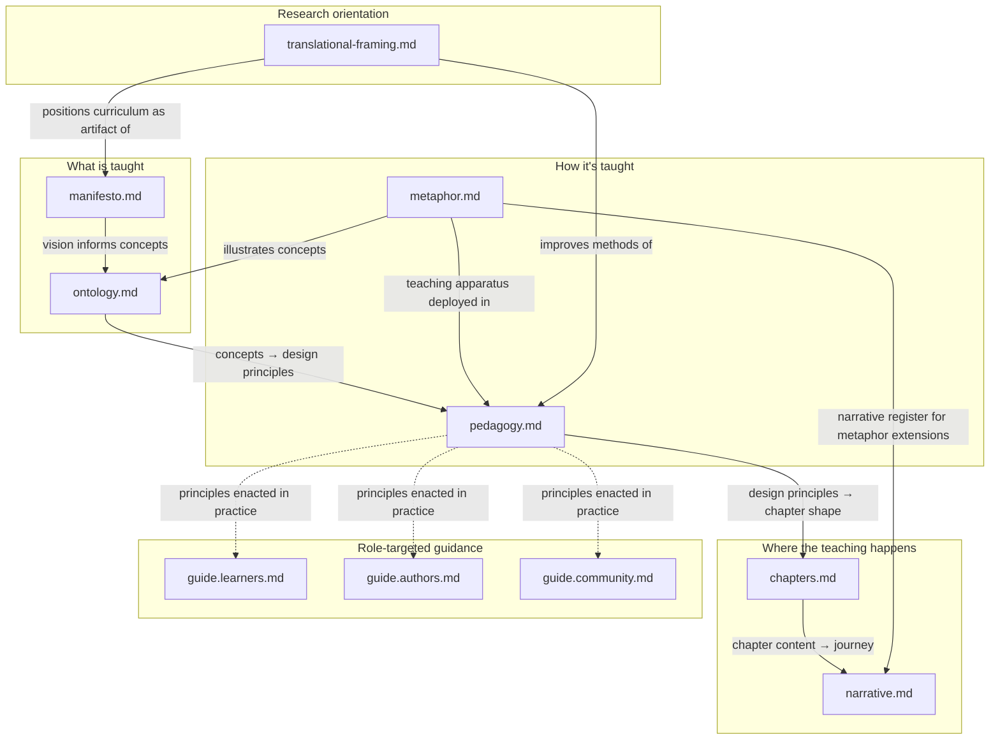

<!-- markdownlint-disable MD051 -->

# 🐸 Frogramming & Vibetoading: Affordance-Discovery Cycle(s) — Syllabus {#welcome-to-frogramming---syllabus}

> The best authors and the best JavaScript developers are those who obsess about
> language, who explore and experiment with language every day and in doing so
> develop their own style, their own idioms, and their own expression.
>
> — [Angus Croll](https://anguscroll.com/),
> [If Hemingway Wrote JavaScript](https://anguscroll.com/hemingway/)

## TL;DR

**Frogramming & Vibetoading: Affordance-Discovery Cycle(s)** is a self-paced
course that will take you from _learning to program_ (building your code
literacy) to _programming to learn_ (applying your literacy to explore new
concepts and skills). Underneath the JavaScript, what it teaches is the
**affordance-discovery cycle** — the turn-taking rhythm by which software gets
made: someone proposes an experience worth having; someone discovers what the
machine affords that can realize it; and each turn reshapes the next. JavaScript
is the medium; the cycle is the subject — the most transferable,
career-preparing skill this course can give you in an ever-changing tech
landscape. Each step of the way you will ground your skills in the world around
you, learning to consider who you're building for and what you hope to achieve.
Ultimately you will build the confidence to write your own programs, and the
awareness to write the _right_ programs.

---

This course treats programming as collaborative communication. A single piece of
source code addresses multiple audiences at once (other developers, the
computer, users, and AI agents). You will develop the ability to recognize who
your code is for, understand how each audience experiences it, and tailor your
decisions so your code does exactly what you designed it to do for each of them.

The cycle has two hands, and this course names them in its title. The
**Vibetoading** hand twins the _user_: it proposes an experience worth having
("when the user clicks, greet them by name…"). The **Frogramming** hand twins
the _notional machine_: it discovers the affordance that realizes the proposal
and verifies — by prediction, not hope — that the machine really does what was
asked. V proposes; F discovers and verifies. LLMs have made the proposing hand
feel effortless: anyone can describe the user-visible behavior they want and get
working software without worrying about how the computer works behind the
scenes, and that is genuinely powerful for quick prototypes and new projects.
But building larger systems, extending existing codebases, evaluating whether
generated code actually does what you need, and making the design judgments that
shape what gets built in the first place — the discovering-and-verifying hand —
is exactly the half that generative AI cannot replace and threatens to atrophy.
This course builds it at full depth.

That depth has a concrete form: **predictive mastery of JavaScript's notional
machine**. You will read code before writing it, correlate syntax to the runtime
events it produces, and move through the PRIMM progression (predict, run,
investigate, modify, make) until prediction is reliable and authorship is
confident. Predictive mastery is the F-hand's substance: it is what lets you
verify with your own head instead of hoping on someone else's word — human or
machine.

Languages and frameworks churn; the cycle transfers. Once you can twin one
machine — hold a predictive model of it and interrogate it with small
experiments — you know how to twin the next one, whatever its syntax. The
discipline you build here on a deliberately small slice of JavaScript carries to
every language and every tool you will meet after it.

The skills on the V-hand are fundamentally human: communication, empathy,
user-centered design thinking, the ability to hold a complex situation in view
and make it work for real people. Understanding users so you can build software
that actually serves them is, ultimately, what all the technical skill is for.
Those same human skills are exactly what keep you professionally relevant and
personally capable in a world where machines handle more of the writing. **An
LLM can do many things FOR you. It cannot UNDERSTAND for you. This curriculum is
built around that fact.** And it cannot run the cycle for you: it can accelerate
either hand, but the proposing, the observing, and the judgment that closes each
turn stay yours.

Two commitments, then. The **cycle** is this course's transferable-value claim:
master it here and it goes with you everywhere. **F-hand predictive mastery** is
its non-delegable-survival claim: built at depth, because it is the half no one
and nothing can hold for you. Both **Frogramming** and deliberate
**Vibetoading** also have value beyond productivity: for the satisfaction of
understanding a system deeply, for the new ways of thinking it opens up, and for
the small programs you write just to explore, experiment, or surprise yourself.
This course helps you build both at once.

The five chapters follow the phases of mastering the cycle: **name** it,
**live** it F-hand, **live** it V-hand, **concretize and accelerate** it,
**practice** it for life. All of source code's audiences — developers, the
computer, users, and agents — are introduced together in Chapter 0⟡ and each is
deepened in the phase that needs it.

- **Chapter 0⟡. What is Programming?** Conceptual orientation before you write
  any code — comprehension comes before production, and here that means
  predict-and-run only. You learn to see source code as communication that
  simultaneously addresses multiple audiences, and you meet them all as runnable
  boundary primitives: `console.log` speaks to developers, `prompt`/`alert`/
  `confirm` speak to users, one small program addressing both channels in a
  single run. You meet a program as both source text and running process, hear
  why **future-you** is a stranger worth writing for, and live one tiny
  affordance-discovery cycle — predict, run, observe — that the whole course
  spirals on. Two cliffhangers are set that only later chapters can cash.
- **Chapter 1⟡. Frogramming.** Living the cycle on the F-hand: computational
  thinking as one continuous chain of affordance discoveries. You build an
  accurate mental model of JavaScript's notional machine (how it evaluates
  expressions, stores values, walks scope chains) and the discipline of
  predicting **internal events** before running code, then verifying with trace
  tables, the debugger, and tests that mature every cycle. The chain runs on
  arithmetic-free string programs first — bindings, transformations,
  string-based conditionals — then loops with numbers as counters, with coercion
  and validation late and isolated. Comments, naming, and logging enter along
  the chain as craft: intentional communication to other developers, including
  future-you. Every cycle cashes out into new user-facing behavior — this is
  where your first _writing_ happens — and seeds the next.
- **Chapter 2⟡. Vibetoading.** Living the cycle on the V-hand: design thinking
  with the same rigor. You propose experiences, build cheap text-dialog
  prototypes in Just Enough JavaScript, commit **interaction-event predictions**
  in writing (what will they do first? where will they hesitate, misread,
  backtrack?), then observe real behavior and study the divergence — because
  task-success is not twin-validity: a user can complete your task while holding
  a wrong model of your interface. User-visible behavior becomes the anchor your
  reading, tracing, refactoring, and reviewing skills must preserve. Real people
  (peers, friends) are the richest observation whenever you can get them;
  **local-LLM simulated users** — interview subjects, walkthrough participants,
  stand-in testers — make every cycle runnable on demand, alone. They are a
  fallibly thin imitation of a human, and feeling that thinness is itself a
  lesson the next chapter picks up.
- **Chapter 3⟡. Co-AIthoring.** You have run the cycle by hand in both
  directions; this chapter names the whole thing — then accelerates it. Source
  code is the **UI** — the control panel through which a programmer operates the
  notional machine. LLMs are an alternative way to operate that UI: you delegate
  the typing while still owning the NM. Two conversational modes fall out of
  this naturally — **NM-grounded** (Frogramming-with-delegation: "make the NM
  declare a `const`, then enter a loop…") and **user-grounded**
  (Vibetoading-with-delegation: "when the user clicks, greet them by name…").
  Same Frogrammer/Vibetoader spectrum, different interface. Visual debuggers /
  embody / lenses are the _direct_ NM view that complements the code text —
  letting you observe and predict the machine even when you didn't write the
  code yourself. The LLM itself turns out to be a **new beast** — neither user
  nor machine — that needs its own twinning: you learn what makes LLM
  collaboration specifically different from human collaboration, develop skills
  for evaluating and directing LLM output using everything from Chapters 0⟡–2⟡,
  and build calibration for when to delegate and when to do the work yourself.
  **AI accelerates the cycle; it cannot run it for you.**
- **Chapter 4⟡. Snippetry.** The cycle as a practice for life. Training wheels
  come off. You Frogram for yourself through snippetry: small, complete,
  self-contained programs as an ongoing practice in which each snippet is one
  honest turn of the cycle, paradigms are affordance-territory to explore, and
  remixing is running the cycle cooperatively. You explore JavaScript's full
  multi-paradigmatic range, develop your compositional voice, and discover that
  Frogramming and Vibetoading have value beyond productivity: for mastery,
  exploration, delight, the steady upkeep of one's craft, and the new thoughts
  they let you think.

---

## Contents

- [What to Expect](#what-to-expect)
- [Why Learn to Frogram](#why-learn-to-frogram)
  - [What programming languages are](#what-programming-languages-are)
  - [Notional machines](#notional-machines)
  - [Your instrument: JavaScript, and your practice instrument: Just Enough JavaScript](#your-instrument-javascript-and-your-practice-instrument-just-enough-javascript)
  - [What this course builds in you — the five strands](#what-this-course-builds-in-you--the-five-strands)
  - [Snippetry](#snippetry)
- [The Metaphor: Composer, Virtuoso, Instrument and Audience](#the-metaphor-composer-virtuoso-instrument-and-audience)
- [References](#references)
- [Symbology](#symbology)
- [Reading map: where to go for more depth](#reading-map-where-to-go-for-more-depth)
- [Before You Begin](#before-you-begin)

> **Chapter bodies and learning objectives live in
> [`chapters.md`](./chapters.md).** The TL;DR chapter bullets above are the
> syllabus-level chapter coverage; the full per-chapter content (Overview,
> Ch0⟡'s numbered sections, Ch1⟡'s cycle chain C0–C6, Ch2⟡'s V-cycles V1–V5,
> Ch3⟡'s and Ch4⟡'s named sections, and the per-layer LO contracts) is in the
> companion file.

---

## What to Expect

**An LLM can do many things FOR you. It cannot UNDERSTAND for you.**
Understanding lives in your head, not the model's. An LLM can write code,
explain a concept, simulate a teacher. It can produce excellent surface-level
descriptions of how a machine works, what a user wants, what your collaborators
expect, what your software does in the world. What it cannot do is build any of
those understandings in your head. The understandings this course develops — of
the JavaScript machine, of users, of your fellow developers, of the LLM itself
as a collaborator, of your code's place in larger systems — are non-delegable.
They live in your head, or they don't live. You can outsource production. You
cannot outsource comprehension.

Human learning doesn't come from understanding explanations, even excellent
ones. It happens through pedagogically-designed _experiences_: prediction that
commits you to a model, surprise when the model breaks, careful sequencing so
wrong models don't install in the first place, repetition that automates what
was once deliberate, narrative that holds attention across difficult passages,
metaphors used carefully and kept honest about where they break. Metaphors
specifically deserve caution. A metaphor at the right level of abstraction —
within your zone of proximal development, neither too far below your current
understanding nor too far above — is a scaffold. A slightly wrong metaphor
_installs_ a misconception, often invisibly, often expensive to remove later.
Multiple metaphors used in the same course have to be aligned and
non-contradictory or they undermine each other. An explanation — including a
metaphorical one — is someone else's (or your own past self's) **crystallization
of an experience already undergone**. The change happens IN you, through
experiences only you can have.

Here's the empowering version of this picture. What we call _expertise_ is, in
large part, a library of past experiences automated through repetition.
Cognitive scientists call this _automaticity_. An expert reaches good solutions
instinctually because behind the scenes they're drawing on hundreds of
predict-fail-correct cycles that have been compiled into reflex. A capable
novice can find the same solutions, but slowly — through deliberate exploration
— because they haven't accumulated those automations yet. Expertise isn't a
different kind of mind; it's the same mind with more experience, automated. This
is learnable, which is the whole point. It's also why expertise matters more,
not less, when collaborating with LLMs: working productively with an alien mind
requires an automated library of your own experiences to compare against, to
calibrate from, and to check the LLM's output against. A learner without that
library can't tell when the LLM is right, when it's wrong, or when it's
confidently misleading them. The library is what lets you direct the alien
instead of being directed by it.

Two methodologies in this curriculum illustrate the principle in operation.
**Fine-grained NM prediction-and-verification** — predict the chain of internal
events the machine will produce, observe what it actually produces, correct your
model when they diverge — is how the 🔬 Frogrammer builds the twin of the
machine. (At professional scale this same methodology can manifest as code
tests: predictions about behavior, automated against actual behavior, with the
divergence as the signal.) **The design thinking process** — form hypotheses
about what users need, do, and feel; prototype; observe real people encountering
the prototype; correct your model when they diverge — is how the 🎨 Vibetoader
builds the twin of users. The cycles run at different timescales — microseconds
of internal-events for the machine twin, weeks of user contact for the user twin
— but the structure is the same: predict, encounter, update. Two domains, two
hats, two non-delegable practices. An LLM could narrate every step of either
methodology. It cannot have the cycle _for_ you, in either domain. The cycle is
the experience, and the experience is what builds the twin, and the twin _is_
understanding.

### Programming is collaborative communication

**Programming is collaborative communication.** A single piece of source code
simultaneously addresses multiple audiences: other developers who read it, a
computer that evaluates it, users who experience it, and agents who collaborate
on it. This course guides you from your first comment to fluent collaboration
with AI agents, using the smallest possible set of language features. It is
self-study: no time estimates, no deadlines. Go at your own pace.

**Vibetoading vs. Frogramming.** Every programming language describes a
_notional machine_ — an imaginary model of how the computer carries out your
instructions. Whether you're writing the code yourself or directing an LLM (or a
human!) to write it for you, you can work two ways:

- **🎨 The Vibetoader** works grounded in the user. They build a deep user-twin
  through research, prototyping, and testing with real people, and intentionally
  delegate the notional machine to an LLM, a collaborator, or familiar tools.
- **🔬 The Frogrammer** works grounded in the notional machine. They build a
  deep NM-twin through prediction, tracing, and verification, and may delegate
  or do-at-lighter-touch user-research.

Neither hat is better, and they're not a binary — Vibetoading and Frogramming
are a spectrum, and most developers wear different hats on different tasks,
different files, different moments. Vibetoading shines for user-facing
prototyping, ideation grounded in real people's needs, low-stakes work where the
NM can be safely delegated, and giving domain experts the power to solve their
own problems. Frogramming is what holds up under stakes that the NM-twin makes
visible: production code, security-sensitive systems, anything multi-person or
long-lived. This course teaches you to wear both hats deliberately — and
especially to recognize which the moment is asking for.

Both hats shoulder a deep, non-delegable twin — a Frogrammer the notional
machine, a Vibetoader the user. Neither's depth can be outsourced. This course
teaches Frogramming in depth because the notional machine is what makes this a
programming curriculum; design thinking is built with the same rigor in its own
chapter (Chapter 2⟡) — breadth-scoped to this course's slice of the practice,
with referrals out to the field for the deeper disciplines. Once you understand
what it means to _Frogram_, you can design your own NMs at the right abstraction
for any system — a flowchart of cloud services, a state machine of UI
components, or the JEJ NM at the bottom. The layer adapts; the skill is the
same.

**How do you build this predictive mastery? Five strands** run beneath the
curriculum, progressively layering as the chapters advance:

- **Twinning** (baseline): building an accurate mental model of a process
  outside your own mind. You meet every twin-target in Ch0⟡ at its boundary
  primitive; each chapter then deepens one: the 🧑‍💻 _developer_ who reads your
  code (met in Ch0⟡, woven throughout as craft), the 💻 _computer_ that
  evaluates it (Ch1⟡), the _user_ who experiences it (Ch2⟡), the 🤖 _agent_ you
  collaborate with (Ch3⟡). You can't communicate well with something you don't
  understand. **Vibetoading prioritizes _twinning_ the user; Frogramming
  prioritizes _twinning_ the NM.**

- **Decisions (micro and macro)**: every keyword, name, operator, and structure
  in your code is a **micro**-decision. Every architectural choice, paradigm,
  and program shape is a **macro**-decision. Both levels reach the twinned
  audiences. Micro-decisions operate at multiple levels: _text voice_ (what does
  this name communicate?), _logical voice_ (how do you structure your
  programs?), _computational voice_ (string operations, pattern matching, bit
  manipulation — each a different model of computation), _experience voice_ (the
  user's interactions). Macro-decisions operate above: what kind of program,
  what overall shape, what paradigm. **This is where your compositional voice
  develops** — distinctive programmer voices emerge from cumulative
  macro-decisions over time. Cultivating voice is a real curriculum aim, not a
  side effect.

- **Perspective stacking** (mastery): any piece of code can be read at multiple
  levels simultaneously: individual syntax, what a line _does_, how parts
  _connect_, what the program is _for_, what the _user experiences_. Every
  chapter deepens your ability to hold more of these perspectives active at
  once. Study Lenses, trace, and socratizing automate different perspectives;
  PBIS names them explicitly.

- **The whole rhetorical situation** (enabled by the prior three): the entire
  software context — users, developers, computer, product, environment, and the
  purpose the code serves. Twinning each part isn't enough; the fullest work
  holds the _whole_ situation in view at once. This is where design thinking
  enters — rehearsing, workshopping, focus-testing, iterating across the full
  system, not just refining individual pieces. This strand surfaces most
  strongly in Chapter 2⟡ (users, interaction-event prediction) and deepens
  through Chapter 4⟡.

- **Affordances**: any system — a language, an NM, a UI — is an
  _affordance-space_, a set of relational possibilities between agent and
  environment. A chair affords sitting, but only for organisms with the right
  body; Lisp affords macros, Haskell affords laziness, JS affords
  prototype-mutation. Learning JS isn't memorizing syntax — it's learning what
  this affordance-space lets you do. The affordance-discovery cycle is the two
  hats' dialogue on this strand: Frogramming probes substrate-affordances (what
  does the NM also permit?); Vibetoading probes user-affordances (what does the
  UI also invite?); the dialogue surfaces affordances neither hat saw alone.
  This strand runs through every chapter and sharpens in Chapter 3⟡ (agent
  collaboration) and Chapter 4⟡ (snippetry as affordance-play).

**The data thread (the red thread).** Threading through and beneath all five
strands is the word _data_ itself, accruing richer semantics at each layer —
from theory (data as concept), to computation (data as bits exerting control on
hardware), to interaction (data as the user's experience), to domain (data as
the world the program changes). The strands are how the curriculum _teaches_;
the data thread is what stitches it together — the same word deepening with
every spiral pass.

**The spiral (skills) and the phases (the cycle).** The chapter sequence walks
the phases of mastering the affordance-discovery cycle — name it, live it
F-hand, live it V-hand, concretize and accelerate it, practice it for life.
Audiences are not added one per chapter: all of source code's audiences are met
in Chapter 0⟡ at their boundary primitives, and each phase deepens the twin it
needs. Within each chapter, skills are revisited at increasing depth (the
spiral: read → trace → describe → modify → write, practiced again with each
deepened twin and language feature). Study Lenses generates exercises that drive
this spiral at the exercise level. Each objective below marks where a skill is
_first introduced_, not where it ends. The "builds on" progressions are rough
through-lines: the strongest path from prior skills to the new one, not an
exhaustive dependency list.

**Study Lenses** is embedded directly in every page. Every code snippet has a
full suite of lenses available: trace tables, variable highlighters, Parsons
problems, flow charts, fill-in-the-blanks, and more. Exercises suggest lenses,
but you're always free to use whichever helps you most. The study-lenses tooling
that powers Study Lenses implements the Explorotron pedagogical framework
(Malaise & Signer, 2023).

**JavaScript only**. JS is the primary track because it is a popular language
that makes the developer/user split _architecturally visible_: `console.log`
lives in devtools (developer space), `prompt`/`alert`/`confirm` live in browser
UI (user space). That separation is the curriculum's rhetorical model made
concrete.

[TOP](#welcome-to-frogramming---syllabus)

---

## How Learning Happens (and What It Means for This Course)

**Not just a better explanation.** Effective teaching isn't a competition over
which explanation is clearest — it's a structured curation of experiences.
Cognitive science calls this **pedagogical sampling**: learners draw
fundamentally different inferences from data chosen intentionally by a teacher
than from data encountered at random or sampled by themselves. LLMs are
extraordinarily good at producing explanations on demand, but explanations alone
don't teach because learning is what happens through _doing_, not through
receiving. _If learning were the receipt of explanations, LLMs would have
already solved it._ They haven't, because it isn't.

**AI cannot help when learners don't yet know what to verify.** Until you have
the twins (NM-twin, user-twin, developer-twin), you can't evaluate AI output,
direct it meaningfully, or recognize when it's confidently misleading you. This
is the structural reason Chapter 3⟡ lands where it does — not as a sequential
"we did Ch0⟡–Ch2⟡ first" but as a threshold-crossing once you have something to
verify against. **You have only mastered a skill when you can complete its
exercises without AI.** That's the principle as a learning contract.

The deeper unpacking — pedagogical sampling and the curated-vs-self-directed
asymmetry, the two-layer misconception mechanism (confident explanations +
output-only self-checking), the SOLO-taxonomy progression from Building
Structure → AI Integration Threshold → Leveraging Structure, why Chapter 3⟡'s
structure (every section evaluating LLM output rather than producing it) makes
the chapter work safely, and how each existing piece of scaffolding (PRIMM,
Block Model, spiral curriculum, Cognitive Load Theory, Study Lenses, Just Enough
JavaScript, errors-as-information, snippetry) reads as pedagogical sampling at a
different granularity — lives canonically in [`pedagogy.md`](./pedagogy.md).

[TOP](#welcome-to-frogramming---syllabus)

---

## Why Learn to Frogram

_Why learn to code when LLMs write code?_ Because designing computation is not
the same work as writing the notation for it. Both matter. The design work —
twinning the audiences your code addresses, whether the notional machine (a
Frogrammer's depth) or the user (a Vibetoader's depth) — is non-delegable in
either hat. LLMs handle notation; the design work is yours. And there are also
reasons to program that aren't about productivity at all.

The deeper _why_ — the vision of computing this curriculum stands on, how
software's design / notation split shaped the territory long before LLMs, how
the LLM shift fits in that history, and what futures might lie beyond
human-designed languages — lives in [`manifesto.md`](./manifesto.md). This
section gives the scope-and-goals view: what the course teaches and why those
choices serve a learner trying to program well today.

### What programming languages are

A programming language is a notation system for describing computation to a
machine. It's a compromise between how humans think and how machines work —
easier to learn than directly telling a computer what to do in 1's and 0's, but
much stricter than human language. The machine evaluates what you write exactly,
blindly, without interpretation or judgment. This is true regardless of which
language you use.

**Although we call it a "language," the computer doesn't read your code the way
you read a sentence.** To the machine, your source code is a _data structure_ —
a parsed tree of tokens and nodes — and compilers or interpreters traverse that
structure without interpreting meaning or intent. That's why syntax and
semantics have to be exact: there's no forgiving reader on the other end, only a
structure-walker. What feels like writing a language to us is, for the machine,
building a precise data structure.

### Notional machines

Every programming language describes computation through an imaginary machine —
its **notional machine**. Each language has its own, with its own rules,
capabilities, constraints, and failure modes. A given language can even be
understood through more than one notional-machine framework: different
pedagogical accounts can emphasize different aspects of the same underlying
machine. "The notional machine" is a category, not a universal referent — there
isn't one NM to learn and be done.

You don't need to understand below the notional machine you're working with; the
interpreter handles compilation, optimization, and hardware for you. You DO need
to understand how that particular notional machine operates — including which of
its parts are themselves black-boxed (built-in APIs like `Math.random` — known
by interface, not internals).

**The notional machine isn't just something you understand — it's what you
program.** Code is how you direct the NM to do what you want. Programming is,
fundamentally, instructing a notional machine through notation it will interpret
exactly.

**This course focuses on JavaScript's notional machine.** In mastering key
portions of it deeply (through Just Enough JavaScript), you're doing more than
learning JavaScript. You're learning **what it means to master a programming
language** — how to build an accurate mental model of a notional machine from
the outside, how to read code against that model, how to predict evaluation, how
to debug divergence from expectation, how to direct the machine precisely. That
discipline transfers. Once you've mastered key portions of one notional machine
deeply, you're equipped to learn others when you need them. (No one masters 100%
of any real language's NM; "key portions" is the realistic target.)

**The concrete skill: prediction.** The course builds this mastery through
prediction — you learn to predict what the notional machine will do before your
code runs, then verify those predictions using Study Lenses and the browser's
debugger. By the end of Chapter 1⟡'s chain, you can trace every category of
event the JS notional machine produces: scope creation, binding lifecycle,
expression resolution, coercion, scope chain walks, prototype lookups. That's
what "understanding the NM" means in practice — not abstract knowledge, but
demonstrable predictive accuracy.

We focus on the machine, not on any specific domain the machine might be used
in. Web apps, games, data pipelines, ML systems come and go. The capacity to
read and direct a programming language's notional machine — whichever language
you're in — is the invariant skill.

This is a subtle distinction from
[**_Learnable Programming_**](http://worrydream.com/LearnableProgramming/) by
Bret Victor, which influenced this curriculum. Victor focused on visualizing the
_output_ of computation — what programs produce. Our tooling visualizes the
_machine's internals_ — how the mechanism does it. Different pedagogical
targets; both valuable.

### Your instrument: JavaScript, and your practice instrument: Just Enough JavaScript

JavaScript has its own notional machine with specific characteristics and
capabilities — scopes, bindings, values, coercion, scope chain lookup, prototype
chain lookup. Chapter 1⟡ studies this machine in depth.

**Just Enough JavaScript (JEJ)** is the deliberately constrained subset we use
for most of the curriculum. "Few options, many possibilities" — depth on a small
surface rather than skimming across a large one. This is a pedagogical
constraint, not a permanent one.

### What this course builds in you — the five strands

Five strands run beneath every chapter, each enabled by the ones before
(canonical definitions in [`ontology.md`](./ontology.md) §6):

1. **Twinning** — accurate mental models of processes outside your mind
2. **Decisions (micro and macro)** — every keyword, name, operator, structure
   (micro) AND every architectural choice, paradigm, program shape (macro). This
   is where your **compositional voice** develops.
3. **Perspective stacking** — holding twinning and decisions across multiple
   simultaneous levels
4. **The whole rhetorical situation** — the entire software context: users,
   developers, computer, product, environment, purpose. Design thinking across
   the whole system.
5. **Affordances** — every language, NM, and UI is an affordance-space; learning
   to read what a system _also_ permits, not just what it asks for.

Plus the data thread — the word _data_ deepening at each layer — stitching all
five together, and Study Lenses making the machine's work visible throughout.

### 💭 Snippetry {#snippetry}

Chapter 4⟡ introduces **snippetry** — writing small, runnable, self-contained
programs as an ongoing practice. The answer to "why write code when I'm no
longer building full codebases? how do I build and maintain my NM for a
programming language?" Snippetry is how the Frogrammer keeps the NM alive
between full-codebase projects: **complete enough to run** (each snippet
evaluates top-to-bottom), **small enough to understand** (you can hold the whole
NM in your head at once and predict-trace-verify in full), **connected enough to
inspire** (snippets allude to, vary on, and remix each other — nothing stands
alone). It's also a natural home for deliberate Vibetoading — quick exploratory
sketches where you choose to chase the outcome and delegate the machine.
Frogramming for mastery, exploration, aesthetic satisfaction, delight, surprise,
discovery, and the new thoughts code lets you think — alongside or instead of
programming for productivity. "You" is the fifth audience: students program for
themselves, share with peers through a collaborative gist system that extends a
living snippetry corpus, and explore JavaScript's full multi-paradigmatic range
with training wheels off and real browser evaluation.

[TOP](#welcome-to-frogramming---syllabus)

---

## The Metaphor: Composer, Virtuoso, Instrument and Audience

Throughout this course we illustrate the ideas above using a consistent
metaphor: **a mechanical instrument, a composer, a virtuoso, a score, and an
audience**. The instrument varies across chapters; the roles stay the same. If
the metaphor doesn't click for you, the underlying ideas stand on their own.

Chapter 0⟡ sets the recital's whole situation. Chapter 1⟡ studies the
instrument's mechanism. Chapter 2⟡ workshops the piece with the audience —
design thinking in full. Chapter 3⟡ teaches collaboration with the alien
virtuoso (the LLM). Chapter 4⟡ turns to the composer's daily practice —
snippetry — and hints at alien composers emerging on the horizon.

The cast (six roles), the mapping to programming concepts, the two-scale
instrument extension, the human-vs-alien virtuoso split, the
composition-vs-performance two-phase structure, the composer-pedagogy parallels,
the 8 AI-collaboration skills, and the per-chapter instantiations live
canonically in [`metaphor.md`](./metaphor.md).

[TOP](#welcome-to-frogramming---syllabus)

---

## References

A few resources are always available alongside the curriculum. None is a
prerequisite; refer to them when you need them.

- **Just Enough JavaScript** — a curated subset of JavaScript: enough to write
  imperative programs that interact with users through text and numbers. Fewer
  features → more cognitive bandwidth for the concepts that matter. See it as a
  companion reference, not a prerequisite.
- **Studying with LLMs** — guidance and starter prompts for using LLM assistants
  as _study partners_, not code generators, while working through earlier
  chapters. Distinct from Chapter 3⟡, which is about agents as named
  collaborators in the development process. The principle: an LLM can _support_
  your experience of building the twin but cannot _produce_ it for you.
- **Learning Expectations** — a reference document for when you're in the middle
  of something hard and want context for what you are experiencing. Covers
  spiral curriculum design, threshold concepts, liminal zone thinking, and the
  learning sequence.
- **Cognitive-delegation sliders** (external companion tool) — a single-page POC
  for placing tasks on the human–AI slider (Productive Struggle ↔ Cognitive
  Delegation) and sharing the result. Reach for it when reflecting on where your
  AI use actually sat; a native in-curriculum version is deferred. See
  [`ontology.md`](./ontology.md) §11 for the framework.
  ([repo](https://github.com/colevandersWands/cognitive-delegation-sliders),
  [live](https://colevandersWands.github.io/cognitive-delegation-sliders/))

**The full source-materials catalog** — academic lineages, design- principle
sources, infrastructure documentation, prior-session handoffs — lives in
[`ontology.md`](./ontology.md) under _Source materials_.

[TOP](#welcome-to-frogramming---syllabus)

---

## Symbology

A small set of glyphs runs through this syllabus, each tied to a recurring
concept. They appear inline at structural anchors — section headings, bold
labels, table cells, audience lists — wherever the marked concept is the active
subject. This is a **reading aid**, not a memorization task; ignore any symbol
whose meaning isn't yet clear and come back to this key when needed.

| Symbol | Concept                         | What it marks                                                                                                                                                                              |
| ------ | ------------------------------- | ------------------------------------------------------------------------------------------------------------------------------------------------------------------------------------------ |
| 🐸     | The course / both hats together | The umbrella. Frog/toad ambiguity is a feature: it carries both hats at once. Appears in the title and stays out of body text.                                                             |
| 🔬     | Frogrammer                      | Development grounded in the notional machine — predict, trace, verify, apply craft practices intentionally; shoulders the NM-twin, may delegate user-research.                             |
| 🎨     | Vibetoader                      | Development grounded in the user — research, prototype, test with real people; shoulders the user-twin, may delegate the notional machine.                                                 |
| 🧑     | Human                           | Used at active Human / AI distinctions; also the Human (Productive Struggle) pole of the human–AI slider (§11).                                                                            |
| 🤖     | AI / Agent                      | Used both for "AI" (in the Human/AI distinction) and for "Agent" (the fourth audience). Same thing, two framings. Also the AI (Cognitive Delegation) pole of the human–AI slider.          |
| 🧑‍💻     | Developer (audience)            | The human who reads and writes code — met in Chapter 0⟡, woven through every chapter as craft.                                                                                             |
| 💻     | Computer (audience)             | The machine that evaluates code — Chapter 1⟡'s deepened audience. "Understanding the computer" = twinning the notional machine; the NM is the computer at our chosen level of abstraction. |
| 💭     | Snippetry                       | Small, runnable, self-contained programs as ongoing practice. The thought-bubble glyph is borrowed from the snippetry source repo.                                                         |

**Flagged for later:** the User audience (Chapter 2⟡) and the Notional Machine
itself don't yet have locked symbols. Both will be picked once the rest of the
symbology has been seen in rendered context — context will reveal what reads
cleanly.

**Out of scope for the symbology:** the egg / chick / chicken progression
markers (🥚🐣🐥🐔) used on learning objectives are a separate, established
convention for difficulty progression — not part of this set.

[TOP](#welcome-to-frogramming---syllabus)

---

## Reading map: where to go for more depth

`README.md` is the README of this directory — broad-audience, light, oriented to
scope-and-goals. Each companion file owns one canonical home for a piece of the
curriculum. The graph shows how they relate; the list below gives a one-line
read of each.

**Per-file blurbs:**

- **`README.md`** — this file: README, scope-and-goals, reading map
- **`manifesto.md`** — the vision of computing and education this curriculum
  stands on (the _why_)
- **`ontology.md`** — canonical concept reference: V/F, notional machines,
  strata, strands, audiences, the whole _what_
- **`pedagogy.md`** — design principles for how the experience is built (the
  _how-it's-taught_); reads as an ontology of pedagogical principles
- **`metaphor.md`** — the composer / virtuoso / mechanism teaching apparatus
  (illustrates concepts; not a structural guide)
- **`chapters.md`** — chapter bodies, sub-sections, and per-layer
  learning-objective contracts in detail
- **`narrative.md`** — the learner's experiential arc through the course;
  narrative-register overflow from metaphor.md (voice, cameos, illustrations)
- **`translational-framing.md`** — curriculum-as-research positioning and
  methods-improvement process (researcher / author-collaborator audience)
- **`guide.learners.md` / `.authors.md` / `.community.md`** — practical,
  role-targeted guidance (tooling, workflows, application of design principles)

[TOP](#welcome-to-frogramming---syllabus)

---

## Before You Begin

- [ ] Read the course expectations: understand the comprehension-first approach
      before starting
- [ ] Skim the exercise types guide: you don't need to understand everything
      yet, just orient yourself
- [ ] Skim the Just Enough JavaScript reference: same, just get a feel for the
      terrain
- [ ] _(coming soon)_ Download the curriculum for offline study

[TOP](#welcome-to-frogramming---syllabus)

---
