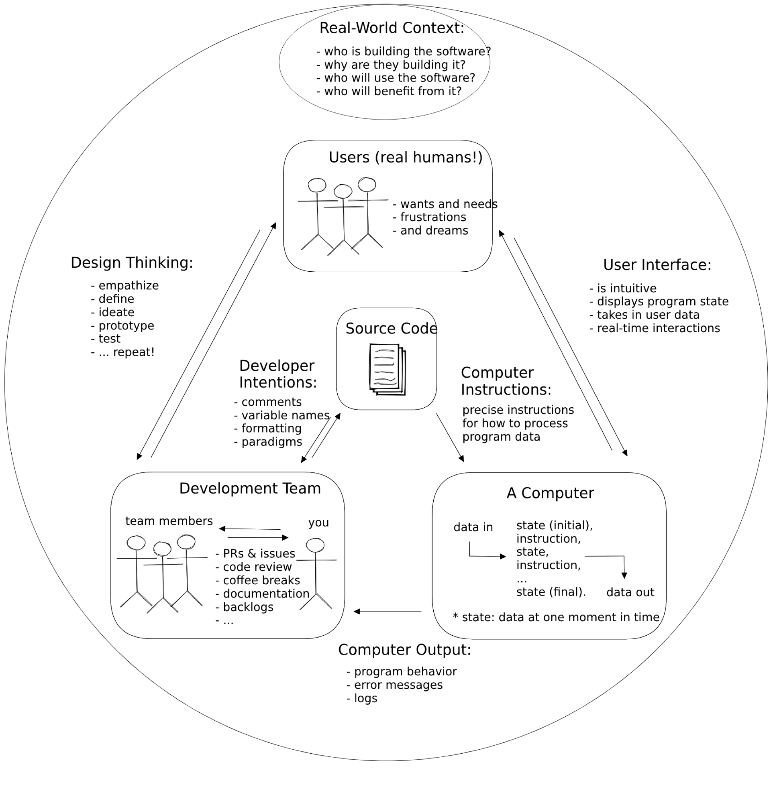
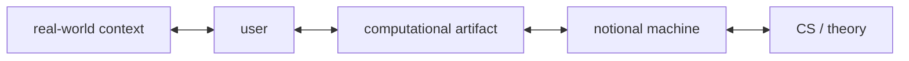
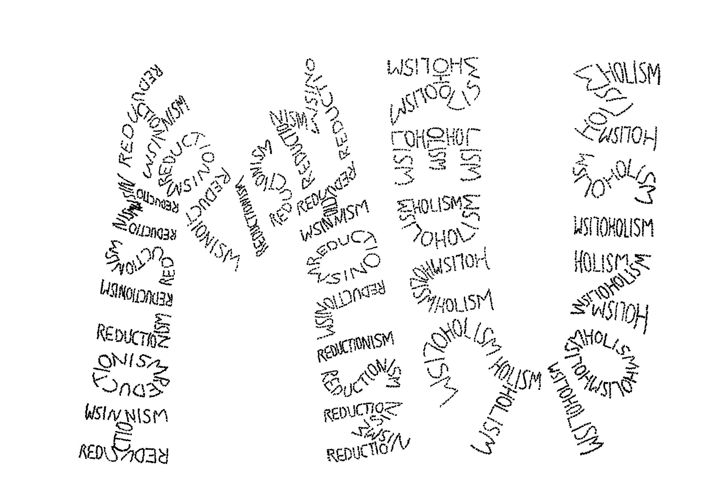

# Welcome to Frogramming — Curriculum Ontology

> **Purpose**: this document is the substantive ontology of the WtF curriculum.
> It captures the _conclusions_ of an extended thinking-together process — the
> framework, not the conversation. It weaves substance from `README.md`,
> `narrative/README.md`, and the `just-enough/javascript/` infrastructure
> documentation.
>
> **Companions** (siblings, by co-location):
>
> - `guide.{learners,authors,community}.md` — the _why_ per audience
> - `chapters.md` — the _how_ at chapter grain (5-layer LO grid)
> - `study-lenses.md` — the technical-reader companion describing the JEJ → NM →
>   embody → lenses → orchestrator infrastructure chain
> - `README.md` — the existing prose course (read-only for the current redraft)
>
> **Status**: end-state document. Status / phase / hedging belong in git history
> (commit log), not here.
>
> **Voice**: reference-neutral; un-prose-y. Tables, lists, mermaid only where
> relationships need it, `<details>`-wrapped visuals with relative-importance
> caveats. This is a transitional artifact toward visuals-as-load-bearing for
> the curriculum.

---

## Contents

- [Part A — Frame](#part-a--frame)
  - [§1 Foundational principles](#1-foundational-principles)
  - [§2 The rhetorical situation](#2-the-rhetorical-situation)
    - [§2.1 You Can't Un-See It](#21-you-cant-un-see-it)
  - [§3 Geometry — five chain-points, two bridging practices](#3-geometry--five-chain-points-two-bridging-practices)
  - [§4 The characters — V and F](#4-the-characters--v-and-f)
  - [§5 The 5-tier ATT](#5-the-5-tier-att)
- [Part B — Pedagogical depth (orthogonal to chapter sequence)](#part-b--pedagogical-depth)
  - [§6 The 5 layers](#6-the-5-layers)
  - [§7 The 5 strands — equal status](#7-the-5-strands--equal-status)
  - [§8 The data thread (the red thread)](#8-the-data-thread-the-red-thread)
- [Part C — Cogsci grounding](#part-c--cogsci-grounding)
  - [§9 Lenses of a system — levels of reductionism and holism](#9-lenses-of-a-system--levels-of-reductionism-and-holism)
- [Part D — The LLM shift](#part-d--the-llm-shift)
  - [§10 Substrate substitution at artifact-logic — what changes about the artifact](#10-substrate-substitution-at-artifact-logic--what-changes-about-the-artifact)
  - [§11 The LLM shift, workflow-side — how AI participates in your work](#11-the-llm-shift-workflow-side--how-ai-participates-in-your-work)
  - [§12 Bret Victor decomposition](#12-bret-victor-decomposition)
- [Part E — Curriculum machinery](#part-e--curriculum-machinery)
  - [§13 Computational vocabulary axes](#13-computational-vocabulary-axes)
- [Part F — Honoring commitments](#part-f--honoring-commitments)
  - [§14 The mu-tribute](#14-the-mu-tribute)
- [Source materials](#source-materials)

---

## Part A — Frame

### §1 Foundational principles

Two principles run beneath everything in the curriculum. Paired sentences that
the syllabus returns to whenever it needs to ground itself.

#### Principle 1 — Understanding is non-delegable

> **AI can do many things FOR you. It cannot UNDERSTAND for you.**

Mechanism: understanding lives as a _generative model_ in the learner's head,
doing prediction-and-update on the learner's own sensory stream. AI can complete
tasks; AI cannot have _your_ generative model align with the target system. The
**mastery contract** follows: a skill is mastered when exercises can be
completed without AI, because mastery is the _having of the experience that
builds the model_ — non-transferable.

##### Three threads grounding the principle

The claim _"AI can't UNDERSTAND for you"_ sits at the intersection of three
distinct strands of cognitive-science / philosophy. They are pieces of one
puzzle, not competing accounts.

- **Polanyi** (_The Tacit Dimension_, 1966) names **knowing**, particularly
  _tacit knowing_: skilled competence drawing on a vast unarticulated
  background. _"We know more than we can tell."_ This grounds the mastery
  contract — mastery is demonstrable competence (tacit), not explanatory fluency
  (explicit).
- **Friston** (active inference; contemporary cogsci) supplies the **mechanism**
  by which tacit knowing operates: a learner's generative model aligning,
  through prediction-and-update on the learner's own sensory stream, with the
  target system. Not a competing account of knowing; the mechanistic
  underwriting of it.
- **Metacognition** (Hohwy, Fleming, and others in the Friston-adjacent field)
  is the **awareness-of-knowing** layer — how (and how well) people understand
  what they know and the skills they demonstrate. Distinct from both the tacit
  knowing itself and the mechanism by which it operates.

Together: an AI can write code, articulate explanations, even pass exercises.
What it cannot do is run the prediction-and-update loop on _your_ sensory
stream, build _your_ tacit competence, or grow _your_ awareness of what you do
and don't know. Knowing, the mechanism that produces it, and the awareness of
that mechanism are all first-person work. The curriculum is designed to make
that work happen — and to make its results visible to the learner doing it.

#### Principle 2 — Concepts are connections; connections are concepts

> **Concepts are connections; connections are concepts. Learning is
> connection-making.**

A mutual-definition strange loop. A concept IS its connection-set; a connection
between existing concepts is itself a new concept. There's no atomic
concept-substrate underneath — concepts and connections are the same fabric
viewed from different angles.

The principle grounds:

- The spiderweb curriculum + the spiral as traversal (`pedagogy.md` §6)
- The 5 layers (§6) — depth = connection-density
- The 5 strands (§7) — each strand is a _kind of connection_
- The data thread (§8) — data flows through connections; connections shape what
  data can be
- Twinning (the active-inference mechanism; canonical at `pedagogy.md` "The
  pedagogical claim from Friston") — building a generative model = building a
  connection-graph that mirrors the target's
- Programming itself — a program is a connection-graph; programming is
  connection-making in code

Together, the two principles rule out both **cargo-cult learning** (no real
connection-graph built) and **atomic-fact memorization** (concepts mistaken for
unitary things).

> **On intellectual agency**: empowerment / intellectual confidence is the META
> learning objective unifying the 5 layers (§6). It is _not_ a third
> foundational principle in the ontology — that work belongs in the guides
> (`guide.{learners,authors,community}.md`). The two principles above are the
> curriculum's spine; intellectual agency is its purpose.

---

### §2 The rhetorical situation

The rhetorical situation is the **outermost frame** — the unit of analysis
within which the entire software development process occurs. Not background
context that surrounds the work; the situation IS the work, understood whole.



**Outer-circle accountability questions.** The diagram's outer ring poses four
questions. The extended frame adds four more — not a closed list, but the ones
the diagram invites most directly:

| Question                      | What it holds accountable                                          |
| ----------------------------- | ------------------------------------------------------------------ |
| Who is building the software? | Development Team — intentions, assumptions, power                  |
| Why are they building it?     | Purpose — which purposes count, who set them, what gets excluded   |
| Who will use the software?    | Users — their diversity, needs, frustrations, limits               |
| Who will benefit from it?     | Distribution — not the same as "who uses it"                       |
| Who has access to it?         | Reach — infrastructure, economic barriers, geographic availability |
| Who has agency within it?     | Power to change, exit, or refuse — not all actors are equal        |
| Who is absent from it?        | Who should be at the table but isn't; whose needs were never input |
| Who bears the consequences?   | When the system fails or harms, who absorbs the cost               |

**Actors, mediating artifacts, bridging processes:**

| Role                | Elements                                                       |
| ------------------- | -------------------------------------------------------------- |
| Actors              | Development Team · Users · Computer · (Ch4: Agents)            |
| Mediating artifacts | Source Code (center) · User Interface · Computer Output        |
| Bridging processes  | Design Thinking ↔ Developer Intentions ↔ Computer Instructions |
| Outer circle        | Real-World Context — the accountability questions above        |

**Where V and F sit in the diagram.** The learner is "you" — named explicitly in
the Development Team node ("team members ——— you"). V and F are the learner's
two directional orientations from within that node:

- **V (Vibetoader)** — the leftmost arrow: faces the user arc (Design Thinking →
  Users → User Interface). V's twinning target is the user.
- **F (Frogrammer)** — the bottommost arrow: faces the machine arc (Developer
  Intentions → Computer Instructions → A Computer → Computer Output). F's
  twinning target is the notional machine. Twinning the NM can happen without
  touching code: F can engage the NM directly through Computer Output — program
  behavior, error messages, logs — without authoring the Computer Instructions.
  When an LLM authors the code, F's cognitive work remains: predicting and
  reading the machine's behavior. This is LLM-assisted Frogramming.

The rhetorical situation is what both hats are inside of — not a backdrop they
step into but the structure that makes both orientations meaningful.

**Relationship to sibling sections:**

- §3 (Geometry): the inner structure of the situation — five chain-points, two
  bridging practices (V and F traverse the chain)
- §4 (Characters V/F): the learner's two orientational stances within the
  Development Team node — V leftward (user arc), F downward (machine arc); see
  §4 for the 2×2 and failure modes
- §5 (ATT): the abstraction register system for moving between levels of the
  situation
- §7 (Strands — Whole Rhetorical Situation): the pedagogical operationalization
  — conceit/coherence, two-scale reading

---

#### §2.1 You Can't Un-See It

> Once a practitioner can see the rhetorical situation they inhabit — its
> actors, relationships, power flows, and accountability questions — ignorance
> is no longer available. The outer circle was always there. Seeing it makes
> every subsequent non-decision a decision.

The rhetorical situation provides thought tools, not verdicts. The questions it
surfaces: _Who designed this? For whom? Who was absent from the design room?
What did the outer circle's assumptions exclude?_

**Three senses of access — all load-bearing, all distinct:**

| Sense                | Question it asks                                                               |
| -------------------- | ------------------------------------------------------------------------------ |
| Accessibility (a11y) | Can users with different abilities use what was built?                         |
| Access to technology | Can people reach the tools at all? (infrastructure, socioeconomic, geographic) |
| Access to building   | Who gets to be a builder, author, creator — not just a user?                   |

These are distinct registers, not synonyms. A product can score well on a11y
metrics, remain geographically unreachable, and have been built by a team that
never included members from the populations it claims to serve. All three are
live questions within the rhetorical situation.

**Two kinds of harm the situation surfaces:**

| Kind       | Characteristic                                                                                     |
| ---------- | -------------------------------------------------------------------------------------------------- |
| Intended   | An actor deliberately designed an exclusion or harm                                                |
| Unintended | Arises from interaction between actors — no single actor planned it; the system produces it anyway |

The unintended kind is the **insidious kind**: more common, harder to see, more
resistant to "we didn't mean to" as absolution.

**Canonical concrete forms (insidious kind) — not exhaustive:**

- **Accessibility**: screen reader incompatibility · missing contrast · absent
  keyboard navigation
- **Names**: fields that reject non-ASCII characters · truncate too early ·
  assume Western structure (first/last) · reject hyphens or spaces
- **Special characters**: encoding assumptions (ASCII default) that silently
  corrupt, reject, or erase non-English text
- **Dates**: format assumptions (MM/DD vs DD/MM) · timezone handling that erases
  · calendar systems absent from the data model

The rhetorical situation makes these tangible: it names _where in the picture_
the harm occurs — which actor made which assumption, which relationship was
ignored, which outer-circle question nobody answered.

**How substrate decisions introduce these harms.** Many enter not through UI
choices but through decisions made entirely in the substrate — character
encoding, data types, field-size constraints, storage models. These appear to
sit purely in F's affordance space: _what can the machine represent?_ A
competent F making a technically sound decision (e.g., using UCS-2, capping
field length to 50 bytes, defaulting to ASCII) may never see the user-space
consequence of that choice.

The failure is not F's twinning work — F may be reading the machine precisely.
The failure is the **absent coordination between affordance spaces**: F probing
substrate-affordances without V probing the corresponding user-affordances. When
that cross-space dialogue doesn't run, substrate constraints silently foreclose
user-space possibilities — a real user's name doesn't fit the field, a character
set isn't supported, a date format assumes a calendar system the user doesn't
use.

_(See §7 — Affordances strand — for the Mikhak loop: the affordance-discovery
dialogue between F and V that surfaces what neither sees alone.)_

---

### §3 Geometry — five chain-points, two bridging practices



The curriculum's geometry is a five-point chain. WtF's working range is the
inner three; the outer two are reach-points the curriculum gestures at and
follow-on courses develop.

#### The five chain-points

- **Real-world context** — the world the user inhabits. Contexts, situations,
  problems, sociocultural surrounds. Reach-point here; follow-on-deepening
  territory for _Welcome to Design_. Load-bearing in §2's rhetorical situation
  (where its outer ring carries this work).
- **User** — the person or population the artifact is built for. V's twin (§4) —
  the grounded particular V is building a generative model of.
- **Computational artifact** — what's made. Software, hardware, hybrids
  (wearables, embedded, embodied). Both V and F engage it; this is the trading
  zone where their practices structurally meet.
- **Notional machine** — the cognitive model of how a computational artifact
  behaves. F's twin (§4) — the grounded particular F is building a generative
  model of.
- **CS / theory** — formal abstractions of computation. Algorithms, complexity,
  correctness, type theory, formal verification. Reach-point here;
  follow-on-deepening territory for _Welcome to Algorithms_.

#### Two bridging practices — V and F traverse the chain

Each of V and F has a practice that **traverses** part of the chain. The
practices overlap at the central chain-point — the computational artifact —
which is §3's trading zone where V and F structurally meet.

- **Design thinking** — V's practice. Traverses _real-world context ↔ user ↔
  artifact_. V's working range across the chain.
- **Computational thinking** — F's practice. Traverses _artifact ↔ NM ↔
  CS/theory_. F's working range across the chain.

**Twinning is what makes the bridging practice _thinking_ rather than mere
process.** Design _thinking_ requires twinning the user; without the user-twin,
what's happening is _design process_ (wireframes, personas, A/B tests,
design-thinking steps) but not design _thinking_. Same on F's side:
_computational thinking_ requires twinning the NM; without the NM-twin, what's
happening is _computational process_ (unit tests, patterns, refactoring moves)
but not computational _thinking_. See §4 for the failure-mode elaboration.

#### Course geometry — sliding windows of three

The three Spiralearn courses sit on the chain as overlapping windows of three
adjacent chain-points:

| Course                       | Chain window                              |
| ---------------------------- | ----------------------------------------- |
| _Welcome to Design_          | real-world context ↔ user ↔ artifact      |
| **_Welcome to Frogramming_** | user ↔ artifact ↔ notional machine        |
| _Welcome to Algorithms_      | artifact ↔ notional machine ↔ CS / theory |

Shared edges between adjacent windows are curriculum hand-off points. Each
course's focus is the circuit its window traces — the lateral motion V, F, or
both run between its window's chain-points.

#### Bakhtiarian loops — the chain's lateral motion

V and F traverse the chain iteratively (the V/F dynamic developed in §4): V
proposes use-case experiences; F discovers substrate-affordances; each turn
reshapes what the next can hold. This iterative traversal forms **Bakhtiarian
loops** — plural deliberately; different grains of loop run between different
parts of the chain, between adjacent points and across course-windows. See §4
(V/F dialogue), §7 (affordance-loop strand operationalization), and §14 (the MU
recursive-traversal pattern) for the grain-distinctions. WtF's central loop is
the user ↔ artifact ↔ NM circuit — its own three-point window.

#### Hardware: in the mix; perpendicularity deferred

Hardware lives **inside the computational artifact** with software and hybrids.
Whether hardware is _also_ a perpendicular axis is deferred for later
litigation. What matters now: hardware is in the mix; V and F both engage it as
part of the central chain-point.

---

### §4 The characters — V and F

V and F are **substrate-agnostic bridging personae**. The framing extends from
JS-in-browser to wearables, tangibles, embedded, embodied — anywhere a
computational artifact gets designed and engineered.[^wtf-origin]

[^wtf-origin]:
    The course's name has a happy origin: in an early planning conversation
    someone noted that "Welcome to Programming" reads as "WtF." The author
    leaned in. The whole curriculum's ontology — V/F as Vibetoader/Frogrammer,
    the symbology, the playful tone — grew from that joke.

| Character         | Twin (non-delegable)        | Bridging practice      | Substrate range                                                           |
| ----------------- | --------------------------- | ---------------------- | ------------------------------------------------------------------------- |
| 🎨 **Vibetoader** | the user (§3 chain-point 2) | design thinking        | software, hardware, hybrids — anywhere a user experience needs designing  |
| 🔬 **Frogrammer** | the NM (§3 chain-point 4)   | computational thinking | software, hardware, hybrids — anywhere a notional machine needs designing |

#### Defined-by-twinning, defined-by-what-they-aren't

**Twinning is integral to V/F.** Without twinning, the terms no longer apply.
The "hat" — V or F — is a stance of _being grounded in_ a twin, not a stylistic
choice or a label.

**Vibing is not a failure mode.** Building by feel without a deep twin —
pattern-matching from prior examples, copy-paste-tweak, idiom-following — is a
legitimate stance, pre- and post-LLM. Pre-LLM it was often the fastest way to
build (Stack-Overflow-driven development; React hooks rules without
understanding reconciliation; CSS by trial-and-error; jQuery without a DOM
model; Rails magic). Post-LLM it is what Karpathy named _vibe coding_. The
stance can be V-flavored (user-experience-led with the NM delegated) or
F-flavored (NM-led with user-research delegated) — what matters is _which twin_
is being intentionally delegated, not whether the stance involves
pattern-following.

What fails is each hat's _realm process without its realm thinking_:

- **V failure — design process without design thinking.** Cargo-culting
  wireframes, user personas, A/B tests, design-thinking steps — without actually
  twinning the user. _Symptoms_: cannot answer specific questions about user /
  audience / personas; cannot connect artifact features to specific user
  characteristics or needs; cannot provide user / persona validations or
  evidence for design decisions.
- **F failure — computational process without computational thinking.**
  Cargo-culting unit tests, architecture / paradigm patterns, refactoring moves
  — without an NM-model the moves correspond to. _Symptoms_: can only describe
  black-box unit tests, not structural / glass-box tests; using patterns subtly
  incompatible with the underlying language / framework.

#### The predict-and-twin practice (the verb form of the twin)

Twinning is the stance; **the predict-and-twin practice** is the activity that
builds and maintains it. The loop: predict what the twinned process will do,
observe what it actually does, notice where prediction and reality diverge,
update the twin. F runs the loop with the NM as object — predicting evaluation
steps, reading code against the prediction, noticing where the runtime diverges.
V runs the same loop with the user as object — predicting how users will
interact with a prototype, observing how real users actually behave, noticing
where the model breaks. Either way, the practice is the verb form of the twin:
what you actually do when you twin. The phrase "twinning the NM" and the phrase
"running the predict-and-twin practice with the NM" name the same activity from
different sides.

#### Twin-failure categories (apply equally to V and F)

These are the _kinds_ of twin breakdown that produce the failure-mode symptoms
above:

- **Twin ignored** — you know you should build a twin (V's user-twin or F's
  NM-twin) but skip it under time pressure or convention
- **Twin wrong** — you have a twin but it's misaligned with reality; you predict
  against it, fail, and don't notice the failure (the **two-layer misconception
  mechanism** in §How Learning Happens names exactly this for F's NM-twin: many
  wrong NMs produce right outputs for a while)
- **Twin not-yet-known** — you don't yet know that twinning is part of the
  practice; you've never been told there's a thing to build

#### The twin / process 2×2

|                    | **NM-twin: NO**                                                                                      | **NM-twin: YES**                                                                                                                                       |
| ------------------ | ---------------------------------------------------------------------------------------------------- | ------------------------------------------------------------------------------------------------------------------------------------------------------ |
| **User-twin: NO**  | **Pure process** — twin-less; follows checklists / patterns / steps without grounding in either twin | **🔬 Frogrammer** — twins the NM (Ch2 develops this)                                                                                                   |
| **User-twin: YES** | **🎨 Vibetoader** — twins the user (Ch3 develops this)                                               | **The both-twins state** — the transcendent practice Ch4 (V + F operating alongside an LLM) and Ch5 (V + F merged in snippetry) develop in the learner |

Three of the four corners get curriculum-chapter mappings: Ch2 = F, Ch3 = V,
Ch4 + Ch5 = both. The fourth corner (no twin) is the starting position the
curriculum brings learners _out of_.

> **Flipside reading (with §9 two-lens reading).** The both-twins state names
> the **practitioner-side** — one practitioner holding V's twin (user) + F's
> twin (NM) simultaneously. §9 names the **lens-reading-side** — the central
> artifact read through two analytical lenses, artifact-logic (F's anchor
> lens) + artifact-surface (V's anchor lens). These are flipsides of the same
> activity: dual-twinning is the practitioner-side perceiving; the two-lens
> reading is what the lenses surface. §4 stays the canonical home for the
> practitioner-side; §9 stays the canonical home for the lens-reading-side.

Note on _vibe coding_ (Karpathy): the term names LLM-mediated building without
reading the code. It can be done with a user-twin (LLM-collaborative Vibetoading
— V corner) or without (no-twin corner). It is not bound to a single corner;
_which twin (if any) the practitioner is holding_ is what places it on the grid.

#### On the relationship between twin and process

Twin-less processes still have value. Wireframes, personas, unit tests, design
patterns, refactoring moves have evolved as effective guardrails / guides /
checklists; they carry accumulated wisdom against well-known failure patterns. A
learner with disciplined process but no twin can sometimes reach similar
outcomes to a practitioner with strong twinning but loose process, especially in
well-bounded settings. The processes are _not a substitute for twinning_, but
they aren't worthless without it either.

Strict process _with_ strong twinning is itself a failure mode. The processes
are descriptive — derived retrospectively from observing practitioners who twin
well (somewhat like music theory describes what composers do without dictating
it). A strongly-twinning practitioner who treats the processes as composition
rules rather than as guides loses the responsiveness their twin and automated
experience provide.

The healthy relationship: processes _afford_ structure; twins _do_ the work;
experience automates the integration. _You have to understand the rules in order
to break them._

#### Documentation as a both-hats case

Technical documentation requires both _dev / reader twinning_ (V-shape — what
does the reader need to find here, in what order?) AND _NM-twinning at the
documented software's level of abstraction_ (F-shape — what is this API's
notional machine, what events / behaviors does it produce?). Building an API or
library is effectively _creating a new NM_ layered on top of the underlying
language; documenting it well requires twinning that NM, not just the language's
NM beneath it.

#### Symptoms (not failure modes themselves)

Ceremony-without-twin (TDD performed without NM-awareness; code review without
understanding what to look for; F-shaped process performed for compliance) and
design-thinking-process-without-user-twin (personas done as ceremony; A/B tests
without theory of user; V-shaped process performed for compliance) are what
failure-mode practices _look like_ from outside — they are not the failure
itself. The failure is upstream, in the twin (or in strict-process-enforcement
when already twinning, per the music-theory note above).

#### The four-quadrant grid

V/F is a stance about _which twin you shoulder_, orthogonal to whether an LLM is
in the loop:

|                                    | **Humans-only**                                                                                                    | **LLM-collab**                                                                                                             |
| ---------------------------------- | ------------------------------------------------------------------------------------------------------------------ | -------------------------------------------------------------------------------------------------------------------------- |
| 🎨 **Vibetoading** (user-grounded) | UX-research-led prototyping; design-thinking-driven iteration with real people; the NM is intentionally delegated. | Karpathy's _vibe coding_ — LLM writes notation, you focus on user-visible outcomes; works only paired with deep user-twin. |
| 🔬 **Frogramming** (NM-grounded)   | Traditional engineering — humans write notation grounded in NM-awareness, craft practices applied intentionally.   | Willison's _vibe engineering_ / _agentic engineering_ — LLM writes notation; you direct and verify against the NM.         |

#### Vibing predates LLMs

Pattern-matching syntax without understanding the underlying mechanism is older
than LLMs by decades — copy-paste-tweak from Stack Overflow, React hooks rules
without understanding reconciliation, CSS flexbox by trial-and-error, jQuery
selectors without a DOM model, Rails magic accepted as opaque. LLMs amplified
the practice; they didn't invent it.

#### Related vocabulary

| Term                    | Coined by         | Relationship                                                                      |
| ----------------------- | ----------------- | --------------------------------------------------------------------------------- |
| **Vibe coding**         | Karpathy          | Narrow: building with an LLM without reading the code it writes.                  |
| **Vibe engineering**    | Willison          | Disciplined counterpart: seasoned engineers using LLMs while staying accountable. |
| **Agentic engineering** | Willison / Osmani | Building with coding agents that execute and iterate.                             |

**Frogramming is broader than any of these** — tool-agnostic,
abstraction-level-agnostic. Vibe engineering and agentic engineering are flavors
of LLM-collaborative Frogramming.

#### V and F personalities (sketches; open)

##### 🎨 The Vibetoader

- **Stance**: grounded in the user
- **Energy**: playful, exploratory, prototype-first
- **Tools of trade**: sketches, personas, storyboards, A/B tests, usability
  studies, prototyping platforms
- **Tells**: _"what if we just tried…"_; _"let's see what the user does"_
- **Strengths**: empathic resonance; tolerance for ambiguity; rapid iteration;
  aesthetic sense

##### 🔬 The Frogrammer

- **Stance**: grounded in the notional machine
- **Energy**: methodical, predictive, mechanism-curious
- **Tools of trade**: trace tables, predictive stepping, Study Lenses, debugger,
  code reviews, assertions, lint, tests — _the kit of magnifying glasses_ the
  Frogrammer carries
- **Tells**: _"predict before you run"_; _"what does the machine actually do?"_
- **Strengths**: precision; pattern-recognition at the event level; calm in the
  face of errors-as-information

#### V/F dynamic — the Bakhtiarian loop

V and F engage iteratively, learning each other's craft as they go. V proposes
use-case experiences (_"imagine an interaction where…"_); F discovers what the
substrate affords (_"this becomes possible, and it also enables…"_). Each turn
shifts what V can propose and what F can build. The exchange is open-ended — no
fixed number of beats, no required rhythm.[^achilles-tortoise] Over time, V and
F merge in the practitioner; Ch5's snippetry is where the merging crystallizes
into a single integrated practice (the both-twins corner of the §4 2×2, in its
merged form).

The loop's **geometric home is §3's chain**: V and F traverse the chain
laterally, running iterative exchange between V's twin-position (user) and F's
twin-position (NM) through the central artifact. WtF's central loop is exactly
that three-point circuit; loops at other grains (adjacent-pair, course-window,
meta-pattern) run across other parts of the chain — see §7 for the strand-5
operationalization and §14 for the MU recursive-traversal pattern.

[^achilles-tortoise]:
    Achilles and Tortoise (Hofstadter, _Gödel, Escher, Bach_, 1979 — themselves
    descended from Lewis Carroll's "What the Tortoise Said to Achilles," 1895)
    are V/F's literary precursor: two characters with opposing temperaments
    whose iterative dialogue **is** the medium of inquiry. V and F's dialogue
    carries the same temperament — open-ended exchange between contrasting
    groundings, neither one resolving the other, both reshaping what the next
    turn can hold. See §14 for the MU tribute that honors this lineage directly.

Engaging in these exchanges is how each side picks up the other's craft: V
learns what's afford-able through F's iterative discoveries; F learns to read
user-experience signals through V's iterative proposals. The dynamic recurs in
historical pairs (Faraday/Maxwell, Mendel/breeders).

#### V/F vs. Composer/Virtuoso/Mechanism/Audience cast

The Composer/Virtuoso/Mechanism/Audience cast (canonical at `metaphor.md`) is
**teaching apparatus** — explicitly not structural guide, explicitly not the
canonical home for any learning objective. V and F are **practice-stances** the
student inhabits and are tied to LOs. The two are **orthogonal**:

- A _stance_ (V or F) and a _role_ (Composer / Virtuoso / Mechanism / Audience)
  coexist in any moment of work
- V/F say which audience the practitioner twins
- Composer/Virtuoso say which phase of composition the practitioner is in

The metaphor exists to illustrate the practice; it is not the practice.

#### V/F at the artifact layer — coordinated Translational Sprints

The V/F symmetry operates at two layers — the student layer and the **artifact
layer**, between the curriculum and the infrastructure that makes its pedagogy
operational:

| Layer        | V (physics / experiential)                                                      | F (engineering / technical)                                                           |
| ------------ | ------------------------------------------------------------------------------- | ------------------------------------------------------------------------------------- |
| **Student**  | the Vibetoader (grounded in the user the program serves)                        | the Frogrammer (grounded in the notional machine the program runs on)                 |
| **Artifact** | **the curriculum** (design thinking about the learner's experience of learning) | **`lenses/embody`** (engineered technical affordances that make NM-territory legible) |

The two artifacts operate as **coordinated Translational Sprints** — two
translational research artifacts (in TCER's sense — see
`translational-framing.md` §6 Tool-Theory Co-evolution) in the same trading
zone, each shaping the other's next iteration.

> **We are doing the innovation process we're teaching.**

See `translational-framing.md` §6 (Tool-Theory Co-evolution) and §7 (V/F at the
artifact layer) for the deeper analysis. The operational infrastructure itself —
the JEJ → NM → embody → lenses → orchestrator chain — is described in
`study-lenses.md`. The pattern recurses: V and F at the student layer; V and F
at the artifact layer. Bakhtiar Mikhak's _engineering × physics co-evolution_
names the meta-pattern: engineering practice (technical affordances) and
theoretical/experiential practice mutually constitute each other, with neither
downstream of the other. The artifact-layer V/F is one instance of that
meta-pattern.

#### Lineage (precursors in the user's prior writing + deeper)

- **"Wear Hats, not Titles"** — V/F's situational/plural/context- dependent
  precursor
- **"Computer Empathy"** (`Module___Welcome to JS___1.md`, 2018) — direct
  precursor to F's NM-twin via prediction. _"Twinning" is what "Computer
  Empathy" was reaching for, six years on._ Direct continuity.
- **Three-audience architecture** (developer / computer / user) — intrinsically
  bridging; the developer holds all three audiences
- **Bakhtiar Mikhak — engineering × physics co-evolution** — the deeper pattern
  V/F instantiates. Faraday/Maxwell-style mutual constitution: engineering
  practice and theoretical practice shape each other; neither is downstream of
  the other. Same teacher who introduced the user to the data/interaction
  architectural pattern (which inspired embody/lenses) AND the
  _infrastructure-is-research-contribution_ claim (canonical at
  `translational-framing.md` §6).

<details>
<summary>**Visualization: V/F + the rhetorical model** _(introduced as primary diagram in §2; reproduced here for V/F context)_</summary>


AI sits _outside_ the rhetorical circle — exactly the virtuoso's position in the
teaching-apparatus cast (`metaphor.md`).

</details>

---

### §5 The 5-tier ATT

The Abstraction Transition Taxonomy names the linguistic registers — the
vocabularies, phrasings, and notations practitioners use to talk about what
lives at each chain-point. Each tier is a _-speak_ : a register practitioners
emit when their attention is at a given chain-point and they're describing,
predicting, or designing what lives there. The five tiers correspond 1:1 to §3's
five chain-points.

| Tier                       | Speak (linguistic register)                                                                                                              | Who works it                                        |
| -------------------------- | ---------------------------------------------------------------------------------------------------------------------------------------- | --------------------------------------------------- |
| **Real-world context**     | **Context-speak** — English about world, situations, communities, sociocultural conditions; user-research and ethnographic vocabulary    | V's reach-point; deepens in _Welcome to Design_     |
| **User**                   | **User-speak** — personas, user stories, journey and interaction vocabulary, accessibility registers; what V emits when twinning a user  | 🎨 V (V's twin-position)                            |
| **Computational artifact** | **Artifact-speak** — code-as-text + machine internals; static (code text) and dynamic (NM events) faces of the made-thing                | both V and F engage                                 |
| **Notional machine**       | **NM-speak** — operational vocabulary: events, scopes, evaluation steps, predict-trace-verify language; what F emits when twinning an NM | 🔬 F (F's twin-position)                            |
| **CS / theory**            | **CS-speak** — formal proofs, complexity classes, type theory, lambda calculus, formal verification                                      | F's reach-point; deepens in _Welcome to Algorithms_ |

#### Bridging practices traverse tier-subsets

The two bridging practices (§3) are not tiers themselves — they are
cross-cutting movements that **traverse** subsets of tiers, emitting vocabulary
at multiple tiers as they range across them. They overlap at artifact-speak,
§3's trading zone where V and F structurally meet.

- **Design thinking** traverses _context-speak ↔ user-speak ↔ artifact-speak_.
  Its working vocabularies include sketches, personas, user stories, wireframes,
  storyboards, design-system specs, user-research notation — emitted at
  different tiers along its range (wireframes and storyboards near
  artifact-speak; personas and user-research notation near user-speak and
  context-speak).
- **Computational thinking** traverses _artifact-speak ↔ NM-speak ↔ CS-speak_.
  Its working vocabularies include algorithmic reasoning, operational tracing,
  big-O arguments, correctness vocabulary — emitted at different tiers along its
  range (operational tracing near NM-speak; big-O and formal correctness near
  CS-speak).

#### Artifact-speak's static and dynamic faces

Artifact-speak contains two register-modes within a single tier: a **static
face** (code-as-text — what's read on the page) and a **dynamic face** (machine
internals / NM events — what's read at runtime). Both faces belong to
artifact-speak; the split sits inside the central tier rather than between
tiers.

---

## Part B — Pedagogical depth

Orthogonal to chapter sequence. The 5 layers, 5 strands, the data thread.

### §6 The 5 layers

Each chapter runs ALL 5 layers. The layers are _engagement depths_ the reader
can stay at or descend through. **A learner who stays at L1 graduates well; a
learner who revisits at L3 finds more; a learner who re-encounters at L4 finds
more again.** Each layer is a complete exit point.

> **Meta learning objective unifying all 5 layers**: _intellectual agency_. Each
> layer is intellectual agency at a different scale. This is the through-line
> that connects the layers to the guides
> (`guide.{learners,authors,community}.md`).

| Layer  | Frame                | Meta-objective (intellectual agency over…) | Primary objective                                                                                                                                            | Learned through                                                                                               |
| ------ | -------------------- | ------------------------------------------ | ------------------------------------------------------------------------------------------------------------------------------------------------------------ | ------------------------------------------------------------------------------------------------------------- |
| **L0** | Embody / Mastery     | …the notional machine                      | Predictive mastery of the event-based JEJ NM                                                                                                                 | embody + predictive lenses                                                                                    |
| **L1** | Apply / Rhetoric     | …communicative production                  | Context-aware comprehension, discussion, production across three audiences                                                                                   | embody + static and analytical lenses, reflection questions, program comparison, case studies, process guides |
| **L2** | Switch / Methodology | …methodology choice                        | Switch comfortably between V and F hats; comfort with design + computational thinking                                                                        | process guides, case studies, open-ended exercises, discussion questions, external resources                  |
| **L3** | Explore / Snippetry  | …the medium itself                         | Programming automaticity; exploring concepts/domains _through_ programming; self-directed exploration                                                        | snippetry, remixing, esoteric prompts (quines, wuzzles, cross-medium translations)                            |
| **L4** | Wonder / Philosophy  | …the questions themselves                  | Inhabit the frontier where confirmable science gives way to philosophical questioning; ask the big questions with methodological rigour — not theory-mastery | easter eggs in main text; side/footnotes; references; open questions and methods for asking them              |

> **SOLO taxonomy applies _within_ each layer**, not across — see `pedagogy.md`
> "Using the 5 layers (§6) in teaching" for the design principle.

#### Each layer's data thread (the red thread ramifies)

| Layer | What "data" means at this layer                                            |
| ----- | -------------------------------------------------------------------------- |
| L0    | NM-internal: events, scopes, values, coercion                              |
| L1    | Multi-modal communicative flow (rhetorics, audiences)                      |
| L2    | Intentional design of data flows for specific ends                         |
| L3    | Substrate for self-expression and exploration                              |
| L4    | Open question: information + embodied computation as substrate of reality? |

#### L4 by strand — each strand's philosophy reading (open-ended development guide)

L4 is not only easter-eggs-scattered-as-references; it is a structural promise.
Each of the 5 strands has a philosophy reading that opens at L4. These pair the
operational work of the strand with a tradition that names what the strand is
ultimately about.

The named traditions are **entry-points into questioning, not a syllabus to
master**. L4 reaches the edge of confirmable science and crosses into
frontierland between philosophy and evidence. The goal is not bringing learners
up to date with the latest names in active inference, embodied cognition, or
phenomenology — those readings deepen and shift over time. The goal is to get
learners **asking the big questions, and to do so with some rigour and
methodology**. The traditions named below are positions to interrogate, not
authorities to defer to.

| Strand                     | L4 philosophy reading                                                                                                                                                     |
| -------------------------- | ------------------------------------------------------------------------------------------------------------------------------------------------------------------------- |
| Twinning                   | Active inference / Friston / Polanyi (tacit knowing as predictive alignment); self-twinning as theory of consciousness (the predictive model of self is the seat of self) |
| Decisions                  | Compositional voice / authorship / free will (small choices accumulating into style)                                                                                      |
| Perspective stacking       | Phenomenology / point-of-view in fiction / Nagel's _What Is It Like…_                                                                                                     |
| Whole rhetorical situation | Systems thinking / Bateson / cybernetics (the whole as the unit of analysis)                                                                                              |
| Affordances                | Gibson / embodied cognition / ecological psychology (perception as relational)                                                                                            |

Open-ended development guide — readings deepen and shift; the table is a
direction-finder, not a closed catalog.

#### Substrate is not inert

embody is **not** a static thing the dynamic flow gets laid onto. It is a
**crystalline representation of the entire dynamic data lifecycle of a program**
— _"a static 4D rendering of a 3D flowing river"_ (user). Streams represent the
dynamics of data processing in the NM. embody exists to make all facets of the
dynamics explorable.

This sharpens F's grounding: **F is grounded in the motion the substrate makes
legible**, not in a static model.

> **Layer-architecture rendering rules** (each-layer-through-each-chapter,
> platform-agnostic constraint, layer-by-markdown-affordance mapping) and
> **layer-title brainstorming** (verb/noun/hybrid styles) — see `pedagogy.md`
> "Using the 5 layers (§6) in teaching."

---

### §7 The 5 strands — equal status

Strands are the _connection-types_ the curriculum tracks. Each strand represents
one _way of making connections_ the learner is being trained to recognize and
produce.

> **Vocabulary note**: "thread" is reserved for the _data thread_ (§8) — the red
> thread that stitches everything together. The 5 below are **strands**.

#### Twinning

Connections to target systems. Building a generative model of a process outside
your own mind that aligns with that process's actual behavior.

**Targets across chapters**:

- Ch1: 🧑‍💻 the developer who reads your code (incl. future-you)
- Ch2: 💻 the computer (NM) that evaluates your code
- Ch3: the user who experiences your program
- Ch4: 🤖 the agent (LLM) you collaborate with
- Ch5: yourself as poly-perspective being

**Cognitive-science grounding**: twinning IS active inference (canonical at
`pedagogy.md` "The pedagogical claim from Friston").

#### Decisions (micro and macro)

Connections between options. Every keyword, name, operator, and structure in
your code is a _micro_-decision. Every architectural choice, paradigm, and
program shape is a _macro_-decision. Both reach the twinned audiences.

**Compositional voice develops here** — distinctive programmer voices emerge
from cumulative macro-decisions over time.

#### Perspective stacking

Connections across levels. Any piece of code can be read at multiple levels
simultaneously: individual syntax, what a line _does_, how parts _connect_, what
the program is _for_, what the _user experiences_. Holding more of these
perspectives active at once is the mastery move.

#### The whole rhetorical situation

> **Conceptual grounding**: see §2 for the full definition, visual anchor, V/F
> placement in the diagram, and ethics/access framing. This strand entry covers
> the pedagogical operationalization: conceit/coherence and the two-scale
> reading.

Connections between all parts. The entire software context — users, developers,
computer, product, environment, and the purpose the code serves. Twinning each
part isn't enough; the fullest work holds the _whole_ situation in view.

**Two notions (Lupe Fiasco's theory of rap)**:

- **The conceit** — the message, intention, meaning. Bears the connotation of
  intention on behalf of the rhetor.
- **Coherence or decoherence** — within each actor (does this rhetor's conceit
  hold together internally?) and **over time** in a rhetorical situation (does
  the conceit hold across iterations, contributors, contexts; or does it
  decohere as the situation evolves?).

**The two-scale instrument reading.** The rhetorical situation has two scales,
not one. The first instrument is the machine playing the score — predictable,
deterministic, reading the code-as-notation literally. The second instrument is
the user's experience of that machine playing — intangible, emergent, arising
from the interaction between the parties (the user, the program, the context).
The _concert_ — the experience-as-purpose, what the work ultimately serves — is
what both V and F orient toward. Neither V nor F controls the concert directly:
the user-experience takes place in the body of the user but arises from
interaction; the work of both hats is to set up conditions that make the
experience the program serves possible. (See `metaphor.md` for the metaphor this
reading extends; the metaphor illustrates, the strand does the teaching.)

#### Affordances (5th strand, equal status)

Connections between agent and environment. **An affordance is a relational
property** — a chair affords sitting, but only for organisms with the right
body. Programming languages are affordance-spaces (Lisp affords macros; Haskell
affords laziness; JS affords prototype-mutation). Learning JS = learning an
affordance-space.

Equal status with the other four strands.

The Mikhak loop is an _affordance-discovery dialogue_: F probes
substrate-affordances; V probes user-affordances; their dialogue surfaces
affordances neither saw alone.

**Geometric home — §3's chain.** The Mikhak loop's geometric home is §3: V
probes affordances anchored at the user-side of the chain; F probes affordances
anchored at the NM-side; their dialogue traverses the central artifact and
surfaces affordances neither sees alone. WtF's Mikhak loop is exactly the user ↔
artifact ↔ NM circuit — strand-5's operationalization of §3's lateral motion.

> _(See §9 for the lens-traversal framing: V and F traverse the §9 lenses
> (analytical levels), each naturally anchoring at a particular lens — F at
> artifact-logic, V at artifact-surface — but probing affordances across the
> range. The Mikhak loop is the strand-5 operationalization of this cross-lens
> dialogue.)_

#### Strands × Study-lenses cross-map (OPEN-ENDED DEVELOPMENT GUIDE)

_("Study-lenses" here refers to the JEJ technical infrastructure — see
`study-lenses.md` — not §9's analytical lenses or V's/F's cognitive lenses.)_

Each strand has a different study-lens-affinity. Some cells suggest study-lenses
that don't yet exist — gaps in the catalog are surfaced by the mapping itself.

| Strand                     | Study-lenses with strong affinity       | Gaps to consider                                             |
| -------------------------- | --------------------------------------- | ------------------------------------------------------------ |
| Twinning                   | trace-table; predictive stepping; debug | —                                                            |
| Decisions                  | blanks; parsons; code review templates  | a decision-tree study-lens that surfaces micro-decisions?    |
| Perspective stacking       | highlight; scope-walk; ask              | a multi-perspective study-lens — several reads side-by-side? |
| Whole rhetorical situation | (no existing study-lens serves this)    | rhetorical-situation study-lens? — open development question |
| Affordances                | (no existing study-lens serves this)    | affordance-space study-lens? — what could the NM also do?    |

Marked as an **open-ended development guide** — not a closed catalog.

---

### §8 The data thread (the red thread)

The data thread is the SAME word with increasingly rich semantics across the 5
layers (see §6). The student's understanding of _what data IS_ deepens at every
spiral pass.

> "The entire embodied phenomenon from theory to domain is data flowing through
> and changing the physical world. In theory changing the minds of the thinker,
> in computation information exerting control on hardware, in interaction the
> embodied computation modifying the user, and the data transforming the domain
> through the actions and state of the user." — user, mid-conversation (round 5
> era)

**Substrate-is-not-inert sharpening**: the data thread doesn't just flow through
layers — embody **crystallizes** its dynamic flow into a static-but-4D structure
that makes all facets explorable. The data thread stitches everything together
_because_ the substrate makes the motion legible.

#### Ch3 anchor (the data-flow loop)

A vivid concrete loop becomes Ch3's anchor:

> The program's data enters the user through their eyes via a prompt; the user
> processes it and transforms it into a response; the response enters the
> program through prompt and a resolve event; the program processes; …

This grows the Ch1→Ch2 dev↔NM loop into the Ch3 dev↔NM↔user loop. Cybernetics
referenced as side/footnote, not in body.

---

## Part C — Cogsci grounding

### §9 Lenses of a system — levels of reductionism and holism

A system can be read from many analytical positions: zoomed all the way in to
physics, zoomed out to systemic impacts, anchored mid-stack at the artifact
itself. §9 names the **lenses** through which a system can be understood,
discussed, or designed — a partially-ordered range running from most reductive
(the substrate is what matters) to most holistic (the whole-in-context is what
matters). The range runs between the two poles §14's MU traverses: HOLISM and
REDUCTIONISM, each pole resolving into MU through enough levels of its opposite.

This axis is **independent of §3's chain**: §3's chain enumerates
curriculum-relevant skill+knowledge sites; §9's lenses enumerate analytical
levels at which any system can be read. The two axes rhyme but answer different
questions.

> _Term hygiene._ "Lens" appears in three other senses in the doc — V's lens and
> F's lens (the practitioner cognitive twin-stance, §4 + §7); study lenses (the
> JEJ technical infrastructure, `study-lenses.md`); and the §7 strand × lens
> cross-map (referring to study lenses). The §9 "lens" is distinct from all
> three: an **analytical lens-position along the H↔R gradient**.
> Cross-references disambiguate inline where the senses sit close together.

#### The lenses

Drawn linearly for legibility; the range is partially ordered. "Above" means
_presupposes the lens below has crystallized into stable ground_, not _depends
only on the immediately lower lens_. The categories are pedagogical handles, not
metaphysical claims — arbitrary slices on a continuum, chosen for the minimal
actionable mental model. We do not mark phase-changes between lenses.

**Theory-side (most reductive) — F's natural reach extends through here
ontologically; WtF defers practical work to follow-on courses:**

- **(1) Platonic** — _Levin's Platonic Space._ The informational interpretation
  of the physical world; the philosophical commitment that the material is
  _legible_ at all. Manifesto territory; the curriculum gestures here only at L4
  (Philosophy reading). Deferred entirely to follow-on courses ("third course"
  frontier territory in Spiralearn's roadmap).
- **(2) Physics / material** — atoms, transistors, energy gradients. The
  physical substrate. Deferred entirely.
- **(3) Computing infrastructure** — mathematics and formal systems made
  operational: runtimes, OSs, networks, training/build/run support software.
  Deferred to follow-on courses; named here so the student knows what sits
  below.

**Artifact-region — two lens-readings of the central artifact:**

- **(4) Artifact-logic** — the F-anchor lens. What the artifact computes:
  conventional algorithms, or a GenAI model. Same site, different substrate
  types. When a Frogrammer says "twin the machine," the machine being twinned is
  read through this lens: in conventional software, the algorithmic logic; in
  AI-native software, the GenAI model. The stance is the same; the substrate is
  different. §10 develops what changes when GenAI occupies this lens-position.
- **(5) Artifact-surface** — the V-anchor lens. What the artifact presents
  outward: UI, APIs, programmatic and human-perceivable surfaces.

Artifact-logic and artifact-surface are two distinct lens-readings (an algorithm
runs; a UI is painted) of §3's central chain-point — one artifact read through
two analytical lenses, each lens inviting its natural practitioner-stance.

> **Flipside reading (with §4 both-twins).** §4 names the **both-twins state** —
> V's twin (user) + F's twin (NM) held simultaneously by one practitioner. §9
> names the **two-lens reading** of the central artifact — artifact-logic +
> artifact-surface, the same artifact read through two analytical lenses. These
> are flipsides of the same activity: dual-twinning is the practitioner-side
> perceiving; the two-lens reading is what the lenses surface. §4 stays the
> canonical home for the practitioner-side; §9 stays the canonical home for the
> lens-reading-side.

**Domain-side (most holistic) — V's natural reach extends through here:**

- **(6) Interaction dynamics** — human-system dynamics over time. Dialogue,
  workflow, habituation, repair.
- **(7) Systemic impacts** — society and computing as a coupled system. What
  this kind of artifact does, in aggregate, to the world it participates in.

#### V and F traverse lenses; each has a natural anchor-lens

V (Vibetoading) and F (Frogramming) are practitioner cognitive stances; both
stances can travel across §9's lens range. Each has a **natural anchor-lens**
(the lens where it most often anchors and reads from), derived from the kind of
question each asks:

- **F asks**: _what does the artifact compute? what's its NM?_ F's anchor-lens:
  **artifact-logic** — where computation-as-substrate is most legible. F's reach
  extends down into computing-infrastructure (substrate beneath the artifact) —
  ontologically F-territory, deferred to follow-on courses in WtF.
- **V asks**: _what does the artifact feel like? what does it afford the person
  on the other side?_ V's anchor-lens: **artifact-surface** — where the
  artifact's outward presentation lives. V's reach extends up into
  interaction-dynamics and systemic-impacts — the experience side of the lens
  range where embodied phenomena live.

The two anchor-lenses meet at the central artifact — F at artifact-logic, V at
artifact-surface. This is §3's "trading zone" read through the lens stack.

Either practitioner can travel beyond their anchor — F can rise into systemic
impacts to read social affordances at a formal-systems level; V can drop into
computing infrastructure to read substrate experience. The natural anchors
describe characteristic ranges, not constraints.

#### Three independent axes — chain, strands, lenses

The curriculum's geometry has three independent axes, each canonical in its own
section, surfaced together here. They answer three different kinds of question:

| Axis        | Section           | Enumerates                                                                 | Question it answers                              |
| ----------- | ----------------- | -------------------------------------------------------------------------- | ------------------------------------------------ |
| **Chain**   | §3                | chain-positions — sites of skill+knowledge along the curriculum's geometry | _Where_ does the work sit?                       |
| **Strands** | §7                | connection-types — kinds of connection-making the learner is doing         | _What kind of connection_ is the learner making? |
| **Lenses**  | §9 (this section) | analytical lens-positions along the H↔R gradient                           | _At what H↔R level_ is the system being read?    |

The three axes are of three different _kinds_ — chain-positions (sites),
connection-types (relations), analytical-levels (zooms) — and they don't co-vary
in a closed way. Plus the **data thread** (§8) running through everything, with
the word _data_ deepening its semantics at each layer (§6).

The full geometry is _chain × strands × lenses_. We do not exhaustively map
permutations; the geometry is a direction-finder, not a closed catalog.
**Strands themselves are an open-ended catalog** (§7's strand × lens cross-map
is explicitly an open development guide — some strand × study-lens cells have no
existing study-lens yet); the triple's openness inherits from §7's. Each axis is
canonical in its own section; §9 surfaces the cross-product so the reader can
see all three at once.

#### Transitions between lenses

The transitions between adjacent lenses can also be read as places where the
productive lens-shift is most legible — the work of strand-Affordances (§7) and
the composer/virtuoso/mechanism metaphor (`metaphor.md`) operationalize this
reading. Listed here as a cross-frame; the lenses and the practitioner-traversal
framing remain first-class on their own terms.

#### Bridge to §10 and §11

§10 develops what changes at the _artifact_-side when GenAI occupies the
artifact-logic lens-position: substrate substitution from deterministic to
non-deterministic NM, the verification limit, agentic emergence. §11 develops
the _workflow_-side: three positional roles AI can play relative to a human's
work (study partner / dev collaborator / active component), with the
depth-of-involvement and verification-target axes. Read §9 → §10 → §11 as the
natural sequence: general lenses → artifact-side AI consequences → workflow-side
AI positions.

---

## Part D — The LLM shift

### §10 Substrate substitution at artifact-logic — what changes about the artifact

§9 names the analytical lenses through which a system can be read. §10 picks up
at the **artifact-logic** lens (§9 lens 4) and develops what changes _about the
artifact itself_ when a GenAI model substitutes for conventional algorithms as
the substrate read through that lens. §10 is the **artifact-side** of the LLM
shift — what the artifact _becomes_. §11 is the **workflow-side** — where AI
sits relative to a human's work.

§10's "NM" (notional machine) and §9's artifact-logic lens read the same site at
different resolutions. Substrate substitution swaps a GenAI model into that
site; the NM-twinning stance (the active-inference framing canonical at
`pedagogy.md` "The pedagogical claim from Friston") remains, but what's being
twinned has different mechanical properties.

#### Substrate substitution: deterministic → non-deterministic

The fundamental mechanical shift at artifact-logic when GenAI replaces
conventional algorithms:

**Conventional artifact-logic is, _in its core data-transformation behavior_,
deterministic.** Given input X, the algorithmic path that produces Y is
predictable. Sources of non-determinism in conventional systems — `Math.random`,
concurrency, network I/O timing, filesystem state, wall-clock dependencies — are
**bounded and locatable**; you can name them, isolate them, mock them in tests.
F's NM-twin works at this lens because the NM is reproducible: the same input
under the same observable conditions traces the same path through scope chains
and value transformations.

**GenAI artifact-logic is non-deterministic in a categorically different way:
intrinsically.** Given input X, output is _sampled_ from a probability
distribution shaped by the model's weights. The non-determinism isn't bounded to
specific calls; it's a property of the substrate itself. F's NM-twin shifts from
predicting a specific path to characterizing a _distribution of plausible
outputs_; V's user-twin shifts to anticipating a _range of behaviors_ rather
than a specific reaction.

**This is the mechanical ground for the verification limit below.** Conventional
artifact-logic can be verified pre-deployment by exercising input-output pairs
and tracing internal events. GenAI artifact-logic resists this because the
deployed behavior is a sampling process, not a function. The most consequential
behaviors (rare outputs, drift over interaction histories) live in the tails.
The verification limit isn't a missing tool; it's a property of the substrate.

#### The verification limit

We don't always understand what we direct — and at GenAI artifact-logic, the
substrate itself resists the kind of pre-deployment verification conventional
software permits (per the deterministic → non-deterministic shift above). Even
our tests may be out of our depth — it's possible to verify that a program does
the _wrong thing correctly_. This makes certain practices _more_ important in an
LLM-assisted workflow, not less:

- Short iterations of user-visible behavior we can actually evaluate
- Human-evaluable acceptance criteria
- Testing discipline oriented toward visible behavior
- Agile development vs Waterfall, all over again

Chapter 3 (users, PBIS, visible behavior) carries particular weight for this
reason.

#### Agentic emergence (Ch4.5 and Ch5 closing)

The authoring-partner frame (LLM = virtuoso, §11 Role 2) is a simplification.
**Agentic AI systems** that plan, execute, call tools, modify state autonomously
are emerging. That's a more complex collaboration (§11 Role 3 territory) —
specifying observable outcomes humans can still evaluate becomes load-bearing.
Flag as territory for post-curriculum learning.

#### The PL-future

Currently, LLMs work with programming languages designed _for humans_. A future
where LLMs design their own formally-provable languages is possible; those
languages would likely defy our notions of "high-level" and "low-level" (which
measure distance from _human_ cognitive convenience). If we can't read the code
and can't evaluate the tests, user-visible behavior is what's left to check
against — the agile-visible-discipline story intensifies further.

Even then, the programming languages we have now remain worth cherishing: for
their humanity, for how they shape thinking, for the new thoughts they give us,
and for our connection to computational history.

---

### §11 The LLM shift, workflow-side — how AI participates in your work

§10 develops the _artifact-side_ of the LLM shift — what the artifact _becomes_
when GenAI is in artifact-logic. §11 develops the _workflow-side_ — where AI
sits _relative to_ the human doing the work. These are orthogonal: §10's
substrate-substitution and §11's positional-roles co-vary (Role 3 IS substrate
substitution) but they answer different questions at different sites of
analysis.

#### Code is the UI for the NM

Source code is the **control panel** through which a programmer operates the NM.
Authoring code is one way to operate that panel. Describing intent to an LLM is
another. Either way, the NM is the thing the panel controls.

LLMs let you **delegate operation of the control panel** while still owning the
machine. Same V/F spectrum, two LLM-conversation modes:

- 🔬 **NM-grounded conversation** (Frogramming-with-delegation) — _"Make the NM
  declare a `const balance = 0`, then enter a `while` loop that decrements it
  until it hits zero."_ You specify behavior in NM terms. You
  predict-trace-verify the LLM's output against the NM.
- 🎨 **User-grounded conversation** (Vibetoading-with-delegation) — _"When the
  user types their amount and clicks OK, count down to zero and tell them when
  it's done."_ You specify behavior in user-experience terms.

Both produce text in the same control panel; the difference is **which audience
you twin during the conversation**.

#### The visual NM view becomes load-bearing

When you delegate the control panel, you can no longer rely on the act of typing
to keep your NM understanding sharp. Visual debuggers (`embody/` and study
lenses; see `study-lenses.md` for the infrastructure) let you observe, predict,
and debug the machine _directly_ — the NM view that exists regardless of who (or
what) wrote the code text. **Frogramming with delegation is only sustainable if
you keep the direct NM view alive.**

#### The architect/implementer division has always existed

Software has always had a design-work / notation-work split: architect /
implementer (Brooks), staff engineer / junior, consultant / in-house,
design-phase / build-phase. LLMs are a new kind of collaborator: same role,
different cognition.

#### Honest framing

LLMs are often better at notation than many humans — faster, broader repertoire,
fewer typos. Pretending otherwise would be dishonest. But great Frogramming
isn't only about productivity. Design judgment, context awareness, aesthetic and
ethical taste aren't where LLMs excel. And Chapter 5 develops the case for
Frogramming-for-its-own-sake.

#### Three roles of agential AI

The workflow framing above gestures at "AI as collaborator." More precisely: AI
can hold **three distinct positional relationships** to a learner's work. They
escalate in commitment; each subsequent role meaningfully presupposes some
mastery of the prior.

**Role 1 — Study partner.** AI sits in the learner's interaction-dynamics,
alongside Study Lenses. The artifact being acted on is a _separate_ artifact the
learner is studying (a snippet, a concept, someone else's code). AI is an
external scaffold; it supports the learner's reading of the studied artifact but
does not enter it.

- **Depth in artifact:** indirect — through the developer's formation over time.
  AI shapes the learner's mental models; those models then shape every artifact
  the learner subsequently builds.
- **Verification target:** the _explanation_. Can the learner verify what the AI
  said about the artifact they're studying?

**Role 2 — Design/development collaborator.** AI sits in the author's
interaction-dynamics, during authorship. The artifact being acted on is the
system being built. **AI is an external co-author; its _contribution_ enters the
artifact (frozen at deploy), but the AI as live process does not.** The author
chooses the mode: NM-grounded (F-flavored — operate the AI through F's lens, see
"Code is the UI for the NM" above) or user-grounded (V-flavored — operate it
through V's lens). Both modes deposit AI-influenced material into the deployed
artifact, then freeze.

- **Depth in artifact:** direct on creation; absent on operation. The AI's
  fingerprint is in the deployed code (or design, or copy), but the AI itself is
  not running there.
- **Verification target:** the _contribution_, at deploy. Standard
  pre-deployment verification applies _in form_ — but the verification limit
  (§10's _"we don't always understand what we direct"_) still bites here when
  the human evaluator delegated the cognition that produced the contribution.
  Verifying that the AI's output does _what was asked_ doesn't establish that
  what was asked was _what was needed_. The visual NM view and short
  user-evaluable iterations (above) are how Role 2 keeps verification honest.

**Role 3 — Active component.** AI sits **inside** the artifact as the substrate
§9's artifact-logic lens reads — a live process. The artifact contains the AI as
a constituent part. AI is no longer external — its behavior IS the system's
behavior at runtime.

- **Depth in artifact:** internal to deployed behavior; **the AI as live process
  is now in the artifact**, not just its contribution. The fingerprint is live.
- **Verification target:** running behavior, continuous, irreducibly partial.
  **The §10 verification limit is at its sharpest here**, and now with a
  _mechanical_ reason: the substrate is non-deterministic (§10's
  substrate-substitution sub-section) AND the AI is live in artifact-logic (this
  role). Pre-deployment verification can characterize the distribution but
  cannot pin down production behavior.

The three axes (positional, depth-of-involvement, verification target) align
across all three roles. Read together they show the roles are real ontological
distinctions, not arbitrary slices.

#### Curriculum mapping

**Ch0–3 quietly assume Role 1.** Every learner using AI to learn is in Role 1 by
default; the curriculum makes that engagement deliberate through Study Lenses +
AI explanations + tutor patterns.

**Ch4 foregrounds Role 2.** _In Ch4, AI is the development collaborator. The
artifact being built is a conventional JEJ program; the AI is an external
co-author, not artifact-logic substrate. You twin the AI as collaborator — F's
lens (NM-grounded mode) reads the AI as a cognitive substrate you operate; V's
lens (user-grounded mode) reads its behavioral surface and conversational
affordances. The layers of AI-understanding (§9 + §10) help you read_ **what**
_you're twinning,_ **where** _it sits relative to your work, and_ **how** _to
operationalize the collaboration while building JEJ._

**Ch5 remains in Role 2** with the snippets-surface expanded to **full JS** (not
just JEJ). The student practices Role-2 collaboration on a broader programming
language surface, building snippetry-as-craft.

**Role 3 is deferred to WtA** (Welcome to Algorithms / follow-on courses),
matching the metaphor's existing alien-composers deferral (see `metaphor.md` —
"Alien composers (teased, deferred)"). WtF teaches the framework so learners can
recognize Role 3 when they encounter it, but does not teach Role-3 building.

---

### §12 Bret Victor decomposition

[**_Learnable Programming_**](http://worrydream.com/LearnableProgramming/)
wanted _less implementation toil_ AND _more powerful thinking tools_. LLMs
decompose Victor's wish unexpectedly:

- ✅ **Less toil** — notation burden partially lifted by LLMs
- ❌ **Less visibility** — LLM-generated code arrives as a fait accompli; the
  mechanism is more hidden, not less
- ✅ **Study Lenses reclaims visibility** — of the machine's internals, which is
  this curriculum's specific focus (different pedagogical target from Victor;
  Victor focused on output, we focus on internals)

Study Lenses' answer to Victor's visibility wish is the **internal mechanism**
of evaluation, not the final output.

---

## Part E — Curriculum machinery

### §13 Computational vocabulary axes

Four orthogonal axes — distinct ways of carving the programming space:

| Term                     | What it means                                                                                                               | In WtF                                                              |
| ------------------------ | --------------------------------------------------------------------------------------------------------------------------- | ------------------------------------------------------------------- |
| **Programming paradigm** | A design philosophy for organizing programs (imperative / functional / OOP / declarative)                                   | Ch1–4 is imperative; functional / OOP / declarative deferred to Ch5 |
| **Computational domain** | What you are computing _about_ — medicine, finance, games, etc. Domain expertise is a separate axis from programming skill. | WtF is domain-agnostic by design                                    |
| **Computational idiom**  | Types of operators/operations available within a language (logic, strings, numbers, regex, bits, dates)                     | Ch2's sections 2A–2F organized by idiom                             |
| **Model of computation** | A formal mathematical framework defining what computation _is_ (Turing machines, lambda calculus)                           | Largely deferred to WtA                                             |

**Orthogonality test**: when you encounter a new concept, ask — is this about
how I organize my program (paradigm)? about what I'm computing about (domain)?
about what computation fundamentally is (model)? about what kinds of operations
I'm using (idiom)?

#### JS as multi-paradigmatic over one NM

JS is multi-paradigm syntactically. But it runs ONE notional machine:
procedural + prototypes. When you write "OOP-style" JS, the machine underneath
is still producing the same events. Languages designed _for_ a paradigm
(Haskell, Smalltalk, Java) have genuinely different NMs and different event
vocabularies.

**Paradigm choices are partly about which event vocabulary you want to think
in.**

---

## Part F — Honoring commitments

### §14 The mu-tribute

#### MU in one paragraph

MU comes from a Zen koan — Joshu's answer to a yes/no question that refuses both
options ("the unasking of the question"). In Hofstadter's MIU formal system, MU
is the string the system cannot derive: neither inside nor outside its formal
moves. In Hofstadter's mu drawing, MU sits at the bottom of both Holism's and
Reductionism's recursive descents — each pole arrives at the same place by
traversing through its opposite.

#### The drawing



The top-level **M** is HOLISM (whose letters are REDUCTIONISM, whose strokes are
MU). The top-level **U** is REDUCTIONISM (whose letters are HOLISM, whose
strokes are MU). Each pole, traversed down through enough levels of its own
opposite, arrives at MU.

#### The structural claim

> V and F are mutual access points to a single merged practice. Access either
> through the other and you arrive at the _whole_. Both contain _mu_.

V doesn't equal Holism; F doesn't equal Reductionism — the poles rhyme, they
don't match. What the curriculum lifts from GEB is the **recursive dissolution**
pattern: in the glyph, H descends through R through MU; R descends through H
through MU — each pole reached by traversing its opposite. V/F carry the shape,
not the mechanism — V's deep practice keeps surfacing F's territory, F's deep
practice keeps surfacing V's, and over iterations of the Bakhtiarian loop the
two merge in the practitioner. Ch5's both-twins state is that merging in
operational form.

_a MU-rhyming snippet:_

```js
var mu = {
	vibetoad: {
		get frogram() {
			return { mu };
		},
	},
	frogram: {
		get vibetoad() {
			return { mu };
		},
	},
};

mu; // vibetoad, frogram

mu.vibetoad; // frogram
mu.frogram; // vibetoad

mu.vibetoad.frogram; // mu
mu.frogram.vibetoad; // mu

mu.vibetoad.frogram.mu;
mu.frogram.vibetoad.mu;

mu; // frogram, vibetoad
```

> **The swap.** The closing `mu;` inverts the comment order from the opening
> line. JavaScript preserves insertion order, so to the NM the opening and
> closing `mu;` lines reveal the same keys in the same order. The inverted
> comment is a Ch5-snippetry move — the rule is known, broken on purpose; a
> mature WtF'er notices the swap and recognizes meaning in the intentional
> rule-break: starting from either pole and traversing through the other returns
> you to the same whole.

#### See also (read with the MU pattern in mind)

- §4 V/F lens-pair, especially the **Bakhtiarian loop** subsection and its
  Achilles/Tortoise footnote — the iterative dynamic V/F carry and its literary
  lineage
- §7 the **Twinning strand** (with §6's L4-by-strand table for its philosophy
  reading) — self-twinning as theory of consciousness, the recursion that
  twinning operationally enacts
- The **audience-YOU-are-becoming** read of the chapter arc (canonical at
  `chapters.md` § "The audience YOU are becoming") — Ch1's write-for-future-you
  → Ch5's write-for-yourself-as-merged-V/F is the curriculum's lived descent
- §9's **practitioner-side / lens-reading-side flipside** — dual-twinning is the
  practitioner-side perceiving; the artifact's two-lens reading
  (artifact-logic + artifact-surface) is what the lenses surface;
  co-constitution at the central artifact

---

## Source materials

Most load-bearing:

- `README.md` — top-of-document framing (TL;DR, What to Expect, How Learning
  Happens, Why Learn to Frogram, Symbology, Before You Begin) + chapter
  summaries; rich chapter bodies live in `chapters.md`
- `narrative/README.md` — composer/virtuoso/mechanism metaphor + 8 AI-collab
  skills + voice spec + visual asset set
- `just-enough/javascript/README.md` + `DOCS.md` + `notional-machine.md`
  - `embody/README.md` + `lenses/README.md` + `orchestrate/README.md` — the JEJ
    → NM → embody → lenses → orchestrate chain
- User's `0--notes/pages/` First Principles trail (Wear Hats, Learner Trust,
  Open Education trail, Process Over Product, Full Complexity Max Simplicity,
  Explicitly Teach the Implicit, Name Things, Context is Content, Whole Game,
  Spiderweb Curriculum, Reusability Paradox, 4CID, Connections are Concepts,
  Making Best Practice Common Practice, Module***Welcome to JS***1, Greg Wilson
  Rules, Forkability, Accessible Programming, Breaking the Code of Inclusion,
  Social Dreaming Together)
- Kirschner & Van Merriënboer, _Ten Steps to Complex Learning_
- Friston, "A Duet for One"
- Malaise & Signer (2023), Explorotron
- Cunningham et al. 2012 — ATT
- Wing 2006 — computational thinking
- Bruner — spiral curriculum (richer-definition note above)
- Perkins — Whole Game
- Wiley — Reusability Paradox
- Hofstadter — Gödel, Escher, Bach (acknowledged influence, NOT structural)
