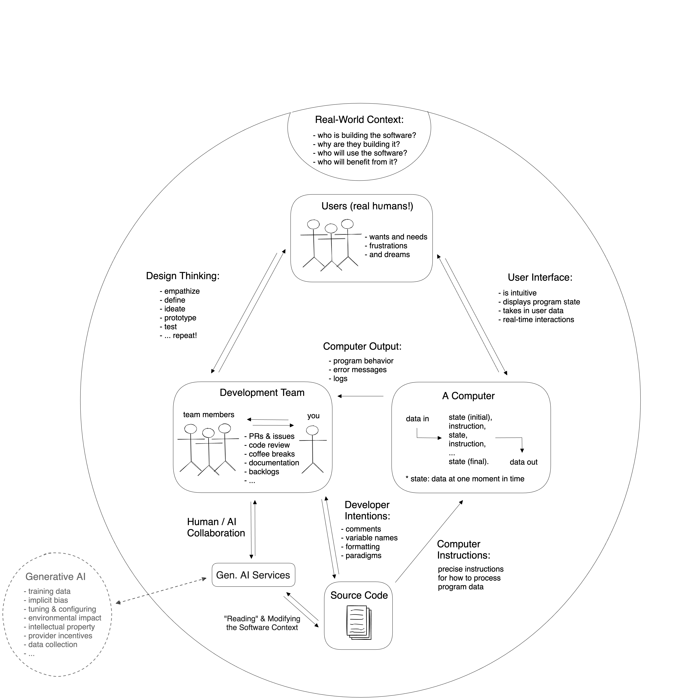
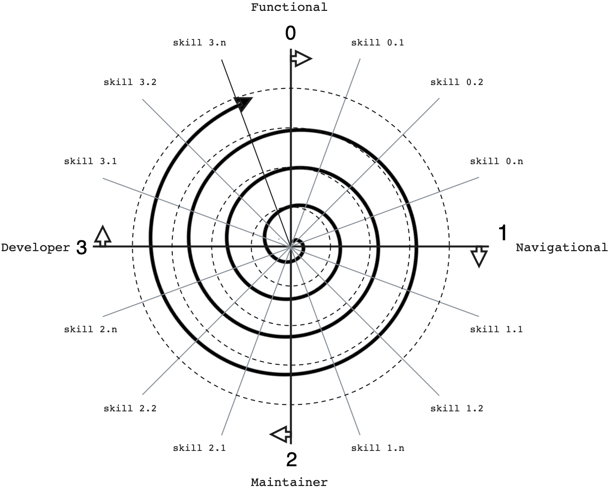

# Course Expectations

Setting the right mindset for the learning process:

- **The focus is on _you_ understanding code** — not on producing code quickly.
  Comprehension comes first, production follows naturally.
- **Generative AI is part of the picture**, but the focus remains on _you_
  understanding code. AI can write code for you, but it can't understand a
  program _for_ you. Every learning objective in this curriculum is a skill you
  should master without AI — you can use AI to help you learn each skill, but
  you have only mastered it when you can complete the exercises without AI.
  - In the rhetorical model, AI sits _outside_ the main circle — it mediates
    between the development team and the source code, reading and modifying the
    software context. It is not a fourth audience.

    

  - LLM study strategies will be introduced alongside exercise types throughout
    the curriculum. General collaboration strategies, a template study prompt,
    and LLM context documents are provided in
    [`./studying-with-llms/`](./studying-with-llms/).
  - As AI takes on more code production, the ability to read, evaluate,
    describe, and reason about code becomes _more_ important, not less. The
    comprehension-first approach prepares you for the emerging shape of software
    development — where developers spend more time understanding and directing
    code than writing it from scratch.

- **Spirals** — concepts will be revisited repeatedly at increasing depth.
  Something that feels vague now will become concrete later.

  

- **Connections are concepts** — learning individual features isn't enough. The
  connections between features are themselves things you must learn and
  practice. See
  [`./connections-are-concepts.md`](./connections-are-concepts.md).
- **Study Lenses** — exercises are generated from code. The same program can be
  studied in many different ways (tracing, marking syntax, filling blanks,
  Parsons problems, etc.). See [`./exercise-types.md`](./exercise-types.md).
