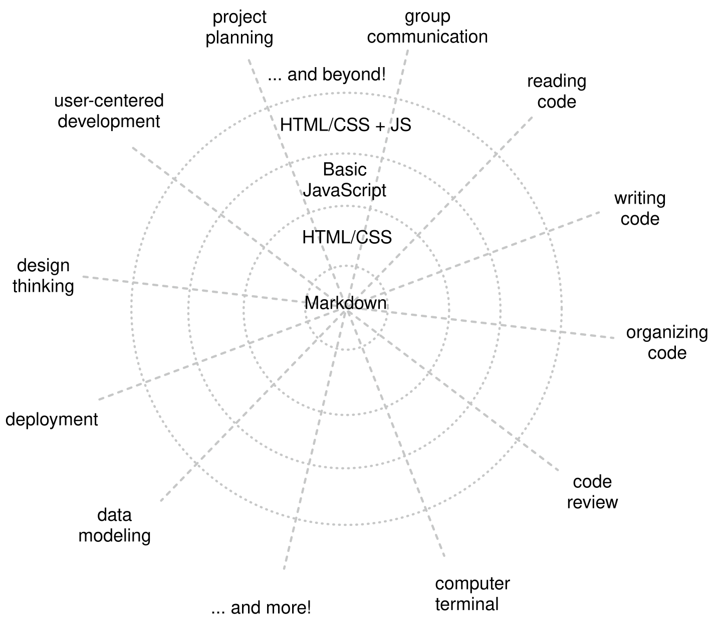

# Learning Expectations

This document is a reference. You do not need to read it before you start, and
you do not need to remember all of it. It is here for when you are in the middle
of something hard and want context for what you are experiencing.

## The Big Picture

This course is one turn of a larger spiral. You will revisit the same core ideas
— reading code, tracing execution, reasoning about values and scope — many times
across WtP, Welcome to Algorithms, Trees, and Separation of Concerns. Each turn
goes deeper. What feels out of reach in one chapter becomes obvious after the
next pass.

Skills in programming grow as a web, not a ladder. Reading code, tracing
execution, understanding algorithms, working with data structures — these
connect and reinforce each other. No skill is learned once and finished; each
course spirals back through the same core skills at a deeper level. The diagram
below, adapted from the [spider web curriculum model](https://denepo.js.org/web-development-curriculum#the-curriculum-a-spider-web),
shows that structure: concentric rings of depth, radial threads of skill.

Connections, too, are concepts: every new idea you build in this course is an
addition to a network, not a discrete fact to memorize. See:
https://evancole.be/notes/#/page/connections%20are%20concepts

---

## Threshold Concepts

Programming has some ideas that are not like other ideas. They are
**transformative** — once you understand them, you see code differently. They
are **hard-won** — they do not arrive from reading an explanation alone; they
arrive from the accumulated experience of predicting, being wrong, and updating.
And they are **irreversible** — once you have them, you cannot un-have them.

These ideas are called threshold concepts. Some key ones for this course:

- Source code (static) vs. program execution (dynamic) — the program you read
  and the program that runs are related but not the same thing
- Tracing code execution — following what the machine does step by step
- Variables as named memory with lifecycle — a variable is not just a label; it
  is a slot that is created, initialized, used, and eventually leaves scope
- Scope and the scope chain — where the machine looks when it needs a value

The exercises in this course are sequenced and designed to reliably bring you to
these concepts. If you do the work — predict, check, update — you will get
there.

## The Liminal Zone

Between "I do not understand this" and "I understand this" is a third state.
Researchers call it the **liminal zone**: you are in transition, things feel
unstable, your predictions are wrong in ways you cannot fully account for yet.

You will spend time here, especially in Chapter 2.

Two states to distinguish:

- **Stuck** — you cannot form a prediction at all. The concepts are too
  unfamiliar. This is a signal: you need more input. Reread the reference
  material. Trace a simpler example. Ask for help.
- **In the zone** — you can form predictions, but they keep being wrong in
  specific, interesting ways. This is the liminal zone. This is the work. Stay
  in it.

The discomfort of being in the zone is not a sign that you are doing it wrong.
It is a sign that the threshold concept is forming — and that it will be
transformative when it does.

## Predict → Be Wrong → Update

The predict-verify loop is not a technique you use occasionally. It is the
epistemology of this course — the way knowledge is built here.

1. **Predict** — before running or tracing the code, write down what you think
   will happen
2. **Check** — run it, trace it, verify
3. **Update** — if you were wrong, do not move on. Find the exact point where
   your prediction and the machine's behavior diverged. That point is the
   location of a gap in your model.

Being wrong is not failure. It is the most precise information the machine gives
you about where your mental model diverges from reality. Seek out being wrong.
Make falsifiable predictions. The more specific the prediction, the more useful
the feedback.

## Just Enough JavaScript

This course uses a deliberately restricted subset of JavaScript called Just
Enough JavaScript (JEJ). Classes, most array methods, async/await, modules,
destructuring, generators — all excluded.

This is not an oversight. Fewer features means more cognitive bandwidth for the
concepts that actually matter in Chapters 1–4: how the machine executes, how
values and bindings behave, how control flow works.

The constraints are temporary:

- Chapter 5 lifts most of them
- Welcome to Algorithms adds functions, arrays, and objects — and uses them to
  study algorithms
- Trees and Separation of Concerns add DOM manipulation and module structure

If a feature is missing, the answer is almost always: it is coming, and it will
make more sense when it arrives.

## Chapter 2

Chapter 2 is the hardest part of this course. We know this. You will know it
too.

The programs are small and abstract. The exercises feel mechanical. You are
learning the machine before you can build anything with it — which means the
work feels disconnected from visible results for longer than you might expect.

This is temporary and intentional. The machine literacy you are building in
Chapter 2 is the foundation that every subsequent chapter stands on. Chapters 3,
4, and 5 become tractable because of what you build here. Welcome to Algorithms
becomes tractable because of what you build here.

Push through.

## The Priority Progression

Throughout this course, exercises are tagged with one of four emoji. These mark
the priority level — and serve as a self-assessment tool for gauging where you
are with each skill. The framework is called SOLO.

- 🥚 — Required. This covers the base skills you need to move on. You do not
  need to finish all of them, but you should feel confident you could with
  enough time.
- 🐣 — In progress. You have started all of these and feel you could complete
  them with more time. With effort, you can get through.
- 🐥 — Surveyed. You have studied the examples and started some. Big-picture
  understanding, but not yet confident completing them independently.
- 🐔 — Extension. Not required but related. For when you have finished 🥚, 🐣,
  🐥 and want to push further without losing focus on the main objectives.

When you finish a section, ask yourself: am I at 🥚 (I could do this reliably)?
🐣 (I could with more time)? 🐥 (I have the shape of it)? Use this to decide
where to spend more time before moving on.

In Chapter 4, you will encounter SOLO again as a framework for deciding when it
makes sense to delegate programming tasks to an LLM — and when it doesn't.
