# Narrative Reference — Welcome to Programming (coded for humans)

> A map for curriculum authors. Not student-facing.

This document captures the full vision, metaphor system, and design commitments
for the _Welcome to Programming (coded for humans)_ curriculum. It exists so that future chapter
authors can write with a consistent picture of what the course is doing and why
— without re-deriving it from scratch.

The prose here is deliberately **dry**. It describes the target curriculum voice
rather than demonstrating it. When writing chapter content, read the **Voice for
the Curriculum** section below (not the tone of this document) to calibrate.

Assets are stored in `./assets/` alongside this file. All visualizations are
wrapped in `<details>` blocks with relative-importance caveats so readers can
skim or dive.

---

## Contents

1. [How to use this document](#1-how-to-use-this-document)
2. [The question students arrive with](#2-the-question-students-arrive-with)
3. [The vision in brief (no metaphor required)](#3-the-vision-in-brief-no-metaphor-required)
4. [The expanded cast](#4-the-expanded-cast)
5. [The architect/implementer divide](#5-the-architectimplementer-divide)
6. [The metaphor system](#6-the-metaphor-system)
7. [The four threads](#7-the-four-threads)
8. [Composition and execution — the two phases](#8-composition-and-execution--the-two-phases)
9. [The score as the one shared artifact](#9-the-score-as-the-one-shared-artifact)
10. [The composer's critical ear](#10-the-composers-critical-ear)
11. [Arrangement and variation — working with existing scores](#11-arrangement-and-variation--working-with-existing-scores)
12. [Composer pedagogy — the spine of the curriculum](#12-composer-pedagogy--the-spine-of-the-curriculum)
13. [The rhetorical model through the metaphor](#13-the-rhetorical-model-through-the-metaphor)
14. [The spiral through the metaphor](#14-the-spiral-through-the-metaphor)
15. [PBSI and code reading through the metaphor](#15-pbsi-and-code-reading-through-the-metaphor)
16. [AI collaboration through the metaphor — the 8 skills](#16-ai-collaboration-through-the-metaphor--the-8-skills)
17. [The notional machine from multiple angles](#17-the-notional-machine-from-multiple-angles)
18. [The Victor / NM visualization distinction](#18-the-victor--nm-visualization-distinction)
19. [Historical anchors](#19-historical-anchors)
20. [Victor's wish, decomposed](#20-victors-wish-decomposed)
21. [The honest framing — LLMs are often better](#21-the-honest-framing--llms-are-often-better)
22. [The verification limit and the rise of agile-visible discipline](#22-the-verification-limit-and-the-rise-of-agile-visible-discipline)
23. [The PL-future](#23-the-pl-future)
24. [Chapter 5 — Developers, Computers, Users, Agents, and You](#24-chapter-5--developers-computers-users-agents-and-you)
25. [Voice for the curriculum](#25-voice-for-the-curriculum)
26. [Characters](#26-characters)
27. [Smaller connections (noted for later chapter authors)](#27-smaller-connections-noted-for-later-chapter-authors)
28. [Open questions and follow-ups](#28-open-questions-and-follow-ups)

---

## 1. How to use this document

- **Read sequentially** the first time. The vision and the metaphor are
  presented in an order that builds.
- **Dip in by section** for later reference. Section titles are descriptive; the
  table of contents makes topics findable.
- **Relative-importance caveats on visualizations** — each `<details>` block is
  tagged _(most load-bearing)_, _(supporting)_, or _(optional extra angle)_. If
  you're short on time, the load-bearing visuals are enough.
- **When the metaphor serves the vision, use it. When it strains, drop it.** The
  vision stands on its own (§2–§3). The metaphor (§4+) is illustration, not
  argument.

---

## 2. The question students arrive with

> _Why learn to code when LLMs write code?_

**Short answer:** designing computation is not the same work as writing the
notation for it. Both matter. The design work is harder to delegate. And there
are also reasons to program that aren't about productivity at all.

---

## 3. The vision in brief (no metaphor required)

### Programming languages as notation

A programming language is a notation system for describing computation to a
machine. A compromise between how humans think and how machines work. The
machine executes what you write — exactly, blindly, without interpretation or
judgment. This is the fundamental nature of programming regardless of which
language you use.

**Pedagogical note**: although we call it a "language," the computer doesn't
read code as language at all — it reads code as a _data structure_ (parsed tree
of tokens and nodes). Compilers and interpreters traverse this structure; they
don't interpret intent or meaning. This is why precision matters: there is no
reader on the other end who can fill gaps. The "language" framing serves the
human side of the compromise; the "data structure" framing serves the machine
side. Both are true simultaneously, and both should be visible to students.

### Notional machines

Every programming language describes computation through an imaginary machine
— its _notional machine_. Each language has its own, with its own rules,
capabilities, constraints, and failure modes. A given language can also be
understood through more than one NM framework: different pedagogical accounts
can emphasize different aspects of the same underlying machine (for example,
a stack-and-heap account vs. a scope-chain account of JavaScript — both are
valid NMs of JS). "The notional machine" is a category, not a universal
referent.

You don't need to understand below the notional machine you're working with;
the interpreter handles compilation, optimization, hardware — invisible to
you. You DO need to understand how that particular NM operates. Some parts
are black-boxed (built-in APIs like `Math.random`) — known by interface, not
internals.

**The NM as programming target, not passive model**: the notional machine
isn't something students study abstractly. It's what they program. Code is
how you direct the NM to do what you want. That's what programming _is_,
fundamentally — instructing a notional machine through notation it
interprets exactly.

**Why NM understanding matters _more_ in an LLM-assisted world, not less**:
this is the counterintuitive pedagogical implication of the LLM shift and is
worth emphasizing in chapter framings. With LLMs in the loop, the notation
layer can be partly delegated, but the NM cannot. The LLM writes the score;
the mechanism plays what's notated; but the learner is still the one
directing what the mechanism should do. With an LLM the learner can abstract
away much of the notation layer and program the NM more directly — through
prose conversation with the LLM, grounded in NM understanding. But that
route only works if the learner understands the NM well enough to specify
outcomes the NM can actually produce and to evaluate whether the LLM's
output produces them. Without NM understanding, the learner can't direct the
LLM meaningfully and can't judge its output. The NM, in this sense, becomes
_more_ central as notation becomes _less_ required.

**Pedagogical payoff**: by deeply understanding key portions of JavaScript's
NM (through JEJ), learners are doing more than learning JavaScript. They're
learning what it means to master a programming language — how to build a
mental model of a notional machine from the outside, how to read code
against that model, how to predict and debug execution, and **how to direct
the machine precisely — via notation or (in an LLM-assisted workflow) via
prose grounded in NM understanding**. That discipline transfers. The
curriculum is designed to produce that transferable capacity, not just JS
fluency.

**Note on "mastery"**: "mastery" here means deep understanding of **key
portions**, not encyclopedic coverage. JavaScript's NM has enormous surface
area; no one masters all of it. JEJ scopes mastery to the core constructs
that carry transferable insight. The curriculum's target is mastery of those
key portions, and the meta-skill of deepening NM understanding more broadly
over time.

### The NM made concrete: two viewing levels and a tracer

The JS notional machine defined for this curriculum has two viewing levels:

- **Visual-syntax level** (what the code does): expressions and statements
  — the control panel
- **Behind-the-scenes level** (what the VM does invisibly): values,
  bindings, scopes, coercion — the machine itself

The code text is a representation designed to help us program the machine;
it is not the machine. Study Lenses' tracer captures every observable moment
of the behind-the-scenes level as structured events: scope creation, binding
lifecycle (declare → initialize → available → access → update), expression
resolution, coercion, scope chain walks, prototype chain lookups, I/O
channel interactions.

The tracer's config structure is itself pedagogically significant: by
enabling/disabling event categories (`{ bindings: true }` for variable
lifecycle only, `{ resolve: true }` for data flow only, `{ scopes: true }`
for scope structure), teachers expose specific NM mechanisms selectively.
Students experience the machine through controlled visibility.

**The vibecoding distinction (assessable)**: a vibecoder produces code they
can't predict — they iterate on visible behavior without a model of the
machine. A programmer can predict the machine's events, evaluate whether
output matches intent, and diagnose divergence. With or without an LLM,
prediction is what separates programming from vibing. The curriculum targets
"deep and demonstrable" NM mastery: students predict every event category
the tracer captures, verified by auto-correcting trace tables and
trace-generated quizzes.

For the full NM specification, tracer config, and event-sequence
walkthroughs, see:

- `src/lib/welcome-to-programming/just-enough/javascript/notional-machine.md`
- `src/lib/welcome-to-programming/just-enough/javascript/tracer.md`
- `src/lib/welcome-to-programming/just-enough/javascript/tracer.architecture.md`

### Why focus on the machine, not the output

This curriculum cares very little about what the final computation _does_ —
whether it's a web app, a game, a data pipeline, an ML system. It focuses on the
machine that makes whatever-it-is happen. This is a domain-independence
commitment: understanding the NM prepares students for a broader computational
future than any specific domain-based introduction could.

This also distinguishes our visualization commitment from Bret Victor's
influential essay _Learnable Programming_. Victor visualized _outputs_ (what
programs produce — shapes, positions, values). Our Study Lenses visualize the
_computer's internals_ (how the machine is doing it — state, scopes, bindings,
execution order). Different pedagogical targets. Both valuable, but distinct. We
chose the machine side deliberately.

### The architect/implementer division has always existed

Software has always had a design-work / notation-work split: architect /
implementer (cf. Fred Brooks), staff engineer / junior, consultant / in-house,
design-phase / build-phase within solo work, greenfield developer /
contributor-to-an-existing-codebase. Even when these roles aren't explicitly
divided, both types of work are necessary and the best programming happens when
the two sides coordinate effectively. The division of labor is old territory,
not an LLM invention.

### The pre-LLM double burden

To program, you needed NM understanding AND full notation fluency simultaneously
— both in one head, or split across a small team. This simultaneous demand is a
large part of what makes programming hard to learn and master.

### The LLM shift: a new participant in an old dance

Human "virtuosos" (senior engineers, pair partners) have always been part of the
picture. LLMs are a new kind of virtuoso — same role, different cognition.
Chapter 4 develops the specific differences.

**Honest framing**: LLMs are often better at notation than many humans — faster,
more exhaustive, fewer typos. Pretending otherwise is dishonest. But:

- Great programming isn't only about productivity
- Design judgment, context awareness, aesthetic and ethical taste aren't LLM
  strengths
- Chapter 5 (Snippetry) is the case for programming-for-its-own-sake

**The verification limit and the rise of agile-visible discipline**: we don't
always understand what we direct. Even our tests may be out of our depth — it is
possible to verify that a program does the _wrong thing correctly_. In an
LLM-assisted workflow, certain practices matter **more**, not less:

- Short iterations producing user-visible behavior we can actually evaluate
- Human-evaluable acceptance criteria (the behavior layer that stays within
  cognitive reach even when code doesn't)
- Testing discipline oriented toward user-level outcomes, not just unit-level
  code tests
- Treating every change as a small, visible, evaluable increment

Chapter 3 (users, PBSI, visible behavior) therefore carries particular weight.

**Simplified-model caveat**: this frame treats LLMs as authoring partners.
Agentic systems where LLMs plan, execute, call tools, and modify state
autonomously are a more complex picture deferred to later learning.

### Bret Victor's wish, decomposed

Victor wanted _less toil_ AND _more visibility_, both at once. LLMs decompose
the wish:

- ✅ Less toil — notation burden partially lifted by LLMs
- ❌ Less visibility — LLM-generated code arrives as a fait accompli; the
  mechanism is more hidden, not less
- ✅ Study Lenses reclaims visibility of the machine's internals (the
  curriculum-relevant form of Victor's wish)

### The four threads

1. **Twinning** (baseline) — accurate mental models of processes outside your
   mind
2. **Decisions (micro and macro)** — every keyword, name, operator, structure
   (micro) AND architecture, paradigm, program shape (macro) reaches the twinned
   audiences. Both levels explicitly. This is where _compositional voice_
   develops — cultivating voice is a real curriculum aim, not a side effect.
3. **Perspective stacking** — holding twinning and decisions across multiple
   simultaneous levels
4. **The whole rhetorical situation** (enabled by the prior three) — the entire
   software context: users, developers, computer, product, environment

Each layer enables the next. The fourth requires additional skills (stakeholder
analysis, design thinking) built on perspective stacking.

### Snippetry

The practice for keeping programming alive for its own sake. Small, runnable,
self-contained programs that balance broad exploration with productive
constraints. Programming for mastery, delight, surprise, discovery, and the new
thoughts programming lets you think. Chapter 5 opens the full JS language
(multi-paradigmatic exploration, real browser execution, four sandbox modes) and
a collaborative gist system for sharing and remixing with peers. The spirit can
be carried informally from Chapter 0.

### The PL-future

Currently, LLMs work with programming languages designed _for humans_ — machines
using controls built for humans. A future where LLMs design their own
formally-provable languages is possible. Those languages would likely defy our
notions of "high-level" and "low-level" — adjectives that measure distance from
_human_ cognitive convenience, which wouldn't apply to languages designed for
alien minds.

In such a future, the agile-visible-discipline story intensifies further: when
we can't read the code AND can't evaluate the tests, user-visible behavior is
what's left to check against.

Even then, human-designed PLs remain worth cherishing — for their humanity, how
they shape thinking, the new thoughts they give us, and our connection to
computational history.

---

## 4. The expanded cast

The metaphor has six roles, not three audiences. Role ambiguity is a feature:
students see themselves in several of these at different moments.

| Actor                 | Variants        | Role                                                                                |
| --------------------- | --------------- | ----------------------------------------------------------------------------------- |
| **The Composer**      | human or alien  | designs the computation; knows the instrument's capabilities; aware of the audience |
| **The Virtuoso**      | human or alien  | notation mastery; feel for the controls; produces the score from direction          |
| **The Mechanism**     | (always itself) | the mechanical instrument — plays the score blindly, deterministically              |
| **The Audience**      | (human)         | concert-goers — react audibly (cheer, boo, throw tomatoes or flowers)               |
| **Co-composers**      | (human)         | fellow score-readers — read each other's work for intent and style                  |
| **Historical cameos** | (human)         | Mozart, Bach, Ligeti, Lovelace, Babbage — as sidebars                               |

<details>
<summary><b>Visualization: expanded cast diagram</b> <i>(most load-bearing)</i></summary>

```
                        ┌─────────────────────┐
                        │   THE COMPOSER      │ (human or alien)
                        │   ─ intent          │
                        │   ─ audience aware  │
                        │   ─ knows inst.     │
                        └──────────┬──────────┘
                                   │ directs
                                   ▼
                        ┌─────────────────────┐
                        │   THE VIRTUOSO      │ (human or alien)
                        │   ─ notation        │
                        │   ─ feel for ctrls  │
                        └──────────┬──────────┘
                                   │ transcribes into
                                   ▼
                        ┌─────────────────────┐         CO-COMPOSERS
                        │      THE SCORE      │ ◄─────── (read for intent
                        │      (artifact)     │          & style)
                        └──────────┬──────────┘
                                   │ played by
                                   ▼
                        ┌─────────────────────┐
                        │    THE MECHANISM    │ (JS engine / NM)
                        │    blind · exact    │
                        └──────────┬──────────┘
                                   │ produces
                                   ▼
                        ┌─────────────────────┐
                        │    THE AUDIENCE     │ (users)
                        │    react audibly    │
                        └─────────────────────┘
```

</details>

### Role ambiguity — students don't get pinned

The curriculum does not tell students which role they are. Implicitly it shapes
them toward **composer-dominant fluency** (via Chapter 2's NM depth and
comprehension-before-production). But students are also proto-virtuosos when
writing JEJ snippets, audience members when using other software, co-composers
when reading others' code. Endpoint: composer-dominant, fluent enough to play
but mostly directing.

### Virtuoso origins

Alien virtuosos (LLMs) were originally trained on human virtuosos' work. They
are derivatives — averaged, patterned, flattened versions of what humans have
done. This explains where they excel (common patterns well represented in
training) and where they fail (novel or rare territory). The "alien" cognition
is _downstream of_ human cognition, not from a different planet.

### Alien composers (teased, deferred)

Agentic systems that do design work — not just notation — are emerging. These
are _alien composers_, not just alien virtuosos. The curriculum teases this in
two specific places:

- **Chapter 4.5 (looking forward)** — natural extension: "virtuosos today;
  composers emerging"
- **Chapter 5 closing** — after celebrating programming-for-its-own-sake, note
  that alien composers are arriving and changing the design work too

Full treatment is deferred to _Welcome to Algorithms_ and post-curriculum
learning.

---

## 5. The architect/implementer divide

The composer/virtuoso split is not new with LLMs. Software has always had this
division:

- **Fred Brooks' architect/implementer** (_The Mythical Man-Month_) — the
  architect designs the system; implementers build it
- **Staff / senior / junior engineer gradients** — higher-ranked engineers spend
  more time on design, less on typing
- **Consultant / in-house splits** — external architects define, internal teams
  build
- **Greenfield developer / contributor-to-existing-codebase** — very different
  balances of design vs. notation
- **Design-phase / build-phase even in solo work** — the same person alternates
  between modes

LLMs enter as a new participant in an already-established division.

<details>
<summary><b>Visualization: architect/implementer continuity timeline</b> <i>(supporting)</i></summary>

```
PAST                         RECENT                     NOW
────────────────────────────────────────────────────────────────
Architects                   Senior engineers /         Senior engineers +
+ implementers               contractors + teams        human virtuosos +
(Brooks, 1975)               (agile era)                ALIEN virtuosos (LLMs)
                                                              │
                                                              ▼
                                                        Same division,
                                                        new participants.
                                                        Not a new dance.
```

</details>

---

## 6. The metaphor system

### Full mapping

| Element         | Mechanical-instrument world                                                              | Programming world                                           |
| --------------- | ---------------------------------------------------------------------------------------- | ----------------------------------------------------------- |
| The instrument  | A mechanical instrument (varied: pipe organ, player piano, music box, beat machine, ...) | The JS notional machine                                     |
| The medium      | The score — notation the mechanism reads blindly                                         | Source code                                                 |
| Actor 1         | The Composer — human or alien                                                            | Student (designer) — computational intent, NM understanding |
| Actor 2         | The Virtuoso — human or alien                                                            | Implementer (often an LLM) — syntax, idioms, libraries      |
| Listeners       | Concert audience + co-composers + the mechanism                                          | Users + other developers + the computer                     |
| Black-boxed     | Stops, combination actions — known by output                                             | Built-in APIs — known by interface                          |
| The whole event | The recital                                                                              | The rhetorical situation                                    |

<details>
<summary><b>Visualization: metaphor mapping (side-by-side)</b> <i>(most load-bearing)</i></summary>

```
MECHANICAL-INSTRUMENT WORLD           PROGRAMMING WORLD
─────────────────────────────────     ──────────────────────────────
Mechanical instrument           ◄───►  Notional machine (NM)
Score                           ◄───►  Source code
Composer (human or alien)       ◄───►  Designer / student
Virtuoso (human or alien)       ◄───►  Implementer / LLM
Concert audience                ◄───►  Users
Co-composers                    ◄───►  Other developers
Stops / combinations            ◄───►  Built-in APIs
Recital                         ◄───►  Rhetorical situation
```

</details>

### Why a _mechanical_ instrument (not a human performer)

A mechanical instrument plays the score **blindly** at runtime — no human in the
execution loop. This cleanly separates two phases:

- **Composition phase**: composer + virtuoso collaborate iteratively on the
  score. LLMs live here.
- **Execution phase**: the mechanism plays the score exactly as written. No LLM,
  no interpreter with judgment.

This matches JS's deterministic execution. The precision required in the score
matters because there is no performer to rescue a badly-notated passage. The
mechanism does not interpret.

### Why _varying_ instruments

The specific instrument is **not central**. Different instruments serve
different moments across the curriculum and improve cultural accessibility by
not anchoring everything to European classical tradition. Good candidates:

- **Pipe and mechanical organs** — introductory (visible, incrementally-layered
  mechanics)
- **Orchestrions, Mekaniks, player pianos** — complex mechanical (scaling up)
- **Music boxes / one-note instruments** — constraint-as-generative (cf. Ligeti)
- **Drum machines and beat machines** — contemporary, culturally accessible
- **MIDI sequencers** — fully programmatic
- **Gamelan with karakuri puppet mechanisms** — non-European automated tradition

The rule: preserve the composer/virtuoso/mechanism split with automated
execution. Within that, range widely.

### Why "virtuoso" specifically (not "performer," not "arranger")

Captures technical mastery without ownership of compositional vision. "Different
automated skillsets" — the virtuoso isn't a failed composer; they've automated a
complementary skillset (notation fluency, idiom, instrument-specific knowledge).
Preserves the honest "LLMs are often better at this, and that's OK" framing.

### The "may not know how to play" nuance

Composers aren't _unable_ to perform — they can pluck out a harmony to hear it
in the room. But they haven't automated the thousands of motor patterns needed
for virtuosic performance. They've automated a _different_ skillset: musical
theory, audience awareness, stylistic judgment.

Direct analog: comprehension-before-production. Students learn to read, trace,
and evaluate code deeply; they write small programs to verify understanding; but
they don't need to automate fluent production because the virtuoso handles it.

<details>
<summary><b>Visualization: composer vs. virtuoso skill profiles</b> <i>(supporting)</i></summary>

```
COMPOSER                              VIRTUOSO
─ intent & computational design       ─ full notation fluency
─ audience awareness                  ─ idiom & pattern automation
─ NM understanding                    ─ library & API depth
─ aesthetic & stylistic judgment      ─ speed
─ critical ear (can trace, can        ─ multi-voice execution
   evaluate, can debug)                  ability
─ fluency enough to "pluck out
   a harmony"
```

Neither is a failed version of the other. Different automated skillsets, serving
different parts of the work.

</details>

### Depth at any scale (Ligeti's _Musica Ricercata_)

JEJ's "few options, many possibilities" has direct musical precedent: **György
Ligeti's _Musica Ricercata_** opens with a movement using only the note A, then
each subsequent movement adds one note until the eleventh uses all twelve.
Systematic exploration under extreme constraint, producing serious modernist
music from radical limitation.

The principle:

- **JEJ** = depth at small language-feature scale
- **Snippetry** = depth at small-program scale
- **Professional work** = depth at codebase scale

Same practice at different scales. A one-note mechanical music box playing
Ligeti and a full Mekanik orchestra playing Mahler both illustrate the metaphor
cleanly. _Musica Ricercata_ is a candidate epigraph or sidebar for Chapter 5.

---

## 7. The four threads

1. **Twinning** (baseline)
2. **Decisions (micro and macro)** — where compositional voice develops
3. **Perspective stacking** (mastery)
4. **The whole rhetorical situation** (enabled by the prior three)

<details>
<summary><b>Visualization: four-thread arc</b> <i>(most load-bearing)</i></summary>

```
        ┌──────────────────────────────────────┐
   4    │  THE WHOLE RHETORICAL SITUATION      │   enabled by
        │  (the entire recital / software      │   3 + 2 + 1
        │   context; design thinking)          │
        ├──────────────────────────────────────┤
   3    │  PERSPECTIVE STACKING                │   enabled by
        │  (holding multiple levels at once)   │   2 + 1
        ├──────────────────────────────────────┤
   2    │  DECISIONS (micro + macro)           │   enabled by
        │  (every choice — keyword to          │   1
        │   architecture — reaches audiences)  │
        │  ► where compositional voice lives   │
        ├──────────────────────────────────────┤
   1    │  TWINNING                            │   baseline
        │  (accurate mental models of others)  │
        └──────────────────────────────────────┘
```

</details>

### How each thread lands in the metaphor

<details>
<summary><b>Visualization: threads mapped to musical world</b> <i>(supporting)</i></summary>

| Thread                     | Musical translation                                                                                   |
| -------------------------- | ----------------------------------------------------------------------------------------------------- |
| Twinning                   | Understanding the mechanism, the virtuoso, the audience, and the hall — each modeled from the outside |
| Decisions                  | Every note, stop, registration, tempo mark, AND every large-scale structural choice                   |
| Perspective stacking       | Hearing trackers, voicings, pipes, air pressure, audience reactions, acoustics — at once              |
| Whole rhetorical situation | The entire recital — venue, program, audience, emotional arc, cultural moment                         |

</details>

---

## 8. Composition and execution — the two phases

Composition and execution are structurally distinct in this metaphor. It's the
key separation that makes the mechanical-instrument framing work.

<details>
<summary><b>Visualization: two-phase diagram</b> <i>(most load-bearing)</i></summary>

```
   ┌──────────── COMPOSITION PHASE ────────────┐     ┌── EXECUTION PHASE ──┐
   │                                           │     │                     │
   │    ┌──────────┐  directs  ┌──────────┐    │     │   ┌─────────────┐   │
   │    │ Composer │ ◄───────► │ Virtuoso │    │     │   │  Mechanism  │   │
   │    └──────────┘           └──────────┘    │     │   │  (blind,    │   │
   │           │                    │          │     │   │   exact)    │   │
   │           └──── iterating ─────┘          │     │   └──────┬──────┘   │
   │                    │                      │     │          │          │
   │                    ▼                      │     │          ▼          │
   │              ┌─────────┐                  │     │    ┌──────────┐     │
   │              │  SCORE  │ ─────────────────┼─────┼───►│   Sound  │     │
   │              │ (code)  │                  │     │    │  (output │     │
   │              └─────────┘                  │     │    │  / user  │     │
   │                                           │     │    │   exp.)  │     │
   └───────────────────────────────────────────┘     │    └──────────┘     │
           human-in-the-loop, iterative              │   deterministic,    │
           LLMs live here                            │   no LLM here       │
                                                     └─────────────────────┘
```

</details>

At runtime the mechanism plays exactly what's notated. No performer, no
interpreter-with-judgment to rescue bad notation. This is why precision in the
score matters.

<details>
<summary><b>Visualization: composition loop (mermaid sequence)</b> <i>(supporting)</i></summary>

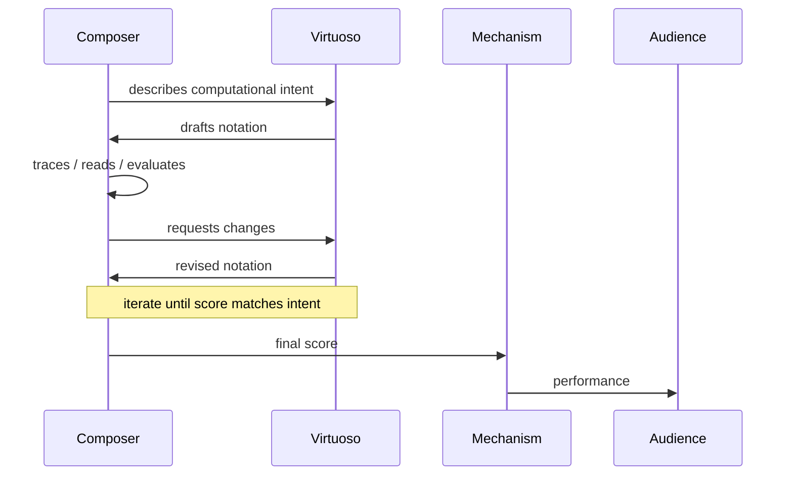

</details>

<details>
<summary><b>Visualization: execution-time isolation</b> <i>(supporting)</i></summary>

```
At runtime:
─────────────
 ┌─────────┐     ┌──────────────┐     ┌──────────────┐
 │  SCORE  │ ──► │  MECHANISM   │ ──► │   OUTPUT /   │
 │ (code)  │     │ (plays       │     │  USER EXP.   │
 └─────────┘     │  blindly)    │     └──────────────┘
                 └──────────────┘

No composer. No virtuoso. Just notation and mechanism.
If the notation is wrong, the output is wrong.
```

</details>

### Note on time and musical form (brief, not developed)

Execution unfolds in time, just as music does. Control flow has musical-form
analogs — sequential lines as melody, loops as repetition, branching as
alternate endings or ornaments, polyphony as concurrency/async. These are
pointers for later chapters; this document does not develop them further.

---

## 9. The score as the one shared artifact

All the roles of the cast — composer, virtuoso, mechanism, co-composers,
audience — interact through **one artifact**: the score.

- **Co-composers** read it for intent and style
- **Virtuosos** transcribe and interpret it
- **The mechanism** plays it blindly
- **The audience** experiences it through the mechanism

In programming terms: code is what everyone converges on. Other developers read
it (for intent and style). The computer executes it. Users experience the
running program (through execution). The score is _the_ unifying artifact.

### The score as artifact of intent, not just notation

Reading a score well isn't decoding notation — it's _hearing the music behind
the notation_. Same for code: reading well means understanding the computation
behind the syntax. This matches PBSI's Purpose / Behavior / Strategy /
Implementation layering: notation is the Implementation layer; Purpose lives
above it.

---

## 10. The composer's critical ear

Most of programming's real work lives here: running code, observing, diagnosing
divergence between intent and execution, fixing the score. This is what
comprehension-before-production is _building_.

In musical terms: the composer at rehearsal, listening with the score in hand.
_"No, hold that chord a beat longer. Why does that transition sound muddy? Let
me see the score."_ The composer's judgment runs continuously against the
performance.

### Study Lenses is both training wheels AND power tools

Study Lenses serves two distinct pedagogical roles:

- **Training wheels** — scaffolding the student's internal hearing by making
  execution visible at first. The student develops intuitions about what the NM
  is doing because they can _see_ it doing those things. Over time, the visible
  becomes internalized.
- **Power tools** — extending the internal ear to executions that are simply too
  complex to fully internalize. Even a strong internal model benefits from
  externalization when complexity overwhelms working memory.

Crucially: Study Lenses is built for how **human** minds learn, think, and
experience code. It's not a neutral "visualize execution" tool; it's a
_human-centered_ tool. Trace tables, variable highlighting, predictive stepping
— all of these work with human cognition (limited working memory, need for
externalization, visual thinking). An LLM doesn't need Study Lenses; it has its
own internal ways of processing code. Study Lenses exists for us.

<details>
<summary><b>Visualization: composer's critical ear feedback loop</b> <i>(supporting)</i></summary>

```
  ┌──────────┐       ┌──────────┐       ┌──────────┐
  │  SCORE   │ ──►   │MECHANISM │ ──►   │ OBSERVED │
  │          │       │ executes │       │BEHAVIOR  │
  └──────────┘       └──────────┘       └────┬─────┘
       ▲                                      │
       │                                      ▼
       │                                ┌──────────┐
       │                                │ COMPOSER │
       │                                │ LISTENS  │
       │                                │ against  │
       │                                │ intent   │
       │                                └────┬─────┘
       │                                     │
       │      diagnoses divergence           ▼
       │                              ┌──────────┐
       └────── revises notation ──────│JUDGMENT  │
                                      └──────────┘
```

This is the loop Study Lenses supports. Predictive stepping, trace tables,
assertions, debugging — all flavors of the composer's ear.

</details>

### Errors — when the mechanism refuses to play

When the score is malformed or asks for something unplayable, the mechanism
stops and says so. In JS: errors thrown. This is _different_ from debugging
(which is about intent-execution mismatch). Errors are the mechanism being
honest about what it can't do.

For beginners, framing matters: an error is not a personal failure. The
mechanism is _helping_ — telling you exactly where the notation is inadmissible.
Errors are the mechanism's most useful honest output.

---

## 11. Arrangement and variation — working with existing scores

Real composers mostly don't write from scratch. They arrange existing pieces for
different instruments, write variations on themes, transcribe, quote, extend
traditions. Bach spent years copying and arranging Vivaldi. Liszt's most famous
works are transcriptions. Brahms wrote "Variations on a Theme by Haydn." These
are serious compositional practices, not lesser work.

Programming is identical. Most code lives in existing codebases. Real work
involves:

- **Arranging** (refactoring, migration, porting) — same music for a different
  instrument
- **Variation** (extending existing code with new features) — a theme elaborated
- **Transcription** (reverse-engineering behavior into code) — hearing a
  performance and writing down the score
- **Quotation** (using libraries, APIs) — referencing existing musical material

<details>
<summary><b>Visualization: arrangement/variation vs. greenfield composition</b> <i>(supporting)</i></summary>

```
GREENFIELD COMPOSITION              ARRANGEMENT / VARIATION
──────────────────────              ────────────────────────
 Start from intent                   Start from existing score
 → write new score                   → understand what's there
 → hand to virtuoso                  → preserve what works
 → performance                       → modify with discipline
                                     → maintain coherence

Both are real composer work.
Most real work is the right column, not the left.
```

</details>

### Parallels the greenfield-vs-contributor distinction

Different developer roles require different composer-vs-virtuoso balances:

- **Greenfield developers** lean toward pure composition — more design work,
  more NM thinking, more decisions from scratch
- **Contributors to large codebases** lean toward arrangement and variation —
  understanding existing scores, preserving conventions, modifying within
  constraints
- Most professional work is somewhere between, and varies day-to-day

Chapter 3's reverse-engineering, modify-programs, and refactoring skills all
live in the arrangement-and-variation domain. Snippetry (Ch 5) is explicitly
greenfield _at small scale_.

---

## 12. Composer pedagogy — the spine of the curriculum

Our learners fill the composer role, not the virtuoso role. Musical composition
training offers specific parallels to this curriculum's skills — not a unified
"composer pedagogy" we're importing wholesale, but individual practices that
illuminate what we're doing and why.

| Composer training                                   | Curriculum parallel                                       |
| --------------------------------------------------- | --------------------------------------------------------- |
| Studying scores (hearing internally)                | **Read** — marking syntax, reading aloud                  |
| Analyzing master composers' works                   | **Describe** — PBSI, code review                          |
| Transcribing performances                           | **Trace tables**                                          |
| Sight-reading exercises                             | Predictive stepping                                       |
| Writing variations on a theme                       | **Modify** — tracked changes to working programs          |
| Counterpoint & harmony exercises (rule-constrained) | Constrained exercises (fill-in-blanks, Parsons)           |
| Arranging existing pieces for new instruments       | **Refactoring, migration, porting**                       |
| Writing variations on existing themes               | **Extending existing code**                               |
| Reverse-engineering a performance into a score      | **Reverse engineering** (Ch 3)                            |
| Listening with score in hand                        | Debugger with source visible; the composer's critical ear |
| Workshopping with performers                        | LLM collaboration (Ch 4)                                  |
| Studying the instrument's mechanics                 | NM deep dive (Ch 2)                                       |
| Designing an entire recital                         | PBSI Purpose + design thinking (Ch 3)                     |
| Small-scale practice (sketches, drills)             | **Snippetry** (Ch 5)                                      |

<details>
<summary><b>Visualization: composer pedagogy connection graph</b> <i>(supporting)</i></summary>

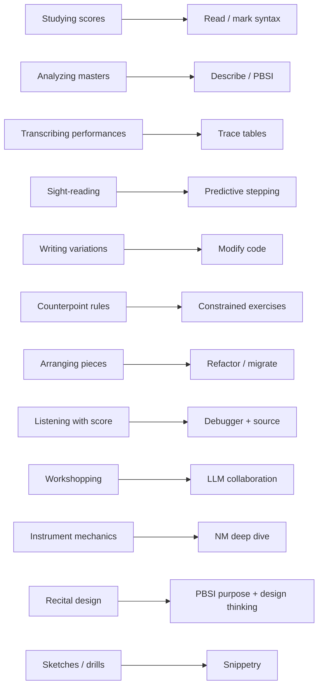

</details>

**The payoff**: the comprehension-before-production pedagogy isn't an eccentric
choice. It echoes centuries of composer training — a tradition of preparing
people to design music well without necessarily being virtuoso performers.

---

## 13. The rhetorical model through the metaphor

The curriculum's rhetorical model — source code simultaneously addresses
developers, a computer, and users — maps cleanly onto the musical world.

<details>
<summary><b>Visualization: the big picture (existing asset)</b> <i>(most load-bearing)</i></summary>


</details>

<details>
<summary><b>Visualization: the big picture plus AI (existing asset)</b> <i>(most load-bearing)</i></summary>

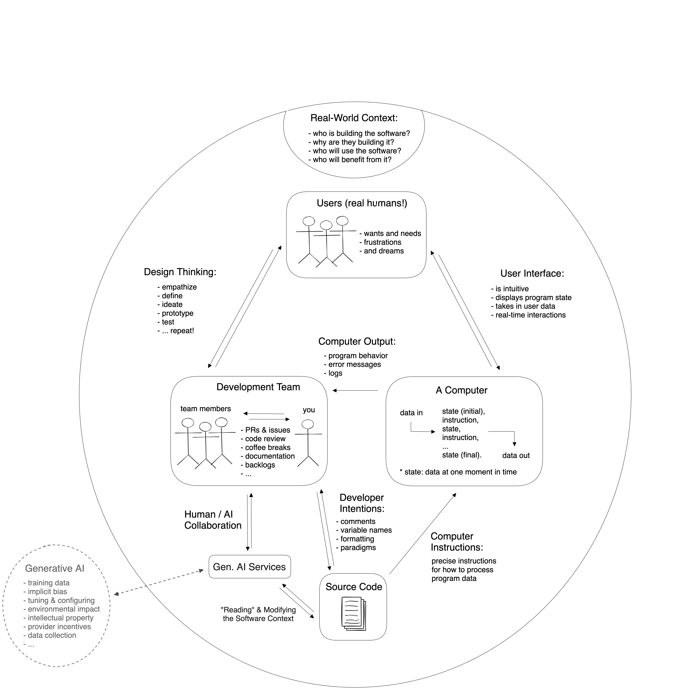

AI sits _outside_ the rhetorical circle — this is exactly the virtuoso's
position in the metaphor. The virtuoso helps write the score but is not one of
the three audiences.

</details>

<details>
<summary><b>Visualization: a program (existing asset)</b> <i>(supporting)</i></summary>

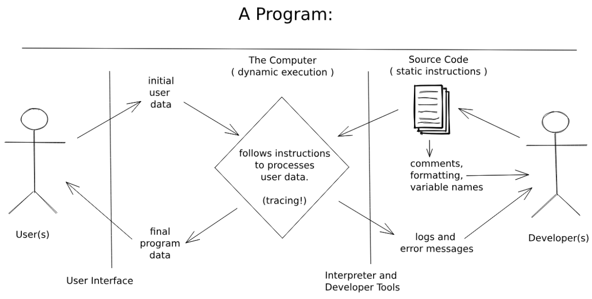

The score _is_ the mediator. Static notation, dynamic performance.

</details>

<details>
<summary><b>Visualization: computers and developers (existing asset)</b> <i>(supporting)</i></summary>

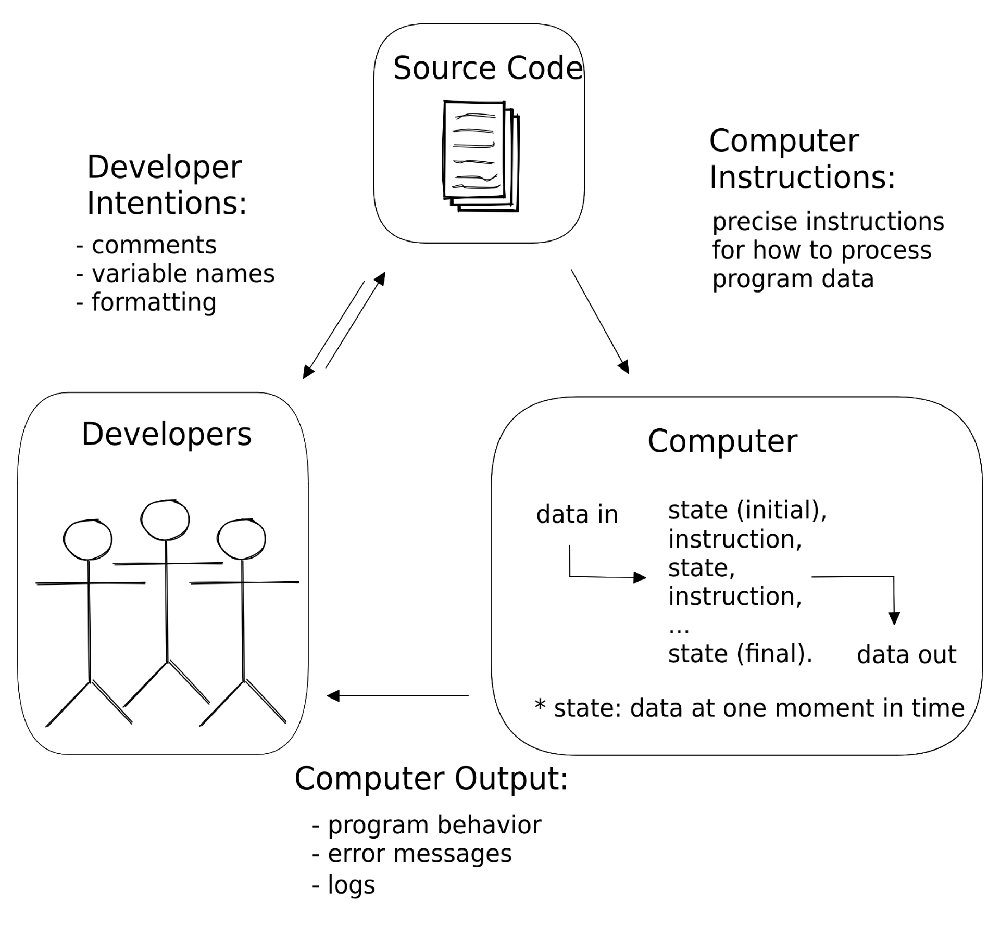

</details>

<details>
<summary><b>Visualization: rhetorical triangles translation (existing asset)</b> <i>(supporting)</i></summary>

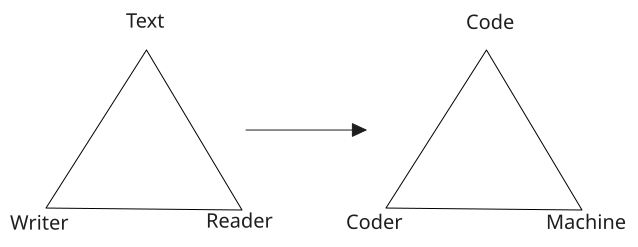

</details>

<details>
<summary><b>Visualization: nested triangles (existing asset)</b> <i>(optional extra angle)</i></summary>

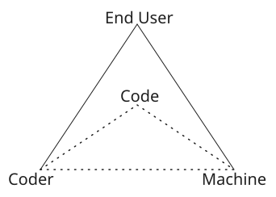

</details>

<details>
<summary><b>Visualization: collaborative writing / coding (existing assets)</b> <i>(optional extra angle)</i></summary>

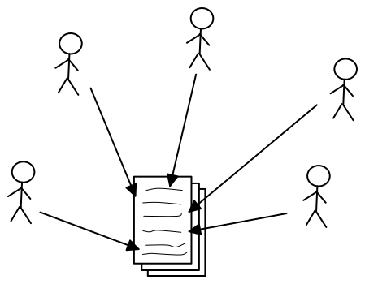

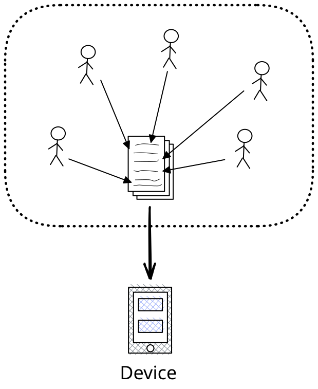

</details>

<details>
<summary><b>Visualization: rhetorical situation (existing asset)</b> <i>(most load-bearing for Section §15)</i></summary>

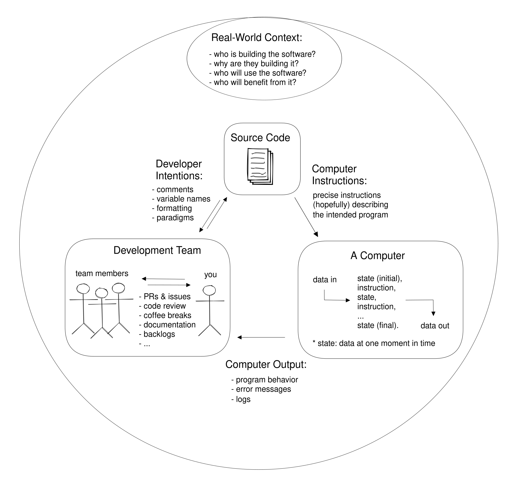

</details>

### The recital version

<details>
<summary><b>Visualization: rhetorical model in recital form</b> <i>(most load-bearing)</i></summary>

```
                  ┌──────────────────────────────┐
                  │    THE RHETORICAL SITUATION  │
                  │    (the entire recital)      │
                  │                              │
                  │    ┌──────────┐              │
                  │    │   SCORE  │              │
                  │    │ (code)   │              │
                  │    └─────┬────┘              │
                  │          │                   │
                  │  read by │  played by        │
                  │    ┌─────┴─────┬─────┐       │
                  │    ▼           ▼     ▼       │
                  │ ┌──────┐  ┌───────┐┌─────┐   │
                  │ │ Co-  │  │ Mech. ││Audi.│   │
                  │ │ comp.│  │       ││     │   │
                  │ └──────┘  └───┬───┘└─────┘   │
                  │               │     ▲        │
                  │               │mediates      │
                  │               └─────┘        │
                  │                              │
                  │     Virtuoso sits OUTSIDE    │
                  │     (helps write the score,  │
                  │     but isn't an audience)   │
                  └──────────────────────────────┘
```

Three audiences for the score. One mediator (the mechanism) between score and
listeners. Virtuoso outside, helping create.

</details>

---

## 14. The spiral through the metaphor

The curriculum's spiral structure — concepts revisited at increasing depth
across chapters — corresponds to a composer's progressive deepening of recital
awareness.

<details>
<summary><b>Visualization: spiral curriculum (existing asset)</b> <i>(supporting)</i></summary>

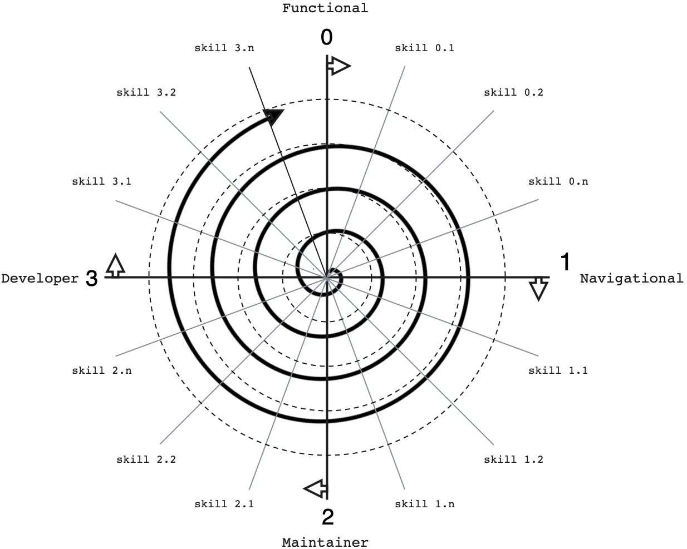

</details>

<details>
<summary><b>Visualization: chapter progression as recital development</b> <i>(supporting)</i></summary>

```
  Ch 0: THE SETTING              → rhetorical model; recital concept
       │
       ▼
  Ch 1: THE SCORE AS NOTATION    → comments; dev-to-dev communication
       │                           (co-composers reading each other)
       ▼
  Ch 2: THE INSTRUMENT'S MECH.   → NM deep dive
       │                           (studying how the mechanism works)
       ▼
  Ch 3: THE AUDIENCE & DESIGN    → users, PBSI, design thinking
       │                           (who listens and what they hear)
       ▼
  Ch 4: THE ALIEN VIRTUOSO       → LLM collaboration
       │                           (workshopping with a new kind of player)
       ▼
  Ch 5: YOU                       → Snippetry: programming for yourself
                                   (the fifth audience; practice,
                                    training wheels off, graduation)
```

</details>

---

## 15. PBSI and code reading through the metaphor

PBSI (Purpose / Behavior / Strategy / Implementation) is the curriculum's
four-layer lens for understanding programs. Each layer corresponds to hearing
music at a different scale.

<details>
<summary><b>Visualization: whole-situation concentric scopes</b> <i>(most load-bearing)</i></summary>

```
┌─────── PURPOSE ─────────────────────────────────────┐
│ (why the piece exists; who it's for; the occasion) │
│  ┌───── BEHAVIOR ──────────────────────────────┐   │
│  │ (what the audience hears and feels)         │   │
│  │  ┌── STRATEGY ──────────────────────────┐   │   │
│  │  │ (the compositional approach —        │   │   │
│  │  │  fugue, sonata, through-composed)    │   │   │
│  │  │  ┌─ IMPLEMENTATION ──────────────┐   │   │   │
│  │  │  │ (specific notes, stops,        │   │   │   │
│  │  │  │  dynamics — the score)          │   │   │   │
│  │  │  └────────────────────────────────┘   │   │   │
│  │  └──────────────────────────────────────┘   │   │
│  └────────────────────────────────────────────┘   │
└────────────────────────────────────────────────────┘

Reading code well means holding all four layers simultaneously.
Perspective stacking (thread 3) operationalized.
```

</details>

### SOLO ↔ musical listening levels

<details>
<summary><b>Visualization: SOLO taxonomy mapped to listening</b> <i>(optional extra angle)</i></summary>

| SOLO level        | Listening analog                                  |
| ----------------- | ------------------------------------------------- |
| Prestructural     | Individual notes without pattern                  |
| Unistructural     | Recognizing a phrase or motif                     |
| Multistructural   | Hearing voices / parts separately                 |
| Relational        | Understanding a whole piece's form                |
| Extended Abstract | Placing the piece in its repertoire and tradition |

This isn't a strict isomorphism, but the progression of "what you can hold in
mind simultaneously" is structurally parallel.

</details>

---

## 16. AI collaboration through the metaphor — the 8 skills

Chapter 4 teaches 8 collaboration skills. Each has a specific composer-virtuoso
activity.

| Skill                  | Composer-virtuoso activity                                                                                                            |
| ---------------------- | ------------------------------------------------------------------------------------------------------------------------------------- |
| **Perspective-Take**   | Understanding the virtuoso's habits, blind spots, tendencies — especially for alien virtuosos whose tendencies differ from human ones |
| **Calibrate**          | Having the virtuoso play a known passage before trusting them with a difficult one; testing the jagged frontier                       |
| **Articulate**         | Score annotations and verbal direction ("softer here," "hold this chord," "the phrase ends on the dominant")                          |
| **Iterate**            | Rehearsal with revision cycles — play, listen, revise notation, play again                                                            |
| **Delegate**           | Choosing what to notate precisely (when precision matters) vs. describe in prose (when the virtuoso should fill in)                   |
| **Read** (adapted)     | Reviewing the virtuoso's transcription against your intent — critical listening before the performance                                |
| **Trace** (adapted)    | Mentally playing through what the virtuoso wrote, note by note, predicting how it will sound                                          |
| **Describe** (adapted) | Naming the gap between what you heard and what you wanted; vocabulary for mismatch                                                    |

<details>
<summary><b>Visualization: 8 collaboration skills as composer-virtuoso exchanges</b> <i>(most load-bearing)</i></summary>

```
    ┌───────────────────────────────────────────────┐
    │  PRE-COLLABORATION                            │
    │  ──────────────────                           │
    │  Perspective-Take  — "who am I working with?" │
    │  Calibrate         — "what can they do?"      │
    └───────────────────────────────────────────────┘
                          │
                          ▼
    ┌───────────────────────────────────────────────┐
    │  IN COLLABORATION (iterative)                 │
    │  ────────────────────────────                 │
    │  Articulate  ───►  notate + direct the score  │
    │  Delegate    ───►  decide precision vs prose  │
    │  Read        ◄───  review transcription       │
    │  Trace       ◄───  mentally play through      │
    │  Describe    ◄───  name mismatches            │
    │  Iterate     ↻     loop until satisfied       │
    └───────────────────────────────────────────────┘
```

Each skill has a specific moment in the collaborative loop.

</details>

### Supporting diagrams (existing curriculum assets)

<details>
<summary><b>Visualization: collaboration decision tree (existing asset)</b> <i>(supporting)</i></summary>


</details>

<details>
<summary><b>Visualization: AI learning progression (existing asset)</b> <i>(supporting)</i></summary>

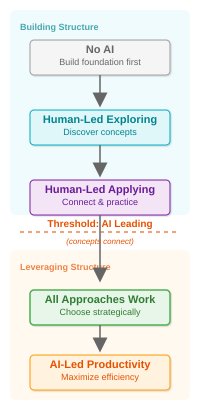

</details>

<details>
<summary><b>Visualization: SOLO integration (existing asset)</b> <i>(supporting)</i></summary>


</details>

### Virtuoso origins reminder

Alien virtuosos were originally trained on human virtuosos' work. Their "alien"
cognition is _downstream_ of human cognition — they echo patterns from their
training. This explains:

- Where they excel: common patterns well represented in training corpora
- Where they fail: novel, rare, context-dependent, or culturally-specific
  territory
- Why calibration matters: you cannot extrapolate from one success to the next

---

## 17. The notional machine from multiple angles

<details>
<summary><b>Visualization: NM from four angles</b> <i>(most load-bearing)</i></summary>

| Angle                                     | Framing                                                                                                                                                                     |
| ----------------------------------------- | --------------------------------------------------------------------------------------------------------------------------------------------------------------------------- |
| **As an imaginary computational machine** | The formal/definitional view: the NM is what the language's specification describes — a state machine with specific operations, rules, and failure modes                    |
| **As a mechanical instrument**            | The metaphor view: something you can "hear" being played; whose mechanics you can study from the outside; whose capabilities constrain what can be notated for it           |
| **As a notational target**                | The writer's view: what the score aims at; the abstract entity your syntax controls                                                                                         |
| **As an abstraction boundary**            | The architect's view: what's above the NM (your code) is your concern; what's below (interpreter, hardware) isn't. Some NM parts are themselves black-boxed (built-in APIs) |

Each angle reveals something the others don't. Chapter 2 develops all four in
different moments.

</details>

<details>
<summary><b>Visualization: black-boxed-within-NM layering</b> <i>(supporting)</i></summary>

```
 ┌──────────────── YOUR CODE ────────────────┐
 │                                           │
 │   ┌──────── NOTIONAL MACHINE ────────┐    │
 │   │                                  │    │
 │   │   ┌── black-boxed APIs ──┐       │    │
 │   │   │ Math.random,          │       │    │
 │   │   │ string methods,       │       │    │
 │   │   │ Array.prototype...    │       │    │
 │   │   │ (known by interface)  │       │    │
 │   │   └───────────────────────┘       │    │
 │   │                                   │    │
 │   │   rest of NM — scopes, bindings,  │    │
 │   │   resolution, coercion, etc.      │    │
 │   │                                   │    │
 │   └───────────────────────────────────┘    │
 │                                           │
 └───────────────────────────────────────────┘
              │
              ▼  (not your concern)
 ┌───────────────────────────────────────────┐
 │  interpreter, bytecode, optimization,     │
 │  hardware, physics                        │
 └───────────────────────────────────────────┘

You model the NM. You don't need to model below it.
You use the black-boxed APIs; you don't need to model their internals.
```

</details>

### Note on NM plurality

The four angles above apply to _any_ notional machine — not just
JavaScript's. They're general framings that travel with the student to every
new language they pick up.

A single language can also have multiple NM frameworks: different
pedagogical accounts of the same underlying machine, each emphasizing
different aspects. Chapter 2 presents one particular account of JavaScript's
NM (the one this curriculum commits to). Future chapters, alternate
curricula, or more advanced treatments could present others. The
curriculum's commitment is that students should learn what it _means_ to
master an NM, using JS as the specific case — equipped to learn any other NM
later.

---

## 18. The Victor / NM visualization distinction

Bret Victor's _Learnable Programming_ is a landmark in making programming
comprehensible. But his visualization target is different from ours — the
distinction matters.

<details>
<summary><b>Visualization: Victor vs. NM visualization</b> <i>(most load-bearing)</i></summary>

```
  VICTOR'S VISUALIZATION               NM VISUALIZATION (Study Lenses)
  ──────────────────────               ───────────────────────────────
  WHAT:   The output                   WHAT:   The machine's internals
  ─ shapes drawn                       ─ state, scopes, bindings
  ─ positions of things                ─ execution order
  ─ values produced                    ─ variable mutation over time
  ─ the program's *result*             ─ how the mechanism *works*

  AUDIENCE: Domain practitioners       AUDIENCE: Programmers learning
           seeing effects                         computation itself

  PREPARES FOR:                        PREPARES FOR:
  ─ effective work in a                ─ a broader computational
    specific domain                      future, any domain
```

</details>

### Why we chose the machine side

This curriculum makes a deliberate pedagogical commitment: we care very little
about what the final computation _does_ in any specific domain. We focus on the
machine that makes whatever-it-is happen. That's because:

- **Domains come and go**; the discipline of reading a language's notional machine transcends domains (and is itself transferable across languages)
- **Students can go anywhere afterward** — web, games, data, ML, systems — if
  they understand how computation works
- **Domain-specific introductions** tend to produce domain-specific skills and
  blind spots
- **Study Lenses' visibility** teaches a general capacity (reading a mechanism's
  internals) rather than a specific domain fluency

This is a genuine choice and worth making explicit. It's not hostile to Victor —
it just points a different direction.

---

## 19. Historical anchors

The metaphor isn't only metaphor — it's grounded in real history where music and
computing literally share origins.

<details>
<summary><b>Visualization: historical lineage timeline</b> <i>(supporting)</i></summary>

```
 1725 ─ Buxtehude, organ masters, counterpoint tradition
 1791 ─ Mozart writes K.594 / K.608 for Flötenuhr (mechanical organ)
        │  composer disliked the instrument; masterpieces anyway
        ▼
 1804 ─ JACQUARD LOOM — punched cards controlling weaving patterns
        │
        ▼
 1837 ─ Babbage's ANALYTICAL ENGINE (inspired by Jacquard)
 1843 ─ Ada Lovelace's notes: "The Analytical Engine
        weaves algebraical patterns just as the Jacquard-loom
        weaves flowers and leaves"
        │
        ▼
 1890s ─ PLAYER PIANOS — punched scrolls, mechanical organs at scale
        │
        ▼
 1940s ─ Modern computers (Turing, von Neumann)
        │
        ▼
 1951 ─ Ligeti's *Musica Ricercata* — 1 note → 12 notes across movements
        │   (demonstrates depth at any scale, Snippetry's precedent)
        ▼
 Today ─ LLMs as alien virtuosos
        │
        ▼
 Near ─ LLM-designed languages? Alien composers emerging?
```

The loom → Analytical Engine → player piano → computer lineage makes the
metaphor literal, not just illustrative.

</details>

### Organ pedagogy's instrument-side wisdom

- Organists traditionally learn on a _practice organ_ (fewer stops) before
  graduating to concert instruments — literally "fewer features, deeper mastery"
- Training order: piano → pedal → registration → repertoire
- Sight-singing (solfège) is required _before_ instrumental performance — direct
  analog to comprehension-before-production

---

## 20. Victor's wish, decomposed

Victor wanted _less implementation toil_ AND _more powerful thinking tools_,
both at once. LLMs decompose the wish in an unexpected way.

<details>
<summary><b>Visualization: Victor's wish decomposed</b> <i>(supporting)</i></summary>

```
                ┌─── less human toil            ─── ✅ partially by LLMs
                │                                    (notation burden lifted)
                │
   Victor's ────┤
   wish         │
                │
                └─── more execution visibility  ─── ❌ worse with LLMs
                                                    (code arrives as fait
                                                    accompli; mechanism
                                                    is more hidden, not less)
                                                ─── ✅ Study Lenses reclaims
                                                    (machine-internals
                                                     visible)
```

</details>

Study Lenses addresses what LLMs made worse. Mechanical instruments are _visibly
mechanical_ — bellows, tracker rods, pipes, hammers all move where you can see
them. Computing lost this in the transition to digital machinery. Study Lenses
reclaims the visibility for the JS NM.

---

## 21. The honest framing — LLMs are often better

Don't shy away from it: LLMs are genuinely better than many humans at the
virtuoso side of the work — faster, broader repertoire, fewer typos. Pretending
otherwise would be dishonest and would condescend to students, most of whom have
already used an LLM.

But:

- **Great programming isn't only about productivity.** There are other reasons
  to program: exploration, mastery, craft, aesthetic satisfaction, new thoughts
  that programming lets you think.
- **Different kinds of good.** LLM virtuosity is efficient and exhaustive. Human
  virtuosity is creative, context-sensitive, culturally literate. Both real.
- **Snippetry is the case for programming-for-its-own-sake** — keeping your own
  skills sharp even when you're no longer building full codebases.
- **Composers still matter** because they bring different skill, different
  intent, a different relationship to the audience and the instrument.

This is the honest answer to "why learn to code if LLMs are better at it?" The
answer is that "better at notation" isn't the whole of programming, and the
design work is yours.

---

## 22. The verification limit and the rise of agile-visible discipline

The collaboration model assumes the composer can verify the virtuoso's output.
But much real LLM collaboration happens in territory the human doesn't
understand well — unfamiliar libraries, domains, languages. Gell-Mann amnesia
applies: you spot errors in your areas of expertise; elsewhere the output looks
equally confident and wrong.

It is possible — common, even — to verify that a program does the **wrong thing
correctly**. Tests may be as opaque as the code they test.

This doesn't mean collaboration is hopeless. It means the **locus of
verification shifts** — from code-level checking (which requires understanding
the code) to behavior-level checking (which requires only understanding what
outcome you want).

<details>
<summary><b>Visualization: verification limit — code vs. behavior check</b> <i>(most load-bearing)</i></summary>

```
       CODE-LEVEL CHECK                 BEHAVIOR-LEVEL CHECK
       ─────────────────                ─────────────────────
 REQUIRES:  understanding               REQUIRES:  understanding
            the code                              the intended
                                                  outcome
 FAILS WHEN: code is beyond you,        FAILS WHEN: you can't
             tests are also beyond you               articulate what
                                                     "right" looks like
                                                     at the user level

 THE GAP: "this does the WRONG          THE RECOURSE: agile-visible
          THING CORRECTLY"                           increments, PBSI
                                                     Purpose/Behavior,
                                                     human-evaluable
                                                     acceptance criteria
```

</details>

<details>
<summary><b>Visualization: agile-visible discipline loop</b> <i>(supporting)</i></summary>

```
   ┌──────────────────────────────────────┐
   │                                      │
   │    specify observable outcome        │
   │       ┌─────────┐                    │
   │       │ Desired │                    │
   │       │ visible │                    │
   │       │ result  │                    │
   │       └────┬────┘                    │
   │            │                         │
   │            ▼                         │
   │       ┌─────────┐                    │
   │       │Implement│ (yourself, with    │
   │       │         │  virtuoso, with    │
   │       │         │  mixed effort)     │
   │       └────┬────┘                    │
   │            │                         │
   │            ▼                         │
   │       ┌─────────┐                    │
   │       │ Evaluate│ at user-visible    │
   │       │  at     │ level (not just    │
   │       │ behavior│ at code level)     │
   │       │  level  │                    │
   │       └────┬────┘                    │
   │            │                         │
   │            ▼                         │
   │        ( iterate )                   │
   │            │                         │
   └────────────┘                         │
                                          │
   short cycles, always producing         │
   something you can evaluate ────────────┘
```

</details>

Chapter 3 (users, PBSI, visible behavior) carries particular weight in an
LLM-assisted workflow precisely because it cultivates this kind of check.

---

## 23. The PL-future

Currently, LLMs work with programming languages designed _for humans_ — machines
using controls built for humans. An accident of history, not a permanent
condition.

A plausible future: LLMs design their own formally-provable programming
languages suited to how _they_ compute. Notions of "high-level" and "low-level"
(which measure distance from human cognitive convenience) break down; those
adjectives describe a centrality that would no longer apply.

<details>
<summary><b>Visualization: PL-future spectrum</b> <i>(supporting)</i></summary>

```
   NOW                     NEAR FUTURE              FAR FUTURE
   ─────────────           ─────────────────        ─────────────────
   Human-designed          More delegation          LLM-designed PLs
   PLs                     to virtuoso              (alien notation)

   Human composers         Composer still           Human composers
    + LLM virtuosos        directs score            with only a NOTION
                                                    of the machine —
                                                    no first-hand
                                                    console access

   Full score              Score increasingly       Code largely
   mastery possible        virtuoso-drafted         unreadable to us

   Code-level              Behavior-level           Behavior-level
   checking viable         checking essential       checking is all
                                                    we have left
   ─────────────           ─────────────────        ─────────────────
   Humanity of PLs — their thinking-shape, cognitive gifts,
   continuity with computational history — remains worth cherishing
   at every step of this spectrum.
```

</details>

In the far-future scenario, the **agile-visible-discipline story intensifies
further**: if we can't read the code AND can't evaluate the tests the alien
virtuoso wrote, then user-visible behavior is _all we have left_. The composer
role shifts further toward specifying observable outcomes that humans can still
evaluate.

### Even then, human PLs matter

In any future, the PLs we have now remain worth cherishing. Not because we need
to write them every day, but for:

- **Their humanity** — they encode what humans found intuitive, expressive,
  clarifying
- **How they shape thinking** — Whorfian effects in computational thought;
  different PLs suggest different mental moves
- **The new thoughts they give us** — encountering a new paradigm (functional,
  logic, stack-based, concatenative, ...) is a cognitive gift
- **Connection to our computational past** — a continuous lineage from loom
  cards to JavaScript, of humans figuring out how to think with machines

This is the "why learn PLs even when you don't have to" answer, offered
honestly, without reactionary pessimism or utopian projection.

---

## 24. Chapter 5 — Developers, Computers, Users, Agents, and You

Chapter 5 introduces **snippetry** as the practice of writing small, runnable,
self-contained programs for their own sake. The chapter's arc and learning
objectives are developed more fully in the syllabus; this section is the
narrative-reference framing.

### What snippetry is

- Small (~40 lines) complete programs
- Each exercises whole-program design at small scale
- Each drills some isolated concern: a language feature, a paradigm, an
  algorithm, the feel of a new NM, a user-experience miniature, or just for fun
- Balances exploration and constraint — students develop their own sense of the
  balance
- Can target self-expression and delight: make yourself laugh, surprise
  yourself, discover something unexpected, impress yourself with growth

### What snippetry is NOT

- It isn't dual-moded. There's no rigid "études vs. notebook" split. Students
  find their own balance of exploration and constraint.
- It isn't "bonus" or optional — Ch 5 is a main-path chapter, not a side quest
- It isn't confined to a graduation moment — the spirit of snippetry can be
  introduced informally from Ch 0 onward (small curiosity-driven snippets),
  before Ch 5 formalizes the practice

### "You" as the fifth audience

The previous audiences were external: developers who read your code, the
computer that executes it, users who experience it, agents that collaborate on
it. "You" is the reflexive turn — students program for themselves: to learn,
practice, think, stretch, explore, express, delight, and discover.

"You" is both singular (your own practice) and plural (sharing with and
remixing from peers through the collaborative gist system). The collaborative
dimension enriches the practice without replacing its self-directed core.

### Multi-paradigmatic JS

Chapters 1–4 taught imperative programming. Chapter 5 is where students
discover that JavaScript supports fundamentally different ways of thinking
about computation: functional (functions as values, higher-order functions,
avoiding mutation), object-oriented (classes, prototypes, encapsulation),
declarative (describing what, not how). Paradigm exploration is a core Ch 5
activity — students solve problems across paradigms, implement the same
paradigm with different features, and translate snippets between paradigms.

### The training-wheels-off commitment

Chapter 5 is where students graduate from the scaffolded curriculum environment
into real browser execution with real consequences.

**What comes off:**

- JEJ language-feature constraint → students can use any and all JS language
  features. Newly available: user-defined functions, closures, arrays, objects,
  the event loop, classes, `async`/`await`, generators, `fetch`, `Promise`,
  `Symbol`, `Proxy`, ES modules, DOM manipulation, Canvas, and everything else
- The web worker sandbox → code runs directly in the browser (iframe). If
  the program freezes, the page freezes. Real consequences, real environment.
  Optional configurable loop guards are available but not enforced
- Enforced formatting → students format code however they prefer
- Study Lenses NM visualizations → the curriculum's tracer-based NM
  visualizations are no longer the primary tool

**What replaces it:**

- **Full browser devtools debugging toolkit** — line breakpoints, conditional
  breakpoints, logpoints, `debugger` statements, step over/into/out, scope
  panel, watch expressions, call stack, pause on exceptions, DOM breakpoints,
  event listener breakpoints, console in paused context. Students learn the
  full toolkit.
- **External NM visualization tools** — open-in buttons for specialized tools
  (loupe for event loop, promisees for Promises, etc.) with different notional
  machine perspectives. Training wheels come off, but power tools are
  available.
- **Four sandbox modes** offering different constraints and affordances:
  - Script without HTML — pure computation, closest to Chs 1–4
  - Module without HTML — introduces ES module semantics
  - HTML file with a script tag — DOM available, split view of code and
    rendered page
  - HTML file with a module tag — DOM + ES modules

  Students learn to distinguish "pure" scripts (computation only) from scripts
  embedded in a full page, and choose the mode that fits their snippet's needs.

<details>
<summary><b>Visualization: training wheels off (Ch 5)</b> <i>(supporting)</i></summary>

```
    CHAPTERS 1–4                   CHAPTER 5
    ─────────────                  ──────────
    ─ JEJ constraint               ─ Any JS (all features)
    ─ Enforced formatting          ─ Format however you like
    ─ Study Lenses NM viz          ─ Full browser devtools toolkit
    ─ Web worker sandbox           ─ Real browser execution (iframe)
    ─ Imperative only              ─ Multi-paradigmatic exploration

                                   + External NM viz tools (loupe, etc.)
                                   + 4 sandbox modes (script, module,
                                     HTML+script, HTML+module)
                                   + Optional loop guards only
                                   + Collaborative gist system

    "Here is everything the         "Here is everything the language
     curriculum has built"           offers, with real consequences
                                     and real tools."
```

</details>

<details>
<summary><b>Visualization: snippetry as exploration-constraint balance</b> <i>(supporting)</i></summary>

```
                    EXPLORATION-CONSTRAINT SPACE
                    ─────────────────────────────

              ▲  MAX EXPLORATION
              │  (wide open; many
              │   paradigms; playful)
              │
              │                                     ○
              │                              ○              ○
              │                        ○                          ○
              │                  ○                                       ○
              │          ○
              │  ○
              │ ────────────────────────────────────────────────────────►
                                                                  MAX CONSTRAINT
                                                                  (tight focus;
                                                                   one feature;
                                                                   one idea)

   Each snippet is a point in this space. Students find their own balance
   for their own goals. Ligeti's *Musica Ricercata* I lives at max constraint
   (one note). A polyglot cat-detector remix lives at high exploration.
   Both are snippetry.
```

</details>

### The collaborative gist system

Students can save snippets as gists, browse gists saved by other learners,
and remix them. This makes Chapter 5 collaborative across all learners. The
remix workflow — take someone else's snippet, change its intent, make it
yours — is a core snippetry activity. "You" as audience includes "you as
part of a community of practitioners."

### Why full main-path chapter, not bonus

Snippetry answers a central question of the curriculum: **what do I do as a
programmer when I'm no longer building full codebases?** That's not a bonus
question. It's the question students will increasingly face.

### Alien composers teaser (Ch 5 closing)

After the chapter celebrates programming-for-its-own-sake, it briefly notes that
_alien composers_ (agentic systems doing design work) are arriving too — a
development that the snippetry practice will also adapt to. Full treatment
deferred to _Welcome to Algorithms_ and post-curriculum work.

---

## 25. Voice for the curriculum

**This section describes a target voice. This document does not demonstrate that
voice — it's a spec for future authors.**

### The voice we're aiming for

- **Dry base** — state ideas directly, without performance. No excessive
  enthusiasm, no motivational language, no marketing speak.
- **Middle-band playfulness** — characters can appear; historical cameos can
  have personality; a warm aside is welcome; cultural literacy can peek through.
  This is _not_ full Poignant-Guide weirdness. Think: a thoughtful teacher with
  dry wit, not a comedian.
- **Cultured and quietly warm** — references (musical, historical, literary) are
  welcome when they serve. The voice respects the reader as an adult capable of
  encountering unfamiliar references without being talked down to.
- **Honest about uncertainty** — the curriculum is evidence-informed but not
  dogmatic. When something is conjecture, say so. When something is strongly
  established, say so.
- **Belgian/European-adjacent reserve** — a certain dry realism, unwilling to
  oversell. Not cold; not cynical. Measured.
- **Second person common** — "you" is the reader. "We" is sometimes the
  curriculum authors, sometimes the broader community of programmers.

### What to avoid

- Hyperbole ("amazing," "incredible," "blazing fast")
- False confidence ("this will definitely work")
- Sycophantic agreement with imagined student thoughts ("Great question!")
- Enthusiasm not backed by evidence
- Excessive use of emojis or decoration
- Overexplaining — trust the reader to follow

### Examples of acceptable tonal range

(Candidate lines — not committed, illustrative only)

**Dry-base acceptable:**

- "The notional machine is an imaginary computer. You don't need to understand
  below it — the interpreter handles that. You do need to understand what it can
  produce."

**Warm acceptable:**

- "Mozart didn't like writing for the Flötenuhr. He wrote K.594 and K.608
  anyway, and they're masterpieces. Mastery transcends affection for a specific
  mechanism."

**Middle-band playful acceptable:**

- "The Mechanism doesn't care. It plays what's on the score. If the score is
  wrong, the music is wrong — and the Mechanism is not going to rescue you."

**Poignant-scale weird NOT acceptable:**

- "Ohhh, the Virtuoso sprang into the room, juggling semicolons and grinning
  like a startled fox. 'I'll write your code!' it cried, and chunky bacon rained
  from the ceiling."

### How the voice should show up in chapter content

- Section prose: dry-base dominant, warm touches where they help
- Character appearances: occasional (in sidebars, asides, illustrations) — never
  dominating
- Epigraphs: musical, historical, or literary — well-chosen, not decorative
- Examples: concrete and precise; occasional humor in variable names is fine
- Exercises: neutral tone; instructions are direct and unambiguous
- "Did you know?" sidebars: warm and cultural — this is where the metaphor's
  history can surface

### Calibration when you're stuck on voice

If you've drafted a passage and it feels off — either too dry, too warm, too
performative, too flat — run through this checklist:

1. **Read it aloud.** Does it sound like something a cultured teacher might
   actually say? Or does it sound like marketing copy, textbook-ese, or a
   stand-up routine? Marketing and textbook-ese are usually too dry and too
   flat; stand-up is usually too performative. Aim between.
2. **Check for hyperbole.** Search for "amazing," "incredible," "blazing,"
   "powerful," "seamless," "effortless." If any appear unbacked by evidence,
   cut them.
3. **Check for false confidence.** Phrases like "this will definitely work,"
   "you'll easily grasp this," "don't worry about X" are warning signs. When
   something is uncertain, say so. When it's hard, say so.
4. **Check for sycophancy.** "Great question!", "Excellent choice!",
   "Fantastic insight!" — cut. The reader doesn't need affirmation; they
   need information and honest framing.
5. **Check the character presence.** If the Composer, Virtuoso, Mechanism,
   or Audience appear in this section, do they earn their space? If they're
   decorative, remove them. If they illustrate a point the prose couldn't
   carry alone, keep them.
6. **Check the Belgian dial.** The target has a hint of European reserve —
   dry realism, unwilling to oversell, slightly wry. If a passage sounds
   overenthusiastic or Californian-sunny, dial it back. If it sounds cold
   or cynical, dial it forward. Warm-but-measured is the band.
7. **Check the reader's assumed level.** Are you over-explaining things a
   reader already knows by this point in the curriculum? Are you under-
   explaining things they'd need? When in doubt, trust the reader more, not
   less.
8. **Read it again in the morning.** Voice drift happens fastest late at
   night. Sleep and re-read.

If you're still stuck after the checklist, it's often useful to write the
same paragraph three times in three different registers (dry / warm /
playful) and pick the one that serves the content best. Don't commit to a
register in advance; let the content ask for what it needs.

---

## 26. Characters

The cast appears across the curriculum. Characters are a teaching device, not a
dominating presence.

### The Composer

- **The student's avatar when designing**
- Curious, earnest, sometimes frustrated
- Learns to hear the music internally before it plays
- Over the curriculum, develops a critical ear and a compositional voice

### The Virtuoso

- **Human or alien**
- Human form (pre-Ch 4): a senior developer with fluent hands — knows idioms,
  libraries, patterns. Helpful and collaborative.
- Alien form (Ch 4+): dazzling, fast, pattern-rich, but weird. Sometimes plays
  what you said rather than what you meant. Trained on millions of human
  virtuosos but cognitively distinct.
- Never the protagonist of the story — always a collaborator

### The Mechanism

- **The mechanical instrument itself**
- Literal, indifferent, stubborn
- Plays exactly what's notated and nothing else
- A character by virtue of its _exactness_ — not by having personality, but by
  having unwavering honesty

### The Audience

- **Concert-goers**
- Reactive, emotional, unfiltered
- Cheer, boo, throw tomatoes or flowers
- Their response is the last honest check on whether the music works
- Appear most vividly in Chapter 3 (users)

### Historical cameos

Brief sidebars across chapters, each picking up an aspect of the metaphor:

- **Mozart** — masterpieces for an instrument he disliked (Ch 2 sidebar)
- **Bach studying Buxtehude** — Bach walked 400km to hear Buxtehude play;
  composers learn from scores and performances of masters (Ch 1 sidebar)
- **Ligeti** — depth at any scale (Ch 5 sidebar or epigraph)
- **Ada Lovelace** — on the Analytical Engine weaving algebraical patterns (Ch 2
  or 4 sidebar)
- **Babbage** — the loom-inspired dream that became modern computing (Ch 0 or
  historical-anchor section)

### Character appearance guidance

- **Occasional, not constant** — the cast should feel present without being
  ubiquitous
- **Useful, not decorative** — each appearance does pedagogical work
- **Restrained warmth** — characters can have personality; not cartoons

---

## 27. Smaller connections (noted for later chapter authors)

These connections are natural but outside the core metaphor work. Chapter
authors can pick them up when relevant.

- **Code review ↔ co-composer critique** — composers workshop each other's
  scores; developers review each other's code. Natural for Ch 1 or Ch 4.
- **Documentation ↔ program notes** — a concert program explains the piece to
  the audience. READMEs and docstrings do the same. Ch 1, Ch 3.
- **Deployment environment ↔ concert acoustics** — the venue shapes what the
  score sounds like. Browser vs. Node vs. edge vs. embedded shapes what code
  does. Later courses.
- **Testing ↔ rehearsal** — rehearsal catches problems before performance. Tests
  catch problems before deployment. Ch 3+.
- **Polyphony / fugue form ↔ concurrency / async** — when later chapters
  introduce asynchronous code, the musical analogy is ready.
- **Tempo ↔ performance (systems sense)** — the same score played faster feels
  different; the same code run faster feels different. Optimization and
  responsiveness. Later.
- **Style periods ↔ programming paradigms** — Baroque / Classical / Romantic ↔
  imperative / OO / functional. A lens for paradigm contrasts. Later.

---

## 28. Open questions and follow-ups

### Completed during initial execution

- ✅ **Top-section four-threads edit** — three threads replaced with four in
  `syllabus.md` lines 21–56; "Micro-decisions" renamed to "Decisions (micro
  and macro)" with both levels explicit
- ✅ **Chapter-list metaphor hooks** — italicized metaphor anchors added under
  each of Ch 0–4 headings and under the new Ch 5 header
- ✅ **Chapter-internal metaphor presence** — default guidance ("all of the
  above, light touch") documented in §26 Characters and §25 Voice

### Known open items (still active)

- **Voice workshop with real drafts** — the voice spec in §25 needs testing
  against actual chapter prose. The first chapter written after this document
  should be a voice-calibration drop.
- **Ch 5 full design** — the syllabus has the overview and 29 learning
  objectives across 9 sections (5A–5I); detailed exercise design is
  outstanding.
- **Mermaid rendering verification** — two diagrams use mermaid syntax (§8
  composition loop, §12 composer pedagogy graph). If the Docusaurus site
  isn't configured with `@docusaurus/theme-mermaid`, they render as raw code
  blocks. Needs a preview check and possibly a site config update.
- **Excalidraw SVG rendering verification** — a few existing assets are
  `.excalidraw.svg` files. Most modern renderers handle SVG fine, but worth
  smoke-testing in the Docusaurus preview to catch any oddities.
- **GEB-style character dialogues** — one dialogue before each chapter (not
  subchapter). Preludes that introduce themes playfully and encode chapter
  concepts in dialogue form, using the existing cast (Composer, Virtuoso,
  Mechanism, Audience) + historical cameos. Blocked on: writing quality
  requirement and the rest of the course taking shape first. Prototype target:
  Ch 2 (Composer meets Mechanism for the first time).

### Longer-horizon questions

- **Informal snippetry from Ch 0 onward** — the chapter arc is decided (Ch 5
  is the formal chapter; the spirit is welcome from Ch 0). The operational
  mechanism — how informal snippets are introduced in earlier chapters
  without undermining those chapters' scaffolding — still needs design work.
- **How do non-English-language curriculum tracks** (if we build them) handle
  the pieces of the metaphor most tied to European classical music? The
  instrument-varies commitment helps; specific local traditions (gamelan with
  karakuri, West African automated rhythm, etc.) can lead for non-European
  tracks.
- **Does the musical metaphor work for students with no musical background at
  all?** The cultural broadening to beat machines and MIDI helps. Needs
  testing with actual learners.
- **Research framing** — this metaphor is itself an object of curriculum
  design that could be studied. How much belongs in `research-framing.md` vs.
  here?
- **Alien-composer capstone moment** — lands in Ch 4.5 and Ch 5 closing. Does
  it need its own capstone moment at the curriculum's end? Probably in
  _Welcome to Algorithms_ rather than here.

---

## End notes

This document is a living artifact. As chapters are written, new connections
will surface and some framings will need adjustment. Update this document when
that happens — keep the narrative reference accurate.

The metaphor is load-bearing but not load-exclusive. Chapter authors should use
the metaphor where it illuminates and set it aside where it strains. The vision
(§2–§3) stands without it; the metaphor (§4+) serves the vision.
