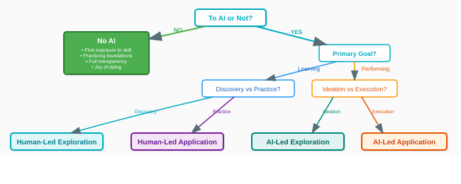

# Narrative — Welcome to Frogramming companion

> Author-facing companion to the canonical curriculum docs. Holds the
> narrative additions — voice spec, historical cameos, metaphor-flavored
> illustrations, deeper-section threads — that didn't fold into the
> canonical docs (`syllabus.md`, `syllabus.ontology.md`,
> `syllabus.chapters.md`, the three manifestos,
> `syllabus.translational-framing.md`).

Visual assets live at `./assets/` (sibling to this file at the
welcome-to-programming/ level). All visualizations in this doc are
wrapped in `<details>` blocks with relative-importance caveats so
readers can skim or dive.

The metaphor system itself — composer / virtuoso / mechanism / audience
cast, the full mapping, the two-phase composition-vs-execution structure
— lives canonically in `syllabus.metaphor.md`. This file carries
_extensions_ and _illustrations_ that didn't fit the un-prose-y
reference register of the ontology.

---

## Contents

1. [How to use this document](#1-how-to-use-this-document)
2. [Voice for the curriculum](#2-voice-for-the-curriculum)
3. [Historical anchors](#3-historical-anchors)
4. [The 8 AI-collaboration skills](#4-the-8-ai-collaboration-skills)
5. [Metaphor extensions](#5-metaphor-extensions)
6. [The NM from multiple angles](#6-the-nm-from-multiple-angles)
7. [The Victor / NM visualization distinction](#7-the-victor--nm-visualization-distinction)
8. [LLMs are often better — the honest framing](#8-llms-are-often-better--the-honest-framing)
9. [The verification limit and agile-visible discipline](#9-the-verification-limit-and-agile-visible-discipline)
10. [The PL-future](#10-the-pl-future)
11. [Smaller connections for chapter authors](#11-smaller-connections-for-chapter-authors)
12. [End notes](#12-end-notes)

---

## 1. How to use this document

- **Read sequentially** the first time. The voice spec sets the tone for
  everything else; the historical anchors give the cameos that recur
  later.
- **Dip in by section** for later reference. Section titles are
  descriptive.
- **Relative-importance caveats on visualizations** — each `<details>`
  block is tagged _(most load-bearing)_, _(supporting)_, or _(optional
  extra angle)_. If you're short on time, the load-bearing visuals are
  enough.
- **When the metaphor serves the vision, use it. When it strains, drop
  it.** The vision stands on its own (ontology + chapters). The
  metaphor is illustration, not argument.
- **The cast** (Composer, Virtuoso, Mechanism, Audience, Co-composers,
  Historical cameos) is **teaching apparatus**, explicitly NOT
  structural guide. Practice-stances and learning objectives live with
  V/F (ontology §3) and the 5 strands (ontology §13). See
  `syllabus.metaphor.md` for the canonical cast definition.

---

## 2. Voice for the curriculum

### The voice we're aiming for

- **Dry base** — state ideas directly, without performance. No
  excessive enthusiasm, no motivational language, no marketing speak.
- **Middle-band playfulness** — characters can appear; historical
  cameos can have personality; a warm aside is welcome; cultural
  literacy can peek through. _Not_ full Poignant-Guide weirdness.
  Think: a thoughtful teacher with dry wit, not a comedian.
- **Cultured and quietly warm** — references (musical, historical,
  literary) are welcome when they serve. The voice respects the reader
  as an adult capable of encountering unfamiliar references without
  being talked down to.
- **Honest about uncertainty** — the curriculum is evidence-informed
  but not dogmatic. When something is conjecture, say so. When
  something is strongly established, say so.
- **Belgian/European-adjacent reserve** — a certain dry realism,
  unwilling to oversell. Not cold; not cynical. Measured.
- **Second person common** — "you" is the reader. "We" is sometimes
  the curriculum authors, sometimes the broader community of
  programmers.

### What to avoid

- Hyperbole ("amazing," "incredible," "blazing fast")
- False confidence ("this will definitely work")
- Sycophantic agreement with imagined student thoughts ("Great
  question!")
- Enthusiasm not backed by evidence
- Excessive use of emojis or decoration
- Overexplaining — trust the reader to follow

### Examples of acceptable tonal range

(Candidate lines — not committed, illustrative only.)

**Dry-base acceptable:**

> The notional machine is an imaginary computer. You don't need to
> understand below it — the interpreter handles that. You do need to
> understand what it can produce.

**Warm acceptable:**

> Mozart didn't like writing for the Flötenuhr. He wrote K.594 and
> K.608 anyway, and they're masterpieces. Mastery transcends affection
> for a specific mechanism.

**Middle-band playful acceptable:**

> The Mechanism doesn't care. It plays what's on the score. If the
> score is wrong, the music is wrong — and the Mechanism is not going
> to rescue you.

**Poignant-scale weird NOT acceptable:**

> Ohhh, the Virtuoso sprang into the room, juggling semicolons and
> grinning like a startled fox. "I'll write your code!" it cried, and
> chunky bacon rained from the ceiling.

### How the voice should show up in chapter content

- **Section prose**: dry-base dominant, warm touches where they help
- **Character appearances**: occasional (in sidebars, asides,
  illustrations) — never dominating
- **Epigraphs**: musical, historical, or literary — well-chosen, not
  decorative
- **Examples**: concrete and precise; occasional humor in variable
  names is fine
- **Exercises**: neutral tone; instructions are direct and unambiguous
- **"Did you know?" sidebars**: warm and cultural — this is where the
  metaphor's history can surface

### Calibration when you're stuck on voice

If you've drafted a passage and it feels off — too dry, too warm, too
performative, too flat — run through this checklist:

1. **Read it aloud.** Does it sound like something a cultured teacher
   might actually say? Or does it sound like marketing copy,
   textbook-ese, or a stand-up routine? Marketing and textbook-ese are
   usually too dry and too flat; stand-up is usually too performative.
   Aim between.
2. **Check for hyperbole.** Search for "amazing," "incredible,"
   "blazing," "powerful," "seamless," "effortless." If any appear
   unbacked by evidence, cut them.
3. **Check for false confidence.** Phrases like "this will definitely
   work," "you'll easily grasp this," "don't worry about X" are
   warning signs. When something is uncertain, say so. When it's hard,
   say so.
4. **Check for sycophancy.** "Great question!", "Excellent choice!",
   "Fantastic insight!" — cut. The reader doesn't need affirmation;
   they need information and honest framing.
5. **Check the character presence.** If the Composer, Virtuoso,
   Mechanism, or Audience appear in this section, do they earn their
   space? If they're decorative, remove them. If they illustrate a
   point the prose couldn't carry alone, keep them.
6. **Check the Belgian dial.** The target has a hint of European
   reserve — dry realism, unwilling to oversell, slightly wry. If a
   passage sounds overenthusiastic or Californian-sunny, dial it back.
   If it sounds cold or cynical, dial it forward. Warm-but-measured is
   the band.
7. **Check the reader's assumed level.** Are you over-explaining
   things a reader already knows by this point in the curriculum? Are
   you under-explaining things they'd need? When in doubt, trust the
   reader more, not less.
8. **Read it again in the morning.** Voice drift happens fastest late
   at night. Sleep and re-read.

If you're still stuck after the checklist, write the same paragraph
three times in three different registers (dry / warm / playful) and
pick the one that serves the content best. Don't commit to a register
in advance; let the content ask for what it needs.

---

## 3. Historical anchors

The metaphor isn't only metaphor — it's grounded in real history where
music and computing literally share origins.

<details>
<summary><b>Visualization: historical lineage timeline</b> <i>(supporting)</i></summary>

```text
 1725 ─ Buxtehude, organ masters, counterpoint tradition
 1791 ─ Mozart writes K.594 / K.608 for Flötenuhr (mechanical organ)
        │  composer disliked the instrument; masterpieces anyway
        ▼
 1804 ─ JACQUARD LOOM — punched cards controlling weaving patterns
        │
        ▼
 1837 ─ Babbage's ANALYTICAL ENGINE (inspired by Jacquard)
 1843 ─ Ada Lovelace's notes: "The Analytical Engine weaves
        algebraical patterns just as the Jacquard-loom weaves
        flowers and leaves"
        │
        ▼
 1890s ─ PLAYER PIANOS — punched scrolls, mechanical organs at scale
        │
        ▼
 1940s ─ Modern computers (Turing, von Neumann)
        │
        ▼
 1951 ─ Ligeti's *Musica Ricercata* — 1 note → 12 notes across
        movements (depth-at-any-scale; Snippetry's musical precedent)
        │
        ▼
 Today ─ LLMs as alien virtuosos
        │
        ▼
 Near ─ LLM-designed languages? Alien composers emerging?
```

The loom → Analytical Engine → player piano → computer lineage makes
the metaphor literal, not just illustrative.

</details>

### Organ pedagogy's instrument-side wisdom

- Organists traditionally learn on a _practice organ_ (fewer stops)
  before graduating to concert instruments — literally "fewer features,
  deeper mastery." Direct analog to JEJ.
- Training order: piano → pedal → registration → repertoire.
- Sight-singing (solfège) is required _before_ instrumental
  performance — direct analog to comprehension-before-production.

### Cameos for chapter sidebars

Brief sidebar candidates, each picking up an aspect of the metaphor:

- **Mozart** — masterpieces for an instrument he disliked (Ch2
  sidebar)
- **Bach studying Buxtehude** — Bach walked 400km to hear Buxtehude
  play; composers learn from scores and performances of masters (Ch1
  sidebar)
- **Ligeti** — depth at any scale (Ch5 sidebar or epigraph; _Musica
  Ricercata_ is the explicit precedent for Snippetry's
  one-feature-at-a-time-explored-deeply pattern)
- **Ada Lovelace** — on the Analytical Engine weaving algebraical
  patterns (Ch2 or Ch4 sidebar)
- **Babbage** — the loom-inspired dream that became modern computing
  (Ch0 or historical-anchor sidebar)

---

## 4. The 8 AI-collaboration skills

Chapter 4 develops 8 collaboration skills with the alien virtuoso (the
LLM). Each has a specific composer-virtuoso activity.

| Skill                  | Composer-virtuoso activity                                                                                                            |
| ---------------------- | ------------------------------------------------------------------------------------------------------------------------------------- |
| **Perspective-Take**   | Understanding the virtuoso's habits, blind spots, tendencies — especially for alien virtuosos whose tendencies differ from human ones |
| **Calibrate**          | Having the virtuoso play a known passage before trusting them with a difficult one; testing the jagged frontier                       |
| **Articulate**         | Score annotations and verbal direction ("softer here," "hold this chord," "the phrase ends on the dominant")                          |
| **Iterate**            | Rehearsal with revision cycles — play, listen, revise notation, play again                                                            |
| **Delegate**           | Choosing what to notate precisely (when precision matters) vs. describe in prose (when the virtuoso should fill in)                   |
| **Read** (adapted)     | Reviewing the virtuoso's transcription against your intent — critical listening before the performance                                |
| **Trace** (adapted)    | Mentally playing through what the virtuoso wrote, note by note, predicting how it will sound                                          |
| **Describe** (adapted) | Naming the gap between what you heard and what you wanted; vocabulary for mismatch                                                    |

<details>
<summary><b>Visualization: 8 collaboration skills as composer-virtuoso exchanges</b> <i>(most load-bearing)</i></summary>

```text
    ┌───────────────────────────────────────────────┐
    │  PRE-COLLABORATION                            │
    │  ──────────────────                           │
    │  Perspective-Take  — "who am I working with?" │
    │  Calibrate         — "what can they do?"      │
    └───────────────────────────────────────────────┘
                          │
                          ▼
    ┌───────────────────────────────────────────────┐
    │  IN COLLABORATION (iterative)                 │
    │  ────────────────────────────                 │
    │  Articulate  ───►  notate + direct the score  │
    │  Delegate    ───►  decide precision vs prose  │
    │  Read        ◄───  review transcription       │
    │  Trace       ◄───  mentally play through      │
    │  Describe    ◄───  name mismatches            │
    │  Iterate     ↻     loop until satisfied       │
    └───────────────────────────────────────────────┘
```

Each skill has a specific moment in the collaborative loop.

</details>

### Supporting diagrams

<details>
<summary><b>Visualization: collaboration decision tree</b> <i>(supporting)</i></summary>



</details>

<details>
<summary><b>Visualization: AI learning progression</b> <i>(supporting)</i></summary>


</details>

<details>
<summary><b>Visualization: SOLO integration</b> <i>(supporting)</i></summary>


</details>

### Virtuoso origins — the alien is downstream of humans

Alien virtuosos were originally trained on human virtuosos' work. Their
"alien" cognition is _downstream of_ human cognition — they echo
patterns from their training. This explains:

- Where they excel: common patterns well represented in training
  corpora
- Where they fail: novel, rare, context-dependent, or culturally-
  specific territory
- Why calibration matters: you cannot extrapolate from one success to
  the next

---

## 5. Metaphor extensions

The canonical metaphor system (cast, mapping, two-phase
composition-vs-execution) is in `syllabus.metaphor.md`. The extensions below are
illustrations the canonical reference doesn't carry — useful in
chapter prose for animating specific moments.

### The composer's critical ear

Most of programming's real work lives here: running code, observing,
diagnosing divergence between intent and execution, fixing the score.
This is what comprehension-before-production is _building_.

In musical terms: the composer at rehearsal, listening with the score
in hand. _"No, hold that chord a beat longer. Why does that transition
sound muddy? Let me see the score."_ The composer's judgment runs
continuously against the performance.

**Study Lenses serves two distinct pedagogical roles**:

- **Training wheels** — scaffolding the student's internal hearing by
  making execution visible at first. The student develops intuitions
  about what the NM is doing because they can _see_ it doing those
  things. Over time, the visible becomes internalized.
- **Power tools** — extending the internal ear to executions that are
  simply too complex to fully internalize. Even a strong internal
  model benefits from externalization when complexity overwhelms
  working memory.

Crucially: Study Lenses is built for how **human** minds learn, think,
and experience code. It's not a neutral "visualize execution" tool;
it's a _human-centered_ tool. Trace tables, variable highlighting,
predictive stepping — all of these work with human cognition (limited
working memory, need for externalization, visual thinking). An LLM
doesn't need Study Lenses; it has its own internal ways of processing
code. Study Lenses exists for us.

<details>
<summary><b>Visualization: composer's critical ear feedback loop</b> <i>(supporting)</i></summary>

```text
  ┌──────────┐       ┌──────────┐       ┌──────────┐
  │  SCORE   │ ──►   │MECHANISM │ ──►   │ OBSERVED │
  │          │       │ executes │       │BEHAVIOR  │
  └──────────┘       └──────────┘       └────┬─────┘
       ▲                                      │
       │                                      ▼
       │                                ┌──────────┐
       │                                │ COMPOSER │
       │                                │ LISTENS  │
       │                                │ against  │
       │                                │ intent   │
       │                                └────┬─────┘
       │                                     │
       │      diagnoses divergence           ▼
       │                              ┌──────────┐
       └────── revises notation ──────│JUDGMENT  │
                                      └──────────┘
```

</details>

### Errors — when the mechanism refuses to play

When the score is malformed or asks for something unplayable, the
mechanism stops and says so. In JS: errors thrown. This is _different_
from debugging (which is about intent-execution mismatch). Errors are
the mechanism being honest about what it can't do.

For beginners, framing matters: an error is not a personal failure.
The mechanism is _helping_ — telling you exactly where the notation
is inadmissible. Errors are the mechanism's most useful honest output.

### Arrangement and variation — working with existing scores

Real composers mostly don't write from scratch. They arrange existing
pieces for different instruments, write variations on themes,
transcribe, quote, extend traditions. Bach spent years copying and
arranging Vivaldi. Liszt's most famous works are transcriptions.
Brahms wrote "Variations on a Theme by Haydn." These are serious
compositional practices, not lesser work.

Programming is identical. Most code lives in existing codebases. Real
work involves:

- **Arranging** (refactoring, migration, porting) — same music for a
  different instrument
- **Variation** (extending existing code with new features) — a theme
  elaborated
- **Transcription** (reverse-engineering behavior into code) —
  hearing a performance and writing down the score
- **Quotation** (using libraries, APIs) — referencing existing musical
  material

<details>
<summary><b>Visualization: arrangement/variation vs. greenfield composition</b> <i>(supporting)</i></summary>

```text
GREENFIELD COMPOSITION              ARRANGEMENT / VARIATION
──────────────────────              ────────────────────────
 Start from intent                   Start from existing score
 → write new score                   → understand what's there
 → hand to virtuoso                  → preserve what works
 → performance                       → modify with discipline
                                     → maintain coherence

Both are real composer work.
Most real work is the right column, not the left.
```

</details>

**Parallels the greenfield-vs-contributor distinction**. Different
developer roles require different composer-vs-virtuoso balances:

- **Greenfield developers** lean toward pure composition — more design
  work, more NM thinking, more decisions from scratch
- **Contributors to large codebases** lean toward arrangement and
  variation — understanding existing scores, preserving conventions,
  modifying within constraints
- Most professional work is somewhere between, and varies day-to-day

Chapter 3's reverse-engineering, modify-programs, and refactoring
skills all live in the arrangement-and-variation domain. Snippetry
(Ch5) is explicitly greenfield _at small scale_.

### The two-scale instrument reading (carries from ontology §13)

The whole rhetorical situation has two scales, not one. The first
instrument is the machine playing the score (the NM evaluating code);
the second instrument is the user's experience of the played piece
(intangible, emergent, arising from interaction). The _concert_ — the
experience-as-purpose — is what V and F orient toward.

This extension lives canonically in ontology §13 (whole rhetorical
situation strand). See `syllabus.metaphor.md`'s two-scale extension note
for the metaphor-illustration form.

---

## 6. The NM from multiple angles

<details>
<summary><b>Visualization: NM from four angles</b> <i>(most load-bearing)</i></summary>

| Angle                                     | Framing                                                                                                                                                                     |
| ----------------------------------------- | --------------------------------------------------------------------------------------------------------------------------------------------------------------------------- |
| **As an imaginary computational machine** | The formal/definitional view: the NM is what the language's specification describes — a state machine with specific operations, rules, and failure modes                    |
| **As a mechanical instrument**            | The metaphor view: something you can "hear" being played; whose mechanics you can study from the outside; whose capabilities constrain what can be notated for it           |
| **As a notational target**                | The writer's view: what the score aims at; the abstract entity your syntax controls                                                                                         |
| **As an abstraction boundary**            | The architect's view: what's above the NM (your code) is your concern; what's below (interpreter, hardware) isn't. Some NM parts are themselves black-boxed (built-in APIs) |

Each angle reveals something the others don't. Chapter 2 develops all
four in different moments.

</details>

<details>
<summary><b>Visualization: black-boxed-within-NM layering</b> <i>(supporting)</i></summary>

```text
 ┌──────────────── YOUR CODE ────────────────┐
 │                                           │
 │   ┌──────── NOTIONAL MACHINE ────────┐    │
 │   │                                  │    │
 │   │   ┌── black-boxed APIs ──┐       │    │
 │   │   │ Math.random,         │       │    │
 │   │   │ string methods,      │       │    │
 │   │   │ Array.prototype...   │       │    │
 │   │   │ (known by interface) │       │    │
 │   │   └──────────────────────┘       │    │
 │   │                                  │    │
 │   │   rest of NM — scopes, bindings, │    │
 │   │   resolution, coercion, etc.     │    │
 │   │                                  │    │
 │   └──────────────────────────────────┘    │
 │                                           │
 └───────────────────────────────────────────┘
              │
              ▼  (not your concern)
 ┌───────────────────────────────────────────┐
 │  interpreter, bytecode, optimization,     │
 │  hardware, physics                        │
 └───────────────────────────────────────────┘

You model the NM. You don't need to model below it.
You use the black-boxed APIs; you don't need to model their internals.
```

</details>

### Note on NM plurality

The four angles above apply to _any_ notional machine — not just
JavaScript's. They're general framings that travel with the student to
every new language they pick up.

A single language can also have multiple NM frameworks: different
pedagogical accounts of the same underlying machine, each emphasizing
different aspects. Chapter 2 presents one particular account of
JavaScript's NM (the one this curriculum commits to). Future chapters,
alternate curricula, or more advanced treatments could present others.
The curriculum's commitment is that students should learn what it
_means_ to master an NM, using JS as the specific case — equipped to
learn any other NM later.

---

## 7. The Victor / NM visualization distinction

Bret Victor's _Learnable Programming_ is a landmark in making
programming comprehensible. But his visualization target is different
from this curriculum's — the distinction matters.

<details>
<summary><b>Visualization: Victor vs. NM visualization</b> <i>(most load-bearing)</i></summary>

```text
  VICTOR'S VISUALIZATION               NM VISUALIZATION (Study Lenses)
  ──────────────────────               ───────────────────────────────
  WHAT:   The output                   WHAT:   The machine's internals
  ─ shapes drawn                       ─ state, scopes, bindings
  ─ positions of things                ─ execution order
  ─ values produced                    ─ variable mutation over time
  ─ the program's *result*             ─ how the mechanism *works*

  AUDIENCE: Domain practitioners       AUDIENCE: Programmers learning
           seeing effects                         computation itself

  PREPARES FOR:                        PREPARES FOR:
  ─ effective work in a                ─ a broader computational
    specific domain                      future, any domain
```

</details>

### Why this curriculum chose the machine side

A deliberate pedagogical commitment. The curriculum cares very little
about what the final computation _does_ in any specific domain. It
focuses on the machine that makes whatever-it-is happen. That's
because:

- **Domains come and go**; the discipline of reading a language's
  notional machine transcends domains (and is itself transferable
  across languages)
- **Students can go anywhere afterward** — web, games, data, ML,
  systems — if they understand how computation works
- **Domain-specific introductions** tend to produce domain-specific
  skills and blind spots
- **Study Lenses' visibility** teaches a general capacity (reading a
  mechanism's internals) rather than a specific domain fluency

This is a genuine choice and worth making explicit. It's not hostile
to Victor — it just points a different direction.

### Victor's wish, decomposed

Victor wanted _less implementation toil_ AND _more powerful thinking
tools_, both at once. LLMs decompose the wish in an unexpected way.

<details>
<summary><b>Visualization: Victor's wish decomposed</b> <i>(supporting)</i></summary>

```text
                ┌─── less human toil            ─── ✅ partially by LLMs
                │                                    (notation burden lifted)
                │
   Victor's ────┤
   wish         │
                │
                └─── more execution visibility  ─── ❌ worse with LLMs
                                                    (code arrives as fait
                                                    accompli; mechanism
                                                    is more hidden, not less)
                                                ─── ✅ Study Lenses reclaims
                                                    (machine-internals
                                                     visible)
```

</details>

Study Lenses addresses what LLMs made worse. Mechanical instruments
are _visibly mechanical_ — bellows, tracker rods, pipes, hammers all
move where you can see them. Computing lost this in the transition to
digital machinery. Study Lenses reclaims the visibility for the JS NM.

---

## 8. LLMs are often better — the honest framing

Don't shy away from it: LLMs are genuinely better than many humans at
the virtuoso side of the work — faster, broader repertoire, fewer
typos. Pretending otherwise would be dishonest and would condescend
to students, most of whom have already used an LLM.

But:

- **Great programming isn't only about productivity.** There are other
  reasons to program: exploration, mastery, craft, aesthetic
  satisfaction, new thoughts that programming lets you think.
- **Different kinds of good.** LLM virtuosity is efficient and
  exhaustive. Human virtuosity is creative, context-sensitive,
  culturally literate. Both real.
- **Snippetry is the case for programming-for-its-own-sake** —
  keeping your own skills sharp even when you're no longer building
  full codebases.
- **Composers still matter** because they bring different skill,
  different intent, a different relationship to the audience and the
  instrument.

This is the honest answer to "why learn to code if LLMs are better at
it?" The answer is that "better at notation" isn't the whole of
programming, and the design work is yours.

---

## 9. The verification limit and agile-visible discipline

The collaboration model assumes the composer can verify the virtuoso's
output. But much real LLM collaboration happens in territory the human
doesn't understand well — unfamiliar libraries, domains, languages.
Gell-Mann amnesia applies: you spot errors in your areas of expertise;
elsewhere the output looks equally confident and wrong.

It is possible — common, even — to verify that a program does the
**wrong thing correctly**. Tests may be as opaque as the code they
test.

This doesn't mean collaboration is hopeless. It means the **locus of
verification shifts** — from code-level checking (which requires
understanding the code) to behavior-level checking (which requires
only understanding what outcome you want).

<details>
<summary><b>Visualization: verification limit — code vs. behavior check</b> <i>(most load-bearing)</i></summary>

```text
       CODE-LEVEL CHECK                 BEHAVIOR-LEVEL CHECK
       ─────────────────                ─────────────────────
 REQUIRES:  understanding               REQUIRES:  understanding
            the code                              the intended
                                                  outcome
 FAILS WHEN: code is beyond you,        FAILS WHEN: you can't
             tests are also beyond you               articulate what
                                                     "right" looks like
                                                     at the user level

 THE GAP: "this does the WRONG          THE RECOURSE: agile-visible
          THING CORRECTLY"                           increments, PBIS
                                                     Purpose/Behavior,
                                                     human-evaluable
                                                     acceptance criteria
```

</details>

<details>
<summary><b>Visualization: agile-visible discipline loop</b> <i>(supporting)</i></summary>

```text
   ┌──────────────────────────────────────┐
   │                                      │
   │    specify observable outcome        │
   │       ┌─────────┐                    │
   │       │ Desired │                    │
   │       │ visible │                    │
   │       │ result  │                    │
   │       └────┬────┘                    │
   │            │                         │
   │            ▼                         │
   │       ┌─────────┐                    │
   │       │Implement│ (yourself, with    │
   │       │         │  virtuoso, with    │
   │       │         │  mixed effort)     │
   │       └────┬────┘                    │
   │            │                         │
   │            ▼                         │
   │       ┌─────────┐                    │
   │       │ Evaluate│ at user-visible    │
   │       │  at     │ level (not just    │
   │       │ behavior│ at code level)     │
   │       │  level  │                    │
   │       └────┬────┘                    │
   │            │                         │
   │            ▼                         │
   │        ( iterate )                   │
   │            │                         │
   └────────────┘                         │
                                          │
   short cycles, always producing         │
   something you can evaluate ────────────┘
```

</details>

Chapter 3 (users, PBIS, visible behavior) carries particular weight in
an LLM-assisted workflow precisely because it cultivates this kind of
check.

---

## 10. The PL-future

Currently, LLMs work with programming languages designed _for humans_
— machines using controls built for humans. An accident of history,
not a permanent condition.

A plausible future: LLMs design their own formally-provable
programming languages suited to how _they_ compute. Notions of
"high-level" and "low-level" (which measure distance from human
cognitive convenience) break down; those adjectives describe a
centrality that would no longer apply.

<details>
<summary><b>Visualization: PL-future spectrum</b> <i>(supporting)</i></summary>

```text
   NOW                     NEAR FUTURE              FAR FUTURE
   ─────────────           ─────────────────        ─────────────────
   Human-designed          More delegation          LLM-designed PLs
   PLs                     to virtuoso              (alien notation)

   Human composers         Composer still           Human composers
    + LLM virtuosos        directs score            with only a NOTION
                                                    of the machine —
                                                    no first-hand
                                                    console access

   Full score              Score increasingly       Code largely
   mastery possible        virtuoso-drafted         unreadable to us

   Code-level              Behavior-level           Behavior-level
   checking viable         checking essential       checking is all
                                                    we have left
   ─────────────           ─────────────────        ─────────────────
   Humanity of PLs — their thinking-shape, cognitive gifts,
   continuity with computational history — remains worth cherishing
   at every step of this spectrum.
```

</details>

In the far-future scenario, the **agile-visible-discipline story
intensifies further**: if we can't read the code AND can't evaluate
the tests the alien virtuoso wrote, then user-visible behavior is
_all we have left_. The composer role shifts further toward
specifying observable outcomes that humans can still evaluate.

### Even then, human PLs matter

In any future, the PLs we have now remain worth cherishing. Not
because we need to write them every day, but for:

- **Their humanity** — they encode what humans found intuitive,
  expressive, clarifying
- **How they shape thinking** — Whorfian effects in computational
  thought; different PLs suggest different mental moves
- **The new thoughts they give us** — encountering a new paradigm
  (functional, logic, stack-based, concatenative, ...) is a cognitive
  gift
- **Connection to our computational past** — a continuous lineage
  from loom cards to JavaScript, of humans figuring out how to think
  with machines

This is the "why learn PLs even when you don't have to" answer,
offered honestly, without reactionary pessimism or utopian projection.

---

## 11. Smaller connections for chapter authors

These connections are natural but outside the core narrative. Chapter
authors can pick them up when relevant.

- **Code review ↔ co-composer critique** — composers workshop each
  other's scores; developers review each other's code. Natural for
  Ch1 or Ch4.
- **Documentation ↔ program notes** — a concert program explains the
  piece to the audience. READMEs and docstrings do the same. Ch1, Ch3.
- **Deployment environment ↔ concert acoustics** — the venue shapes
  what the score sounds like. Browser vs. Node vs. edge vs. embedded
  shapes what code does. Later courses.
- **Testing ↔ rehearsal** — rehearsal catches problems before
  performance. Tests catch problems before deployment. Ch3+.
- **Polyphony / fugue form ↔ concurrency / async** — when later
  chapters introduce asynchronous code, the musical analogy is ready.
- **Tempo ↔ performance (systems sense)** — the same score played
  faster feels different; the same code run faster feels different.
  Optimization and responsiveness. Later.
- **Style periods ↔ programming paradigms** — Baroque / Classical /
  Romantic ↔ imperative / OO / functional. A lens for paradigm
  contrasts. Later.

---

## 12. End notes

This document is a living artifact. As chapters are written, new
connections will surface and some framings will need adjustment.
Update this document when that happens — keep the narrative reference
accurate.

The narrative additions here serve the canonical curriculum docs;
they don't replace them. When in doubt about what's authoritative,
the canonical primary docs (ontology, chapters, manifestos,
translational-framing) are the source of truth.

The metaphor is load-bearing but not load-exclusive. Chapter authors
should use the metaphor where it illuminates and set it aside where
it strains. The vision (ontology §1-§2) stands without the metaphor;
the metaphor (`syllabus.metaphor.md`) serves the vision.
