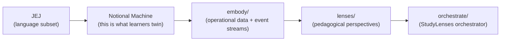
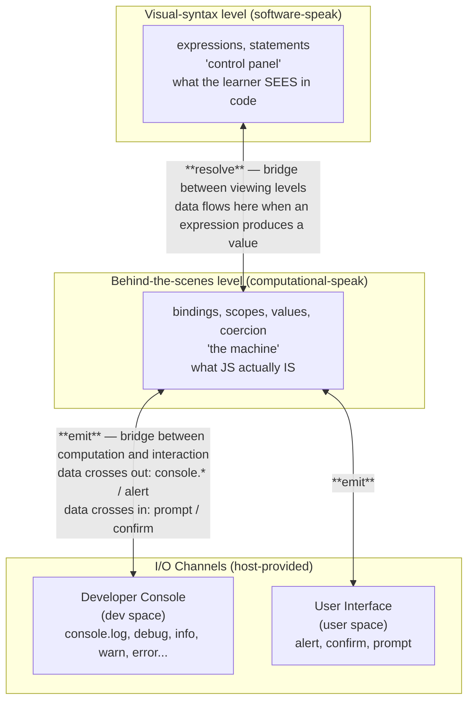

# Welcome to Frogramming — Curriculum Ontology

> **Purpose**: this document is the substantive ontology of the WtF curriculum.
> It captures the _conclusions_ of an extended thinking-together process — the
> framework, not the conversation. It weaves substance from `syllabus.md`,
> `narrative/README.md`, and the `just-enough/javascript/` infrastructure
> documentation.
>
> **Companions** (siblings, by co-location):
>
> - `syllabus.guide.{learners,authors,community}.md` — the _why_ per
>   audience
> - `syllabus.chapters.md` — the _how_ at chapter grain (5-layer LO grid)
> - `syllabus.md` — the existing prose course (read-only for the current
>   redraft)
>
> **Status**: end-state document. Status / phase / hedging belong in git history
> (commit log), not here.
>
> **Voice**: reference-neutral; un-prose-y. Tables, lists, mermaid only where
> relationships need it, `<details>`-wrapped visuals with relative-importance
> caveats. This is a transitional artifact toward visuals-as-load-bearing for
> the curriculum.

---

## Contents

- [Part A — Frame](#part-a--frame)
  - [§1 Foundational principles](#1-foundational-principles)
  - [§2 Geometry — three domains, two bridging activities](#2-geometry--three-domains-two-bridging-activities)
  - [§3 The characters — V and F](#3-the-characters--v-and-f)
  - [§4 The 5-tier ATT](#4-the-5-tier-att)
- [Part B — Translational research positioning](#part-b--translational-research-positioning)
  - [B.4 Research orientation](#b4-research-orientation)
- [Part C — Pedagogical depth (orthogonal to chapter sequence)](#part-c--pedagogical-depth)
  - [§12 The 5 layers](#12-the-5-layers)
  - [§13 The 5 strands — equal status](#13-the-5-strands--equal-status)
  - [§14 The data thread (the red thread)](#14-the-data-thread-the-red-thread)
  - [§15 Self-twinning Bildung arc](#15-self-twinning-bildung-arc)
- [Part D — Cogsci grounding](#part-d--cogsci-grounding)
  - [§16 Friston / predictive processing](#16-friston--predictive-processing)
  - [§17 Strata of a software system — refining §2's geometry](#17-strata-of-a-software-system--refining-2s-geometry)
- [Part E — The LLM shift](#part-e--the-llm-shift)
  - [§18 Substrate substitution at artifact-logic — what changes about the artifact](#18-substrate-substitution-at-artifact-logic--what-changes-about-the-artifact)
  - [§19 The LLM shift, workflow-side — how AI participates in your work](#19-the-llm-shift-workflow-side--how-ai-participates-in-your-work)
  - [§20 Bret Victor decomposition](#20-bret-victor-decomposition)
- [Part F — Curriculum machinery](#part-f--curriculum-machinery)
  - [§21 Computational vocabulary axes](#21-computational-vocabulary-axes)
  - [§22 Chapter architecture](#22-chapter-architecture)
- [Part G — Infrastructure (the JEJ chain)](#part-g--infrastructure-the-jej-chain)
  - [§23 JEJ → NM → embody → lenses → orchestrator](#23-jej--nm--embody--lenses--orchestrator)
- [Part H — Teaching apparatus](#part-h--teaching-apparatus)
  - [§24 The composer/virtuoso/mechanism metaphor](#24-the-composervirtuosomechanism-metaphor)
  - [§25 Symbology](#25-symbology)
- [Part I — Honoring commitments](#part-i--honoring-commitments)
  - [§26 The mu-tribute](#26-the-mu-tribute)
  - [§27 Voice / style commitments](#27-voice--style-commitments)
  - [§28 Structural commitments](#28-structural-commitments)
- [Part J — Out of scope](#part-j--out-of-scope)
  - [§29 What's deferred to follow-on courses](#29-whats-deferred-to-follow-on-courses)
- [Source materials](#source-materials)

---

## Part A — Frame

### §1 Foundational principles

Two principles run beneath everything in the curriculum. Paired sentences that
the syllabus returns to whenever it needs to ground itself.

#### Principle 1 — Understanding is non-delegable

> **AI can do many things FOR you. It cannot UNDERSTAND for you.**

Mechanism: understanding lives as a _generative model_ in the learner's head,
doing prediction-and-update on the learner's own sensory stream. AI can complete
tasks; AI cannot have _your_ generative model align with the target system. The
**mastery contract** follows: a skill is mastered when exercises can be
completed without AI, because mastery is the _having of the experience that
builds the model_ — non-transferable.

##### Three threads grounding the principle

The claim _"AI can't UNDERSTAND for you"_ sits at the intersection of three
distinct strands of cognitive-science / philosophy. They are pieces of one
puzzle, not competing accounts.

- **Polanyi** (_The Tacit Dimension_, 1966) names **knowing**, particularly
  _tacit knowing_: skilled competence drawing on a vast unarticulated
  background. _"We know more than we can tell."_ This grounds the mastery
  contract — mastery is demonstrable competence (tacit), not explanatory fluency
  (explicit).
- **Friston** (active inference; contemporary cogsci) supplies the **mechanism**
  by which tacit knowing operates: a learner's generative model aligning,
  through prediction-and-update on the learner's own sensory stream, with the
  target system. Not a competing account of knowing; the mechanistic
  underwriting of it.
- **Metacognition** (Hohwy, Fleming, and others in the Friston-adjacent field)
  is the **awareness-of-knowing** layer — how (and how well) people understand
  what they know and the skills they demonstrate. Distinct from both the tacit
  knowing itself and the mechanism by which it operates.

Together: an AI can write code, articulate explanations, even pass exercises.
What it cannot do is run the prediction-and-update loop on _your_ sensory
stream, build _your_ tacit competence, or grow _your_ awareness of what you do
and don't know. Knowing, the mechanism that produces it, and the awareness of
that mechanism are all first-person work. The curriculum is designed to make
that work happen — and to make its results visible to the learner doing it.

#### Principle 2 — Concepts are connections; connections are concepts

> **Concepts are connections; connections are concepts. Learning is
> connection-making.**

A mutual-definition strange loop. A concept IS its connection-set; a connection
between existing concepts is itself a new concept. There's no atomic
concept-substrate underneath — concepts and connections are the same fabric
viewed from different angles.

The principle grounds:

- The spiderweb curriculum + the spiral as traversal (`syllabus.pedagogy.md` §6)
- The 5 layers (§12) — depth = connection-density
- The 5 strands (§13) — each strand is a _kind of connection_
- The data thread (§14) — data flows through connections; connections shape what
  data can be
- Twinning (§16) — building a generative model = building a connection-graph
  that mirrors the target's
- Programming itself — a program is a connection-graph; programming is
  connection-making in code

Together, the two principles rule out both **cargo-cult learning** (no real
connection-graph built) and **atomic-fact memorization** (concepts mistaken for
unitary things).

> **On intellectual agency**: empowerment / intellectual confidence is the META
> learning objective unifying the 5 layers (§12). It is _not_ a third
> foundational principle in the ontology — that work belongs in the guides
> (`syllabus.guide.{learners,authors,community}.md`). The two principles
> above are the curriculum's spine; intellectual agency is its purpose.

---

### §2 Geometry — three domains, two bridging activities

```text
domain  ←design thinking→  the computational artifact  ←computational thinking→  CS / theory
   │             │                       │                          │                    │
 (V's       (V's bridge:            (where V and F           (F's bridge:              (F's
  outer        practice              both engage —             practice                 outer
  endpoint)    of design              software,                 of computational         endpoint)
               thinking)              hardware,                 thinking)
                                      hybrids)
```

#### Three domains (where things live)

- **Domain** — the world. Users, contexts, situations, problems. V's outer
  endpoint; deepens in _Welcome to Design_.
- **The computational artifact** — what's made. Software, hardware, hybrids
  (wearables, embedded, embodied). Both V and F engage it; this is the trading
  zone where their practices structurally meet.
- **CS / theory** — formal abstractions. Algorithms, complexity, correctness.
  F's outer endpoint; deepens in _Welcome to Algorithms_.

#### Two bridging activities (the thinking that traverses)

- **Design thinking** — V's bridging activity. V twins the user; bridges domain
  ↔ computational artifact through design thinking.
- **Computational thinking** — F's bridging activity. F twins the NM (notional
  machine of whatever artifact substrate is in play); bridges computational
  artifact ↔ CS/theory through computational thinking.

**Twinning is what makes the bridging activity _thinking_ rather than mere
process.** Design _thinking_ requires twinning the user; without the user-twin,
what's happening is _design process_ (wireframes, personas, A/B tests,
design-thinking steps) but not design _thinking_. Same on F's side:
_computational thinking_ requires twinning the NM; without the NM-twin, what's
happening is _computational process_ (unit tests, patterns, refactoring moves)
but not computational _thinking_. See §3 for the failure-mode elaboration.

#### Hardware: in the mix; perpendicularity deferred

Hardware lives **inside the computational artifact** with software and hybrids.
Whether hardware is _also_ a perpendicular axis is deferred for later
litigation. What matters now: hardware is in the mix; V and F both engage it as
part of the central domain.

---

### §3 The characters — V and F

V and F are **substrate-agnostic bridging personae**. The framing extends from
JS-in-browser to wearables, tangibles, embedded, embodied — anywhere a
computational artifact gets designed and engineered.[^wtf-origin]

[^wtf-origin]:
    The course's name has a happy origin: in an early planning conversation
    someone noted that "Welcome to Programming" reads as "WtF." The author
    leaned in. The whole curriculum's ontology — V/F as Vibetoader/Frogrammer,
    the symbology, the playful tone — grew from that joke.

| Character         | Twin (non-delegable) | Bridging activity      | Substrate range                                                           |
| ----------------- | -------------------- | ---------------------- | ------------------------------------------------------------------------- |
| 🎨 **Vibetoader** | the user             | design thinking        | software, hardware, hybrids — anywhere a user experience needs designing  |
| 🔬 **Frogrammer** | the NM               | computational thinking | software, hardware, hybrids — anywhere a notional machine needs designing |

#### Defined-by-twinning, defined-by-what-they-aren't

**Twinning is integral to V/F.** Without twinning, the terms no longer apply.
The "hat" — V or F — is a stance of _being grounded in_ a twin, not a stylistic
choice or a label.

**Vibing is not a failure mode.** Building by feel without a deep twin —
pattern-matching from prior examples, copy-paste-tweak, idiom-following — is a
legitimate stance, pre- and post-LLM. Pre-LLM it was often the fastest way to
build (Stack-Overflow-driven development; React hooks rules without
understanding reconciliation; CSS by trial-and-error; jQuery without a DOM
model; Rails magic). Post-LLM it is what Karpathy named _vibe coding_. The
stance can be V-flavored (user-experience-led with the NM delegated) or
F-flavored (NM-led with user-research delegated) — what matters is _which twin_
is being intentionally delegated, not whether the stance involves
pattern-following.

What fails is each hat's _realm process without its realm thinking_:

- **V failure — design process without design thinking.** Cargo-culting
  wireframes, user personas, A/B tests, design-thinking steps — without actually
  twinning the user. _Symptoms_: cannot answer specific questions about user /
  audience / personas; cannot connect artifact features to specific user
  characteristics or needs; cannot provide user / persona validations or
  evidence for design decisions.
- **F failure — computational process without computational thinking.**
  Cargo-culting unit tests, architecture / paradigm patterns, refactoring moves
  — without an NM-model the moves correspond to. _Symptoms_: can only describe
  black-box unit tests, not structural / glass-box tests; using patterns subtly
  incompatible with the underlying language / framework.

#### Twin-failure categories (apply equally to V and F)

These are the _kinds_ of twin breakdown that produce the failure-mode symptoms
above:

- **Twin ignored** — you know you should build a twin (V's user-twin or F's
  NM-twin) but skip it under time pressure or convention
- **Twin wrong** — you have a twin but it's misaligned with reality; you predict
  against it, fail, and don't notice the failure (the **two-layer misconception
  mechanism** in §How Learning Happens names exactly this for F's NM-twin: many
  wrong NMs produce right outputs for a while)
- **Twin not-yet-known** — you don't yet know that twinning is part of the
  practice; you've never been told there's a thing to build

#### The twin / process 2×2

|                    | **NM-twin: NO**                                                                                      | **NM-twin: YES**                                                                                                                                       |
| ------------------ | ---------------------------------------------------------------------------------------------------- | ------------------------------------------------------------------------------------------------------------------------------------------------------ |
| **User-twin: NO**  | **Pure process** — twin-less; follows checklists / patterns / steps without grounding in either twin | **🔬 Frogrammer** — twins the NM (Ch2 develops this)                                                                                                   |
| **User-twin: YES** | **🎨 Vibetoader** — twins the user (Ch3 develops this)                                               | **The both-twins state** — the transcendent practice Ch4 (V + F operating alongside an LLM) and Ch5 (V + F merged in snippetry) develop in the learner |

Three of the four corners get curriculum-chapter mappings: Ch2 = F, Ch3 = V,
Ch4 + Ch5 = both. The fourth corner (no twin) is the starting position the
curriculum brings learners _out of_.

> **Flipside reading (with §17 artifact-faces).** The both-twins state names
> the **perceiving** — one perceiver holding user-twin + NM-twin
> simultaneously. §17 names the **perceived** — one artifact with two material
> faces, artifact-logic (the F-face) + artifact-surface (the V-face). These
> are flipsides of the same coin: dual-twinning is the perceiving, two-faced
> artifact is the perceived; they co-constitute. §3 stays the canonical home
> for the perceiver-side reading; §17 stays the canonical home for the
> perceived-side reading.

Note on _vibe coding_ (Karpathy): the term names LLM-mediated building without
reading the code. It can be done with a user-twin (LLM-collaborative Vibetoading
— V corner) or without (no-twin corner). It is not bound to a single corner;
_which twin (if any) the practitioner is holding_ is what places it on the grid.

#### On the relationship between twin and process

Twin-less processes still have value. Wireframes, personas, unit tests, design
patterns, refactoring moves have evolved as effective guardrails / guides /
checklists; they carry accumulated wisdom against well-known failure patterns. A
learner with disciplined process but no twin can sometimes reach similar
outcomes to a practitioner with strong twinning but loose process, especially in
well-bounded settings. The processes are _not a substitute for twinning_, but
they aren't worthless without it either.

Strict process _with_ strong twinning is itself a failure mode. The processes
are descriptive — derived retrospectively from observing practitioners who twin
well (somewhat like music theory describes what composers do without dictating
it). A strongly-twinning practitioner who treats the processes as composition
rules rather than as guides loses the responsiveness their twin and automated
experience provide.

The healthy relationship: processes _afford_ structure; twins _do_ the work;
experience automates the integration. _You have to understand the rules in order
to break them._

#### Documentation as a both-hats case

Technical documentation requires both _dev / reader twinning_ (V-shape — what
does the reader need to find here, in what order?) AND _NM-twinning at the
documented software's level of abstraction_ (F-shape — what is this API's
notional machine, what events / behaviors does it produce?). Building an API or
library is effectively _creating a new NM_ layered on top of the underlying
language; documenting it well requires twinning that NM, not just the language's
NM beneath it.

#### Symptoms (not failure modes themselves)

Ceremony-without-twin (TDD performed without NM-awareness; code review without
understanding what to look for; F-shaped process performed for compliance) and
design-thinking-process-without-user-twin (personas done as ceremony; A/B tests
without theory of user; V-shaped process performed for compliance) are what
failure-mode practices _look like_ from outside — they are not the failure
itself. The failure is upstream, in the twin (or in strict-process-enforcement
when already twinning, per the music-theory note above).

#### The four-quadrant grid

V/F is a stance about _which twin you shoulder_, orthogonal to whether an LLM is
in the loop:

|                                    | **Humans-only**                                                                                                    | **LLM-collab**                                                                                                             |
| ---------------------------------- | ------------------------------------------------------------------------------------------------------------------ | -------------------------------------------------------------------------------------------------------------------------- |
| 🎨 **Vibetoading** (user-grounded) | UX-research-led prototyping; design-thinking-driven iteration with real people; the NM is intentionally delegated. | Karpathy's _vibe coding_ — LLM writes notation, you focus on user-visible outcomes; works only paired with deep user-twin. |
| 🔬 **Frogramming** (NM-grounded)   | Traditional engineering — humans write notation grounded in NM-awareness, craft practices applied intentionally.   | Willison's _vibe engineering_ / _agentic engineering_ — LLM writes notation; you direct and verify against the NM.         |

#### Vibing predates LLMs

Pattern-matching syntax without understanding the underlying mechanism is older
than LLMs by decades — copy-paste-tweak from Stack Overflow, React hooks rules
without understanding reconciliation, CSS flexbox by trial-and-error, jQuery
selectors without a DOM model, Rails magic accepted as opaque. LLMs amplified
the practice; they didn't invent it.

#### Related vocabulary

| Term                    | Coined by         | Relationship                                                                      |
| ----------------------- | ----------------- | --------------------------------------------------------------------------------- |
| **Vibe coding**         | Karpathy          | Narrow: building with an LLM without reading the code it writes.                  |
| **Vibe engineering**    | Willison          | Disciplined counterpart: seasoned engineers using LLMs while staying accountable. |
| **Agentic engineering** | Willison / Osmani | Building with coding agents that execute and iterate.                             |

**Frogramming is broader than any of these** — tool-agnostic,
abstraction-level-agnostic. Vibe engineering and agentic engineering are flavors
of LLM-collaborative Frogramming.

#### V and F personalities (sketches; open)

##### 🎨 The Vibetoader

- **Stance**: grounded in the user
- **Energy**: playful, exploratory, prototype-first
- **Tools of trade**: sketches, personas, storyboards, A/B tests, usability
  studies, prototyping platforms
- **Tells**: _"what if we just tried…"_; _"let's see what the user does"_
- **Strengths**: empathic resonance; tolerance for ambiguity; rapid iteration;
  aesthetic sense

##### 🔬 The Frogrammer

- **Stance**: grounded in the notional machine
- **Energy**: methodical, predictive, mechanism-curious
- **Tools of trade**: trace tables, predictive stepping, Study Lenses, debugger,
  code reviews, assertions, lint, tests — _the kit of magnifying glasses_ the
  Frogrammer carries
- **Tells**: _"predict before you run"_; _"what does the machine actually do?"_
- **Strengths**: precision; pattern-recognition at the event level; calm in the
  face of errors-as-information

#### V/F dynamic — the Bakhtiarian loop

V and F engage iteratively, learning each other's craft as they go. V proposes
use-case experiences (_"imagine an interaction where…"_); F discovers what the
substrate affords (_"this becomes possible, and it also enables…"_). Each turn
shifts what V can propose and what F can build. The exchange is open-ended — no
fixed number of beats, no required rhythm. Over time, V and F merge in the
practitioner; Ch5's snippetry is where the merging crystallizes into a single
integrated practice (the both-twins corner of the §3 2×2, in its merged form).

Engaging in these exchanges is how each side picks up the other's craft: V
learns what's afford-able through F's iterative discoveries; F learns to read
user-experience signals through V's iterative proposals. The dynamic recurs in
historical pairs (Faraday/Maxwell, Mendel/breeders).

#### V/F vs. Composer/Virtuoso/Mechanism/Audience cast

The Composer/Virtuoso/Mechanism/Audience cast (§24) is **teaching apparatus** —
explicitly not structural guide, explicitly not the canonical home for any
learning objective. V and F are **practice-stances** the student inhabits and
are tied to LOs. The two are **orthogonal**:

- A _stance_ (V or F) and a _role_ (Composer / Virtuoso / Mechanism / Audience)
  coexist in any moment of work
- V/F say which audience the practitioner twins
- Composer/Virtuoso say which phase of composition the practitioner is in

The metaphor exists to illustrate the practice; it is not the practice.

#### V/F at the artifact layer — coordinated Translational Sprints

The V/F symmetry operates at two layers — the student layer and the **artifact
layer**, between the curriculum and the infrastructure that makes its pedagogy
operational:

| Layer        | V (physics / experiential)                                                      | F (engineering / technical)                                                           |
| ------------ | ------------------------------------------------------------------------------- | ------------------------------------------------------------------------------------- |
| **Student**  | the Vibetoader (grounded in the user the program serves)                        | the Frogrammer (grounded in the notional machine the program runs on)                 |
| **Artifact** | **the curriculum** (design thinking about the learner's experience of learning) | **`lenses/embody`** (engineered technical affordances that make NM-territory legible) |

The two artifacts operate as **coordinated Translational Sprints** — two
translational research artifacts (in TCER's sense; see §11-sex) in the same
trading zone, each shaping the other's next iteration.

> **We are doing the innovation process we're teaching.**

See §11-sex Tool-Theory Co-evolution and `syllabus.translational-framing.md` for
the deeper analysis. The pattern recurses: V and F at the student layer; V and F
at the artifact layer. Bakhtiar Mikhak's _engineering × physics co-evolution_
names the meta-pattern: engineering practice (technical affordances) and
theoretical/experiential practice mutually constitute each other, with neither
downstream of the other. The artifact-layer V/F is one instance of that
meta-pattern.

#### Lineage (precursors in the user's prior writing + deeper)

- **"Wear Hats, not Titles"** — V/F's situational/plural/context- dependent
  precursor
- **"Computer Empathy"** (`Module___Welcome to JS___1.md`, 2018) — direct
  precursor to F's NM-twin via prediction. _"Twinning" is what "Computer
  Empathy" was reaching for, six years on._ Direct continuity.
- **Three-audience architecture** (developer / computer / user) — intrinsically
  bridging; the developer holds all three audiences
- **Bakhtiar Mikhak — engineering × physics co-evolution** — the deeper pattern
  V/F instantiates. Faraday/Maxwell-style mutual constitution: engineering
  practice and theoretical practice shape each other; neither is downstream of
  the other. Same teacher who introduced the user to the data/interaction
  architectural pattern (which inspired embody/lenses) AND the
  _infrastructure-is-research- contribution_ claim (§11-sex).

<details>
<summary><b>Visualization: V/F + the rhetorical model</b> <i>(most load-bearing — existing asset)</i></summary>


AI sits _outside_ the rhetorical circle — exactly the virtuoso's position in the
teaching-apparatus cast (§24).

</details>

---

### §4 The 5-tier ATT

The Cunningham et al. 2012 Abstraction Transition Taxonomy had 3 levels (English
/ Code / CS Speak). The revised model has 5: each of the three domains, plus
each of the two bridging activities, has its own **linguistic register** — its
_speak_.

| Column                         | Type                          | Speak (linguistic register)                                                                                   | Who works it                                  |
| ------------------------------ | ----------------------------- | ------------------------------------------------------------------------------------------------------------- | --------------------------------------------- |
| **Domain**                     | domain (where)                | **Domain speak** — English about users, world, contexts; user stories in domain vocabulary                    | V's outer; deepens in _Welcome to Design_     |
| (V's bridge)                   | bridging activity (how)       | **Design speak** — sketches, personas, user stories-as-design, wireframes, storyboards, design-system specs   | 🎨 V (design thinking)                        |
| **The computational artifact** | domain (where — the artifact) | **Artifact speak** — code-as-text + machine internals; static + dynamic faces of the made-thing               | both V and F engage                           |
| (F's bridge)                   | bridging activity (how)       | **Computational speak** — algorithmic reasoning, big-O, complexity arguments, correctness in operational form | 🔬 F (computational thinking)                 |
| **CS / theory**                | domain (where)                | **CS speak** — formal proofs, theory, complexity classes, lambda calculus, formal verification                | F's outer; deepens in _Welcome to Algorithms_ |

**Bridging activities ARE linguistic registers in real practice.** Design speak
(sketches/personas/stories) and computational speak
(algorithmic-reasoning/big-O) are recognized professional languages. The 5-tier
ATT names them as ATT levels because they are.

#### Code Speak's fate (decomposition)

The original 3-tier ATT's "Code Speak" decomposes — but into _artifact speak_ as
a single layer that internally splits into static (code-as-text) and dynamic
(machine internals / NM events). The static/dynamic split is preserved; it just
sits _inside_ the central domain rather than as two separate ATT tiers.

---

## Part B — Translational research positioning

The curriculum's research orientation — how it positions itself as a
research artifact, and what that means for how it gets made and adapted.

> **Note (Wave 3d-ii-a migration):** The design principles formerly in
> Part B (§B.1 Cogsci mechanisms — §5 Pedagogical sampling, §6 Spiderweb
> + spiral, §7 Explorotron framework, §8 Threshold concepts, §9 Transfer
> Paradox; §B.2 Course-construction — §10 Reusability Paradox, §11
> Course-as-Quine, §12-bis through §12-sex; and §B.3 Stance & values)
> have moved to `syllabus.pedagogy.md` under "Design principles
> (migrated from ontology Part B)." The translational research material
> below (§B.4 + §11-bis through §11-sept) stays in ontology because it
> describes the curriculum's research positioning rather than its
> pedagogical design principles.

### B.4 Research orientation

How the curriculum positions itself as a research artifact, and what that means
for how it gets made and adapted. _Distinct from the instructional-design
clusters above (B.1 + B.2) and from the values cluster (B.3) — these principles
govern the curriculum's relationship to research, not its relationship to
learners._

See the companion `syllabus.translational-framing.md` for the deeper analysis.
This sub-grouping carries the working principles.

#### §11-bis TCER positioning

The curriculum is a **translational research artifact** in the sense of Cole,
Malaise & Signer (2023), _Computing Education Research as a Translational
Transdiscipline_ (SIGCSE 2023). It is not _informed by_ research — it _is_
research, conducted by making and teaching, with artifacts that can be studied
and refined.

Operating positions on the translational continuum:

| TCER Phase                               | What the curriculum does                              | Continuum            |
| ---------------------------------------- | ----------------------------------------------------- | -------------------- |
| **3.B\*** Practitioner-facing guidelines | Synthesizes research into actionable teaching content | PT (Practice Theory) |
| **4.A\*** Evidence-based prototype       | The curriculum IS the intervention                    | PD (Practice Design) |
| **4.B\*** User feedback & reports        | Teaching it generates research data                   | RD (Research Design) |

All three are trading zones (marked \*); see §11-ter.

**Two traps named by TCER, both to avoid**:

- **The translational imperative** — pressuring all work to justify broader
  impacts
- **The pipeline misconception** — translation is _cyclical_, not linear

#### §11-ter Trading zones

From Galison (1997), applied to CER by TCER. Places where people from different
traditions coordinate locally on specific problems without needing to agree
globally on methodology or philosophy.

The curriculum's trading zones (operational, not metaphorical):

- The curriculum committee ↔ research committee coordination at the evidence-tag
  level (📐 translations, 🧪 extensions)
- Partner cohorts (including the Palestinian-community prototype cohort) ↔
  curriculum committee, where adaptation feedback shapes next iterations
- The author ↔ the discourse community (citation, response, extension)
- The curriculum ↔ `lenses/embody` infrastructure (see §11-sex Tool-Theory
  Co-evolution)

Connects directly to **community-as-making** (`syllabus.pedagogy.md` B.3
Stance & values: the course is _made in community_, not just _for_ community). Partner cohorts are not
user-tests; they are trading-zone work in TCER's technical sense.

**Related concept**: Susan Leigh Star's _boundary objects_ (1989) is a sibling
concept in the science-studies literature, often paired with Galison's trading
zones. Boundary objects are _plastic enough_ to adapt to local needs of
different communities AND _robust enough_ to maintain common identity across
them. `lenses/embody` is a boundary object in this sense — theory-neutral
infrastructure that multiple pedagogies can consume. The per-chapter
`research-framing.md` files and the Evidence Tag System (🔬 / 📐 / 🧪) they
deploy operate as boundary-object protocols: shared formats that let curriculum
and research committees coordinate without needing to agree globally.

#### §11-quater Reflexive Analysis & Action

A _core TCER principle_, not a footnote: the curriculum reflexively analyzes how
research findings reshape its design, and learners' artifacts feed back as
research data that may reshape the theoretical frameworks. Questioning and
refining the analysis is itself doing translational research.

Two registers:

1. **Author/committee-side** — explicit revision of design decisions when new
   evidence arrives or when partner-cohort experience contradicts prior
   assumptions
2. **Learner-artifact-side** — exercise outputs, traces, gist submissions become
   research data observable to anyone who wishes to study them

**Temporal modes** (Schön, _The Reflective Practitioner_, 1983): both
_reflection-in-action_ (mid-doing, during the work) and _reflection-on-action_
(after-doing, on the finished artifact) apply here. The author/committee-side
register encompasses both modes; the learner-artifact-side register operates
primarily as reflection-on-action over time, with reflection-in-action available
when the artifacts are produced live in cohort settings.

#### §11-quinque Pedagogy Wins

When pedagogical effectiveness and research observability conflict, **pedagogy
wins. Always.**

Exercises are designed for learning first; their research value comes from
natural byproducts, not additional instrumentation burden on learners. No
assessment steps that interrupt learning flow just to generate data. No
content-density increases for observability when they overload learners.

Connects (with tension) to embody's _Pure data, no methods_ principle: **embody
is theory-neutral infrastructure; the curriculum is opinionated content using
that infrastructure.** This is the **Reusability Paradox** (§10) and **Transfer
Paradox** (§9) operating together at the artifact level.

#### §11-sex Tool-Theory Co-evolution

> **"Building infrastructure IS research contribution."** — Bakhtiar Mikhak (the
> same teacher who introduced the user to the _engineering × physics
> co-evolution_ that underlies the deeper V/F relationship; see §3 lineage).

The CERN-for-physics analogy: measurement infrastructure creates the theoretical
insights it later validates. Tools and theory mutually constitute each other;
neither is downstream of the other.

**The curriculum's instantiation of this pattern** (see §3 V/F at the artifact
layer for the full V/F mapping):

- **`lenses/embody`** is the engineering side (F at the artifact layer) —
  technical affordances that make NM-territory legible
- **The curriculum** is the experiential / theoretical side (V at the artifact
  layer) — design thinking about the learner's experience of learning
- They operate as **coordinated Translational Sprints** — two translational
  research artifacts in the same trading zone, each shaping the other's next
  iteration

> **We are doing the innovation process we're teaching.**

The V/F symmetry the curriculum teaches at the _student_ layer recurs at the
_artifact_ layer. This is the **engineering × physics co-evolution** Bakhtiar
surfaced (Faraday/Maxwell-style mutual constitution).

Cross-link: §3 V/F (student-layer + the corrective note that the artifact-layer
V/F flips the surface-intuition mapping); §23 JEJ chain (the artifact-layer
mechanism in operation).

#### §11-sept Translational Sprints (light touch)

> _"TCER tells you WHAT; Translational Sprints tell you HOW."_

A complementary methodology that operationalizes TCER. The 6-stage cyclical
process is documented in
`DGMD-E-1-artifacts/embodying-tcer/8-agile-cer-connection/` and is out-of-scope
for this ontology to detail. What matters at this layer:

- The curriculum's iterative development pattern (alumni co-development,
  cohort-shaped revisions, ongoing reflexive analysis)
- The relationship between the curriculum and `lenses/embody` is itself a
  Translational Sprint pair
- Adaptation by curriculum authors / forkers / contributors is a Translational
  Sprint contribution, not a passive consumption

Acknowledged here; detailed elsewhere.

---

## Part C — Pedagogical depth

Orthogonal to chapter sequence. The 5 layers, 5 strands, data thread, Bildung
arc.

### §12 The 5 layers

Each chapter runs ALL 5 layers. The layers are _engagement depths_ the reader
can stay at or descend through. **A learner who stays at L1 graduates well; a
learner who revisits at L3 finds more; a learner who re-encounters at L4 finds
more again.** Each layer is a complete exit point.

> **Meta learning objective unifying all 5 layers**: _intellectual agency_. Each
> layer is intellectual agency at a different scale. This is the through-line
> that connects the layers to the guides
> (`syllabus.guide.{learners,authors,community}.md`).

| Layer  | Frame                | Meta-objective (intellectual agency over…) | Primary objective                                                                                     | Learned through                                                                                               |
| ------ | -------------------- | ------------------------------------------ | ----------------------------------------------------------------------------------------------------- | ------------------------------------------------------------------------------------------------------------- |
| **L0** | Embody / Mastery     | …the notional machine                      | Predictive mastery of the event-based JEJ NM                                                          | embody + predictive lenses                                                                                    |
| **L1** | Apply / Rhetoric     | …communicative production                  | Context-aware comprehension, discussion, production across three audiences                            | embody + static and analytical lenses, reflection questions, program comparison, case studies, process guides |
| **L2** | Switch / Methodology | …methodology choice                        | Switch comfortably between V and F hats; comfort with design + computational thinking                 | process guides, case studies, open-ended exercises, discussion questions, external resources                  |
| **L3** | Explore / Snippetry  | …the medium itself                         | Programming automaticity; exploring concepts/domains _through_ programming; self-directed exploration | snippetry, remixing, esoteric prompts (quines, wuzzles, cross-medium translations)                            |
| **L4** | Wonder / Philosophy  | …the philosophical questions               | Understand world as information + embodied computation; generate interesting philosophical questions  | easter eggs in main text; side/footnotes; references; questions                                               |

> **SOLO taxonomy applies _within_ each layer**, not across — see
> `syllabus.pedagogy.md` "Using the 5 layers (§12) in teaching" for the
> design principle.

#### Each layer's data thread (the red thread ramifies)

| Layer | What "data" means at this layer                            |
| ----- | ---------------------------------------------------------- |
| L0    | NM-internal: events, scopes, values, coercion              |
| L1    | Multi-modal communicative flow (rhetorics, audiences)      |
| L2    | Intentional design of data flows for specific ends         |
| L3    | Substrate for self-expression and exploration              |
| L4    | Information + embodied computation as substrate of reality |

#### L4 by strand — each strand's philosophy reading (open-ended development guide)

L4 is not only easter-eggs-scattered-as-references; it is a structural promise.
Each of the 5 strands has a philosophy reading that opens at L4. These pair the
operational work of the strand with a tradition that names what the strand is
ultimately about.

| Strand                     | L4 philosophy reading                                                                                                                                                     |
| -------------------------- | ------------------------------------------------------------------------------------------------------------------------------------------------------------------------- |
| Twinning                   | Active inference / Friston / Polanyi (tacit knowing as predictive alignment); self-twinning as theory of consciousness (the predictive model of self is the seat of self) |
| Decisions                  | Compositional voice / authorship / free will (small choices accumulating into style)                                                                                      |
| Perspective stacking       | Phenomenology / point-of-view in fiction / Nagel's _What Is It Like…_                                                                                                     |
| Whole rhetorical situation | Systems thinking / Bateson / cybernetics (the whole as the unit of analysis)                                                                                              |
| Affordances                | Gibson / embodied cognition / ecological psychology (perception as relational)                                                                                            |

Open-ended development guide — readings deepen and shift; the table is a
direction-finder, not a closed catalog.

#### Substrate is not inert

embody is **not** a static thing the dynamic flow gets laid onto. It is a
**crystalline representation of the entire dynamic data lifecycle of a program**
— _"a static 4D rendering of a 3D flowing river"_ (user). Streams represent the
dynamics of data processing in the NM. embody exists to make all facets of the
dynamics explorable.

This sharpens F's grounding: **F is grounded in the motion the substrate makes
legible**, not in a static model.

> **Layer-architecture rendering rules** (each-layer-through-each-chapter,
> platform-agnostic constraint, layer-by-markdown-affordance mapping) and
> **layer-title brainstorming** (verb/noun/hybrid styles) — see
> `syllabus.pedagogy.md` "Using the 5 layers (§12) in teaching."

---

### §13 The 5 strands — equal status

Strands are the _connection-types_ the curriculum tracks. Each strand represents
one _way of making connections_ the learner is being trained to recognize and
produce.

> **Vocabulary note**: "thread" is reserved for the _data thread_ (§14) — the
> red thread that stitches everything together. The 5 below are **strands**.

#### Twinning

Connections to target systems. Building a generative model of a process outside
your own mind that aligns with that process's actual behavior.

**Targets across chapters**:

- Ch1: 🧑‍💻 the developer who reads your code (incl. future-you)
- Ch2: 💻 the computer (NM) that evaluates your code
- Ch3: the user who experiences your program
- Ch4: 🤖 the agent (LLM) you collaborate with
- Ch5: yourself as poly-perspective being

**Cognitive-science grounding**: twinning IS active inference (§16).

#### Decisions (micro and macro)

Connections between options. Every keyword, name, operator, and structure in
your code is a _micro_-decision. Every architectural choice, paradigm, and
program shape is a _macro_-decision. Both reach the twinned audiences.

**Compositional voice develops here** — distinctive programmer voices emerge
from cumulative macro-decisions over time.

#### Perspective stacking

Connections across levels. Any piece of code can be read at multiple levels
simultaneously: individual syntax, what a line _does_, how parts _connect_, what
the program is _for_, what the _user experiences_. Holding more of these
perspectives active at once is the mastery move.

#### The whole rhetorical situation

Connections between all parts. The entire software context — users, developers,
computer, product, environment, and the purpose the code serves. Twinning each
part isn't enough; the fullest work holds the _whole_ situation in view.

**Two notions (Lupe Fiasco's theory of rap)**:

- **The conceit** — the message, intention, meaning. Bears the connotation of
  intention on behalf of the rhetor.
- **Coherence or decoherence** — within each actor (does this rhetor's conceit
  hold together internally?) and **over time** in a rhetorical situation (does
  the conceit hold across iterations, contributors, contexts; or does it
  decohere as the situation evolves?).

**The two-scale instrument reading.** The rhetorical situation has two scales,
not one. The first instrument is the machine playing the score — predictable,
deterministic, reading the code-as-notation literally. The second instrument is
the user's experience of that machine playing — intangible, emergent, arising
from the interaction between the parties (the user, the program, the context).
The _concert_ — the experience-as-purpose, what the work ultimately serves — is
what both V and F orient toward. Neither V nor F controls the concert directly:
the user-experience takes place in the body of the user but arises from
interaction; the work of both hats is to set up conditions that make the
experience the program serves possible. (See `syllabus.metaphor.md` for the
metaphor this reading extends; the metaphor illustrates, the strand does the
teaching.)

#### Affordances (5th strand, equal status)

Connections between agent and environment. **An affordance is a relational
property** — a chair affords sitting, but only for organisms with the right
body. Programming languages are affordance-spaces (Lisp affords macros; Haskell
affords laziness; JS affords prototype-mutation). Learning JS = learning an
affordance-space.

Equal status with the other four strands.

The Mikhak loop is an _affordance-discovery dialogue_: F probes
substrate-affordances; V probes user-affordances; their dialogue surfaces
affordances neither saw alone.

> _(See §17 for the universal-lens framing: F's lens and V's lens both travel
> to read affordances at any stratum; F naturally probes
> substrate-affordances anchored at artifact-logic, V naturally probes
> user-affordances anchored at artifact-surface — but the Mikhak loop is the
> strand-5 operationalization of lens-switching itself.)_

#### Strands × Lenses cross-map (OPEN-ENDED DEVELOPMENT GUIDE)

Each strand has a different lens-affinity. Some cells suggest lenses that don't
yet exist — gaps in the lens catalog are surfaced by the mapping itself.

| Strand                     | Lenses with strong affinity             | Gaps to consider                                                |
| -------------------------- | --------------------------------------- | --------------------------------------------------------------- |
| Twinning                   | trace-table; predictive stepping; debug | —                                                               |
| Decisions                  | blanks; parsons; code review templates  | a "decision-tree" lens that surfaces micro-decisions?           |
| Perspective stacking       | highlight; scope-walk; ask              | a multi-perspective lens that shows several reads side by side? |
| Whole rhetorical situation | (no existing lens directly serves this) | rhetorical-situation lens? — open development question          |
| Affordances                | (no existing lens directly serves this) | affordance-space lens? — what could the NM also do?             |

Marked as an **open-ended development guide** — not a closed catalog.

---

### §14 The data thread (the red thread)

The data thread is the SAME word with increasingly rich semantics across the 5
layers (see §12). The student's understanding of _what data IS_ deepens at every
spiral pass.

> "The entire embodied phenomenon from theory to domain is data flowing through
> and changing the physical world. In theory changing the minds of the thinker,
> in computation information exerting control on hardware, in interaction the
> embodied computation modifying the user, and the data transforming the domain
> through the actions and state of the user." — user, mid-conversation (round 5
> era)

**Substrate-is-not-inert sharpening**: the data thread doesn't just flow through
layers — embody **crystallizes** its dynamic flow into a static-but-4D structure
that makes all facets explorable. The data thread stitches everything together
_because_ the substrate makes the motion legible.

#### Ch3 anchor (the data-flow loop)

A vivid concrete loop becomes Ch3's anchor:

> The program's data enters the user through their eyes via a prompt; the user
> processes it and transforms it into a response; the response enters the
> program through prompt and a resolve event; the program processes; …

This grows the Ch1→Ch2 dev↔NM loop into the Ch3 dev↔NM↔user loop. Cybernetics
referenced as side/footnote, not in body.

---

### §15 Self-twinning Bildung arc

The student is themselves the audience throughout the curriculum, but at
increasing levels of recursion. This thread runs alongside the audience-ladder;
it's the _audience-YOU-are-becoming_ read of the same arc.

| Chapter | Future-you is…                                                                  |
| ------- | ------------------------------------------------------------------------------- |
| Ch1     | future-you reads code (basic dev-reader)                                        |
| Ch2     | future-you traces NM (added perspective: NM)                                    |
| Ch3     | future-you considers users (added perspective: user)                            |
| Ch4     | future-you collaborates with LLMs as a duet (first conscious perspective-stack) |
| Ch5     | future-you snippets-as-merged-V/F (perspective-stacked-singularity)             |

Each chapter adds a perspective the future-you must hold. The course teaches the
student to BECOME a poly-perspective self. Worth surfacing explicitly in §What
to Expect of `syllabus.chapters.md`.

---

## Part D — Cogsci grounding

### §16 Friston / predictive processing

**Friston's "A Duet for One"** — active inference applied to dyadic
communication. Two aligned generative models behave as a single coupled
inference system.

> **"Understanding just IS the alignment of generative models into a single
> coherent predictive process."**

Applied to LLM-collaboration: the boundary between human reasoning and machine
inference becomes porous; thought emerges at the _interface_, not within either
alone.

#### Language constraints

- ❌ **"free energy"** — too jargon for the course body
- ✓ **"alignment of generative models"** — clean replacement; survives across
  substrates
- ✓ **"predictive processing"** — broader cognitive-science framework (Andy
  Clark, Jakob Hohwy) cited in deeper section as "how minds work as predictive
  engines"
- ✓ **"active inference"** — usable but requires explanation; introduce as the
  dyadic-Friston frame in Ch4

> **The pedagogical claim that follows** (AI generates; it doesn't twin;
> your job is to twin the LLM AND what the LLM is twinning) — see
> `syllabus.pedagogy.md` "The pedagogical claim from Friston (ontology §16)."

---

### §17 Strata of a software system — refining §2's geometry

§2 introduces the geometry coarsely: three domains (theory / artifact / domain)
with V and F engaging the artifact through two bridging activities. This
section refines that geometry into a stack of substrate strata while preserving
§2's structure: the artifact-region splits into two faces (one per lens); the
theory and domain regions each gain grain. V and F remain universal lenses;
the natural twinning territory of each is the _characteristic_ range where they
most often work, not a binding constraint.

#### The strata

Drawn linearly for legibility; the stack is partially ordered. "Above" means
_presupposes the substrate below has crystallized into stable ground_, not
_depends only on the immediately lower stratum_. The categories are pedagogical
handles, not metaphysical claims — arbitrary slices on a continuum, chosen for
the minimal actionable mental model. We do not mark phase-changes between
strata.

**Theory-side (§2 right) — F's natural twinning territory extends through here
ontologically; WtF defers practical work to follow-on courses:**

1. **Platonic** — _Levin's Platonic Space (see §29)._ The informational
   interpretation of the physical world; the philosophical commitment that the
   material is _legible_ at all. Manifesto territory; the curriculum gestures
   here only at L4 (Philosophy reading).
2. **Physics / material.** Atoms, transistors, energy gradients. The physical
   substrate. Deferred entirely.
3. **Computing infrastructure.** Mathematics and formal systems made
   operational — runtimes, OSs, networks, training/build/run support software.
   Deferred to follow-on courses; named here so the student knows what sits
   below.

**Artifact-region (§2 center) — two faces of one artifact:**

4. **Artifact-logic.** The F-face. What the artifact computes — conventional
   algorithms, or a GenAI model. Same site, different substrate types. When a
   Frogrammer says "twin the machine," the machine being twinned lives here: in
   conventional software, the algorithmic logic; in AI-native software, the
   GenAI model. The stance is the same; the substrate is different. §18
   develops what changes when GenAI occupies this stratum.
5. **Artifact-surface.** The V-face. What the artifact presents outward — UI,
   APIs, programmatic and human-perceivable surfaces.

Artifact-logic and artifact-surface are two distinct substrate kinds (an
algorithm runs; a UI is painted), AND together they are the F-lens and V-lens
readings of §2's center artifact — one artifact with two material faces, each
face inviting its natural lens.

> **Flipside reading (with §3 both-twins).** §3 names the **both-twins state**
> — user-twin + NM-twin held simultaneously by one perceiver. §17 names the
> **artifact's two faces** — artifact-logic + artifact-surface, two material
> sides of one artifact. These are flipsides of the same coin: dual-twinning
> is the perceiving, two-faced artifact is the perceived; they co-constitute.
> §3 stays the canonical home for the perceiver-side reading; §17 stays the
> canonical home for the perceived-side reading.

**Domain-side (§2 left) — V's natural twinning territory extends through
here:**

6. **Interaction dynamics.** Human-system dynamics over time. Dialogue,
   workflow, habituation, repair.
7. **Systemic impacts.** Society and computing as a coupled system. What this
   kind of artifact does, in aggregate, to the world it participates in.

#### V and F: universal lenses with natural twinning territories

V (Vibetoading) and F (Frogramming) are universal lenses — either can be worn
on any artifact at any stratum. Each has a _natural twinning territory_ (the
characteristic range where it most often works), derived from the kind of
question each asks:

- **F's lens** asks: _what does the artifact compute? what's its NM?_ F's
  natural territory: **computing-infrastructure + artifact-logic** — the
  substrate side of the stack where data-models live. Computational thinking
  (§2's F-bridge) is what F does as it traverses this territory. WtF practices
  F primarily at artifact-logic; computing-infrastructure is F-territory
  ontologically but deferred to follow-on courses.
- **V's lens** asks: _what does the artifact feel like? what does it afford
  the person on the other side?_ V's natural territory: **artifact-surface +
  interaction-dynamics + systemic-impacts** — the experience side of the stack
  where embodied phenomena live. Design thinking (§2's V-bridge) is what V
  does as it traverses this territory.

The natural territories overlap at the artifact: artifact-logic is F's primary
anchor; artifact-surface is V's. This is §2's "trading zone" made vertical.

The lenses travel beyond their natural territories — F can rise into systemic
impacts to read social affordances at a formal-systems level; V can drop into
computing infrastructure to read substrate experience. The natural territories
describe characteristic ranges, not constraints.

#### Three axes — strata, strands, bridges

The curriculum's geometry has three axes, each canonical in its own section,
surfaced together here:

| Axis        | Section            | Enumerates                                                              | Question it answers                          |
| ----------- | ------------------ | ----------------------------------------------------------------------- | -------------------------------------------- |
| **Strata**  | §17 (this section) | kinds of substrate where work happens                                   | _Where_ does the work sit?                   |
| **Strands** | §13                | connection-types — stances applicable at any stratum                    | _What kind of connection_ is the learner making? |
| **Bridges** | §2                 | V's and F's bridging activities (design thinking / computational thinking) | _How_ is the work read across strata?     |

_"Bridges" is shorthand here for §2's formal noun "bridging activities"; §2
uses the possessive form ("V's bridge", "F's bridge")._

Plus the **data thread** (§14) running through everything — the word _data_
deepening its semantics at each layer.

The full geometry is _strata × strands × bridges_. We do not exhaustively map
permutations; the geometry is a direction-finder, not a closed catalog.
**Strands themselves are an open-ended catalog** (§13's strand × lens
cross-map is explicitly an open development guide — some strand × lens cells
have no existing lens yet); the triple's openness inherits from §13's. Each
axis is canonical in its own section; §17 surfaces the cross-product so the
reader can see all three at once.

#### Optional reading: lens-changes between strata

The transitions between strata can also be read as places where the productive
lens shifts most legibly — the work of strand-Affordances (§13) and the
composer/virtuoso/mechanism metaphor (§24 / `syllabus.metaphor.md`)
operationalize this reading. Listed here as a cross-frame; the strata and
the universal-lens framing remain first-class on their own terms.

#### Bridge to §18 and §19

§18 develops what changes at the _artifact_-side when GenAI occupies the
artifact-logic stratum: substrate substitution from deterministic to
non-deterministic NM, the verification limit, agentic emergence. §19 develops
the _workflow_-side: three positional roles AI can play relative to a human's
work (study partner / dev collaborator / active component), with the
depth-of-involvement and verification-target axes. Read §17 → §18 → §19 as the
natural sequence: general strata → artifact-side AI consequences → workflow-
side AI positions.

---

## Part E — The LLM shift

### §18 Substrate substitution at artifact-logic — what changes about the artifact

§17 names the strata of a software system in general terms. §18 picks up at
the **artifact-logic** stratum (§17 stratum 4) and develops what changes
_about the artifact itself_ when a GenAI model substitutes for conventional
algorithms as the substrate. §18 is the **artifact-side** of the LLM shift —
what the artifact _becomes_. §19 is the **workflow-side** — where AI sits
relative to a human's work.

§18's "NM" (notional machine) and §17's artifact-logic name the same site at
different resolutions. Substrate substitution swaps a GenAI model into that
site; the NM-twinning stance from §16 remains, but what's being twinned has
different mechanical properties.

#### Substrate substitution: deterministic → non-deterministic

The fundamental mechanical shift at artifact-logic when GenAI replaces
conventional algorithms:

**Conventional artifact-logic is, _in its core data-transformation behavior_,
deterministic.** Given input X, the algorithmic path that produces Y is
predictable. Sources of non-determinism in conventional systems —
`Math.random`, concurrency, network I/O timing, filesystem state, wall-clock
dependencies — are **bounded and locatable**; you can name them, isolate them,
mock them in tests. F's NM-twin works at this stratum because the NM is
reproducible: the same input under the same observable conditions traces the
same path through scope chains and value transformations.

**GenAI artifact-logic is non-deterministic in a categorically different way:
intrinsically.** Given input X, output is _sampled_ from a probability
distribution shaped by the model's weights. The non-determinism isn't bounded
to specific calls; it's a property of the substrate itself. F's NM-twin shifts
from predicting a specific path to characterizing a _distribution of plausible
outputs_; V's user-twin shifts to anticipating a _range of behaviors_ rather
than a specific reaction.

**This is the mechanical ground for the verification limit below.**
Conventional artifact-logic can be verified pre-deployment by exercising
input-output pairs and tracing internal events. GenAI artifact-logic resists
this because the deployed behavior is a sampling process, not a function. The
most consequential behaviors (rare outputs, drift over interaction histories)
live in the tails. The verification limit isn't a missing tool; it's a
property of the substrate.

#### The verification limit

We don't always understand what we direct — and at GenAI artifact-logic, the
substrate itself resists the kind of pre-deployment verification conventional
software permits (per the deterministic → non-deterministic shift above). Even
our tests may be out of our depth — it's possible to verify that a program does
the _wrong thing correctly_. This makes certain practices _more_ important in
an LLM-assisted workflow, not less:

- Short iterations of user-visible behavior we can actually evaluate
- Human-evaluable acceptance criteria
- Testing discipline oriented toward visible behavior
- Agile development vs Waterfall, all over again

Chapter 3 (users, PBIS, visible behavior) carries particular weight for this
reason.

#### Agentic emergence (Ch4.5 and Ch5 closing)

The authoring-partner frame (LLM = virtuoso, §19 Role 2) is a simplification.
**Agentic AI systems** that plan, execute, call tools, modify state
autonomously are emerging. That's a more complex collaboration (§19 Role 3
territory) — specifying observable outcomes humans can still evaluate becomes
load-bearing. Flag as territory for post-curriculum learning.

#### The PL-future

Currently, LLMs work with programming languages designed _for humans_. A
future where LLMs design their own formally-provable languages is possible;
those languages would likely defy our notions of "high-level" and "low-level"
(which measure distance from _human_ cognitive convenience). If we can't read
the code and can't evaluate the tests, user-visible behavior is what's left to
check against — the agile-visible-discipline story intensifies further.

Even then, the programming languages we have now remain worth cherishing: for
their humanity, for how they shape thinking, for the new thoughts they give
us, and for our connection to computational history.

---

### §19 The LLM shift, workflow-side — how AI participates in your work

§18 develops the _artifact-side_ of the LLM shift — what the artifact
_becomes_ when GenAI is in artifact-logic. §19 develops the _workflow-side_ —
where AI sits _relative to_ the human doing the work. These are orthogonal:
§18's substrate-substitution and §19's positional-roles co-vary (Role 3 IS
substrate substitution) but they answer different questions at different sites
of analysis.

#### Code is the UI for the NM

Source code is the **control panel** through which a programmer operates the
NM. Authoring code is one way to operate that panel. Describing intent to an
LLM is another. Either way, the NM is the thing the panel controls.

LLMs let you **delegate operation of the control panel** while still owning
the machine. Same V/F spectrum, two LLM-conversation modes:

- 🔬 **NM-grounded conversation** (Frogramming-with-delegation) — _"Make the
  NM declare a `const balance = 0`, then enter a `while` loop that decrements
  it until it hits zero."_ You specify behavior in NM terms. You
  predict-trace-verify the LLM's output against the NM.
- 🎨 **User-grounded conversation** (Vibetoading-with-delegation) — _"When the
  user types their amount and clicks OK, count down to zero and tell them when
  it's done."_ You specify behavior in user-experience terms.

Both produce text in the same control panel; the difference is **which
audience you twin during the conversation**.

#### The visual NM view becomes load-bearing

When you delegate the control panel, you can no longer rely on the act of
typing to keep your NM understanding sharp. Visual debuggers (`embody/` +
study lenses) let you observe, predict, and debug the machine _directly_ —
the NM view that exists regardless of who (or what) wrote the code text.
**Frogramming with delegation is only sustainable if you keep the direct NM
view alive.**

#### The architect/implementer division has always existed

Software has always had a design-work / notation-work split: architect /
implementer (Brooks), staff engineer / junior, consultant / in-house,
design-phase / build-phase. LLMs are a new kind of collaborator: same role,
different cognition.

#### Honest framing

LLMs are often better at notation than many humans — faster, broader
repertoire, fewer typos. Pretending otherwise would be dishonest. But great
Frogramming isn't only about productivity. Design judgment, context awareness,
aesthetic and ethical taste aren't where LLMs excel. And Chapter 5 develops
the case for Frogramming-for-its-own-sake.

#### Three roles of agential AI

The workflow framing above gestures at "AI as collaborator." More precisely:
AI can hold **three distinct positional relationships** to a learner's work.
They escalate in commitment; each subsequent role meaningfully presupposes
some mastery of the prior.

**Role 1 — Study partner.** AI sits in the learner's interaction-dynamics,
alongside Study Lenses. The artifact being acted on is a _separate_ artifact
the learner is studying (a snippet, a concept, someone else's code). AI is an
external scaffold; it supports the learner's reading of the studied artifact
but does not enter it.

- **Depth in artifact:** indirect — through the developer's formation over
  time. AI shapes the learner's mental models; those models then shape every
  artifact the learner subsequently builds.
- **Verification target:** the _explanation_. Can the learner verify what the
  AI said about the artifact they're studying?

**Role 2 — Design/development collaborator.** AI sits in the author's
interaction-dynamics, during authorship. The artifact being acted on is the
system being built. **AI is an external co-author; its _contribution_ enters
the artifact (frozen at deploy), but the AI as live process does not.** The
author chooses the mode: NM-grounded (F-flavored — operate the AI through F's
lens, see "Code is the UI for the NM" above) or user-grounded (V-flavored —
operate it through V's lens). Both modes deposit AI-influenced material into
the deployed artifact, then freeze.

- **Depth in artifact:** direct on creation; absent on operation. The AI's
  fingerprint is in the deployed code (or design, or copy), but the AI itself
  is not running there.
- **Verification target:** the _contribution_, at deploy. Standard
  pre-deployment verification applies _in form_ — but the verification limit
  (§18's _"we don't always understand what we direct"_) still bites here when
  the human evaluator delegated the cognition that produced the contribution.
  Verifying that the AI's output does _what was asked_ doesn't establish that
  what was asked was _what was needed_. The visual NM view and short
  user-evaluable iterations (above) are how Role 2 keeps verification honest.

**Role 3 — Active component.** AI sits **inside** the artifact's
artifact-logic stratum, as a live process. The artifact contains the AI as a
constituent part. AI is no longer external — its behavior IS the system's
behavior at runtime.

- **Depth in artifact:** internal to deployed behavior; **the AI as live
  process is now in the artifact**, not just its contribution. The fingerprint
  is live.
- **Verification target:** running behavior, continuous, irreducibly partial.
  **The §18 verification limit is at its sharpest here**, and now with a
  _mechanical_ reason: the substrate is non-deterministic (§18's
  substrate-substitution sub-section) AND the AI is live in artifact-logic
  (this role). Pre-deployment verification can characterize the distribution
  but cannot pin down production behavior.

The three axes (positional, depth-of-involvement, verification target) align
across all three roles. Read together they show the roles are real
ontological distinctions, not arbitrary slices.

#### Curriculum mapping

**Ch0–3 quietly assume Role 1.** Every learner using AI to learn is in Role 1
by default; the curriculum makes that engagement deliberate through Study
Lenses + AI explanations + tutor patterns.

**Ch4 foregrounds Role 2.** _In Ch4, AI is the development collaborator. The
artifact being built is a conventional JEJ program; the AI is an external
co-author, not artifact-logic substrate. You twin the AI as collaborator —
F's lens (NM-grounded mode) reads the AI as a cognitive substrate you operate;
V's lens (user-grounded mode) reads its behavioral surface and conversational
affordances. The layers of AI-understanding (§17 + §18) help you read_
**what** _you're twinning,_ **where** _it sits relative to your work, and_
**how** _to operationalize the collaboration while building JEJ._

**Ch5 remains in Role 2** with the snippets-surface expanded to **full JS**
(not just JEJ). The student practices Role-2 collaboration on a broader
programming language surface, building snippetry-as-craft.

**Role 3 is deferred to WtA** (Welcome to Algorithms / follow-on courses),
matching the metaphor's existing alien-composers deferral (see
`syllabus.metaphor.md` — "Alien composers (teased, deferred)"). WtF teaches
the framework so learners can recognize Role 3 when they encounter it, but
does not teach Role-3 building.

---

### §20 Bret Victor decomposition

[**_Learnable Programming_**](http://worrydream.com/LearnableProgramming/)
wanted _less implementation toil_ AND _more powerful thinking tools_. LLMs
decompose Victor's wish unexpectedly:

- ✅ **Less toil** — notation burden partially lifted by LLMs
- ❌ **Less visibility** — LLM-generated code arrives as a fait accompli; the
  mechanism is more hidden, not less
- ✅ **Study Lenses reclaims visibility** — of the machine's internals, which is
  this curriculum's specific focus (different pedagogical target from Victor;
  Victor focused on output, we focus on internals)

Study Lenses' answer to Victor's visibility wish is the **internal mechanism**
of evaluation, not the final output.

---

## Part F — Curriculum machinery

> **§21 Reading frameworks — PBIS, static/dynamic** moved to
> `syllabus.pedagogy.md` "Reading frameworks — PBIS, static/dynamic
> (migrated from ontology §21)." Subsequent sections (formerly §22–§30)
> renumber down by 1 to fill the gap (now §21–§29).

---

### §21 Computational vocabulary axes

Four orthogonal axes — distinct ways of carving the programming space:

| Term                     | What it means                                                                                                               | In WtF                                                              |
| ------------------------ | --------------------------------------------------------------------------------------------------------------------------- | ------------------------------------------------------------------- |
| **Programming paradigm** | A design philosophy for organizing programs (imperative / functional / OOP / declarative)                                   | Ch1–4 is imperative; functional / OOP / declarative deferred to Ch5 |
| **Computational domain** | What you are computing _about_ — medicine, finance, games, etc. Domain expertise is a separate axis from programming skill. | WtF is domain-agnostic by design                                    |
| **Computational idiom**  | Types of operators/operations available within a language (logic, strings, numbers, regex, bits, dates)                     | Ch2's sections 2A–2F organized by idiom                             |
| **Model of computation** | A formal mathematical framework defining what computation _is_ (Turing machines, lambda calculus)                           | Largely deferred to WtA                                             |

**Orthogonality test**: when you encounter a new concept, ask — is this about
how I organize my program (paradigm)? about what I'm computing about (domain)?
about what computation fundamentally is (model)? about what kinds of operations
I'm using (idiom)?

#### JS as multi-paradigmatic over one NM

JS is multi-paradigm syntactically. But it runs ONE notional machine:
procedural + prototypes. When you write "OOP-style" JS, the machine underneath
is still producing the same events. Languages designed _for_ a paradigm
(Haskell, Smalltalk, Java) have genuinely different NMs and different event
vocabularies.

**Paradigm choices are partly about which event vocabulary you want to think
in.**

---

### §22 Chapter architecture

The audience ladder + skill spiral structure. The detailed chapter-by-chapter
content lives in `syllabus.chapters.md`.

#### The audience ladder

| Chapter | Adds audience                     | Language features introduced                                                                  |
| ------- | --------------------------------- | --------------------------------------------------------------------------------------------- |
| Ch0     | (conceptual orientation; no code) | —                                                                                             |
| Ch1     | 🧑‍💻 Developers                     | comments + full `console` API                                                                 |
| Ch2     | 💻 + Computer                     | NM core (2.0–2.8) + computational idioms (2A–2F: logic, strings, numbers, regex, bits, dates) |
| Ch3     | + Users                           | `prompt`, `alert`, `confirm`; `null` first encounter                                          |
| Ch4     | 🤖 + Agents                       | no new features (applies Ch1–3 with LLM collaborator — §19 Role 2: NM-grounded F-flavored, user-grounded V-flavored) |
| Ch5     | + You                             | training wheels off — full JS (still §19 Role 2 with surface expanded)                       |

#### Spiral (skills) vs ladder (audiences)

Two dimensions:

- The **ladder** (chapter sequence) adds an audience to the learner's awareness
- The **spiral** (within each chapter) revisits skills at increasing depth: read
  → trace → describe → modify → write

Study Lenses generates exercises that drive the spiral at the exercise level.
Each LO marks where a skill is _first introduced_, not where it ends.

#### Per-chapter metaphor anchors (teaching apparatus, not structural)

| Chapter | Metaphor anchor                                                |
| ------- | -------------------------------------------------------------- |
| Ch0     | the recital as rhetorical situation                            |
| Ch1     | the score as inter-composer communication                      |
| Ch2     | studying the instrument's mechanism                            |
| Ch3     | writing for the audience; the composer's design thinking       |
| Ch4     | the composer-virtuoso asymmetric duet (with an alien virtuoso) |
| Ch5     | the composer's daily practice (Ligeti / Bach / sketches)       |

(See `syllabus.metaphor.md` for the full metaphor system.)

---

## Part G — Infrastructure (the JEJ chain)

### §23 JEJ → NM → embody → lenses → orchestrator

The infrastructural ontology that makes the pedagogy operational. Inside this
ontology — _primarily infrastructure under the pedagogy, inspired by the
ontology's implications_. Inseparable from the pedagogy (V/F feedback:
affordances ↔ use-cases mutually constitute each other).



> **LMS layer is OUT.** Beyond the Quine-y / lens-y / web-standards-based
> content publication philosophy of this curriculum. Progress modelling and
> monitored learning belong to whatever embedding LMS uses `<StudyLenses>`.

| Layer            | What it is                                                                                                                    | File / dir                                   |
| ---------------- | ----------------------------------------------------------------------------------------------------------------------------- | -------------------------------------------- |
| **JEJ**          | The language subset (what learners write)                                                                                     | `just-enough/javascript/reference.md`        |
| **NM**           | The conceptual evaluation model (the learning objective)                                                                      | `just-enough/javascript/notional-machine.md` |
| **embody**       | The operational embodiment of the NM (frozen data + event streams) — _not inert; a static 4D rendering of a 3D flowing river_ | `just-enough/javascript/embody/`             |
| **study lenses** | Pedagogical perspectives on the embodied NM — _the Frogrammer's kit of magnifying glasses_                                    | `just-enough/javascript/lenses/`             |
| **orchestrate**  | `<StudyLenses>` orchestrator + recommender + analysis helpers — bridges from the JEJ chain to the Explorotron framework (§7)  | `just-enough/javascript/orchestrate/`        |

#### Substrate is not inert

`embody/` doesn't just hold data; it crystallizes the NM's dynamics:

- (a) streams represent the dynamics of data processing in the NM
- (b) embodiments are _carefully crafted to make all facets explorable_
- (c) it tells one part of the computational/human entwined system's data story

This is what makes lenses powerful — they don't just _show_ the NM, they let
learners _explore the motion the substrate makes legible_.

#### Data's two boundaries: resolve and emit

In JEJ's NM, data crosses two abstraction boundaries — both V/F-shared
territory:



**Resolve** connects what the learner sees in code (V-friendly) to what the
machine actually does (F-friendly). V reads the code; F traces the NM events;
resolve is the bridge.

**Emit** connects computation to interaction. V designs the user-facing dialog;
F implements the call. Emit is where data crosses out of (or into) the program.

Filtering only resolve events shows the complete data flow through a program — a
useful pedagogical view in lens authoring.

#### Two scopes

The Explorotron framework operates at **two scales**:

- **Snippet scope** — one `<StudyLenses>` instance. _This package owns this
  scope._
- **Curricular scope** — the embedding LMS arranging instances. _LMS-owned._

The four-prop public API (`snippet` / `lens` / `config` / `configs`) realizes
the framework at snippet scope.

#### Three-tier lens classification

Each lens depends on what it needs from the embodiment:

| Tier | What it needs                          | `applicableTo` returns      |
| ---- | -------------------------------------- | --------------------------- |
| 1    | Text only — no parse needed            | always `true`               |
| 2    | Valid AST (no execution)               | `embodiment.status.parsed`  |
| 3    | Valid parse AND evaluable script-scope | `embodiment.status.created` |

The `status` chain is monotonic: `created` implies `parsed` implies `tokenized`.

> **Lenses are F-pedagogy infrastructure** (the Mikhak data/interaction
> pattern is V/F-neutral; the curriculum's _application_ of it is F-specific)
> and **substrate ↔ pedagogy mutual constitution** (the infrastructure
> embodies the pedagogy; the pedagogy is shaped by what the infrastructure
> affords) — see `syllabus.pedagogy.md` "Lenses, embody, and substrate ↔
> pedagogy mutual constitution (ontology §23)."

#### V/F at the artifact layer

The student-layer / artifact-layer distinction from §3 lands here:

- **`lenses/embody` is F at the artifact layer** — the engineering /
  technical-affordances side. Theory-neutral infrastructure that makes the NM's
  behind-the-scenes legible. Serves multiple pedagogies precisely because it's
  NM-grounded rather than user-experience-opinionated.
- **The curriculum is V at the artifact layer** — the experiential side. Design
  thinking about the learner's experience of learning; opinionated content
  authored to shape what the learner encounters and how.

The two are in **coordinated Translational Sprints** (§11-sept), two TCER
artifacts mutually constituting each other. This is the **engineering × physics
co-evolution** (Bakhtiar Mikhak; §3 lineage) operating at the artifact layer.
**We are doing the innovation process we're teaching.**

See `syllabus.translational-framing.md` for the deeper analysis. The embody-side
counterpart analysis lives in `DGMD-E-1-artifacts/embodying-tcer/`.

---

## Part H — Teaching apparatus

### §24 The composer/virtuoso/mechanism metaphor

The metaphor (composer / virtuoso / mechanism / audience) is **first-class
teaching apparatus, explicitly NOT structural guide.** The metaphor
illustrates the V/F lens-pair (§3) and §17's strata; it is not a separate
ontological commitment. Composer ≈ V's lens on the artifact; virtuoso ≈ F's
lens on the artifact's notation-execution. LOs live with V/F (§3) and the
strands (§13), not with the cast.

> _"When the metaphor serves the vision, use it. When it strains, drop it.
> The vision stands on its own. The metaphor is illustration, not argument."_
> — `narrative/README.md`

The full treatment — the cast (six roles), the mapping to programming
concepts, the two-scale instrument extension, why-mechanical /
why-varying-instruments / why-virtuoso, the human/alien virtuoso split, the
composer-pedagogy parallels, the 8 AI-collaboration skills, and
reign-in-wannabe-GEB — lives canonically in
[`syllabus.metaphor.md`](./syllabus.metaphor.md).

---

### §25 Symbology

| Symbol | Concept                         | What it marks                                                                                     |
| ------ | ------------------------------- | ------------------------------------------------------------------------------------------------- |
| 🐸     | The course / both hats together | The umbrella. Frog/toad ambiguity carries both hats at once.                                      |
| 🔬     | Frogrammer                      | Development grounded in the notional machine.                                                     |
| 🎨     | Vibetoader                      | Development grounded in the user.                                                                 |
| 🧑     | Human                           | At active Human / AI distinctions.                                                                |
| 🤖     | AI / Agent                      | Both for "AI" (Human/AI distinction) and "Agent" (fourth audience).                               |
| 🧑‍💻     | Developer (audience)            | The human who reads and writes code — Ch1's audience.                                             |
| 💻     | Computer (audience)             | The machine that evaluates code — Ch2's audience. NM is the computer at our level of abstraction. |
| 💭     | Snippetry                       | Small, runnable, self-contained programs as ongoing practice.                                     |

**Flagged for later**: the User audience (Ch3) and the Notional Machine itself
don't yet have locked symbols. Both will be picked once the rest of the
symbology has been seen in rendered context.

**Out of scope for this set**: 🥚🐣🐥🐔 — separate, established convention for
difficulty progression on learning objectives. Not part of this set.

---

## Part I — Honoring commitments

### §26 The mu-tribute

A Vibetoading/Frogramming version of GEB's wholism/reductionism mu image
([reference](https://blog.p-petrov.com/assets/images/imgs_geb/mu.png)). Direct
GEB tribute, not GEB-imitation. Captures the structural claim:

> V and F are mutual access points to a single merged practice. Access either
> through the other and you arrive at the _whole_. Both contain _mu_.

For the deeper section / appendix only. For the attuned L4 reader who recognizes
the parallel. Image creation is future task.

---

### §27 Voice / style commitments

From `narrative/README.md` §25 and the user's `~/.claude/CLAUDE.md`.

#### The voice we're aiming for

- **Dry base** — state ideas directly, without performance. No excessive
  enthusiasm, no motivational language, no marketing speak.
- **Middle-band playfulness** — characters can appear; historical cameos can
  have personality; a warm aside is welcome; cultural literacy can peek through.
  NOT full Poignant-Guide weirdness. A thoughtful teacher with dry wit.
- **Cultured and quietly warm** — references (musical, historical, literary)
  welcome when they serve. Respects the reader as an adult.
- **Honest about uncertainty** — evidence-informed but not dogmatic. When
  something is conjecture, say so.
- **Belgian self-depricating absurdism** — dry realism, unwilling to oversell.
  Not cold; not cynical. Measured.
- **Second person common** — "you" is the reader.

#### What to avoid

- Hyperbole ("amazing", "incredible", "blazing")
- False confidence ("this will definitely work")
- Sycophantic agreement ("Great question!")
- Enthusiasm not backed by evidence
- Overexplaining — trust the reader

#### Reign in wannabe-GEB

The course is grounded experience-based instructional design. GEB is a respected
influence; the structural guide is the spiderweb + spiral.

**Crucial distinction**: _GEB hides much of its meaning in itself as a puzzle,
requiring intellectual confidence to engage. WtF is designed pedagogically so it
is eminently learnable and BUILDS intellectual confidence._ This is the
foundational divergence.

#### Beware lazy conflations

Concepts with surface similarity often aren't the same operationally. Transfer
Paradox (pedagogy) and Reusability Paradox (publishing/grouping) are related but
not the same. Check before collapsing.

---

### §28 Structural commitments

- **Reign in wannabe-GEB.** Music as instructive metaphor for some moments, not
  structural guide.
- **Spiderweb + spiral as chapter-structure guide.** Topology + trajectory.
- **Each layer runs through each chapter** (not chapter-by-layer).
- **Markdown + Study Lenses; no special platform features.**
- **Two foundational principles** are non-negotiable; intellectual agency is
  meta-LO, not a third principle.
- **V and F are substrate-agnostic** with non-delegable twins (user / NM).
- **The data thread ramifies through 5 layers** — one word, growing semantics.
- **PBIS** (not PBSI). Flexible vocabulary, not sequence.
- **Strands** (not threads) for the 5; thread reserved for data.
- **Authority is plural and wide.** Classroom + collegial + partnered +
  discourse communities.

---

## Part J — Out of scope

### §29 What's deferred to follow-on courses

| Course                              | What it deepens                                                                                                                                                                                            | Bridging activity foregrounded |
| ----------------------------------- | ---------------------------------------------------------------------------------------------------------------------------------------------------------------------------------------------------------- | ------------------------------ |
| **Welcome to Algorithms** (WtA)     | F's deeper waters toward CS/theory; algorithm strategy, complexity, formal correctness                                                                                                                     | computational thinking         |
| **Welcome to Design** (placeholder) | V's deeper waters toward domain; UX research, ethnography, design systems                                                                                                                                  | design thinking                |
| **Third course** (TBD name)         | Exotic computation territory; _"fractal border of philosophy and science"_; slime molds designing subway systems; Levin's Platonic Space; _"what is life, what is consciousness, are we all computations"_ | both — Media Lab dreamland     |
| **Trees**                           | Tree data structures → the DOM → browser event dispatch                                                                                                                                                    | architectural                  |
| **Separation of Concerns**          | Programs organized at scale across files and modules                                                                                                                                                       | architectural                  |

The third course is where philosophy can run free. WtF stays at the level of
grounded data-flow examples; gestures at the philosophical with L4 easter eggs.

**Within WtF's scope** but explicitly out-of-frame for this ontology:

- Other Spiralearn courses (deeper courses are thought experiments for WtF's
  design, not part of WtF's ontology)
- LMS layer of the JEJ chain (beyond the Quine-y / lens-y / web-standards
  philosophy)
- Cybernetics as body content (referenced as side/footnote only)
- Strange-loops as foreground (kept as L4 easter eggs only)

---

## Source materials

Most load-bearing:

- `syllabus.md` — top-of-document framing (TL;DR, What to Expect, How Learning
  Happens, Why Learn to Frogram, Symbology, Before You Begin) + chapter
  summaries; rich chapter bodies live in `syllabus.chapters.md`
- `narrative/README.md` — composer/virtuoso/mechanism metaphor + 8 AI-collab
  skills + voice spec + visual asset set
- `just-enough/javascript/README.md` + `DOCS.md` + `notional-machine.md`
  - `embody/README.md` + `lenses/README.md` + `orchestrate/README.md` — the JEJ
    → NM → embody → lenses → orchestrate chain
- User's `0--notes/pages/` First Principles trail (Wear Hats, Learner Trust,
  Open Education trail, Process Over Product, Full Complexity Max Simplicity,
  Explicitly Teach the Implicit, Name Things, Context is Content, Whole Game,
  Spiderweb Curriculum, Reusability Paradox, 4CID, Connections are Concepts,
  Making Best Practice Common Practice, Module***Welcome to JS***1, Greg Wilson
  Rules, Forkability, Accessible Programming, Breaking the Code of Inclusion,
  Social Dreaming Together)
- Kirschner & Van Merriënboer, _Ten Steps to Complex Learning_
- Friston, "A Duet for One"
- Malaise & Signer (2023), Explorotron
- Cunningham et al. 2012 — ATT
- Wing 2006 — computational thinking
- Bruner — spiral curriculum (richer-definition note above)
- Perkins — Whole Game
- Wiley — Reusability Paradox
- Hofstadter — Gödel, Escher, Bach (acknowledged influence, NOT structural)
