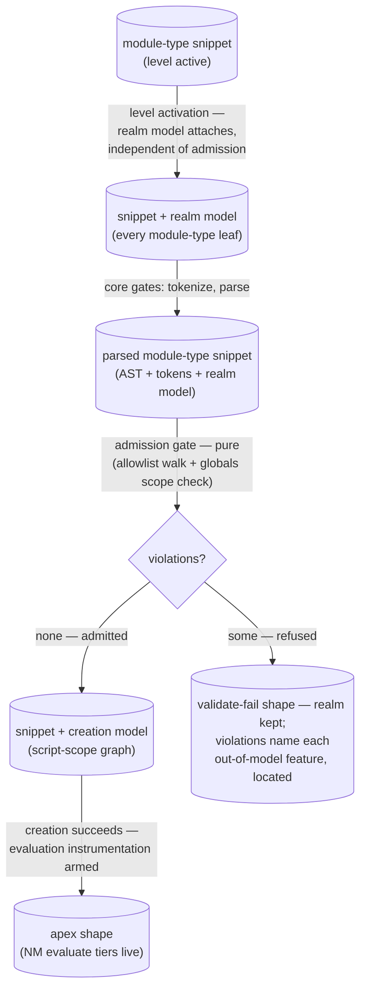

# just-enough-javascript (language level) — Architecture

> Architectural sketch — written Phase 0; the structural target the level's
> implementation is held against.

The why-a-plugin rationale and the plugin seam's rules live in
[`../../DOCS.md` § Language levels as plugins](../../DOCS.md); this sketch
covers the level's own structure.

## Execution phases

Three phases, cut by **gating condition** — each model attaches under a
different condition, so each gets its own seam:

- **Level activation** — condition: the level is active (`type === 'module'`),
  independent of admission. The **realm model** attaches — the curated
  just-enough world of intrinsics + host bindings, code-independent and honest
  by construction. Every module-type leaf carries it, including refused ones;
  realm precedes tokenize and never fails.
- **Admission** — condition: the snippet parsed. The validator walks the AST
  against the level's `SyntaxAllowlist` (each entry derived from a semantic
  model the level owns) plus the allowed-globals scope check; output: located
  `violations[]`, folding to the gate criterion `isJeJ`. Pure, deterministic,
  never throws — refusal is a shape, not an exception.
- **Admitted-model attachment** — condition: admitted. The **creation model**
  attaches (the script-scope graph: `let`/`const` bindings, the temporal dead
  zone, block scopes); once creation succeeds, the **evaluation
  instrumentation** is armed (the NM event tiers, plugged into the generic
  execution engine as instrumentation + event categories).

## Data flow

## Structural constraints

- **The never-lies invariant** (load-bearing): every admitted program is fully
  covered by the level's semantic models — the gate refuses exactly what the
  models cannot tell the truth about. Adding syntax to the allowlist REQUIRES
  extending a model first; the allowlist is derived, never edited free-standing.
- Violations are located and named (`nodeType`, `message`, `location`,
  `nodePath`) — they are the learner-facing explanation for the NM scaffolding's
  withdrawal in the editor gutter.
- The realm model attaches on level activation (module type), NOT on admission —
  refused snippets keep their realm phase. The gate runs iff `type === 'module'`
  and the snippet parsed; under script type the level is inactive and
  contributes nothing to the Snippet.
- Admission must stay cheap enough for the live-embodiment debounce cadence (it
  runs on every settle in module mode).

## Out of scope

- Other language levels — the plugin seam admits them; none exist, and no
  selection registry is built (activation is the source type itself until a
  second level appears).
- The generic execution engine (workers, sandboxes, run limits) — core
  infrastructure serving every source type.
- Lens availability, station availability, and panel rendering — orchestrator
  concerns consuming this level's outputs.
- The JS-generic core (tokenize, parse) — embody's, not the level's.

## Navigation

- [`./README.md`](./README.md) — what this level is.
- [`../../DOCS.md`](../../DOCS.md) — embody architecture (§ Language levels as
  plugins, § Data flow).
- [`../../lib/validating/`](../../lib/validating/) — the validator
  implementation (`SyntaxAllowlist`).
