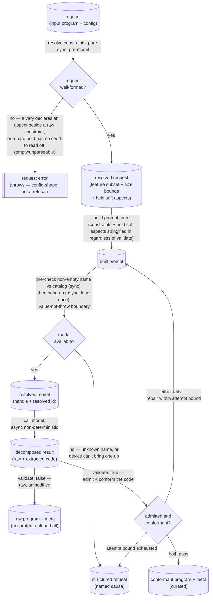

# aithor — Architecture & Decisions

> Architectural sketch — written Phase 0; the structural target the module's
> implementation is held against.

The pedagogy — the quad, the four config→quadrant mappings — lives in
[`./README.md`](./README.md); this sketch covers only the module's own
structure: a pure core and the two impure seams it isolates. One operation,
`aithor(program, config)`, shapes a program to a config seeded by an input
program — an empty input composes from scratch, a non-empty one varies. The
point of the sketch is to keep the model interaction — a non-deterministic call
and a stateful loader — on the far side of a seam, so prompt construction, the
conformance check, the validate-gated loop, and result-shaping stay pure.

## Execution phases

Five phases, cut by structural seam — the two impure points each get their own
boundary so the rest is data-in, data-out:

- **Request resolution** — input: a request (seed + config); output: the
  resolved constraints (a feature subset + size bounds) and the held soft
  aspects, or a thrown request error. **Pure, sync — and the only place aithor
  throws.** A `vary` declaring any aspect compiles down here: its hard holds
  (`languageLevel` / `size`) resolve against the seed — read once — into the
  same feature subset and size bounds a hand-set request carries, and its soft
  holds into a held-aspect list the next phase renders. Two config-shape
  mistakes throw before the model is reached, distinct from the value-not-throw
  outcome boundary: a `vary` declaring an aspect set beside a raw `include` /
  `exclude` / `lines` / `complexity`, and a hard hold with no seed to read off
  (an empty or unparseable seed). A request without `vary` passes through with
  its raw constraints unchanged — this phase is a no-op for it. It runs
  **once**, before bring-up (so a hard hold's throw precedes any model load);
  the repair loop re-enters downstream, at prompt construction, never here.
- **Prompt construction** — input: a request (input program + config); output: a
  built prompt. **Pure, sync.** Concatenates the ask, the input program, and the
  stringified constraints — composing from an empty input, varying a non-empty
  one — independent of `validate`. On a repair turn the same phase folds the
  located refusal reason into the next prompt.
- **Model bring-up** — input: a model name; output: the resolved model (a handle
  plus the resolved id), or a refusal (_no-model-available_ either way;
  _unknown-model_ only for a non-empty unknown name). **Async, stateful (seam 1
  — load-once).** The named local model is brought into memory on first need and
  reused thereafter; the runtime's one-time fetch and on-device cache sit below
  this seam, invisible. This seam is aithor's value-not-throw boundary: a
  catalog-membership pre-check turns a **non-empty** name absent from the
  injected catalog into _unknown-model_ before the runtime's `load` is called
  (an empty name is the "pick for me" request — it passes through to the
  runtime's cost-aware default, whose id comes back resolved), and the boundary
  absorbs the runtime's load failure, a propagated probe fault, and any other
  throw into _no-model-available_ — so a refusal is always a value, never a
  throw.
- **Candidate generation** — input: a built prompt + a model handle; output: a
  decomposed result (`raw` + extracted `code`). **Async, non-deterministic (seam
  2 — the model call).** The same request yields different results; the only
  non-reproducible point. The handle is the runtime's; this phase reads its
  result, never the model's fetch/cache.
- **Disposition** — input: a decomposed result (+ request); output: a conformant
  program + meta, the raw output (+ meta), or a structured refusal.
  **Validate-forked.** Under `validate: true` the result's extracted `code`
  faces admission (the level's gate, async) then conformance (the aithor's pure
  check, sync); on a pass it is shaped into a result with meta, on a fail it
  routes to a repair turn within an attempt bound, and the exhausted bound
  shapes a refusal. Under `validate: false` the result's byte-exact `raw` is
  returned unmodified, wrapped with meta naming which model ran (a single call)
  — no admission, no conformance, no repair. Meta rides every successful result;
  the `model` it names is shared across paths — only the result's program and
  meta's `attempts` differ.

## Data flow

The resolved model is named once at bring-up (handle **plus** resolved id) and
flows to BOTH success terminals — every result's `meta` names that id, curated
or raw, so provenance has a single shared source regardless of the validate
fork. The repair edge returns to prompt construction — the same pure phase, now
seeded with the specific out-of-subset construct or out-of-bounds metric. The
loop is bounded; the dotted edge is the join where the bound is spent. The three
refusal causes (_attempt-bound-exhausted_, _no-model-available_,
_unknown-model_) converge on one refusal state — to which a structured
_no-model-available_ additionally attaches the derived `nextStep` category (an
attribute of that refusal, computed as the value-not-throw boundary absorbs the
load failure, not a separate data state — so the graph stays one refusal node).

### Vary resolution (the request-shaping prelude)

The flow above **opens** with this pure, synchronous prelude (the
`request → request well-formed? → resolved request` head): it adds no seam and
no gate, and is the one place the module **throws** rather than refuses — the
`[[ … ]]` node is a config-shape exception, distinct from the value `refusal`
every runtime failure is. (`[[ … ]]` marks a thrown exit, not a data state.)

**The fork.** A request's feature subset and size bounds come from exactly
**one** source — the raw `include` / `exclude` / `lines` / `complexity` (no
`vary`, or `vary: {}`), or a `vary`'s resolved hard holds (read off the seed
once). The two are mutually exclusive by construction — declaring both is the
config-shape throw — so exactly one path supplies them; for a no-`vary` request
the prelude is a pass-through no-op. The hard holds become the very subset and
bounds a hand-set request carries, so they ride the **unchanged** prompt
construction and (under `validate: true`) the **unchanged** conformance gate;
the held soft aspects add **one instruction clause** to prompt construction (a
sibling of the existing feature clause), rendered against the seed —
prompt-only, never gated. (That clause is the soft tier's only footprint in
prompt construction; the hard tier touches nothing new there.)

**Resolved once, before bring-up.** The prelude — and its possible throw —
completes **before** model bring-up (a hard hold must reject an empty or
unparseable seed before any model is reached), so the constraint assembly that
today follows bring-up moves ahead of it. Resolution runs **once** per request;
the repair loop re-enters at prompt construction (downstream), never at
resolution, so the resolved subset / bounds / soft holds are fixed for the life
of the request.

**Measurement is shared; parse-failure policy is not.** The seed measurement the
hard holds need — the node→feature inventory and the line/depth metrics — is the
conformance gate's own, **extracted out of `conform` into a shared module both
import** (so the inventory is the gate's detector, never a parallel one; the new
module depends only on the parse primitive and the types, so there is no cycle,
and `conform`'s public surface stays a single default export). The **parse** is
_not_ shared: `conform` tolerates an unparseable candidate — it returns a
non-conformant verdict, never throws (the parse primitive itself never throws) —
whereas the vary resolver **parses the seed itself** and throws when a hard hold
faces an empty or unparseable seed, because there is no AST to inventory or
measure. The shared module owns the post-parse measurement; each caller owns its
own parse-failure policy. A held **empty** inventory resolves via the
exclude-all idiom (`include = exclude = ALL`), which the gate reads as
permit-none and prompt construction renders as "simple statements only" — never
the forbid-everything nonsense an empty `include` with a full `exclude` would
give.

## Structural constraints

- **The two seams are the only impure points** (load-bearing): the stateful
  loader (name → resolved model, load-once) and the non-deterministic model call
  (handle → decomposed result). Everything else — prompt construction,
  conformance, the validate fork, the attempt bound, result-shaping,
  refusal-cause selection — is pure given those two injected. Conformance never
  reaches the model. The loader seam is aithor's value-not-throw boundary:
  local-llm is not uniformly value-not-throw (it throws on an unknown name and
  propagates a probe fault), so the loader pre-checks catalog membership and
  wraps `load` in a catch-all, turning every non-success into a `Refusal` value.
- **The curated boundary holds, fail-loud.** Under `validate: true` a candidate
  becomes a result only when admission AND conformance both pass; one that fails
  either is repaired or refused, never returned. There is no degrade-to-
  non-conformant result.
- **The uncurated rawness is preserved, by design.** Under `validate: false` the
  candidate passes through unmodified — admission and conformance do not run,
  and any cleanup would be a defect. (Meta naming the resolved model rides
  beside it; the candidate itself is untouched.)
- **Refusal causes are validate-aware in one direction only.**
  _attempt-bound-exhausted_ is curated-only; _no-model-available_ and
  _unknown-model_ are bring-up-time and arise under either `validate` value.
  Curated: any of the three. Uncurated: _no-model-available_ or _unknown-model_
  — with no loop there is no attempt-bound refusal.
- **A device-limit refusal is actionable, and aithor names no product.** aithor
  and local-llm both emit only a delivery-agnostic category — never a product,
  vendor, or URL; the render surface (copy, links, naming a desktop app) is the
  consumer's (local-llm calls this the cause→guidance mapping, and it is the
  lens's, not this module's). So a _no-model-available_ refusal that arises from
  local-llm's structured `LoadFailure` carries an optional **`nextStep`** — a
  product-neutral category (_retry_, _free-space_, _reconnect_,
  _use-native-app_) derived by a TOTAL (many-to-one) map from the terminal
  `LoadFailureCause`, so the lens can offer a real next step rather than a dead
  end. The category carries no message and no URL — there is no slot a product
  name could occupy. The refusals with no structured cause carry none:
  _unknown-model_ (a catalog typo, not a device limit) and the
  _no-model-available_ folded from an infrastructure fault (a rejected probe or
  a throw — no honest terminal cause underlies it). The optional field is itself
  the signal: `nextStep` present means a structured device-limit with a named
  step; absent means no actionable category beyond the bare refusal.
- **The result follows the `BaseResult` `ok`-boolean convention** — consumers
  check `ok`, not a discriminated tag. The only failure surface is a structured
  refusal; conformance violations stay internal to the repair loop.
- **The feature subset resolves by contract:** an empty `include` permits all of
  JEJ minus `exclude`; a non-empty `include` permits only those, minus
  `exclude`; on overlap `exclude` wins.
- **Admission is reused unchanged.** The level's gate runs on the curated path
  only; the aithor never widens or re-derives it — conformance only ever narrows
  below admitted JEJ.
- **Vary compiles down — no new seam, no new gate.** A `vary` request resolves
  to the existing feature subset + size bounds (hard holds) and a
  held-soft-aspect list (soft holds) in a pure, synchronous prelude, resolved
  **once before bring-up**; the two seams, the loop, the conformance gate, and
  the result type are unchanged.
- **Measurement is shared; parse-failure policy is not.** The measurement the
  hard holds need — the node→feature inventory and the line/depth metrics — is
  the conformance gate's own, **extracted out of `conform` into a shared module
  both import** (no cycle — the module depends only on the parse primitive and
  the types; `conform`'s public surface stays one default export), so the
  inventory is never a parallel detector. The **parse** is not shared: `conform`
  tolerates an unparseable candidate (a non-conformant verdict, never a throw),
  while the vary resolver parses the seed itself and throws on a hard hold with
  an empty or unparseable seed. A held empty inventory resolves via the
  exclude-all idiom (permit-none plus the "simple statements" prompt), not an
  empty `include` (which permits all).
- **The config-shape throw is a distinct exit from the value-refusal.** aithor
  stays value-not-throw for _outcomes_ (a model or runtime failure is a
  `Refusal` value); a malformed _request_ — a `vary` declaring an aspect beside
  a raw constraint, or a hard hold with no seed to read off — throws
  synchronously at the request boundary, before bring-up, the layer a type error
  lives at. A soft hold is never a validated error and never throws; `vary: {}`
  is inert (the from-scratch base case).

## Out of scope

- **The language level's admission gate** — `isJej` and its allowlist live in
  [`../../../lib/validating/`](../../../lib/validating/), reused unchanged; this
  module never edits, extends, or re-implements it. Conformance is a separate,
  narrower, aithor-owned check.
- **The model runtime** — how a local model is fetched, cached on the device,
  and executed sits below the bring-up seam. This module names _which_ local
  model and drives _when_ its lifecycle runs, not _how_; the runtime is
  injected, and the on-device backend it runs is a host-supplied adapter map —
  aithor ships no backend of its own.
- **Embodiment, lenses, execution** — once a program exists it is an ordinary
  JEJ source string; embody / orchestrate / engine own it from there.
- **Authoring for its own sake** — this module produces programs _to study_, not
  finished programs to keep; a non-empty input is a seed it reads, not a
  document it maintains. (The uncurated path is squarely in scope — the Q1/Q2
  generative surface, not an excluded mode.)
- **Reproducibility and faithfulness** — generation is non-deterministic and a
  variation is related, not rule-bound; a caller needing a fixed program stores
  the program, and one needing an exact transform will not find it here.

## Related

- [`./README.md`](./README.md) — what this module is (the quad, config→quadrant,
  the ubiquitous language).
- [`./types.ts`](./types.ts) — the contract in TypeScript (config + `vary`,
  `validate`, the `complexity` metric, the result + refusal shapes).
- [`../DOCS.md`](../DOCS.md) — the language level's architecture (admission, the
  never-lies invariant).
- [`../../../lib/validating/`](../../../lib/validating/) — `isJej`, the
  admission gate reused unchanged.
- [`../../../types.ts`](../../../types.ts) — `Features` / `Metrics`, the level's
  measured analyses (`Metrics.maxNestingDepth` is the primary `complexity`
  ordinal).
- [`../../../../README.md`](../../../../README.md) — the package's Explorotron
  quad treatment; the aithor is its generative arm.
