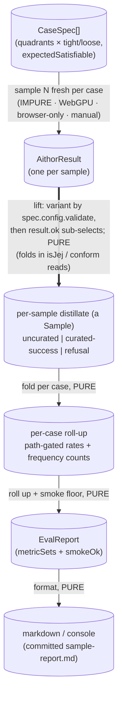

# aithor Eval Harness — Architecture & Decisions

> Architectural sketch — written Phase 0; the structural target the harness's
> implementation is held against. What it measures and why lives in
> [`./README.md`](./README.md); this sketch covers only structure: a pure core
> and the two impure points it isolates.

One operation set — the pure core (metric folding → run-level roll-up →
formatting) — held against two impure points the harness isolates behind a
single boundary, mirroring `aithor`'s own pure-core / two-seam shape
([`../DOCS.md`](../DOCS.md)). The impure points are the **real-model call**
(`aithor` against a WebGPU runtime, non-deterministic) and the **async admission
gate** (`isJej`, Prettier-backed). Everything downstream — rate computation,
histogram folding, the smoke floor, report formatting — is pure,
data-in/data-out, so it is exercised in Node with hand-authored `Outcome`s and
no GPU.

## Execution phases

Four phases, cut by the pure/impure seam — the impure points sit on the far side
of one boundary-lift so the rest is data-in, data-out:

- **Sample** — input: a `CaseSpec`; output: an `AithorResult` (one per draw).
  **Impure, async (WebGPU, browser-only).** The driver runs
  `aithor(spec.program, spec.config, realRuntime)` `SAMPLES_PER_CASE` times per
  case against a real local model brought up once. The only non-reproducible
  point.
- **Lift** — input: a `CaseSpec` + its `AithorResult` (+ the externally-computed
  `isJej` / `conform` reads); output: an `Outcome`. **The one boundary-lift,
  pure given its inputs.** The variant is selected by `spec.config.validate`
  (curated vs. uncurated) — `AithorResult` carries no path tag, so `result.ok`
  only sub-selects success vs. refusal _within_ that path, and a bring-up
  refusal's `path` is stamped from `validate` (the cause alone cannot tell —
  `no-model-available`/`unknown-model` arise on either path). The impurity is
  the driver's, in _producing_ the reads; the lift itself just maps, so it is
  Node-testable.
- **Fold** — input: the `Sample`s for one case; output: a `MetricSet`. **Pure,
  sync.** Path-gated rates (`Rate { numerator, denominator, proportion }`) and
  `Histogram`s — the uncurated drift gap, or the curated success/refusal/attempt
  load.
- **Report** — input: all `MetricSet`s; output: an `EvalReport`, then a string.
  **Pure.** The run-level roll-up plus the `smokeOk` floor, rendered to a
  markdown/console table.

## Data flow

Nodes are data states; edge labels are the transformations and their structural
constraint — the same axis as [`../DOCS.md`](../DOCS.md). The thick edge is the
pure-core boundary: everything below it is Node-fake-testable.

## Structural constraints

- **The pure core never touches a runtime.** The metric folder, the aggregator,
  and the formatter import no `aithor`, no `isJej`, no `conform`, no runtime —
  only the eval types and the parsed-data `Outcome`. A Node test hand-authors
  `Outcome[]` and asserts exact `Rate`s / `Histogram`s. This is the load-bearing
  cut: it is why the whole roll-up is fake-testable red-first, the same way
  `conform` is `aithor`'s richest no-model unit.
- **The Outcome is the only boundary value.** It carries the
  mechanically-readable distillate (admitted, conform verdict, attempts, model,
  cause) and nothing impure — no `AithorResult`, no handle, no AST. The driver
  lifts; the core folds.
- **No read aborts a run.** `conform` is value-not-throw (unparseable →
  `{ ok: false, violations: [] }`); only `isJej` (async Prettier) can reject, so
  it is the **sole** driver-wrapped read, a throw folding to `admitted: false`.
  A degenerate raw candidate is data, not a crash.
- **The by-construction omission is structural, not optional.** A curated
  success is admitted + conformant by construction, so `CuratedSuccessOutcome`
  carries neither — the `MetricSet` of a curated case has no `admissionRate` /
  `conformanceRate`. The shape encodes the charter's "asserted, not measured."
- **The driver reports; it does not gate.** Its sole assertion is the `smokeOk`
  floor (every case produced its full `samples` count of well-formed Outcomes);
  the rates are printed and committed, never turned into a pass/fail quality
  gate.
- **Curated attempt load is exhaustive over _non-bring-up_ curated samples
  only.** Each such sample is either a success (counted in `attemptDistribution`
  by its `Meta.attempts`) or an `attempt-bound-exhausted` refusal (which carries
  no `Meta`, so its attempt count is _inferred_ = `MAX_ATTEMPTS`, counted in
  `attemptBoundRefusalRate`) — no third bucket. A bring-up refusal on the
  curated path carries neither and is excluded from both denominators. The
  exhaustiveness rests on `Meta` being absent on a refusal; it would break if
  `attempts` were ever added to a refusal's meta.
- **`Histogram` is in-memory only.** It is a `ReadonlyMap`, reached **only** by
  the formatter (→ string); it never hits `JSON.stringify` (a `Map` serializes
  to `{}` — silent data loss). If a JSON report is ever wanted, the histogram is
  converted to entries at that boundary, not stored as a Map.
- **`quadrant` is a derived label, trusted not re-derived.** It is
  `config.validate` × empty-`program`; the fold reads it for grouping and does
  not recompute it, so a hand-authored fixture must keep `quadrant` consistent
  with its `config`/`program` — the eval owns no validator for this (a
  fixture-authoring invariant AR-4 can hold the fixtures to).

## Out of scope

- **Semantic measurement** — content, quality, and theme fidelity are
  deliberately not measured (see [`./README.md`](./README.md)); there is no
  judge, rating, or theme score in the architecture. A future eval may add a
  judge seam, but nothing here anticipates its shape.
- **The model runtime** — how a local model is fetched, cached, and executed
  sits below the `aithor` seam; the driver injects a real runtime and reads
  results, it does not own bring-up.
- **The settled `aithor` contract and Phase-1 units** — reused, never edited by
  the eval.

## Related

- [`./README.md`](./README.md) — what this harness measures and why (the
  constraint-fit scope, the deferred-semantics decision, the metric set).
- [`./types.ts`](./types.ts) — the eval contract in TypeScript.
- [`../DOCS.md`](../DOCS.md) — the module's architectural sketch (the pure-core
  / two-seam precedent this sketch mirrors).
- [`../conform.ts`](../conform.ts),
  [`../../../../lib/validating/is-jej.ts`](../../../../lib/validating/is-jej.ts)
  — the objective computers the driver lifts into each `Outcome`.
- [`../tests/aithor-webllm.browser.test.ts`](../tests/aithor-webllm.browser.test.ts)
  — the real-model GPU-lane precedent the driver reuses.
