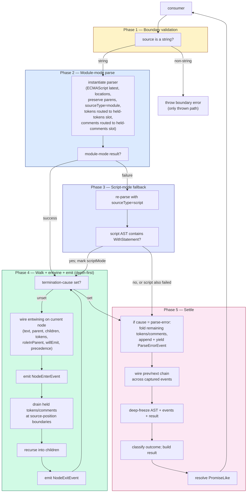

# parse — Architecture & Decisions

> Structural contract for the parse generator. The implementation in `parse.ts`
> (Phase 1) is held against this sketch — what shape a correct implementation
> must take, not what the code does today. Domain terms only; no function names,
> no variable names, no pseudocode. See [`glossary.md`](./glossary.md) for the
> load-bearing vocabulary.

## Architectural sketch

The parse engine has five execution phases. Phase 1 validates input, phases 2
and 3 build the AST (with optional script-mode fallback for the `with` easter
egg), phase 4 walks + entwines + emits, phase 5 settles. State slots thread
across phases, named explicitly below.

### Execution phases

1. **Boundary validation** (sync, may reject) — verify the source is a string.
   Reject non-string input with a thrown error at the entry point. Only thrown
   path; everything downstream is reified as data.

2. **Module-mode parse attempt** (sync, may fail) — instantiate a parser
   configured for ECMAScript latest, source-location tracking enabled,
   parenthesised-expression preservation enabled, with token- delivery callback
   wired to the held-tokens slot and comment- delivery callback wired to the
   held-comments slot. Source type: module.
   - On success: an AST rooted at the Program node is produced. Held-tokens and
     held-comments contain everything acorn emitted during the parse, in source
     order. Proceed to phase 4.
   - On failure: capture the error. Reset the held-tokens and held-comments
     slots (script-mode parse will refill them). Proceed to phase 3.

3. **Script-mode fallback** (sync, conditional) — re-parse with source type set
   to script. Performed ONLY when phase 2 failed.
   - On success AND the resulting AST contains a `WithStatement` anywhere in its
     tree: accept this AST; mark `scriptMode = true`; proceed to phase 4.
   - On success but no `WithStatement` present: discard the script- mode result;
     the module-mode error from phase 2 is the canonical failure. Proceed to
     phase 5 with termination cause `'parse-error'`.
   - On failure: discard the script-mode result; the module-mode error from
     phase 2 is the canonical failure (the script-mode error is never surfaced).
     Proceed to phase 5 with termination cause `'parse-error'`.

   Truth table (module-mode → script-mode):

   | Module-mode | Script-mode | With-statement present? | Result            |
   | ----------- | ----------- | ----------------------- | ----------------- |
   | success     | (skipped)   | (n/a)                   | module AST        |
   | failure     | success     | yes                     | script AST + flag |
   | failure     | success     | no                      | module error      |
   | failure     | failure     | (n/a)                   | module error      |

4. **Walk + entwine + emit** (sync, generator body — repeat per node visit) —
   depth-first traversal of the AST, emitting events as nodes are entered,
   exited, and as tokens/comments fall in source position. Concurrently wires
   entwining metadata onto each node. The interleaving rule is
   **source-position-ordered**: between a node-enter event and its first child's
   enter (or the node-exit if it's a leaf), drain held-tokens and held-comments
   whose source positions fall within that span; the same applies between
   sibling children, and between the last child's exit and the parent's exit.

   At each node visit (pre-order):
   - **Termination check** — if the termination-cause slot is set (consumer
     cancelled or failed), break the walk and proceed to phase 5. Captured
     events up to this point are preserved.
   - **Wire entwining metadata** for the current node:
     - `text` from the source slice for the node's range.
     - `parent` from the walk's current ancestor pointer.
     - `children` from the node's direct ESTree children, in source order.
     - `tokens` filtered from held-tokens by range overlap.
     - `roleInParent` derived from the node's slot in its parent's structure.
     - `willEmit` looked up from the static ESTree-type → step- categories
       table.
     - `precedence` and `associativity` looked up for binary / logical /
       assignment expressions; absent otherwise.
   - **Emit node-enter** — append a NodeEnterEvent referencing the wired node,
     yield it (gated by `options.nodeEnter`).
   - **Drain held tokens and comments** that fall before the first child (or
     before the node's end if leaf), in source order; append + yield each as a
     TokenEvent / CommentEvent (gated by `options.tokens` / `options.comments`).
   - **Recurse children** in source order. Between siblings, drain held
     tokens/comments at the boundary. Each child does its own pre-order visit.
   - **Drain remaining held tokens/comments** that fall before the node's end.
   - **Emit node-exit** — append a NodeExitEvent for this node, yield it (gated
     by `options.nodeExit`).

5. **Settle** (sync, post-walk) — when phase 4 ends (natural completion, cancel,
   fail, or after a parse error from phase 2/3):
   - **Build the parse-error event** if termination cause is `'parse-error'`:
     append a ParseErrorEvent to captured events, yield it (always; not
     gateable). The held-tokens and held- comments captured BEFORE the error are
     already in captured events from any prior emission, OR are folded into
     captured events here in source order if the error fired before phase 4.
   - **Wire the prev/next chain** across captured events (no-op if empty). Same
     protocol as tokenize.
   - **Freeze** — deep-freeze captured events, every node in the AST (cycles via
     `parent`/`children` allowed under freeze), and the result wrapper.
   - **Build the result** — classify `outcome` from the termination cause;
     populate `ast` (or `null` on failure); populate `error` if parse-error;
     populate `reason` if fail; set `scriptMode` iff phase 3 produced the AST;
     echo `code` and resolved options.
   - **Resolve** — settle the handle's PromiseLike contract.

### State slots

Five pieces of internal state thread across phases. Naming them explicitly is
part of the contract.

Read/write summary (W = writes the slot; R = reads it; M = mutates existing slot
contents):

| Slot              | Phase 2              | Phase 3                                   | Phase 4                                      | Phase 5                                       |
| ----------------- | -------------------- | ----------------------------------------- | -------------------------------------------- | --------------------------------------------- |
| Termination cause | W (on parse failure) | W (on parse failure)                      | W (on cancel/fail)                           | R (classify outcome)                          |
| Held-tokens       | W                    | W (after reset)                           | R + drains                                   | R (fold remnants on parse-error)              |
| Held-comments     | W                    | W (after reset)                           | R + drains                                   | R (fold remnants on parse-error)              |
| Captured events   | —                    | —                                         | W (append per yield)                         | M (wire chain) + W (append parse-error event) |
| AST root          | W                    | W (overrides on script-mode-with-success) | M (mutate each node with entwining metadata) | R (freeze, expose as result.ast)              |

- **Termination cause** — single-write slot. Set by exactly one of: natural
  completion (walk finished), consumer cancel, consumer fail, or parse error
  (after script-mode fallback resolved). First-write- wins. Read at settle to
  classify `outcome`. Never appears as an event.
- **Held-tokens** — ordered slot of tokens delivered by the parser's token
  callback during phases 2 and 3. Drained in source-position order during phase
  4's walk; tokens not yet drained when phase 4 ends are folded into captured
  events (in source order) before the phase-5 freeze. Empty at engine start.
- **Held-comments** — ordered slot of comments delivered by the parser's comment
  callback during phases 2 and 3. Drained alongside held-tokens.
- **Captured events** — ordered slot accumulating every event by reference as it
  is yielded (or as folded-in remnants are appended in phase 5). Becomes
  `result.events` after settle.
- **AST root** — the Program node produced by phase 2 or phase 3. Walked +
  mutated (entwining metadata wired in place) during phase 4; frozen in phase 5;
  exposed as `result.ast`. `null` on failure.

### Data flow

### Structural constraints

- **Mutation only in phase 4 and phase 5**. Phase 4 mutates each AST node to add
  entwining fields; phase 5 mutates captured events to wire the prev/next chain.
  Both happen BEFORE phase 5's freeze. No other phase mutates anything.
- **Events captured by reference, not by value**. Same protocol as tokenize.
  Replay over a settled handle yields the same event references in the same
  order.
- **AST node references are reference-stable**: the node referenced by a
  NodeEnterEvent IS the same object referenced by the matching NodeExitEvent and
  (for parents) by the next-deeper NodeEnterEvent's `parent`. After freeze,
  every consumer holding any handle to the AST sees the same identities.
- **Termination is NOT in the event stream** for cancel and fail; it lives on
  `result.outcome` (and `result.reason` for fail). Parse errors DO produce a
  ParseErrorEvent (the consumer needs to see where the error fired in the
  stream); the parse-error case is the one exception to the "no synthetic event
  for termination" rule.
- **First-write-wins on the cause**: same as tokenize.
- **Cycles are wired BEFORE freeze**, not after. JS allows freezing objects with
  circular references (parent ↔ children, prev ↔ next), but mutation of frozen
  objects is rejected.
- **Source-position ordering** is the interleaving discipline for
  tokens/comments vs node-enter/exit events in phase 4. The walk emits events
  such that, scanning `result.events` in order, each event's `loc.start` is
  monotonically non-decreasing within the scope of its enclosing nodes.
  (Strictly increasing across tokens; node-enter/exit pairs nest properly.)
- **No partial AST on failure**: `result.ast === null` on any outcome other than
  `'complete'`. Captured events still contain whatever was emitted before
  termination; consumers wanting "what did the parser see before giving up?"
  inspect events, not ast. This applies even when phase 4's walk was partially
  completed before cancel/fail: nodes visited before termination DO have
  entwining metadata wired on them in memory (this is mutation in place), but
  the engine does NOT expose them — `result.ast` is still `null`. The captured
  events from those visits ARE preserved in `result.events`, which is the
  consumer's view into partial progress.
- **Token-range overlap discipline** during phase 4's drain: a held-token is
  drained at a span boundary if its `start` position is at or before the
  boundary AND it has not yet been drained. Tokens whose ranges legitimately
  span multiple AST nodes (e.g. a single `template` token covering an entire
  template literal) are drained once, at the position of their `start`, even
  though their `end` may extend past subsequent boundaries. This matches the
  intuition "the token starts here, that's where the consumer sees it" rather
  than "the token straddles, drain at every boundary."

### Out of scope

- **Validating JeJ-allowed constructs**. `lib/validating/` does this.
- **Stamping `node.jejStatus`**. Deferred to v2 (see § Why no jejStatus below).
- **Format-checking**. `lib/formatting/` does this.
- **Building scope or binding metadata**. Scopes and bindings are RUNTIME
  concepts; live in `lib/evaluating/trace/semantics/`. We predict via `willEmit`
  but do not produce.
- **Source-map generation**. Out of bounds for the JeJ curriculum.
- **AST recovery / partial trees on failure**. Acorn doesn't recover; we don't
  expose a partial tree.
- **Caller responsibilities**: rendering events, formatting errors for display,
  deciding when to cancel, navigating the AST.

## Why a sync generator

The parser is synchronous — given an in-memory string, parsing is a sync,
CPU-bound operation. No I/O, no Worker, no SharedArrayBuffer. Wrapping it in an
async generator would add ceremony without benefit; consumers can still get a
`Promise<ParseResult>` via the handle's PromiseLike contract.

The sync generator gives us: tight-loop performance for batch consumption
(`await handle`), step-through semantics identical to async (`for ... of` pulls
one event at a time), and surface mirroring with intercept's async handle (sync
↔ async siblings via `SyncExecution`).

## Why both `node-enter` AND `node-exit` events

Pre-order alone (entering only) loses the post-order moment when a node's
subtree is fully constructed — useful for UI moments like "the call expression
is now complete; show its arguments." Post- order alone (exiting only) loses the
pre-order moment when a node is FIRST encountered — useful for "the parser is
now considering this expression's structure."

The pair lets a stepping UI pause "inside" a subtree, watching its children
being constructed. The cost is ~2× the events compared to a one-event-per-node
design, but `step` numbering still increments 1:1 with yields, and consumers can
filter to either category.

For consumers that don't want the full pair, `options.nodeEnter` /
`options.nodeExit` gate independently.

## Why parse depends on tokenize for types only (not invocation)

The locked decision per the design discussion: parse drives the parser directly
(with token-delivery and comment-delivery callbacks) to interleave AST events
with token/comment events in a single pass. Driving a separate
`createTokenizeGenerator(code)` instance from within parse would tokenize the
source twice — once by the tokenize generator, once by parse's parser invocation
— for no functional gain.

Sharing types (TokenEvent, CommentEvent) without sharing runtime is the right
level of coupling. The contract is: any token in a parse event stream has the
same shape as a token in a tokenize event stream. Consumers writing UI that
handles tokens see one shape across both modules.

## Why no partial AST on failure

Acorn does not recover from syntax errors — the first error throws and
tokenization stops. We could expose a "partial AST" containing whatever subtree
was completed before the failure, but acorn's internal state at the moment of
throw is not a well-formed AST (half-built nodes with missing children, dangling
parser state). Exposing it would require synthesising a valid-but-incomplete
tree, which adds complexity for marginal pedagogical gain.

The events stream IS the partial-progress story: consumers see the tokens
consumed before the failure point, and the ParseErrorEvent at the end identifies
where the parser gave up.

If a future consumer use case demands a partial tree (e.g. a "best- effort
autocomplete" UI), an additive field (`result.partialAst?`) could be added once
acorn's recovery semantics are clarified or a tolerant parser is integrated.

## Why no `jejStatus` slot

The pedagogical metadata round 1 (per the design discussion) locked in
`roleInParent`, `willEmit`, `precedence`, and `associativity`. The `jejStatus`
slot (`'allowed'` / `'forbidden'` / `'easter-egg'` / `'computational-only'`) was
deferred for a specific reason: it duplicates `lib/validating/`'s logic.

Today, `lib/validating/` consumes `lib/parse-old/`. Tomorrow, the follow-up PR
migrates `lib/validating/` to consume `lib/ast/parse/`. Once that migration
lands, validation can run AFTER parse and stamp the tag on each node, OR
`lib/ast/parse/` can import validation's allow-list table and stamp during
entwine. Either way, the dep direction matters and isn't yet settled. Shipping
`jejStatus` in v1 risks creating either a circular dep or a duplicated table
that drifts.

When the migration happens, `jejStatus` is an additive field — a non-breaking
extension to the AstNode shape.

## Why `roleInParent` is `string`, not a closed enum

The set of role labels is rules-derived from ESTree node structures. Adding a
new node type (or a new acorn extension supporting a node type) introduces new
role labels at the seams. A closed enum would either need to be exhaustive
across every ESTree v2026+ extension (brittle) or under-specified (defeating the
purpose).

Common values are documented in the glossary; the `string` type gives consumers
freedom to match on what they care about (`'condition'`, `'callee'`) without
forcing a switch on every possible role.

## Why `willEmit` is `StepCategory[]` (and not finer)

The `willEmit` array predicts which `trace/syntax` step categories will fire at
runtime for this node. We use the flat `StepCategory` strings (10 values) rather
than the finer two-level discriminant of `trace/semantics` (which has ~30
sub-kinds across categories) because the prediction's purpose is "give the
learner a sense of what runtime stepping will look like here," not "exactly
enumerate every event."

A `BinaryExpression` will fire `expression` and `resolve` events at runtime; the
consumer sees that prediction and connects parse-time structure to runtime
behavior. Finer prediction (e.g. `expression. operator.arithmetic`) is a future
refinement.

## Cancellation interaction (edge cases)

- **`.cancel()` between iterations** during phase 4: cause set to `'cancel'`;
  next loop iteration's termination check observes the cause and breaks.
  Captured events through that point are preserved.
- **`.cancel()` BEFORE the first iteration**: equivalent. The first termination
  check observes the cause and breaks before phase 2 even runs. Captured events
  empty; AST null.
- **`.cancel()` during phase 2/3** (parser invocation): the parser call is sync
  and uninterruptible; cancel is observed AFTER the parser returns or throws. If
  the parser threw, parse-error wins the cause race (first-write-wins). If the
  parser succeeded, cancel wins.
- **`.cancel()` during phase 5** (wire/freeze): cannot happen. Phase 5 is sync
  and uninterruptible.
- **`.cancel()` AFTER the run has settled**: no-op.
- **`break` from a live `for ... of`**: functionally equivalent to `.cancel()`.
- **Consumer awaits the handle without iterating** (batch mode): the PromiseLike
  contract drains the generator internally; phase 4 runs to natural completion
  or termination; the consumer receives only the settled result.
- **Empty captured events** (cancel-before-first or pre-parse failure): chain
  wiring no-op; freeze applied to empty array; result has `events: []`,
  `ast: null`.

## Replay / re-iteration

After settle, a second `for ... of` over the same handle yields the same event
references in the same order. No re-parsing. Same protocol as tokenize:

- Phase 4 (and the parse-error fold in phase 5) appends each event to captured
  events BY REFERENCE before yielding.
- Phase 5 freezes in place; captured events ARE the result's events.
- The handle's `Symbol.iterator` returns a fresh iterator each call; all
  iterators read from the same backing array.

Two concurrent consumers iterating in parallel will silently split events as
iterator `next()` calls serialise — documented as unsupported (matching
intercept and tokenize).

## Replay after termination

A run that ended via cancel, fail, or parse-error has a settled result with
`outcome` set accordingly and the captured events through the termination point.
Re-iterating the handle yields those captured events in order. Termination
metadata for cancel/fail does NOT appear as a synthetic event; parse-error DOES
(because the consumer needs to see where in the stream the failure fired).

## Parser binding

The engine wraps acorn specifically. The `kind` field on TokenEvent maps to
acorn's `TokenType.label`; the `kind` field on NodeEnterEvent / NodeExitEvent
maps to acorn's ESTree `type` property. Switching to a different parser (a
different ESTree producer, or a swap to swc/oxc) would require updating
consumers' `kind` discrimination and any code that reads ESTree-specific fields.
This lock-in is acceptable given acorn is the curriculum standard, recorded here
for future maintainers.

The engine does NOT override the parser's lexer or grammar, does not transform
the AST shape (besides adding entwining fields), and does not synthesise nodes.
The engine DOES wire entwining metadata in place on each node and emit synthetic
events around acorn's output (NodeEnterEvent, NodeExitEvent, ParseErrorEvent).

## What this module deliberately does NOT do

- **Run the parser inside a Worker.** Parsing is sync, CPU-bound, and bounded by
  source length; no need for isolation.
- **Impose iteration / time limits.** Parsing is O(n) in source length; no
  recursive grammar that can run away. A consumer wanting a wall-clock cap calls
  `.cancel()` themselves.
- **Emit scope, binding, hoisting, or TDZ events.** Those are runtime concepts
  (`lib/evaluating/trace/semantics/`).
- **Validate JeJ subset compliance.** `lib/validating/` does this. The deferred
  `jejStatus` field is the planned bridge.
- **Generate source maps.** Out of bounds for the JeJ curriculum.
