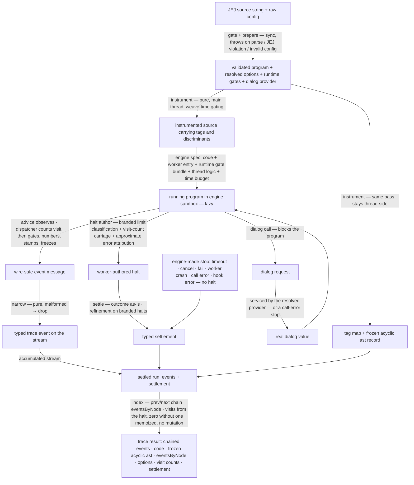

# evaluating/trace/semantics — Architecture & Decisions

Vocabulary and the event-category table: [README.md](./README.md). The public
contract: [types.ts](./types.ts). The engine this tracer consumes:
[`../../../../../lib/engine/DOCS.md`](../../../../../lib/engine/DOCS.md). The
instrumentation pipeline's own architecture:
[`tracing/DOCS.md`](./tracing/DOCS.md).

## Architectural Sketch

> Written Phase 0, before implementation. The Refactor step is held against this
> document — not what the code does, but what shape it takes.

### Execution phases

1. **Gate** (sync, throws) — the admission boundary. Input: a raw source string.
   Output: a validated program, or a typed boundary throw naming its reason
   (parse failure or JEJ violation — `with` included). The gate rejects only
   language-level violations, NEVER a program that would merely throw at runtime
   — runtime errors belong in the trace, at their ECMA-faithful evaluation
   moments. A gated program never reaches instrumentation. This is the only
   phase that throws; everything downstream degrades into a settlement.

2. **Prepare** (sync, throws — part of the gate boundary) — config resolution.
   Input: the raw user config. Output: fully resolved options (no optional layer
   left unexpanded), the source range, the iteration cap, the time budget, and
   the dialog provider — via shorthand expansion, default filling, schema
   validation, and cross-field checks.

3. **Instrument** (sync, pure) — the Aran weave, on the main thread. Input: the
   validated program + resolved options. Output: the instrumented source string
   (carrying the weave-time decisions: which advice calls exist at all, each
   with its tag and discriminants), the tag map, and the ast record — built and
   FROZEN here (it is a pure function of the source and never changes during or
   after the run; it is ACYCLIC — nodes carry `parentPath`, not a `parent`
   back-ref — so which events fired on a node, and its visit count, live on the
   RESULT, not the node). Layer gating is decided here — a disabled gate means
   no advice call is woven, so disabled layers cost nothing at runtime.

4. **Run and emit** (factory call sync and lazy; emission async) — assemble the
   engine spec (instrumented source + thin worker entry + the runtime gate
   bundle as worker config + worker/thread logic + time budget) and hand it to
   the engine factory, returning a lazy handle; nothing runs until the first
   pull. (The entry also forwards the engine's test-only transport seam,
   sibling-style — invisible to the public signature; the Node suites run on the
   engine's fake transport through it.) Worker-side, the advice observes each
   moment, builds the event, and hands it to the dispatcher, which — for a
   resolve event — bumps the node's visit count FIRST (before any gate, so
   counts are range- and filter-independent), then applies the runtime gates
   (range window, name filters); an event that survives the gates consumes the
   next step number (numbering lives at the emission layer, after the gates —
   only emitted events are numbered), is stamped with its wire-safe base fields,
   frozen, and emitted. Dialog calls block the worker on the engine's call
   channel until the thread's provider answers with the real value. The loop cap
   throws the branded limit error; the halt author classifies it structurally
   and carries the visit counts on every worker-side stop, natural end included.

5. **Narrow + chain** (per message) — the thread maps one opaque worker message
   to one typed trace event (or drops a malformed one), and wraps it INTO the
   `prev`/`next` chain AS IT ARRIVES: `prev` is the event just before it, `next`
   is an accessor that reads `null` until the SUCCESSOR is wrapped (so a
   streamed item held during `for await` is already chained, and re-reading its
   `next` later finds the successor). Both fields are non-enumerable; the event
   is never mutated. The mapping itself is pure (the worker authored the
   complete event); the only state the thread holds is the one chain-tail
   pointer the accessors close over — a named exception to the
   no-mutable-closure rule (DEV.md), scoped to this phase.

6. **Settle** (sync) — surface the run's end: the engine's outcome as-is, the
   typed halt when the worker stopped on its own, the iteration-limit refinement
   when the halt carries the brand, the engine error or fail reason when the
   engine or consumer ended the run, and the consumed duration.

7. **Index + assemble** (sync, after any settlement) — no mutation of any frozen
   thing. The `prev`/`next` chain already exists (built incrementally in phase
   5), so all this phase adds is the `eventsByNode` index (nodePath → the
   `step`s that fired there — it needs the whole run, hence post-settlement) and
   the final result object. The ast record was already frozen at Instrument;
   visit counts ride the halt (empty when no halt). Output: the trace result —
   the (already chained) events, source echo, frozen acyclic ast,
   `eventsByNode`, options snapshot, visit counts, settlement. This assembly is
   one-shot; the facade memoizes it so repeated `result` access returns the same
   object.

### Data flow

### Structural constraints

- **The gate is the only throwing boundary — and it never pre-empts runtime
  errors.** Parse failure, JEJ violation, and invalid config throw
  synchronously, typed, before any engine work; a program that would merely
  throw at runtime is admitted and its error occurs inside the trace, at its
  ECMA-faithful evaluation moment. Everything after a successful gate degrades
  into a settlement — never an exception.
- **Instrument is pure and range-independent.** Same program + same options →
  same instrumented source. The runtime-checked gates (range window, name
  filters, iteration cap) ride the worker config, never the woven code — so the
  woven output is range-independent (cache-friendly for a FUTURE caching seam).
  Today there is no instrument-once/run-many API, so each `traceSemantics` call
  re-instruments; the range property is what a cache would exploit, not a
  promise the current surface keeps.
- **Weave-time gating is total for layer gates.** A disabled gate produces no
  advice call at all (no runtime check, no invocation). The runtime gate bundle
  carries exactly three things: the range window and the name filters (checked
  by the dispatcher — names and positions may be runtime-known) and the
  iteration cap (checked by the loop-guard advice). TDZ tracking is run STATE
  shaping event construction (declare / initialize / available), not a gate.
- **Gating is worker-side, always.** Every emission costs a full engine pause
  round-trip even when dropped; nothing may be gated in the thread's narrow
  phase. The narrow phase drops only malformed messages.
- **Events are wire-safe, always.** No event field ever references the ast —
  attribute via `nodePath` into the frozen record. The delivered events add only
  the `prev`/`next` chain (non-enumerable, wrapped thread-side as each event is
  narrowed); each event is frozen once at yield and never mutated. The
  dispatcher stamps every base field so the worker-side emit is self-contained.
- **The worker holds the only mutable RUN state; the thread mutates nothing
  frozen.** Scope stack, counters, provenance ids, visit counts live
  worker-side. Thread-side, event mapping is pure; the only mutable state is the
  one chain-tail pointer the `prev`/`next` accessors close over (the narrow
  phase's named exception to the no-mutable-closure rule — DEV.md). Both the
  narrow phase (chain wrappers) and the index phase (the `eventsByNode` map)
  build only NEW structures — neither writes into the already-frozen ast record
  or a frozen event.
- **Limit classification is structural.** The loop cap throws a branded error;
  the halt author recognizes the brand; the refinement types it. Message text is
  never matched, so a learner-thrown error can never be misclassified as an
  instrumentation limit.
- **Dialog values are real or the run fails.** The provider answers with the
  real value; with no provider in reach, the run settles as a call error. A
  fabricated dialog value never enters the data layer.
- **Indexing runs exactly once, after any settlement.** The single call site is
  the entry's result assembly; the facade memoizes the result so repeated
  `result` access does not rebuild the chain or index. Visit counts default to
  zero when the run ended without a halt.
- **The error channel never replaces the halt.** The error event is emitted
  (config-gated) and the error re-thrown, so the settlement still carries the
  halt with the same approximate attribution. Disabling the channel suppresses
  the event, never the halt.

### Out of scope

- The sandbox: worker lifecycle, transport, pause protocol, time budget,
  cancellation, settlement classification — all engine-owned.
- The embody adapter mapping, the not-runnable short-circuit, and all lens /
  rendering concerns.
- Console interception (native pass-through; intercept/embody territory).
- Caching of instrumented output or results (caller's concern).
- Precise error attribution (the error location is approximate — a named
  deferred concern).
- Async dialog providers (custom modal UIs). The engine's call hook supports
  promises, but the fake transport every Node suite runs on is sync-only —
  widened signatures arrive when a consumer needs them, with real-transport
  tests.
- `with`, labels-as-gate-concern, user-defined functions: `with` and non-JEJ
  constructs die at the gate; labeled break/continue is traced (the jump event
  carries the label) since the weave handles it faithfully.

## Why this design

### An engine consumer, not a sandbox owner

The former architecture owned its transport: a hand-rolled worker, a
shared-memory pause protocol borrowed from a sibling, a bespoke message pump,
timeout heuristics, and string-matched limit classification. All of that is the
engine's job, done once and conformance-tested. What remains here is exactly the
domain: instrumentation, gating, event vocabulary, non-time limits, dialog
semantics, indexing. The worker logic registers the advice on the worker's
global scope (the engine's documented channel for lookup-resolved
instrumentation), wires the dispatcher's emission to the engine's emit, and
authors the halt; the thread logic narrows, services dialogs, and refines.

### Runtime errors are ECMA-faithful — the gate never pre-empts them

Learners must see the error appear in the event stream where a raw JS run would
produce it. So the gate admits any program that would merely throw at runtime,
and the run reproduces the throw exactly: an undeclared identifier read throws
`ReferenceError` at its evaluation moment (an undeclared read in a never-taken
branch never throws), TDZ accesses and const reassignments throw at theirs. The
instrumentation bears the cost of this fidelity: the legacy weave resolved an
undeclared read through the instrumentation and coerced it into a fabricated
value (observed: `"5() => boom"`, a run that "completed") — a mistrace this
design forbids outright. Making the woven runtime throw the faithful
`ReferenceError`, with the error event and halt attribution, is a named
implementation obligation with its own tests — worth the cost, because a data
tracer that substitutes values where the language throws is teaching a false
machine.

### `with` is gone

Supporting `with` forked the instrumentation into a second sloppy-mode
configuration, selected by a fragile source regex, and required the engine's
strict prefix to be disabled. The sibling variables tracer never forked; two
siblings with opposite `with` policies is exactly the inconsistency reviews
exist to catch. The gate now rejects `with` with everything else non-JEJ, and
the program always runs strict.

### Runtime gates ride the worker config

The weave must code-generate what advice receives (tags, discriminants, initial
state — an Aran constraint). Nothing forces the runtime-checked gates into the
code, and baking them in would couple the instrumented output to the range
window — making the primary range use case (trace a highlight) a full
re-instrument per highlight change. The sibling delivers its static table
through the worker config; this tracer delivers its runtime gates the same way.

### The settlement mirrors the engine; the iteration limit is a refinement

The engine's five outcomes surface as-is — the sibling set this convention, and
the old four-value remap lost `cancelled` and `failed` while promoting one
instrumentation concern (the iteration limit) into an outcome. The limit is not
how the run ended (the run errored); it is what the error was — a refinement on
the errored settlement, classified from the brand the halt author preserved.

### Dual-perspective emission and the resolve baseline

One assignment fires the operator view, the variable-lifecycle view, and the
data view, sharing one node path — a consumer focused on operators gets the full
picture, one focused on variables gets theirs, and the value itself lives in
exactly one place: the resolve event. Provenance ids live only on resolve
events; the data-flow graph is reconstructable from the resolve stream alone.
Visit counts increment once per logical evaluation (an increment expression is
one visit, not its three desugared sub-events), so they mean what a learner sees
on the page.

### Always indexed, never mutated

The ast record and every streamed event live thread-side by the time any
settlement arrives, so indexing is unconditional — a cancelled or timed-out run
still returns a fully chained, navigable stream. And it is pure construction,
not linking-by-mutation: the old design tried to attach a `.node` ref onto each
event and back-fill `node.events[]`, but the engine freezes every event at yield
(a strict-mode write would throw) and a `parent` back-ref made the ast cyclic.
The human's chain design dissolves both: events are immutable and navigate by
`nodePath` + `prev`/`next`; the ast is acyclic and frozen at instrument time;
back-refs are a fresh `eventsByNode` index. No cycle, no mutation, no
serialization replacer. What an engine-made stop cannot deliver is the worker's
metrics (visit counts ride the halt), so those default to zero — absence of
evidence, stated as such.

### The budget already measures runtime; the yield charge is the one gap (D4)

A learner tracing a loop must not hit a surprise timeout on a program that
finishes instantly. The engine's budget ALREADY does most of what that needs
(verified in `lib/engine/evaluate.ts` `createBudget`): it counts only elapsed
worker RUNTIME (`performance.now()` deltas while the worker is unblocked), and
it PAUSES for both I/O — `pauseForCall` disarms the timer with no charge — and
consumer think-time — a yielded event awaiting its pull does not accrue time. So
the "measure runtime, exclude I/O" requirement is met.

The ONE gap is a deliberate synthetic penalty layered ON TOP: `pauseForYield`
also deducts a flat `YIELD_CHARGE_MS = 5` per YIELDED event (not per drop, not
per call). Its purpose is to keep render-bound loops finite in wall-clock terms
— but at this tracer's expression granularity it becomes the BINDING limit:
~1000 emitted events exhaust the default 5 s budget with zero real runtime, so a
fast program that emits densely can time out mid-trace. This is the only thing
that makes `seconds` not a learner-honest limit for dense traces.

The tracer cannot change the charge (it lives in the engine's pause path). So
the D4 ask is NARROW: a **yield-charge opt-out** on the engine spec (a consumer
that owns its own iteration cap does not need the synthetic wall-clock valve).
Meanwhile loop safety rests on the `iterations` cap, not the clock, and a higher
`seconds` buys headroom against the charge.

## Test taxonomy

Seven tiers; each catches what no other tier catches. Locations and the file
inventory: [`tests/README.md`](./tests/README.md) and
[`tracing/tests/README.md`](./tracing/tests/README.md).

| Tier | Scope                                                                                   | Catches                                            |
| ---- | --------------------------------------------------------------------------------------- | -------------------------------------------------- |
| T1   | one unit (advice, generator, pointcut, prepare stage), co-located                       | internal logic bugs in one layer                   |
| T2   | consumer conformance: worker/thread logic against the engine's fake AND real transports | seam drift between this tracer and the engine      |
| T3   | two adjacent layers, others mocked                                                      | seam bugs (advice → dispatcher, pointcut → advice) |
| T4   | one named config profile, full pipeline, fake transport                                 | config-gate regressions                            |
| T5   | every emitted event validates against its variant contract                              | event-shape drift (incl. per-variant `semantics`)  |
| T6   | equivalent configs (shorthand vs explicit) produce identical streams                    | subtle gating drift                                |
| T7   | end-to-end through `traceSemantics` + real worker, per-settlement                       | transport-fidelity bugs no fake catches            |

A green fake-transport run proves logic, never transport fidelity — T7's
real-worker matrix (one case per transport-distinct settlement: completed,
errored with attribution, cancelled mid-stream, timed-out, iteration-limit
refinement, dialog round-trip) is the fidelity evidence, per the engine's own
conformance doctrine.
