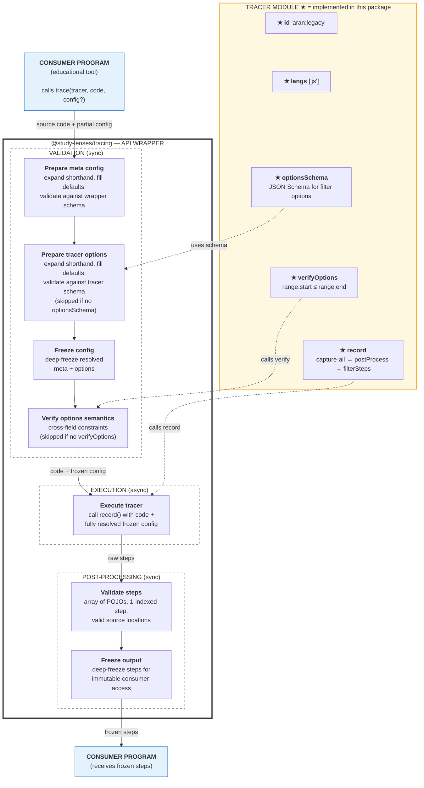

# @study-lenses/trace-js-aran-legacy — Architecture & Decisions

## Why this tracer exists

Wraps the legacy Aran instrumentation engine — originally built for the
HackYourFuture Study Lenses project — in the standard `TracerModule` contract
from `@study-lenses/tracing`.

Instruments JavaScript source code via eval-in-iframe, capturing every
expression evaluation, variable access, function call, and control-flow step.
Returns structured, frozen `AranStep[]` conforming to `StepCore`.

Exists as a separate package so the legacy Aran engine can be used alongside
other `@study-lenses` tracers (e.g. the KLVE tracer) through the same API.

## Architecture

```text
code (string)
  → record/record.ts    ← capture-all override + pipeline orchestration
  → legacy-aran-trace/  ← eval-in-iframe instrumentation (vendored)
  → post-process.ts     ← raw entries → structured AranStep[]
  → filter-steps.ts     ← post-trace filtering → frozen AranStep[]
```

`src/index.ts` is wire-up only — no logic. All tracer logic lives in `record/`.

### Pipeline



## Key decisions

### Engine choice

The legacy Aran tracer — an eval-based instrumentation engine that runs code in
an iframe. Chosen for backward compatibility with the existing HackYourFuture
Study Lenses tooling. The engine is vendored in `record/legacy-aran-trace/` and
treated as a black box; this package does not modify its internals.

Alternatives considered: Babel-based AST instrumentation (more control but
higher maintenance), native debugger protocol (not browser-portable).

### Error mapping

The legacy tracer catches eval errors internally during iframe execution.
`record.ts` currently propagates unhandled exceptions as-is — there is no formal
mapping to `ParseError`, `RuntimeError`, or `LimitExceededError` yet. Formal
error mapping is future work that requires understanding which legacy tracer
failure modes correspond to each standard error type.

### Step format

The legacy tracer emits `RawEntry` objects with string-encoded operation info in
the `prefix` field (e.g. `"declare (const): x"`, `"binary: +"`), plus
`>>>`/`<<<` string markers for scope boundaries.

`postProcess` regex-parses these into structured `AranStep` objects with typed
fields: `operation`, `name`, `operator`, `modifier`, `values`, `depth`,
`scopeType`, `nodeType`, `loc`. Source locations are shallow-copied to plain
POJOs (Aran AST nodes may carry prototype chains). Steps are unnumbered at this
stage.

`filterSteps` applies user options, then assigns 1-indexed `step` numbers to
survivors.

### Options design

Uses **JSON Schema + `verifyOptions`**:

- `options.schema.json` — defines structure, types, and defaults for all filter
  options
- `verifyOptions` — enforces the cross-field constraint
  `range.start <= range.end`

Both are needed because JSON Schema handles structural validation and
default-filling well, but cannot express cross-field constraints.

Filtering is **post-trace** (not pre-trace) because the legacy tracer uses a
mutable singleton `config.js` to control instrumentation. Rather than threading
filter options through legacy code, `record.ts` temporarily overrides all config
flags to "capture everything", then filters structured output post-hoc.

## What this package deliberately does NOT do

- **Execute in Node.js** — the legacy Aran tracer requires browser DOM (iframe +
  eval)
- **Make pedagogical decisions** — returns raw trace data; presentation is the
  consumer's job
- **Persist or accumulate traces** — each call is stateless
- **Handle step/time limits** — no `LimitExceededError` support yet
- **Manage browser DOM** — iframe lifecycle is internal to the legacy tracer

## trace-action wrapper

`trace-action.ts` wraps the existing tracer with language-level validation and
`allow`/`block` feature configuration. It:

1. Resolves the `allow`/`block` config to a narrowed `LanguageLevel`
2. Validates source code against that level (throws if invalid)
3. Delegates to the existing `record()` function
4. Returns frozen `AranStep[]`

Enforcement is not applied because the legacy tracer runs in its own sandboxed
iframe. Validation is the gate.

### Potential worker migration

The legacy tracer currently runs in an iframe. Migrating to a Web Worker would
enable `maxTime` via `worker.terminate()`. A feasibility spike (Sprint 2 in the
implementation plan) will test whether the legacy vendor code can be
concatenated into a worker blob without breaking its global references. See the
plan file for the full feasibility analysis.
