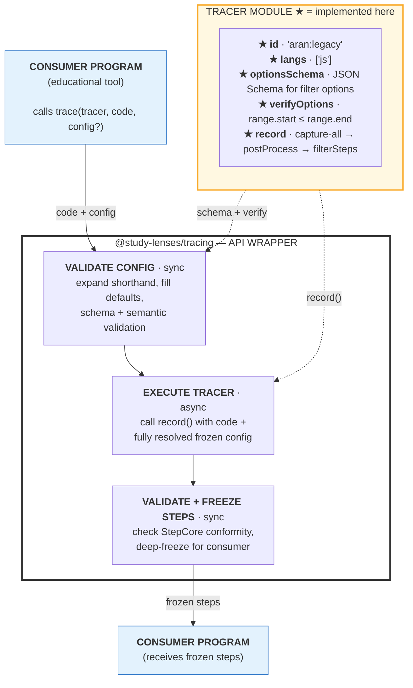

# @study-lenses/trace-js-aran-legacy

[](./LICENSE)

> JavaScript tracer using the legacy Aran instrumentation engine for
> `@study-lenses/tracing`.

## Pedagogical Purpose

**Neutral infrastructure:** This package provides raw execution traces for
educational tool developers. It makes no pedagogical decisions — those belong in
the tools that consume it.

The trace data is deliberately granular: every expression evaluation, variable
read, function call, and control-flow step is captured. Educational tools decide
which subset to show and how to present it.

## Who Is This For

**Primary — Educational tool developers:** Building Study Lenses, custom
analysis tools, or other learning environments that need JavaScript execution
traces.

**Secondary — CS instructors:** Using this package directly to build
course-specific debugging aids or step-through visualizations.

## Install

```bash
npm install @study-lenses/trace-js-aran-legacy
```

## Quick Start

```typescript
import trace from '@study-lenses/trace-js-aran-legacy';

const steps = await trace('let x = 1;\nlet y = x + 2;');
console.log(steps);
// → AranStep[] with declare, read, binary, assign operations
```

## API Summary

`@study-lenses/trace-js-aran-legacy` pre-configures all four
`@study-lenses/tracing` wrappers with this tracer:

| Export                         | Description                                             |
| ------------------------------ | ------------------------------------------------------- |
| `trace(code, config?)`         | Positional args, throws on error. Default export.       |
| `tracify({ code, config? })`   | Keyed args, returns Result (no throw).                  |
| `embody`                       | Chainable builder with tracer pre-set, throws on error. |
| `embodify({ code?, config? })` | Immutable chainable builder, returns Result.            |

See [DOCS.md](./DOCS.md) for the full API reference and options.

## Design Principles

### What this package provides

- JavaScript execution tracing via the legacy Aran instrumentation engine
  (eval-in-iframe)
- Post-trace filtering: category toggles, list filters, name whitelist, line
  range, data stripping
- Structured `AranStep[]` output with operation, name, operator, modifier,
  values, depth, scopeType, nodeType, loc
- The four standard `@study-lenses/tracing` wrappers, pre-bound to this tracer

### What this package does NOT do

- Make pedagogical decisions (what to show, how to explain)
- Persist or accumulate traces across calls
- Execute in Node.js (requires browser DOM for iframe + eval)
- Enforce step or time limits

## Architecture

```text
code → legacy Aran (iframe+eval) → raw entries → postProcess → filterSteps → frozen AranStep[]
```

### Where This Tracer Plugs In

The ★ items are what this package implements. Everything else is handled by the
`@study-lenses/tracing` wrapper — config validation, freezing, steps conformity
checks, and error handling.



See [DEV.md](./DEV.md) for full conventions and TDD workflow.

## Contributing

See [CONTRIBUTING.md](./CONTRIBUTING.md) and [DEV.md](./DEV.md).

## License

MIT © 2025 Evan Cole
