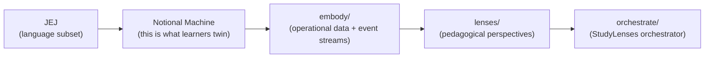
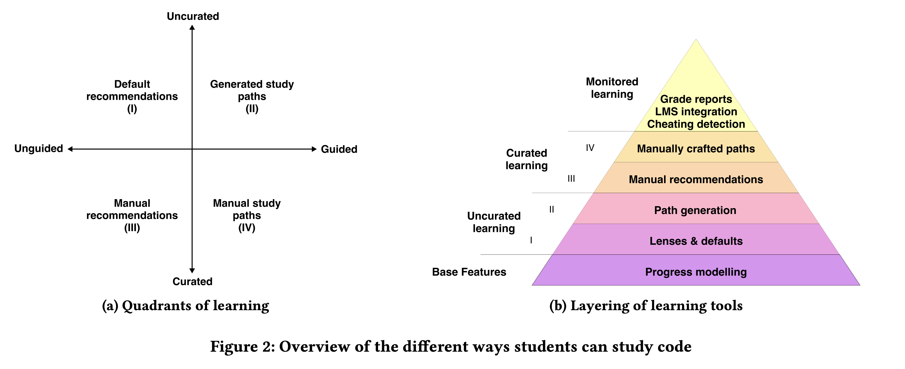

# just-enough-javascript

A curated JavaScript language level + static and dynamic tooling for
introductory programming education. JEJ programs are the learning vehicle for
the Welcome to Frogramming curriculum.

## The story (the conceptual chain)

Welcome to Frogramming teaches **JEJ** (just-enough JavaScript) — a curated
subset of the language. Every JEJ program runs on a precise, bounded **notional
machine** (NM): the conceptual model of how JEJ evaluates. Twinning the NM in
your own mind is the **learning objective** of the course. The NM is the
[mechanical instrument][metaphor] of the syllabus's metaphor — what the 🔬
Frogrammer grounds their predictions in.

**Code is the UI.** The JS source text is the _control panel_ through which a
programmer operates the NM. Authoring code is one way to operate that panel;
describing intent to an LLM is another (Chapter 4). Either way, the NM is the
thing the panel controls — and you can also observe it directly through visual
debuggers / embody / lenses, bypassing the panel entirely.

The NM doesn't only live in prose. It is **embodied** by the
[`embody/`](./embody/) factory — every JEJ snippet becomes a frozen-data +
event-stream object whose every field corresponds to a concept in the NM.
**Study lenses** then offer different perspectives on the embodied NM — think of
them as the kit of magnifying glasses 🔬 the Frogrammer carries: each lens
highlights a different aspect of the same machine.



| Layer            | What it is                                                                                                                         | File / dir                                     |
| ---------------- | ---------------------------------------------------------------------------------------------------------------------------------- | ---------------------------------------------- |
| **JEJ**          | The language subset (what learners write)                                                                                          | [`reference.md`](./reference.md)               |
| **NM**           | The conceptual evaluation model (the learning objective)                                                                           | [`notional-machine.md`](./notional-machine.md) |
| **embody**       | The operational embodiment of the NM (frozen data + event streams)                                                                 | [`embody/`](./embody/)                         |
| **study lenses** | Pedagogical perspectives on the embodied NM                                                                                        | [`lenses/`](./lenses/)                         |
| **orchestrate**  | `<StudyLenses>` orchestrator + recommender + analysis helpers — the single-writer editor and snippet-scope Explorotron realization | [`orchestrate/`](./orchestrate/)               |

Get the NM right and embody / lenses / orchestrate / curriculum follow. This
package's internal directory structure mirrors the chain.

[metaphor]: ../../../spiralearn/welcome-to-frogramming/README.md

## Four audiences of code

A JEJ program addresses four audiences simultaneously:

1. 🧑‍💻 **Other developers** read your code through comments, names, and
   structure. `console.*` is your tool for talking to them.
2. 💻 **The computer** parses and evaluates your code — but for our purposes,
   "understanding the computer" means **twinning the notional machine**. The NM
   _is_ the computer at our level of abstraction. The Frogrammer hat is about
   twinning this audience.
3. 👤 **Users** never see the code; they experience the program's effects via
   `prompt`, `confirm`, `alert`. Their correctness is behavioral.
4. 🤖 **Agents** (LLMs) collaborate with you on code as authoring partners.

The Notional Machine is the lens through which we address audience #2. The
course's [syllabus][metaphor] casts the NM as the _mechanical instrument_ of the
metaphor — composer / virtuoso / instrument / score / audience.

## Two hats: 🔬 Frogrammer & 🎨 Vibetoader

The two hats correspond to which audience you twin:

- 🔬 **The Frogrammer** twins **the NM**. They predict what the machine will do,
  evaluate output against that prediction, apply craft practices intentionally.
  Frogramming = twinning the NM.
- 🎨 **The Vibetoader** twins **the User**. They iterate on user-visible
  behavior: does the button work? does the test pass? does the page render?
  Vibetoading = twinning the User audience.

Neither hat is better; they're a spectrum. This package centers the Frogrammer
skill (NM-grounded prediction). Study lenses are the Frogrammer's **kit of
magnifying glasses** for examining the embodied NM from different angles — each
lens reveals one aspect of the same machine.

See the [syllabus][metaphor] for the full hats / metaphor / audiences framing.

## Pedagogical first principles

> **This package implements the middle layers.** Progress modelling (system-wide
> learner state) and monitored learning (grade reports, LMS integration,
> cheating detection) belong to the embedding LMS. `<StudyLenses>` renders one
> stepping stone in a learning path; the embedding LMS chooses which stones, in
> what order, with what configs.

The architecture implements the framework described in:

> Yoshi Malaise and Beat Signer (2023). _Explorotron: An IDE Extension for
> Guided and Independent Code Exploration and Learning._ Proc. of Koli Calling
> '23.
> [PDF](https://wise.vub.ac.be/sites/default/files/publications/Malaise_KoliCalling2023.pdf)

### The two-axis grid + the layered pyramid



_Figure 2 from Malaise & Signer (2023): **(a)** Quadrants of learning along
curated/uncurated × guided/unguided axes; **(b)** Layered pyramid of learning
tools, from progress modelling at the base to monitored learning at the top._

### How `<StudyLenses>` realizes the framework

The framework's quadrants apply at **two scopes** — snippet scope (one
`<StudyLenses>` instance) and curricular scope (the embedding LMS arranging
instances). We own the snippet scope; the LMS owns the curricular scope.

| Pyramid layer                      | Snippet scope (us)                                                                                                                                                                                                           | Curricular scope (LMS)                                   |
| ---------------------------------- | ---------------------------------------------------------------------------------------------------------------------------------------------------------------------------------------------------------------------------- | -------------------------------------------------------- |
| Base — Progress modelling          | _(n/a)_                                                                                                                                                                                                                      | Learner state / knowledge graph / ZPD positioning        |
| Layer I — Lenses & defaults        | Recommender ranks lenses by snippet-fit                                                                                                                                                                                      | _(subsumed)_                                             |
| Layer II — Path generation         | Auto-generated lens path on one snippet (open spec — Block-model × NM in draft)                                                                                                                                              | Sequence of `<StudyLenses>` instances across snippets    |
| Layer III — Manual recommendations | `lens` prop: "open in this lens first" (per-fence `js:trace?…` or directory `lenses.json` cascade)                                                                                                                           | LMS picks the curated snippet to render                  |
| Layer IV — Manually crafted paths  | **Deferred** — Q-IV at snippet scope is owned by the LMS; auto-recommended Q-II tours suffice for in-snippet guidance. Future shape (5th prop / meta-key in `configs` / directory-level setting) is intentionally undecided. | Full curriculum (sequence of curated snippets + configs) |
| Top — Monitored learning           | _(n/a)_                                                                                                                                                                                                                      | Grade reports, LMS integration, cheating detection       |

A free-form lens dropdown is **always** available within `<StudyLenses>` — the
learner can override any recommendation or config at any time. This is Quadrant
I at the snippet scope and underwrites the lifelong-learning autonomy framing
below.

### Concrete examples (snippet-scope quadrants)

The locked public API is four props:

```tsx
<StudyLenses snippet={…} lens={…}? config={…}? configs={…}? />
```

`lens` is the optional default-mount; `config` is the override for that default;
`configs` is the cascade bundle (keyed by lens name) the picker uses when the
learner opens a non-default lens. See
[`DOCS.md` § Four-prop public API](./DOCS.md#four-prop-public-api) for the full
spec + resolution chain.

- **Q1 — uncurated/unguided.** A learner pastes random JS into the editor, opens
  `<StudyLenses>`, sees default lens recommendations ranked by snippet-fit,
  picks one. Works on any code, not just curriculum content.
- **Q2 — uncurated/guided.** Same starting point; the learner asks for an
  auto-generated path through the recommended lenses. Strategy is an open spec
  (a 3D framework based on the Block model × the NM is in draft).
- **Q3 — curated/unguided.** Curriculum author renders
  `<StudyLenses snippet={X} lens="trace" />`. The trace lens opens by default;
  the learner can switch via the dropdown. With per-fence override:
  `<StudyLenses snippet={X} lens="trace" config={{ stepDelay: 500 }} />`.
- **Q4 — curated/guided.** Deferred at snippet scope. The LMS arranges curated
  sequences across multiple `<StudyLenses>` instances at the curricular scope;
  auto-recommended Q-II tours cover the in-snippet case.

### Why this architecture

Three load-bearing principles from the paper:

- **Skill transfer** (Chiaburu & Marinova, 2005) — learn skills in environments
  close to where they'll be used. Lenses live in the same editor learners use
  for real work, not a separate "school" tool.
- **Expertise reversal** (Sweller et al., 2003) — scaffolding helps beginners
  but hurts experts. Lenses are designed to peel away support based on context.
- **Lifelong-learning autonomy** — Quadrant I (uncurated/unguided) isn't a
  fallback; it's the central pedagogical bet. Students take their learning
  skills with them, applied to any code they encounter long after graduation.
  The 🔬 Frogrammer's magnifying-glass kit is the embodied form: the learner
  carries the lens kit and uses it on code from anywhere.

The Begel & Ko (2019) question — should technology "structure learning for
learners" or should learners "be taught how to structure their own independent
learning" — gets a **both-yes** answer:

- Quadrants I + II support learners structuring their own.
- Quadrants III + IV support educators structuring it for them.

Both reach the same `<StudyLenses>` component; the difference is which configs
the embedding system passes (and which the learner overrides).

## Directory structure

The folder layout mirrors the conceptual chain:

| Path                                           | Purpose                                           |
| ---------------------------------------------- | ------------------------------------------------- |
| `README.md` (this)                             | Orientation — front door                          |
| [`reference.md`](./reference.md)               | Allowed language features (syntax / controls)     |
| [`notional-machine.md`](./notional-machine.md) | How the NM controlled by our language level works |
| [`embody/`](./embody/)                         | Programmatic embodiment of the NM                 |
| [`lenses/`](./lenses/)                         | Pedagogical views on the embodied NM              |
| [`orchestrate/`](./orchestrate/)               | `<StudyLenses>` orchestrator + analysis helpers   |
| [`lib/`](./lib/)                               | JeJ-aware shared adapters (peer-independent)      |
| `sandbox-programs/`                            | Test fixtures (may be moved later)                |

(`.planning-handoff/` is a temporary dev artifact — intentionally not documented
in README.)

## Why a language level?

JEJ is _just enough_ JavaScript to write imperative programs that interact with
users through text and numbers. Every program fits on a single printed page —
the entire program is visible on screen at once, traceable step-by-step.

The language level is designed around a specific balance: **meaningful
computational exploration** within a **manageable notional machine** — which is
why we've defined the NM explicitly in
[notional-machine.md](./notional-machine.md). The NM is the learning objective.

### Few options, many possibilities

JEJ programs have a consistent shape: read input → perform computations →
produce output. Within this shape:

**The structural tools** for writing programs are: variables (`let`, `const`),
conditionals, loops (while, do-while, for, for-of), break, continue, and block
scope.

**The computational toolkits** that widen what learners can explore are: all
String methods, all Math methods and constants, regular expressions, number
helpers, type conversion (`Number()`, `String()`, `Boolean()`), character
encoding (`String.fromCharCode`, `String.fromCodePoint`), timestamps
(`Date.now()`), and date objects (`new Date()` — the sole `new` exception in
JEJ, whose methods all return primitives).

More operators and methods expand what learners can compute — string
manipulation, math, pattern matching, bitwise logic, comparison — without
complicating the notional machine. They're all expressions that resolve to
values through the same mechanisms.

### What learners can do with JEJ

- Read code as communication between four audiences
- Trace exactly how the NM interprets each line (Frogrammer hat)
- Explore creativity within the shape of imperative programs
- Explore style and readability tradeoffs to find your own voice
- Discuss a program's _behavior_, _strategy_, and _implementation_
- Explore different approaches to problem solving
- Explore concepts through code — text processing, geometry, pattern matching,
  randomness, number crunching — within interactive I/O programs
- Prepare for functions, data structures, and algorithms
- Build the foundations you need for whatever comes next

### What's excluded and why

Each excluded feature would add a new notional machine component that isn't
needed for introductory programming:

| Excluded feature               | NM component it would add                                                  |
| ------------------------------ | -------------------------------------------------------------------------- |
| User-defined functions         | Call stack depth, closures, hoisting of function declarations              |
| Arrays and objects as literals | Heap allocation, reference vs value identity, mutation through references  |
| Classes                        | Prototype chains on user objects, constructor semantics, `this` binding    |
| `try`/`catch`                  | Exception propagation model, control flow branching at error sites         |
| `async`/`await`                | Event loop, microtask queue, Promise state machine                         |
| `var`                          | Function-scoped hoisting (confusing alongside `let`/`const` block scoping) |
| Destructuring, spread/rest     | Pattern matching on data structures (needs arrays/objects)                 |

The result: the notional machine has a fixed set of components that learners can
master, while the computational toolkits provide enough depth for genuine
exploration and creativity.

## Language level documentation

| Document                                                                           | Purpose                                                         |
| ---------------------------------------------------------------------------------- | --------------------------------------------------------------- |
| [reference.md](./reference.md)                                                     | Learner-facing cheat sheet — every allowed syntax with examples |
| [notional-machine.md](./notional-machine.md)                                       | The conceptual evaluation model JEJ programs run on             |
| [embody/](./embody/)                                                               | Operational embodiment of the NM (data + event streams)         |
| [embody/types.ts](./embody/types.ts)                                               | Canonical TypeScript contract                                   |
| [embody/DOCS.md](./embody/DOCS.md)                                                 | embody architecture + data flow                                 |
| [embody/lib/evaluating/trace/syntax/](./embody/lib/evaluating/trace/syntax/)       | Syntax tracer — NM-step-category implementation (README + DOCS) |
| [embody/lib/evaluating/trace/semantics/](./embody/lib/evaluating/trace/semantics/) | Semantic tracer — finer-grained instrumentation (README + DOCS) |

## Tooling

Validates learner JavaScript against the language level and evaluates it in
sandboxed environments. Provides validation, formatting, parsing, and evaluation
modes — all through a unified API with a code object factory as the default
export.

## Study lenses: research translation platform

The study-lenses system is a research translation platform (TCER Phase 4) built
on top of JEJ's tooling. **embody** captures the notional machine as data; the
**study-lenses** system turns that data — and any JEJ snippet — into interactive
learning exercises. Each lens embodies a computing education research-backed
pedagogical intervention: blanks (fill-in-the-blank), parsons (line ordering),
trace tables (predict-then-compare), and more.

The architecture provides lenses (code-to-component, e.g., editor, parsons,
blanks) that consume frozen embodiments built by the embody factory. A
recommender analyzes each snippet against the JEJ notional machine and suggests
relevant exercises organized in a 3D Block Model grid (comprehension level ×
scope × NM components). This enables rapid iteration on exercise design —
researchers prototype new interventions by composing existing lenses, curriculum
authors embed them in code fences, and learners choose their own path through
the recommendations.

See [`lenses/README.md`](./lenses/README.md) for the full architecture, module
contracts, and directory layout.

## Public API: `<StudyLenses>`

The package's primary public interface is the **`<StudyLenses>`** React
component, exported by `index.ts`. The locked four-prop surface:

```ts
import { StudyLenses } from './index.js';

// Minimal:
<StudyLenses snippet={`let x = 5; console.log(x + 1);`} />

// Curated default-mount lens (Q-III):
<StudyLenses snippet={`let x = 5;`} lens="trace" />

// With per-fence override for the default-mount lens:
<StudyLenses snippet={`let x = 5;`} lens="trace" config={{ stepDelay: 500 }} />

// With cascade bundle for picker-opened lenses:
<StudyLenses
  snippet={`let x = 5;`}
  lens="trace"
  configs={{ trace: { stepDelay: 500 }, blanks: { difficulty: 2 } }}
/>
```

- **`snippet`** — code string. Orchestrator builds the embodiment internally.
- **`lens`** — optional default-mount lens name (Q-III seam).
- **`config`** — optional override for the resolved-default lens.
- **`configs`** — optional cascade bundle keyed by lens name; the picker reads
  `configs[lensName]` when opening any lens.

The Docusaurus plugin parses URL-style fence info-strings
(`js:trace?stepDelay=500`) and emits `lens` + `config` props; the directory-wide
`lenses.json` cascade emits `configs`. See
[`DOCS.md` § Four-prop public API](./DOCS.md#four-prop-public-api) for the full
resolution chain.

`<StudyLenses>` is the orchestrator: it ingests the snippet, builds the
embodiment via `embody()` (which checks the snippet against JEJ language
constraints and surfaces violations and format-compliance via
`Snippet.validation.*` — JEJ-subset violations as a list, format compliance as a
boolean), selects which lenses to surface (via the recommender), mounts them,
and manages all state. Formatting is the learner's responsibility — the
orchestrator does not pre-format snippets. Consumers get one component to mount;
everything else is internal.

`embody`, lens plugins, and `orchestrate/lib/*` analysis helpers are **not**
part of the public API. They are internal building blocks that `<StudyLenses>`
orchestrates. Lens authors ship plugins that the orchestrator mounts; lens
plugins receive `embodiment` as a prop. Curriculum authors embed `<StudyLenses>`
in code fences.

### Legacy named exports

`index.ts` also re-exports the legacy tooling and evaluation functions (`run`,
`trace`, `validate`, `parse`, `format`, `checkFormat`) for existing callers.

```ts
import {
	run,
	trace,
	debug,
	validate,
	parse,
	isJej,
	format,
	checkFormat,
} from './index.js';
```

> The package has no default export. The previous `createJejProgram` code-object
> factory was removed as YAGNI bloat — superseded by `<StudyLenses>`.

### Tooling functions

| Function            | Returns         | What it does                                                 |
| ------------------- | --------------- | ------------------------------------------------------------ |
| `format(code)`      | `string`        | Formats source code to JEJ conventions                       |
| `checkFormat(code)` | `{ formatted }` | Check if code matches JEJ conventions                        |
| `validate(code)`    | `BaseResult`    | Returns an array with any JEJ language constraint violations |
| `isJej(code)`       | `boolean`       | Convenience: is this valid JeJ?                              |

### Evaluation functions

| Function              | Returns                                      | Engine                             |
| --------------------- | -------------------------------------------- | ---------------------------------- |
| `run(code, config)`   | `Execution<InterceptEvent, InterceptResult>` | Web Worker                         |
| `trace(code, config)` | `Execution<AranStep, TraceResult>`           | Web Worker w/ Aran instrumentation |
| `debug(code, config)` | `Execution<DebugEvent, DebugResult>`         | iframe                             |

## Internal lib structure

| Path                      | Purpose                                                                                                                                          |
| ------------------------- | ------------------------------------------------------------------------------------------------------------------------------------------------ |
| `lib/parse-old/`          | `parse(code)` public entry + parse primitives (acorn wrapper, AST walker)                                                                        |
| `lib/validating/`         | `validate(code)` public entry + AST-based validation pipeline                                                                                    |
| `lib/formatting/`         | `format(code)` and `checkFormat(code)` — recast-based                                                                                            |
| `lib/evaluating/`         | Evaluation engines — trace (Aran), run (Worker), intercept (Worker)                                                                              |
| `lib/editing/`            | Editor integration (completions, hints)                                                                                                          |
| `lib/completing/`         | Code completion                                                                                                                                  |
| `lib/error-interpreting/` | Learner-friendly error message translation                                                                                                       |
| `lib/socratizing/`        | Socratic code analysis (micro-decisions)                                                                                                         |
| `lib/scope/`              | Scope analysis utilities                                                                                                                         |
| `lib/jej-documentation/`  | JEJ documentation generation for editor support                                                                                                  |
| `components/`             | UI components (V2 lens components, migration source)                                                                                             |
| `index.ts`                | Package entry — exports the `<StudyLenses>` orchestrator component (primary surface) + legacy named functions                                    |
| `api/`                    | Legacy directory; trace/run/debug-related types remain here pending parallel migration. The validate/parse/format/default migration is complete. |

## Result shape

All evaluation results share a common base:

```ts
type Result<TEvent> = {
	readonly ok: boolean;
	readonly error?: ResultError;
	readonly rejections?: readonly Violation[];
	readonly logs?: readonly TEvent[];
};
```

## Navigation

- [reference.md](./reference.md) — learner-facing language reference
- [notional-machine.md](./notional-machine.md) — the NM (conceptual evaluation
  model)
- [embody/README.md](./embody/README.md) — embody factory
- [embody/DOCS.md](./embody/DOCS.md) — embody architecture + data flow
- [embody/types.ts](./embody/types.ts) — canonical types
- [lenses/README.md](./lenses/README.md) — lens system
- [embody/lib/parse-old/README.md](./embody/lib/parse-old/README.md) —
  `parse(code)` + parse primitives
- [embody/lib/validating/README.md](./embody/lib/validating/README.md) —
  `validate(code)` + validation pipeline
- [embody/lib/formatting/README.md](./embody/lib/formatting/README.md) —
  `format(code)` / `checkFormat(code)`
- [embody/lib/evaluating/README.md](./embody/lib/evaluating/README.md) —
  evaluation engines
- [DOCS.md](./DOCS.md) — architecture decisions and design rationale
