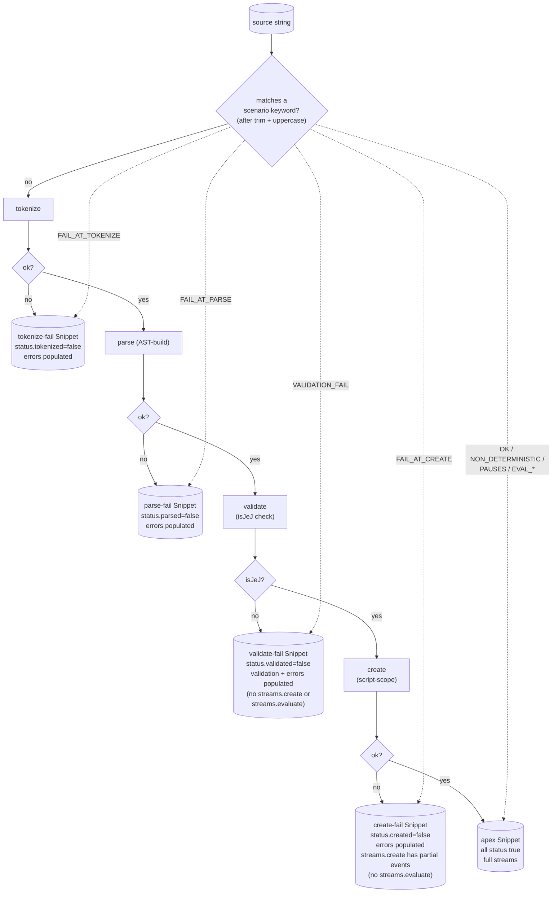

# embody — Architecture & Decisions

This module operationalizes the [JEJ Notional Machine](../notional-machine.md)
as a frozen-data + event-stream contract. The conceptual model is upstream
of the data; this document captures **why the data is shaped the way it
is** and the tradeoffs we considered before locking the contract in
[`types.ts`](./types.ts).

## Data flow

A JEJ source string flows through embody as a hard-gated pipeline. The
input is first normalized (`trim().toUpperCase()`) and matched against
the named scenario keyword set; matches jump directly to the matching
shape leaf. Non-matches descend through four gates — **tokenize → parse
→ validate → create** — each with a pass/fail fork. Each fork produces
a structurally distinct embodiment shape; downstream surfaces (event
streams) are absent on leaves where the chain didn't complete (programs
that won't run don't get evaluate streams).



The diagram has two paths converging on the same five-leaf shape catalog:
the **pipeline** (solid arrows) traverses each gate sequentially with
pass/fail forks; **scenario shortcuts** (dotted arrows) **construct the
matching leaf shape directly** without running the upstream stages.
Scenario dispatch is shape-construction, not pipeline-traversal — the
canned Snippet is materialized from the scenario keyword, then frozen.
Tests, sandbox harnesses, and the live editor consume these canned
shapes.

**Order of operations inside the pipeline.** Static analyses
(`Snippet.static`) are a parse-time-derived **data field** computed
between the AST-build and validate stages — not a separate gate, not
shown in the diagram. The validate stage reads from `static.nonDeterminism`
and `static.hasIo` to derive its informational metadata flags
(`isDeterministic`, `doesPause`), and reads from the AST to populate
its gate criterion (`isJeJ`, derived from `violations.length === 0`).
Both happen during validate: violations check is the gate, metadata
derivation runs unconditionally alongside.

**Validation is a hard gate.** Failure (i.e., `violations.length > 0`)
means no `streams.create` and no `streams.evaluate` — programs that
aren't valid JEJ don't run. On validate-fail, `Snippet.errors` carries
`phase='validate'` (per the first-fail-wins convention).

**Create-fail keeps partial create events.** `streams.create` is
*present* on the create-fail leaf with the events emitted before the
failure, mirroring the pattern where `parse-fail` keeps the tokens that
were tokenized before the failure. Only `streams.evaluate` is absent
(no evaluable script-scope means nothing to evaluate). Validate-fail
lacks both `streams.create` and `streams.evaluate`.

**Runtime errors are NOT embodied.** Outcomes from `streams.evaluate.*`
(timeout, cancellation, evaluation error) live on `RunInstance.endReport`
per-call, not on the static Snippet. The apex leaf is shape-identical
across `OK` and `EVAL_*` scenarios; the `EVAL_*` overlay is interpreted
by the evaluate streams at call time.

Status booleans (`tokenized`, `parsed`, `validated`, `created`) gate
which streams / fields are exposed; lenses guard by checking the
relevant boolean before reaching for optional fields. See
[`types.ts`](./types.ts) for the full contract.

## Why this design

### Pure data, no methods

Every embody surface is data: frozen objects, primitives, arrays.
Generators are the only callable surface (event streams are inherently
iterated). No `query()`, `dispose()`, `clone*()`, no accessor methods,
no derived getters. Anything a lens "needs to do" is spelled out as
iteration + filter over the data.

Why: pedagogy depends on observability. If a lens has to call methods to
reach state, lenses fork into "API users" instead of "data readers." Pure
data means lenses are diff-able, predictable, and trivial to mock for
tests.

### Strict immutability via single deep-freeze

Built mutably during construction (so cross-references can be wired up),
deep-frozen once at the end. No clone-on-access. No closure-backed getters
that hide computation. Frozen objects are safely shareable.

LLM agents (and human collaborators) cannot trust each other not to mutate
returned data. The freeze is a hard guarantee, not a politeness.

### No Maps or Sets at the public surface

`Object.freeze` doesn't freeze Maps or Sets — `frozenObj.someMap.clear()`
silently succeeds. Pedagogy also prefers ground-truth shapes: indexes are
plain `Record<K, V>`, sequences are arrays. Lenses build their own Maps
internally if they want O(1) lookup.

### Per-instance, no shared state

No module-level cache, no cross-instance communication. One `embody(code)`
knows nothing of others. Multiple lenses on the same snippet hold their
own embody instance. (We considered caching deterministic runs; declined
as not worth the complexity for small JEJ programs — see "No evaluate
caching" below.)

### Status booleans, not a discriminated union

Field availability follows a four-gate hard-gated staircase: tokenize
success unlocks parse, parse success unlocks validate, validate success
unlocks create, create success unlocks evaluate. Each gate's failure
produces a structurally distinct leaf with downstream surfaces absent.
The four status booleans (`tokenized`, `parsed`, `validated`, `created`)
encode the staircase position. We considered modeling this as a
TypeScript discriminated union (`status: 'tokenize-failed' | 'parse-
failed' | 'validate-failed' | 'create-failed' | 'apex'`) but independent
boolean gates were preferred — each is data, no ceremony to narrow.
Lenses guard by `if (snippet.status.parsed) …`.

### Snowball event tiers as filter whitelists

Evaluate-side tiers (`run`, `intercept`, `trace.syntax`, `trace.semantics`)
are not type-narrowed subsets — they are **filter predicates** over a
single flat `Event` discriminated union. Higher tiers strictly include
more event categories. `run` is special: returns a RunInstance with
`events: []` (no event tier).

This avoids the modeling smell of "run ⊂ intercept" being false (run
emits no events at all). The flat union with filter whitelists is honest:
one universe, several views.

### Single static AST shared across runs

Each `evaluate.*` call produces a frozen `RunInstance` whose events
reference the **same single static AST** (snippet.parse.ast) by identity
(`event.node === astNode`). No per-run AST clone. RunInstance carries
run-specific state (events, endReport, finalEnvironment, runMetrics),
plus a back-reference to the snippet for static data.

We considered cloning the AST per run with events attached (matching
intercept's existing pattern). Declined: the clone cost is real, and a
simple `events.filter(e => e.node === node)` covers the lookup ergonomics
without the clone.

### Environment is derivable, not an event

There is no `category: 'environment'` event type. The environment at any
step is derivable by folding `category: 'scope'` (push/pop) and
`category: 'binding'` (declare/initialize/access/update) events from
`static.initialScope` forward. The environment is the substrate other
events happen *in*, not a thing that happens.

Lenses building "memory diagram at step N" fold the deltas; they don't
need a snapshot event. This is more parsimonious and avoids
double-counting state.

### No evaluate-call caching

Each `evaluate.*` call re-runs the worker. JEJ programs are small, runs
are cheap, and cache machinery (mock identity tracking, WeakMap edge
cases, stale-cache confusion) costs more than it saves. Lenses that want
a stable replay hold onto a RunInstance themselves.

### Doubly-linked event refs (data, not OOP)

Events form a doubly-linked list of plain frozen objects with `prev` /
`next` references — same pattern as
`lib/evaluating/intercept`'s `LinkedInterceptEvent`. Lenses can walk by
index (array) or by sequence (linked refs) without arithmetic. Not OOP
nodes — just data with object cross-references.

## Validation gate vs. validation metadata

The validate gate criterion is `isJeJ` (i.e., `violations.length === 0`).
A program either is a valid JEJ subset or it isn't; the gate flips
`status.validated` accordingly. Failure means no `streams.create` and no
`streams.evaluate` — programs that aren't valid JEJ don't run.

Two `Snippet.validation` fields are **metadata for consumers, NOT gate
criteria**:

```text
isDeterministic = !any(nonDeterminism)
doesPause       = hasIo.user.total > 0
```

These are **derived** from raw static analyses (`nonDeterminism`,
`hasIo`) on construction, not raw fields a producer writes. A
non-deterministic or user-pausing program is still a valid JEJ subset
and passes the gate; the booleans are informational so lens authors and
recommender authors don't have to recompute. Pinned in
[`./types.ts`](./types.ts) JSDoc.

Implications:

- A consumer who needs richer detail (e.g. *which* I/O method pauses)
  reads `hasIo`, not `validation.doesPause`.
- A consumer that wants to gate evaluation on determinism or no-pausing
  reads `validation.isDeterministic` / `validation.doesPause` AFTER
  checking `status.validated === true`. The gate itself does not refuse
  to run non-deterministic or pausing programs.
- The real-composition branch in `embody/lib/*` MUST keep these
  derivation rules honest. The scenario-dispatch branch in
  [`./index.ts`](./index.ts) sets the raw fields and lets the
  derivation produce the booleans (it never writes the booleans
  directly).

## Scenario dispatch

`embody/index.ts` recognizes a small fixed set of **scenario keywords**
(`EMBODY_SCENARIOS`) and dispatches a deterministic canned `Snippet`
shape per named scenario. Input is normalized via `trim().toUpperCase()`
before the match. Scenarios are a **permanent integration-testing
fixture set** kept inside `embody()` because the orchestrator, lenses,
and recommender all need a way to drive every reachable Snippet shape
without crafting real JS that happens to produce that shape. Tests and
sandbox harnesses are the primary consumers; the live editor passes
scenario keywords through transparently. See
[`./README.md` § Named scenarios](./README.md) for the consumer-facing
description and [`./index.ts`](./index.ts) JSDoc for the dispatch
mechanism.

Why scenario dispatch is kept inside `embody()` rather than split into
a sibling fixture module: keeping the surface single-import for
consumers, avoiding the dual-import burden across the orchestrator,
lenses, and tests. The trade-off is bounded-context impurity (embody
also serves as the canonical fixture provider, not just JEJ operational
embodiment) — that's an accepted compromise documented here so a future
reader doesn't read the colocation as accident.

`EMBODY_SCENARIOS` is exported as a frozen array of the 11 valid
scenario keywords for tests + sandbox demos to enumerate.

> **Anti-pattern: no consumer-side branching on `snippet.source.code`.**
> Consumers (orchestrator, lenses, recommender, …) MUST NOT use
> `source.code` content as a branching key — branch on the resulting
> `Snippet`'s `status` / `validation` / `endReport` shape instead.
> Scenario dispatch is a producer-side affordance; the Snippet shape
> is the consumer surface. Lenses MAY read `source.code` to *render*
> it (a source-display lens is legitimate); what they MAY NOT do is
> use it as a discriminator. Test code IS allowed to call
> `embody('FAIL_AT_PARSE')` as setup — that's *using* the affordance,
> not *branching* on it. A side-effect of scenario dispatch is that
> source-display lenses render the scenario keyword verbatim when a
> scenario is in play (a known dev/debug trade-off, intentional rather
> than accidental).

The contract surface (`types.ts`) does not mention scenarios at all —
they're a body-level concern of `index.ts`. The public `embody(code)`
signature is shape-stable across scenario-vs-real-composition dispatch.

## `embody/lib/*` integration

embody composes outputs from sibling `embody/lib/*` modules
(`parse/`, `ast/`, `validating/`, `formatting/`, `evaluating/`,
`scope/`) into one entwined frozen graph. The lib modules return
raw (unfrozen, unvalidated) data; embody validates the composition
and applies the single deep-freeze at the entwined-graph boundary.
This keeps lib outputs freely composable and freeze a hard
guarantee at the public seam.

Static-side stream generators (`streams.realm`,
`streams.parse.tokenize`, `streams.parse.parse`, `streams.create`)
yield event-wrapped views over pre-computed event arrays cached on
the snippet — generators emit from the cached array rather than
recomputing.

## Spec correspondence

embody is **ECMAScript-spec-aligned**. Every type and event in
[`types.ts`](./types.ts) corresponds to an NM concept which corresponds
to an ECMA-262 abstract operation:

| embody | NM concept | ES2024 op |
| --- | --- | --- |
| `Realm` | Realm setup | `InitializeHostDefinedRealm` (§9.6) |
| `Realm.intrinsics` | ECMA intrinsics | `SetDefaultGlobalBindings` (§9.3.4) |
| `Realm.host` | Host bindings | HTML host hook |
| `ParseGraph` | Parse output | `ParseScript` (§16.1.5) |
| `InitialScope` | Creation phase | `GlobalDeclarationInstantiation` (§16.1.7) |
| `RunInstance` | Evaluation | `ScriptEvaluation` (§16.1.6) + per-Block `BlockDeclarationInstantiation` (§14.2.3) |
| `BindingStatus = 'tdz'` | Uninitialized binding | §9.1.1.1.1 |
| `CoerceEvent kind` | ToPrimitive / ToString / ToNumeric / ToBoolean | §7.1 |

See `../notional-machine.md` § Spec correspondence appendix for the full
mapping including JEJ-pedagogical splits, glossary bridges, and known
imperfections.

## Archive

`.legacy/` holds pre-DDD sketches (plann.txt, plann.excalidraw.svg,
parse-phase-error-categorization.js) — superseded by the locked design,
kept for archival reference only.

## Open holes in the contract

The contract intentionally leaves the following parts unspecified.
Each gap is a deliberate choice — locking these would foreclose
options that consumers' real use is needed to inform.

- **RunInstance entwinement details** — the contract names
  `events`, `node` references, and `prev/next` linked-list shape
  but does not specify their exact relationship or any derived
  indexes. The shape concretizes when consumers' access patterns
  on the `LinkedInterceptEvent` + `InterceptResult` surface make
  the right indexing visible.
- **Per-category event payloads** — the kinds within each category
  (`expression: 'literal' | 'identifier' | …`, `coerce: 'ToPrimitive' |
  'ToString' | …`, etc.) are named in [`types.ts`](./types.ts);
  the full payload shape per kind is intentionally open so
  per-category emission detail is not premature.
- **`Distribution` shape for `metrics`** — currently `{ min, max,
  mean, median, samples }`. The contract leaves open whether
  `samples` exposes raw arrays or pre-computed stats only — which
  one wins depends on what lens consumption actually requires.
- **`HasIo` per-method counts vs. only sums** — the contract
  exposes per-method counts with convenience totals. The split
  is open: it may collapse to sums-only if lens consumption
  doesn't require per-method detail.
- **`features` enumeration** — the boolean record of
  language-feature usage is intentionally non-exhaustive. Lenses
  pull what they need; the record extends rather than commits to
  a closed list.
- **`lib/*` `_meta` shape** — currently `{ freeze?: boolean }`.
  Open for additional internal-only flags as the internal
  contract evolves.
