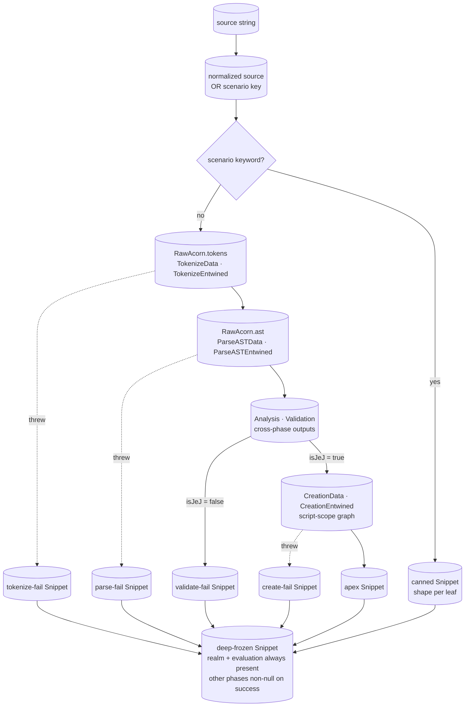
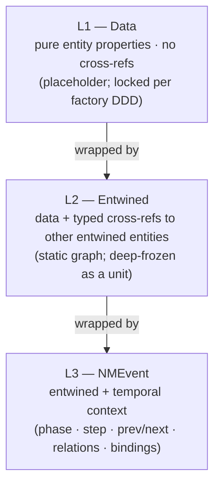

# embody — Architecture & Decisions

This module operationalizes the [JEJ Notional Machine](../notional-machine.md)
as a frozen-data + event-stream contract. The conceptual model is upstream of
the data; this document captures **why the data is shaped the way it is** and
the tradeoffs we considered before locking the contract in
[`types.ts`](./types.ts).

## Data flow

A JEJ source string flows through embody as a hard-gated pipeline. The input is
first normalized (`trim().toUpperCase()`) and matched against the named scenario
keyword set; matches jump directly to the matching shape leaf. Non-matches
descend through four gates — **tokenize → parse → validate → create** — each
with a pass/fail fork. Each fork produces a structurally distinct snippet shape;
phase objects downstream of a failed gate are `null` on the resulting Snippet.



Both paths converge on the same five-leaf shape catalog. **Scenario shortcuts**
(the `dispatch → canned` branch) **construct the matching leaf shape directly**
without running the upstream stages. Scenario dispatch is shape-construction, not
pipeline-traversal — the canned Snippet is materialized from the scenario keyword,
then frozen.

**Order of operations inside the pipeline:**

- After AST-build succeeds, the analyze step runs unconditionally, producing
  `snippet.analysis`. Analysis is not a separate gate; if AST-build succeeded,
  all analyses succeed. `snippet.analysis` is always non-null when
  `status.parsed === true`.
- The validate stage then runs and produces `snippet.validation`. It does three
  things:
  1. Reads the AST → derives `violations[]` → sets `isJeJ = violations.length === 0`
     (the gate criterion).
  2. Reads `analysis.nonDeterminism` → derives `isDeterministic` (metadata).
  3. Reads `analysis.hasIo.user.total` → derives `doesPause` (metadata).

**Validation is a hard gate.** `violations.length > 0` sets `snippet.creation =
null` and prevents evaluation — programs that aren't valid JEJ don't run. On
validate-fail, `snippet.errors` carries `phase='validation'` (first-fail-wins).

**Phase objects are nullable (Option A).** `snippet.tokenize`, `.parseAST`, and
`.creation` are `PhaseType | null` — null when the corresponding status flag is
false. `snippet.realm` is always present (realm always passes).
`snippet.evaluation` is always present but has only `.events` (no `.data`, no
`.entwined`).

**`snippet.evaluation` is always callable.** On non-apex leaves, `run()` returns
a no-op `RunInstance` with `events: []` and `endReport.outcome: 'not-runnable'`;
no worker is spawned. See [Evaluation behavior across leaves](#evaluation-behavior-across-leaves).

**Runtime errors are NOT embodied.** Outcomes from `snippet.evaluation.events.run()`
(timeout, cancellation, evaluation error) live on `RunInstance.endReport` per-call,
not on the static Snippet. The apex leaf is shape-identical across `OK` and
`EVAL_*` scenarios; the `EVAL_*` overlay is interpreted by the evaluate streams
at call time.

Status booleans (`tokenized`, `parsed`, `validated`, `created`) gate which phase
objects are non-null; lenses guard by checking the relevant boolean before
reaching for optional fields. See [`types.ts`](./types.ts) for the full contract.

## Three-layer framework

Every NM entity in embody is represented by three layers, each wrapping the one
below. The separation is strict — no layer bleeds into another.



**L1 — Data**: pure entity properties (kind, value, range, …), no references to
other entities. Shapes are determined per factory DDD session (`lib/parse/`,
`lib/scope/`, etc.); the embody/ contract holds them as placeholder interfaces
until those sessions lock the fields.

**L2 — Entwined**: the same entity with typed cross-references to other entwined
entities (the token's `innermostNode`, the scope's `outer`, the node's
`children`, etc.). Cross-refs are `Entwined`-typed, never raw acorn types.
Entwined cross-refs form a static graph — built mutably during factory
construction and deep-frozen as a unit.

**L3 — NMEvent**: an entwined entity in temporal context. Adds `phase`, `step`
(per-stream position), the `prev`/`next` chain, `loc`, `relations`
(category-specific correlated events), and `bindings` (scope-chain Proxy). Every
event carries one L2 payload via `.entwined`.

### EEE × NMPhase grid

The grid IS the Snippet property structure. Phase objects live on `snippet.realm`,
`snippet.tokenize`, etc.; each phase object exposes `.data` (L1), `.entwined`
(L2), and `.events()` (L3 stream). Layer-first access is provided only for events
via `snippet.events.*`.

| Phase        | `.data` (L1)                                       | `.entwined` (L2)                                        | `.events()` (L3 stream)                         |
| ------------ | -------------------------------------------------- | ------------------------------------------------------- | ----------------------------------------------- |
| `realm`      | RealmData (ScopeData x2, RealmBindingData)         | RealmEntwined (ScopeEntwined x2, RealmBindingEntwined)  | RealmNMEvent (intrinsics-created, host-created) |
| `tokenize`   | TokenizeData (TokenData[], CommentData[])          | TokenizeEntwined (TokenEntwined[], CommentEntwined[])   | TokenNMEvent \| CommentNMEvent                  |
| `parseAST`   | ParseASTData (NodeData root)                       | ParseASTEntwined (NodeEntwined root)                    | NodeNMEvent (enter \| exit pairs)               |
| `creation`   | CreationData (ScopeData forest, ScriptBindingData) | CreationEntwined (ScopeEntwined, ScriptBindingEntwined) | ScopeNMEvent \| BindingNMEvent                  |
| `evaluation` | (no static data)                                   | (no static data)                                        | ResolveEvent, CoerceEvent, ... (RunInstance)    |

`analysis` and `validation` are cross-phase gate outputs — flat fields on
`Snippet`, not cells in the grid.

**Evaluation is the exception to the 3-layer rule.** Its Data and Entwined layers
collapse to nothing because evaluation state cannot be crystallized — every
binding access, coercion, and identifier resolution depends on runtime execution
context. Evaluation data lives on `RunInstance.events[].entwined` (pointing back
to static entwined entities) and on event-local payloads (resolved values,
coerced types). The static graph provides the structural skeleton; runtime
execution fills in the values.

### Phase naming

Three naming sets coexist; each serves a different role:

| Naming set | Syntax | Values | Used in |
| - | - | - | - |
| Snippet field names | camelCase JS property | `realm`, `tokenize`, `parseAST`, `creation`, `evaluation` | `snippet.<phase>` access |
| `NMEventPhase` strings | colon-grouped | `'realm'`, `'parse:tokenize'`, `'parse:ast'`, `'creation'`, `'evaluation'` | `event.phase` discriminator |
| `EmbodyPhase` strings | colon-grouped + `'validation'` | `'parse:tokenize'`, `'parse:ast'`, `'validation'`, `'creation'`, `'evaluation'` | `snippet.errors.phase` |

The `parse:` prefix on `NMEventPhase` groups the two parse sub-phases under one
namespace: `event.phase === 'parse:tokenize'`, not `'tokenize'`. `EmbodyPhase`
adds `'validation'` (the validate gate can fail; it's error-worthy) and omits
`'realm'` (realm always passes; no realm-phase error is possible).

When filtering events: `events.filter(e => e.phase === 'parse:tokenize')`.
When reading errors: `snippet.errors?.phase === 'validation'`.

### Coordinate-access pattern

Phase-first is the primary access axis:

```text
snippet.tokenize?.entwined.tokens[0]   // which phase, then which layer
snippet.tokenize?.events()             // stream for that phase
```

Layer-first access is provided **only for `.events`** via `EventsView`:

```text
snippet.events.tokenize()   // identical to snippet.tokenize?.events()
                            // always safe: returns empty generator when phase is null
```

`.data` and `.entwined` are phase-first only. Two reasons the layer-first
shorthand is restricted to events:

1. **An empty generator is a semantically safe no-op.** Iterating zero events from
   a null phase is indistinguishable from "this phase ran but emitted nothing."
   There is no analogous no-op for data access — `null` and "data that exists but
   is empty" mean different things to a caller.
2. **Stream consumers compose across phases.** A lens iterating all NMEvents from
   realm through creation calls `snippet.events.realm()`, `snippet.events.tokenize()`,
   etc. in sequence without null-checking each phase object. A lens reading
   entwined data is inherently phase-specific — you want tokenize entwined or
   parseAST entwined, never a merged view of all phases.

## 5-leaf staircase (field presence)

Phase objects follow Option A — present when the phase completed, `null` when it
did not. `analysis` and `validation` are null when `!status.parsed`; present
whenever `status.parsed === true` (regardless of validation or creation outcome).

| Leaf            | `realm` | `tokenize` | `parseAST` | `creation` | `evaluation`     | `analysis` | `validation` |
| --------------- | ------- | ---------- | ---------- | ---------- | ---------------- | ---------- | ------------ |
| `tokenize-fail` | present | **null**   | null       | null       | present (events) | null       | null         |
| `parse-fail`    | present | present    | **null**   | null       | present (events) | null       | null         |
| `validate-fail` | present | present    | present    | **null**   | present (events) | present    | present      |
| `create-fail`   | present | present    | present    | **null**   | present (events) | present    | present      |
| `apex`          | present | present    | present    | present    | present (events) | present    | present      |

Notes:

- `snippet.realm` is always present — realm is universally-passing.
- `snippet.evaluation` is always present; it has only `.events` (no `.data` or
  `.entwined`). Evaluation is fully dynamic; its payload lives on `RunInstance`.
- `snippet.events.*` streams are always callable via `EventsView`; null phases
  yield empty generators — never throw.
- On `parse-fail`: Acorn parse is all-or-nothing; no partial AST is surfaced.
- On `create-fail`: `snippet.creation` is null; `snippet.errors` carries
  `phase='creation'`.

### Evaluation behavior across leaves

`snippet.evaluation.events.*` methods are always callable (the phase object is
non-nullable). Their behavior varies by leaf:

| Leaf | `run()` | `intercept()` / `trace.*()` |
| - | - | - |
| `apex` | Spawns a worker; returns a full `RunInstance` | Spawns a worker; emits events live |
| any non-apex leaf | Returns a no-op `RunInstance`: `events: []`, `endReport.outcome: 'not-runnable'`, `endReport.error: null` (gate failure is on `snippet.errors`) | Returns a no-op handle; emits nothing |

No worker is spawned for non-apex leaves. `endReport.outcome: 'not-runnable'`
indicates the call was not executed due to a gate failure, not a runtime error.

## Why this design

### Pure data and the getter exception

Every embody surface is data: frozen objects, primitives, arrays. Generators are
the only callable surface (event streams are inherently iterated). No `query()`,
`dispose()`, `clone*()`, no accessor methods, no derived getters. Anything a
lens "needs to do" is spelled out as iteration + filter over the data.

**The narrow getter exception — frozen-emit constraint.** Two fields on `NMEvent`
are declared as getters: `get prev(): NMEvent | null` and
`get next(): NMEvent | null`. The reason: events are emitted and frozen one at a
time as the stream progresses; when an opener event is frozen, its successor has
not yet been emitted, so `next` cannot be a plain data property. Getters look up
into the cached event array at access time. This is the only exception to the
"no getters" rule; its motivation is explicit in JSDoc. Bookending `.relations`
fields use getters for the same reason.

Why: pedagogy depends on observability. If a lens has to call methods to reach
state, lenses fork into "API users" instead of "data readers." The getter
exception is minimal and its constraint is documentable.

### Strict immutability via single deep-freeze

Built mutably during construction (so cross-references can be wired up),
deep-frozen once at the end. No clone-on-access. No closure-backed getters that
hide computation. Frozen objects are safely shareable.

LLM agents (and human collaborators) cannot trust each other not to mutate
returned data. The freeze is a hard guarantee, not a politeness.

**`event.bindings` is the one non-frozen public surface.** It is a Proxy with a
get trap that walks the current scope chain at access time. Documented as a
"computed view," not data; enumeration and mutation are not supported. JSDoc on
the field explains the distinction. The trade-off (Proxy breaks "pure frozen
data") is explicitly accepted: the scope-chain lookup is dynamically defined and
cannot be precomputed at event-freeze time.

### No Maps or Sets at the public surface

`Object.freeze` doesn't freeze Maps or Sets — `frozenObj.someMap.clear()`
silently succeeds. Pedagogy also prefers ground-truth shapes: indexes are plain
`Record<K, V>`, sequences are arrays. Lenses build their own Maps internally if
they want O(1) lookup.

### Per-instance, no shared state

No module-level cache, no cross-instance communication. One `embody(code)` knows
nothing of others. Multiple lenses on the same snippet hold their own embody
instance. (We considered caching deterministic runs; declined as not worth the
complexity for small JEJ programs — see "No evaluate caching" below.)

### Status booleans, not a discriminated union

Field availability follows a four-gate hard-gated staircase: tokenize success
unlocks parse, parse success unlocks validate, validate success unlocks create,
create success unlocks evaluate. Each gate's failure produces a structurally
distinct leaf with downstream phase objects null. The four status booleans
(`tokenized`, `parsed`, `validated`, `created`) encode the staircase position.
We considered modeling this as a TypeScript discriminated union
(`status: 'tokenize-failed' | 'parse-failed' | …`) but independent boolean gates
were preferred — each is data, no ceremony to narrow. Lenses guard by
`if (snippet.status.parsed) …`.

### Snowball event tiers as filter whitelists

Evaluate-side tiers (`run`, `intercept`, `trace.variables`, `trace.syntax`,
`trace.semantics`) are not type-narrowed subsets — they are **filter predicates**
over a single flat event discriminated union. Higher tiers strictly include more
event categories. `run` is special: returns a `RunInstance` with no event tier.

This avoids the modeling smell of "run ⊂ intercept" being false (run emits no
events at all). The flat union with filter whitelists is honest: one universe,
several views.

### Single static graph shared across runs

Each `snippet.evaluation.events.run()` call produces a frozen `RunInstance`
whose events reference the **same static entwined graph** (same `NodeEntwined`,
`TokenEntwined`, `ScopeEntwined` instances) by identity. No per-run clone.
RunInstance carries run-specific state (events, endReport, finalEnvironment,
runMetrics) plus a back-reference to the snippet for static data.

We considered cloning the graph per run with events attached. Declined: the
clone cost is real, and a simple `events.filter(e => e.entwined === target)`
covers the lookup ergonomics without the clone.

### Environment is derivable, not an event

There is no `category: 'environment'` event type. The environment at any step is
derivable by folding `ScopeNMEvent` (push/pop) and `BindingNMEvent`
(declare/initialize/access/update) events from the initial scope forward. The
environment is the substrate other events happen _in_, not a thing that happens.

Lenses building "memory diagram at step N" fold the deltas; they don't need a
snapshot event. This is more parsimonious and avoids double-counting state.

### No evaluate-call caching

Each `snippet.evaluation.events.run()` call re-runs the worker. JEJ programs are
small, runs are cheap, and cache machinery (mock identity tracking, WeakMap edge
cases, stale-cache confusion) costs more than it saves. Lenses that want a
stable replay hold onto a RunInstance themselves.

### Getters for frozen-emit constraint (`prev` / `next`)

`NMEvent.prev` and `NMEvent.next` are declared as `get prev(): NMEvent | null` —
they look up in the cached event array at access time rather than being set at
event construction time. See
[Pure data and the getter exception](#pure-data-and-the-getter-exception).

### Bookending events and correlated relations

Events that come in opener/closer pairs (NodeEnterNMEvent / NodeExitNMEvent,
etc.) are **linked via `.relations`**:

```text
enter.relations.pair  → NodeExitNMEvent   (getter, not plain data)
exit.relations.pair   → NodeEnterNMEvent  (getter, not plain data)
```

`.relations` fields use getters for the same reason as `prev`/`next`: the exit
event hasn't been emitted yet when the enter event is frozen. The getter defers
the lookup to access time.

A consumer navigating bookended pairs can:

- Use `event.relations.pair` — direct structural link.
- Use `event.next` — walk forward (may pass intervening nested events).

`.relations` is loosely typed on the base `NMEvent`
(`Readonly<Record<string, NMEvent | null>> | undefined`) and narrowed to concrete
getter shapes on each concrete event type (e.g.,
`NodeEnterNMEvent.relations: { get pair(): NodeExitNMEvent }`).

### Streams as living view on crystallized data

The event streams (`snippet.realm.events()`, `snippet.tokenize?.events()`, etc.)
are not separate data sources — they are generators that emit structured views
over data already present in the entwined graph.

The static entwined graph (realm → creation phases) is **crystallized**:
computed pre-run, frozen, deterministic. Streams replay the program's lifetime
from realm through creation as a sequence of NMEvents, each wrapping an
already-frozen Entwined entity with temporal context (step, prev/next, relations).

Evaluation streams (`snippet.evaluation.events.*`) differ: they run the JEJ
program in a sandboxed worker and emit events in real time. Their payloads
reference the same static entwined graph (same `NodeEntwined` instances) but add
runtime-specific state (resolved values, binding transitions). Runtime state lives
only on `RunInstance`.

A stream is not the data — it is the temporal shape of the data. The same
entwined graph can be traversed in multiple orderings (by phase, by category, by
scope chain), all reading from the same frozen source.

**Category overlap across phases.** `category: 'scope'` and `category: 'binding'`
fire in both `creation` (static, one pass) and `evaluation` (dynamic, per-run).
They carry different `kind` sets: `creation` scope events are `'push'`-only;
`evaluation` scope events add `'pop'`. Filter by phase + category to
disambiguate: `events.filter(e => e.phase === 'creation' && e.category === 'scope')`.

### Static/runtime asymmetry

The invariant: **static never references dynamic; dynamic references static
one-way.** An event's `.entwined` is always a static entwined entity (a
`NodeEntwined`, `TokenEntwined`, etc.) — never a runtime payload. Runtime values
(resolved values, coerced types, binding state transitions) are event-local and
live only on `RunInstance`.

This means `lib/*` factories building static phases must never embed execution
results into entwined objects. Evaluation events reference static entities via
`.entwined` but add their own local payload for runtime state.

### Reference equality

Within one call to `embody(code)`, the static entwined graph has stable identity.
The same `TokenEntwined` instance appears in `snippet.tokenize?.entwined`, in
`NodeEntwined.tokens[]`, and in every `TokenNMEvent.entwined` that wraps it. All
event streams and all `RunInstance`s from `snippet.evaluation.events.run()`
reference the same entwined objects.

Across two calls to `embody(code)` (even identical source), no identity guarantees
hold — two embodiments produce distinct object graphs.

Runtime event identity within a single `RunInstance` is stable, but not guaranteed
to match across separate `run()` calls on the same snippet.

## Validation gate vs. validation metadata

The validate gate criterion is `isJeJ` (i.e., `violations.length === 0`). A
program either is a valid JEJ subset or it isn't; the gate flips
`status.validated` accordingly. Failure means `snippet.creation = null`;
`snippet.evaluation.events.*` are still callable but return no-op RunInstances.

Two `snippet.validation` fields are **metadata for consumers, NOT gate criteria**:

```text
isDeterministic = !any(nonDeterminism)
doesPause       = hasIo.user.total > 0
```

These are **derived** from raw `snippet.analysis` fields (`nonDeterminism`,
`hasIo`) on construction, not raw fields a producer writes. A non-deterministic
or user-pausing program is still a valid JEJ subset and passes the gate; the
booleans are informational so lens authors and recommender authors don't have to
recompute. Pinned in [`./types.ts`](./types.ts) JSDoc.

Implications:

- A consumer who needs richer detail (e.g. _which_ I/O method pauses) reads
  `analysis.hasIo`, not `validation.doesPause`.
- A consumer that wants to gate evaluation on determinism or no-pausing reads
  `validation.isDeterministic` / `validation.doesPause` AFTER checking
  `status.validated === true`. The gate itself does not refuse to run
  non-deterministic or pausing programs.
- The real-composition branch in `embody/lib/*` MUST keep these derivation rules
  honest. The scenario-dispatch branch in [`./index.ts`](./index.ts) sets the
  raw fields and lets the derivation produce the booleans (it never writes the
  booleans directly).

## Scenario dispatch

`embody/index.ts` recognizes a small fixed set of **scenario keywords**
(`EMBODY_SCENARIOS`) and dispatches a deterministic canned `Snippet` shape per
named scenario. Input is normalized via `trim().toUpperCase()` before the match.
Scenarios are a **permanent integration-testing fixture set** kept inside
`embody()` because the orchestrator, lenses, and recommender all need a way to
drive every reachable Snippet shape without crafting real JS that happens to
produce that shape. Tests and sandbox harnesses are the primary consumers; the
live editor passes scenario keywords through transparently. See
[`./README.md` § Named scenarios](./README.md) for the consumer-facing
description and [`./index.ts`](./index.ts) JSDoc for the dispatch mechanism.

Why scenario dispatch is kept inside `embody()` rather than split into a sibling
fixture module: keeping the surface single-import for consumers, avoiding the
dual-import burden across the orchestrator, lenses, and tests. The trade-off is
bounded-context impurity (embody also serves as the canonical fixture provider,
not just JEJ operational embodiment) — that's an accepted compromise documented
here so a future reader doesn't read the colocation as accident.

`EMBODY_SCENARIOS` is exported as a frozen array of the 11 valid scenario
keywords for tests + sandbox demos to enumerate.

> **Anti-pattern: no consumer-side branching on `snippet.source.code`.**
> Consumers (orchestrator, lenses, recommender, …) MUST NOT use `source.code`
> content as a branching key — branch on the resulting `Snippet`'s `status` /
> `validation` / `endReport` shape instead. Scenario dispatch is a producer-side
> affordance; the Snippet shape is the consumer surface. Lenses MAY read
> `source.code` to _render_ it (a source-display lens is legitimate); what they
> MAY NOT do is use it as a discriminator. Test code IS allowed to call
> `embody('FAIL_AT_PARSE')` as setup — that's _using_ the affordance, not
> _branching_ on it. A side-effect of scenario dispatch is that source-display
> lenses render the scenario keyword verbatim when a scenario is in play (a
> known dev/debug trade-off, intentional rather than accidental).

The contract surface (`types.ts`) does not mention scenarios at all — they're a
body-level concern of `index.ts`. The public `embody(code)` signature is
shape-stable across scenario-vs-real-composition dispatch.

## `embody/lib/*` integration

embody composes outputs from sibling `embody/lib/*` modules (`parse/`, `ast/`,
`validating/`, `formatting/`, `evaluating/`, `scope/`) into one entwined frozen
graph. The lib modules return raw (unfrozen, unvalidated) data; embody validates
the composition and applies the single deep-freeze at the entwined-graph
boundary. This keeps lib outputs freely composable and freeze a hard guarantee
at the public seam.

Static-side stream generators (`snippet.realm.events()`,
`snippet.tokenize?.events()`, `snippet.parseAST?.events()`,
`snippet.creation?.events()`) yield event-wrapped views over pre-computed event
arrays cached on the snippet — generators emit from the cached array rather than
recomputing.

## Spec correspondence

embody is **ECMAScript-spec-aligned**. Every type and event in
[`types.ts`](./types.ts) corresponds to an NM concept which corresponds to an
ECMA-262 abstract operation:

| embody                                    | NM concept                                     | ES2024 op                                                                           |
| ----------------------------------------- | ---------------------------------------------- | ----------------------------------------------------------------------------------- |
| `RealmPhase`                              | Realm setup                                    | `InitializeHostDefinedRealm` (§9.6)                                                 |
| `RealmBindingData (category='intrinsic')` | ECMA intrinsics                                | `SetDefaultGlobalBindings` (§9.3.4)                                                 |
| `RealmBindingData (category='host')`      | Host bindings                                  | HTML host hook                                                                      |
| `ParseASTEntwined`                        | Parse output                                   | `ParseModule` (§16.2.4)                                                             |
| `CreationEntwined`                        | Creation phase                                 | `GlobalDeclarationInstantiation` (§16.1.7)                                          |
| `RunInstance`                             | Evaluation                                     | ScriptEvaluation (§16.1.6) + BlockDeclarationInstantiation (§14.2.3)               |
| `BindingStatus = 'tdz'`                   | Uninitialized binding                          | §9.1.1.1.1                                                                          |
| `CoerceNMEvent kind`                      | ToPrimitive / ToString / ToNumeric / ToBoolean | §7.1                                                                                |

See `../notional-machine.md` § Spec correspondence appendix for the full mapping
including JEJ-pedagogical splits, glossary bridges, and known imperfections.

## Archive

`.legacy/` holds pre-DDD sketches (plann.txt, plann.excalidraw.svg,
parse-phase-error-categorization.js) — superseded by the locked design, kept for
archival reference only.

## Open holes in the contract

The contract intentionally leaves the following parts unspecified. Each gap is a
deliberate choice — locking these would foreclose options that consumers' real
use is needed to inform.

- **L1 Data shapes** — placeholder interfaces, filled in by downstream factory
  DDD sessions:
  - `lib/parse/` locks: `TokenData`, `CommentData`, `NodeData`, `TokenizeData`,
    `ParseASTData`.
  - `lib/scope/` locks: `ScopeData` (extensions), `RealmData`, `CreationData`.
  - Each session is bound by the L1 contract (pure data, no cross-refs); the L2
    Entwined and L3 NMEvent shapes locked here remain stable as L1 fills in.
- **RunInstance entwinement details** — the contract names `events`, references
  to static entwined objects, and `prev/next` linked-list shape but does not
  specify their exact relationship or any derived indexes. The shape concretizes
  when consumers' access patterns on the `LinkedInterceptEvent` +
  `InterceptResult` surface make the right indexing visible.
- **Per-category evaluation event payloads** — the kinds within each category
  (`expression: 'literal' | 'identifier' | …`,
  `coerce: 'ToPrimitive' | 'ToString' | …`, etc.) are named in
  [`types.ts`](./types.ts); the full payload shape per kind is intentionally open
  so per-category emission detail is not premature.
- **`validation.formatted`** — semantics TBD pending `lib/formatting/` DDD. The
  field exists on `Validation`; its meaning (e.g. "source was already in
  formatted form on entry" vs. "formatting was run and produced no diff") is not
  locked here.
- **`Distribution` shape for `metrics`** — currently
  `{ min, max, mean, median, samples }`. Whether `samples` exposes raw arrays or
  pre-computed stats only depends on what lens consumption actually requires.
- **`HasIo` per-method counts vs. only sums** — the contract exposes per-method
  counts with convenience totals. May collapse to sums-only if lens consumption
  doesn't require per-method detail.
- **`features` enumeration** — intentionally non-exhaustive. Lenses pull what
  they need; the record extends rather than commits to a closed list.
- **`lib/*` `_meta` shape** — currently `{ freeze?: boolean }`. Open for
  additional internal-only flags as the internal contract evolves.

## Out of scope

These are explicitly not responsibilities of `embody/`:

- **Caching** — any flavor (call-level, run-level, snippet-level) is out. Each
  `embody(code)` call constructs from scratch; each `run()` re-runs the worker.
- **Cross-snippet identity** — no identity relationship between two `embody(code)`
  calls, even for identical source.
- **Mutation or clone-on-access APIs** — consumers that need a mutable copy
  `structuredClone()` themselves.
- **Lens-specific indexes** — lenses build their own data structures from the
  `events` generators.
- **LMS / learner-state modeling** — embody decides nothing about teaching; that
  is the lens and recommender layer.
- **Pedagogical decisions** — what to show, when to show it, how to interpret it
  — all out of scope.
