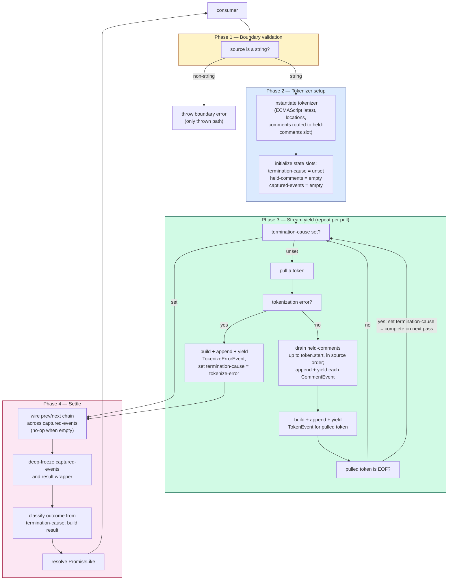

# tokenize — Architecture & Decisions

> Structural contract for the tokenize generator. The implementation
> in `tokenize.ts` (Phase 1) is held against this sketch — what shape
> a correct implementation must take, not what the code does today.
> Domain terms only; no function names, no variable names, no
> pseudocode. See [`glossary.md`](./glossary.md) for the load-bearing
> vocabulary.

## Architectural sketch

The tokenize engine has four execution phases between the consumer
calling the entry point and the settled `TokenizeResult` being
returned. Phases run in a strict sequence; events flow forward only.
Three pieces of internal state thread across phases (named explicitly
below in § State slots).

### Execution phases

1. **Boundary validation** (sync, may reject) — verify the source is
   a string. Reject non-string input with a thrown error at the entry
   point. This is the only path that throws to the caller; every
   downstream failure is reified as data on the result. The motivation
   is pedagogical: a delegated tokenizer error for a non-string input
   produces an opaque message; the explicit boundary check produces a
   friendly one.

2. **Tokenizer setup** (sync, infallible at this layer) — instantiate
   a tokenizer configured for ECMAScript latest with source-location
   tracking enabled and a comment-delivery callback wired to the
   held-comments slot (see § State slots). Initialize the captured-
   events slot to empty and the termination-cause slot to unset.

3. **Stream yield** (sync, generator body — repeat per pull) —
   loop until termination is observed:
   - **Termination check** — if the termination-cause slot is set
     (consumer cancelled / consumer failed / tokenize error already
     fired), break the loop and proceed to phase 4.
   - **Pull** — request the next token from the tokenizer.
     - On a tokenization error: build a `TokenizeErrorEvent`, append
       to captured events, yield it, set the termination-cause slot
       to `tokenize-error`, break the loop.
   - **Drain held-comments** — for each comment in the held-comments
     slot whose source position is at or before the pulled token's
     start, in source order: build a `CommentEvent`, append to
     captured events, yield it (gated by `options.comments`).
   - **Yield token** — build a `TokenEvent` from the pulled token,
     append to captured events, yield it (gated by `options.tokens`).
   - **EOF terminus** — when the pulled token is the EOF token, the
     yield is the last loop iteration; on the next iteration the
     termination check observes natural completion (cause: `complete`).

   Five responsibilities operate inside this loop, all serialised by
   the single-pull-per-iteration discipline: termination polling,
   error reification, comment-ordering repair, category gating, and
   token-event emission. Each is invariant under the others; reorder
   them and the contract breaks.

4. **Settle** (sync, post-iteration) — when phase 3 ends:
   - **Wire the chain** — walk the captured events. For each event,
     mutate `prev` to point at the previous captured event (or `null`
     for the first) and `next` to point at the following (or `null`
     for the last). Empty captured events: no-op.
   - **Freeze** — deep-freeze the captured events and the result
     wrapper. Cycles via `prev` / `next` are allowed under freeze.
   - **Build the result** — classify `outcome` from the termination
     cause; populate `error` if tokenize-error; populate `reason` if
     fail; echo `code` and the resolved options.
   - **Resolve** — settle the handle's PromiseLike contract with the
     frozen result.

### State slots

Three pieces of internal state thread across phases. Naming them
explicitly is part of the contract; implementations that hide them
inside the loop body, that maintain extra slots, or that omit any of
these are out of spec.

- **Termination cause** — single-write slot. Set by exactly one of:
  natural completion (EOF reached and pulled), consumer cancel,
  consumer fail, or tokenize-error. First-write-wins. Read at settle
  to classify `outcome`. Never appears as an event.
- **Held-comments** — ordered slot of comments delivered by the
  tokenizer's comment callback before the corresponding token has
  been pulled. Drained in source-position order each loop iteration,
  before the just-pulled token's event is yielded. Empty at start;
  empty at end of phase 3 (every comment delivered before EOF is
  drained before EOF's TokenEvent yields).
- **Captured events** — ordered slot accumulating every event by
  reference as it is yielded. Becomes `result.events` after wire +
  freeze. Reference identity is preserved: the consumer's saved
  reference from live iteration is the same object reference present
  in `result.events` after settle.

### Data flow

### Structural constraints

- **Only one mutation step**: phase 4's chain wiring. Every other
  phase appends to captured events and reads from state slots;
  nothing else mutates objects after they're yielded.
- **Events captured by reference, not by value**: the engine appends
  each yielded event to captured events by reference. After settle,
  `result.events` IS that slot's contents (frozen in place). Live-
  iteration consumers and replay consumers see the SAME event object
  identities. Implementations that clone events or rebuild the array
  break replay's reference-identity contract.
- **Termination is NOT in the event stream**: `cancel`, `fail`, and
  consumer break-out of `for ... of` set the termination-cause slot;
  they never push synthetic events. The cause is read at settle to
  classify `outcome` and populate `reason`. Mirrors intercept's
  unified termination protocol.
- **First-write-wins on the cause**: once one termination trigger
  (consumer cancel, consumer fail, tokenize error, natural EOF) sets
  the cause, later triggers are ignored. No priority ladder.
- **Reference identity on EOF**: the EOF TokenEvent yielded in phase
  3 IS the same object referenced as the last entry in
  `result.events` after settle. No synthesis, no duplication.
- **Chain is wired BEFORE freeze**, not after. JS allows freezing
  objects with circular references, but mutation of frozen objects
  is rejected. Sequence: yield with `prev: null, next: null` →
  settle → wire chain via mutation → freeze. Implementations that
  freeze events at yield time will fail to wire the chain at settle.
- **Domain abstraction over tokenizer**: the engine treats the
  tokenizer as a pull-based source of tokens with an out-of-band
  comment-delivery callback. The choice of acorn (and the binding to
  acorn's `TokenType.label` for `kind`) is documented in §
  Tokenizer binding below; the contract above is independent of
  that choice.

### Out of scope

- **Building the AST**. `parse/` does this (and shares the
  `TokenEvent` type from this module).
- **Token↔node entwining**. `parse/` owns this (it's the only layer
  with both tokens and nodes in scope).
- **Validating JeJ-allowed constructs**. `lib/validating/` does this.
- **Format-checking**. `lib/formatting/` does this.
- **Iteration limits / runaway-input guards**. Tokenization is O(n)
  in source length; no recursive grammar, no infinite loops. No
  engine-imposed cap. Consumers needing a wall-clock cap call
  `.cancel()` themselves.
- **Source-map generation**. Out of bounds for the JeJ curriculum.
- **Caller responsibilities**: rendering events to UI, formatting
  errors for display, deciding when to call `.cancel()`, choosing
  whether to gate event categories.

## Why a sync generator

The tokenizer is synchronous — it produces tokens via a pull-based
iterator, no I/O, no Worker, no `SharedArrayBuffer`. Wrapping that in
an async generator would add ceremony without benefit; consumers can
still get a `Promise<TokenizeResult>` via the handle's PromiseLike
contract (`await handle`).

The sync generator gives us:

- **Tight loop performance** for one-shot batch consumption (`await
  handle` drains synchronously into a Promise).
- **Step-through semantics** identical to async: `for ... of` pulls
  one event at a time, the consumer can render before pulling the
  next.
- **Mirror with intercept's surface** without coupling to intercept's
  async machinery. The handle's PromiseLike + Iterable + cancel/fail
  shape is transferable across sync/async via the `SyncExecution`
  type in `lib/ast/shared/`.

## Why EOF is a TokenEvent (not its own category)

The underlying tokenizer emits a final token marked as end-of-file
as part of its normal protocol. Surfacing this as a `TokenEvent`
(with `kind: 'eof'`) preserves the "we faithfully wrap the
tokenizer" contract. Inventing an `EofEvent` category would diverge
from the tokenizer's model and require either suppressing the EOF
token (lossy) or emitting both an EofEvent AND the eof TokenEvent
(redundant).

The trade-off is intentional asymmetry with intercept: intercept does
NOT emit a synthetic completion event (termination is on
`result.outcome`, not in the stream). Tokenize INCLUDES eof in the
stream because the tokenizer itself emits it as a token. Different
upstream, different surface.

## Why `result.tokens` is NOT separately exposed

A consumer can derive the tokens array trivially:
`result.events.filter(e => e.category === 'token')`. Exposing both
`result.tokens` AND `result.events` is duplicate state — they would
have to stay in sync, and updating one would mean either updating
the other or documenting which is canonical. Slimmer to expose only
`events`, which contains the full ordered stream (tokens, comments,
error event interleaved by source position with `step` numbering).

If a future consumer needs raw tokenizer-record output (e.g. "give
me the unprocessed tokenizer output for diff comparison"), adding
`result.tokens` as an additive field is a non-breaking change.

## Why comments are a separate event type

The tokenizer delivers comments via an out-of-band callback, NOT
through the token iterator. They're a structurally different
channel. We preserve that distinction by making `CommentEvent` its
own category rather than rolling them into `TokenEvent`-with-
kind-`'comment'`. This keeps the type contract precise: a
`TokenEvent` is what the tokenizer's iterator produced; a
`CommentEvent` is what its comment callback delivered.

Independently gateable in `TokenizeOptions`: a consumer can ask for
tokens only, comments only, or both.

## Comment ordering — why a held-comments slot

The tokenizer invokes its comment callback synchronously within its
internal advance loop, BEFORE the token-after-the-comment is returned
to the puller. So the natural order is:

1. Comment encountered → callback fires → push to held-comments slot.
2. Tokenizer continues; next token is produced.
3. Generator body pulls the token; drains held-comments slot first
   (in source position order), yielding each as a `CommentEvent`
   before the token's own `TokenEvent`.

This produces a stream that interleaves tokens and comments by
source position, regardless of when the tokenizer happens to invoke
the callback internally.

## Cancellation interaction (edge cases)

- **`.cancel()` between iterations**: cause set to `'cancel'`; next
  loop iteration observes the cause via the termination check and
  breaks immediately. Captured events up to that point are preserved
  in `result.events`.
- **`.cancel()` BEFORE the first iteration**: equivalent. The first
  loop iteration's termination check observes the cause and breaks
  before any token is pulled. The tokenizer is never called.
  `result.events` is empty; `result.outcome === 'cancel'`.
- **`.cancel()` during phase 4** (during wire/freeze): cannot happen.
  Phase 4 is sync and uninterruptible from JavaScript.
- **`.cancel()` AFTER the run has settled**: no-op. The handle is
  already at its terminal state; the call has no effect on the
  cached result.
- **`break` from a live `for ... of`**: functionally equivalent to
  `.cancel()`. The generator's return interceptor routes through the
  same cancel path; `outcome` is `'cancel'`.
- **Consumer awaits the handle without iterating** (batch mode): the
  PromiseLike contract drains the generator internally. Phase 3 runs
  to natural completion (or termination); the consumer never sees
  individual events — only the settled result. Captured events are
  still wired and frozen.
- **Empty captured events** (cancel-before-first, or pathological
  case): chain wiring is no-op; freeze is still applied to the empty
  array; result has `events: []`. Outcome reflects the cause.

## Replay / re-iteration

After the run settles, a second `for ... of` over the same handle
yields the same event references in the same order. No re-
tokenization. The handle's iterator delegates to the frozen
`result.events` on second iteration. This invariant requires that:

- Phase 3 appends each event to captured events BY REFERENCE before
  yielding (no clone, no normalization).
- Phase 4 freezes in place; the captured events ARE the result's
  events.
- The handle's `Symbol.iterator` returns a fresh iterator each call,
  but all iterators read from the same backing array.

Two concurrent consumers iterating in parallel will silently split
events as the iterator's `next()` calls serialise — this is
documented as unsupported (matching intercept's stance).

## Replay after termination

A run that ended via cancel, fail, or tokenize-error has a settled
result with `outcome` set accordingly and the captured events
through the termination point. Re-iterating the handle yields those
captured events in order. Termination metadata does NOT appear as a
synthetic event in the replayed stream — consumers check
`result.outcome` (and `result.reason` for fail) to know how the run
ended.

## Tokenizer binding

The engine wraps acorn's tokenizer specifically. The `kind` field
on `TokenEvent` maps directly to acorn's `TokenType.label`
(e.g. `'name'`, `'num'`, `'string'`, `'regexp'`, `'template'`,
`'punc'`, `'eof'`). Switching to a different tokenizer in the
future would require updating every consumer's `kind`-discrimination
code. This lock-in is acceptable given acorn is the curriculum
standard, but is recorded here so future maintainers see the
coupling explicitly.

The engine does NOT override the tokenizer's lexer, transform tokens,
or add synthetic ones (besides what the tokenizer emits). The engine
DOES synthesise events around the tokenizer's output: `CommentEvent`s
from the comment callback, and `TokenizeErrorEvent`s from caught
exceptions.

## What this module deliberately does NOT do

- **Resolve the `with`-statement easter egg.** That is parse-only
  (different sourceType). Tokenization is the same in module and
  script mode for all relevant tokens.
- **Build position indexes** (e.g. `nodeAtPosition`). That is
  `parse/`'s domain (it has the AST to index against).
- **Manage long-running computation.** Tokenization is O(n) in
  source length and never blocks; no need for timeouts, no need
  for iteration limits.
