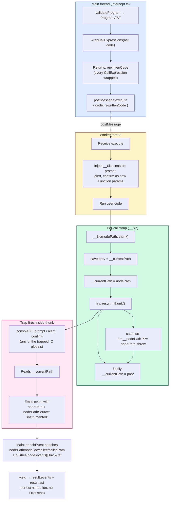

# evaluating/intercept — Architecture & Decisions

## Ubiquitous Language

The vocabulary established here propagates into every function signature, test
description, error message, and JSDoc comment in the intercept module. Names
from this glossary are load-bearing — using a different name in code is a bug,
not a stylistic choice.

| Term                              | Definition                                                                                                                                                                                                                                                                                                                               |
| --------------------------------- | ---------------------------------------------------------------------------------------------------------------------------------------------------------------------------------------------------------------------------------------------------------------------------------------------------------------------------------------- |
| **wrap** (noun)                   | A source-level transform of a single CallExpression: `<callee>(<args>)` → `__$ic('<nodePath>', () => <callee>(<args>))`. Produced by `wrapCallExpressions`.                                                                                                                                                                              |
| **wrap** (verb)                   | The act of applying that transform; the rewriter walks the AST and wraps every CallExpression in user source.                                                                                                                                                                                                                            |
| **trap**                          | A worker-side function intercepting an IO global (`console.X`, `prompt`, `alert`, `confirm`) at fire time. Distinct from a wrap: the trap is on the global, the wrap is on the call site.                                                                                                                                                |
| **`__$ic`**                       | The intercept-call helper, injected as a `new Function` parameter in the worker. Pushes the call's nodePath onto `__currentPath` before running the call thunk; restores the previous value in `finally`. Stamps `__nodePath` on any error that propagates out. Name chosen to avoid collision with JeJ-allowed identifiers (camelCase). |
| **`__currentPath`**               | A worker-side slot holding the nodePath of the currently-active wrapped CallExpression. Trap functions read it at fire time. Set/restored via `try/finally` in `__$ic`.                                                                                                                                                                  |
| **nodePath**                      | A JSON-pointer-style string identifying a node in the AST (e.g. `'$.body.0.expression'`). Generated by [link/build-location-index.ts](link/build-location-index.ts).                                                                                                                                                                     |
| **provenance** (`nodePathSource`) | Indicates how an event's `nodePath` was determined. One of: `'instrumented'`, `'enclosing-fallback'`, `'no-ast'`.                                                                                                                                                                                                                        |
| **`'instrumented'`**              | Provenance value for trap fires inside an `__$ic` wrap — the happy path. nodePath came directly from the wrap's argument.                                                                                                                                                                                                                |
| **`'enclosing-fallback'`**        | Provenance value for the residual error path: a runtime error fired OUTSIDE any CallExpression. Position derived from `Error.stack` via `extractPositionFromError`, mapped to the deepest containing AST node.                                                                                                                           |
| **`'no-ast'`**                    | Provenance value when no AST was built (validation failed before parsing). `nodePath`, `node`, and `loc` are all `null`.                                                                                                                                                                                                                 |
| **instrumentation phase**         | The pre-execution AST walk + source rewrite (in `wrapCallExpressions`) that produces the wrapped source. Distinct from "validation phase" and "format phase".                                                                                                                                                                            |
| **link** (verb)                   | Per-event step performed inline by `enrichEvent` in `intercept.ts`: resolves `event.node` and pushes into `node.events[]`. Happens before yield, so live consumers see fully-linked events.                                                                                                                                              |
| **entwining**                     | The combined effect of instrumentation + link: every event carries `nodePath`, `nodePathSource`, `node`, `loc`; every AST node carries `events[]` back-refs. Bidirectional navigation between events and source.                                                                                                                         |
| **residual error path**           | The narrow case where a runtime error fires OUTSIDE any wrapped CallExpression (e.g. bare `null.foo;`). Handled by `extractPositionFromError` for line attribution; provenance `'enclosing-fallback'`.                                                                                                                                   |
| **`children`** (ASTNode field)    | A flat array of every direct AST descendant of a node, in source-position order. Generic traversal primitive: a consumer can walk the entire tree without knowing ESTree property names per node type. The same `ASTNode` references also appear under their named slots (`.body`, `.callee`, `.arguments`, …).                          |
| **`callee`** (event field)        | On a `LinkedInterceptEvent`, a direct reference to the callee subnode of `event.node` when `event.node.type === 'CallExpression'`. Same object as `event.node.callee` — single source of truth. `null` when `event.node` is `null` (no-ast) or not a `CallExpression` (residual error path).                                             |
| **`calleePath`** (event field)    | The `nodePath` of `event.callee` (typically `event.nodePath + '.callee'`). Useful for editor highlighting that wants to underline only the function reference, not the entire call expression. `null` whenever `event.callee` is `null`.                                                                                                 |
| **`prev`** (event field)          | Previous event in the global timeline. `null` for the head event. Reference-stable from the moment the event is added.                                                                                                                                                                                                                   |
| **`next`** (event field)          | Next event in the global timeline. `null` until the next event arrives — and remains `null` for a truncated run's tail (discriminate via `result.outcome`). Backed by an accessor; underlying state mutates as events arrive.                                                                                                            |

## Navigation

An event and its AST node are entwined the moment the event is emitted: `enrichEvent` (in [intercept.ts](intercept.ts)) resolves `event.node` and pushes the event into `node.events[]` before the `yield`, so consumers iterating live see fully-linked events without waiting for completion. Every event has a typed reference into `result.ast`, and every node has a back-ref array of the events that fired on it. The graph below names every navigation path; consumers pick whichever fits their use case.

```text
result
├── events: LinkedInterceptEvent[]      ── chronological stream
│     └── (each event, Object.freeze-immutable from yield time)
│         ├── step           number     ── 1-indexed sequence number
│         ├── nodePath       string?    ── '$.body.0.expression', etc.
│         ├── nodePathSource              'instrumented' | 'enclosing-fallback' | 'no-ast'
│         ├── node           ASTNode?   ── ===  result.ast[event.nodePath]
│         ├── loc            SourceLoc? ── ===  event.node.loc
│         ├── calleePath     string?    ── event.nodePath + '.callee' (when CallExpression)
│         ├── callee         ASTNode?   ── ===  event.node.callee
│         ├── prev           Linked?    ── previous event in the timeline (null at head)
│         └── next           Linked?    ── next event in the timeline (null until it arrives)
│
└── ast: Record<nodePath, ASTNode>       ── flat lookup map
      └── (each ASTNode)
          ├── syntaxId       string     ── its own nodePath
          ├── type           string     ── ESTree type discriminator
          ├── loc            SourceLoc  ── start/end line+column
          ├── source         string     ── slice of original code
          ├── parent         ASTNode?   ── upward link (null at Program root)
          ├── events         Linked[]   ── back-refs in step order
          ├── children       ASTNode[]  ── every direct descendant in source order
          └── (named slots)             ── .body, .expression, .callee, .arguments, …
                                            same references as appear in `children`
```

**Named slots vs `.children`.** Named ESTree slots (`.body`, `.callee`, `.arguments`, `.expression`, …) give typed access once you've discriminated on `node.type`. `.children` is the generic walk path: the same `ASTNode` references, flattened in source order. Use named slots when you know the node type; use `.children` for type-agnostic traversal (e.g. a renderer that highlights every descendant of a clicked node).

**`event.callee` / `event.calleePath`.** Convenience accessors for the common case of "I have an event from a `console.log(...)` and want to underline just `console.log`, not `console.log(arg)`." Equivalent to `event.node.callee` / `event.node.callee.syntaxId`, but spelled directly on the event so consumers don't need to dispatch on `node.type` first. **Shared reference invariant**: `event.callee === event.node.callee`. Same object, no copy.

**`.parent` (upward links).** Walk upward from any node to find a containing statement, declaration, or block. Note that `parent` forms a cycle with `children` / named slots; `JSON.stringify` will throw without a replacer. The result is deep-frozen with cycle handling — see [utils/deep-freeze-in-place.ts](../utils/deep-freeze-in-place.ts).

**Freeze model.** AST nodes are `Object.freeze`-immutable from the moment they're built (shallow freeze applied at the end of each `walk(node)` in [link/build-location-index.ts](link/build-location-index.ts), after `children` is sorted into source order). Consumers can't reassign `node.events` or `node.children` — but the `events` array remains mutable so `enrichEvent` can push back-refs as events arrive. At completion, `deepFreezeInPlace` recursively freezes all sub-arrays, locking the graph fully. Events themselves are `Object.freeze`-immutable from yield time (see § event.prev / .next). Net result: the reachable graph from any consumer-held reference is structurally frozen from the moment it's reachable; specific mutable sub-arrays accumulate during the run before the final freeze.

**`event.prev` / `event.next` (doubly-linked timeline).** Every event is wired into a doubly-linked list — walk the timeline forward (`event.next.next…`) or backward (`event.prev.prev…`) without indexing through `result.events`. `prev` is captured at the moment the event is added to the list and is reference-stable; `next` is backed by an accessor that returns `null` until the next event arrives, then the next event reference. `null` at `next` therefore means "no event yet" OR "tail of stream" OR "tail of a truncated run" — discriminate via `result.outcome` (`complete` → tail; `cancel`/`fail`/`timeout`/`error` → truncation). Events are `Object.freeze`-immutable from yield time; the `next` accessor reads closure-held state that mutates as new events arrive, but the event object itself never changes shape.

**Single source of truth.** Every shared field name is the same object reference, never a copy:

- `event.node` ===  `result.ast[event.nodePath]`
- `event.loc` ===  `event.node.loc`
- `event.callee` ===  `event.node.callee`
- `node.children[i]` ===  the corresponding named slot (e.g. `node.callee` or `node.arguments[k]`)

Consumers can compare by identity (`===`) without worrying about shallow vs deep equality.

**Usage examples.**

| Goal                                                | Path                                                                            |
| --------------------------------------------------- | ------------------------------------------------------------------------------- |
| Highlight just the function reference               | `event.callee.loc`                                                              |
| Highlight the entire call expression                | `event.node.loc` (or equivalently `event.loc`)                                  |
| Walk every descendant of a node                     | recurse through `node.children`                                                 |
| Find the containing statement                       | walk `node.parent` upward until `parent.type` ends in `Statement`/`Declaration` |
| List every event that fired on a node, in order     | `node.events` (already step-ordered)                                            |
| Resolve `event.nodePath` to the underlying AST node | `result.ast[event.nodePath]` (or just read `event.node`)                        |

## Data flow

The intercept engine's full pipeline: from raw source to a frozen, entwined
`InterceptResult`. The four subgraphs trace the shape of the data and the
responsibility of each thread/component:

- **Main thread** — validation, AST production, instrumentation, per-event
  enrichment + entwining, post-execute freeze
- **Worker thread** — receives instrumented code, exposes `__$ic` + trapped IO
  globals to user code
- **Per-call wrap (`__$ic`)** — the push/pop-current-path mechanism that makes
  attribution exact without `Error.stack`
- **Trap fires inside thunk** — IO globals read `__currentPath` and emit events



Properties:

- **Lines preserved 1:1** — the wrap is in-place; same number of newlines around
  the call. `console.log(x)` becomes
  `__$ic('$.body.0.expression', () => console.log(x))` on the same line.
- **`this`-binding preserved** — `obj.method()` appears verbatim inside the
  arrow body, so the receiver is unchanged.
- **Nesting safe** — push/pop save-restore via `try/finally` in `__$ic` handles
  nested calls (e.g. `console.log(prompt('?'))`) correctly. The depth-first
  bottom-up rewrite ensures inner CallExpressions are wrapped before outer ones.
- **Universal coverage** — wraps EVERY CallExpression, not just trap calls.
  `Math.random`, `String.fromCharCode`, `'hi'.toUpperCase` are all wrapped. Only
  the trap functions READ `__currentPath` and emit events. Wrap and trap are
  decoupled.
- **Aliases work** — `let f = console.log; f(x);` — the `f(x)` site is wrapped,
  so when the trap fires inside, it reads the correct nodePath. No static alias
  analysis needed.
- **Computed access and conditional dispatch** — `console['log'](x)` and
  `(c ? a : b)(x)` attribute to the OUTER CallExpression. "True enough"
  attribution per the design.
- **Runtime errors carry attribution** — `__$ic`'s `catch` stamps
  `err.__nodePath` on any error that propagates up; the top-level worker error
  handler reads it for accurate error attribution without `Error.stack` parsing.

Termination causes (`.cancel()`, `.fail(reason)`, for-await break, timeout,
worker-error) all funnel through `setTermination` → `buildResult`, surfacing on
`result.outcome` (and `result.reason` for `.fail`). Events stay strictly
worker-emitted — no synthetic markers. Domain-agnostic utilities
(deepFreezeInPlace, structuredClone) operate inside transformations, not between
data states, so they don't appear as edges.

The helper name `__$ic` is chosen to be unlikely to collide with JeJ-allowed
identifiers (camelCase). A future validation rule could reject any user
reference to it for friendlier errors.

### Provenance values

`LinkedInterceptEvent.nodePathSource` reports how the event's nodePath was
determined:

- `'instrumented'` — the happy path. Trap fired inside an `__$ic` wrap; nodePath
  came directly from the wrap's argument. Near-100% of events.
- `'enclosing-fallback'` — residual: a runtime error fired OUTSIDE any
  CallExpression (e.g. bare `null.foo;`). Line extracted from `Error.stack`,
  mapped to the deepest containing AST node. Rare.
- `'no-ast'` — no AST was built (validation failed before parsing produced a
  usable tree). `nodePath` and `node` are both `null`.

The previous `'exact'` value (Error.stack column matched a node start) was
effectively unreachable and has been removed.

## Why an AsyncGenerator

The intercept engine needs to produce events incrementally for live UI rendering
while supporting batch consumption for post-rendering only. An async generator
lets the consumer pull events one at a time (`for await`) or drain all at once
(`await`). The returned handle itself is `PromiseLike` — no external wrapper is
needed to support `await run(code)`.

The generator pauses the Worker between events using the SAB pause protocol (see
`evaluating/shared/DOCS.md`). This guarantees events are delivered in correct
order relative to I/O — log events appear before prompt dialogs.

## Architectural Sketch

> Structural contract for the intercept engine. The implementation in this
> directory is held against this sketch. Domain terms only; no function names,
> no variable names, no pseudocode.

This sketch captures four invariants the engine guarantees: the unified pause
protocol (shared with trace), native replay on the InterceptHandle, the
timer-vs-yield interaction that makes "stepping time does not count" actually
hold, and the unified termination protocol (cancel / fail / timeout /
worker-error all funnel through one cause variable; metadata lives on the
InterceptResult, never in events). The § sections below ("Why an AsyncGenerator"
onward) give the "why" behind specific design decisions — tradeoffs,
alternatives considered, constraints — and use the same ubiquitous language as
the sketch.

### Unified pause protocol

Consumer-observable invariant: each Worker-emitted event surfaces to the
consumer exactly once, the Worker does not run further learner code until the
consumer pulls again, and the cumulative timer does not fire while a Worker is
paused-with-pending-event (it reschedules).

**Execution phases**, per event, starting when a trap fires in the Worker and
ending when the consumer's next pull resumes execution:

1. **Flag-arm (Worker, sync)** — Worker trap stores the pause flag to "paused"
   and stores the event-ready flag to "set," in that order. Both stores are
   sequentially consistent per slot (no multi-slot atomic primitive exists; the
   "together" is an ordering claim, not a hardware-atomic claim).
2. **Post (Worker, sync)** — Worker trap posts the event payload on the message
   channel. **Happens-before**: the flag stores in step 1 must precede
   `postMessage`, so any main-thread dequeue of the posted event is guaranteed
   to observe both flags set via the message-channel synchronization edge.
   Posting before the flags would open a race window: main thread dequeues,
   reads flags, sees "not paused," misinterprets.
3. **Block (Worker, sync)** — Worker trap blocks on the pause flag via
   `Atomics.wait`. This is the only point where the Worker thread yields control
   back to the runtime.
4. **Dequeue (main, async)** — The main loop receives the posted event via the
   message channel and resolves its pending wait.
5. **Timer-guard (main, sync, only if the cumulative timer happens to fire
   during this window)** — When the timer fires, the handler first deducts the
   elapsed budget (unconditionally — time elapsed is time elapsed, regardless of
   whether the Worker is paused), then reads the event-ready flag. If the flag
   is set AND the remaining budget is positive, the Worker is paused with a
   pending event and the handler reschedules for the remaining budget — it does
   NOT mark the run as timed-out. Otherwise, the run times out. (This ordering —
   deduct elapsed first, then check EVENT_READY — matches trace's pattern and
   must match; diverging gives different budget behavior.)
6. **Yield (main, async)** — The main loop surfaces the event to the consumer.
   The cumulative timer is paused before this step begins (see §
   Timer-vs-yield). Consumer may take arbitrarily long.
7. **Resume (main, sync)** — On the consumer's next pull: clear the event-ready
   flag first, then release the pause flag, then re-arm the cumulative timer
   with the preserved remaining budget. Ordering constraints:
   - Clear-before-release: clearing the flag after releasing the pause would
     race against the Worker's next trap arming the flag again; the main thread
     would clobber a fresh signal.
   - Release-before-rearm: the micro-window between releasing the pause flag and
     re-arming the timer (typically sub-microsecond) is uncharged to the budget.
     This is accepted — ultra-short runtime between events doesn't meaningfully
     shift the timeout behavior, and rearm-before-release would fire the timer
     on a still-paused Worker.

**Structural constraints**:

- Per-slot sequential consistency of `Atomics.store` plus the happens-before
  edge of `postMessage` delivery is what makes the protocol correct.
  Implementations that try to be clever with batching or relaxed ordering are
  out of spec.
- The timer handler consults the event-ready flag AFTER deducting elapsed time
  and BEFORE marking timed-out. Missing this guard surfaces a race where a
  paused Worker with a pending event is reported as stuck.
- The event-ready flag is cleared before the pause flag is released.
- The pause flag is released before the next event can be produced.
- This protocol is shared with the trace engine. Both engines' timer handlers
  read the same flag. Divergence (each engine using its own flag) is an
  anti-goal.
- The intentional macrotask-break idiom used in the pre-merge engine (an
  `await setTimeout(0)` between yield and resume, to guarantee the wall-clock
  timer callback a firing slot) becomes unnecessary once the timer is paused
  during yield. The resume step runs as a straight sync sequence.

**Cancel interaction**:

- Cancel during **Flag-arm/Post/Block** (inside the Worker): cannot happen —
  these are synchronous and uninterruptible on the Worker side.
- Cancel during **Dequeue**: the termination cause is set on the main thread and
  `wakeDequeue` unsticks the pending wait via a sentinel push. The main loop
  observes `terminationCause.kind === 'cancel'` on its next iteration and breaks
  (no synthetic event is pushed — the cancel surfaces on `result.outcome` from
  buildResult).
- Cancel during **Yield**: the main loop is awaiting the consumer; cancel flag
  is set. On the consumer's next pull the macrotask schedules the next
  iteration, which observes the cancel flag and exits without releasing the
  pause (Worker is terminated by the finally block).
- Cancel during **Resume**: observed before the release, so the pause flag is
  NOT released and the Worker is terminated while still paused. Clean teardown.

**Out of scope**:

- The response-slot protocol used by dialog IO (`prompt`, `alert`, `confirm`).
  That is a separate two-way mechanism already in place; this sketch does not
  alter it.
- Per-engine event shape. Both engines carry different event payloads; the pause
  protocol is agnostic.

### Unified termination protocol

Consumer-observable invariant: every path that ends a run (natural completion,
cancel via `.cancel()`, break out of a live `for await`, wall-clock timeout,
guarded-loop iteration-limit, runtime error) resolves to a settled
InterceptResult whose `outcome` field classifies the cause. The InterceptResult
is cached for replay. The Worker is torn down in every case.

**Execution phases**:

1. **Set cause (main, sync, first-write-wins)** — any termination entry point
   calls a single `setTermination(cause)` helper. The helper writes only if the
   cause closure variable is null; otherwise the earlier cause wins and the new
   one is dropped. `cancel` and `fail` are consumer-driven causes (`fail`
   carries a `reason` payload); `timeout` and `worker-error` are engine-
   detected.
2. **Wake dequeue (main, sync)** — a sentinel is pushed to the queue if empty;
   any pending `await dequeue()` resolves.
3. **Dispatch (main, sync, top of the while-loop)** — the body's main loop reads
   the cause on each iteration. Branch on kind:
   - `cancel` or `fail` → just break. Termination metadata goes on the
     InterceptResult via buildResult; no synthetic event is pushed to events.
   - `timeout` → push TimeoutError into events, yield it, break.
   - `worker-error` → push error into events, break.
   - Runtime error in learner code is carried via the message channel as an
     error event; main loop pushes and breaks.
4. **Finally (main, sync)** — `worker.terminate()`, revoke the Blob URL, clear
   any pending timer.
5. **Build result (main, sync)** —
   `buildResult(code, options, events, locationIndex, maxSeconds, terminationCause, maxIterations)`
   classifies `outcome`:
   - `terminationCause` is `cancel` → `outcome: 'cancel'`, events stay pure.
   - `terminationCause` is `fail` → `outcome: 'fail'`, `reason` set to the
     payload, events stay pure.
   - TimeoutError errorEvent in events → `outcome: 'timeout'`.
   - Iteration-limit RangeError in events → `outcome: 'iteration-limit'`.
   - Any other errorEvent in events → `outcome: 'error'`.
   - Otherwise → `outcome: 'complete'`.

**Precedence** (first-write-wins):

| First-set cause                                     | Wins over any later-set | Rationale                                    |
| --------------------------------------------------- | ----------------------- | -------------------------------------------- |
| `cancel` (via `.cancel()` or `.return()` for break) | yes                     | consumer intent takes precedence             |
| `fail` (via `.fail(reason)`)                        | yes (if arrives first)  | consumer-initiated structured stop           |
| `timeout`                                           | yes (if arrives first)  | wall-clock budget exhausted                  |
| `worker-error`                                      | yes (if arrives first)  | Worker crashed — main thread cannot override |

Under first-write-wins, concurrent triggers produce non-deterministic but
always-consistent outcomes: whichever called `setTermination` first wins. No
priority ladder; the closure variable's monotonic write is the single source of
truth.

**Structural constraints**:

- Termination metadata (cancel, fail) lives on the InterceptResult as
  `outcome` + optional `reason`. It is NEVER pushed into events as a synthetic
  event. Events are strictly worker-emitted — what the program did. This is the
  core invariant that separates "program behavior" from "how the run ended."
- The `.fail(reason)` path stores `reason` by reference on the terminationCause
  closure variable, then buildResult surfaces it on `result.reason`. No clone,
  no separate freeze — reference- stable across replay.
- The `.return` interceptor drives body via `origNext`, never `origReturn`.
  Native `.return()` aborts body before `buildResult`; that would regress to the
  pre-fix broken state.
- The `.return` / `.next` interceptors short-circuit on `isDone` per ECMA-262
  §27.6.3.3.
- `deepFreezeInPlace` freezes events recursively; no post-push event mutation.
  The outcome field on the InterceptResult is frozen with the rest; the `reason`
  object is frozen in place if it's a plain object (consumers passing primitives
  see no change).

**Out of scope**:

- Consumer-propagated error via `gen.throw(e)`. The runtime's for- await body
  throw routes through `.return()` here — classified as `outcome: 'cancel'`
  because the engine cannot distinguish "consumer threw" from "consumer broke."
  Consumers needing structured consumer-driven termination use the shipped
  `.fail(reason)` method instead — see § Fail in the README and the `fail` rows
  in this section's precedence table.
- Additive outcome enrichment for trace/debug. `TraceOutcome` and `DebugOutcome`
  are already typed (subsets of `InterceptOutcome`) but their engines don't yet
  set the field. Migration is additive.

### Replay / re-iteration on InterceptHandle

Consumer-observable invariant: after a run completes (successfully, via a thrown
error, via cancel, or via fail), a second `for await` over the same handle
surfaces the same worker-emitted event references as the first iteration, in the
same order, with no Worker respawn. Termination metadata (cancel/fail) is NOT in
the replayed stream — it's on `result.outcome` and `result.reason`.

**Execution phases**:

1. **Pull (main, async)** — Worker emits an event (via the unified pause
   protocol above); the main loop dequeues it.
2. **Accumulate (main, sync)** — The main loop pushes the event reference (not a
   clone) into the run's internal log array. This is the ONLY point at which
   events enter the log; the push happens before the yield. Termination triggers
   (cancel/fail/ timeout) do NOT push synthetic events — they set
   `terminationCause`, which buildResult reads to classify `outcome`.
3. **Yield (main, async)** — The consumer receives the reference.
4. **Completion (main, sync)** — When the main loop exits (normal completion,
   timeout, error, cancel, or fail), buildResult constructs the InterceptResult
   with `outcome` (and optional `reason` for fail) and freezes the whole
   structure in place. No clone; the log references are the exact references the
   consumer saw during yield.
5. **Replay iteration (post-completion)** — The consumer begins a new
   `for await` over the same handle. The handle returns a fresh iterator
   positioned at the start of the frozen log. No Worker is created. No new
   events are produced. The iterator yields each log entry in order (same
   references as live iteration), then terminates.

**Structural constraints**:

- The Accumulate step pushes by reference. No clone, no normalization, no copy.
- Termination metadata (cancel / fail) does NOT appear in the log. It lives on
  `result.outcome` and `result.reason`. Consumers that want to know "was this
  run stopped" check `result.outcome`, not the log's last entry.
- The final result (including the log) is frozen in place. References of event
  objects survive freeze. The `reason` payload for `.fail()` is stored by
  reference and frozen in place (when it's a plain object; primitives are
  immutable already).
- Replay drains as fast as the consumer pulls. No artificial throttle between
  replayed events; consumers who want a paced replay pace it themselves.
- Re-iteration while the run is still in flight returns the same underlying
  AsyncGenerator. Two concurrent consumers will silently split events as
  `.next()` calls serialize — this is documented as unsupported; the contract
  does not promise to throw. Consumers must wait for completion (or cancel)
  before re-iterating.
- Cancel / fail count as completion. The consumer checks `result.outcome` to
  distinguish; the replayed iterator yields only the worker-emitted events that
  preceded the stop.

**Out of scope**:

- Partial replay (starting replay from an arbitrary index). Consumers iterate
  from the start.
- Cloning events on replay. Intentionally not offered — reference identity is
  the promise.
- Snapshot export. Consumers who want the raw log read it off the result
  directly.
- Throw-on-concurrent-iteration. Would require separate plumbing and doesn't buy
  enough for the cost; AsyncGenerator's native serialize-and-split behavior is
  accepted as the failure mode.

**For-await-break is supported and equivalent to `.cancel()`**. The
InterceptHandle's `gen.return()` interceptor routes the runtime's implicit call
(triggered by `break` inside a live `for await`) through the same cancel path as
explicit `.cancel()` — body() reaches its natural `return buildResult(...)` with
`terminationCause.kind === 'cancel'`, the settled InterceptResult is cached for
replay with `outcome: 'cancel'`. Consumers can choose `break` or `.cancel()`
interchangeably; identity-stable replay of worker-emitted events holds for both.

### Timer-vs-yield

Consumer-observable invariant: the cumulative timer counts **user-perceived
runtime between paused interactions** — not pure worker-thread code-execution
time, and not raw wall-clock time. Each event yield deducts a flat
`YIELD_CHARGE_MS = 5` from the remaining budget on top of the worker-active
elapsed time. Time spent yielded to the consumer between events (rendering wait,
user think-time on a step) and time spent awaiting IO callbacks (styled dialogs,
slow console mocks) does NOT itself add to the budget, but the per-yield flat
charge means a tight rendering-bound loop still depletes the budget within
wall-clock-ish bounds.

Why a flat per-yield charge (not pure worker time): a busy `console.log(1)`
loop's worker-active time per event is ~50µs but its wall-clock cost (including
DOM rendering on the main thread) is ~1–2ms. Pure-worker-time accounting let a
1s budget run for ~7s of wall-clock — counter-intuitive for learners. The 5ms
charge rounds up so the timeout fires at-or-before the budget rather than after,
matching the directive that no class-use-case has a legitimately long-running
program.

**Execution phases** per event yield cycle:

1. **Timer pause (main, sync)** — The main loop pauses the cumulative timer
   before surfacing the event to the consumer. The remaining budget is preserved
   (computed as `budget_at_start - elapsed_since_arm`, floored at zero).
2. **Yield (main, async)** — Event is surfaced; the consumer may take
   arbitrarily long to pull the next event.
3. **Timer resume (main, sync)** — On the consumer's next pull, as the final
   step of the pause-protocol resume sequence: after clearing the event-ready
   flag and releasing the pause flag, the cumulative timer is re-armed with the
   preserved remaining budget.

Parallel phases for IO-callback path (already in place, preserved):

1. **Timer pause** — Before awaiting the dialog callback.
2. **Callback await** — Main thread awaits the consumer-provided or native
   dialog. May take arbitrarily long.
3. **Timer resume** — After writing the IO response and before notifying the
   Worker.

**Structural constraints**:

- The timer is paused for the entire window between event yield and consumer
  pull. Not partial, not approximate.
- Budget depletion (remaining-ms reaches zero while the Worker is running and no
  event is pending) triggers the timeout path.
- The timer is NOT paused while the Worker is running between traps. Only during
  yield and IO callback await.
- Timeout produces a TimeoutError event in the log and a timeout-kind result. No
  partial budget is refunded.
- The sub-microsecond window between pause-flag release and timer re-arm during
  the resume sequence is uncharged. This is accepted (see § Unified pause
  protocol § Ordering constraints).

**Cancel interaction**:

- Cancel during **Timer pause / Yield / Timer resume** of the event path:
  handled by § Unified pause protocol § Cancel interaction. The timer's
  remaining budget is preserved through teardown (not that it matters — the
  finally block terminates the Worker).
- Cancel during **Callback await** of the IO path: the cancel flag is set
  synchronously, but the IO callback await cannot be interrupted. The main loop
  waits for the callback Promise to settle, then observes the cancel flag on the
  next iteration and exits. Native `window.prompt` blocks the main thread
  synchronously, so cancel physically cannot be clicked while it's open; for
  styled/async dialogs the consumer can resolve the pending IO promise to
  shorten teardown.

**Out of scope**:

- Wall-clock timeouts. The engine uses cumulative execution time only;
  wall-clock enforcement is a caller concern.
- Per-event timing telemetry. Consumers who want per-event timing measure it
  themselves.
- Different budgets per phase (e.g. separate budgets for code execution vs IO
  await). The budget is unified.
- Interrupting an in-flight IO callback on cancel. The callback runs to natural
  settle; the Worker is torn down afterwards.

## Why body-injection via string offsets

When `options.iterations` is set to a finite value, the intercept engine injects
loop guards via `guard-loops/guard-loops.ts`. The technique is
**body-injection**: a guard statement is spliced immediately after the loop
body's opening `{`, and a counter-reset statement is spliced immediately after
the closing `}` (or after the trailing `while (cond);` for do-while).

```js
// before:
while (x < 10) {
	x++;
}

// after (maxIterations = 100):
while (x < 10) {
	if (++loop1 > 100) throw new RangeError('Loop 1 exceeded 100 iterations.');
	x++;
}
loop1 = 0;
```

### Why string-offset splice (not AST reprint)

Splicing at computed character offsets preserves the original source byte-for-
byte everywhere except the two insertion points per loop. An AST reprint
(`recast.print`) normalizes whitespace and comment placement even when a node is
not modified — learner formatting, trailing commas, and whitespace-dependent
tests would fail. String-offset splice gives identical output to input for all
characters not directly adjacent to the insertion points.

### Why body injection (not comma-in-condition)

Comma-in-condition (`while (++loop1 > max && guard(1), cond)`) was the original
design intent documented in early architecture notes but was never implemented.
Body injection achieves the same zero-line-shift property: guard text is
appended to the existing opening `{` line, and reset text is appended to the
existing closing `}` line — no newline characters added, line count preserved
exactly.

### Counter declaration

Counter identifiers (`loop1`, …, `loopN`) are not declared in the learner's
source. The Worker script in `create-worker-script.ts` emits
`var loop1 = 0, ..., loopN = 0;` on the same line as `"use strict"` — no
additional line added.

### Coverage

Four loop types are covered: `WhileStatement`, `ForStatement`,
`DoWhileStatement`, `ForOfStatement`. `ForInStatement` is deliberately excluded
— not in the JeJ curriculum surface. See `guard-loops/README.md`.

## Resolved IO table

When a run begins, the engine merges consumer-provided mocks with Native IO
wrappers into a single `resolvedIo` object:

```ts
resolvedIo = {
	prompt: options.io?.prompt ?? nativePrompt,
	alert: options.io?.alert ?? nativeAlert,
	confirm: options.io?.confirm ?? nativeConfirm,
	console: {
		log: options.io?.console?.log ?? nativeConsoleLog,
		// ... all 19 methods
	},
};
```

Slot-by-slot — not all-or-nothing. Consumer overrides one key; the rest stay
native. The worker is unaware of which slots are mocked vs. native — it always
sees the same event-emission path. This is what gives us the shape-identical
guarantee (sequence, event tags, and `args` structure preserved).

### IO execution model (unified)

ALL IO hooks hold learner execution until the callback completes. There is no
fire-and-forget category:

- **Dialog hooks** (`prompt`, `alert`, `confirm`): worker blocks on SAB
  `Atomics.wait`. Main thread awaits the callback, writes the response to the
  SAB response slot, then calls `Atomics.notify`. Worker reads response and
  continues.
- **Console hooks** (all 19 methods): worker blocks on the SAB pause flag (same
  mechanism used between every event). Main thread awaits the console callback,
  yields the `ConsoleEvent`, and on the consumer's next `next()` call, releases
  the pause. No response-slot write is needed (console hooks return `void`;
  nothing is delivered back to the worker).

The net effect: learner code does not proceed past any IO call until the
callback completes, whether native or mocked.

### Mock error handling

Native IO hooks do not throw. If a consumer-provided mock throws (sync or async
rejection), the main-thread catch path surfaces an `ErrorEvent` with
`name: 'InternalError'`. The worker is terminated. The learner sees an internal
error, not an exception from their own code. This is the only circumstance where
an IO callback's exception reaches the learner's event stream.

## Why cumulative timeout with a flat per-yield charge (not wall-clock)

Timeout tracks **user-perceived runtime between paused interactions**, not raw
wall-clock and not pure worker code-execution time. The timer pauses:

- While the worker is blocked on the SAB pause flag (waiting for the consumer's
  `next()` call)
- While the main thread is awaiting any IO callback (dialog or console)

When execution resumes, `setTimeout(remainingMs)` restarts. Additionally, each
pause deducts a flat `YIELD_CHARGE_MS = 5` representing the typical wall-clock
cost of one event-cycle's consumer-side processing (DOM render, native log
dispatch). The constant rounds up so a busy event loop times out at-or-before
its budget — preferable to overshoot, since learners feel runs as longer than
they are and no class-use-case justifies a legitimately long-running program.

Step waits stay free in practice: a learner pausing 5 minutes on event 3-of-100
burns one 5ms charge for that yield, not 5 minutes. Styled dialogs likewise pay
the per-yield 5ms but not the entire modal-open duration.

## Why a Web Worker

The worker provides two things: **timeout control** and **sandboxing**. An
iframe cannot be forcibly stopped mid-execution — `worker.terminate()` can.
Learner code with infinite loops or long-running operations must be killable
after `maxSeconds`. The worker also isolates learner code from the main thread's
DOM and globals.

## Why two-step protocol

The worker receives two messages: **setup** (SAB) and **execute** (instrumented
learner code). This separation predates the universal CallExpression wrap — it
originally existed so trap-definition code wouldn't shift learner line numbers.
With the new wrap mechanism, line numbers come from the AST (via `event.loc`),
so this concern is no longer the load-bearing reason. The separation is retained
because:

- The setup handler is fully synchronous and small; merging into execute would
  add complexity without benefit.
- The split makes the worker's two responsibilities (init, then run) visible at
  the protocol level.

**Invariant**: the setup message handler must be fully synchronous. Worker
message delivery is ordered, so `execute` is dequeued only after `setup`
completes — but only if `setup` does not yield (no `await`, no dynamic
`import()`). If a future change adds async work to setup, the protocol must add
a `setup-ready` acknowledgment message.

## SharedArrayBuffer protocol

Workers cannot call `prompt()`/`confirm()`/`alert()` natively. To provide
synchronous I/O from the learner's perspective, the worker blocks on a
SharedArrayBuffer while the main thread shows native browser dialogs.

### Why SAB+Atomics (alternatives explored)

The only two practical approaches to synchronous worker↔main communication are:

1. **SAB+Atomics** — worker blocks via `Atomics.wait`, main thread responds via
   `Atomics.notify`. Requires COOP/COEP headers.
2. **Sync XHR + ServiceWorker** — worker makes a synchronous `XMLHttpRequest` to
   a ServiceWorker-intercepted URL, which holds the request until the main
   thread provides the response. No header requirement, but adds ServiceWorker
   registration complexity and its own deployment constraints.

Everything else (postMessage, BroadcastChannel, Comlink) is asynchronous and
cannot block the worker. WASM shared memory is SAB under the hood (same header
requirement). There is no zero-cost synchronous path.

SAB+Atomics was chosen because it is simpler, more reliable, and the COOP/COEP
requirement is the hosting platform's concern — not this package's.

### I/O flow — dialog hooks (prompt/alert/confirm)

1. Worker encounters `prompt("name")` via trapped global
2. Worker posts `io-request` message to main thread
3. Worker sets control signal to `1` (waiting) and calls `Atomics.wait`
4. Main thread receives message, awaits `resolvedIo.prompt("name", undefined)`
   (native browser dialog or consumer mock — both awaited the same way)
5. Main thread writes response to buffer, sets signal to `2`, calls
   `Atomics.notify`; on callback throw, surfaces
   `ErrorEvent { name: 'InternalError' }` and terminates worker
6. Worker unblocks, reads response, resets signal to `0`
7. Trapped `prompt` returns the value to the learner's code

### I/O flow — console hooks

1. Worker calls (e.g.) `console.log("hello")` via trapped global
2. Worker posts `event` message (ConsoleEvent) to main thread
3. Worker blocks on the SAB pause flag (`Atomics.wait` on pause slot)
4. Main thread receives event, **pauses the cumulative timer**, then awaits
   `resolvedIo.console.log("hello")` (native console or consumer mock)
5. Timer restarts; on callback throw, surfaces
   `ErrorEvent { name: 'InternalError' }` and terminates worker
6. Main thread yields the `ConsoleEvent` to the generator consumer
7. Consumer calls `next()` → main thread releases pause (`Atomics.notify`)
8. Worker unblocks and continues execution

Console hooks use the existing SAB pause mechanism (the same pause used between
every event). No response-slot write is needed — nothing is delivered back to
the worker. The cumulative timer is explicitly paused (step 4) and restarted
(step 5) so that slow consumer mocks (typewriter animations, network calls,
etc.) do not count against the learner's execution time budget.

### COOP/COEP requirement

SharedArrayBuffer requires these HTTP headers on the hosting page:

```http
Cross-Origin-Opener-Policy: same-origin
Cross-Origin-Embedder-Policy: require-corp
```

This is the hosting site's responsibility. If SAB is unavailable, `run` returns
an `EnvironmentError` event rather than throwing.

## Why errors are events

Throwing exceptions forces consumers into try-catch patterns and loses partial
results (e.g., events before the error). Returning errors as events in the array
means:

- Consumer always gets `LinkedInterceptEvent[]` back
- Partial results (events before a crash) are preserved
- Construction errors and runtime errors use the same interface
- `phase: 'creation'` vs `'execution'` distinguishes when the error occurred

## Why all traps are always defined

Traps are not config-driven. Every run defines all 19 standard console methods,
alert, confirm, and prompt — regardless of what the future allow/block config
says. The allow/block config controls **static validation** (which AST nodes are
permitted), not which traps exist at runtime.

This keeps the worker script static and simple. Config-driven trap selection
would add conditional logic to the worker script string for no clear benefit —
if a learner's code calls `prompt()` but prompt is not in the allow config, the
static validator catches it before `run` is ever called.

## Why no runtime enforcement

Earlier designs included an `enforceLevel` step that blocked unauthorized
globals and prototype methods via property descriptors on the worker's
`globalThis`. This was removed because static validation via `validating/`
catches all disallowed constructs at the AST level before execution. Runtime
enforcement was belt-and-suspenders complexity with no practical benefit at this
language level.

## Position tracking

Trap fires get their position via the AST, not via `Error.stack`. The
pre-execution AST walk wraps every `CallExpression` with `__$ic` (see § Data
flow above for the mechanism), so when a trap fires, the worker reads the firing
call's `nodePath` from `__currentPath`. The main thread later resolves
`nodePath` to `event.loc` (the AST node's `SourceLocation`) via the
LocationIndex when assembling `result.events`.

Lines are preserved 1:1 with the original user source through the
instrumentation rewrite — `wrapCallExpressions` adds no newlines. Columns may
shift slightly for same-line content following a wrap (the wrap text is longer
than the original call), but this matters only for the residual
`extractPositionFromError` path used for runtime errors thrown OUTSIDE any
wrapped call (e.g. bare `null.foo;`). For trap fires, position is exact by
construction.

### scriptMode

The `execute` message accepts an optional `scriptMode` flag (see `types.ts`'s
`ExecuteMessage`). When true, the worker omits the `"use strict";\n` prefix in
front of user code. This is needed for constructs that strict mode forbids —
most notably the `with` statement, which some legacy/teaching examples use.

scriptMode is a worker-side setup concern only — the main thread never needs to
know. With the new wrap-based position tracking, line numbers come from the AST
regardless of scriptMode, so the prefix-line offset arithmetic that used to
depend on `scriptMode` is no longer needed for trap fires. The residual
`extractPositionFromError` fallback still has scriptMode-aware line offsets for
runtime errors.

## Step (sequence number)

Every emitted `InterceptEvent` carries a 1-indexed `step: number`. The worker
stamps the counter on each console/dialog event as it fires; main- thread error
events (timeout, worker-error, internal-error from IO callback failure,
SAB-unavailable, Worker-construction failure) get stamped with
`events.length + 1` (or `1` for pre-iterate paths). The step value is:

- **Contiguous** — `result.events[i].step === i + 1` for every i.
- **Monotonic** — strictly ascending across the global stream.
- **Mirrored on AST back-refs** — after entwining,
  `result.ast[nodePath].events[j].step` reveals the global timeline position of
  that fire, so consumers can reason about "what fired between event 5 and event
  12?" by inspecting any AST node directly without scanning `result.events`.

Mirrors trace's `BaseEvent.step` convention for cross-tool consistency.

## Why new Function instead of eval

`new Function('console', 'alert', 'confirm', 'prompt', code)` provides argument
shadowing — the trapped functions are passed as arguments, cleanly overriding
globals without property descriptor manipulation. This is simpler and more
reliable than patching `globalThis` for these specific APIs.

## Structured clone safety

Trap arguments pass through `postMessage`, which uses the structured clone
algorithm. Most JeJ values (strings, numbers, booleans, null, undefined, arrays)
clone without issue. If a learner somehow passes a function or symbol to
`console.log`, structured clone would throw. The traps catch this and fall back
to string serialization for uncloneable arguments.

## Worker script duplication

The worker runs from a Blob URL and cannot import modules. The SAB read-side
protocol (wait for signal, read response, reset) must be inlined in the
generated worker script string. This means some logic exists in both
`worker-protocol.ts` (typed, importable, used by main thread) and the worker
script string (plain JS, used by worker). This duplication is intentional — the
alternative (bundling or dynamic imports in workers) adds complexity that is not
justified for this amount of code.

## Why console routing goes through Resolved IO

Console calls are routed through `resolvedIo.console[method]` for the same
reason dialog calls are routed through `resolvedIo.prompt/alert/confirm` — the
Native IO wrapper for each console method is just `window.console[method]`. The
consumer can replace it with a styled panel renderer, a typewriter animation, or
any other async function. Routing through the Resolved IO table is what provides
the shape-identical guarantee: whether native or mocked, the `ConsoleEvent` in
the stream looks identical. Event emission serves the UI/analysis layer; the
native wrapper serves authenticity when no mock is provided.

## What this module deliberately does NOT do

- **Resolve allow/block config** — that is `evaluating/shared`'s job
- **Enforce language level at runtime** — static validation (run inside the
  engine's lazy-startup pipeline, ahead of Worker spawn) is sufficient
- **Manage the worker script as a separate file** — Blob URL from string avoids
  bundler/path concerns

Note: validation (`validating/`) and format checking (`formatting/`) are invoked
_from_ this module during lazy startup — they run before Worker spawn, inside
the generator body. They are not separate consumer-visible steps. See
`README.md` § Lazy startup pipeline.
