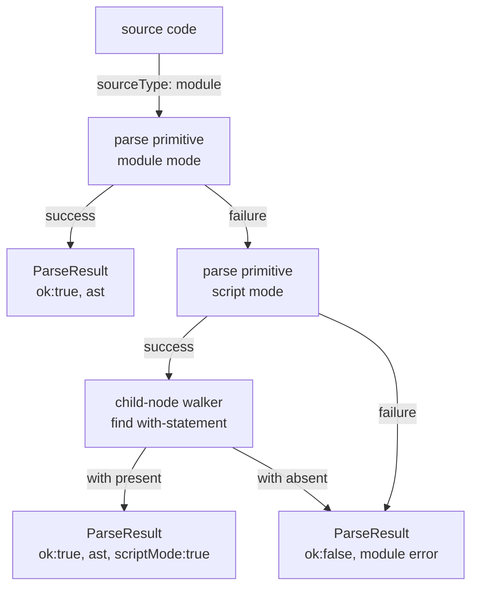

# parse-old — Architecture & Decisions

> **Status — being superseded by `lib/ast/`.** Kept as a working reference for
> existing consumers until they migrate. See `lib/ast/{tokenize,parse}/` for
> the stepping-generator successor.

## Why this module exists

The parse step is foundational: every language-level validator, formatter,
analyzer, and visualiser in the JeJ ecosystem ultimately depends on a
parsed AST. Owning the acorn primitive plus the generic AST walker plus
the public `parse(code)` entry in one module concentrates the parse
contract in one place — consumers depend on `lib/parse-old/` rather than
threading acorn options through every call site.

Originally, the acorn primitive (`parse-program`) and the AST walker
(`get-child-nodes`) lived inside `lib/validating/` because validation was
the first consumer. They were extracted into `lib/parse-old/` as part of the
api/ teardown so the parse step is a first-class module.

## Architectural sketch

> Written Phase 0, before implementation of `parse(code)`. The Refactor
> step of Phase 1a is held against this document — what shape a correct
> implementation must take, not what the code does today. Domain terms
> only; no function names, no variable names, no pseudocode.

### Execution phases

1. **Module-mode parse attempt** (sync, may fail) — delegate to the
   module's parse primitive with module sourceType. Module mode is the
   default for JeJ; it is stricter (no `with`) and provides strict mode
   for free.
2. **Script-mode fallback** (sync, conditional) — only if step 1
   fails: delegate again with script sourceType. The script result is
   accepted **only** if the AST contains a `with`-statement. If the
   script parse also fails, or if no `with`-statement is present, the
   original module-mode error is reported. This step does AST traversal,
   delegated to the module's child-node walker.
3. **Result shaping** (sync, pure) — wrap the AST or the error in the
   `ParseResult` discriminator. Echo back `code` on both branches.
   `scriptMode` flag set only when the script-mode fallback supplied
   the AST.

> All terminal results are deep-frozen (utility, not shown in the
> diagram).

### Data flow

### Structural constraints

- **Never throws.** Parse errors live inside the result. Educational
  tools cannot afford a try/catch boundary around every parse.
- **Always frozen.** The `ast` and the result wrapper are deep-frozen
  before return. Consumers can rely on structural immutability at
  runtime; the TS type only enforces shallow `Readonly<Program>` (see
  types.ts for the gap note).
- **`code` echoed on both branches.** Consumers don't thread the
  original source string alongside the result.
- **Single-use detection and mapping logic stays file-private.** Any
  helpers introduced in implementation are intra-file; per AGENTS.md
  § Within-file helpers, single-use logic does not get extracted to
  separate files.
- **Module mode preferred.** The script-mode fallback exists solely for
  the `with` easter egg. Any other module-mode failure keeps the
  module-mode error message — script-mode error messages are never
  surfaced to the consumer.
- **`scriptMode` field name** matches `ValidationReport.scriptMode` in
  `lib/validating/types.ts`. Cross-module consistency.

### Out of scope

- **Language-level validation.** No JeJ allow-list checking, no scope
  analysis. That belongs to `lib/validating/`.
- **Formatting.** No format-checking. That belongs to `lib/formatting/`.
- **Execution.** No runtime, no Worker, no Aran. That belongs to
  `lib/evaluating/`.
- **Source-map generation.** Out of bounds for the JeJ curriculum.
- **Caller responsibilities** — surfacing/formatting `error.message`
  for display is the consumer's job (`parse` returns acorn's message
  verbatim); editor-coordinate translation of `line`/`column` is the
  consumer's job; deciding what to do on `scriptMode: true` (warn
  learner? render differently?) is the consumer's job.

## Why script-mode fallback only when `with` is present

If a learner's program fails module-mode parse for any reason *other*
than `with`, the script-mode parser may produce a different AST and a
less helpful error message. Gating the fallback on `with`-statement
presence preserves the most useful error for the common case (typical
syntax errors) while accommodating the documented JeJ `with` easter
egg.

## Why deep-freeze every node

The library is consumed by downstream tooling — including LLM-driven
tools — that cannot be trusted not to mutate returned data. Frozen ASTs
catch accidental mutation at the assignment site rather than producing
silent bugs downstream. The freeze cost is paid once per parse; reads
remain free.

## Why `code` is echoed back on both branches

Consumers display source context with the result (line numbers, error
highlighting, AST visualisation). Echoing `code` saves them from
threading the original string through their own state.

## Why `scriptMode` (and not `with`)

Earlier drafts of `ParseResult` used a `with: true` field. Renamed to
`scriptMode` for two reasons:

1. **Reserved word avoidance.** `with` is a strict-mode reserved word.
   Object-property syntax accepts it, but destructuring requires
   renaming (`const { with: usedWith } = result`) and some tooling
   warns.
2. **Cross-module consistency.** `lib/validating/types.ts` uses
   `ValidationReport.scriptMode` for the identical concept. One name
   per concept across the codebase.

## Module ownership

This module owns the parse step end to end. Three files participate in
the data flow:

- **parse-program.ts** — acorn invocation. Produces `Program | ParseError`.
- **get-child-nodes.ts** — generic ESTree child walker. Used internally
  by `parse(code)` for the with-statement detection in Phase 2.
- **get-child-nodes-with-path.ts** — path-tracking child walker. Same
  traversal rules as `get-child-nodes.ts`, but pairs each child with the
  JSONPath segment (`'init'`, `'body[0]'`) that reaches it. The
  validation walkers (`lib/validating/`) use it to assign
  `Violation.nodePath`.
- **build-node-path-map.ts** — builds a `Map<Node, string>` of every
  node to its full Program-rooted JSONPath in one traversal (via
  `get-child-nodes-with-path`). Lets the validation walkers look up a
  node's path by reference instead of threading a path argument through
  their (sometimes scope-aware, non-uniform) recursion.
- **parse.ts** (planned, Phase 1a) — public entry. Implements the three
  execution phases above using the two primitives.

External consumers (`lib/validating/`, `lib/scope/`, `lib/socratizing/`)
import the primitives directly when they need lower-level access; the
public `parse(code)` is reserved for tools that want the JeJ-aware
shape with `scriptMode` fallback and freeze.

## Future direction

**Learner-facing AST fields** — augment AST nodes with extra fields
aimed at learners: plain-English descriptions of node roles, suggested
next steps, links to `reference.md` sections, and similar pedagogical
metadata. Goal: the AST itself becomes an explorable artifact for
learn/teach/explore tooling. Specifics are deferred until a consumer
use case appears; tracked as a TODO in `parse.ts` when it lands.

When that lands, this DOCS.md will gain an additional phase between
"Script-mode fallback" and "Result shaping" — an AST augmentation pass
— and the data-flow diagram will gain a corresponding node.

## Extracted from

This module's source was originally split across `api/parse.ts`
(public wrapper) and `lib/validating/{parse-program,get-child-nodes}.ts`
(primitives). All three were consolidated into `lib/parse-old/` as part of
the api-layer teardown. Prior consumers of the primitives in
`lib/validating/{validate-program,collect-violations,
check-undeclared-globals}.ts`, `lib/scope/build-scope.ts`, and
`lib/socratizing/` had their import paths redirected to `lib/parse-old/`.
