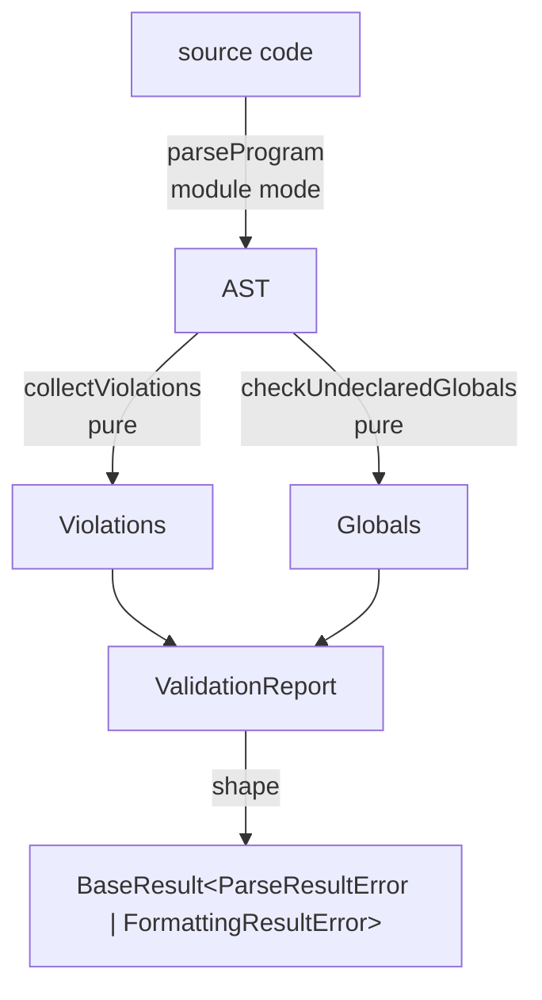

# validating — Architecture & Decisions

## Why this module exists

Validates JavaScript programs against configurable language level subsets for
education. Replaces the previous runtime enforcement approach (monkey-patching
`globalThis` to block disallowed methods/globals at runtime). Runtime
enforcement needed ~40 safety exemptions because blocking things like
`Object.prototype.toString` breaks JS engine internals (implicit coercion,
template literals, `console.log`). Static AST validation eliminates all safety
exemptions — the AST only contains student-written code, engine internals are
invisible.

## Architecture

### Pipeline

```text
source string
  → parseProgram(source, 'module')                              — from ../parse-old/parse-program.ts
  → AST  ─→  collectViolations(ast, nodes)         (independent pass)
        └─→  checkUndeclaredGlobals(ast, config)  (independent pass)
  → concat violations
  → ValidationReport { isValid, violations, source, levelName, scriptMode? }
```

`collectViolations` and `checkUndeclaredGlobals` are two **independent pure
passes** over the same AST. Their outputs are concatenated into a single frozen
`violations` array; neither pass observes the other's results. (Earlier drafts
of this doc described a linear chain — that was wrong; the source has always run
both passes independently.)

Both passes also assign **`Violation.nodePath`** — the NodePath (rooted at the
Program node, e.g. `'$.body.0.declarations.0'`) identifying the offending node.
Each pass builds a node → path map once via `buildNodePathMap` (`../parse-old/`)
and looks up an offending node's path from it by reference, rather than
threading a computed path through the (scope-aware, non-uniform) recursion. The
path is a **required** argument to `createViolation`: the walker passes it for
self-constructed violations (missing / forbidden node types), and
`NodeValidator`s receive it as their second argument
(`(node, nodePath) => true | Violation`) and forward it. There is no default — a
violation without a path would be a programming error, and the map is built from
the same AST the walk traverses, so every offending node's path is present.

`parseProgram` and the AST traversal helper `getChildNodes` live in
[`../parse-old/`](../parse-old/README.md); this module imports them as building
blocks. The `with`-statement script-mode fallback is implemented twice — once in
`validate-program.ts` (for the validation pipeline) and once in
`../parse-old/parse.ts` (for the public `parse(code)` API).

All violations are rejections — there are no informational warnings.

## Data flow

`validate(code)` is the public entry. It wraps the pipeline above with
result-shape transformation:



`validate(code)` produces one of three terminal `BaseResult` shapes:

- `{ ok: true }` — code passes parse and language-level validation.
- `{ ok: false, error: ParseResultError }` — code did not parse. The
  `ParseResultError` flattens `ValidationReport.parseError`'s nested `location`
  to top-level `line` and `column` fields and hardcodes `name: 'SyntaxError'`.
  Information is preserved; the shape is flatter for ergonomic top-level access.
- `{ ok: false, rejections: Violation[] }` — code parsed but contained
  language-level violations.

The terminal node above carries the explicit generic
`BaseResult<ParseResultError | FormattingResultError>` to make the composition
seam visible. The `E` type parameter is what execution wrappers widen —
`lib/evaluating/intercept/intercept.ts` returns
`BaseResult<ResultError> & { logs?: ... }`, supplying its own broader error
union from `api/types.ts`. This module always returns the narrow default.

All terminal results are deep-frozen (utility, not shown).

### Out of scope

- **Format gate** — `validate(code)` does **not** call `checkFormat`.
  `FormattingResultError` is in the `BaseResult.error` union only so downstream
  execution wrappers can return that error kind through a shared shape;
  `validate.ts` never produces it.
- **scriptMode surfacing** — when the `with`-statement fallback is used
  internally by `validate-program.ts`, the resulting
  `ValidationReport.scriptMode: true` flag is **dropped** by the shaper.
  `BaseResult` has no `scriptMode` field. Tools that need this signal should
  call `parse(code)` (which exposes `scriptMode`) or `validateProgram` (which
  exposes `ValidationReport.scriptMode`) directly.
- **Caller-supplied LanguageLevel** — `validate(code)` always uses
  `justEnoughJs`. Custom levels go through `validateProgram(source, level)`.
- **Async boundary** — synchronous throughout. No I/O.
- **Caller responsibilities** — formatting `error.message` for display, mapping
  `line`/`column` to editor coordinates, deciding what to show learners on each
  `error.kind`.

## Scope analysis model

JeJ's taught surface has no functions, catch clauses, or classes. Only
`let`/`const` in blocks, for-of heads, and `Program`-level. This dramatically
simplifies scope analysis compared to general JavaScript. (`with` survives only
as an undocumented easter egg — see decision #6.)

**Scope boundaries:** `Program`, `BlockStatement`, `ForOfStatement`

**Declaration forms tracked:** `let`/`const` in `VariableDeclaration` (including
multi-declarations like `let a = 1, b = 2`), for-of `left` declaration.

**Positions skipped (not references):**

- `VariableDeclarator.id` — declaration site, not a reference
- `MemberExpression.property` when `computed: false` — property name lookup
- `ForOfStatement.left` variable — declaration site

**Out of scope:** Temporal dead zone (TDZ), alias tracking, runtime semantics,
fix suggestions.

## Key decisions

1. **Static replaces runtime entirely.** Safety exemptions are unnecessary when
   analyzing student source code only. Better error messages, source locations
   on every violation, simpler architecture.

2. **Single allowlist object.** The `LanguageLevel.nodes` record maps ESTree
   node type strings to `NodeRule` values: `true` (unconditionally allowed),
   `false` (explicitly forbidden), or a `NodeValidator` function for constraint
   checking. If a node's type is not a key in the record, it's an automatic
   violation. Safer than a denylist — new JS features are blocked by default.

3. **Injectable configuration.** `validateProgram` takes the `LanguageLevel` as
   an argument rather than hardcoding it. Different exercises can use different
   subsets. `allowedGlobals` and `blockedMemberNames` are `ReadonlySet<string>`
   for the same reason — injectable, not hardcoded.

4. **No type checking.** `.log` called on a string is a runtime error, not a
   static validation concern. We check property _names_ against a blocklist
   (`blockedMemberNames`), not the _types_ of their receivers — any name not on
   the blocklist passes regardless of receiver.

5. **No callee identity checking.** `let f = alert; f()` is valid (alert is in
   allowedGlobals, f is declared). We don't track that f "is" alert.
   MemberExpression property name checking + undeclared globals analysis covers
   the important cases without alias tracking.

   _Exception — `new Date()`._ `validateNewExpression` checks
   `callee.name === 'Date'` (reference.md:882-884 makes `new Date()` the sole
   permitted `new`). This is a syntactic name check, not identity/alias tracking
   — `let Date = Math; new Date()` passes the validator and throws at runtime,
   which is acceptable: the realm is disposable and the check serves pedagogical
   surface, consistent with the name-not-type philosophy of decision #4.

6. **Scope analysis simplified for JeJ.** No functions means no function scope,
   no hoisting, no parameters, no closures. No catch or class means fewer
   binding forms. (`with` survives as an easter egg; when present it forces a
   script-mode parse in `validate-program.ts` and the scope analyzer skips
   global checks inside its body via `insideWith`, since dynamic scope defeats
   static analysis.) This is a feature, not a limitation — the scope model
   matches exactly what JeJ learners can write.

7. **Module mode by default.** `sourceType: 'module'` is passed by
   `validateProgram` (the pipeline entry point). `parseProgram` itself accepts
   `sourceType` as a parameter for flexibility. Module mode provides strict mode
   for free and matches how modern JS applications work. Sole exception: the
   `with`-statement easter egg falls back to script mode (decision #6).

8. **Literals = allow-all.** `nodes.Literal: true` (no validator). reference.md
   sanctions every literal form JeJ produces: string, number, boolean, null,
   undefined, template, regex, and BigInt (`42n`; reference.md:3131-3197). An
   earlier `validateLiteral` rejected BigInt — drift; its doc-comment also
   wrongly claimed it rejected regex (it never did). Both removed.

## Why preserveParens is enabled

Acorn's `preserveParens: true` option emits `ParenthesizedExpression` nodes in
the ESTree AST for every parenthesized expression (e.g., `(a + b) * c`). Without
this option, parentheses are syntactically transparent — acorn produces the
inner expression node with correct precedence but no wrapper.

We enable it for trace visualization: when the Aran tracer emits
`parenthesis.enter`/`parenthesis.leave` events, the UI needs an ESTree node to
highlight. `ParenthesizedExpression` provides that anchor point.

The cost is minimal — `ParenthesizedExpression: true` in the allowlist, and the
generic `getChildNodes` walker handles wrapper nodes automatically.

## Why property assignment is blocked

`validateAssignmentExpression` checks that `left.type === 'Identifier'`. This
blocks property assignment (`obj.prop = value`, `arr[0] = value`) while allowing
variable assignment (`x = 5`).

**Rationale:** JeJ has no object literals and no array constructors; the only
`new` is `new Date()` (which yields a Date whose methods all return primitives).
There is still no object or array to assign a property into. Allowing property
assignment would risk learners accidentally overwriting built-in methods
(`console.log = 5`) or creating confusing patterns with no pedagogical value.

The error message is clear: "You can only assign to variables — property
assignment is not allowed."

## Member model: allow-all-except-blocklist

JeJ's member-access policy is a **blocklist**, not an allowlist: any
non-computed property name passes unless it is in `BLOCKED_MEMBER_NAMES`. This
mirrors reference.md's framing ("all `String.prototype` methods except
`split`/`match`/`matchAll`") without enumerating the full permitted surface —
every console / Number / Date / String method reference.md sanctions would
otherwise need listing and re-syncing on every reference.md change.

The blocklist has two tiers:

- **Array-returning string methods** reference.md excludes because arrays are
  out of JeJ scope: `split`, `match`, `matchAll`.
- **Reflection / prototype-escape names** with no JeJ use: `constructor`,
  `__proto__`, `prototype`, `call`, `apply`, `bind`, `__defineGetter__`,
  `__defineSetter__`, `__lookupGetter__`, `__lookupSetter__`, `caller`,
  `arguments`.

`toString` and `valueOf` are deliberately NOT blocked — reference.md allows them
(e.g. `(255).toString(16)`).

Consequence of the inversion: every other property name — including
primitive-returning methods absent from reference.md (`charCodeAt`, `normalize`,
`localeCompare`, …) — now passes dot access. This is intended; reference.md
explicitly sanctions un-listed String/Math methods (reference.md:1916). The
blocklist is not an exhaustive "dangerous names" fence — it is the minimal set
needed to honor the array-type exclusion and keep the prototype graph off the
_dot-access_ surface.

### Accepted residual hole (computed access)

The blocklist governs only **non-computed** dot access. Computed access —
`x['split']`, `x['constructor']`, `Math[method]` — is not gated, because
reference.md requires dynamic computed calls (`Math[method](3.7)` inside
`if (method in Math)`) and the validator is purely syntactic (no type info to
tell a safe dynamic dispatch from an escape). So a learner can reach a blocked
name through brackets (`x['split']()`).

This is **accepted**, not a defect. The JeJ realm is a disposable Web Worker
with no host capabilities injected (only dialog traps), and `eval` is already an
allowed easter egg — arbitrary code is reachable regardless. The blocklist
exists for **pedagogical-surface integrity** (keeping dot access within the
taught surface), not as a security sandbox.

There is a learner-experience asymmetry worth naming: `x.split()` is rejected
with a clear message, but `x['split']()` (or optional-computed `x?.['split']()`)
passes silently — a learner could "escape" a dot rejection by switching to
brackets and get no feedback. We accept it because (a) reference.md never
teaches bracket access as an alternative to a blocked dot method; the only
computed access it teaches is `Math[method]()` guarded by `in`
(reference.md:1948-1967), so a learner reaching `x['split']` is already off the
taught path; and (b) closing it would need the type-aware analysis the validator
deliberately lacks (decision #4). The surface-integrity guarantee is therefore
scoped to _dot access only_. Gating computed string-literal keys (`x['split']`)
was considered and deliberately declined (Option B) to keep the model simple —
do not add it later without revisiting that decision.

## What this module deliberately does NOT do

- **No TDZ detection.** `let x = x + 1` is not flagged. TDZ is a subtle runtime
  behavior that beginners won't encounter in practice.
- **No alias tracking.** `let f = alert; f()` is valid. We don't track that f
  "is" alert.
- **No runtime semantics.** Can't check that `for...of` iterates a string vs. an
  array, or that a function returns the right type.
- **No fix suggestions.** Reports problems with locations. Suggesting fixes is a
  different tool's job.
- **Never throws.** Parse errors are captured in the report. Educational tools
  need graceful degradation for broken student code.
- **No warnings.** All violations are rejections. Pedagogical analysis (unused
  variables, style hints) belongs in a separate consumer-level API.

## Module boundaries

- `validating/` imports parse primitives (`parseProgram`, `getChildNodes`,
  `ParseError`) from `../parse-old/`. No other cross-module imports.
- The ESLint `boundaries` plugin enforces a DAG between modules
- No acorn-walk dependency — `getChildNodes` (in `../parse-old/`) is a simple
  recursive walker

### File roles

**`just-enough-js.ts`** — The pre-built "Just Enough JavaScript" language level
configuration. Defines `allowedGlobals`, `blockedMemberNames`, and the `nodes`
allowlist with constraint validators. This is the single source of truth for
what JeJ permits — it must match `reference.md`. The `BLOCKED_MEMBER_NAMES` Set
is defined once and referenced by both the `createMemberValidator` factory (for
runtime checking) and the `blockedMemberNames` config field (for external
consumers).

**`check-undeclared-globals.ts`** — Scope analysis pass. Walks the AST
maintaining a scope chain and flags known JavaScript built-in globals that are
not in the language level's `allowedGlobals` set. Unknown identifiers (typos)
pass through to runtime. User-declared variables shadow known globals.

**`collect-violations.ts`** — Recursive AST walker. For each node, looks up
`node.type` in the `nodes` record. If missing: rejection. If `false`: rejection.
If validator function: calls it. If `true`: allowed. Recurses into children via
`getChildNodes`.
