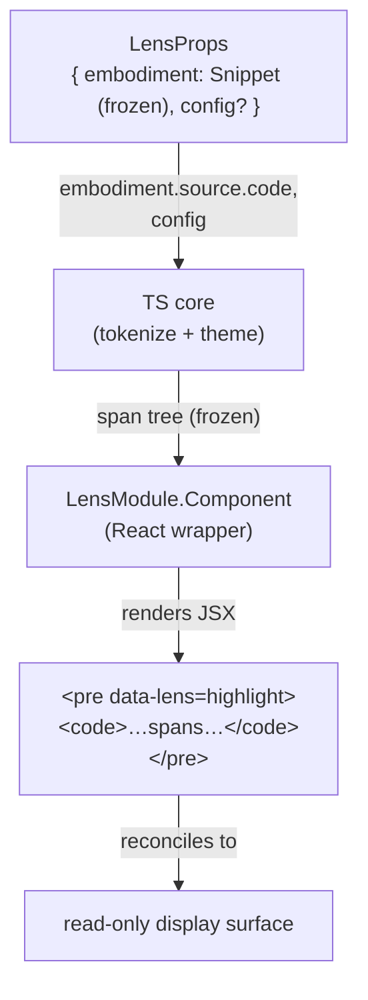

# highlight — Architecture & Decisions

## Why this module exists

The `highlight` lens is the read-only syntax-view of the snippet —
the simplest possible lens against the post-refactor `LensModule`
contract. It renders `embodiment.source.code` as colorized
`<pre><code>` and provides no interaction surface. Its purpose is
twofold:

1. **A scaffolding-minimum lens module.** When the orchestrator's
   lens roster needs a "this code is here, look at it" surface
   (always applicable, no AST dependency, no learner input
   required), highlight is the answer.
2. **A reference shape for the two-layer lens module.** Pure-TS
   core (tokenization + theme application) plus a thin React
   wrapper. New lens authors can copy this shape.

## Single-module surface

| File        | Purpose                                                                                          |
| ----------- | ------------------------------------------------------------------------------------------------ |
| `index.tsx` | React component — the `LensModule.Component`. Imports the core and renders the colorized DOM.    |
| `core.ts`   | Pure-TS core. Tokenizes `embodiment.source.code` and produces a frozen span tree the wrapper renders. |

The default export from `index.tsx` is the frozen `LensModule`
record. The core is internal — only the React wrapper imports it.
Tests that exercise tokenization / theme application target the
core directly (vitest, no `jsdom`). Tests that exercise the React
wrapper use jsdom + `@testing-library/react`.

## Architectural sketch

### Data flow

The "span tree" is highlight's internal name for the
tokenized-and-themed intermediate the React wrapper renders. Not
a contract type; private to this module.

### Execution phases

1. **Mount** — orchestrator is in lens mode with `activeLens =
   'highlight'`. React mounts the LensModule's
   `Component` with `embodiment` and `config` props. The Component
   derives a span tree from `embodiment.source.code` + `config`
   via the TS core and renders.
2. **Re-render with same embodiment** — orchestrator passes the
   same frozen `embodiment` reference; React reconciles. The
   Component's strategy for avoiding redundant tokenization
   (`useMemo`, `React.memo`, or no memoization at all if the cost
   is negligible) is an implementation choice, not part of the
   contract.
3. **Re-render with new embodiment** — orchestrator passes a new
   frozen `embodiment` (snippet edit triggered re-embodiment in
   editor mode and the learner re-entered lens mode). The
   Component derives a new span tree from the new source and
   renders it; React reconciles the DOM.
4. **Unmount** — orchestrator transitions out of lens mode (back
   to editor, or to a different lens). React unmounts the
   Component; any `useEffect` cleanups inside it run.

### Structural constraints

- **Read-only.** The component does not mutate `embodiment` (it
  is deep-frozen by the embody contract) or `config` (also
  frozen). It does not dispatch snippet edits — only the editor
  home base at [`../../orchestrate/editor/`](../../orchestrate/editor/)
  does.
- **No embodiment reach-back.** The component depends only on
  `embodiment.source.code` plus the optional `config`. It never
  imports from `embody/` (top) or `orchestrate/` (top); only
  type-level imports from `embody/types.ts` are allowed.
- **Tier 1 applicability.** `applicableTo(embodiment)` returns
  `true` unconditionally — highlight applies to any snippet,
  including parse-failed ones (the source string is always
  present). Per [`../README.md`](../README.md) § Three-tier
  classification.
- **Per-mount UI state.** Any local state lives inside the
  Component (`useState` / `useReducer`). When the snippet
  changes and the orchestrator unmounts the lens, that state
  goes with it. No cross-mount persistence.
- **LensModule surface stays synchronous.** Per
  [`../DOCS.md` § Structural constraints](../DOCS.md). If a future
  highlighter needs lazy theme/language loading (e.g. Shiki),
  that async lives **inside** the Component (`React.lazy` +
  `<Suspense>` or `useEffect` with a state-machine).

### Out of scope

- **Token-level interaction** — click-to-jump, hover tooltips,
  AST-aware highlighting. Belong to dedicated AST lenses (Tier 2)
  per the three-tier classification. Highlight is text-only.
- **Theme / language config schema** — owned by the lens. The
  config eventually grows `theme` + `language` fields; for now
  the schema is open (any `LensConfig`-shaped record).
- **Snippet edits / single-writer state** — highlight is
  read-only by structural contract; only the editor home base
  mutates snippet state.
- **Recommender ranking logic** — `recommend(embodiment)`
  populates Block-Model placements via the WS2 analysis
  pipeline per
  [`../../.planning-handoffs/02-analysis-and-recommender.md`](../../.planning-handoffs/02-analysis-and-recommender.md).
  Highlight's recommender contribution is part of WS2's Phase
  0; not part of this module's contract beyond the field's
  presence.

## Why `<pre><code>` (not just `<pre>`)

The `<pre><code>` pattern is the de facto standard for code blocks
in HTML — semantic, accessible, styleable. Both Shiki and Prism
produce DOM in this shape. CSS targeting `pre code { … }` works
against any reasonable highlighter implementation. The outer
`<pre>` carries the peer-wide `data-lens="<name>"` attribute (per
[`../DOCS.md` § Structural constraints](../DOCS.md)); the inner
`<code>` carries the colorized spans.

## Module ownership

This module owns:

- `./index.tsx` — the React wrapper (LensModule default export).
- `./core.ts` — the pure-TS tokenization + theme core.
- `./tests/` — vitest unit tests (core in node env; component in
  jsdom env).

Consumers:

- The orchestrator's lens roster (mechanism open-spec per F4
  Phase 0; likely a static import-list of `LensModule` defaults
  at the orchestrator's peer top level) imports the default and
  includes it in the picker / panel set.
- The picker dropdown (L1) lists `name: 'highlight'`; the
  recommender (WS2) ranks it.

No other consumers. The orchestrator never reaches into the
component's internals; it mounts via React reconciliation and
passes `embodiment` + `config` props.

## Future direction

- **Shiki vs. Prism** decision lands when the core's
  tokenization implementation is written (lens-migration
  session). Shiki has richer theme support and async theme
  loading; Prism is synchronous and lighter. Either fits inside
  the Component without changing the LensModule surface.
- **Three-tier classification annotations**: when the Block
  Model is locked at WS2 Phase 0, `recommend` returns the cells
  highlight contributes to (likely `(level=1, scope=local,
  components=[syntax])` and similar).
- **JEJ-aware highlighting** — once `embody/lib/parse/` lands
  Phase B, highlight can consume `embodiment.parse.ast` to
  refine token classes per the JEJ NM (e.g. mark binding kinds
  / scope chains differently). That's a Component-internal
  refinement, not a contract change.
- **Validation/error-driven affordances** — the Component could
  consume `embodiment.validation.violations` to grey out lines
  inside JEJ-violation spans, or `embodiment.errors` to mark
  parse-failure regions. Same shape as JEJ-aware highlighting:
  a richer Component, no contract change.
