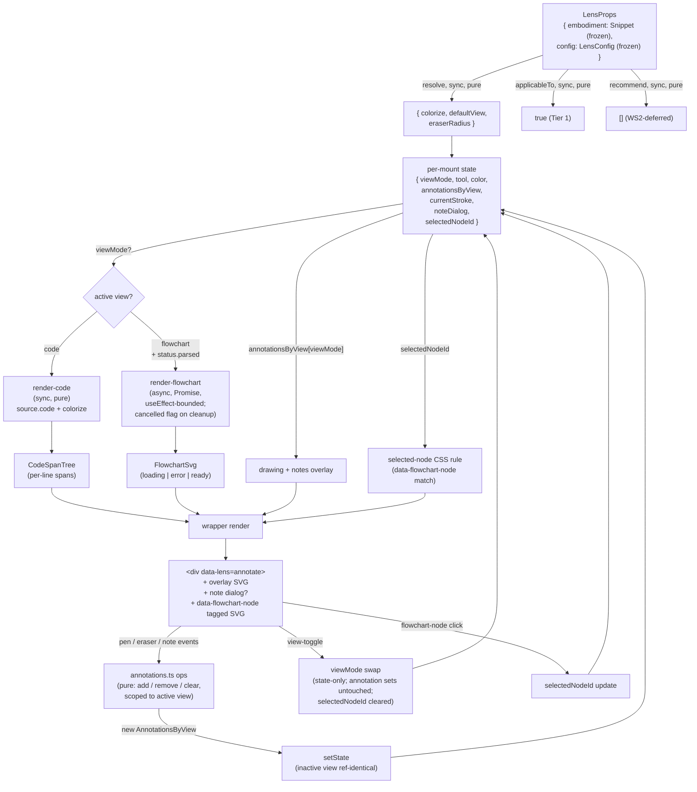

# annotate — Architecture & Decisions

## Why this module exists

The `annotate` lens is the learner's **annotation workbench**: a place to read a
snippet (as colorized code OR as an auto-generated flowchart), draw on it with a
pen, jot positioned text notes, and switch between the two representations
without losing annotations on either view. Pedagogically it serves any "trace
what's happening, mark what's interesting, leave yourself a note" workflow —
annotation-on-top-of-display is its own pedagogical intervention, not just a UI
affordance.

It is also the **first migrated pedagogical lens** in WS4's batch, satisfying
WS3 F4's "first trial lens against the new `LensModule` contract" requirement.
Once landed and registered, the orchestrator's L1 picker has a non-trivial
roster to enumerate and the WS2 recommender has a non-trivial relevance
computation to rank.

## Naming

The pre-refactor lens was called `highlight`. WS4 Phase 0 renamed it to
`annotate` because the lens does annotation-on-top-of-display (pen + eraser +
note over code or flowchart), not token/line highlighting. The pre-refactor
`highlight` tool was a deferred sub-feature (commented out in the source);
restoring it as a fourth tool inside `annotate` is on the
[Future direction](#future-direction) list. The directory rename happened at
Phase 0 (via `git mv`) so no lens consumer was ever locked to the old name.

## Modules

| File                  | Layer   | Purpose                                                       |
| --------------------- | ------- | ------------------------------------------------------------- |
| `index.tsx`           | wrapper | React `Component`; owns per-mount UI state; composes the core |
| `core.ts`             | core    | `LensModule` defaults — `config`, `applicableTo`, `recommend` |
| `render-code.ts`      | core    | Pure: source → `CodeSpanTree` via `prism-react-renderer`      |
| `render-flowchart.ts` | core    | Pure (Promise): source → `FlowchartSvg` via `js2flowchart`    |
| `annotations.ts`      | core    | Pure: `AnnotationSet` add / remove / clear, per-view scoping  |
| `types.ts`            | shared  | `ViewMode`, `Tool`, `Stroke`, `Note`, `AnnotationsByView`, …  |

Default export of `index.tsx` is the frozen `LensModule` record. The core
subsystems (`render-code`, `render-flowchart`, `annotations`) are internal; only
`index.tsx` imports them. Tests target each subsystem in isolation (vitest, no
jsdom) plus the wrapper end-to-end (jsdom + `@testing-library/react`).

## Architectural sketch

> Written Phase 0, before implementation. The Refactor step of each increment is
> held against this sketch. Domain terms only — no function names, no variable
> names, no pseudocode (React hook names like `useState` / `useEffect` are
> acceptable as structural-mechanism references).

### Execution phases

1. **Mount + resolve config** (sync, pure) — orchestrator passes `embodiment`
   (frozen `Snippet`) and `config` (frozen `LensConfig`) via props. The wrapper
   reads three known config fields (`colorize`, `defaultView`, `eraserRadius`)
   with documented defaults; other fields are preserved but ignored. Initial
   per-mount state seeds: active view from `config.defaultView`, active tool =
   `pen`, active color = the first entry of the six-swatch palette (a
   module-level constant in `index.tsx`; not config-driven in v1 — see
   [Future direction](#future-direction)), empty annotation sets for both views,
   no in-progress stroke, no note dialog, no selected flowchart node.

2. **Derive view content** (per render, lazy by view) —
   - Code-view: pure sync derivation from `embodiment.source.code` +
     `config.colorize` to a `CodeSpanTree`. Per-line span arrays. Runs on every
     render (cheap; memoization is an implementation choice, not a contract).
   - Flowchart-view: async Promise from `embodiment.source.code` to a
     `FlowchartSvg` discriminated union (`loading | error | ready`). Generation
     fires **only when `viewMode === 'flowchart'`** — the `useEffect` triggering
     it has both `viewMode` and `embodiment.source.code` in its dependency
     array. If the learner never toggles, the Promise never fires.
   - **Async cleanup invariant.** The flowchart-generation `useEffect` returns a
     cleanup that sets a `cancelled` flag the in-flight Promise checks before
     calling `setState`. This prevents the resolved-after-unmount setState
     anti-pattern when the learner unmounts or toggles back to code-view
     mid-generation.
   - The LensModule surface stays sync; the async lives entirely inside the
     wrapper.

3. **Render** (sync) — wrapper emits the root
   `
` with toolbar, the active
   view's content, the drawing overlay (saved strokes + in-progress), the notes
   overlay, and the note-input dialog when active. Flowchart nodes carry
   `data-flowchart-node="<id>"` attributes added by a post-SVG-inject
   `useEffect` (the only permitted DOM mutation, and only for attribute-tagging
   — never structural mutation; React reconciles the SVG container's children
   from the SVG string). React event delegation on the flowchart container
   handles click + hover. The currently selected flowchart node (per-mount state
   `selectedNodeId: string | null`) is rendered visually via a CSS rule keyed on
   `data-flowchart-node=<selectedNodeId>` — **NOT** by mutating
   `element.style.outline` (which is what the pre-refactor code did via DOM
   mutation outside React; explicitly forbidden by the disposable-practice +
   React-reconciliation rules).

4. **Handle interaction** (per learner event) — pen / eraser / note handlers
   update the active view's `AnnotationSet` immutably, producing a new
   `AnnotationsByView` whose inactive entry is reference-identical to the prior
   frame (the **toggle-preserves-annotations** invariant lives here). View
   toggle updates `viewMode` and the `data-view-mode` attribute; both
   `AnnotationSet`s remain in state untouched. Flowchart-node click updates
   `selectedNodeId`; flowchart-node hover is purely visual (CSS `:hover` on
   `[data-flowchart-node]`, no state change). `selectedNodeId` clears to `null`
   on view-toggle and on snippet-change (so a stale highlight from a prior
   flowchart-view session doesn't linger when the learner returns).

5. **Unmount** (React-driven) — orchestrator unmounts when the snippet changes
   or the learner exits the lens. Annotation sets, in-progress stroke, and
   dialog state are all garbage-collected with the component instance. No
   persistence; no cleanup callback needed beyond what React's `useEffect`
   returns handle (the flowchart-Promise cancellation flag, the post-inject SVG
   event listener cleanup).

### Data flow

The diagram is per-mount. The orchestrator (upstream) supplies `embodiment` and
`config`; the recommender (sibling) calls `applicableTo` and `recommend`. The
render loop reads state, lazily derives the active view's content, emits DOM;
the event handlers feed state updates back through `annotations.ts`. **Both
annotation sets persist across `viewMode` swaps** — the toggle node is
state-only, no annotation-set transformation runs. **Selected flowchart node is
state-only too** — visual selection is a CSS rule keyed on the
`data-flowchart-node` attribute matching `selectedNodeId`, never
`element.style.outline` mutation.

### Structural constraints

- **Two-layer module shape** — `core.ts` + the three subsystem files
  (`render-code.ts`, `render-flowchart.ts`, `annotations.ts`) do not
  `import React from 'react'`; they may consume third-party tokenizers whose
  return shapes are re-projected to plain serializable structures (e.g.
  `CodeSpanTree`) at the core/wrapper boundary — `render-code.ts` consumes
  `prism-react-renderer`'s tokenizer this way without importing React itself.
  `index.tsx` is the only file with React imports. Tests split:
  `tests/render-code.test.ts`, `tests/render-flowchart.test.ts`,
  `tests/annotations.test.ts`, `tests/core.test.ts` (no jsdom) +
  `tests/component.test.tsx` (jsdom). Per the lenses peer's
  [§ Structural constraints](../DOCS.md#structural-constraints).
- **`embodiment` parameter name** in core signatures. Every core function that
  takes a `Snippet` calls it `embodiment`, not `snippet`, not
  `props.embodiment`. Per the lenses-peer invariant.
- **`data-lens="annotate"` on the wrapper's root element.** Load-bearing for
  sandbox-harness selectors. Per the lenses peer's invariant.
- **`data-view-mode="<view>"` and `data-tool="<tool>"`** on the main area and
  toolbar. Sandbox-harness selectors + CSS hooks.
- **`data-flowchart-node` on each tagged flowchart SVG element.** Added by a
  post-inject `useEffect` that walks the SVG. React event delegation on the
  container handles click + hover via
  `event.target.closest('[data-flowchart-node]')`. **No direct DOM mutation
  outside React event handlers**; the post-inject pass only _tags_ elements with
  `data-*` attributes so React can later route events.
- **Tier-1 classification.** `applicableTo` always returns `true`; code-view +
  drawing + notes work on any source string. The flowchart-view is a Tier-2
  sub-feature internally — the flowchart-toggle button has `disabled` (and
  `aria-disabled="true"`) when `embodiment.status.parsed === false`, surfacing
  the limitation at the affordance rather than producing a runtime error after
  toggle. Tested at the wrapper level with a parse-fail `Snippet` fixture
  asserting the toggle button has `disabled === true`.
- **Toggle-preserves-annotations invariant.** Every interaction handler that
  updates `annotationsByView` returns a new `AnnotationsByView` whose inactive
  entry is reference-identical to the prior frame. The view-toggle handler
  updates only `viewMode` (and clears `selectedNodeId`), not
  `annotationsByView`. Tested at the `annotations.ts` core level (reference
  identity) AND at the wrapper level (mount → draw on code → toggle to flowchart
  → toggle back → assert stroke present).
- **Selected-flowchart-node visual is React-rendered, not DOM-mutated.**
  `selectedNodeId` is per-mount React state; visual selection is a CSS rule
  keyed on the `data-flowchart-node` attribute matching `selectedNodeId`. The
  pre-refactor pattern (`element.style.outline = '…'` from inside an event
  handler) is forbidden — the post-inject `useEffect` may only TAG SVG elements
  with `data-flowchart-node`, never mutate their style or structure.
- **Read-only views.** The lens never mutates `embodiment` or `config` (both
  deep-frozen anyway). It never dispatches snippet edits.
- **Disposable practice.** No `localStorage`, no module-level cache, no refs
  across mounts. Both annotation sets are React-state-only; they exist only
  between mount and unmount.
- **No consumer-side branching on `embodiment.source.code`.** The lens _renders_
  `source.code` (legitimate per the lenses-peer invariant) but does not use it
  as a discriminator. Branches on `embodiment.status.parsed` to gate the
  flowchart-toggle; branches on `config` fields to choose theme/view-default.
- **LensModule surface stays synchronous.** `config()`, `applicableTo()`,
  `recommend()` are sync. The flowchart-view's async rendering is absorbed
  inside the React component (`useEffect` + state machine). Per the lenses
  peer's [§ Structural constraints](../DOCS.md#structural-constraints).
- **Display content is rendered safely.** Code spans render as plain text inside
  `<code>`; never `dangerouslySetInnerHTML`. Flowchart SVG is the one exception:
  `js2flowchart` returns SVG markup as a string, so the wrapper uses
  `dangerouslySetInnerHTML` on the flowchart-container element — and the
  post-inject `useEffect` adds `data-flowchart-node` attributes for React event
  delegation rather than direct DOM listeners. The SVG comes from a trusted
  local library; no learner-controlled content reaches
  `dangerouslySetInnerHTML`.

### Out of scope

- **Cross-mount persistence.** Annotation sets live only between mount and
  unmount. Per the disposable-practice principle (LMS owns cross-edit state).
- **Snippet mutation / editing.** Editor's job; the lens is read-only.
- **Code execution / run / trace.** Other lenses' jobs (`trace-table`, future
  `run`); the orchestrator's L1 picker exposes them.
- **Question generation.** The pre-refactor `askOpenEnded` import was dead and
  is dropped. Question-generation is the future `ask` lens.
- **StudyBar / global toolbar.** Pre-refactor lens hosted `run-javascript` /
  `trace-javascript` / `ask-javascript` / `tables-universal` buttons — those are
  sibling lenses; the orchestrator's L1 picker is the canonical surface for
  switching between them.
- **ColorizeContext global toggle.** Replaced by the lens-local
  `config.colorize` field.
- **Telemetry.** Pre-refactor `trackStudyAction` calls are dropped. Future
  internal-EventBus integration (WS3 F5) may surface `annotation-added`,
  `view-toggled`, `cleared` events at the lens boundary.
- **Per-config Prism theme.** v1 ships one default theme; per-config theme
  selection is deferred.
- **Tool extensions** — `arrow`, `circle`, line-level `highlight`. Stubbed in
  the prior art ("coming soon"); restoration is per-tool follow-up.
- **Copy-to-clipboard toolbar button.** Pre-refactor lens included one (with
  `trackStudyAction('code_copy', …)`); dropped because sandbox / docs pages
  already offer standard browser copy affordances and the telemetry surface is
  gone.
- **Multi-language Prism support.** Pre-refactor lens switched `language-*` on
  file extension (JS / TS / Python / …). v1 ships JavaScript-only since the
  package is `just-enough/javascript`; multi-language is a multi-embodiment-type
  concern that `embody/` would surface, not a lens-level concern.
- **Cross-lens annotation reuse.** A learner's annotations on snippet A do not
  transfer to snippet B; that's by design (per the disposable-practice principle
  and per the LMS's responsibility for cross-snippet learner state).

## Why two views, one lens

The user explicitly decided (Phase 0 alignment, 2026-05-27) that `annotate` is
**one lens with two views**, not two lenses that each host their own annotation
surface. The rationale:

- The annotation tools (pen, eraser, note) and the annotation-set model are
  shared between the two views; splitting would either duplicate the annotation
  logic (drift risk) or require a meta-lens that overlays on another lens
  (architectural novelty not yet in the contract).
- The pedagogical claim — **toggle without losing annotations** — requires both
  views to live in one mount. Two separate lenses cannot guarantee this; the
  orchestrator unmounts a lens on switch (per F2's disposable-practice
  contract).
- The single-lens scope is still cohesive: "an annotation workbench for any
  representation of the snippet." Adding a third view (e.g. AST tree) in the
  future is an additive change inside this lens, not a new lens.

The internal modular split (`render-code` / `render-flowchart` / `annotations`
as separate files) keeps each subsystem testable in isolation and preserves the
option to lift any subsystem to `orchestrate/lib/*` if a second consumer
surfaces. The split is an exception to the lenses-peer's "extract on third use"
default, justified by the three subsystems being substantively different
concerns (Prism tokenization, async SVG generation, immutable state model) —
keeping them in one file would mean each subsystem's tests force the others to
load (e.g. the pure-state-model tests would pull in `js2flowchart`
transitively).

## Why `prism-react-renderer` over `prismjs` direct

Phase 0 picked `prism-react-renderer`. Decisive factors:

- **No `dangerouslySetInnerHTML` for code.** `prism-react-renderer` yields a
  `getTokenProps` render-callback that emits plain React spans. `prismjs` direct
  requires `<pre dangerouslySetInnerHTML>` with the highlighted HTML string,
  which (a) bypasses React reconciliation for the code area, (b) reintroduces
  the string-injection class of bug the lenses-peer architecture is trying to
  eliminate.
- **Bundle delta sub-10kb.** The React-wrapper overhead is negligible against
  the determinism win.
- **The flowchart-view still requires `dangerouslySetInnerHTML`**
  (`js2flowchart` returns an SVG string and there is no React equivalent);
  minimizing the count of `dangerouslySetInnerHTML` call-sites to one (the
  flowchart container) keeps the trusted- HTML surface auditable.

## Module ownership

The lens owns its own `README.md`, `DOCS.md`, `types.ts`, source (`core.ts`,
`render-code.ts`, `render-flowchart.ts`, `annotations.ts`, `index.tsx`), and
tests. Cross-cutting lens conventions (two-layer split, `data-lens` invariant,
`LensConfig` shape, no-source-code- branching anti-pattern, disposable-practice)
live in [`../README.md`](../README.md) + [`../DOCS.md`](../DOCS.md); this lens
inherits them.

## Future direction

- **WS2 `recommend()` heuristics.** Lens ships `recommend: () => []`; once WS2's
  analysis surface lands, `recommend(embodiment)` populates Block-Model
  placements with snippet-fit relevance — likely higher relevance when the
  snippet has control-flow visible (motivating the flowchart-view's added
  value), and always-present-low-relevance for code-only annotation. Specific
  Block-Model cells are WS2's call.
- **Internal-EventBus dispatch.** When WS3 F5 lands, the lens emits
  `annotation-added`, `view-toggled`, `cleared` events for picker UI feedback
  and potential future LMS bridging.
- **Tool extensions.** `arrow`, `circle`, line-level `highlight` restoration —
  each is one increment per tool.
- **AST tree view** — a third `ViewMode` (`'ast'`) showing the parsed AST as a
  navigable tree, with the same annotation overlay semantics. Additive inside
  the same lens.
- **Per-config Prism theme.** Add `theme?: string` to `AnnotateLensConfig`; load
  Prism theme CSS dynamically based on config.
- **Per-config palette customization.** Add `palette?: string[]` to
  `AnnotateLensConfig`; the six-swatch default is shipped but override-able.
- **Annotation export / share** (cross-LMS feature, not lens-scope). Out of
  scope until LMS integration target appears.
