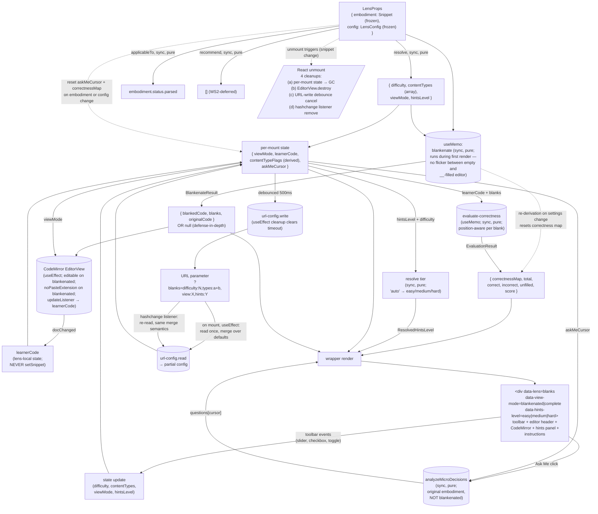

# blanks — Architecture & Decisions

## Why this module exists

The `blanks` lens is the learner's **fill-in-the-blank workbench**: a place to
read a snippet with selected tokens replaced by `__` placeholders inside a
CodeMirror editor, type the missing tokens, and get per-blank correctness
feedback (green / red / yellow) as they go. A difficulty slider scales the
exercise across the novice → review spectrum (`p = difficulty / 100` per
eligible token); five content-type checkboxes scope which token categories are
eligible (keywords / identifiers / operators / literals / delimiters); a
view-mode toggle
gives the learner a peek at the complete source for self-check without losing
their answers. An "Ask Me" button delegates to the `socratizing/` module for
Socratic micro-decision / comprehension questions about the original source —
layering an observational study mode on top of the cloze-deletion task.

It is the **second migrated pedagogical lens** in WS4's batch (after
`annotate`). The previous V2 sprint shipped structurally-compliant shells that
satisfied the `LensModule` contract and passed all tests + AR cycles, but
**never opened in a browser as a learner** — real pedagogical features
(CodeMirror with `__` placeholders, AST-based blankenate, hint tiers, per-blank
feedback, content-type filters, view-mode toggle, URL config, Ask Me) were
absent. The user called those shells "weak hallucinations." This redo deletes
them and migrates the legacy `BlanksLens.jsx` faithfully — preserving the
algorithm via vendoring rather than re-porting, treating the Sandbox Checkpoint
as a gate not a celebration.

## Migration

The pre-refactor lens lived at
`zz--oldd-clauding-and-context-dump/0--study-lenses--it-begins/src/lenses/BlanksLens.jsx`
(914 lines, Preact) and consumed the vendored
`public/static/blanks/blankenate.js` (297 lines) via runtime `<script>` tag
loading. The V2 redo preserves the **pedagogical surface** (the algorithm, the
toolbar, the hints panel, the view-mode toggle, the URL config) while replacing
structural pieces:

- `<script>` tag loading → ESM imports
- Preact `useColorize` / `useApp` contexts → `embodiment` + `config` props
- Legacy `askOpenEnded` chain → `socratizing/` module
- `URLManager` global static class → slimmed `lib/url-config.ts` adapter
- Buggy substring-based evaluation → position-aware
  `lib/evaluate-correctness.ts`
- Compiled-out hints panel (`{false && showHints && (...)}`) → **enabled by
  default** with `'auto'` tier resolution
- Compiled-out editor header (`{/* ... */}`) → **enabled by default**

See `./README.md` § "What this lens does NOT do" for the full lens-specific drop
list, and the handoff plan at
`~/.claude/plans/you-re-picking-up-handoff-zazzy-ullman.md` for the
session-level decisions and audit trail.

## Modules

| File                          | Layer   | Purpose                                                                                                                                                                               |
| ----------------------------- | ------- | ------------------------------------------------------------------------------------------------------------------------------------------------------------------------------------- |
| `index.tsx`                   | wrapper | React `Component`; owns per-mount UI state; composes the core                                                                                                                         |
| `core.ts`                     | core    | `LensModule` defaults — `config`, `applicableTo`, `recommend`                                                                                                                         |
| `lib/blankenate.ts`           | core    | **Vendored** — walks the parsed AST, rolls a probability per eligible token, returns the blanked source plus an array of blank descriptors                                            |
| `lib/no-paste-extension.ts`   | core    | **Vendored** — CodeMirror extension blocking keyboard and context-menu paste                                                                                                          |
| `lib/evaluate-correctness.ts` | core    | Position-aware per-blank correctness; fixes the legacy's two substring bugs                                                                                                           |
| `lib/url-config.ts`           | core    | Slimmed URLManager pattern; reads/writes the lens's URL parameter                                                                                                                     |
| `types.ts`                    | shared  | `Blank`, `BlankType`, `BlankenateResult`, `ContentType`, `ViewMode`, `HintsLevel`, `ResolvedHintsLevel`, `BlankCorrectness`, `CorrectnessMap`, `EvaluationResult`, `BlanksLensConfig` |

Default export of `index.tsx` is the frozen `LensModule` record. The core
subsystems under `lib/` are internal; only `index.tsx` and (where applicable)
`core.ts` import them. The `lib/` subdirectory is eslint-ignored per
`eslint.config.mjs` § Global ignores — the vendored files preserve the legacy's
style as a deliberate trade against the mechanical-conversion mandate
(refactoring to idiomatic V2 is a deliberate follow-up, not an upfront cost).
Tests target each subsystem in isolation (vitest, no jsdom) plus the wrapper
end-to-end (jsdom + `@testing-library/react`); tests live under `tests/` (NOT
`lib/tests/`) so they ARE linted — they are OUR code, not vendored.

## Architectural sketch

> Written Phase 0, before implementation. The Refactor step of each increment is
> held against this sketch. Domain terms only — no function names, no variable
> names, no pseudocode (React hook names like `useState` / `useEffect` are
> acceptable as structural-mechanism references).

### Execution phases

1. **Mount + resolve config** (sync, pure) — orchestrator passes a frozen
   embodiment and a frozen lens config via props. The wrapper reads four known
   config fields (difficulty, content types, view mode, hints level) with
   documented defaults; other fields are preserved but ignored. The content-type
   config is an array of category names; the wrapper derives a boolean-map
   internal representation from it on render (no exported type —
   wrapper-internal only). Initial per-mount state at mount: view mode and hints
   level seeded from config; learner code is empty (filled on first edit);
   correctness map is empty (populated when the learner types into a blank
   position); the Ask Me cursor starts at index zero.

2. **Derive blanks** (sync, pure, per-render-conditional) — the wrapper memoizes
   the blankenate call on the embodiment, difficulty, and content-type-flags
   inputs. The call is synchronous. Note: the parse-success gate at
   `applicableTo` is already satisfied; `blankenate` re-parses internally per
   the mechanical-conversion mandate (it does not consume `embodiment.raw.ast`).
   Two parses happen on every re-derive — consuming the upstream AST directly is
   on the Future direction list. Result shape per `BlankenateResult` (in
   `types.ts`) on success; `null` on internal parse failure (defense-in-depth —
   in production `applicableTo` gates this case out). The first paint already
   shows `__` placeholders — no flicker between an empty editor and a populated
   one. Re-derivation on settings change resets the correctness map; the wrapper
   does NOT preserve correctness across re-rolls.

3. **Wire CodeMirror** (per-mount, async-setup) — a mount effect instantiates
   the editor view configured with the standard JavaScript basicSetup, the
   codebase's editor theme, an editability flag driven by view mode, an update
   listener that mirrors learner edits into local state, and (in blankenated
   mode only) the no-paste extension. The update listener fires only when the
   document changed AND view mode is blankenated; it **never** calls the
   orchestrator's snippet setter — learner answers stay lens-local per the
   single-writer invariant. On view-mode change, the wrapper recreates the
   editor view (parity with legacy lines 310–338; see § Why recreate on toggle
   below). Learner answers are **preserved** across the toggle: when toggling to
   `'complete'` the editor mounts on `embodiment.source.code` (read-only, no
   `__`); when toggling back to `'blankenated'` the editor mounts on
   `learnerCode` (the in-progress edits) or, on first-toggle-back, on
   `blankedCode` from the memoized blankenate result.

4. **Evaluate correctness** (per learner edit, sync, pure) — a `useMemo`
   keyed on `(learnerCode, blankResult)` calls
   `evaluateCorrectness(currentDoc, blanks, originalCode)` where
   `currentDoc = learnerCode ?? blankResult.blankedCode`. The evaluator
   returns `EvaluationResult` (`correctnessMap` + counts + score); Inc 6d
   surfaces the score in the JSX, and Inc 6h feeds `correctnessMap` to
   the hints panel for the per-blank green/red/yellow visual. `useMemo`
   (not `useEffect`): synchronous-pure computation belongs in the render
   pass so the score updates atomically with the learner's keystroke —
   no stale-score flicker frame. Position-aware: each blank's
   `{start, end}` from `blankenate`'s output anchors a per-position
   match against the learner's typed text. Fixes the legacy's two bugs
   (substring-containment false positive; multi-blank-same-word
   tracking).

5. **Render** (sync) — the wrapper emits the root
   `
`
   with toolbar, editor header, CodeMirror container, hints panel, and
   instructions panel. The `data-hints-level` attribute reflects the
   **resolved** tier (`'easy' | 'medium' | 'hard'`), never `'auto'` — the
   inference happens before this attribute is read.

6. **Handle interaction** (per learner event) — per-control handlers update the
   relevant config-state slice (`difficulty`, `contentTypes`, `viewMode`,
   `hintsLevel`); the wrapper's URL-write effect (debounced 500ms) writes the
   new config to the URL parameter.

7. **Ask Me** (per learner click, sync, pure) — the Ask Me button calls
   `analyzeMicroDecisions(embodiment, ASK_ME_CONFIG)` and surfaces one
   `CodeQuestion` from the filtered result at the wrapper's local cursor index;
   subsequent clicks advance the cursor (wrapping back to zero at the end of the
   filtered question list). Cursor resets to zero on embodiment or config
   change. Ask Me is capped at five questions per call, with the comparative
   register filtered out for v1 (the open and pointed registers remain); see
   README § Ask Me contract for the rationale and the literal config constant.

8. **URL config sync** (per learner control change, debounced 500ms) — a write
   effect keyed on the four config fields debounces 500ms (matching legacy
   line 222) and calls the URL-config writer. On mount, a separate read effect
   calls the URL-config reader once, merging any URL-supplied values over the
   wrapper's default state. A hashchange listener registered by the same read
   effect re-reads on browser back/forward — same merge semantics. URL is the
   only cross-mount persistence; learner answers, blanks, correctness, and the
   Ask Me cursor are React-state only.

9. **Unmount** (React-driven) — orchestrator unmounts when the snippet changes
   or the learner exits the lens. Per-mount state is garbage-collected with the
   component instance. Four cleanup obligations fire: (a) React GCs the
   per-mount state, (b) the CodeMirror editor view destroys via its own cleanup,
   (c) the URL-write effect cancels its pending debounce, (d) the URL-read
   effect removes its hashchange listener. Each is the responsibility of the
   effect that registered the resource; the lens MUST NOT leak any past unmount.

### Data flow

The diagram is per-mount. The orchestrator (upstream) supplies `embodiment` and
`config`; the recommender (sibling) calls `applicableTo` and `recommend`. The
render loop reads state + the memoized blankenate result; the event handlers
feed state updates back through their respective hooks (the URL-write debounce
is the only async-ish surface). **URL is the only cross-mount persistence** —
learner answers and the correctness map die with the component instance.

### Structural constraints

- **Two-layer module shape** — `core.ts` + the four subsystem files under `lib/`
  do NOT `import React from 'react'`. `lib/no-paste-extension.ts` imports
  `@codemirror/*` (a third-party library whose extension type is React-free);
  `lib/blankenate.ts` imports `acorn`; `lib/url-config.ts` reads/writes
  `window.location.hash` and `window.history` directly (DOM globals, not React).
  `index.tsx` is the only file with React imports. Tests split:
  `tests/blankenate.test.ts`, `tests/no-paste-extension.test.ts`,
  `tests/evaluate-correctness.test.ts`, `tests/url-config.test.ts`,
  `tests/core.test.ts` (no jsdom) + `tests/component.test.tsx` (jsdom). Per the
  lenses peer's [§ Structural constraints](../DOCS.md#structural-constraints).
- **`embodiment` parameter name** in core signatures. Every core function that
  takes a `Snippet` calls it `embodiment`, not `snippet`, not
  `props.embodiment`. Per the lenses-peer invariant.
- **`data-lens="blanks"` on the wrapper's root element.** Load-bearing for
  sandbox-harness selectors. Per the lenses peer's invariant.
- **`data-view-mode="blankenated|complete"` and
  `data-hints-level="easy|medium|hard"`** on the root. Sandbox-harness
  selectors + CSS hooks. The `data-hints-level` value reflects the **resolved**
  tier — never `'auto'`. Values reflect committed config state, not in-flight
  transitions; CSS transitions should anchor on the parent.
- **Tier-2 classification.** The contract per [`../types.ts`](../types.ts):
  `applicableTo` is the recommender's cheap gate; `recommend` only fires on
  applicable lenses. This lens honors that contract by returning
  `embodiment.status.parsed` for `applicableTo`. The vendored `blankenate`
  re-parses internally (it doesn't consume `embodiment.raw.ast`), so a parse
  failure inside the vendor's call path is defense-in-depth — `applicableTo`
  should have prevented the mount.
- **`recommend()`'s signature is locked at
  `(embodiment) => ReadonlyArray<Recommendation>`.** The v1 body returns the
  empty array; the WS2 follow-up replaces the body in place. The mermaid `Recs`
  terminal node represents the surface shape, not the current empty
  implementation.
- **LensModule defaults return deep-frozen values.** `config()` returns a
  `freezeInPlace`-frozen `LensConfig`; `recommend()` returns a module-level
  frozen-empty-array constant (no per-call allocation); `applicableTo()` returns
  a primitive (boolean — frozen by virtue of being a primitive). Per the
  codebase's `freezeInPlace`/`cloneAndFreeze` convention (AGENTS.md § Deep
  Freeze Return Values).
- **Position semantics.** Blank positions are zero-indexed half-open intervals
  `[start, end)` into the original source — the convention the vendored
  `blankenate` produces. The position-aware evaluator honors the same
  convention. Drift in this contract is silent and bug-producing; the test suite
  includes inter-file fixtures asserting `blankenate`'s output is consumable by
  `evaluate-correctness` without coordinate translation.
- **Cleanup obligations.** Unmount triggers four distinct cleanups: (a) React
  GCs the per-mount state, (b) CodeMirror's editor view destroys via its own
  cleanup, (c) the URL-write effect cancels its pending debounce, (d) the
  URL-read effect removes its `hashchange` listener. Each is the responsibility
  of the effect that registered the resource; the lens MUST NOT leak any past
  unmount. View-mode toggle additionally triggers an editor-view
  destroy-and-recreate cycle (the wrapper does not dynamically reconfigure
  editability per legacy parity; the dynamic-reconfigure optimization is on §
  Future direction).
- **First-paint invariant.** Blanks derivation is synchronous-during-
  first-render — the wrapper never paints an empty editor followed by a
  `__`-filled re-render. The memoized `blankenate` call runs during the same
  render pass that mounts the editor view, with the result feeding the editor's
  initial document.
- **Toggle-preserves-answers invariant.** The view-mode toggle handler updates
  only `viewMode`; `learnerCode` is untouched. Tested at the wrapper level
  (mount → type into a blank → toggle complete → toggle blankenated → assert the
  typed text is still there).
- **CodeMirror writes to local state, never to `setSnippet`.** The wrapper's
  `updateListener` mirrors learner edits into local `learnerCode` state only.
  The orchestrator's `setSnippet` is the editor's job; the lens is a read-only
  view per the lenses-peer single-writer invariant. Tested at the wrapper level
  by asserting the orchestrator-provided `embodiment.source.code` is unchanged
  after a learner edit.
- **Read-only views.** The lens never mutates `embodiment` or `config` (both
  deep-frozen anyway).
- **Disposable practice.** No `localStorage`, no module-level cache, no refs
  across mounts for learner answers / blanks / correctness / askMeCursor. URL is
  the one cross-mount persistence and it's orchestrator-domain (URL = caller
  environment, not lens-internal).
- **No consumer-side branching on `embodiment.source.code`.** The lens _renders_
  `source.code` (legitimate per the lenses-peer invariant) but does not use it
  as a discriminator. Branches on `embodiment.status.parsed` for the
  defense-in-depth fallback; branches on `config` fields for
  theme/view-default/hints-tier.
- **LensModule surface stays synchronous.** `config()`, `applicableTo()`,
  `recommend()` are sync. There is no async work inside this lens — blankenate
  is sync, evaluate is sync, socratizing is sync. Per the lenses peer's
  [§ Structural constraints](../DOCS.md#structural-constraints).
- **Display content is rendered safely.** The CodeMirror editor renders source
  code via its own document model (never `dangerouslySetInnerHTML`). Hints panel
  renders blank `original` values as plain text inside React elements — strings
  from `embodiment.source.code` are framework-escaped.
- **URL state is lens-local v1.** The lens's `lib/url-config.ts` reads/writes
  the `?blanks=...` URL parameter directly. The orchestrator owns no URL state
  in this batch; when it grows a URL surface, this lens's URL handling lifts to
  an adapter over that surface (see § Future direction).
- **Vendored `lib/` is eslint-ignored.** The carve-out for
  `lenses/blanks/lib/**` lives in `eslint.config.mjs`; matches the existing
  `sl-trace-js-aran-legacy` precedent. The trade: vendored legacy code preserves
  the working algorithm in-tree without fighting style rules; refactoring to V2
  style is a deliberate follow-up.

### Out of scope

- **Cross-mount persistence of learner answers / blanks / correctness.** Only
  URL config persists; everything else is per-mount React state. Per the
  disposable-practice principle.
- **Snippet mutation / editing.** Editor's job; the lens is read-only. The
  wrapper's CodeMirror in blankenated mode is editable for the learner's typing,
  but those edits write to local state only — never to the orchestrator's
  `setSnippet`.
- **Code execution / run / trace.** Other lenses' jobs (`trace-table`, future
  `run`); the orchestrator's L1 picker exposes them.
- **Cursor-aware Ask Me.** v1 sends the whole original embodiment to
  socratizing; future scopes Ask Me to the blank the learner is currently typing
  in (per § Future direction in [`./README.md`](./README.md)).
- **Seeded RNG for reproducible blank sets.** v1 preserves the legacy's bare
  `Math.random()` per the mechanical-conversion mandate.
  Reproducibility-via-seed is deferred (see § Future direction).
- **Per-blank inline highlight in the editor.** v1 shows per-blank state in the
  side panel only. A future CodeMirror `Decoration.mark` at each `{start, end}`
  lets the learner see green/red/yellow at the position they're typing.
- **Ask Me config knobs in the toolbar.** v1 caps at five questions per call
  with the comparative register filtered out (the open and pointed registers
  remain); the literal config lives in `index.tsx` as a module-level constant.
  UI knobs for kind / features / levels / categories / register are deferred.
- **Error-state UI beyond the parse-fail fallback.** The wrapper renders a
  single fallback panel when `blankenate` returns `null` (defense-in-depth).
  Other failure modes degrade silently with default behavior: malformed URL
  config falls back to wrapper defaults; an Ask Me result of `{ ok: false }`
  (architecturally unreachable in production) renders the no-questions message;
  an evaluator throw is treated as "all blanks unfilled" rather than surfacing
  an error banner.
- **Multi-language support.** v1 ships JavaScript-only since the package is
  `just-enough/javascript`; multi-language is a multi-embodiment-type concern
  that `embody/` would surface, not a lens-level concern.
- **Adaptive difficulty / item-response-theory scaling.** v1 ships the manual
  slider; algorithmic difficulty adjustment based on learner performance is its
  own arc, not a v1 concern.

## Why preserve learner answers across view-mode toggle

The lens preserves learner answers across the view-mode toggle because the
toggle's pedagogical purpose is "peek at the original to verify what I just
typed" — the self-check use case the legacy designed for. Clearing answers on
toggle would punish that use case (in-progress work lost on an accidental
click). The disposable-practice principle governs **unmount semantics** (answers
vanish when the lens unmounts), not within-mount toggle semantics; within one
mount, answers live in React state for the lifetime of the component. (AR-1
decision lock; the early-Phase-0 design that diverged toward clear-on-toggle was
caught and reversed.)

## Why ship the hints panel enabled by default with `'auto'` tier

The legacy compiled the hints panel out (`{false && showHints && (...)}` at
line 672) but the design and styling exist in full (lines 670–864). v1 ships the
panel enabled because per-blank visual feedback (green/red/yellow) is the
load-bearing pedagogical affordance that makes the exercise self-pacing —
without it, the learner has to guess whether they've answered correctly until
they manually toggle to complete-view. Disabling-in-legacy was a ship cut, not a
design decision; the lens-shipping-shells failure mode the redo exists to
prevent (per [`./README.md`](./README.md) § Why this lens exists) is exactly
what disabled per-blank feedback recreates.

The `'auto'` tier is the default because the legacy's difficulty-derived
inference (high difficulty → many blanks → needs the easy/full-reveal panel; low
difficulty → few blanks → score-only) is a real pedagogical claim: hardest
exercises deserve most scaffolding. A static `'medium'` default would break that
coupling — a difficulty-100 exercise would ship with medium hints, exactly the
misalignment `'auto'` exists to prevent. (AR-1 decision lock; the early-Phase-0
design that dropped `'auto'` was caught and reversed.)

## Why drop the seeded RNG

The vendored `blankenate` uses bare `Math.random()` per token (legacy behavior).
Adding a seeded RNG would be a behavioral change to the vendored algorithm — the
user's locked mechanical-conversion mandate forbids that. v1 preserves the
per-token chaos; the trade-off is that blanks re-roll on settings change (the
learner sees a fresh set on every slider drag). The
preserve-answers-across-toggle decision mitigates the visible regression:
re-rolled blanks aren't learner- confusing because the learner's answers persist
across any view-mode toggle that exposed them.

The path to reproducibility-via-seed that keeps the vendor mechanical is a
Future direction item: inject `random: () => number` at the call-site so the
wrapper supplies the seeded PRNG when an educator pins a `seed` config field;
the vendor stays a one-line edit (replacing `Math.random()` with `random()`).

Seeded RNG is on the [Future direction](./README.md#future-direction) list with
a path that keeps the vendor mechanical: inject `random: () => number` at the
call-site so the wrapper supplies the seeded PRNG when an educator pins a `seed`
config field.

## Why position-aware evaluation is in scope (vs. "mechanical migration")

The legacy's `evaluateExercise` (lines 394–448) has two confirmed bugs:
substring containment false-positives (`"function"` matches `"functionX"`);
multi-blank-same-word tracking failures (two blanks of the same token are both
marked correct if the token appears once). These are pedagogical defects, not
algorithm-design choices — a learner whose `"function"` blank is satisfied by
the unrelated `functionPriority` identifier in scope is getting incorrect
feedback.

`lib/evaluate-correctness.ts` is **new code in V2**, not a vendored conversion.
The position-aware approach (each blank's `{start, end}` from `blankenate`'s
output anchors a per-position match against the learner's typed text) directly
fixes both bugs. This is in scope as "faithful migration" because:

- The legacy's intent was per-blank correctness — the bugs are implementation
  failures of that intent, not design decisions.
- The vendored algorithm gives us the position information directly
  (`blanks[i].start`, `blanks[i].end`); using that information is cheap.
- Shipping with the legacy's bugs would be hostile to learners (and visible at
  the Sandbox Checkpoint).

## Why the `lib/url-config.ts` slim adapter (vs. vendoring URLManager whole)

The legacy `urlManager.js` (296 lines) is a full URL coordination class —
file-path management, multi-lens cascade, code-share via base64, pseudocode
toggles, colorize toggles, etc. The blanks lens needs only two methods:
`getLensConfig('blanks')` and `updateLensConfig('blanks', config)`. Vendoring
the whole class would bring 280 lines of unused URL coordination into the lens
directory, much of which (file-path management, multi-lens cascade) is properly
orchestrator-domain.

v1's `lib/url-config.ts` is a slimmed adapter: ~60 lines covering parse / write
/ debounce / hashchange-listener for the single `?blanks=...` parameter. When
the orchestrator grows URL ownership (see § Future direction), this file becomes
an adapter over the orchestrator's surface and shrinks further.

## Module ownership

The lens owns its own `README.md`, `DOCS.md`, `types.ts`, source (`core.ts`,
`lib/blankenate.ts`, `lib/no-paste-extension.ts`, `lib/evaluate-correctness.ts`,
`lib/url-config.ts`, `index.tsx`), and tests. Cross-cutting lens conventions
(two-layer split, `data-lens` invariant, `LensConfig` shape,
no-source-code-branching anti-pattern, disposable-practice) live in
[`../README.md`](../README.md) + [`../DOCS.md`](../DOCS.md); this lens inherits
them.

## Future direction

See [`./README.md` § Future direction](./README.md#future-direction) for the
full follow-up list. Key directions in scope of this lens's evolution:

- **WS2 `recommend()` heuristics** — populate Block-Model placements with
  snippet-fit relevance once WS2's analysis surface lands.
- **Cursor-aware Ask Me** — scope to the blank the learner is typing via
  socratizing's `MicroDecisionConfig.range` field.
- **Per-blank position-aware learner-input re-anchoring** — CodeMirror
  `Decoration.mark` per blank so non-placeholder edits don't corrupt position
  tracking.
- **Seeded RNG** — inject `random: () => number` at the call-site so the vendor
  stays mechanical; wrapper supplies a seeded PRNG when `seed` is configured.
- **Per-blank inline highlight in the editor** — `Decoration.mark` for
  green/red/yellow at the typing position.
- **Ask Me config knobs in the toolbar** — expose `kind`, `features`, `levels`,
  `categories`, `register` to learners.
- **URL state lifted to the orchestrator** — `lib/url-config.ts` becomes an
  adapter over the orchestrator's URL surface (post-WS3).
- **Internal-EventBus dispatch** — `blank-filled`, `view-toggled`,
  `difficulty-changed` events for picker UI feedback and LMS bridging (WS3 F5).
