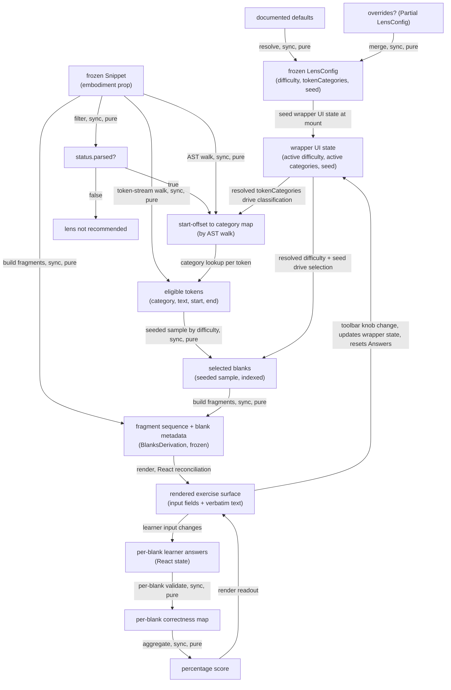

# blanks — Architecture & Decisions

## Why this module exists

`lenses/blanks/` is a single lens-module implementation under the lenses peer
(see [`../README.md`](../README.md) and [`../DOCS.md`](../DOCS.md)). It turns a
frozen [`Snippet`](../../embody/types.ts) into a **fill-in-the-blank** exercise:
selected token positions in the source are replaced by input fields the learner
types into, scored against the original token text.

See [`./README.md`](./README.md) for the public contract (LensModule fields,
config shape, ubiquitous language, UI structure, validation rule).

## Architectural sketch

> Written Phase 0, before implementation. The Refactor step in Phase 1 is held
> against this sketch — not what the code does, but what shape it takes.

### Execution phases

1. **Resolve config** (sync, pure) — apply documented defaults to any caller
   overrides; preserve unknown fields. Input: optional partial config bundle.
   Output: a frozen `LensConfig` with `difficulty`, `tokenCategories`, and
   (when supplied) `seed` settled.

2. **Filter applicability** (sync, pure) — read the embodiment's
   parse-status flag. Tier-2 gate: the lens is applicable when the AST and
   raw token stream exist. Input: embodiment. Output: boolean.

3. **Derive display + blanks** (sync, pure) — four sub-steps composing
   two input-stream walks (the "two-pass" constraint, per § Structural
   constraints) plus the downstream selection and interleaving:
   - **Classify** (AST walk) — walk the embodiment's AST. For each
     eligible category in the resolved `tokenCategories` set, emit a
     classification entry keyed on the token's start-offset (unique
     per Acorn's token convention), valued by the `TokenCategory`.
     For keywords, the AST node shape gates surface-ability (e.g.
     `else` only when the parent conditional has an alternate branch).
     Input: AST + resolved category set. Output: a
     `Map<number, TokenCategory>` (start-offset → category).
   - **Position** (token-stream walk) — walk the raw token stream
     once. For each token, look up its category in the classifier
     map. Tokens not in the map are skipped. Tokens found yield an
     entry of the carrier shape `{ category, text, start, end }`
     (the `EligibleToken` type in `types.ts` — same shape as `Blank`
     minus `index`). The token gives the authoritative
     position-and-text; the classifier gives the category. Output:
     `ReadonlyArray<EligibleToken>`, source-order preserved.
   - **Select** (seeded sampling) — for each eligible token in
     source-order, draw a deterministic random in `[0, 1)` from the
     seed-derived stream; keep the token as a blank when the draw is
     below `difficulty / 100`. The **`index` field is assigned here**:
     contiguous 0-based, in source-order, across the selected subset.
     Output: `ReadonlyArray<Blank>`.
   - **Build fragments** (single-pass interleaving) — walk
     `embodiment.source.code` and the selected-blanks list together,
     emitting `text` fragments for non-blank stretches and `blank`
     fragments at each selected range. The per-blank `answer` is
     duplicated into each `blank` fragment for self-contained
     wrapper render. Output: `BlanksDerivation` (frozen
     `{ fragments, blanks }`), ready for the wrapper.

4. **Render exercise surface** (React reconciliation) — the wrapper
   maps the fragment sequence into `` (text) / `<input>` (blank)
   elements inside the root `
`. The toolbar
   renders the difficulty slider, category checkboxes, and score
   readout. No derivation or validation logic in the JSX; the toolbar
   widgets' interactivity triggers Phase 4.5 via wrapper state.

5. **Re-derive on toolbar change** (sync, pure, per-knob-change) —
   when the learner moves the difficulty slider or toggles a category
   checkbox, the wrapper's React state updates and Phase 3 re-runs
   with the new args. **Learner-answer state is reset to empty** on
   re-derivation: the new blanks have different positions / indices /
   answers, so the previous per-blank inputs do not meaningfully map.
   The wrapper-held seed remains stable across these re-derivations
   (per-mount seed; see § Structural constraints) — same
   `(snippet, tokenCategories, difficulty, seed)` inputs always
   produce the same blanks. The re-derivation is keystroke-cheap;
   no debounce in v1.

6. **Validate learner answers** (sync, pure, per-input-change) — the
   per-blank correctness primitive runs on every learner keystroke
   (per React's re-render cadence). The wrapper looks up the blank's
   answer by index, trims the learner answer, and asks the primitive
   for one of `unfilled` / `correct` / `incorrect`. Pure; no
   wrapper-internal state.

7. **Aggregate score** (sync, pure, wrapper) — the wrapper reduces the
   per-blank correctness map into a percentage for the score readout.
   `0` when there are no blanks; otherwise `Math.round(correctCount /
   blankCount * 100)`.

Phases 1–3 belong to the pure-TS core; phases 4 and 5 belong to the
React wrapper; phases 6–7 are shared (core supplies the per-blank
primitive, wrapper supplies the aggregation and the per-input-change
cadence).

### Data flow

The diagram shows the per-mount data path plus the re-derivation cycle.
The wrapper UI state holds the live values of `difficulty`,
`tokenCategories`, and the resolved `seed`, threaded as parameters into
each derivation sub-step. Toolbar knob changes update wrapper state,
which feeds back through the derivation pipeline and resets the
learner-answer state per § Execution phases step 5. All core phases
(classify / position / select / build-fragments / validate / aggregate)
are synchronous and pure; the wrapper owns the React reconciliation, the
per-mount seed (computed via `useMemo([])` when `config.seed` is unset),
and the learner-input event loop.

### Structural constraints

- **All returned objects are deep-frozen.** `derive-blanks.ts` returns
  a `BlanksDerivation` frozen via `freezeInPlace` before crossing the
  core/wrapper boundary; the LensModule literal in `index.tsx` is
  `freezeInPlace`-d at construction. The `embodiment` and `config`
  parameters are already frozen by upstream (the `embody/` contract
  and the wrapper's `config()` call respectively) — the lens relies
  on these upstream guarantees and does not re-freeze its inputs.
- **Two-pass derivation is load-bearing.** Single-pass AST-only
  classification cannot place tokens like `else`, `extends`, `of`,
  `case`, `default`, `catch`, `finally`, `in`, `instanceof` — those
  are AST-implicit but token-stream-present. The two-pass split keeps
  classification logic AST-driven (the lens decides what's surfaceable
  by the parent node's shape) while delegating positioning to the
  authoritative token stream.
- **Contiguous 0-based blank indices.** `BlanksDerivation.blanks[i].index
  === i` for every `i`, and `blanks.length` equals the count of
  `kind: 'blank'` fragments. The Select sub-step is the canonical
  index-assignment site; downstream phases (Phase 6 validation, Phase 7
  score aggregation, the wrapper's `data-blank-index` rendering) all
  rely on this invariant for the by-index lookup.
- **Seeded selection is deterministic, wrapper-randomized by default.**
  The core's selection function is pure: same `(embodiment, difficulty,
  tokenCategories, seed)` produces the same blanks every call. The
  wrapper computes a fresh per-mount seed at first render when the
  educator has not pinned one in `config.seed`, so each mount produces
  a fresh exercise without the core ever consulting the clock.
- **Re-derivation resets learner answers.** When the toolbar's
  difficulty slider or category checkboxes change, the wrapper
  re-derives blanks and resets the learner-answer state to empty
  (per Phase 5). Preserving answers across re-derivation would map
  prior text into blanks whose category, position, and answer have
  changed — pedagogically incoherent. Reset is the v1 contract.
- **`data-lens="blanks"` on the wrapper's root element.** Lenses-peer
  invariant. Sandbox harnesses and per-lens CSS rules depend on this
  attribute; renaming it is a contract change.
- **`data-blanks-toolbar`, `data-blanks-display`,
  `data-blank-index="N"`.** Sandbox-harness selectors for the toolbar,
  the display surface, and each blank input respectively. Same
  contract-change rule.
- **Read-only display surface.** Non-blank characters render as
  static `` / text-node children inside a `<pre><code>`; only
  the `<input>` blanks accept learner edits. Preserves the lenses
  peer's single-writer invariant.
- **Per-input-change validation.** No debounce in v1. The per-blank
  primitive is `trim` + strict-equal, cheap enough to run on every
  keystroke even with 30+ blanks. If a future profiling pass shows
  bottleneck (very long snippets), debounce lands as a wrapper-internal
  optimization, not a contract change.

### Out of scope

- **Snippet mutation.** Editor's job (per the lenses peer's
  single-writer invariant). Lenses are read-only views.
- **Cross-mount state persistence.** Disposable practice
  (per `../README.md` § Conventions). Learner answers exist only
  between mount and unmount; the LMS owns longer-lived state.
- **Operator-equivalence relaxation.** Strict equality only in v1;
  `==` vs `===`, `&&` vs `&` are distinct answers. See
  [`./README.md` § Future direction](./README.md#future-direction).
- **Hints panel.** Commented out in the prior art, intentionally
  not migrated for v1. See [`./README.md` § Future direction].
- **`recommend()` substance.** Returns `[]` for v1; Block-Model
  placement contributions land once WS2's analysis pipeline ships.
  See [`./README.md` § Tier classification + Block Model placement].
- **CodeMirror integration.** The prior art used a writable CM
  instance; V2 uses a static `<pre><code>` + `<input>`s. The editor
  mode IS the unblanked-source affordance.
- **Async setup.** The lens is fully synchronous — no script loading,
  no module fetch, no `React.lazy`. Same simplification as
  [`../debug-props/`](../debug-props/).
- **Prior-art feature drops.** See
  [`./README.md` § What this lens does NOT do](./README.md) for the full
  catalogue (`__` placeholder convention, URL config sync, "ask me"
  button, hints panel, complete-code view toggle, external
  `blankenate.js` script load, embedded CodeMirror).

## Module ownership

- `README.md` — public contract: LensModule fields, glossary, UI
  structure, validation rule.
- `DOCS.md` — this file: architectural sketch, structural constraints,
  out-of-scope.
- `types.ts` — lens-local types (`TokenCategory`, `EligibleToken`,
  `Blank`, `DisplayFragment`, `BlanksDerivation`, `Correctness`,
  `BlanksLensConfig`).
- `core.ts` — exposes `config`, `applicableTo`, `recommend` for
  assembly into the LensModule literal in `index.tsx`. No React imports.
- `derive-blanks.ts` — pure two-pass derivation (classify + position) +
  seeded selection + fragment build.
- `validate-answer.ts` — pure per-blank correctness primitive.
- `index.tsx` — React wrapper: assembles the LensModule literal, owns
  per-mount UI state, renders the surface.
- `tests/derive-blanks.test.ts` — vitest, no jsdom; covers classify +
  position + select + build-fragments per ZOMBIES.
- `tests/validate-answer.test.ts` — vitest, no jsdom; covers per-blank
  correctness primitive per ZOMBIES.
- `tests/core.test.ts` — vitest, no jsdom; covers `config`,
  `applicableTo`, `recommend` per ZOMBIES.
- `tests/component.test.tsx` — vitest + jsdom + @testing-library/react;
  covers wrapper render, knob interactions, re-derivation reset.
