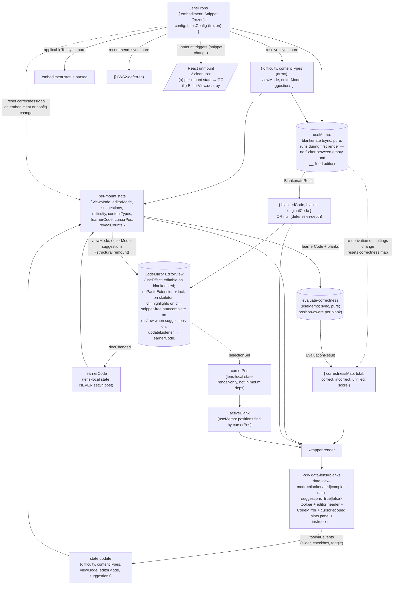

# blanks — Architecture & Decisions

## Why this module exists

The `blanks` lens is the learner's **fill-in-the-blank workbench**: a place to
read a snippet with selected tokens replaced by length-matched `_` placeholders
inside a CodeMirror editor, type the missing tokens, and get per-blank
correctness feedback (green / red / yellow) as they go. A difficulty slider
scales the exercise across the novice → review spectrum (`p = difficulty / 100`
per eligible token); five content-type checkboxes scope which token categories
are eligible (keywords / identifiers / operators / literals / delimiters); a
view-mode toggle gives the learner a peek at the complete source for self-check
without losing their answers.

The Ask Me / `socratizing/` surface is **not** part of this lens. Socratic study
lives at the SL orchestrator one layer up (it operates on the original
embodiment, not on the blankenated source — so it belongs cross-lens, not
per-lens).

It is the **second migrated pedagogical lens** in WS4's batch (after
`annotate`). The previous V2 sprint shipped structurally-compliant shells that
satisfied the `LensModule` contract and passed all tests + AR cycles, but
**never opened in a browser as a learner** — real pedagogical features
(CodeMirror with length-matched `_` placeholders, AST-based blankenate, hints
panel, per-blank feedback, content-type filters, view-mode toggle) were absent.
The user called those shells "weak hallucinations." This redo
deletes them and migrates the legacy `BlanksLens.jsx` faithfully — starting from
a mechanical conversion of the legacy algorithm and extending the token coverage
as V2-owned work — treating the Sandbox Checkpoint as a gate not a celebration.

## Migration

The pre-refactor lens lived at
`zz--oldd-clauding-and-context-dump/0--study-lenses--it-begins/src/lenses/BlanksLens.jsx`
(914 lines, Preact) and consumed the vendored
`public/static/blanks/blankenate.js` (297 lines) via runtime `<script>` tag
loading. The V2 redo preserves the **pedagogical surface** (the algorithm, the
toolbar, the hints panel, the view-mode toggle) while replacing structural
pieces:

- `<script>` tag loading → ESM imports
- Preact `useColorize` / `useApp` contexts → `embodiment` + `config` props
- Legacy `askOpenEnded` chain → `socratizing/` module
- `URLManager` global static class → **dropped entirely** (config comes only
  from the educator's `config` prop; no URL persistence)
- Buggy substring-based evaluation → position-aware
  `lib/evaluate-correctness.ts`
- Compiled-out hints panel (`{false && showHints && (...)}`) → ships gated on the
  `suggestions` toggle, with cursor-scoped on-demand positional reveals
- Compiled-out editor header (`{/* ... */}`) → **enabled by default**

See `./README.md` § "What this lens does NOT do" for the full lens-specific drop
list, and the handoff plan at
`~/.claude/plans/you-re-picking-up-handoff-zazzy-ullman.md` for the
session-level decisions and audit trail.

## Modules

| File                                  | Layer   | Purpose                                                                                                                                                                           |
| ------------------------------------- | ------- | --------------------------------------------------------------------------------------------------------------------------------------------------------------------------------- |
| `index.tsx`                           | wrapper | React `Component`; owns per-mount UI state; composes the core                                                                                                                     |
| `core.ts`                             | core    | `LensModule` defaults — `config`, `applicableTo`, `recommend`                                                                                                                     |
| `lib/blankenate.ts`                   | core    | Walks the parsed AST + token stream, rolls a per-token probability, returns blanked source + blank descriptors. Mechanical JS→TS baseline + V2-owned token-coverage augmentations |
| `lib/no-paste-extension.ts`           | core    | **Vendored** — CodeMirror extension blocking keyboard and context-menu paste                                                                                                      |
| `lib/evaluate-correctness.ts`         | core    | Position-aware per-blank correctness; fixes the legacy's two substring bugs                                                                                                       |
| `../lib/snippet-free-autocomplete.ts` | shared  | Completion source the wrapper wires in `diff` / `raw` mode when `suggestions` is on: JS keywords + in-buffer identifiers, no snippet templates                                    |
| `types.ts`                            | shared  | `Blank`, `BlankType`, `BlankenateResult`, `ContentType`, `ViewMode`, `EditorMode`, `BlankCorrectness`, `CorrectnessMap`, `EvaluationResult`, `BlanksLensConfig`                   |

Default export of `index.tsx` is the frozen `LensModule` record. The core
subsystems under `lib/` are internal; only `index.tsx` and (where applicable)
`core.ts` import them. The `lib/` subdirectory is eslint-ignored per
`eslint.config.mjs` § Global ignores — preserves the legacy file's style without
fighting lint; refactoring to idiomatic V2 style is a deliberate follow-up.
Tests target each subsystem in isolation (vitest, no jsdom) plus the wrapper
end-to-end (jsdom + `@testing-library/react`); tests live under `tests/` (NOT
`lib/tests/`) and ARE linted — they're V2-owned code, not vendored.

## Architectural sketch

> Written Phase 0, before implementation. The Refactor step of each increment is
> held against this sketch. Domain terms only — no function names, no variable
> names, no pseudocode (React hook names like `useState` / `useEffect` are
> acceptable as structural-mechanism references).

### Execution phases

1. **Mount + resolve config** (sync, pure) — orchestrator passes a frozen
   embodiment and a frozen lens config via props. The wrapper reads five known
   config fields (difficulty, content types, view mode, editor mode,
   suggestions) with documented defaults; other fields are preserved but
   ignored. The content-type config is an array of category names; the wrapper
   derives a boolean-map internal representation from it on render (no exported
   type — wrapper-internal only). Initial per-mount state at mount: view mode,
   editor mode, and suggestions seeded from config; learner code is empty
   (filled on first edit); correctness map is empty (populated when the learner
   types into a blank position).

2. **Derive blanks** (sync, pure, per-render-conditional) — the wrapper memoizes
   the blankenate call on the embodiment, difficulty, and content-type-flags
   inputs. The call is synchronous. Note: the parse-success gate at
   `applicableTo` is already satisfied; `blankenate` re-parses internally rather
   than consuming `embodiment.raw.ast` (legacy carry-over — the mechanical
   baseline parsed its own input). Two parses happen on every re-derive —
   consuming the upstream AST directly is on the Future direction list. Result
   shape per `BlankenateResult` (in `types.ts`) on success; `null` on internal
   parse failure (defense-in-depth — in production `applicableTo` gates this
   case out). The first paint already shows length-matched `_` placeholders (Inc
   6.7: `_`.repeat(original.length) — one underscore per character of the
   original token, preserving the token's width as a recognition-cue) — no
   flicker between an empty editor and a populated one. Re-derivation on
   settings change resets the correctness map; the wrapper does NOT preserve
   correctness across re-rolls.

3. **Wire CodeMirror** (per-mount, async-setup) — a mount effect instantiates
   the editor view configured with the standard JavaScript basicSetup, the
   codebase's editor theme, an editability flag driven by view mode, an update
   listener that mirrors learner edits into local state, the no-paste extension
   (in blankenated mode only), and **a `buildLockExtensions` bundle** that adds
   two CodeMirror primitives: (a) an `EditorState.transactionFilter` enforcing
   the fixed-width fillable- field UX — typing at any position inside a blank
   OVERWRITES the char there (whether `_` or a previously-typed char); backspace
   replaces the char- before-cursor with `_`; **directional compaction on `_`
   deletes** — when the deleted char is itself a `_`, the freed space is moved
   to the side opposite to the editing motion (backspace pads `_` at blank end +
   shifts right-text left; Del pads `_` at blank front + shifts left-text
   right); out-of-blank edits and replace-with-selection operations are
   rejected; and (b) a `StateField<DecorationSet>` that re-derives each blank's
   correctness class per transaction from the doc content vs `blank.original`
   (`cm-blank-correct` / `cm-blank-incorrect` / `cm-blank-unfilled`) — see
   `blanks.css` for the per-class styling. The update listener fires only when
   the document changed AND view mode is blankenated; it **never** calls the
   orchestrator's snippet setter — learner answers stay lens-local per the
   single-writer invariant. The editor view is recreated on structural changes —
   view-mode flip, editor-mode flip, blank-set re-derive, or `suggestions`
   toggle (parity with legacy lines 310–338; see § Why recreate on toggle below).
   The `skeleton` mode wires `buildLockExtensions`; `diff` mode wires
   `buildDiffDecorations` (char-level mismatch highlighting, free editing); `raw`
   mode wires neither. When `suggestions` is on, `diff` / `raw` additionally wire
   the snippet-free autocomplete completion source (not `skeleton` — its
   fixed-width overwrite lock conflicts with variable-length completions).
   Learner answers are **preserved** across the view-mode and `suggestions`
   toggles (both re-read the learner-code ref on remount): when toggling to
   `'complete'` the editor mounts on `embodiment.source.code` (read-only, no
   `_`); when toggling back to `'blankenated'` the editor mounts on
   `learnerCode` (the in-progress edits) or, on first-toggle-back, on
   `blankedCode` from the memoized blankenate result. The editor-mode toggle, by
   contrast, **resets** the exercise (clears learner code + reveal-counts).

4. **Evaluate correctness** (per learner edit, sync, pure) — a `useMemo` keyed
   on `(learnerCode, blankResult)` calls
   `evaluateCorrectness(currentDoc, blanks, originalCode)` where
   `currentDoc = learnerCode ?? blankResult.blankedCode`. The evaluator returns
   `EvaluationResult` (`correctnessMap` + counts + score); surfaces the score in
   the JSX, and the StateField in `buildLockExtensions` derives the per-blank
   in-editor visual class (`cm-blank-correct/incorrect/unfilled`) from the same
   source-of-truth (doc content vs `blank.original`). `useMemo` (not
   `useEffect`): synchronous-pure computation belongs in the render pass so the
   score updates atomically with the learner's keystroke — no stale-score
   flicker frame. Position-aware: each blank's `{start, end}` from
   `blankenate`'s output anchors a per-position match against the learner's
   typed text. Fixes the legacy's two bugs (substring-containment false
   positive; multi-blank-same-word tracking).

5. **Render** (sync) — the wrapper emits the root
   `
`
   with toolbar, editor header, CodeMirror container, and the cursor-scoped hints
   panel. The hints panel renders only when `suggestions` is on AND
   `viewMode === 'blankenated'` AND `editorMode === 'skeleton'`. The
   `data-suggestions` attribute reflects the `suggestions` state directly
   (orthogonal to difficulty).

6. **Handle interaction** (per learner event) — per-control handlers update the
   relevant local state slice (`difficulty`, `contentTypes`, `viewMode`,
   `editorMode`, `suggestions`). There is no persistence side-effect: the new
   state drives the next render (and, for the structural slices, an editor
   remount) — nothing is written outside the component. Config lives only in the
   `config` prop (read once on mount) and in per-mount React state thereafter.

7. **Unmount** (React-driven) — orchestrator unmounts when the snippet changes
   or the learner exits the lens. Per-mount state is garbage-collected with the
   component instance. Two cleanup obligations fire: (a) React GCs the per-mount
   state, (b) the CodeMirror editor view destroys via its own cleanup. Each is
   the responsibility of the effect that registered the resource; the lens MUST
   NOT leak any past unmount.

### Data flow

The diagram is per-mount. The orchestrator (upstream) supplies `embodiment` and
`config`; the recommender (sibling) calls `applicableTo` and `recommend`. The
render loop reads state + the memoized blankenate result; the event handlers
feed state updates back through their respective hooks. **There is no cross-mount
persistence** — config is read from the `config` prop on mount, and learner
answers, blanks, and the correctness map all die with the component instance.

### Structural constraints

- **Two-layer module shape** — `core.ts` + the three subsystem files under
  `lib/` do NOT `import React from 'react'`. `lib/no-paste-extension.ts` imports
  `@codemirror/*` (a third-party library whose extension type is React-free);
  `lib/blankenate.ts` imports `acorn`; `lib/evaluate-correctness.ts` is pure TS.
  `index.tsx` is the only file with React imports. Tests split:
  `tests/blankenate.test.ts`, `tests/no-paste-extension.test.ts`,
  `tests/evaluate-correctness.test.ts`, `tests/core.test.ts` (no jsdom) +
  `tests/component.test.tsx` (jsdom). Per the lenses peer's
  [§ Structural constraints](../DOCS.md#structural-constraints).
- **`embodiment` parameter name** in core signatures. Every core function that
  takes a `Snippet` calls it `embodiment`, not `snippet`, not
  `props.embodiment`. Per the lenses-peer invariant.
- **`data-lens="blanks"` on the wrapper's root element.** Load-bearing for
  sandbox-harness selectors. Per the lenses peer's invariant.
- **`data-view-mode="blankenated|complete"` and
  `data-suggestions="true|false"`** on the root. Sandbox-harness selectors + CSS
  hooks. Values reflect committed config state, not in-flight transitions; CSS
  transitions should anchor on the parent. The editor mode is surfaced not on the
  root but on the toolbar buttons (`data-editor-mode-toggle="skeleton|diff|raw"`,
  `aria-pressed` marking the active one).
- **Token-classification precedence (blankenate).** The algorithm runs four
  classification paths in fixed order over the parsed source — (1) delimiters
  token-stream walk, (2) keywords token-stream walk, (3) AST walk for
  identifiers / literals / operators / template-content, (4) AST walk for the
  generator-`*` delimiter (Acorn's `tokTypes.star` token covers both generator
  `*` and arithmetic `a * b`, so generator `*` is classified by AST context
  rather than by token label, and arithmetic `*` stays under the
  `BinaryExpression` operators path). The four paths dedupe `[start, end)`
  collisions first-push-wins. The call order is structural, not stylistic:
  reordering silently re-classifies overlap-prone tokens (`typeof` is both a
  keyword and a unary operator; `null` / `true` / `false` are both keywords and
  `Literal` nodes; `*` requires AST context to disambiguate generator vs
  arithmetic). Tests at `tests/blankenate.test.ts` § "Inc 6.k — comprehensive
  token coverage" and "Inc 6.l — gap closures from the sandbox comprehensive
  snippet" encode the expected taxonomy; the call order is the constraint that
  produces it.
- **Tier-2 classification.** The contract per [`../types.ts`](../types.ts):
  `applicableTo` is the recommender's cheap gate; `recommend` only fires on
  applicable lenses. This lens honors that contract by returning
  `embodiment.status.parsed` for `applicableTo`. The vendored `blankenate`
  re-parses internally (it doesn't consume `embodiment.raw.ast`), so a parse
  failure inside the vendor's call path is defense-in-depth — `applicableTo`
  should have prevented the mount.
- **`recommend()`'s signature is locked at
  `(embodiment) => ReadonlyArray<Recommendation>`.** The v1 body returns the
  empty array; the WS2 follow-up replaces the body in place. The mermaid `Recs`
  terminal node represents the surface shape, not the current empty
  implementation.
- **LensModule defaults return deep-frozen values.** `config()` returns a
  `freezeInPlace`-frozen `LensConfig`; `recommend()` returns a module-level
  frozen-empty-array constant (no per-call allocation); `applicableTo()` returns
  a primitive (boolean — frozen by virtue of being a primitive). Per the
  codebase's `freezeInPlace`/`cloneAndFreeze` convention (AGENTS.md § Deep
  Freeze Return Values).
- **Position semantics.** Blank positions are zero-indexed half-open intervals
  `[start, end)` into the original source — the convention the vendored
  `blankenate` produces. The position-aware evaluator honors the same
  convention. Drift in this contract is silent and bug-producing; the test suite
  includes inter-file fixtures asserting `blankenate`'s output is consumable by
  `evaluate-correctness` without coordinate translation.
- **Cleanup obligations.** Unmount triggers two distinct cleanups: (a) React GCs
  the per-mount state, (b) CodeMirror's editor view destroys via its own cleanup.
  Each is the responsibility of the effect that registered the resource; the lens
  MUST NOT leak any past unmount. Structural state changes (view-mode toggle,
  editor-mode toggle, blank-set re-derive, `suggestions` toggle) additionally
  trigger an editor-view destroy-and-recreate cycle (the wrapper does not
  dynamically reconfigure editability per legacy parity; the dynamic-reconfigure
  optimization is on § Future direction).
- **First-paint invariant.** Blanks derivation is synchronous-during-
  first-render — the wrapper never paints an empty editor followed by a
  `__`-filled re-render. The memoized `blankenate` call runs during the same
  render pass that mounts the editor view, with the result feeding the editor's
  initial document.
- **Toggle-preserves-answers invariant.** The view-mode toggle handler updates
  only `viewMode`; `learnerCode` is untouched. Tested at the wrapper level
  (mount → type into a blank → toggle complete → toggle blankenated → assert the
  typed text is still there).
- **CodeMirror writes to local state, never to `setSnippet`.** The wrapper's
  `updateListener` mirrors learner edits into local `learnerCode` state only.
  The orchestrator's `setSnippet` is the editor's job; the lens is a read-only
  view per the lenses-peer single-writer invariant. Tested at the wrapper level
  by asserting the orchestrator-provided `embodiment.source.code` is unchanged
  after a learner edit.
- **Read-only views.** The lens never mutates `embodiment` or `config` (both
  deep-frozen anyway).
- **Disposable practice.** No `localStorage`, no module-level cache, no refs
  across mounts for learner answers / blanks / correctness. There is no
  cross-mount persistence at all — config arrives via the `config` prop each
  mount.
- **No consumer-side branching on `embodiment.source.code`.** The lens _renders_
  `source.code` (legitimate per the lenses-peer invariant) but does not use it
  as a discriminator. Branches on `embodiment.status.parsed` for the
  defense-in-depth fallback; branches on `config` fields for
  view-default / editor-mode / suggestions.
- **LensModule surface stays synchronous.** `config()`, `applicableTo()`,
  `recommend()` are sync. There is no async work inside this lens — blankenate
  is sync; evaluate is sync. Per the lenses peer's
  [§ Structural constraints](../DOCS.md#structural-constraints).
- **Display content is rendered safely.** The CodeMirror editor renders source
  code via its own document model (never `dangerouslySetInnerHTML`). Hints panel
  renders blank `original` values as plain text inside React elements — strings
  from `embodiment.source.code` are framework-escaped.
- **No URL config sync.** Config comes only from the educator's `config` prop;
  the lens reads no URL parameter, writes none, and registers no `hashchange`
  listener. If config-in-URL is wanted later it belongs to the orchestrator's URL
  surface, with this lens still reading the resolved values through `config` (see
  § Future direction).
- **Vendored `lib/` is eslint-ignored.** The carve-out for
  `lenses/blanks/lib/**` lives in `eslint.config.mjs`; matches the existing
  `sl-trace-js-aran-legacy` precedent. The trade: vendored legacy code preserves
  the working algorithm in-tree without fighting style rules; refactoring to V2
  style is a deliberate follow-up.

### Out of scope

- **Cross-mount persistence of any kind.** No state persists across mounts —
  learner answers, blanks, correctness, and config alike. Config is re-read from
  the `config` prop each mount; everything else is per-mount React state. Per the
  disposable-practice principle.
- **Snippet mutation / editing.** Editor's job; the lens is read-only. The
  wrapper's CodeMirror in blankenated mode is editable for the learner's typing,
  but those edits write to local state only — never to the orchestrator's
  `setSnippet`.
- **Code execution / run / trace.** Other lenses' jobs (`trace-table`, future
  `run`); the orchestrator's L1 picker exposes them.
- **Socratic study companion (Ask Me / socratizing).** Lives in the SL
  orchestrator one layer up — operates on the original embodiment rather than
  the blankenated source, so it's cross-lens rather than per-lens.
- **Seeded RNG for reproducible blank sets.** v1 preserves the legacy's bare
  `Math.random()` per the mechanical-conversion mandate.
  Reproducibility-via-seed is deferred (see § Future direction).
- **Per-blank inline highlight in the editor.** v1 shows per-blank state in the
  side panel only. A future CodeMirror `Decoration.mark` at each `{start, end}`
  lets the learner see green/red/yellow at the position they're typing.
- **Error-state UI beyond the parse-fail fallback.** The wrapper renders a
  single fallback panel when `blankenate` returns `null` (defense-in-depth).
  Other failure modes degrade silently with default behavior: a malformed
  `config` field falls back to the wrapper default for that field; an evaluator
  throw is treated as "all blanks unfilled" rather than surfacing an error
  banner.
- **Multi-language support.** v1 ships JavaScript-only since the package is
  `just-enough/javascript`; multi-language is a multi-embodiment-type concern
  that `embody/` would surface, not a lens-level concern.
- **Adaptive difficulty / item-response-theory scaling.** v1 ships the manual
  slider; algorithmic difficulty adjustment based on learner performance is its
  own arc, not a v1 concern.

## Why preserve learner answers across view-mode toggle

The lens preserves learner answers across the view-mode toggle because the
toggle's pedagogical purpose is "peek at the original to verify what I just
typed" — the self-check use case the legacy designed for. Clearing answers on
toggle would punish that use case (in-progress work lost on an accidental
click). The disposable-practice principle governs **unmount semantics** (answers
vanish when the lens unmounts), not within-mount toggle semantics; within one
mount, answers live in React state for the lifetime of the component. (AR-1
decision lock; the early-Phase-0 design that diverged toward clear-on-toggle was
caught and reversed.)

## Why per-blank feedback ships on, hints panel ships behind `suggestions`

The legacy compiled the hints panel out (`{false && showHints && (...)}` at
line 672) but the design and styling exist in full (lines 670–864). v1 splits
the two affordances the legacy conflated:

- **Per-blank correctness feedback** (green/red/yellow) ships **enabled** in
  `skeleton` mode because **visible per-blank state is load-bearing for a
  self-pacing exercise** — without it, the learner has to guess whether they've
  answered correctly until they manually toggle to complete-view. Disabling it in
  legacy was a ship cut, not a design decision; the lens-shipping-shells failure
  mode the redo exists to prevent (per [`./README.md`](./README.md) § Why this
  lens exists) is exactly what disabled feedback recreates.
- **The hints panel** (on-demand letter reveals) ships **off by default**, gated
  on the opt-in `suggestions` toggle. It is help-on-request, not always-on
  feedback — so it stays out of the way until the learner asks for it.

The per-blank green/red/yellow visual lives in the editor itself (a
correctness-aware decoration class on a CodeMirror `StateField`). The hints
panel is a **separate affordance** for cursor-scoped on-demand hint reveals: the
learner clicks a button to reveal one more letter, shown at its actual position
in the blank they're focused on (not-yet-revealed positions stay as `•`).

## Why hints are orthogonal to difficulty

An earlier design (now reversed) auto-derived a 3-tier hints config from the
difficulty slider — high difficulty → easy/full-reveal panel; low difficulty →
score-only. User-directed redesign rejected this coupling on pedagogical
grounds: **the learner, not the slider, should control scaffolding**. The 3-tier
system implicitly conflated "how hard is the exercise" with "how much help is
offered"; the user's intent is that those be independent so a learner can grind
through a hard exercise without scaffolding (or get help on an easy one if
stuck). Help is now a single `suggestions` boolean (default off); when on in
`skeleton` mode it surfaces the hints panel, and the learner chooses how many
positions to reveal as their own scaffolding gradient. The `suggestions` toggle
is independent of the difficulty slider.

## Why drop the seeded RNG

The vendored `blankenate` uses bare `Math.random()` per token (legacy behavior).
Adding a seeded RNG would be a behavioral change to the vendored algorithm — the
user's locked mechanical-conversion mandate forbids that. v1 preserves the
per-token chaos; the trade-off is that blanks re-roll on settings change (the
learner sees a fresh set on every slider drag). The
preserve-answers-across-toggle decision mitigates the visible regression:
re-rolled blanks aren't learner- confusing because the learner's answers persist
across any view-mode toggle that exposed them.

The path to reproducibility-via-seed that keeps the vendor mechanical is a
Future direction item: inject `random: () => number` at the call-site so the
wrapper supplies the seeded PRNG when an educator pins a `seed` config field;
the vendor stays a one-line edit (replacing `Math.random()` with `random()`).

Seeded RNG is on the [Future direction](./README.md#future-direction) list with
a path that keeps the vendor mechanical: inject `random: () => number` at the
call-site so the wrapper supplies the seeded PRNG when an educator pins a `seed`
config field.

## Why position-aware evaluation is in scope (vs. "mechanical migration")

The legacy's `evaluateExercise` (lines 394–448) has two confirmed bugs:
substring containment false-positives (`"function"` matches `"functionX"`);
multi-blank-same-word tracking failures (two blanks of the same token are both
marked correct if the token appears once). These are pedagogical defects, not
algorithm-design choices — a learner whose `"function"` blank is satisfied by
the unrelated `functionPriority` identifier in scope is getting incorrect
feedback.

`lib/evaluate-correctness.ts` is **new code in V2**, not a vendored conversion.
The position-aware approach (each blank's `{start, end}` from `blankenate`'s
output anchors a per-position match against the learner's typed text) directly
fixes both bugs. This is in scope as "faithful migration" because:

- The legacy's intent was per-blank correctness — the bugs are implementation
  failures of that intent, not design decisions.
- The vendored algorithm gives us the position information directly
  (`blanks[i].start`, `blanks[i].end`); using that information is cheap.
- Shipping with the legacy's bugs would be hostile to learners (and visible at
  the Sandbox Checkpoint).

## Why drop URL config sync (vs. vendoring URLManager)

The legacy `urlManager.js` (296 lines) is a full URL coordination class —
file-path management, multi-lens cascade, code-share via base64, pseudocode
toggles, colorize toggles, etc. An earlier V2 iteration slimmed it to a ~60-line
`lib/url-config.ts` adapter that persisted the blanks config in the `?blanks=...`
URL parameter. The redesign drops URL config sync entirely: config now comes ONLY
from the educator's `config` prop, resolved through `core.ts`'s `config()`
defaults. There is no `?blanks=...` parameter, no read-on-mount, no debounced
write, no `hashchange` listener, and no `lib/url-config.ts`.

URL coordination (shareable / reloadable exercise settings) is properly
orchestrator-domain; if it lands later it belongs to the orchestrator's URL-state
surface, with this lens still reading the resolved values through its `config`
prop (see § Future direction).

## Module ownership

The lens owns its own `README.md`, `DOCS.md`, `types.ts`, source (`core.ts`,
`lib/blankenate.ts`, `lib/no-paste-extension.ts`, `lib/evaluate-correctness.ts`,
`index.tsx`), and tests. Cross-cutting lens conventions (two-layer split,
`data-lens` invariant, `LensConfig` shape, no-source-code-branching anti-pattern,
disposable-practice) live in [`../README.md`](../README.md) +
[`../DOCS.md`](../DOCS.md); this lens inherits them.

## Future direction

See [`./README.md` § Future direction](./README.md#future-direction) for the
full follow-up list. Key directions in scope of this lens's evolution:

- **WS2 `recommend()` heuristics** — populate Block-Model placements with
  snippet-fit relevance once WS2's analysis surface lands.
- **Per-blank position-aware learner-input re-anchoring** — CodeMirror
  `Decoration.mark` per blank so non-placeholder edits don't corrupt position
  tracking.
- **Seeded RNG** — inject `random: () => number` at the call-site so the vendor
  stays mechanical; wrapper supplies a seeded PRNG when `seed` is configured.
- **Per-blank inline highlight in the editor** — `Decoration.mark` for
  green/red/yellow at the typing position.
- **Orchestrator-owned config persistence** — if config-in-URL (shareable /
  reloadable settings) is wanted, the orchestrator owns the URL surface and this
  lens keeps reading config through its `config` prop (post-WS3). No lens-side
  URL wiring.
- **Internal-EventBus dispatch** — `blank-filled`, `view-toggled`,
  `difficulty-changed` events for picker UI feedback and LMS bridging (WS3 F5).
