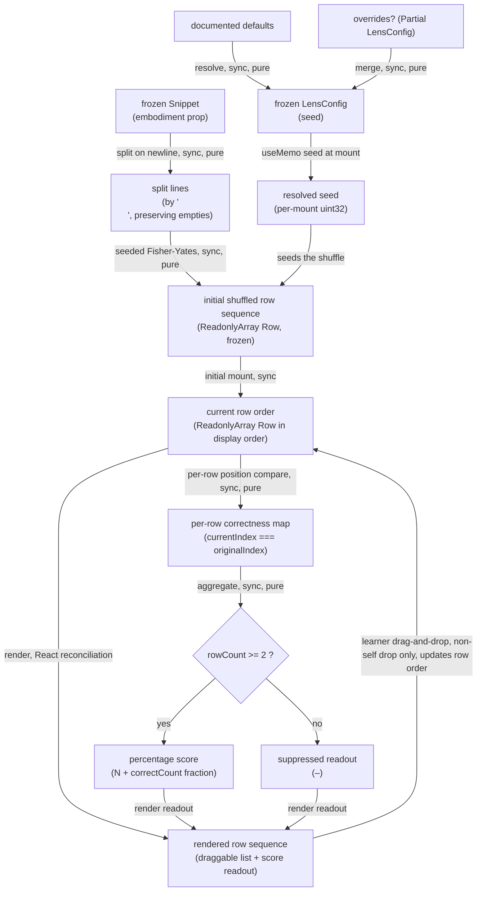

# parsons — Architecture & Decisions

## Why this module exists

`lenses/parsons/` is a single lens-module implementation under the lenses
peer (see [`../README.md`](../README.md) and [`../DOCS.md`](../DOCS.md)).
It turns a frozen [`Snippet`](../../embody/types.ts) into a
**drag-and-drop line-ordering** exercise: source lines are shuffled
deterministically; the learner drags them back into order.

See [`./README.md`](./README.md) for the public contract (LensModule
fields, config shape, ubiquitous language, UI structure, validation
rule).

## Architectural sketch

> Written Phase 0, before implementation. The Refactor step in Phase 1
> is held against this sketch — not what the code does, but what shape
> it takes.

### Execution phases

1. **Resolve config** (sync, pure) — apply documented defaults to any
   caller overrides; preserve unknown fields. Input: optional partial
   config bundle. Output: frozen `LensConfig` with `seed` settled (when
   pinned).

2. **Filter applicability** (sync, pure) — always returns `true`.
   **Tier 1** per [`../README.md`](../README.md) § Three-tier
   classification: line ordering needs only the source string.

3. **Split + shuffle** (sync, pure) — split
   `embodiment.source.code` on `\n` into lines; assign each line its
   `originalIndex` index; run a seeded Fisher-Yates permutation on
   the row list. A snippet with 0 or 1 lines is passed through as-is
   (no meaningful shuffle). Output: `ReadonlyArray<Row>` in shuffled
   order.

4. **Render row stack + derive correctness + aggregate score** (React
   reconciliation, sync, pure derivation in the render body) — the
   wrapper holds the current row order as `ReadonlyArray<Row>` in
   display order. It maps the array to `<li data-parsons-row
   draggable>` elements inside `<ol data-parsons-stack>`, computing
   each row's correctness inline as `currentIndex === originalIndex`
   (where `currentIndex` is the row's position in the displayed
   array — derived, never stored). The score readout
   `<output data-parsons-score>` reflects the aggregation: when
   `rowCount < 2`, it is **suppressed** (renders as `–`); otherwise
   it renders as `"N% (k/N)"` where `N = Math.round(correctCount /
   rowCount * 100)` and `k = correctCount`. v1 ships no toolbar
   (no difficulty slider, no category checkboxes, no reset button).
   React reconciliation drives the readout swap; no separate state
   machine in the readout.

5. **Reorder on drag-and-drop** (per-drop, wrapper state) — when the
   learner drops a dragged row at a non-self position, the wrapper
   produces a new frozen `ReadonlyArray<Row>` by removing the
   dragged row from its source position and inserting at the drop
   position; reference identity for non-moved `Row` values is
   preserved. A drop where source position equals drop position is
   a no-op (no `setState`, no re-render). The new ordering
   re-renders via React's reconciliation; Phase 4's inline
   correctness derivation reflects the new positions automatically.

Phases 1–3 belong to the pure-TS core; phases 4–5 belong to the React
wrapper. Per-row correctness comparison and score aggregation are
single-expression derivations in Phase 4's render body, not standalone
structural phases — the comparison is `currentIndex === originalIndex`
(integers, sync, pure) and the aggregation is a count + integer
arithmetic.

### Data flow

The shuffle runs once at mount with the resolved seed; subsequent
reorderings are `RowOrder` state mutations (new frozen arrays with
preserved reference identity for non-moved rows), not re-shuffles.
All core phases are synchronous and pure; the wrapper owns React
reconciliation and the drag-and-drop event loop. The score readout
branches on `rowCount >= 2` per the suppression rule
(see Phase 4).

### Structural constraints

- **All returned objects are deep-frozen.** `shuffle.ts` returns a
  `ReadonlyArray<Row>` frozen via `freezeInPlace` before crossing the
  core/wrapper boundary; the LensModule literal in `index.tsx` is
  `freezeInPlace`-d at construction. The `embodiment` and `config`
  parameters are already frozen by upstream (the `embody/` contract
  and the wrapper's `config()` call respectively).
- **Wrapper row-order state is `ReadonlyArray<Row>` in display order.**
  React's `useState` cell holds the current row sequence as a frozen
  array; `currentIndex` is the row's position in that array, derived
  not stored. Drag-drop produces a new frozen array (splice-and-
  reinsert); `Row` reference identity for non-moved entries is
  preserved so React's reconciler can short-circuit per-row renders.
- **No-op drag-drop is a true no-op.** A drop where source position
  equals drop position skips `setState` entirely (no re-render, no
  reference-identity churn). This is the v1 contract for the
  drag-drop handler.
- **Deterministic shuffle.** The core's `shuffle` function is pure:
  same `(source, seed)` produces the same row sequence every call.
  The wrapper computes a fresh per-mount seed at first render when
  the educator has not pinned one in `config.seed`, so each mount
  produces a fresh exercise.
- **Row identity by `originalIndex`.** Each row carries an
  immutable `originalIndex` (its 0-based index in the unshuffled
  source). The wrapper uses this as the React key, the drag-and-
  drop identifier, and the correctness comparison target.
- **`data-lens="parsons"` on the wrapper's root element.** Lenses-
  peer invariant. Sandbox harnesses and per-lens CSS rules depend
  on this attribute; renaming it is a contract change.
- **`data-parsons-score`, `data-parsons-stack`,
  `data-parsons-row`, `data-row-original-index="N"`.** Sandbox-
  harness selectors. Same contract-change rule.
- **Read-only display surface.** Lines render as static `<li>`
  contents; learner interaction is reorder-only (drag-and-drop). The
  lens never modifies the line text. Preserves the lenses peer's
  single-writer invariant.
- **Per-drop correctness recomputation.** Score updates on every
  reorder via React's re-render cadence; no debounce. The per-row
  primitive is a single integer comparison.

### Out of scope

- **Snippet mutation.** Editor's job (per the lenses peer's
  single-writer invariant). Lenses are read-only views.
- **Cross-mount state persistence.** Disposable practice
  (per `../README.md` § Conventions). Row order exists only between
  mount and unmount.
- **Distractor injection.** The legacy `parsonizer` library supported
  injecting plausible-wrong lines into the shuffle. V2 ships without;
  see [`./README.md` § Future direction](./README.md#future-direction).
- **Syntax highlighting.** Prior art used Prism. V2 renders rows as
  plain `` text; deferred.
- **Trace / diff variants.** WC-kit `parsons-trace` and `parsons-diff`
  sub-variants are out of scope; each would be a separate lens (or
  config-variant) follow-up.
- **`recommend()` substance.** Returns `[]` for v1; Block-Model
  placement contributions land once WS2's analysis pipeline ships.
- **Keyboard reordering.** HTML5 `draggable` does not support
  arrow-key / space-bar reordering. v1 ships mouse-only — **a
  known v1 a11y gap** per `./README.md` § Known v1 limitations.
  Follow-up via the WAI-ARIA Listbox pattern.
- **Touch-device support.** Native `draggable` is unreliable on
  touch devices. v1 ships desktop-only — **a known v1 limitation**
  per `./README.md` § Known v1 limitations.
- **Toolbar / reset button.** v1 has no toolbar; orchestrator-level
  remount serves as the de-facto reset (toggle lens, edit snippet
  → fresh shuffle).
- **Async setup.** Lens is fully synchronous — no script loading,
  no module fetch, no `React.lazy`.
- **Iframe / jQuery / `JSParsons`.** The legacy lens delegated to a
  standalone HTML page hosting `JSParsons` (jQuery + `parsonizer`)
  via an `iframe`. v1 is pure React + HTML5 drag-and-drop; no
  iframe, no jQuery, no external drag library. This is structurally
  load-bearing: removing the iframe is why the lens can participate
  in React reconciliation and own its state directly.
- **Multi-language syntax highlighting.** Prism / `prism-react-
  renderer` colorization is deferred (see `./README.md` § Future
  direction). When syntax highlighting lands, JS-first coloring
  matches the JEJ scope.
- **Prior-art feature drops.** See
  [`./README.md` § What this lens does NOT do](./README.md) for the
  full catalogue (distractor lines, trace/diff variants).

## Module ownership

- `README.md` — public contract: LensModule fields, glossary, UI
  structure, validation rule.
- `DOCS.md` — this file: architectural sketch, structural constraints,
  out-of-scope.
- `types.ts` — lens-local types (`Row`, `Correctness`,
  `ParsonsLensConfig`).
- `core.ts` — exposes `config`, `applicableTo`, `recommend` for
  assembly into the LensModule literal in `index.tsx`. No React imports.
- `shuffle.ts` — pure: splits source by `\n`, runs seeded Fisher-
  Yates, returns the initial shuffled row sequence.
- `index.tsx` — React wrapper: assembles the LensModule literal,
  owns per-mount UI state (seed + current row order), handles drag-
  and-drop, renders the toolbar + draggable row stack.
- `tests/shuffle.test.ts` — vitest, no jsdom; covers split + seeded
  Fisher-Yates per ZOMBIES.
- `tests/core.test.ts` — vitest, no jsdom; covers `config`,
  `applicableTo`, `recommend` per ZOMBIES.
- `tests/component.test.tsx` — vitest + jsdom + @testing-library/
  react; covers wrapper render, drag-and-drop reorder, score
  aggregation.
