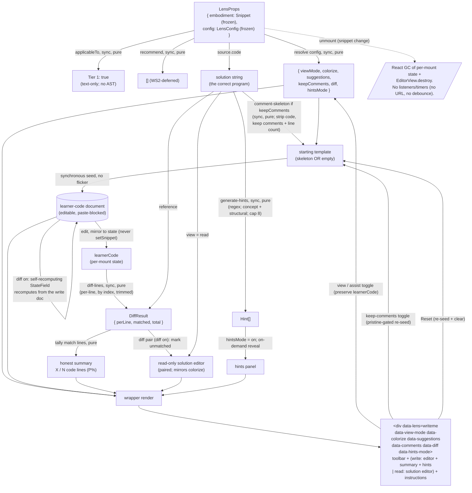

# writeme — Architecture & Decisions

## Why this module exists

The `writeme` lens is the learner's **reproduction workbench**: a place to type
a program back from memory into a paste-blocked CodeMirror editor, with an
optional comment skeleton as scaffolding, a per-line diff that highlights where
the learner's code diverges from the solution, and an honest Check that reports
how many code lines have been reproduced. It is the furthest point on the
recognition → recall spectrum among the migrated lenses: `parsons` orders given
lines, `blanks` fills given holes, `writeme` reproduces the whole program.
`blanks` is in effect a more heavily scaffolded `writeme`, and `writeme` shares
its `diff` feedback toggle (adapted from the `blanks` editor-mode ladder to a
whole-line, single-boolean form).

It is a migrated pedagogical lens in the WS4 batch. A previous V2 sprint shipped
structurally-compliant lens _shells_ that satisfied the `LensModule` contract
and passed tests + AR cycles but **never worked in a browser as a learner** —
"weak hallucinations" lacking the real pedagogy. Those shells were reverted.
This redo migrates the legacy `WritemeLens.jsx` faithfully — preserving its
pedagogical surface (paste-blocked write editor, comment-skeleton scaffolding,
solution reference, hints, reset) while replacing structural pieces and the one
pedagogically-broken piece (the gameable "progress" score) — and treats the
Sandbox Checkpoint as a gate, not a celebration.

## Migration

The pre-refactor lens lived at
`zz--oldd-clauding-and-context-dump/0--study-lenses--it-begins/src/lenses/WritemeLens.jsx`
(875 lines, Preact) with `WritemeLens.module.css`. The V2 redo preserves the
**pedagogical surface** while replacing structural pieces:

- Preact `useApp` / `useColorize` contexts → `embodiment` + `config` props
  (`useColorize` was vestigial in the legacy — imported but unused)
- imperative `setTimeout(…, 50/100)` + retry editor wiring → a `useEffect` mount
  with a synchronous initial seed
- reading the imperative editor document during render (`getStudentValue()` in
  JSX, which made the legacy's line/char counts + comparison panel stale) →
  mirroring edits into React state via the CodeMirror `updateListener`
- the two byte-identical inline comment-skeleton generators → one pure
  `lib/comment-skeleton.ts`
- the gameable concept-count + length-ratio "progress" score (≥85% = "complete")
  → an honest per-line diff + a `X / N code lines` Check (see
  [Why the honest line-count replaces the legacy score](#why-the-honest-line-count-replaces-the-legacy-score))
- the legacy's duplicate solution render (a read-only editor + a `<pre>`
  comparison grid) → a single read-only solution editor **paired** with the
  write editor (mirrors colorize; the diff pair when diff is on; the comparison
  grid dropped — see
  [Why Read is the paired solution editor](#why-read-is-the-paired-solution-editor))
- the `?writeme=…` URL config → dropped (no URL surface in v1)

The legacy had no feedback toggle; writeme adopts a single `diff` boolean —
distilled from the `blanks` lens's editor-mode concept down to one on/off
feedback toggle, not the full `diff` / `raw` ladder. See `./README.md` § "What
this lens does NOT do" for the full lens-specific drop list, and
`~/.claude/plans/migrate-the-writeme-temporal-bentley.md` for the session-level
decisions and audit trail.

## Modules

| File                        | Layer   | Purpose                                                                                                        |
| --------------------------- | ------- | -------------------------------------------------------------------------------------------------------------- |
| `index.tsx`                 | wrapper | React `Component`; owns per-mount UI state; mounts CodeMirror + the diff decoration field; composes the core   |
| `core.ts`                   | core    | `LensModule` defaults — `config`, `applicableTo` (Tier 1), `recommend`                                         |
| `lib/no-paste-extension.ts` | core    | **Vendored** — CodeMirror extension blocking keyboard (`Mod-v`) + context-menu paste                           |
| `lib/comment-skeleton.ts`   | core    | **Ported & de-duplicated** — solution → comment-only skeleton (executable code stripped; line count preserved) |
| `lib/diff-lines.ts`         | core    | **New** — per-line `LineStatus` verdicts + code-line tallies (`matched` / `total`); powers diff visual + Check |
| `lib/generate-hints.ts`     | core    | **Ported** — regex concept + structural hints from the solution, capped at 8                                   |
| `types.ts`                  | shared  | `ViewMode`, `HintsMode`, `HintType`, `Hint`, `LineStatus`, `DiffResult`, `WritemeLensConfig`                   |

Default export of `index.tsx` is the frozen `LensModule` record. The core
subsystems under `lib/` are internal; only `index.tsx` (and where applicable
`core.ts`) import them. The `lib/` subdirectory is eslint-ignored per
`eslint.config.mjs` § Global ignores — the vendored files preserve the legacy's
style as a deliberate trade against the mechanical-conversion mandate (the
vendored `no-paste-extension.ts` from a standalone legacy file; the ported
`comment-skeleton.ts` + `generate-hints.ts` from inline legacy component
helpers), and the new file (`diff-lines.ts`) shares the carve-out for
WIP-duration consistency with the blanks/parsons precedent. Tests target each
subsystem in isolation (vitest, no jsdom) plus the wrapper end-to-end (jsdom +
`@testing-library/react`); tests live under `tests/` (NOT `lib/tests/`).

## Architectural sketch

> Written Phase 0, before implementation. The Refactor step of each increment is
> held against this sketch. Domain terms only — no function names, no variable
> names, no pseudocode (React hook names like `useState` / `useEffect` /
> `useMemo` are acceptable as structural-mechanism references).

### Execution phases

1. **Mount + resolve config** (sync, pure) — the orchestrator passes a frozen
   embodiment and a frozen lens config via props. The wrapper reads the known
   config fields (view mode; the four scaffold toggles colorize / suggestions /
   keep-comments / diff; hints mode) with documented defaults; other fields are
   preserved but ignored. Initial per-mount state: view mode, the four toggles,
   and hints mode seeded from config; the learner's code seeded from the
   starting template; the check summary empty; the revealed-hint set empty.

2. **Derive the starting template** (sync, pure) — when keep-comments is on, the
   wrapper computes the comment skeleton of the solution (executable code
   stripped; comments, blank lines, and line count preserved); when off, the
   template is the empty string. Computed synchronously so the editor's first
   paint already shows the template — no empty-then-filled flicker.

3. **Wire the write editor** (mount-once, imperative) — a mount effect
   instantiates the CodeMirror view seeded with the starting template (or the
   in-progress learner code, read from a ref so the seed reflects prior edits),
   configured editable, with the paste-block extension attached **always**
   (every editable state), an update listener that mirrors learner edits into
   local state, and a colorize / suggestions / diff compartment each holding its
   extension (or nothing). The editor mounts **once** (mount-effect deps `[]`);
   scaffold toggles live-reconfigure their compartment (colorize / suggestions /
   diff) and the comments re-seed dispatches a document change — nothing
   remounts. Per-keystroke learner-code updates flow through the listener into
   state and cannot re-fire the mount effect (deps `[]`), so the view is never
   destroyed mid-typing.

4. **Diff the learner's code** (per edit, sync, pure) — a memoized per-line diff
   compares the learner's code to the solution line-by-line, by index, compared
   trimmed: each solution line resolves to match / diff / empty / comment, and
   the code lines are tallied (matched, total). The result drives the diff
   decorations (when diff is on) and the honest Check summary.

5. **Render** (sync) — the wrapper emits the root
   `
`
   with the toolbar; in write view the CodeMirror editor + the check summary +
   the on-demand hints panel; in read view the **read-only solution editor**
   (paired with the write editor — mirrors colorize, shows the diff pair when
   on); and the instructions accordion in both.

6. **Handle interaction** (per learner event) — the view toggle and the four
   Assist scaffold toggles update their state slice and **preserve learner
   code** (toggles via compartment reconfigure / doc-change dispatch, never a
   remount); the keep-comments toggle re-seeds the editor only while it is
   pristine (otherwise it updates the hint set + the Reset template, leaving the
   editor untouched); the hints toggle gates rendering (preserving revealed
   ids); Check computes and shows the honest summary; Reset re-seeds to the
   current template and clears the check summary + revealed hints; a hint-reveal
   adds an id to the revealed set.

7. **Unmount** (React-driven) — the orchestrator unmounts on snippet change or
   lens exit. Per-mount state is garbage-collected with the component instance;
   the CodeMirror view destroys via its effect cleanup. There are **no**
   listeners or timers to clean up (no URL surface, no debounce) — a simpler
   teardown than blanks.

### Data flow

The diagram is per-mount. The orchestrator (upstream) supplies `embodiment` and
`config`; the recommender (sibling) calls `applicableTo` and `recommend`. The
render loop reads state + the solution + the memoized diff; the toolbar handlers
feed state updates back. **There is no cross-mount persistence** — learner code,
the check summary, and revealed hints die with the component instance (no URL
state in v1).

### Structural constraints

- **Two-layer module shape** — `core.ts` + the files under `lib/` do NOT
  `import React`. `lib/no-paste-extension.ts` imports `@codemirror/*` (a
  third-party library whose extension type is React-free); the other lib files
  are pure TS over strings. `index.tsx` is the only file with React imports.
  Tests split per file (no jsdom) + `tests/component.test.tsx` (jsdom). Per the
  lenses peer's [§ Structural constraints](../DOCS.md#structural-constraints).
- **`embodiment` parameter name** in core signatures (lenses-peer invariant).
- **`data-lens="writeme"` on the wrapper's root.** Load-bearing for
  sandbox-harness selectors. Per the lenses-peer invariant.
- **`data-view-mode`, `data-colorize`, `data-suggestions`, `data-comments`,
  `data-diff`, `data-hints-mode`** on the root — sandbox-harness selectors + CSS
  hooks; renaming any is a contract change. Values reflect committed state.
- **Tier 1 classification.** `applicableTo` returns `true` — writeme reproduces
  text and needs no AST and no parse success. A **deliberate divergence** from
  `blanks` (Tier 2, `status.parsed`). Suitability (a snippet long enough to be
  worth retyping) is the recommender's concern; until WS2 the lens is offered
  for any snippet. **No defense-in-depth fallback panel** — `source.code` is
  always a string, so there is no failure mode to gate on (a divergence from
  `blanks`'s parse-fail fallback).
- **`recommend()`'s signature is locked at
  `(embodiment) => ReadonlyArray<Recommendation>`.** The v1 body returns `[]`;
  the WS2 follow-up replaces the body in place.
- **LensModule defaults return deep-frozen values.** `config()` returns a frozen
  `LensConfig`; `recommend()` returns a module-level frozen-empty-array
  constant; `applicableTo()` returns a primitive. Per the codebase's
  `freezeInPlace` / `cloneAndFreeze` convention (AGENTS.md § Deep Freeze Return
  Values).
- **`SerializableValue` discipline.** `WritemeLensConfig` fields are primitives
  only (`viewMode`, `colorize`, `suggestions`, `keepComments`, `diff`,
  `hintsMode`). Domain values (`Hint`, `DiffResult`, `LineStatus`) are runtime
  structures, never stored in `LensConfig`.
- **Per-line diff is by index, trimmed.** Learner line `i` vs solution line `i`,
  compared trimmed. The comment skeleton preserves the solution's line count, so
  index alignment holds while the learner fills lines in place. Code lines (text
  with comments stripped is non-empty) are graded; comment lines are excluded
  from the Check total. An empty (unattempted) code line is left NEUTRAL in the
  diff visual — only `diff` (typed-but-wrong) lines are highlighted.
- **Honest Check.** The summary reports `matched / total` over code lines, with
  no "complete" / "done" claim; `total === 0` (no code lines) is vacuously
  complete (no `NaN`). See
  [Why the honest line-count replaces the legacy score](#why-the-honest-line-count-replaces-the-legacy-score).
- **Diff decorations are line decorations.** The diff visual is a
  `Decoration.line` per `diff`-status line, anchored zero-width at the line
  start (CodeMirror rejects a non-empty line-decoration range). This is net-new
  code, NOT an adaptation of the `blanks` char-range `Decoration.mark` diff
  (whose per-character model works only because `blanks`'s blanked source is
  length-matched to the original). The correct-lines-highlighted behavior is
  verified at the browser checkpoint (jsdom cannot exercise CodeMirror layout).
- **Paste blocked whenever the editor is editable** (regardless of the `diff`
  toggle) — a divergence from `blanks`, which permits paste in its diff mode
  because its placeholders are position-locked. writeme has no anchors, so a
  paste would smuggle in the whole solution. See
  [Why paste is blocked in diff too](#why-paste-is-blocked-in-diff-too).
- **First-paint invariant.** The starting template is computed synchronously
  during the render that mounts the editor; the editor's initial document is the
  template, never an empty editor followed by a re-seed.
- **Toggle semantics.** The view toggle and the four Assist scaffold toggles
  update only their state slice; `learnerCode` is untouched — each toggle is a
  compartment reconfigure or a doc-change dispatch over one free-form document,
  never a remount (see
  [Why toggling a scaffold preserves learner code](#why-toggling-a-scaffold-preserves-learner-code)).
  The keep-comments toggle re-seeds only while the editor is pristine (see
  [Why keep-comments re-seeds only while pristine](#why-keep-comments-re-seeds-only-while-pristine));
  Reset re-seeds and clears feedback. Tested at the wrapper level.
- **Mount-once + compartments.** The CodeMirror editor mounts exactly once
  (mount-effect deps `[]`). The four scaffold toggles never remount it: colorize
  / suggestions / diff each live-reconfigure a CodeMirror `Compartment` via
  `view.dispatch({ effects: compartment.reconfigure(...) })`, and the comments
  toggle and Reset dispatch a document change. The constant base (line numbers,
  history, selection, the JavaScript language, the `oneDark` theme, editable,
  the update-listener, the paste-block) never reconfigures. This makes the [I1]
  preserve-learner-code invariant structural rather than disciplinary — no value
  can re-fire the mount effect. See § Why scaffold toggles use compartments.
- **Mount-once + pristine predicate (anti-regression).** The CodeMirror mount
  effect's dependencies are `[]` — the editor mounts exactly once and never
  remounts. Scaffold toggles reconfigure compartments (colorize / suggestions /
  diff), and the comments toggle / Reset dispatch document changes; none of
  these re-run the mount effect. `learnerCode` is mirrored into a ref and read
  at mount time so it seeds the initial document only; it MUST NOT appear in the
  mount-effect deps (a per-keystroke remount would destroy the view mid-typing —
  the `blanks` remount regression, here structurally impossible because deps are
  `[]`). The pristine predicate is pure:
  `learnerCode === '' || learnerCode === templateFor(keepComments-before-toggle)`,
  evaluated against the flag value BEFORE the toggle flips (evaluating it after
  the flip would mis-read a skeleton-showing editor as non-pristine and revive
  the legacy dead-checkbox bug). See
  [Why keep-comments re-seeds only while pristine](#why-keep-comments-re-seeds-only-while-pristine).
- **CodeMirror writes to local state, never to `setSnippet`.** The
  `updateListener` mirrors learner edits into local `learnerCode` only;
  `embodiment.source.code` is unchanged. Per the lenses-peer single-writer
  invariant.
- **Read-only views.** The lens never mutates `embodiment` or `config` (both
  deep-frozen anyway).
- **Disposable practice.** No `localStorage`, no module-level cache, no refs
  across mounts. **No URL state in v1** — a deliberate divergence from blanks.
- **No consumer-side branching on `embodiment.source.code`.** The lens renders
  `source.code` (the solution) and diffs the learner's text against it
  (legitimate consumption) but does not use it as a behavior discriminator.
- **LensModule surface stays synchronous.** `config()`, `applicableTo()`,
  `recommend()` are sync; comment-skeleton, diff-lines, and generate-hints are
  all sync-pure.
- **Display content rendered safely.** Both CodeMirror editors render via their
  own document model (the write editor the learner text, the read editor
  `source.code`); never `dangerouslySetInnerHTML`.

### Out of scope

- **Cross-mount persistence** of learner code / check / hints. Per-mount React
  state only; nothing survives unmount.
- **URL state.** v1 ships none. A Future-direction item; would lift to the
  orchestrator per the blanks precedent. **Deliberate divergence from blanks.**
- **Snippet mutation / editing.** The lens is read-only; learner code is
  lens-local and never written back to `setSnippet`.
- **Code execution / run / trace.** Other lenses' jobs.
- **Live (always-visible) line count.** The honest count surfaces on a Check
  click, not per keystroke — the diff highlight is the live signal. (parsons
  defers an analogous live-feedback mode.)
- **Order-insensitive line alignment.** v1 diffs by line index; whole-line
  insertions/deletions shift alignment (a visible drift signal). LCS-based
  alignment is deferred.
- **Character-level intra-line diff.** v1 highlights whole non-matching lines;
  char-level highlighting within a line is deferred (and needs order-insensitive
  alignment first).
- **Cursor-scoped hints.** v1 ships the legacy's generic generated hints; the
  `blanks` cursor-scoped model is deferred.
- **Seeded / reproducible exercises.** No randomness in v1; not applicable.
- **Multi-language support.** v1 is JavaScript-only (the package is
  `just-enough/javascript`); multi-language is an `embody/` concern.

## Why scaffold toggles use compartments

The four scaffold toggles (colorize / suggestions / comments / diff) each swap
an editor extension on or off. The naive implementation — list the toggle states
in the mount-effect deps and rebuild the `EditorView` on every change —
multiplies the very remount surface the [I1] anti-regression invariant exists to
shrink, and on each toggle it discards the learner's cursor, scroll, and undo
history (the document survives only because it is re-seeded from a ref). Caching
one pre-built editor per toggle combination is worse: four independent toggles
are sixteen combinations, and every switch would have to hand-copy the document,
cursor, and history into the target instance or they desync.

CodeMirror's `Compartment` is the purpose-built tool. The editor mounts **once**
(mount-effect deps `[]`); each toggle is a
`view.dispatch({ effects: compartment.reconfigure(ext) })` that swaps just the
one affected extension live. The document, cursor, selection, scroll, and undo
history are preserved automatically — nothing to cache, nothing to sync. Because
deps are `[]`, no reactive value can re-fire the mount effect, so the
per-keystroke-remount regression is not merely avoided but structurally
impossible.

Layout: a constant base (line numbers, history, selection, default / history /
completion keymaps, the `oneDark` theme, the JavaScript language, editable, the
update-listener, the paste-block) plus three compartments — colorize (the
`oneDark` highlight style or nothing), suggestions (the snippet-free
autocomplete extension or nothing), and diff (the `Decoration.line` field or
nothing). The comments toggle and Reset are document-change dispatches, not
compartment reconfigures. writeme is the repo's first compartment user (`blanks`
destroy/recreates its editor on mode change); this is the precedent.

## Why default the editor to diff

The `diff` toggle defaults ON (feedback on), not off. A feedback-off default is
a feedback-free box — the precise shape of the weak-shell failure this redo
exists to prevent (per `./README.md` § Why this lens exists). Defaulting `diff`
on makes the honest-feedback mechanism visible on first paint: the learner sees
the lens working, and the diff guides their reconstruction. This mirrors the
`blanks` redo's decision to ship its hints panel enabled-by-default rather than
compiled-out (see [`../blanks/DOCS.md`](../blanks/DOCS.md) § Why ship the hints
panel enabled by default — "the lens-shipping-shells failure mode the redo
exists to prevent is exactly what disabled feedback recreates"). Turning `diff`
off remains one click away for learners who want a pure-recall challenge — the
dial exists, but its default points at honest feedback.

## Why Read is the paired solution editor

The read view shows the solution in a **read-only editor configured to match the
write editor** — a pair — not the learner's code beside it. The learner's typed
code is never shown in Read; only the solution (mirroring `colorize`, and, when
`diff` is on, the solution lines the learner has not yet matched — progress
markers, not the learner's code). Write and Read stay **mutually exclusive while
typing**: the learner never types with the solution in view. The loop is **read
→ remember → type**: study the solution in Read (the diff-pair markers focus
what is still missing), return to Write, and reproduce it from memory.

This is the synthesis of two earlier decisions. First, an even earlier plan had
a read-mode "your code | solution" side-by-side comparison; that was dropped (a
comparison surface lets the learner _transcribe_ rather than _recall_) — and the
learner's code is still never shown in Read. Then the read view was briefly a
plain `<pre>` (zero CodeMirror); that is now reversed, because **colorize and
the diff pair need a real CodeMirror surface** to mirror the write editor's
highlighting and carry line decorations — a `<pre>` cannot. The read editor is
read-only (`EditorState.readOnly` + `EditorView.editable.of(false)`), carries no
update-listener, and never writes `learnerCode`, so it stays a study surface,
not a second editing surface. (The legacy rendered the solution twice — a
read-only editor plus a duplicate comparison grid; V2 keeps a single read-only
solution editor and drops the grid.)

## Why the honest line-count replaces the legacy score

The legacy `checkProgress` (legacy lines 405–473) computed an `overallProgress`
that averaged a regex-concept-presence count (how many of ~10 patterns —
`function`, `if`, `for`, `return`, … — appear in the learner's text vs the
original) with a length ratio (`learnerLines / originalLines`), and declared the
exercise "complete" at ≥ 85%. That metric is **gameable**: a learner can type
the right keywords at roughly the right line count and reach "complete" without
writing working — or even sensible — code. Shipping a feedback signal that
rewards the appearance of work over the substance of it is exactly the
weak-pedagogy failure this redo targets.

V2 replaces it with a measurement, not a verdict: the Check reports
`X / N code lines reproduced`, where `X` is the number of solution code lines
the learner has reproduced exactly (trimmed) and `N` is the total number of code
lines. This is honest because it counts the literal thing the exercise asks for
(reproduce the code), it cannot be gamed by keyword-stuffing (a line either
matches or it doesn't), and it makes no mastery claim — `N / N` means "you
reproduced every line," not "you have mastered this." Comment lines are excluded
from `N` because the comment skeleton seeds them, so counting them would start
the score non-zero before the learner has typed anything (a different flavor of
the same dishonesty). This is the faithful-migration posture: decline a
documented pedagogical defect, the same way `blanks` declined its
substring-evaluation bug and `parsons` declined its `first_error_only` gate.

## Why per-line (not per-char) diff

The `blanks` diff highlights per-character mismatches, which works only because
its blanked source is **length-matched** to the original (each blanked token is
replaced by an equal-length run of `_`), so character offset `i` in the
learner's document corresponds to offset `i` in the original. writeme's starting
template is the comment skeleton, which is **not** character-length-matched to
the solution (executable code is stripped to empty or to a comment) — so a
positional character diff would misalign the moment the learner starts typing.

The comment skeleton **does** preserve line count (every solution line maps to
one template line). So writeme diffs by **line index**: learner line `i` vs
solution line `i`, compared trimmed. This holds while the learner fills lines in
place. If the learner inserts or deletes whole lines, the index alignment shifts
and downstream lines flag as differing — surfaced as a drift signal, not a
crash. Order-insensitive (LCS-based) alignment is a Future direction; index
alignment is the v1 that the skeleton's line-count invariant makes correct for
the common case.

## Why keep-comments re-seeds only while pristine

The keep-comments toggle selects the starting template (comment skeleton vs
blank slate). The question is what it does mid-exercise. The legacy guarded its
student-editor seed effect with `studentEditorInitialized` (legacy lines 194 /
269), so toggling Keep Comments after typing began did **not** re-seed the
editor — it only changed hint generation and what a subsequent Reset would
produce. The checkbox felt dead once the learner started typing.

Two failure modes bound the design: a dead control (the legacy) is confusing; an
unconditional live re-seed silently discards in-progress work on a single
checkbox click (destructive, and the lowest-friction control to trigger by
accident). v1 takes the middle path: **re-seed only while the editor is
pristine** (empty, or still equal to the current template — i.e. the learner has
not yet diverged). Concretely, pristine is the pure predicate
`learnerCode === '' || learnerCode === templateFor(keepComments-before-toggle)`
— "current template" is the template for the flag's value BEFORE it flips, so an
editor still showing the skeleton reads as pristine when the learner unchecks
Keep Comments (and re-seeds to empty); evaluating it against the post-flip value
would mis-read it as non-pristine and revive the legacy dead-checkbox bug. A
learner who typed then cleared back to empty is also pristine (the `=== ''`
clause), so a toggle then re-seeds onto the empty canvas — intended. Before the
learner types, the toggle applies immediately (the common case — "I want a blank
slate / I want the comments"). Once they have typed divergent code, the toggle
updates the hint set and the Reset template but leaves the editor untouched, and
the toolbar surfaces "Reset to apply." The learner's work is never silently
discarded; only the explicit Reset clears the editor. This is a deliberate
behavior change from the legacy's guarded non-re-seed, chosen to make the
control work without the destructive surprise — documented in `./README.md` §
"What this lens does NOT do."

## Why toggling a scaffold preserves learner code

Every scaffold toggle — colorize, suggestions, comments, diff — leaves the
learner's typed code, cursor, and history intact, because none of them remounts
the editor. The editor mounts once (mount-effect deps `[]`); colorize /
suggestions / diff each live-reconfigure a CodeMirror `Compartment` and the
comments toggle / Reset dispatch a document change, so the document survives the
toggle automatically (see
[Why scaffold toggles use compartments](#why-scaffold-toggles-use-compartments)).
writeme can do this because it has no per-mode document invariants to honor: all
toggles edit the **same free-form document**, and diff only adds a read-only
decoration overlay — it imposes no structure on the text. This is the divergence
from `blanks`, whose `changeEditorMode` resets learner code on a mode switch
(`setLearnerCode(null)`) because its `helpful` mode carries length-matched
placeholder and anchor-lock invariants that arbitrary free-form text would
corrupt. writeme has no anchors, so its scaffold toggles never reset learner
code — a compartment reconfigure, not a remount-and-reset.

## Why paste is blocked in diff too

`blanks` permits paste in its `diff` mode because its placeholders are
position-locked — a paste cannot smuggle the answer into the locked anchor
regions. writeme has no anchors: the editor is a free-form document and the
whole exercise is to reproduce the solution from memory. Permitting paste in any
editable state would let the learner paste the solution and defeat the exercise
entirely. So writeme blocks paste **regardless of the `diff` toggle** — a
deliberate divergence from `blanks`, justified by the anchor-lock asymmetry.

## Module ownership

The lens owns its own `README.md`, `DOCS.md`, `types.ts`, source (`core.ts`,
`lib/no-paste-extension.ts`, `lib/comment-skeleton.ts`, `lib/diff-lines.ts`,
`lib/generate-hints.ts`, `index.tsx`), and tests. Cross-cutting lens conventions
(two-layer split, `data-lens` invariant, `LensConfig` shape,
no-source-code-branching anti-pattern, disposable-practice) live in
[`../README.md`](../README.md) + [`../DOCS.md`](../DOCS.md); this lens inherits
them.

## Future direction

See [`./README.md` § Future direction](./README.md#future-direction) for the
full list. Key directions in scope of this lens's evolution:

- **WS2 `recommend()` heuristics** — populate Block-Model placements; down-rank
  snippets too short to be worth retyping.
- **Order-insensitive line alignment** — LCS-based diff so whole-line
  insertions/deletions don't cascade misalignment.
- **Character-level intra-line diff** — highlight the differing characters
  within a line (the `blanks` char model), once line alignment is
  order-insensitive.
- **Cursor-scoped hints** — adopt the `blanks` cursor-scoped, incremental-reveal
  hint model in place of the legacy's generic generated hints.
- **URL state lifted to the orchestrator** — persist `viewMode` / `colorize` /
  `suggestions` / `keepComments` / `diff` / `hintsMode` once the orchestrator
  grows a URL surface (per the blanks precedent).
