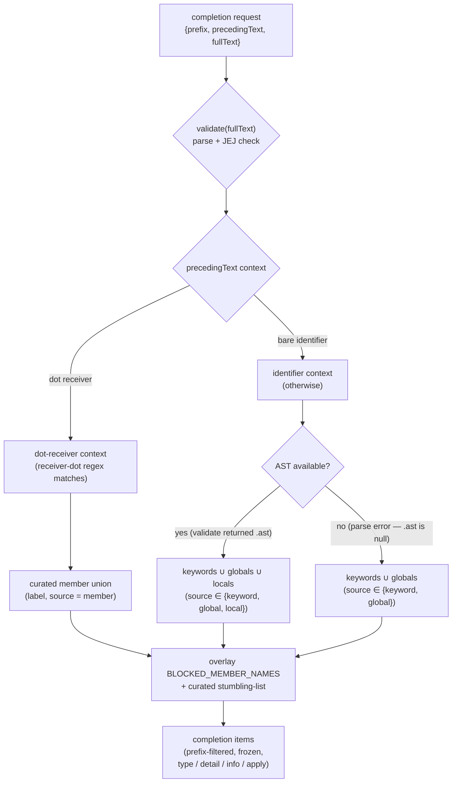

# lib/completing — Architecture & Decisions

## Why this module exists

The editor home base needs a completion source that knows about the
JEJ language level: positively (what can the learner reach for?) and
pedagogically (when the learner reaches for something outside JEJ,
explain why instead of silently filtering). `lib/completing/` is the
adapter that composes the validation feed
([`../../embody/lib/validating/`](../../embody/lib/validating/)) and
scope analysis
([`../../embody/lib/scope/`](../../embody/lib/scope/)) with a curated
stumbling-list of common-mistake tokens into a single
`CompletionCallback` that drives CodeMirror's autocompletion
extension. See [`./README.md`](./README.md) for the domain glossary,
public API, and the rationale for living at the JEJ-package `lib/`
level rather than inside `orchestrate/` or `embody/`.

## Architectural sketch

> Written Phase 0, before implementation. The Refactor step is held
> against this document — not what the code does, but what shape it
> takes.

### Execution phases

1. **Receive** (sync) — the completion callback is invoked with a
   structured `CompletionRequest` (`{prefix, precedingText, fullText}`).
   `prefix` is the bare word fragment. `precedingText` is the
   line-prefix text used for dot-receiver context detection.
   `fullText` is the entire snippet, used by validate + scope. No
   CodeMirror types cross this boundary.

2. **Validate and parse** (sync, throws-free) — the snippet is fed
   to [`validate(code)`](../../embody/lib/validating/validate.ts).
   The returned `BaseResult` carries one of three branches: clean
   (ok, AST present, no rejections), rejected (`!ok` with rejections,
   AST may still be present), or parse-failure (`!ok` with parse
   error, no AST). The completer reads only `.ast` from the result;
   the rejections list belongs to the linter, not here.

3. **Collect JEJ surface** (sync, pure) — dispatch on
   `precedingText` context:
   - **Dot-receiver** (the receiver-dot regex matches): emit
     the curated member-name union as `{label, source: 'member'}`.
     One union for all receivers — no type inference. The regex
     matches `<identifier>.` only; chained access (`x.y().`) misses
     the regex and falls through to the Identifier branch (see
     § Structural constraints).
   - **Identifier** (otherwise): emit the keyword set ∪ JEJ-allowed
     globals (excluding easter eggs) ∪ scope-tree locals collected
     from
     [`buildScope(ast).allDeclarations`](../../embody/lib/scope/build-scope.ts)
     — but **only when AST is present**. Inc B uses the
     `allDeclarations` union (every declaration in every scope of
     the program) rather than cursor-enclosing-scope walking, which
     would require a `cursorOffset` parameter on `CompletionRequest`
     that this sprint does not introduce. Trade-off: over-permissive
     in nested-block scenarios (a learner sees a sibling block's
     local even when not in scope at the cursor) — acceptable for
     JEJ-page-sized snippets where most declarations are top-level.
     Cursor-aware refinement is deferred. Parse-failure code skips
     the locals union and emits keywords + globals only.
   The result is a `readonly Suggestion[]` — each item has a `label`
   and a `source` indicating which sub-collector emitted it.

4. **Mark blocked and freeze** (sync, pure) — overlay the curated
   stumbling-list onto the JEJ-surface in two steps:
   - **(a) For each input suggestion**: if its label appears in the
     stumbling-list, attach the curated `info` to the existing item
     (keep the source-derived `type` — this is the **advisory** case,
     used for JEJ-valid labels with a teaching caveat like `new` and
     `null`). Otherwise pass through with `type` from `source`.
   - **(b) Synthesize blocked items** from a context-dispatched
     source: in **identifier context**, iterate the curated
     stumbling-list (skipping member-only entries like `split` and
     `match` so they don't surface when a learner types `sp`
     expecting a keyword/global); in **dot-receiver context**,
     iterate the validator's
     [`BLOCKED_MEMBER_NAMES`](../../embody/lib/validating/just-enough-js.ts)
     set (so blocked dot names like `.constructor`, `.__proto__`,
     `.call`, plus `.split` and `.match` all surface with
     pedagogical markers), attaching curated `info` from the
     stumbling-list when present. Each synthesized item becomes
     `{label, type: 'blocked', detail: '(not in JEJ)', info?: stumble.info, apply: 'noop'}`.
     This is what makes typing `va` show `var` (a JEJ-blocked label)
     as a blocked completion in identifier context, and `str.con`
     show `constructor` as a blocked completion in dot context —
     in both cases the synthesis adds the label so the pedagogical
     signal can fire, even though neither is in the JEJ surface.

   Then prefix-filter the combined result case-insensitively
   (`label.toLowerCase().startsWith(prefix.toLowerCase())`) and
   deep-freeze the returned array. The freeze happens at the
   orchestrator's return boundary in
   [`complete-jej.ts`](./complete-jej.ts), not inside
   [`mark-blocked.ts`](./mark-blocked.ts).

### Data flow

### Structural constraints

- **No embodiment.** The module reads the validation result without
  constructing a [`Snippet`](../../embody/types.ts), calling
  [`embody()`](../../embody/index.ts), or touching the
  orchestrator's embodiment cache. The lint adapter's F2 boundary
  applies here verbatim.
- **Pure, synchronous, throws-free.** No I/O, no async, no side
  effects. The adapter is pure shape composition. Returned arrays
  are deeply frozen.
- **Each invocation parses independently.** No parse cache, no
  cross-callback parse sharing with the linter. CM debounces both
  callbacks; JEJ snippet size keeps each invocation under budget.
  See [`./README.md`](./README.md) § Conventions for why
  optimization is premature at expected sizes.
- **Blocked is overlay, not filter.** The
  [`mark-blocked.ts`](./mark-blocked.ts) pass adds metadata to
  suggestions; it does not remove them. Filtering would hide the
  pedagogical signal the popup is meant to carry.
- **Easter eggs are suppressed.** `eval` (allowed global),
  `void` (allowed unary), `LabeledStatement`,
  `SequenceExpression`, `WithStatement` (allowed nodes) — none
  appear in the suggestion union. The validator's continued
  permissiveness for these is intentional; the completer's
  withhold-from-suggestions is also intentional. Two layers, two
  policies, same goal: keep the taught surface and the
  reachable-by-typing surface in sync.
- **Chained dot-access is not detected.** The receiver regex
  matches `<identifier>.` only. `str.charAt(0).` falls through to
  the identifier branch (no dot suggestions, keywords + globals +
  locals shown). Documented; revisit if learner complaints surface.
- **No receiver-type inference.** Every dot-context yields the same
  curated member union. A future receiver-aware refinement is out
  of scope; the union is small enough to be pedagogically scannable.

### Out of scope

- **CM popup rendering, sorting, debouncing.** Owned by CodeMirror's
  `autocompletion()` extension and the editing/ factory.
- **AST construction.** Owned by
  [`validate(code)`](../../embody/lib/validating/validate.ts), which
  the linter feed and this adapter both consume.
- **Receiver-type inference for dot-member.** A union-only union;
  typed-receiver completion (e.g. only String methods on string
  receivers) is a future refinement, not this sprint.
- **Caching the scope analysis across keystrokes.** JEJ snippet
  sizes make per-keystroke re-parse acceptable; CM debounces.
- **Dot-receiver chain handling.** Single-level dot only; chains
  (`x.y().z.`) fall through to the identifier branch.
- **Documentation lookup** (hover tooltips). Different callback
  (`docLookup`), different adapter at
  [`../documenting/`](../documenting/).
- **Per-exercise / per-level configurable surfaces.** The
  language-level config is the only language level; per-exercise
  curation is not in scope.

## Decisions

- **Four files, not two.** Unlike
  [`../linting/`](../linting/), which split a 1:1 shape translator
  (`violation-to-diagnostic`) from an outcome dispatcher
  (`lint-jej`), this module has four distinct responsibilities:
  **orchestration** (`complete-jej.ts` — threads phases 1→2→3→4
  and owns the freeze boundary at the return), **JEJ-surface
  collection** (`collect-jej-surface.ts` — phase 3), **blocked
  overlay** (`mark-blocked.ts` — phase 4 mark step), and the
  **curated data table** (`stumbling-list.ts` — no phase; pure
  data consumed by mark). Each source file is independently
  testable; `stumbling-list` is data-only and worth a separate
  file so curated-prose edits don't churn the overlay logic.
- **`types.ts` is present.** Unlike linting and formatting-editor
  (which both skip it), this module owns cross-file JEJ vocabulary
  that belongs in neither the editing-layer's types nor a single
  source file. `Suggestion` is threaded between
  `collect-jej-surface` and `mark-blocked`, so it has to live in a
  shared location. `StumblingEntry` co-locates with it as a
  module-internal type table consumed by the curated-list and
  overlay code.
- **Prefix-filter is case-insensitive.** Comparison is
  `label.toLowerCase().startsWith(prefix.toLowerCase())`. Locked
  at sketch time: typos should not silently gate completion
  (typing `LET` shows `let`). The linter precedent does not
  prefix-filter at all (the linter returns ALL violations); the
  completer filters because popup-population semantics demand it.
- **No adapter-level catch.** The validator has a throws-free
  contract on string input (see
  [`validate.ts`](../../embody/lib/validating/validate.ts) header
  doc). The scope walker accepts an `acorn.Program` AST, not a
  string, and is invoked only when `validate` returned a non-null
  `.ast` — its throws-on-malformed-AST behavior is unreachable
  from this adapter. The composite chain is therefore throws-free
  on string input; the adapter adds no error boundary of its own.
  If `validate` or `buildScope` ever surface throws at the inputs
  this adapter actually feeds them, fix at the source — wrapping
  at the adapter level would either duplicate swallow or hide a
  real regression.
- **No parse-sharing optimization.** Each callback (lint and
  completing) runs its own `validate(code)`. The shared-parse
  optimization is rejected at this scale; if profiling on
  production-sized snippets ever shows it as a hotspot, the right
  layer for the cache is `validate(code)` itself, not the adapter
  layer.
- **`apply: 'noop'` is a string sentinel, not a function.** Keeps
  the JEJ-side adapter CM-blind: the editing/ factory translates
  the sentinel to a `closeCompletion(view)` call when wiring the
  CodeMirror `Completion`. JEJ adapters never see the CodeMirror
  function or import `@codemirror/autocomplete`.
- **`info` is a `string`, lifted to DOM in editing/.** Same
  rationale: JEJ-aware code produces prose; the editor produces
  DOM. The lift happens once, in `build-info-dom.ts` next to the
  existing `build-tooltip-dom.ts` (which lifts hover-doc data).
- **Set-iterable spread is replaced with `Array.from(<Set>)`.** The
  Docusaurus/Babel transpile pipeline mistranspiles `[...<Set>]`
  to a one-element array wrapping the Set (broken in the dev/build
  bundle; correct in vitest, which uses a different transform).
  Three sites use `Array.from(<Set>)` with `eslint-disable-next-line
  unicorn/prefer-spread` so the linter's auto-fix doesn't re-introduce
  the bug: `collect-jej-surface.ts` lines 117 (allowedGlobals) and
  150 (declaredNames-Set), `mark-blocked.ts` line 107 (blockedMembers).
  Array spread (`[...arr1, ...arr2]`) is unaffected — only Set-iterable
  spread mistranspiles. If the bundler is ever migrated off Docusaurus
  (or the root cause is fixed in the Babel preset), audit these three
  sites and revert to spread syntax.
