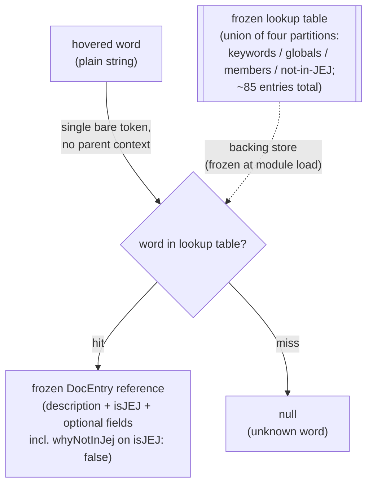

# lib/documenting — Architecture & Decisions

## Why this module exists

The editor home base needs a hover-tooltip data source that knows the JEJ
language level. `lib/documenting/` is the adapter: a curated word→DocEntry table
covering the JEJ surface (keywords, allowed globals, curated member methods)
plus the blocked-stumble set, with full pedagogical entries flagged via
`isJEJ: false` and grounded by a `whyNotInJej` field naming the specific NM
components the feature would extend or reflect over.

This module is also the **single source of truth for non-JEJ documentation**
across the editor. The hover surface (`docLookup`) consumes `DocEntry` entries
directly. The autocomplete surface (`completions`, via
[`../completing/mark-blocked.ts`](../completing/mark-blocked.ts)) sources its
blocked-item content from the same table. Both surfaces show identical
pedagogical material; only the CodeMirror affordance differs.

See [`./README.md`](./README.md) for the domain glossary, public API, voice
rationale, the JEJ-scopes-the-editor-not-the-learner premise, and the
relationship to the completer and reference.md.

## Architectural sketch

> Written Phase 0, before implementation. The Refactor step is held against this
> document — not what the code does, but what shape it takes.

### Execution phases

1. **Receive** (sync) — the callback is invoked with the hovered word as a plain
   string. The editor extracted it from its text model; the JEJ side sees only
   the string. No editor or CodeMirror types cross this boundary.

2. **Lookup** (sync, throws-free per call; load-time assembly throws on
   duplicate keys per § Structural constraints) — a single read against a
   module-level frozen lookup table. The table is the union of four partitions
   of the JEJ surface (the keyword partition, the allowed-global partition, the
   curated-member partition, and the blocked-stumble partition), assembled and
   frozen once at module load. There is no transformation, no dispatch, no
   branching beyond hit/miss.

3. **Return** (sync, frozen) — either a frozen `DocEntry` reference into the
   table (no allocation, no defensive copy) or `null` for unknown words. The
   freeze guarantee comes from the load-time table freeze, not from per-call
   work.

The pipeline is degenerate by design — one operation flanked by input handoff
and return. No validation, no parse, no scope walk, no embodiment construction.
(Sibling comparisons live in § Decisions.)

### Data flow

The not-in-JEJ partition's `DocEntry` values are also referenced by the
autocomplete surface
([`../completing/mark-blocked.ts`](../completing/mark-blocked.ts)) when
synthesizing blocked completion items — same reference, same frozen data,
different CodeMirror affordance. That cross-module data flow is sketched in
`../completing/DOCS.md`.

### Structural constraints

- **Pure-sync only.** No async, no I/O, no side effects. The CM `hoverTooltip`
  callback contract accepts a synchronous return; this adapter exploits that.
  The module is the simplest pure adapter under `lib/`.
- **No embodiment, no AST.** The module does not import from `../../embody/`. No
  `validate(code)`, no scope walk, no parse. The F2 "no embody in editor mode"
  invariant is load-bearing here, preserved by absence-of-need rather than by
  discipline — there is no upstream pipeline to forward to, no validation gate
  to consult, no AST to walk. A future maintainer adding an `embody/` import
  would be a review-time catch; the codebase does not enforce the prohibition
  with a lint rule today.
- **Module-level frozen constant.** The lookup table is assembled at module load
  and passed once through the project's deep-freeze helper. Returned `DocEntry`
  references are into that frozen table; no per-call freeze, no per-call
  allocation.
- **Reference identity preserved across calls.** For any word that resolves to a
  table entry, repeated calls return the same object —
  `documentJej('let') === documentJej('let')` holds. The function does not wrap,
  clone, or spread on return. This is the observable surface of the
  no-per-call-allocation property and is asserted by a test in Phase 1.
- **Every entry's `description` is non-empty.** The `DocEntry` type makes
  `description` required, but the DOM lift in
  [`../../orchestrate/lib/editing/build-tooltip-dom.ts`](../../orchestrate/lib/editing/build-tooltip-dom.ts)
  carries a runtime guard for absent or malformed entries that documenting must
  not exercise. A shape test asserts every authored entry has a non-empty string
  `description`.
- **Every entry has a boolean `isJEJ`; every `isJEJ: false` entry has a
  non-empty `whyNotInJej`.** The DocEntry type makes `isJEJ` required at
  compile-time, but a shape test asserts each entry in the assembled table
  carries the boolean at runtime — protection against JS-side patches or
  programmatic table assembly that bypasses the type check. The companion
  assertion (whyNotInJej present and non-empty when isJEJ is false) is the
  load-bearing invariant the README's "set only on isJEJ: false entries" claim
  relies on.
- **Duplicate keys rejected at load.** The table assembly throws at module load
  if the four category partitions share a key. No runtime collision is possible
  — the table is a partition by construction. Name resolution is decided at
  _authoring time_, not at runtime: where a name exists across multiple
  receivers in real JavaScript (`slice` on String / Array; `length` on String /
  Array), only the JEJ-curated receiver-context is authored; the other
  receiver-context is not in JEJ's surface and has no entry.
- **Bare-word callback.** The contract is `(word: string) => DocEntry | null`
  with no parent context. The editor's wiring layer extracts only the bare word.
  Method- context disambiguation is deferred — see § Out of scope.
- **Voice is fixed at authoring.** Entries are concise editor- whispers (1–2
  sentence `description`, single-line or short multi- line `example`, 1–3
  `commonMistakes`, single-sentence `whenToUse`). The 5 fields of `DocEntry` are
  sized for a hover popup; the lift treats every field as opaque text (no
  markdown parsing, no newline collapse beyond what the `<pre>` block does for
  `example`).

### Out of scope

- **Reference.md / MDN extraction.** The voice and scope are deliberately
  decoupled from comprehensive reference sources. Building a runtime parser or
  build-time index over `reference.md` (3199 lines of prose + HTML tables, not
  machine-parseable) was considered and rejected — voice mismatch alone would
  force re- voicing every entry, so the parser saves nothing.
- **Method-context disambiguation.** Bare-word `slice` returns the String-method
  entry; Array-method `slice` is not in the JEJ surface and gets no entry. The
  disambiguation gap is acknowledged in the README's Edge cases section. A
  future widening of `DocLookupCallback` to `(word, parentContext?)` would
  address it; that widening is out of scope for this sprint and requires user
  approval before being introduced.
- **i18n.** Entries are English-only. The [`../../README.md`](../../README.md)
  language-level is English- source-authored.
- **User-customized hover content.** The table is JEJ-canonical. Per-exercise or
  per-learner overrides are not supported.
- **Hover for user-defined identifiers.** If the learner declares
  `let total = ...` and hovers on `total`, the lookup returns `null` (no entry
  for user-scope locals). Scope-aware hover would require an AST walk and
  crosses into completer territory; not this module's job.
- **DOM rendering.**
  [`../../orchestrate/lib/editing/build-tooltip-dom.ts`](../../orchestrate/lib/editing/build-tooltip-dom.ts)
  owns the tooltip DOM. This module produces the `DocEntry` data only.
- **Caching, telemetry, instrumentation.** The lookup is O(1) and fires at most
  every CM hover-delay (~300ms default). No cache is warranted; no per-hover
  metric is needed.

## Decisions

- **Curated, not extracted.** The ~85 entries are hand-authored. See README §
  Conventions for the voice convention and the reference.md / MDN rejection
  rationale.

- **Full content for blocked tokens, not stub + badge.** Blocked- stumble
  entries carry the same six-field richness as allowed entries (`description`,
  `isJEJ`, `example`, `whenToUse`, `commonMistakes`, `whyNotInJej`).
  `isJEJ: false` drives the UI's "not in JEJ" badge; the rest of the entry
  teaches the feature properly. The same `DocEntry` is delivered to both
  surfaces — hover (`docLookup`) and autocomplete (`completions` via
  `mark-blocked.ts`, which sets the new `CompletionItem.entry?: DocEntry`
  field). Hover is still the canonical **standalone teaching surface** (the only
  callback the editor invokes without the learner having signaled intent through
  typing), but the autocomplete popup now receives the same depth — a learner
  hovering on `class` in pasted code and a learner typing `cl` toward an
  autocomplete suggestion both see the identical pedagogical content.

- **Mirror surface (KEYWORDS, allowedGlobals, CURATED_MEMBERS), with drift-guard
  test, not shared module.** The doc-table's category keysets mirror three
  upstream lists: `KEYWORDS` and `CURATED_MEMBERS` in
  [`../completing/collect-jej-surface.ts`](../completing/collect-jej-surface.ts),
  and `allowedGlobals` in
  [`../../embody/lib/validating/just-enough-js.ts`](../../embody/lib/validating/just-enough-js.ts)
  minus `SUPPRESSED_GLOBALS` (`{ eval }`). A drift-guard test (added in Phase 1)
  directly imports those upstream constants and asserts that documenting's
  per-category keyset exports equal them. Spec for the test:
  - Three allowed-surface partitions mirror upstream sources in
    `../completing/collect-jej-surface.ts` (`KEYWORDS`, `CURATED_MEMBERS`) and
    `../../embody/lib/validating/just-enough-js.ts` (`allowedGlobals` minus
    `SUPPRESSED_GLOBALS`'s `eval`).
  - The blocked-surface dot-member partition mirrors upstream
    `BLOCKED_MEMBER_NAMES` in `../../embody/lib/validating/just-enough-js.ts`
    (the 15 entries: array-returning string methods `split`/`match`/`matchAll`
    and the reflection/prototype-escape names). The identifier-context partition
    of blocked tokens (10 entries: `var`, `function`, `class`, `=>`, `this`,
    `throw`, `try`, `import`, `async`, `await`) has no single upstream source —
    it is curated authorially for the curriculum, not derived from a validator
    constant — and is therefore exempt from the drift-guard.
  - Each category file exports its label keyset (e.g. `KEYWORD_LABELS`,
    `BLOCKED_MEMBER_LABELS`) alongside its entry data. Assertions use
    set-content equality (sort + toEqual, since Set reference comparison always
    fails).
  - Failure messages name the upstream file plus the fix instruction (e.g.
    "Drift detected — `BLOCKED_MEMBER_NAMES` in `just-enough-js.ts` changed. Add
    the matching `DocEntry` to `not-in-jej.ts` or remove the now-orphaned
    entry.").

  A counter-proposal — factor `KEYWORDS` / `CURATED_MEMBERS` into a shared
  module both `completing/` and `documenting/` import — is **declined** for this
  sprint because the handoff scopes the work to "do not touch
  `lib/completing/`"; the shared-module extraction belongs in a separate
  refactor sprint. The drift-guard test catches divergence at the CI unit-test
  boundary, which is enough.

- **Per-category file split day one.** `keywords.ts`, `globals.ts`,
  `members.ts`, `not-in-jej.ts` instead of a single `doc-table.ts`. The
  architectural reason: each category file's exported keyset is the unit the
  drift-guard test compares against its upstream source. Per-category files make
  the test simple and load-bearing rather than requiring four-from-one
  decomposition inside the test. The pragmatic reason: with ~85 entries ×
  multi-line examples × multi-field `commonMistakes` arrays, single-file size
  would also likely exceed readability and force a refactor split mid-sprint —
  but the alignment-with-drift-guard reason is the primary one.

- **No `types.ts`.** The module introduces no new types — `DocEntry` and
  `DocLookupCallback` are owned by
  [`../../orchestrate/lib/editing/types.ts`](../../orchestrate/lib/editing/types.ts).
  A re-export file would add an import surface for zero new vocabulary,
  mirroring the choice in [`../linting/`](../linting/) and
  [`../formatting-editor/`](../formatting-editor/). Differs from
  [`../completing/`](../completing/), which has a local `types.ts` for
  cross-file vocabulary (`Suggestion`, `StumblingEntry`); documenting has no
  equivalent need.

- **Advisory stumbles housed in the allowed section.** `null` and `new` are
  JEJ-allowed (they are not blocked at the language level), so their entries
  live in `keywords.ts` with `isJEJ: true`, not under `not-in-jej.ts`. Their
  caveat prose is woven into `whenToUse` or `commonMistakes`. Misplacing them
  under `not-in-jej.ts` would teach the wrong language-level boundary — `null`
  is available, just advisory; `new` is available specifically with `Date`.

- **Stale-reference cleanup is in scope for this sprint.** The module's
  placement decision (`lib/documenting/`, not
  `orchestrate/lib/jej-documentation/`) supersedes a placeholder name that
  several files across the package still reference. Per the batch-fix-now
  convention (the user prefers fixing all in-context concerns in the same
  session), these are updated as part of the wiring commit. The cleanup is
  structurally **two operations**, not one:

  **Categorical move** (content edit, intent: promote documenting from future to
  current inhabitant):
  - `src/lib/just-enough/javascript/lib/README.md` — move "Documentation lookup
    (hover tooltips for keywords)" from "likely future inhabitant" line to
    "Current inhabitants" list with a `./documenting/README.md` entry.

  **Mechanical rename** (find-and-replace `jej-documentation` → `documenting`,
  with surrounding context adjustment as needed):
  - `src/lib/just-enough/javascript/README.md` (parent-of-parent)
  - `src/lib/just-enough/javascript/DOCS.md` (tree diagram + cross-peer table)
  - `src/lib/just-enough/javascript/orchestrate/README.md`
  - `src/lib/just-enough/javascript/orchestrate/lib/README.md`
  - `src/lib/just-enough/javascript/orchestrate/DOCS.md`
  - `src/lib/just-enough/javascript/orchestrate/editor/DOCS.md` § Deferred
    callback wiring (also move docLookup from "unwired" to "wired" — a small
    intent-edit nested in this file's mechanical rename)
  - `src/lib/just-enough/javascript/lib/completing/DOCS.md`

  Same commit (per batch-fix-now), distinct intent. The categorical-move file
  should NOT be batched into a global search- and-replace pass; treat it as the
  intent edit it is.

  Historical handoff docs under `.planning-handoffs/` and legacy notes under
  `embody/.legacy/` are left as-is; they record the original sprint plan and are
  intentionally frozen-in-time.

- **No method-context disambiguation hack.** The current contract is bare-word.
  We do NOT inspect the editor's source text to peek back for `Math.` vs `str.`
  even though the wiring layer could technically do so — that would push the
  editing layer into JEJ-awareness, which the editing layer is contractually
  blind to. The disambiguation gap is acknowledged (README § Edge cases) and
  deferred to a future widening of `DocLookupCallback` if real usage data shows
  it matters.
