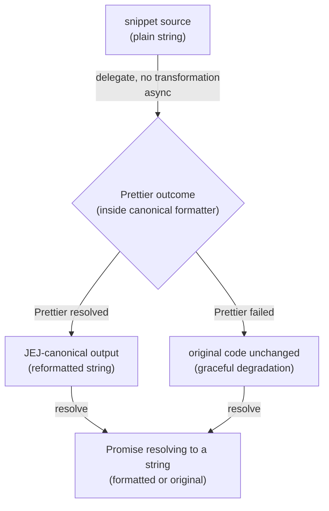

# lib/formatting-editor — Architecture & Decisions

## Why this module exists

The editor home base needs a format callback that produces **JEJ-canonical**
output for the `Ctrl-Shift-f` / `Cmd-Shift-f` reflow keybinding. The canonical
formatter at
[`../../embody/lib/formatting/format.ts`](../../embody/lib/formatting/format.ts)
is exactly the function we want — it owns the JEJ-canonical Prettier config and
is the formatter the runtime gate
[`checkFormat`](../../embody/lib/formatting/check-format.ts) validates against.
`lib/formatting-editor/` is the adapter that lets the editor reuse it without
violating the `embody/lib/*` peer-internal boundary. See
[`./README.md`](./README.md) for the domain glossary, public API, and the
rationale for living at the JEJ-package `lib/` level rather than inside
`orchestrate/` or `embody/`.

## Architectural sketch

> Written Phase 0, before implementation. The Refactor step is held against this
> document — not what the code does, but what shape it takes.

### Execution phases

1. **Receive** (sync) — the format callback is invoked with the current snippet
   as a plain string. Input: arbitrary source text (possibly empty, possibly
   unparseable, possibly outside the JEJ subset). No editor or CodeMirror types
   cross this boundary.

2. **Delegate** (async) — the snippet is forwarded to the canonical formatter
   unchanged. The adapter does not inspect, validate, or transform the input.
   The canonical formatter applies the fixed JEJ Prettier config and either
   returns the formatted output or — if Prettier throws — returns the original
   code unchanged (its built-in graceful degradation, caught with a bare
   `catch`). The no-throw guarantee is the canonical formatter's, not the
   adapter's.

3. **Resolve** (async) — the adapter resolves with whatever the canonical
   formatter returned: formatted output on Prettier success, original code on
   Prettier failure. No post-processing, no error-shaping, no `changed`-flag
   computation. The shape is `Promise<string>`.

### Data flow

### Structural constraints

- **No JEJ-subset validation.** The adapter does not call
  [`validate()`](../../embody/lib/validating/validate.ts),
  [`isJej()`](../../embody/lib/validating/is-jej.ts), or any other JEJ-aware
  gate before delegating. Code outside the JEJ subset (e.g. `var`, `class`) is
  formatted as Prettier sees fit. Format and lint are independent surfaces;
  pairing them is a pedagogical decision documented in
  [`./README.md`](./README.md) § Public API.
- **Pure, async, appears throws-free.** No I/O beyond the Prettier call, no side
  effects. "Appears throws-free" because the underlying canonical formatter's
  bare `catch` swallows all throws and resolves with the original code; the
  adapter inherits that behavior. The adapter does not add an additional catch
  of its own.
- **No transformation, no inspection.** The adapter does not modify input or
  output, does not check whether output equals input (the `changed` flag is
  computed by the editing factory's `applyFormat`, not here), and does not log
  or instrument.
- **Delegation-only — no thickening allowed.** Caching, telemetry, pre-format
  hooks, "skip if already formatted" shortcuts, and any other layer added
  between Receive and Delegate would defeat the single-source-of-truth premise.
  If a behavior of that kind is ever needed, it belongs in the canonical
  formatter so the runtime gate `checkFormat` inherits it too. See
  [`./README.md`](./README.md) § Conventions for the explicit clause.
- **No `embody()`, no `Snippet` construction.** The adapter imports `format()`
  from `embody/lib/formatting/format.js`, but never
  [`embody()`](../../embody/index.ts), the `Snippet` type, or anything under
  `embody/lib/evaluating/`. The canonical formatter has no embodiment surface,
  and the adapter must not introduce one. This rule is **load-bearing for the
  delegation-only premise** (a `validate-before-format` hook would reach into
  the same `embody/lib/*` layers that produce the single source of truth) rather
  than for the F2 "no embody in editor mode" invariant. Contrast with the
  linting adapter ([`../linting/DOCS.md`](../linting/DOCS.md)), where bypassing
  `embody()` IS load-bearing for F2.

### Out of scope

- **JEJ-subset enforcement.** Lives in
  [`../../embody/lib/validating/`](../../embody/lib/validating/) (the validator)
  and is surfaced to the editor by [`../linting/`](../linting/) (the lint
  adapter). The format adapter neither validates nor reports violations.
- **Format keybinding registration.** Lives in
  [`../../orchestrate/lib/editing/build-extensions.ts`](../../orchestrate/lib/editing/build-extensions.ts).
  The adapter is the callback wired through to that keybinding; the keybinding
  itself is the CodeMirror factory's concern.
- **`onFormat` event payload + `changed` flag.** Computed inside
  [`applyFormat`](../../orchestrate/lib/editing/create-editor.ts); the adapter
  never sees the event or the flag.
- **Prettier configuration, plugin loading, and bundling.** Owned by
  [`format.ts`](../../embody/lib/formatting/format.ts) and its module-level
  plugin imports. Changing tab width, print width, lazy-loading plugins, or
  tree-shaking Prettier are all changes to the canonical formatter, not changes
  here.
- **CodeMirror transaction dispatch.** Translating the formatted string back
  into a CodeMirror transaction (and triggering `updateListener` → `onChange` →
  F2.5 cache invalidation) is owned by `applyFormat` in the editing factory.
- **Per-exercise / configurable formatting.** The canonical formatter is the
  only formatter; this adapter does not introduce options.

## Decisions

- **Single-file module.** Unlike `lib/linting/`, which split `lint-jej.ts`
  (outcome dispatcher) from `violation-to-diagnostic.ts` (1:1 shape translator),
  this module has only one source file (`format-jej.ts`). There is no shape
  translation to extract: the `FormatCallback` signature
  (`(code: string) => string | Promise<string>`) already accepts the canonical
  formatter's signature (`(code: string) => Promise<string>`) exactly; nothing
  needs reshaping. A second file would have no responsibility.
- **Thin delegating wrapper, justified by boundary enforcement.** The body is a
  one-liner. The module exists because `orchestrate/editor/` cannot import
  directly from `embody/lib/formatting/` without violating the peer-internal
  boundary set by [`../README.md`](../README.md). The thinness is a feature: the
  module is obviously a boundary marker rather than a behavior-changing layer.
  Future thickening is explicitly forbidden by the Conventions clause in
  [`./README.md`](./README.md).
- **No adapter-level catch.** The canonical formatter's bare `catch` is the only
  error boundary in this path. Adding `try/catch` here would either duplicate
  the swallow (silently double-handling) or change the contract (e.g. surfacing
  throws to the caller); both are forbidden. If Prettier's upstream catch is
  ever removed, fix `format.ts` to restore the boundary rather than wrapping at
  the adapter level — the runtime gate `checkFormat` shares the same dependency,
  so one fix preserves both surfaces.
- **No `types.ts`.** The module introduces no new types — input is `string`,
  output is `Promise<string>`, and `FormatCallback` is owned by
  [`../../orchestrate/lib/editing/types.ts`](../../orchestrate/lib/editing/types.ts).
  A re-export file would add an import surface for zero new vocabulary. Mirrors
  the same decision in `lib/linting/`.
- **Async per parent-peer carve-out.** [`../README.md`](../README.md) specifies
  a pure-function default, with async permitted when an upstream dependency is
  async; the canonical formatter is Prettier standalone (async), so the adapter
  is async. The pure-function _intent_ — no I/O, no observable side effects, no
  hidden state — is still met: `formatJej` is a pure function of its `code`
  argument.
