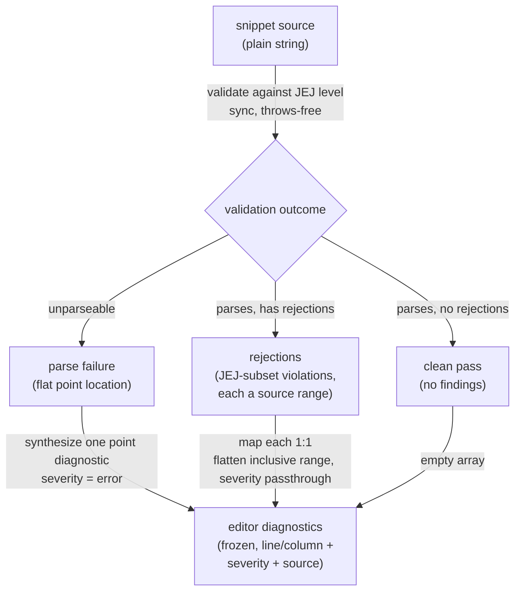

# lib/linting — Architecture & Decisions

## Why this module exists

The editor home base needs a lint-diagnostics feed, but per the F2
"no embody in editor mode" invariant it cannot build an embodiment.
`lib/linting/` is the adapter that reads JEJ validation results
directly (via the validating pipeline's `validate(code)`, which does
not construct a `Snippet`) and shapes them into the editor's
`LintDiagnostic` contract. See [`./README.md`](./README.md) for the
domain glossary, public API, and the rationale for living at the
JEJ-package `lib/` level rather than inside `orchestrate/`.

## Architectural sketch

> Written Phase 0, before implementation. The Refactor step is held
> against this document — not what the code does, but what shape it
> takes.

### Execution phases

1. **Receive** (sync) — the linter is invoked with the current snippet
   as a plain string. Input: arbitrary source text (possibly empty,
   possibly unparseable). No editor or CodeMirror types cross this
   boundary.

2. **Validate** (sync, throws-free) — the snippet is checked against
   the JEJ language level. Output: one of three validation outcomes —
   a clean pass, a parse failure (the source is not parseable; carries
   a single flat point location), or a set of rejections (the source
   parses but contains constructs outside the JEJ subset; each carries
   a source range). Parse failure and rejections are mutually
   exclusive — a parse failure short-circuits before the subset check.

3. **Adapt** (sync, pure) — dispatch on the validation outcome, then
   apply one of two structurally different shapings: a rejection is
   mapped **1:1** (a reusable range → diagnostic translation — its
   source range flattened to line/column endpoints, its rejection
   severity carried through); a parse failure is **synthesized** into a
   single point diagnostic at the failure location with error severity
   (one-from-error, not one-per-finding). A clean pass yields nothing.
   The two shapings are distinct operations — one per finding vs. one
   from the error.

4. **Return** (sync, frozen) — the diagnostics are returned as a
   frozen array. Empty for a clean (or empty) snippet.

### Data flow

### Structural constraints

- **No embodiment.** The module reads validation results without
  constructing a `Snippet`, calling `embody()`, or touching the
  orchestrator's embodiment cache. This is the load-bearing F2
  preservation — it is what lets the feed run in editor mode.
- **Pure, synchronous, throws-free.** No I/O, no async, no side
  effects. The adapter is pure shape translation; it relies on the
  validation gate's never-throws-for-string-input contract rather than
  guarding the boundary itself. Returned arrays are deeply frozen.
- **Parse failure and rejections never co-occur.** The adapter
  dispatches on the parse-failure outcome first; rejections are read
  only from a non-parse-failure outcome. No result carries both.
- **The two location shapes differ.** A rejection carries a source
  range (start + end); a parse failure carries a flat point (line +
  column, no span). The adapter handles them separately — it does not
  assume every finding has a range.
- **Endpoint convention is pass-through, no adjustment.** A rejection's
  source range `end` is acorn-exclusive (one past the last character),
  and `to-cm-diagnostic` treats `endColumn` as an exclusive offset
  (`to = lineStart + endColumn`). Both ends are exclusive, so the
  adapter copies `end` straight through — no ±1.
- **Diagnostics drop AST-navigation fields.** A rejection's node type
  and node path are not part of the editor's diagnostic shape; the
  adapter omits them. They remain on the validation result for other
  consumers (lens highlighting, structured tooling).

### Out of scope

- **Execution-driven diagnostics.** Findings that require running the
  snippet (runtime errors, trace-based feedback) belong to lens mode
  over a built embodiment, not to this static feed.
- **Diagnostic ordering / de-duplication / rendering.** CodeMirror's
  linter extension owns presentation; this module only produces the
  data.
- **Editor wiring.** Passing the linter into the CodeMirror factory is
  the editor home base's job (`orchestrate/editor/`); this module is a
  pure, peer-independent producer.
- **The CodeMirror conversion.** Translating the editor diagnostic to a
  CodeMirror `Diagnostic` (line/column → absolute char offset, range
  clamping) is owned by `orchestrate/lib/editing/`'s `to-cm-diagnostic`;
  this module produces the editor-shaped `LintDiagnostic` only.
- **Custom language levels.** This feed always validates against the
  Just Enough JavaScript level; per-exercise subsets are not
  configurable here.

## Decisions

- **Two files, not one.** A pure range→diagnostic adapter
  (`violation-to-diagnostic.ts`) is separated from the
  outcome-dispatcher (`lint-jej.ts`) because the adapter is reusable
  1:1 shape translation while the dispatcher owns the
  parse-failure-vs-rejections branch and the parse-failure synthesis.
  The split keeps each independently testable and each phase distinct.
- **No `types.ts`.** The module introduces no new types — it imports
  `Violation` (from the validating pipeline) and `LintDiagnostic`
  (from the editing module) directly. A re-export file would add an
  import surface for zero new vocabulary.
- **Read `validate(code)`, not `validateProgram`.** `validate` returns
  the shaped, frozen `BaseResult` (the parse-failure / rejections /
  clean trichotomy) that maps cleanly onto the three diagnostic
  outcomes; the lower-level `validateProgram` report would force the
  adapter to re-derive that shaping.
