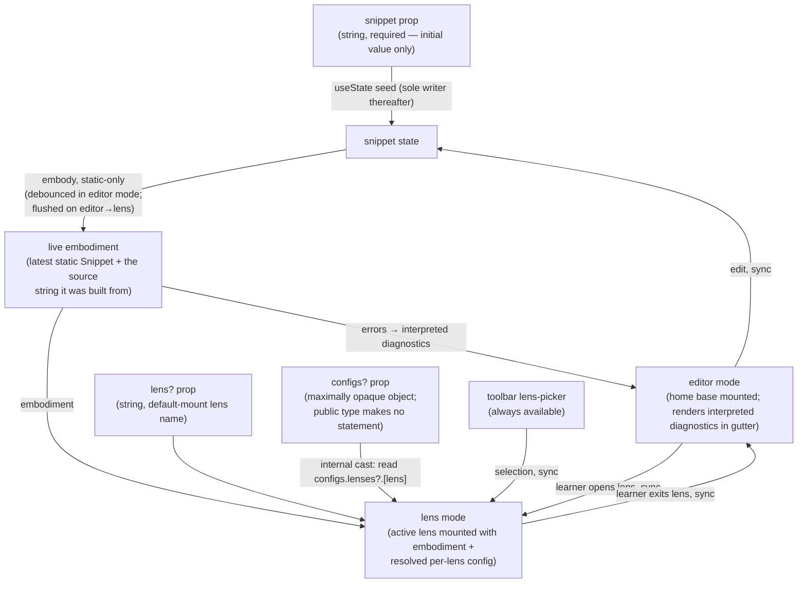
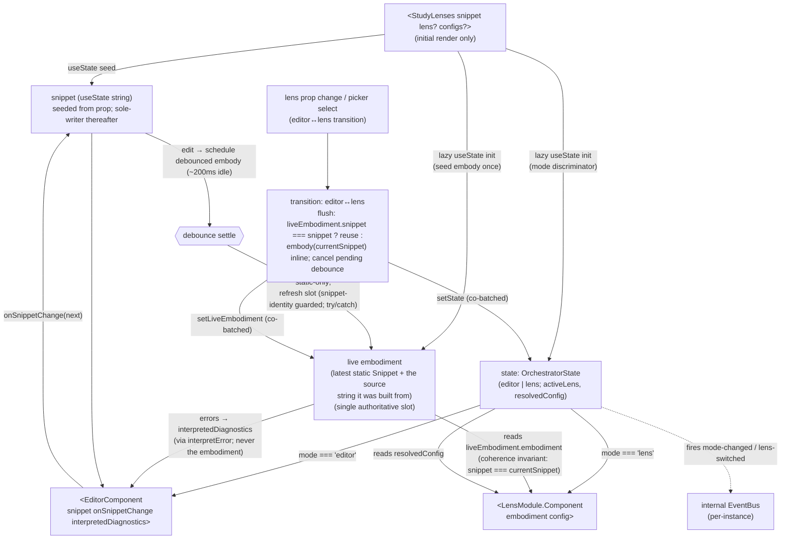
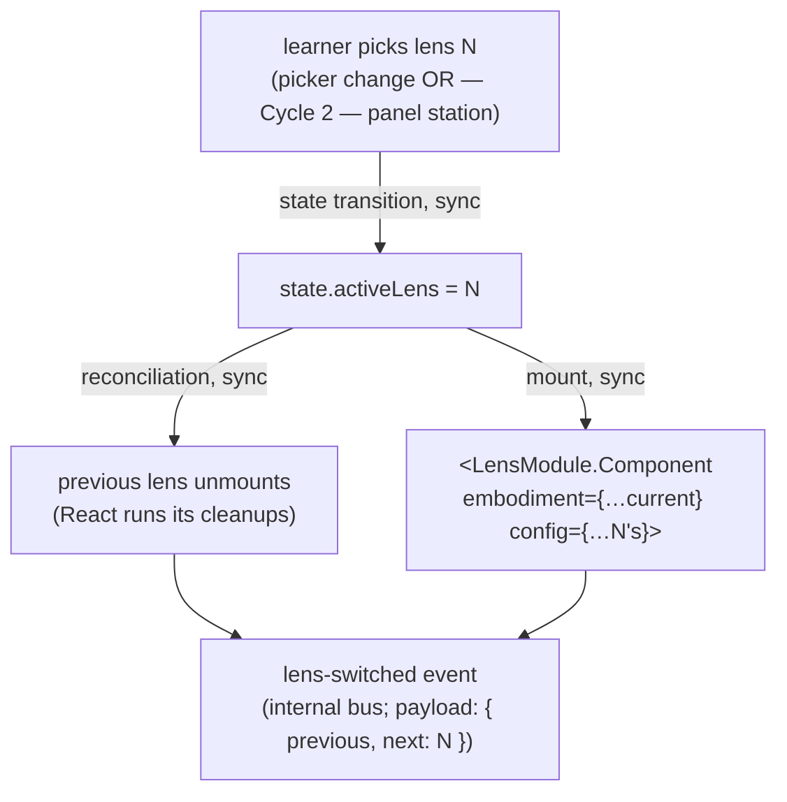
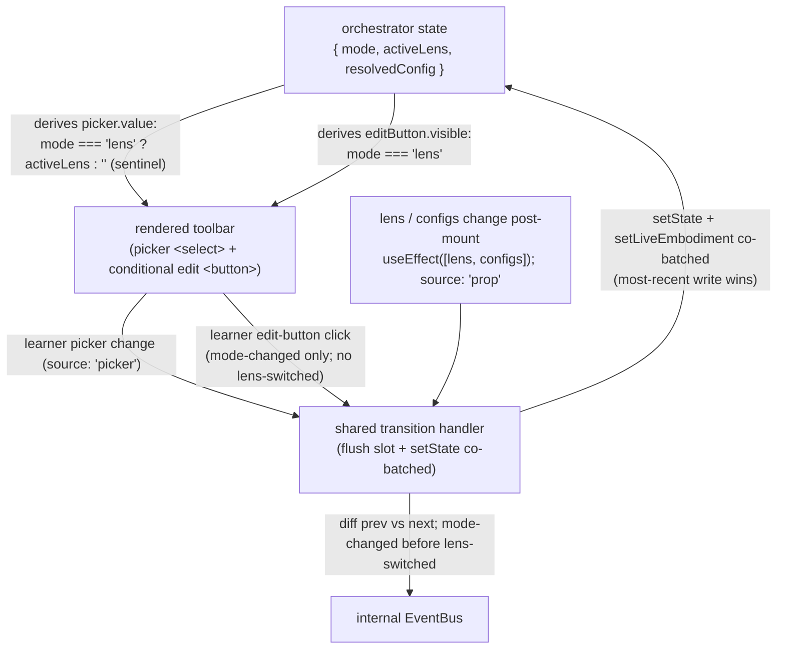
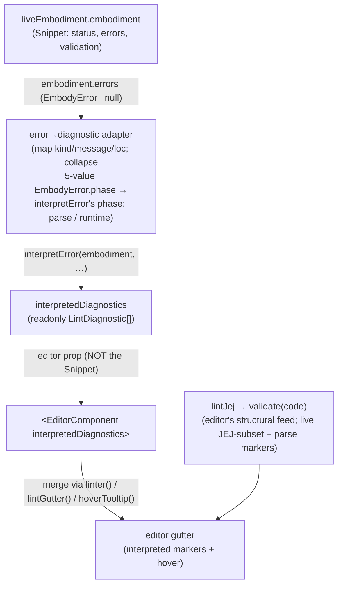
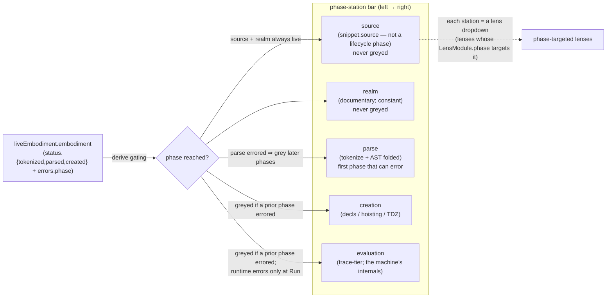
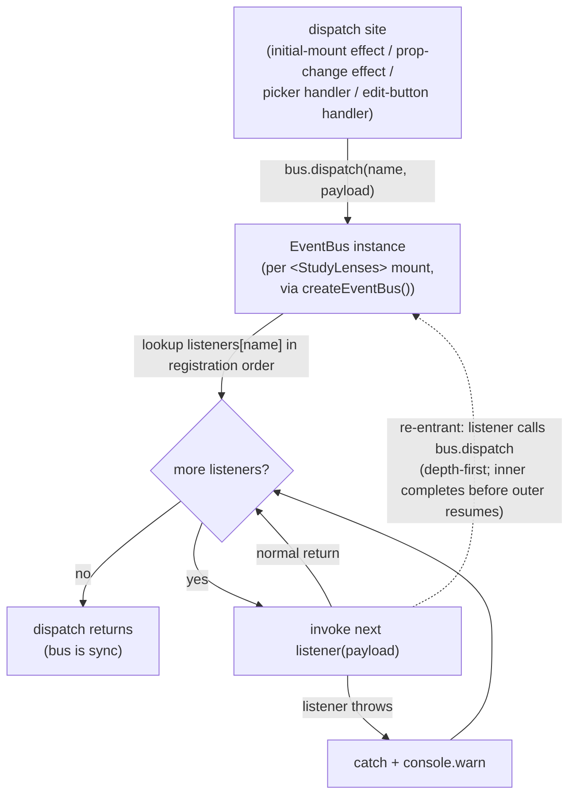

# orchestrate — Architecture & Decisions

## Why this peer exists

`orchestrate/` is the React-aware peer of the three-peer architecture and the
**React seam** between the package's pure-TS substrate (`embody/`,
`orchestrate/lib/*`) and the rendered learner experience. It exports
`<StudyLenses>` — the package's public API.

**At the peer's top level** (the orchestrator itself):

- The `<StudyLenses>` component (`./index.tsx`).
- The toolbar lens-picker + edit-return button (`./toolbar.tsx`). This is the
  Cycle-1 affordance container; Cycle 2 replaces it with the **NM phase-station
  panel** (see § The phase-station panel below).
- The orchestrator-internal types (`./types.ts`): prop contract, 2-mode state
  machine, the single live-embodiment slot, internal EventBus event taxonomy.

**As subdirs** (separable concerns):

- [`./editor/`](./editor/) — the home-base editor, the only writer of snippet
  state, and the surface that renders interpreted diagnostics in its gutter.
- [`./lib/`](./lib/) — the pure-TS analysis libs every consumer uses
  (recommender, socratizing, editing, error-interpreting).

[`embody/`](../embody/) and [`lenses/`](../lenses/) are pure-TS peers;
`orchestrate/` is where React enters and where the learner-facing experience is
assembled. Concentrating everything React-aware here keeps the substrate
testable in vitest without `jsdom` and limits framework-portability concerns to
one peer.

The peer follows a **primary-export-at-top-level** convention: `<StudyLenses>`
and its co-bundled UI files (toolbar, types) sit at the peer's top level,
mirroring [`../embody/`](../embody/)'s convention where `embody()` lives at
`embody/index.ts`. Subdirs (`editor/`, `lib/`) are separable concerns the peer
also owns; the orchestrator's primary export sits above them at the peer root.

## The re-ontologized orchestrator (the design this sketch describes)

The orchestrator is being re-organized around the **JEJ notional-machine
lifecycle** — the same phase staircase `embody()` walks (realm → parse[tokenize
→ AST] → creation → evaluation, see
[`../notional-machine.md`](../notional-machine.md) and
[`../embody/types.ts`](../embody/types.ts)). The design lands in **three
cycles**, each its own DDD cycle. This sketch documents the orchestrator as it
IS designed to be, not a migration narrative; where a piece is
locked-but-unbuilt it says so.

- **Cycle 1 — live embodiment + interpreted diagnostics** _(this sketch's
  current contract; the live-embodiment slot is mid-migration in code — see the
  note in § Live-embodiment effect topology)._ The orchestrator holds one
  authoritative live `Snippet` of the editing buffer, refreshed by a **debounced
  static `embody()`** while editing, flushed to the exact current buffer on an
  editor → lens transition. From its `errors` the orchestrator derives
  **interpreted diagnostics** and hands them to the editor for gutter rendering.
- **Cycle 2 — the phase-station panel** _(design locked, NOT built)._ An
  NM-lifecycle instrument that both teaches and displays the lifecycle and
  points phase-targeted lenses at each stage. Replaces `toolbar.tsx`.
- **Cycle 3 — the omnipresent region** _(design locked, NOT built)._ Cross-phase
  study tools: a Run dock and a Quiz button.

The orchestrator's UI splits on `validation.isJeJ` (read off the live
embodiment): a **JEJ** snippet drives the phase-station panel; a **non-JEJ**
snippet drives a run/debug surface (a separate, later DDD — out of scope here).
The branch lives in `index.tsx`; the panel module is presentation.

## Architectural sketch

> Domain terms only — no function names, no variable names, no pseudocode (React
> API names like `useEffect` / `useState` / `useRef` are acceptable as
> structural-mechanism references).
>
> **Diagram scope.** The diagrams cover the orchestrator's steady-state
> machinery: the mode discriminator, the single live-embodiment slot and its
> debounced-refresh / flush-on-transition lifecycle, editor↔lens transitions,
> interpreted-diagnostic derivation, the INTERNAL EventBus dispatch, the toolbar
> (picker + edit-return), in-mode lens-switching, and a forward sketch of the
> Cycle-2 phase-station panel.

### Lifecycle modes

The orchestrator's UI is in exactly one of two modes at a time. The edge labels
name the steady-state learner-facing trigger surface (picker, in-mode
lens-switch, edit-return). See § Mode-gated state machine below for the
component-internal view.

```mermaid
stateDiagram-v2
    [*] --> EditorMode: initial mount<br/>(seed embodied once → live slot)
    EditorMode --> LensMode: learner opens a lens<br/>(picker / lens prop change)
    LensMode --> EditorMode: learner exits lens<br/>(edit-return button / lens prop unset)
    LensMode --> LensMode: learner switches lens<br/>(reuses live embodiment;<br/>previous lens unmounts)
    EditorMode --> EditorMode: learner edits snippet<br/>(debounced re-embody refreshes the live slot)
    LensMode --> [*]: component unmount
    EditorMode --> [*]: component unmount
```



- **Editor mode** — [`./editor/`](./editor/) is mounted; learner is editing the
  snippet string. The live-embodiment slot is kept fresh by a debounced static
  `embody()`; the editor renders the orchestrator's interpreted diagnostics in
  its gutter. Picker is visible.
- **Lens mode** — a lens is active, reading the live embodiment + its resolved
  per-lens config as React props. Snippet is read-only while in lens mode.
  Switching lenses reuses the current embodiment; the previous lens unmounts;
  the new lens mounts fresh.

The slot is **never cleared on edit**. Editor edits schedule a debounced
refresh; the editor → lens transition flushes the slot to the exact current
buffer (reuse if already current, else embody synchronously inline).

### Prop-to-mode routing (peer-level view)

Where each prop ends up. Answers: "what powers the editor path and the lens
path?" Omits internal state and bus dispatch (those are in the next diagram).



#### Per-lens config resolution chain

For any lens the learner mounts, the final config feeding
`<LensModule.Component config={…}>` is the two-tier algebra canonically defined
in [`./README.md` § Per-lens config resolution chain](./README.md) and
[`./types.ts`](./types.ts) (quoted here for diagram context — the README/types
are the authoritative pin, including the `configs.lenses?.[lensName]`
optional-chaining precedence):

```text
resolved(lensName) = module.config()                  // tier 0: lens defaults
                   ⊕ configs.lenses?.[lensName]       // tier 1: cascade (post-merge with per-fence/sibling override)
```

`⊕` is **deep-merge-right-wins**. The orchestrator computes this two-tier chain
in its pipeline; lens authors don't compute it themselves. There is no separate
per-fence-override tier on the orchestrator side — the plugin pre-merges the
URL-style query / directive JSON INTO `configs.lenses[lens]` before emission, so
the cascade IS the merged truth.

The `configs.lenses?.[lensName]` read is an **orchestrator-internal structural
assumption**, NOT a constraint on the public `configs` type. The public type is
maximally opaque (`Readonly<Record<string, unknown>>`); the resolver casts at
the boundary to look up `lenses[lensName]`. If the supplied `configs` value
doesn't expose a `lenses` map (or its `lenses[lensName]` isn't an object), tier
1 contributes nothing and the chain falls back to `module.config()` alone.

`lens`-prop resolution order:

1. The `lens` prop (populated upstream by the plugin from per-fence `:suffix`,
   frontmatter `defaultLens`, sibling `@study-lens` directive, or the
   cascade-supplied default — see [`./README.md` § Public API](./README.md). Or
   set directly by an MDX author writing `<StudyLenses lens="…" />`).
2. None — when no default resolves, the orchestrator initializes the mode
   discriminator to `'editor'` and mounts the editor home base.

Steady-state lifecycle:

- `<StudyLenses>` ingests the `snippet` prop as its initial-value seed (the
  orchestrator is the sole writer of snippet state thereafter).
- `embody()` turns the current buffer directly into a frozen `Snippet`. It is
  **static-only** at the orchestrator level (realm → tokenize → parse → validate
  → creation; no worker); program **execution stays lazy** (the future Run
  affordance, Cycle 3). When the validate gate runs (`status.parsed === true`),
  format compliance surfaces via `Snippet.validation?.formatted` and JEJ-subset
  violations via `Snippet.validation?.violations`; `Snippet.validation` is
  **`null` on tokenize-fail and parse-fail leaves** (the validate gate did not
  run) and **non-null once `status.parsed` is true** — present-but-null, not
  absent. The orchestrator does NOT pre-format; formatting is the learner's
  responsibility.
- The orchestrator switches between **editor mode** (home base active) and
  **lens mode** (active lens mounted with embodiment + config props).
- The toolbar lens-picker is always visible.
- An edit in the editor produces a new snippet string and schedules a debounced
  re-embody of the live slot; the slot is not cleared.

### Mode-gated state machine (component-internal view)

What state lives where, and how the mode discriminator gates the React subtree
mounted at any moment. Adds the mode discriminator + the single live slot + bus
dispatch the peer-level prop-to-mode diagram omitted.

#### State-diagram form

```mermaid
stateDiagram-v2
    [*] --> InitDerive: mount<br/>(seed embodied once → live slot)
    InitDerive --> EditorMode: lens prop unset OR unregistered
    InitDerive --> LensMode: lens prop registered<br/>(reuse the seed embodiment)
    EditorMode --> EditorMode: edit<br/>(setSnippet; schedule debounced re-embody)
    EditorMode --> LensMode: lens prop becomes registered OR picker select<br/>(flush: reuse if liveEmbodiment.snippet === snippet,<br/>else embody synchronously inline; cancel pending debounce)
    LensMode --> EditorMode: lens prop unset/unregistered OR edit-return<br/>(dispose lens; live slot RETAINED)
    LensMode --> LensMode: picker selects a different lens<br/>(same embodiment; previous lens unmounts)
    LensMode --> [*]: component unmount
    EditorMode --> [*]: component unmount
```

#### Data-flow form



> The state-diagram form omits a self-loop on `LensMode` for snippet edits
> because the editor is unmounted in lens mode — no edit event can fire. This is
> structural enforcement, not a runtime guard. (The debounced re-embody only
> runs while the editor is mounted, i.e. in editor mode.)

#### Atomic transition mechanism

The **coherence invariant** ("when `state.mode === 'lens'`, the live slot is
non-null AND `liveEmbodiment.snippet === currentSnippet`") is preserved across
editor → lens transitions by **co-batching** the mode-flip and the slot-write so
they are **observably atomic** — no frame ever renders a lens against a stale or
null slot. The transition handler **flushes** the live slot first (reuse if
already current, else `embody()` synchronously inline), and the flush **cancels
any pending debounce timer** so no late trailing write can land after the mode
flip. The flush-on-transition path embodies **inline without a try/catch**,
relying on embody's total-on-`string` contract (`embody()` returns a
fully-shaped `Snippet` for any string input — acorn errors are caught internally
and returned as error-leaves, never thrown; see
[`./README.md` § Live embodiment](./README.md)). The debounced editor-mode
refresh, by contrast, wraps `embody()` defensively (see § Live embodiment, the
try/catch-asymmetry note).

This is the one structural decision a re-implementing agent must honor: **the
mode-flip and the slot-write land in one commit (never split across a microtask
boundary), and the flush cancels the pending debounce.** Splitting them would
expose a one-frame window where the lens-mode subtree mounts against a stale or
null slot.

> **Phase-1 implementation note (co-batching).** "Co-batching" is the named
> technique: dispatch the mode setter and the slot setter in succession from the
> same React event handler / effect body, and React 18 auto-batching folds the
> two updates into a single commit. (At first render the two `useState` lazy
> initializers project from one single-pass `{ state, liveEmbodiment }`
> derivation, so the seed `embody()` runs exactly once.) The exact setter
> call-ordering is an implementation detail; the contract is only that they
> co-batch.

#### Failure modes (embody + lens internals)

- **Parse / validation error in the live embodiment** — `embody()` does NOT
  throw; it returns a `Snippet` whose
  `status.{tokenized, parsed, validated, created}` flags identify which gate
  completed and whose `errors` field (an `EmbodyError | null` with
  `errors.phase ∈ 'parse:tokenize' | 'parse:ast' | 'validation' | 'creation' | 'evaluation'`)
  carries the gate-error diagnostic. When the validate gate runs
  (`status.parsed === true`), `validation?.{formatted, isJeJ, violations}`
  carries JEJ-subset diagnostics. In **editor mode** the orchestrator derives
  interpreted diagnostics from these `errors` and surfaces them in the gutter as
  the buffer settles. In **lens mode** the lens reads the embodiment and
  displays per its own error-surface contract.
- **Evaluation error inside a lens** — surfaces only when the lens's evaluation
  triggers (a future run / predict affordance), even if detectable statically.
  Per the lens's own error-surface contract. Static embodiment never runs
  program code; `evaluation` is always present but `events.run()` resolves with
  `endReport.outcome: 'not-runnable'` on a non-apex leaf.
- **Async setup inside a lens** — async resource loading (e.g. CodeMirror
  language modules) lives inside the lens's React component, not in the embody
  step. The orchestrator's `embody()` is **sync** by contract: embody → slot. If
  a future evaluation engine needs async embody, that contract change re-opens
  this section; until then, sync.

### Live embodiment

The orchestrator owns the following effect categories. Editor and lens-internal
effects are listed separately for system-wide context — they're the neighbors'
effects, not orchestrator categories.

> **Code-vs-contract note.** The slot identifier (`liveEmbodiment`) and the
> never-clear-on-edit behavior described here have landed; the slot is
> content-keyed and reused (cache hit) or re-embodied (snippet mismatch) at the
> editor → lens transition. Still pending to fully converge the code onto this
> section: the live-debounced editor-mode re-embody + seed-at-mount (the next
> Cycle-1 increment).

These orchestrator-side effect categories (seed / debounced re-embody /
flush-on-transition) are the _trigger-cadence_ decomposition of when the static
embody staircase runs — a different axis from the editor's **Execution phases**
(see [`./editor/DOCS.md`](./editor/DOCS.md)), which decompose the editor
module's own lifecycle; one feeds the other (this docs' diagnostics derivation
hands the editor its gutter input), but the two vocabularies name different
seams.

**Orchestrator-internal effect categories** (load-bearing names):

| Category                              | Triggers on                                                                      | What it does                                                                                                                                                                                                          | Cleanup                                |
| ------------------------------------- | -------------------------------------------------------------------------------- | --------------------------------------------------------------------------------------------------------------------------------------------------------------------------------------------------------------------- | -------------------------------------- |
| **Seed embodiment**                   | initial mount (either mode)                                                      | `embody(seedSnippet)` once → populate the live slot atomically with the initial `{ state, liveEmbodiment }` derivation, so gutter errors paint on the first frame                                                     | None — embodiment is plain frozen data |
| **Debounced live re-embody**          | snippet edit in editor mode                                                      | schedule (`useEffect([snippet])`, timer in a `useRef`) a trailing-edge `embody(currentSnippet)` (~200 ms idle); refresh the slot guarded by snippet-identity; `try/catch` so a background throw can't kill the editor | cancel the pending timer               |
| **Flush-on-transition embody**        | editor → lens transition with a stale or null slot                               | flush: reuse when `liveEmbodiment.snippet === currentSnippet`, else `embody(currentSnippet)` synchronously inline; cancel any pending debounce; write the slot atomically with the mode flip                          | None                                   |
| **Lens-mount dispatch**               | `state.mode === 'lens'` (initial mount OR after transition)                      | render `<LensModule.Component embodiment={liveEmbodiment.embodiment} config={resolvedConfig} />` in place of the editor                                                                                               | Per-lens React `useEffect` cleanups    |
| **Interpreted-diagnostic derivation** | the live slot's `errors` change                                                  | map `snippet.errors` → a located `LintDiagnostic[]` via `interpretError` and pass it down as the editor's `interpretedDiagnostics` prop (editor renders; orchestrator never hands over the embodiment)                | None                                   |
| **Mode-changed bus dispatch**         | editor ↔ lens transition                                                         | fire `mode-changed({ from, to })` on the internal bus AFTER the setters commit; before `lens-switched` when both apply                                                                                                | None                                   |
| **Lens-switched bus dispatch**        | active-lens transition (editor → lens with a registered lens, or in-mode switch) | fire `lens-switched({ previous, next, source? })` AFTER the setters commit; after `mode-changed` when both apply                                                                                                      | None                                   |

> **StrictMode note.** Both embody effects are double-invoke-safe under React
> StrictMode's dev mount → unmount → remount. The **debounced re-embody**'s
> cleanup cancels the pending timer, so a dev double-invoke cannot leave a
> duplicate trailing-edge `embody()` queued. The **seed embody** is a pure lazy
> `useState` initializer (frozen plain data, no side effect), so a double-run is
> benign — it recomputes the same value.
>
> **Try/catch asymmetry.** The debounced re-embody wraps `embody()` in a
> `try/catch` as **defense-in-depth at an async timer boundary** — a throw on a
> detached timer callback has no React error boundary above it, so the catch
> keeps a stray failure from tearing down the editor. The inline flush-on-
> transition omits the catch because it runs **inside the React commit** and
> leans on embody's total-on-`string` contract there. Neither is contract
> distrust; they're matched to where the call executes.

**Neighbor effects (system-wide context, not orchestrator categories)**:

| Module                      | Effect                  | Triggers on                          | What it does                                                                                                                                                         | Cleanup                       |
| --------------------------- | ----------------------- | ------------------------------------ | -------------------------------------------------------------------------------------------------------------------------------------------------------------------- | ----------------------------- |
| `orchestrate/editor/`       | Editor mount / teardown | editor mode entered / exited         | Construct CodeMirror `EditorView` async; append to the `<div data-orchestrator-host>`; tear down on cleanup                                                          | `EditorView.destroy()`        |
| `orchestrate/editor/`       | Gutter render           | `interpretedDiagnostics` prop change | Merge the orchestrator's interpreted diagnostics into the existing `linter()` / `lintGutter()` / `hoverTooltip()` machinery alongside `lintJej`'s structural markers | CodeMirror-internal           |
| `lenses/<name>/` (per lens) | Lens-internal effects   | lens-component mount / unmount       | Lens-author concern (e.g. parsons shuffle, blanks state, async language modules)                                                                                     | Per-lens `useEffect` cleanups |

What's NOT in the topology:

- No **clear-on-edit** invalidation. An edit does not null the slot; it
  schedules a debounced refresh. The slot always holds the
  most-recently-embodied value (its `snippet` key tells consumers how stale it
  is).
- No **manual mount/detach** of lenses. React reconciles components by tree
  position; each lens's own `useEffect` cleanups run when React unmounts it.
- No **in-place snippet propagation** to a mounted lens. React unmounts the
  lens; the next embodiment props feed a fresh mount.

See [`./editor/DOCS.md`](./editor/DOCS.md) for the editor module's
mount/teardown and gutter-render details, and
[`./README.md` § Live embodiment](./README.md) for the prose contract + the full
trigger-semantics table.

### Switch flow (lens-mode internal)

When already in lens mode and the learner picks a different lens via the picker
(or, in Cycle 2, a panel station):



Snippet does NOT change during a lens-mode switch — the same embodiment is fed
to the new lens. The previous lens's in-progress UI state (parsons shuffle,
blanks fills) is gone (per disposability). The new lens's `LensModule.Component`
mounts fresh; if it does async setup, it manages that internally.

The `lens-switched` event fires INTERNALLY (no outbound emit). The picker
re-renders to reflect the new default-selected option.

### Toolbar data flow (Cycle 1)

The toolbar (`./toolbar.tsx`) owns the lens-picker `<select>` and the
edit-return `<button>`. It is always rendered above the active surface in both
editor and lens mode; its contents are derived from `state`. Mode transitions
originating in the toolbar route through the same internal transition handler as
the prop-change effect — there is no second source of truth for
`state.activeLens`.



**Picker neutral state.** When `state.mode === 'editor'`, the picker's `value`
is the empty string and the first `<option>` is a non-selectable sentinel
(`<option value="" disabled hidden>— select a lens —</option>`). The remaining
options enumerate the registered lenses in **registration order** (the insertion
order of `LENS_REGISTRY`'s keys per the ES2015+ `Object.keys` spec). Selecting
any non-sentinel option transitions to lens mode for that lens; the sentinel
itself cannot be re-selected.

**Edit-button visibility.** The edit button appears only when
`state.mode === 'lens'`. Clicking it dispatches
`mode-changed({ from: 'lens', to: 'editor' })` on the internal bus; it does NOT
dispatch `lens-switched` (no lens is being selected — the active lens is being
unmounted). The live slot is **retained** across the return.

**Picker-vs-prop precedence.** Mode transitions are driven by three sources: the
`lens` prop changing (consumer-driven), the picker selection (learner-driven),
and the edit button (learner-driven). On conflict, the most-recent write wins.
Consumers SHOULD memoize `configs` to avoid clobbering learner picker selections
on unrelated parent re-renders — the same `lens` value paired with a new
`configs` object identity counts as a consumer write and re-runs the transition.

> The toolbar is the **Cycle-1** affordance container. Cycle 2 replaces it with
> the phase-station panel (§ The phase-station panel). The picker's
> always-visible autonomy guarantee and the edit-return semantics carry forward;
> the layout becomes the N-station lifecycle bar.

### Interpreted-diagnostic data flow (Cycle 1)

The orchestrator **computes**, the editor **renders**. The editor never receives
an embodiment — only located interpretation strings cross the boundary.



- **Two diagnostic sources, source-tagged.** `lintJej` is the editor's
  structural feed (live JEJ-subset + parse markers, computed editor-side via
  `validate(code)`). The orchestrator-derived interpreted diagnostics are a
  **separate source** the editor merges in. Syntax, JEJ-compliance, and
  interpreted diagnostics render **distinctly**; the editor suppresses only the
  same error shown both terse (`lintJej`) and interpreted — interpreted
  **supersedes** the terse message.
- **Concise plain prose in Cycle 1.** The interpreted `message` is concise
  plain-prose; the editing layer renders hover content via `textContent` (no
  markdown parser). Rich-markdown hovers are deferred.
- **Line targeting.** Prefer `errors.loc`; else derive `(line, column)` from
  `source.offsets` + the error's char offset; else a file-level notice.
- **Coherence.** Interpreted diagnostics are at most one debounce-window stale
  relative to the buffer (they ride the live slot's refresh cadence).
- **What lights up now.** Interpreted gutter errors are demonstrable for
  tokenize/parse (syntax) errors on real arbitrary code (the live acorn path)
  and for the named scenario fixtures. JEJ-violation and creation-error
  _interpretation_ on real arbitrary code lights up when embody's
  validating/creation slices land; until then, real non-JEJ code (e.g.
  `var x = 1`) still shows `lintJej`'s structural marker but no
  embodiment-derived interpretation. This is by design, not a bug.

> **Known cost (Cycle 1).** `lintJej`'s `validate(code)` and the orchestrator's
> debounced `embody()` each run acorn — two parses per settle (plus CodeMirror's
> own tokenizer). Accepted for now. **Convergence target:** once embody's
> real-composition `validation` reaches parity with `lintJej`'s JEJ-compliance
> markers, the embodiment becomes the single parse source and the editor renders
> only orchestrator-supplied diagnostics — collapsing to one parse.

See [`./editor/DOCS.md` § Out of scope](./editor/DOCS.md) and
[`./editor/README.md`](./editor/README.md) for the editor-side contract (what
crosses the boundary, and the `interpretedDiagnostics` prop shape).

### The phase-station panel (Cycle 2 — design locked, NOT built)

Cycle 2 replaces the toolbar with an **NM-lifecycle instrument**: N "stations"
laid out left → right — **source · realm · parse · creation · evaluation** —
each its own lens dropdown for lenses targeting that phase. The N dropdowns are
deliberate: the layout itself engrains the lifecycle. The panel **doubles as a
lifecycle-status display** — it shows how far the machine got and where it
tripped, teaching the lifecycle before any lens is picked.

> **Naming.** The panel's name is **intentionally unspecified** here — it is
> locked in Cycle 2's Phase 0. "Control panel" is reserved by
> [`../notional-machine.md`](../notional-machine.md) (§ "Control panel vs.
> machine", the visible-syntax-as-the-programmer's-interface metaphor) and must
> NOT be reused for this panel.



- **Column / phase-based gating** is computed purely from the embody staircase
  (`status.{tokenized, parsed, created}` + `errors.phase`). Phases **after** the
  errored phase grey out; **source and realm never grey**; **parse** is the
  first phase that can error (nothing bars it). This cycle does **column-level**
  gating only; per-lens gating (consulting each lens's `applicableTo`) is a
  backlogged seam.
- **Lens → station binding** via a new `LensModule.phase` field: the
  **pedagogical TARGET** — which lifecycle phase the lens teaches understanding
  OF — **NOT** which embody phase it reads from. (E.g. `blanks` / `annotate`
  target `source` even though they consume the AST.) Existing lenses slot to
  **source**: parsons, blanks, annotate (plus `writeme`, which registers when
  built). `debug-props` is **excluded** (a dev lens, not a learner station). The
  other stations are mostly empty until prediction lenses are built (a backlog
  item). The exact `LensModule.phase` type (`string` | `string[]`) and the
  per-station state model (what a station shows when its embody phase is
  `null`/stubbed) are **intentionally unspecified** — locked in Cycle 2's
  Phase 0.
- The JEJ/non-JEJ branch (on `validation.isJeJ`) lives in `index.tsx`: a JEJ
  snippet mounts this panel; a non-JEJ snippet mounts a run/debug surface (a
  separate, later DDD). The panel module is presentation; the branch is the
  orchestrator's.
- The panel **replaces `toolbar.tsx`** and likely becomes a new module folder.

### The omnipresent region (Cycle 3 — design locked, NOT built)

A cross-phase study-tools region that spans source → evaluation, ships **Run +
Quiz**:

- **Run** — a collapsible **dock** output surface (not a lens) with two panels
  mirroring the NM's two I/O channels: a **User Interface** panel
  (alert/confirm/prompt dialogs) and a **Developer Console** panel
  (`console.*`). It maps to the embodiment's `evaluation.events.run` +
  `evaluation.events.intercept` (see
  [`../embody/types.ts § EvaluationEvents`](../embody/types.ts)). Run is the
  affordance that drives **program execution** — the lazy half of the embody
  contract.
- **Quiz** — an omnipresent **button** that calls `socratize` now (generator
  #1); a future dropdown dispatches to more generators. The heavier block-model
  quiz engine (a recommender sibling) stays deferred backlog.
- **`format`** is an **editor-only subtoolbar** (format mutates source).
- **error-interpret** is **NOT a button** — it is a reactive explainer surfaced
  where the error appears: the editor gutter (static errors; the Cycle-1
  wiring), the Run-dock console (runtime errors), and future phase lenses. It is
  a shared utility consumed by surfaces, not an affordance of its own.

The exact omnipresent-region layout is **intentionally unspecified** — locked in
Cycle 3.

### Internal event taxonomy

The internal `EventBus` carries intra-component coordination events. Each
`<StudyLenses>` mount owns an isolated bus instance produced by
`createEventBus()` from [`./event-bus.ts`](./event-bus.ts); the type-level
shapes live in [`./types.ts`](./types.ts) (`EventBus`, `EventName`,
`EventPayloadMap`, payload types).

#### Contract

- **Per-instance.** `createEventBus()` is called once per `<StudyLenses>` mount;
  the bus identity is stable across re-renders (held in a `useRef`). Two
  `<StudyLenses>` mounts never share listeners.
- **Synchronous dispatch.** `bus.dispatch(name, payload)` invokes every listener
  registered for `name` synchronously, in registration order, before returning
  to the caller. No microtask, no `setTimeout`, no scheduling.
- **Caught throws.** A listener that throws is caught; the bus logs a single
  `console.warn` and continues to the next listener. The thrown value does not
  abort the dispatch loop and does not propagate to the dispatch caller.
- **Depth-first re-entrancy.** A listener that calls `bus.dispatch` runs the
  inner dispatch to completion before the outer dispatch continues to its next
  listener.
- **Typed.** Each `EventName` maps to exactly one payload shape via
  `EventPayloadMap`; mismatched name/payload pairs fail type-check at the
  dispatch site.
- **Listener identity-based registration.** A listener is registered once per
  `(name, listenerFn)` reference pair. Re-subscribing the same listener
  reference to the same event name is a no-op. The teardown function returned
  from `subscribe` removes the listener; calling it twice is a no-op. This makes
  subscribers safe under React StrictMode (subscribe → cleanup → subscribe) and
  under accidental double-subscribe.
- **`clear()` is a test-isolation affordance.** `bus.clear()` removes all
  listeners across all event names. The orchestrator does not call `clear` at
  runtime — listener teardown happens via React unmount dropping the bus
  reference. `clear` is exposed for test harnesses.

#### Event names

| Event           | Fires on                                                                             | Payload                                                                    | Notes                                                                                                                                                                                                                                                               |
| --------------- | ------------------------------------------------------------------------------------ | -------------------------------------------------------------------------- | ------------------------------------------------------------------------------------------------------------------------------------------------------------------------------------------------------------------------------------------------------------------- |
| `lens-switched` | active-lens transition: editor → lens with a registered lens, or in-mode lens switch | `{ previous: string \| null; next: string; source?: LensSelectionSource }` | `previous` is `null` on any editor → lens transition (initial mount or prop-driven), since editor mode has no prior active lens. In-mode switches always carry a non-null `previous`. `source` is optional; supplied when the dispatch site has a defensible value. |
| `mode-changed`  | editor ↔ lens mode transition                                                        | `{ from: 'editor' \| 'lens'; to: 'editor' \| 'lens' }`                     | Dispatched before `lens-switched` in the same React commit when both apply (editor → lens transitions). Edit-return dispatches `mode-changed` alone.                                                                                                                |

The `EventName` union and `EventPayloadMap` in [`./types.ts`](./types.ts) are
the authoritative pin; events not listed above are not part of the current
taxonomy.

#### Dispatch ordering

On an editor → lens transition, `mode-changed` is dispatched **before**
`lens-switched` within the same React commit. The ordering is deterministic
because both dispatches issue from the same transition handler in sequence; the
bus is synchronous and listeners run in registration order. Subscribers that
need the new active lens name at mode-change time should subscribe to
`lens-switched` and read the `to` field from the most recently observed
`mode-changed`.

Edit-return transitions (lens → editor) dispatch only `mode-changed`; no
`lens-switched` fires because no lens is being selected.

#### Initial-mount dispatch

Initial mount in lens mode dispatches both events from a one-time post-commit
effect (`useEffect([])` that observes the first-commit state), in standard
order: `mode-changed({ from: 'editor', to: 'lens' })` first, then
`lens-switched({ previous: null, next: state.activeLens, source: 'initial' })`.
This is the only execution path that uses `source: 'initial'`; any other editor
→ lens transition (prop-driven, picker) also reports `previous: null` but with
its own `source` value.

Initial mount in editor mode dispatches nothing — the system simply IS in editor
mode from frame one; no transition has occurred.

The lazy `useState` initializer writes the first-commit `state` and
`liveEmbodiment` slots directly and does NOT dispatch — it is the synchronous
initial-render path. The post-commit effect is the dispatch path. Splitting them
ensures the seed `embody()` fires at most once on first render and that
subscribers attached from inside the orchestrator can observe first-mount
events.

#### Dispatch sites

Every bus dispatch the orchestrator emits comes from one of these sites. The
`source` value on `lens-switched` is pinned per site:

| Dispatch site                                                | Dispatches                                                   | `source` on `lens-switched`                                                                                                                                   |
| ------------------------------------------------------------ | ------------------------------------------------------------ | ------------------------------------------------------------------------------------------------------------------------------------------------------------- |
| Initial-mount post-commit effect (`useEffect([])`)           | `mode-changed(editor → lens)` + `lens-switched(null → next)` | `'initial'`                                                                                                                                                   |
| Prop-change effect (`useEffect([lens, configs])` post-mount) | `mode-changed` + `lens-switched` as applicable               | `'prop'`                                                                                                                                                      |
| Picker `onChange` handler                                    | `mode-changed` + `lens-switched` as applicable               | `'picker'`                                                                                                                                                    |
| Edit-button `onClick` handler                                | `mode-changed(lens → editor)` only                           | n/a (no `lens-switched`); the handler still supplies `source: 'edit-button'` for consistency with `LensSelectionSource` and for future analytics attribution. |

`LensSelectionSource` also types `'panel'`, reserved for a future panel-station
dispatch site; no such site exists yet.

#### Data flow — bus topology



**Re-entrant dispatch and listener throws are independent contracts.** A
listener that calls `bus.dispatch` re-entrantly runs the inner dispatch loop to
completion before its own outer dispatch resumes; if the outer listener then
throws after returning from its re-entrant dispatch, the throw is caught at the
outer dispatch's `catch + console.warn` step. Both behaviors hold simultaneously
because both are synchronous and depth-first.

#### Why internal-only

A LMS-facing `subscribe` prop on `<StudyLenses>` (or an `onEvent` callback)
would lock the internal event taxonomy as a public contract. The bus is internal
because the event taxonomy is not yet a public surface; externalizing it
requires a separate, narrower protocol designed against a concrete host's needs
— not the raw internal bus.

### Structural constraints

- **Public surface is one component**: `<StudyLenses>`. **Three props** total —
  one required (`snippet`), two optional (`lens?`, `configs?`). Everything else
  internal. See § Per-lens config resolution chain for how
  `configs.lenses[lens]` flows per lens.
- **No consumer-side branching on `snippet.source.code`.** `embody(code)`
  recognizes 11 named scenario keywords (`"OK"`, `"FAIL_AT_PARSE"`,
  `"EVAL_TIMEOUT"`, …) and dispatches a canned `Snippet` shape for each; these
  scenarios are a permanent integration-testing fixture set. Orchestrator code
  MUST NOT use `snippet.source.code` as a branching discriminator. Always branch
  on the resulting `Snippet`'s `status.{tokenized, parsed, validated, created}`,
  `errors`, `validation.{isJeJ, isDeterministic, doesPause}`, and
  `endReport.outcome` (from a resolved `events.run()`). Rendering `source.code`
  verbatim (e.g. a source-display lens) is fine; using it as a key is not. See
  [`../embody/README.md` § Named scenarios](../embody/README.md) and
  [`../embody/index.ts`](../embody/index.ts) JSDoc.
- **Single-writer state.** Only [`./editor/`](./editor/) mutates snippet source.
  The orchestrator threads the editor's `onSnippetChange` callback into its
  state-update; lenses receive `embodiment` via props and have no mutation
  surface.
- **Editor mode vs lens mode** is a 2-state machine. There is no concurrent
  "editor + lens" rendering. Editor mode = home base mounted; the live slot is
  refreshed by debounced static embody; the gutter shows interpreted
  diagnostics. Lens mode = active lens mounted with the live embodiment +
  config; snippet is read-only.
- **Live embodiment, debounced static / lazy execution.** The orchestrator keeps
  one live `Snippet` of the editing buffer, refreshed by a **debounced** static
  `embody()` in editor mode (never on every keystroke; the editor's
  `onSnippetChange` still fires 1:1 per keystroke — only the embody reaction is
  debounced) and **flushed** to the exact current buffer on an editor → lens
  transition. The static phases (realm → tokenize → parse → validate → creation)
  are eager; program **execution stays lazy** (the future Run affordance, Cycle
  3). The slot is **never cleared on edit** — it refreshes on the debounce
  settle.
- **Coherence invariant.** When `state.mode === 'lens'`, the live slot is
  non-null AND `liveEmbodiment.snippet === currentSnippet`. A stale slot
  (snippet mismatch) or a null slot at lens-mount **throws synchronously in the
  transition handler** (dev AND prod — not a dev-only assert): it signals a
  transition-logic bug, not learner-recoverable state, so it fails loud rather
  than rendering a lens against the wrong embodiment. Transition logic enforces
  this; the type system cannot.
- **Snippet-content-blind orchestrator.** The orchestrator's transition
  handler + live-embodiment layer never inspects `Snippet.source.code` content
  as a branching discriminator. It MAY compare snippet strings as **slot keys**
  via **full-string identity only** (`liveEmbodiment.snippet === snippet`,
  answering "is this the same snippet I already embodied?") — that's
  slot-validity, not semantic dispatch. Substring, prefix, regex, or pattern
  tests against snippet content are forbidden even when used to gate slot
  behavior. Branches that need to know what the code does consume only the
  resulting `Snippet`'s `status` / `errors` / `validation` fields (Cycle 1
  begins consuming these to compute interpreted diagnostics and the JEJ/non-JEJ
  branch — the allowed path; the orchestrator still never inspects `source.code`
  semantically).
- **Disposable practice.** Snippet edits don't disturb any mounted lens (in
  editor mode there is no lens). Re-entering lens mode against a changed buffer
  mounts a fresh lens with the current embodiment; lens-internal UI state is
  per-mount only.
- **Internal-only EventBus.** The orchestrator's bus coordinates intra-component
  communication. No outbound `subscribe` prop on `<StudyLenses>` until a
  concrete LMS integration target exists.
- **Picker always visible.** The toolbar lens-picker is shown in BOTH editor and
  lens mode — the lifelong-learning autonomy guarantee. (In Cycle 2 the
  per-station dropdowns become the picker surface; the always-available
  guarantee carries forward.)
- **Async caveat carries forward.** Any `useEffect` body that awaits a Promise
  (async lens setup, a hypothetical future async embody) creates a microtask gap
  between effect-fire and side-effect-completion. Subscribers to `lens-switched`
  that need the new mount in the DOM should defer their work to a microtask or
  `requestAnimationFrame`.
- **Dependency rules** (per [`../DOCS.md` § Dependency rules](../DOCS.md)):
  - `orchestrate/` may import from `orchestrate/lib/*`, `embody/`, `lenses/`,
    `@-utils`.
  - `orchestrate/lib/*` may import from sibling `orchestrate/lib/*`, `embody/`,
    `@-utils`. Never from `lenses/`.
  - `lenses/<lens>/*` receives `embodiment` via props from the orchestrator. May
    import (type-only) from `embody/types.ts` and (runtime + type) from
    `orchestrate/lib/*` and `@-utils`. Never imports runtime values from
    `embody/` (top) or `orchestrate/` (top).

### Out of scope

- **Embodiment construction details** — owned by [`../embody/`](../embody/). The
  orchestrator just calls `embody(snippet)` and consumes the returned `Snippet`.
- **Format pre-processing** — when the validate gate runs, `embody` checks
  format compliance via `Snippet.validation?.formatted` and surfaces JEJ-subset
  violations via `Snippet.validation?.violations`; the learner formats their own
  code; the orchestrator does not pre-format. `format` is an editor-only
  subtoolbar (Cycle 3), not an orchestrator transform.
- **Lens internals** — owned by [`../lenses/`](../lenses/). The orchestrator
  passes `embodiment` + `config` props; what the lens does inside is its own
  concern.
- **Program execution** — the orchestrator's `embody()` is static-only.
  Execution is lazy, driven by the Cycle-3 Run affordance via the embodiment's
  `evaluation.events.{run, intercept}`. No static phase ever runs program code.
- **Editor implementation** — owned by [`./editor/`](./editor/). The
  orchestrator threads its callback prop, passes the `interpretedDiagnostics`
  prop, and renders the editor in editor mode.
- **System-wide learner state, knowledge graph, ZPD positioning** — the
  embedding LMS's job per
  [`../DOCS.md` § What we explicitly do NOT own](../DOCS.md).
- **Multi-snippet path arrangement** — the LMS's job. Each `<StudyLenses>`
  instance is one stepping stone; the LMS arranges them.
- **An outbound data-emit protocol** — deferred until a concrete LMS integration
  target exists. Internal events stay internal.
- **The recommender + block-model + the Quiz engine** — backlog. The recommender
  and the block-model quiz engine are siblings (both consume the embodiment via
  a block-model, both span the lifecycle, each its own later DDD). They "work
  within NM phases later."
- **Applicability filtering at the picker** — the picker enumerates the full
  registered lens set; it does not filter by `applicableTo(embodiment)`.
  Per-station applicability filtering in the Cycle-2 panel is a backlogged seam.

## Why a two-mode state machine

The editor-vs-lens split makes the editing-vs-exercising boundary explicit:

- In editor mode the learner is **authoring** code — the editor is the focus;
  the live slot tracks the buffer and the gutter surfaces interpreted
  diagnostics.
- In lens mode the learner is **exercising** an embodiment — the snippet is
  frozen; the lens is the focus.

Benefits:

- **Simpler state.** One mode at a time, one clear focus; no "editor edits while
  a read-only lens reacts" concurrency.
- **Disposability is structural.** Snippet edits in editor mode don't disturb a
  lens — there is none; the next lens-open mounts fresh against the current
  buffer.

The cost is a UX nuance: the learner can't type code WHILE watching a lens
react. Per the disposable-practice principle, this is the intended model:
practice surfaces (lenses) are distinct from the authoring surface (editor);
switching modes is an explicit pedagogical commitment.

## Why a live (debounced) embodiment

Earlier designs built the embodiment lazily — only at lens-open, with the slot
cleared on every edit. That model surfaced parse / validation errors **only** at
lens-open, never while typing, and the editor never knew anything about the
buffer's structure.

The live model inverts that: the orchestrator holds one **live** static
embodiment of the buffer, refreshed on a debounced settle, so:

- **The gutter can teach as the learner types.** Interpreted diagnostics derive
  from the live `errors`; a snippet that ships with a syntax error shows its
  friendly marker on the first frame (the seed embodiment), and new errors
  appear as the buffer settles.
- **One slot, two freshness contracts.** A mounted lens always gets the
  exact-current buffer via the flush-on-transition; the (Cycle-2) phase panel
  and the editor gutter read the latest live value at debounce cadence. The
  `liveEmbodiment.snippet` key tells each consumer exactly how stale the slot
  is.
- **Execution stays lazy.** Only the static staircase runs on the debounce; the
  machine never _runs the program_ until a learner asks (the Cycle-3 Run
  affordance).

Debouncing (rather than embodying per keystroke) keeps the machine from
re-running on mid-statement, not-yet-parseable input — most keystrokes — while
still settling to a fresh embodiment quickly after the learner pauses.

## Why interpreted diagnostics are orchestrator-computed, editor-rendered

The editor owns CodeMirror's diagnostic machinery (`linter()`, `lintGutter()`,
`hoverTooltip()`); the orchestrator owns the live embodiment and the
error-interpreting lib. Computing the interpreted diagnostics in the
orchestrator and passing them down as a plain `readonly LintDiagnostic[]` prop:

- **Preserves the editor's embodiment-blindness.** Only interpretation strings
  cross the boundary — never a `Snippet`. The editor stays an embodiment-free
  surface (its structural `lintJej` feed is a separate, editor-owned re-parse).
- **Centralizes interpretation.** `interpretError` (`lib/error-interpreting/`)
  is the single producer; the editor is a renderer. The same
  interpreted-diagnostic shape can later feed the Run-dock console (runtime
  errors) and phase lenses.
- **Keeps the two feeds composable.** Source-tagging lets `lintJej`'s structural
  markers and the interpreted diagnostics coexist in one gutter, with the
  interpreted message superseding the terse one for the same error.

## Why an internal-only EventBus

The pre-refactor design implicitly assumed an LMS would consume events from the
orchestrator. The new architecture defers that protocol entirely until a
concrete integration target exists:

- **Premature interface design risks lock-in.** Without a real LMS in hand, we'd
  guess at event payload shapes and timing semantics; wrong guesses become hard
  to reverse once authors depend on the contract.
- **Internal coordination is enough today.** The picker, the editor, and (soon)
  the panel all live in the same React tree; React's natural composition + a
  private bus suffice for intra-`<StudyLenses>` plumbing.
- **The taxonomy can mature internally.** When an LMS appears, the externalized
  protocol can be a curated subset of the internal events that proved useful.

## Why the editor is a peer subdir, not a lens

Making the editor a peer subdirectory (not a `LensModule`) makes the
single-writer distinction structural:

- `orchestrate/editor/` is the always-present home base, not a registered lens.
- The editor's React component takes an `onSnippetChange` callback prop — the
  only mutation surface for snippet state in the whole system — and an
  `interpretedDiagnostics?` prop for gutter rendering.
- Lenses receive `embodiment` (frozen) via props; they have no mutation surface.

The single-writer model is enforced at the type level: only the
`orchestrate/editor/` component's prop signature accepts an `onSnippetChange`
callback. A lens's `LensProps` (in [`../lenses/types.ts`](../lenses/types.ts))
has no such field.

## Module ownership

What this peer owns is enumerated in
[`./README.md` § What lives here](./README.md); this section calls out only the
**negative-space** boundaries — what looks like it might belong here but
doesn't, plus the one load-bearing open-spec item.

**Open-spec item the peer owns**: the **lens registry** mechanism. The registry
is a top-level static map keyed by lens name (`LENS_REGISTRY` at `./index.tsx`),
holding the four registered lenses (`annotate`, `blanks`, `debug-props`,
`parsons`). The registry's shape — static map vs. runtime `register()` API — is
intentionally undecided at this peer's level; the lens-side
[`../lenses/DOCS.md`](../lenses/DOCS.md) § Out of scope owns the shape decision.
Either way the registry lives at the peer's top level alongside the
`<StudyLenses>` component.

This peer does NOT own:

- The `embody()` factory or its substrate (lives in [`../embody/`](../embody/)).
- Specific lens implementations (live in [`../lenses/`](../lenses/)).
- Per-lib content for the analysis libs — owned by their per-lib sessions
  (recommender, socratizing, editing, error-interpreting).
- The Docusaurus plugin's prop emission contract (lives in
  `src/plugins/study-lenses/`).

## Future direction

- **The phase-station panel** (Cycle 2): the NM-lifecycle bar that replaces the
  toolbar (§ The phase-station panel). Its name, the `LensModule.phase` type,
  and the per-station state model are settled in Cycle 2's Phase 0.
- **The omnipresent region** (Cycle 3): the Run dock + Quiz button (§ The
  omnipresent region). Exact layout settled in Cycle 3.
- **The non-JEJ orchestrator state**: a separate, later DDD — run/debug surface
  for non-JEJ snippets, branched off `validation.isJeJ` in `index.tsx`.
- **The recommender + block-model + Quiz engine**: backlog; they "work within NM
  phases later".
- **Parse convergence**: collapse `lintJej`'s editor-side `validate(code)` into
  the embodiment once embody's real-composition `validation` reaches parity —
  one parse per settle instead of two.
- **An async-embody affordance**: not in scope; the contract above is sync. A
  future evaluation engine needing async embodiment construction is a contract
  change reopening § Lifecycle modes.
- **An outbound LMS event protocol**: designed when a concrete integration
  target appears; the internal EventBus is the wire-tap point.
