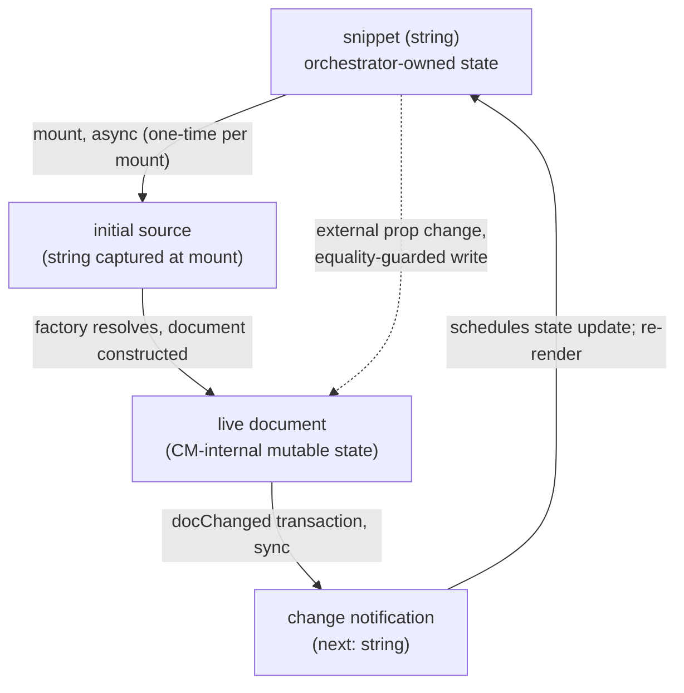

# editor — Architecture & Decisions

## Why this module exists

`orchestrate/editor/` is the orchestrator's **home base** — the always-mounted
React surface where learners edit the snippet string. Per the locked
single-writer state model in [`../README.md`](../README.md) § Conventions and
[`../DOCS.md` § Why the editor is a peer subdir, not a lens](../DOCS.md), this
is the only surface in the package that mutates snippet source. Lenses, the
recommender, and the toolbar picker are all read-only.

The editor is **not** a `LensModule`. It is **not** registered in the lens
registry. The orchestrator's editor-mode UI mounts [`./index.tsx`](./index.tsx)
directly as a peer React component; when the orchestrator transitions to lens
mode it unmounts the editor and mounts a `<LensModule.Component>` instead (per
[`../DOCS.md` § Lifecycle modes](../DOCS.md)). The two surfaces never co-render.

## Single-component module

| File        | Purpose                                                                                |
| ----------- | -------------------------------------------------------------------------------------- |
| `index.tsx` | React home-base component (default export). Renders the writable, orchestrator-controlled host textarea. |

The previous draft of this DOCS framed the editor as a two-layer "React
adapter + LensModule stub" module. AR-1 rejected that framing: the post-refactor
`LensModule` contract (per [`../../lenses/types.ts`](../../lenses/types.ts)
lines 186-192) requires `Component` + `applicableTo` fields, which the
pre-refactor stub lacked. The home base is a single React component; the legacy
stub at `./editor.ts` was deleted as part of F1.C.

## Architectural sketch

### Data flow

The orchestrator's snippet state seeds the live document at mount; from
then on, the document is the mutable source of truth for editor content
and the orchestrator state is the immutable propagated truth. Every
`docChanged` transaction inside the live document produces one change
notification carrying the new content as a plain string; the editor
component routes that notification through to the orchestrator's state
setter (the `onSnippetChange` prop). The single-writer invariant is
preserved because no other surface mutates the snippet state.

The dashed loopback is the external-sync path. When the snippet state
changes from outside the editor's own write loop (e.g. lens → editor
return with the original snippet preserved), the prop-sync effect writes
the new value into the live document — guarded by an equality check so
the round-trip from the editor's own writes does not echo back.

Domain terms used above (and their concrete shapes are pinned in
[`../lib/editing/types.ts`](../lib/editing/types.ts)): the **editor
handle** — `EditorInstance` per the editing/ types — is the React
component's reference to the live document; the **factory** is
[`createEditor`](../lib/editing/create-editor.ts) (async).

### Execution phases

1. **Mount initiation (async, fires once per mount)** — orchestrator is
   in editor mode; the editor component renders an empty host div and
   schedules a mount effect. The effect invokes the editing/ factory
   with the current snippet string (as initial source) and the
   editor's change-notification callback. A cancellation flag, scoped
   to the effect closure, marks whether the effect has been cleaned up
   while the factory's promise is still in flight.
2. **Mount resolution** — three disjoint outcomes:
   - **Success** — the factory's promise resolves; the cancellation
     flag is checked first. If still active, the resolved editor
     handle (`EditorInstance` per
     [`../lib/editing/types.ts`](../lib/editing/types.ts)) is stored
     for later sync and destroy. If the flag has been raised, the
     factory's output is destroyed immediately so no zombie editor
     leaks into the DOM.
   - **Cancellation** — React tore down the component before the
     factory resolved (typical under StrictMode's intentional
     mount-then-unmount cycle). The flag is raised by the cleanup
     function; the success path above handles the late arrival.
   - **Rejection** — the factory's promise rejects with a construction
     error. The component stores the rejection in a fallback state
     slot and renders a minimal error notice (see
     § Render-on-rejection).
3. **Learner edit (sync inside transaction)** — the live document
   accepts an edit through CodeMirror's input pipeline; the registered
   update listener fires once per `docChanged` transaction with the
   new document content as a plain string. The change-notification
   callback the factory was given is the editor component's
   pass-through to `onSnippetChange`, so the orchestrator's state
   setter receives the new value. React schedules a re-render of the
   orchestrator subtree; per the orchestrator's snippet-edit
   invalidation rule, the cross-mode embodiment cache is cleared at
   the same setState (F2.5).
4. **Prop sync (external write)** — when the snippet state changes
   from outside the editor's own write loop (e.g. lens → editor
   return with the original snippet preserved), a second effect
   watching the snippet prop writes the new value into the live
   document — but only when the editor handle is resolved AND the
   prop value differs from the document's current content. Both
   guards are load-bearing: the resolved-handle check prevents a
   no-op crash during the gap between component mount and factory
   resolution; the equality check prevents the orchestrator's own
   round-trip from echoing back into the document.
5. **Mode transition (editor → lens)** — orchestrator's mode
   discriminator moves to `'lens'`. React unmounts the editor
   component entirely. The mount effect's cleanup runs the editor
   handle's destroy method (idempotent per the editing/ contract),
   tearing down the live document and releasing CodeMirror's
   internal DOM. The lens component mounts in the editor's place.
6. **Mode transition (lens → editor)** — symmetric. React unmounts
   the lens and mounts a fresh editor component against the
   orchestrator's (preserved) snippet state, kicking off a new mount
   cycle. Editor-internal state (cursor position, scroll, undo
   history) is per-mount; nothing carries across.

### Structural constraints

- **CodeMirror live document, single-writer dispatch.** The CodeMirror
  update listener is the **only** path that updates snippet state in the
  package — the orchestrator threads its state setter through the
  editor's `onSnippetChange` prop, the editor component passes it as
  the change-notification callback to the factory, and lenses are
  read-only views. Each `docChanged` transaction produces exactly one
  change-notification invocation (1:1 transaction-to-callback, no
  batching, no debouncing). F2.5's invariant — every edit invalidates
  the cache before lens-mode re-entry — is satisfied because every
  edit produces at least one such transaction. (CodeMirror semantics:
  multi-cursor edits, paste, undo, and programmatic dispatches each
  produce one transaction covering N character changes; IME
  composition can produce zero transactions for several keystrokes
  followed by one covering the composed grapheme. The contract is
  transaction-based, not keystroke-based.)
- **No `embodiment` prop on the editor — ever.** The editor is
  editor-mode-only. Per [`../DOCS.md` § Lifecycle modes](../DOCS.md), editor
  mode has no embodiment built. Embodiment is a lens-mode concept and is
  passed to `<LensModule.Component>`, not to this editor. The `createEditor`
  factory accepts `(initialCode: string, options)` precisely so the editor
  home base doesn't need to fabricate a Snippet wrapper.
- **No `LensModule` registration.** The editor is not enumerated by the
  picker, not ranked by the recommender, not present in the lens registry.
  The orchestrator imports the component directly.
- **Async mount via `useEffect`.** `createEditor` is async (dynamic
  language-module loading). The mount effect's cleanup calls
  `editor.destroy()` for StrictMode-safe teardown. The async surface lives
  **inside the component**, never in the prop contract — `<EditorComponent>`
  is always renderable synchronously; the CodeMirror DOM appears after the
  promise resolves (typically <10ms).
- **Prop-change-during-mount race.** If `snippet` changes between first
  render and the `createEditor` promise resolving, the in-flight mount uses
  the original `initialCode`; the post-mount prop-sync effect writes the
  latest `snippet` value into `editor.content` once mount completes (one
  extra dispatch on initial mount, equality-guarded thereafter). The
  catch-up write fires `onSnippetChange` once with the new content —
  orchestrator round-trip is benign (idempotent setState), but
  side-effecting consumers (analytics, logging) should de-dupe by content.
- **Single host element.** The component renders one host element
  carrying the `data-orchestrator-host` attribute; CodeMirror's live
  document mounts into it. The data attribute is the test /
  dev-sandbox handle for "this is the home base surface".
  CodeMirror's content element is a child of the host; consumer code
  reading editor content via DOM should target the editor handle's
  `.content` property (the public API), not the host's descendants.
- **Sync-effect resilience.** The prop-sync effect must no-op when
  the editor handle is not yet resolved. This is the load-bearing
  guard for the StrictMode-double-mount × prop-change-during-mount
  intersection: if the snippet prop changes between the first
  StrictMode mount (cancelled) and the second mount's factory
  resolution, the sync effect may fire against a still-null handle.
  Without the resolved-handle check, the effect would crash.
- **`onSnippetChange` is optional.** Components mounted purely as display
  surfaces (in tests, fixtures, or future read-only flows) may omit the
  callback; when omitted, the `onChange` option is not passed to
  `createEditor`, so the update listener fires no consumer callback —
  CodeMirror still accepts edits at the DOM level but typed characters
  do not propagate to any parent state. The orchestrator always passes
  the callback in production.

### Render-on-rejection

If `createEditor` rejects (e.g. CodeMirror construction throws on a
malformed extension), the mount effect catches the rejection and stores
the error in a fallback state slot. The component then renders a minimal
error notice — a host element carrying both `data-orchestrator-host` and
`data-orchestrator-error` attributes (`[data-orchestrator-host][data-orchestrator-error]`
as a CSS selector). Preserving the host attribute means test / sandbox
selectors still locate the surface. The underlying error is also logged
to the console for diagnosis. The orchestrator's mode machine is
unaffected; the learner can still toggle to lens mode and back to attempt
a fresh mount.

### Caller migration

Downstream consumers that read editor content via DOM queries against
`[data-orchestrator-host]` (specifically the orchestrator-level
cross-boundary tests at
[`../tests/study-lenses.test.tsx`](../tests/study-lenses.test.tsx))
must migrate from `HTMLTextAreaElement.value` reads to either the
editor handle's `.content` property (when an `EditorInstance` is
available) or DOM queries against CodeMirror's content element (when
only the DOM is available). That rewrite is part of E2's deliverable.

### Out of scope

- **Embodiment-/execution-driven diagnostics** — the editor never receives an
  embodiment, so diagnostics that require runtime evaluation (e.g. evaluation
  errors, or anything derived from a `Snippet`'s `validation.*` / `errors.*`)
  remain out of scope; they belong to lens mode, which owns the embodiment.
  Static JEJ diagnostics are a *different* feed and **are** wired — see
  § Deferred callback wiring → `linters`.
- **Recommend-time analysis** — the editor is not a lens; it has no
  `recommend()` surface. Recommendations belong to lens modules.
- **Snippet ownership beyond mount-time seed.** The orchestrator owns snippet
  state via `useState`; the editor reads from props and writes via
  `onSnippetChange`. The editor never holds local snippet state of its own
  (no uncontrolled fallback).

## External contract

The home-base component holds the following surface invariant. Internal
implementation may evolve (extension stack, future callback wiring,
diagnostics linter) without changing these:

- **File path:** [`./index.tsx`](./index.tsx).
- **Default export shape:** a React function component.
- **Prop surface:** `{ snippet, onSnippetChange? }`.
- **Data attribute on the host element:** `data-orchestrator-host`. The
  host is the `
` element that CodeMirror's `EditorView` mounts into.
  When rendering an error fallback (per § Render-on-rejection), the same
  attribute lives on the error notice element so selectors stay
  consistent.

The orchestrator's call site in [`../index.tsx`](../index.tsx) reads the
prop surface only; internal CodeMirror details are not part of the
orchestrator's contract surface.

## Module ownership

This module owns:

- [`./index.tsx`](./index.tsx) — the React home-base component.

Consumers:

- [`../index.tsx`](../index.tsx) — the orchestrator imports the component for
  editor mode.

No other consumers. Lenses do not consume the editor; the recommender does not
consume it; the toolbar does not consume it.

## Deferred callback wiring

The CodeMirror factory at [`../lib/editing/`](../lib/editing/) exposes
slots for `linters`, `docLookup`, `completions`, and `format` callbacks
(plus the wired `onChange`). The home-base component wires `onChange`,
`linters`, `format`, and `completions`:

- `linters` — **wired** to [`lintJej`](../../lib/linting/lint-jej.ts) from
  the JEJ-package [`lib/linting/`](../../lib/linting/) module. The original
  open design question (embodiment-derived diagnostics vs. a live re-parse)
  resolved in favor of the **validation feed**: `lintJej` calls
  [`validate(code)`](../../embody/lib/validating/validate.ts) directly — a
  pure parse + JEJ-subset walk that constructs no `Snippet` — so the F2 "no
  embody in editor mode" invariant holds (the editor still never receives an
  embodiment). See [`lib/linting/DOCS.md`](../../lib/linting/DOCS.md).

- `format` — **wired** to
  [`formatJej`](../../lib/formatting-editor/format-jej.ts) from the
  JEJ-package [`lib/formatting-editor/`](../../lib/formatting-editor/)
  module. Thin delegating wrapper around the canonical formatter
  [`format()`](../../embody/lib/formatting/format.ts) — the same
  Prettier-standalone function the runtime gate
  [`checkFormat`](../../embody/lib/formatting/check-format.ts) validates
  against. The original "Prettier-based or JeJ-canonical" design question
  resolved in favor of **single source of truth**: what the editor formats
  is byte-identical to what `isJej` considers canonical, by construction.
  No JEJ-subset gate at this boundary — any parseable JS gets formatted;
  the linter (above) surfaces JEJ violations. Learner triggers via
  `Ctrl-Shift-f` / `Cmd-Shift-f` registered in
  [`build-extensions.ts`](../lib/editing/build-extensions.ts). See
  [`lib/formatting-editor/DOCS.md`](../../lib/formatting-editor/DOCS.md).

- `completions` — **wired** to
  [`completeJej`](../../lib/completing/complete-jej.ts) from the
  JEJ-package [`lib/completing/`](../../lib/completing/) module.
  Substantive JEJ-aware adapter composing the validation feed, scope
  analysis at the cursor, regex-based dot-receiver context detection,
  and a curated 14-entry stumbling-list into a single
  `CompletionCallback`. Identifier context: keywords ∪ JEJ-allowed
  globals (minus easter-egg `eval`) ∪ scope-tree locals via
  [`buildScope`](../../embody/lib/scope/build-scope.ts).
  Dot-receiver context: a curated 28-entry member union (no
  type inference). Blocked tokens (`var`, `class`, `function`, etc.)
  surface in the popup with `type: 'blocked'`, `detail: '(not in
  JEJ)'`, a curated `info` tooltip, and `apply: 'noop'` so the
  keystroke does not insert blocked text — the linter (above)
  catches the manual override. Driven through the Phase 0
  contract widening that gave `CompletionCallback` its
  `CompletionRequest` argument and `CompletionItem` its
  `info`/`apply` fields. See
  [`lib/completing/DOCS.md`](../../lib/completing/DOCS.md).

The remaining slot is intentionally unwired:

- `docLookup` — requires `orchestrate/lib/jej-documentation/` (does not
  yet exist).
