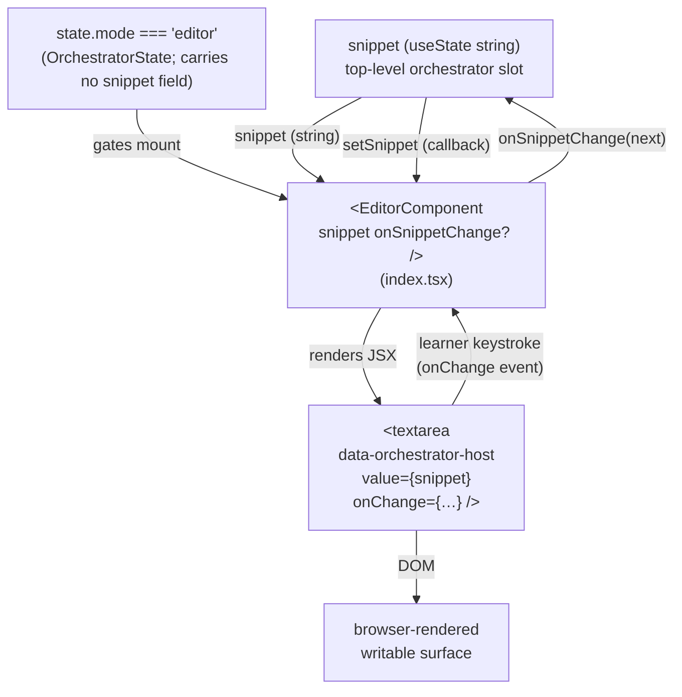

# editor — Architecture & Decisions

## Why this module exists

`orchestrate/editor/` is the orchestrator's **home base** — the always-mounted
React surface where learners edit the snippet string. Per the locked
single-writer state model in [`../README.md`](../README.md) § Conventions and
[`../DOCS.md` § Why the editor is a peer subdir, not a lens](../DOCS.md), this
is the only surface in the package that mutates snippet source. Lenses, the
recommender, and the toolbar picker are all read-only.

The editor is **not** a `LensModule`. It is **not** registered in the lens
registry. The orchestrator's editor-mode UI mounts [`./index.tsx`](./index.tsx)
directly as a peer React component; when the orchestrator transitions to lens
mode it unmounts the editor and mounts a `<LensModule.Component>` instead (per
[`../DOCS.md` § Lifecycle modes](../DOCS.md)). The two surfaces never co-render.

## Single-component module

| File        | Purpose                                                                                |
| ----------- | -------------------------------------------------------------------------------------- |
| `index.tsx` | React home-base component (default export). Renders the writable, orchestrator-controlled host textarea. |

The previous draft of this DOCS framed the editor as a two-layer "React
adapter + LensModule stub" module. AR-1 rejected that framing: the post-refactor
`LensModule` contract (per [`../../lenses/types.ts`](../../lenses/types.ts)
lines 186-192) requires `Component` + `applicableTo` fields, which the
pre-refactor stub lacked. The home base is a single React component; the legacy
stub at `./editor.ts` was deleted as part of F1.C.

## Architectural sketch

### Data flow

The `Snippet` and `Mode` slots are **separate top-level `useState` slots** in
the orchestrator (not fields on a single state object). The editor mounts when
`Mode === 'editor'`, reads `Snippet` for its `value` prop, and writes through
`onSnippetChange`.

The cycle `OrchestratorState → Editor → Host → Editor → OrchestratorState` is
the single-writer dispatch loop: the textarea's `onChange` event is the only
write surface for `snippet` state in the entire package. Lenses are read-only
views; the picker selects but does not write; the recommender ranks but does
not write.

### Execution phases

1. **Mount** — orchestrator is in editor mode; renders
   `<EditorComponent snippet={…} onSnippetChange={setSnippet} />`. The
   component returns its JSX body containing
   `<textarea data-orchestrator-host value={snippet} onChange={…}>`. React
   mounts the textarea natively. No `useRef`-managed DOM mount, no manual
   `appendChild`.
2. **Learner keystroke** — the textarea's `onChange` event fires; the
   component's handler invokes `onSnippetChange(e.target.value)`. The
   orchestrator's `setSnippet` setter receives the new value, React schedules
   a re-render of `<StudyLenses>`, and the editor re-renders with the new
   `snippet` prop. (Per the orchestrator's snippet-edit invalidation rule,
   the cross-mode embodiment cache is cleared at the same setState.)
3. **Mode transition (editor → lens)** — orchestrator's mode discriminator
   moves to `'lens'`. React unmounts `<EditorComponent>` entirely and mounts
   `<LensModule.Component>` in its place. Any `useEffect` cleanups inside the
   editor run as part of the unmount.
4. **Mode transition (lens → editor)** — symmetric. React unmounts the lens
   and mounts a fresh `<EditorComponent>` against the orchestrator's
   (preserved) snippet state. Editor-internal state (cursor position, scroll)
   is per-mount; nothing carries across.

### Structural constraints

- **Writable textarea, single-writer dispatch.** The textarea is writable. Its
  `onChange` handler is the **only** path that updates snippet state in the
  package — the orchestrator threads its `useState` setter through
  `onSnippetChange`, and lenses are read-only views. The component is
  controlled by the orchestrator (`value={snippet}` is bound to the
  orchestrator's `useState`); the textarea never owns the snippet on its own.
- **No `embodiment` prop on the editor — ever.** The editor is editor-mode-only.
  Per [`../DOCS.md` § Lifecycle modes](../DOCS.md), editor mode has no
  embodiment displayed. Embodiment is a lens-mode concept and is passed to
  `<LensModule.Component>`, not to this editor.
- **No `LensModule` registration.** The editor is not enumerated by the picker,
  not ranked by the recommender, not present in the lens registry. The
  orchestrator imports the component directly.
- **Sync mount today.** The current implementation is a synchronous JSX body —
  no async setup, no `Promise<…>` mount API. Inc 15+'s CodeMirror replacement
  may need async language-module loading; that async lives **inside the
  component** (`useEffect` + `React.lazy` + `<Suspense>`) and does not change
  the prop contract.
- **Single host element.** The component renders **one**
  `<textarea data-orchestrator-host>` directly. The data attribute is the test /
  dev-sandbox handle for "this is the home base surface". (If Inc 15+ needs to
  wrap CodeMirror in a containing `
`, the data attribute moves to whichever
  element is the outermost stable handle.)
- **`onSnippetChange` is optional.** Components mounted purely as display
  surfaces (in tests, fixtures, or future read-only flows) may omit the
  callback; the textarea remains writable at the browser level but typed
  characters do not propagate anywhere. The orchestrator always passes the
  callback in production.

### Out of scope

- **Embodiment-aware diagnostics** — the editor never receives an embodiment.
  CodeMirror in-editor diagnostics (Inc 15+) will consume `validation.*` /
  `errors.*` from a `Snippet` only if a future contract change passes the
  embodiment in lens mode (out of scope for the editor itself).
- **Recommend-time analysis** — the editor is not a lens; it has no
  `recommend()` surface. Recommendations belong to lens modules.
- **Snippet ownership beyond mount-time seed.** The orchestrator owns snippet
  state via `useState`; the editor reads from props and writes via
  `onSnippetChange`. The editor never holds local snippet state of its own
  (no uncontrolled fallback).

## Replacement contract

The CodeMirror-backed home base (Inc 15+) MUST keep:

- **Same file path:** [`./index.tsx`](./index.tsx).
- **Same default export shape:** a React function component.
- **Same prop surface:** `{ snippet, onSnippetChange? }`.
- **Same data attribute on the host element:** `data-orchestrator-host`.

When CodeMirror lands the orchestrator's call site does not change. The
component's internal implementation swaps from a plain `<textarea>` body to a
CodeMirror `EditorView` mounted via `useEffect`; everything outside the
component is invariant.

## Module ownership

This module owns:

- [`./index.tsx`](./index.tsx) — the React home-base component.

Consumers:

- [`../index.tsx`](../index.tsx) — the orchestrator imports the component for
  editor mode.

No other consumers. Lenses do not consume the editor; the recommender does not
consume it; the toolbar does not consume it.

## Future direction

When the CodeMirror replacement lands (Inc 15+):

- The component body switches from a `<textarea>` JSX child to a
  `
` plus a `useEffect` that
  constructs `new EditorView({ parent: hostRef.current, … })` and returns its
  `destroy()` as the effect cleanup.
- The `onSnippetChange` wiring becomes a CodeMirror update listener that
  debounces and dispatches.
- The unit tests at [`./tests/`](./tests/) grow alongside the expanded
  surface area (cursor management, language modules, validation linter).
- This DOCS.md grows a "CodeMirror integration" section describing the
  extension stack and the `validation.*`-driven diagnostics linter.
